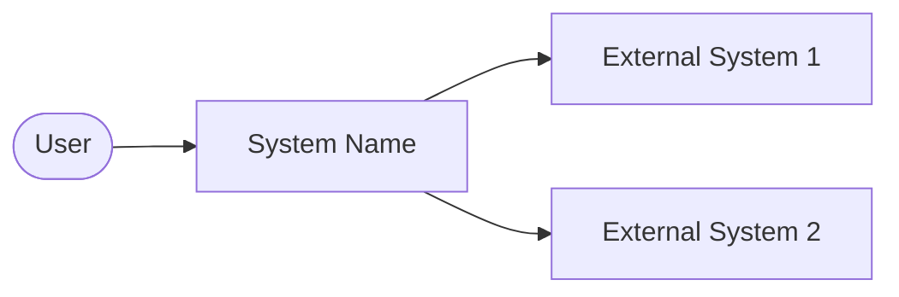
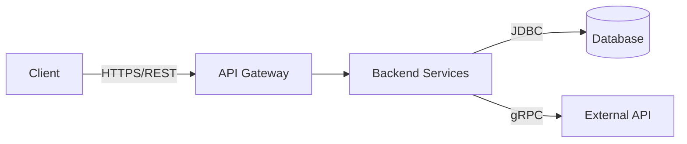
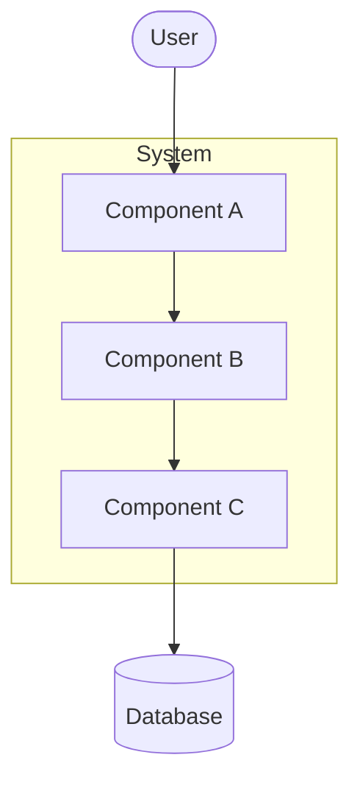
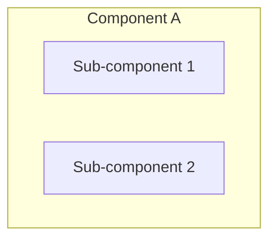
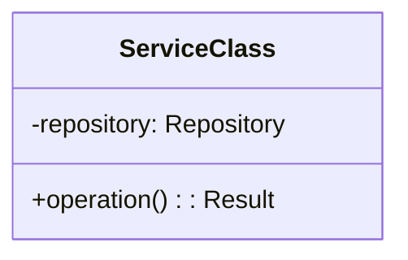
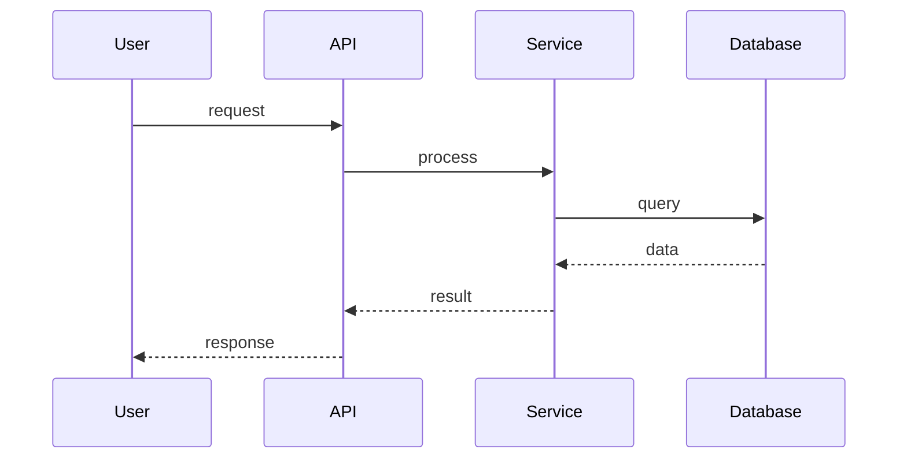
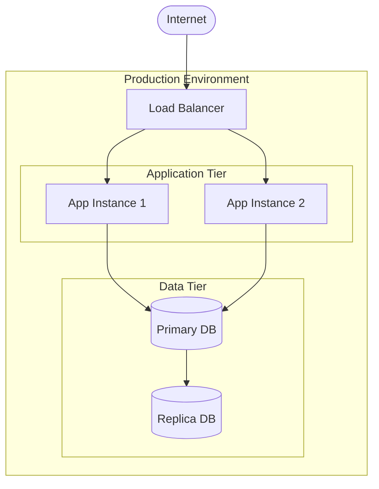
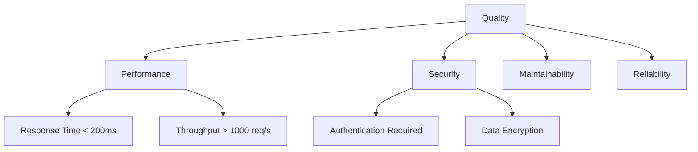

# Arc42 Template Skill

This skill provides the arc42 architecture documentation structure for comprehensive software architecture documentation.

## Arc42 Overview

Arc42 is a template for architecture documentation consisting of 12 sections that cover all aspects of software architecture from requirements to deployment.

## Complete Template Structure

```markdown
# Architecture Documentation: [Project Name]

**Version:** 1.0  
**Date:** [Date]  
**Status:** [Draft/Final]

---

## 1. Introduction and Goals

### 1.1 Requirements Overview
[Brief description of the system's functional requirements]

- **Primary Goal:** [Main purpose of the system]
- **Key Features:**
  - Feature 1
  - Feature 2
  - Feature 3

### 1.2 Quality Goals

| Priority | Quality Goal | Description |
|----------|--------------|-------------|
| 1 | [e.g., Performance] | [Specific requirement] |
| 2 | [e.g., Security] | [Specific requirement] |
| 3 | [e.g., Maintainability] | [Specific requirement] |

### 1.3 Stakeholders

| Role | Expectations |
|------|--------------|
| [Role 1] | [Their expectations] |
| [Role 2] | [Their expectations] |

---

## 2. Architecture Constraints

### 2.1 Technical Constraints

| Constraint | Description |
|------------|-------------|
| Programming Language | [e.g., Java 17] |
| Framework | [e.g., Spring Boot 3.x] |
| Database | [e.g., PostgreSQL 15] |
| Deployment | [e.g., Kubernetes] |

### 2.2 Organizational Constraints

| Constraint | Description |
|------------|-------------|
| Timeline | [Project deadlines] |
| Team | [Team size/skills] |
| Budget | [Budget constraints] |

### 2.3 Conventions

| Convention | Description |
|------------|-------------|
| Coding Standards | [Reference to standards] |
| Documentation | [Documentation requirements] |
| Testing | [Testing requirements] |

---

## 3. System Scope and Context

### 3.1 Business Context

[Diagram showing the system and its business environment]



| Partner | Description |
|---------|-------------|
| User | [Description of user interaction] |
| External System 1 | [What data/services exchanged] |

### 3.2 Technical Context

[Diagram showing technical interfaces and protocols]



| Interface | Protocol | Description |
|-----------|----------|-------------|
| REST API | HTTPS | [Description] |
| Database | JDBC | [Description] |

---

## 4. Solution Strategy

### 4.1 Technology Decisions

| Decision | Rationale |
|----------|-----------|
| [Technology 1] | [Why chosen] |
| [Technology 2] | [Why chosen] |

### 4.2 Architecture Approach

[Description of the overall architectural approach: microservices, monolith, etc.]

### 4.3 Key Design Decisions

| Decision | Context | Consequences |
|----------|---------|--------------|
| [Decision 1] | [Why needed] | [Impact] |
| [Decision 2] | [Why needed] | [Impact] |

---

## 5. Building Block View

### 5.1 Level 1: System Overview



| Building Block | Description |
|----------------|-------------|
| Component A | [Purpose] |
| Component B | [Purpose] |
| Component C | [Purpose] |

### 5.2 Level 2: Component Details

[Detailed breakdown of each major component]

#### Component A



| Sub-component | Responsibility |
|---------------|----------------|
| Sub-component 1 | [What it does] |
| Sub-component 2 | [What it does] |

### 5.3 Level 3: Class/Module View

[UML class diagrams for key modules]



---

## 6. Runtime View

### 6.1 Scenario 1: [Main Use Case]



### 6.2 Scenario 2: [Another Key Flow]

[Additional sequence diagrams for important scenarios]

---

## 7. Deployment View

### 7.1 Infrastructure



### 7.2 Deployment Mapping

| Component | Infrastructure | Notes |
|-----------|---------------|-------|
| Application | Kubernetes Pod | 2 replicas |
| Database | Managed PostgreSQL | Primary + Replica |

---

## 8. Crosscutting Concepts

### 8.1 Security

- **Authentication:** [Method used]
- **Authorization:** [Approach]
- **Data Protection:** [Encryption, etc.]

### 8.2 Logging and Monitoring

- **Logging:** [Framework/approach]
- **Metrics:** [What is collected]
- **Alerting:** [How alerts work]

### 8.3 Error Handling

- **Strategy:** [How errors are handled]
- **Recovery:** [Retry/fallback mechanisms]

### 8.4 Persistence

- **Strategy:** [ORM, direct SQL, etc.]
- **Transactions:** [How managed]

---

## 9. Architecture Decisions

### ADR-001: [Decision Title]

**Status:** Accepted  
**Date:** [Date]

**Context:** [Why this decision was needed]

**Decision:** [What was decided]

**Consequences:**
- Positive: [Benefits]
- Negative: [Drawbacks]

---

## 10. Quality Requirements

### 10.1 Quality Tree



### 10.2 Quality Scenarios

| ID | Quality | Scenario | Measure |
|----|---------|----------|---------|
| QS-1 | Performance | User requests data | Response < 200ms |
| QS-2 | Availability | System failure | Recovery < 5 min |

---

## 11. Risks and Technical Debt

### 11.1 Risks

| Risk | Probability | Impact | Mitigation |
|------|-------------|--------|------------|
| [Risk 1] | High/Med/Low | High/Med/Low | [Action] |

### 11.2 Technical Debt

| Item | Description | Priority | Effort |
|------|-------------|----------|--------|
| [Debt 1] | [Description] | High/Med/Low | [Days] |

---

## 12. Glossary

| Term | Definition |
|------|------------|
| [Term 1] | [Definition] |
| [Term 2] | [Definition] |
```

## Section Purposes

| Section | Purpose | Primary Input |
|---------|---------|---------------|
| 1. Introduction | Goals and stakeholders | Business requirements |
| 2. Constraints | Limitations and conventions | Technical/org requirements |
| 3. Context | System boundaries | System interfaces |
| 4. Solution Strategy | High-level approach | Architecture decisions |
| 5. Building Blocks | Static structure | Code analysis |
| 6. Runtime | Dynamic behavior | Sequence analysis |
| 7. Deployment | Infrastructure | Deployment config |
| 8. Crosscutting | Shared concepts | Pattern analysis |
| 9. Decisions | ADRs | Design rationale |
| 10. Quality | NFRs | Quality requirements |
| 11. Risks | Issues and debt | Code assessment |
| 12. Glossary | Terminology | Domain analysis |

## Tips for Each Section

1. **Introduction**: Focus on business value, not technical details
2. **Constraints**: Be specific and measurable
3. **Context**: Show both business and technical views
4. **Solution Strategy**: Explain the "why" not just "what"
5. **Building Blocks**: Use multiple levels of abstraction
6. **Runtime**: Cover happy path and error scenarios
7. **Deployment**: Include scaling and failover
8. **Crosscutting**: Document patterns used consistently
9. **Decisions**: Use ADR format for traceability
10. **Quality**: Make requirements testable
11. **Risks**: Include mitigation strategies
12. **Glossary**: Define domain-specific terms
