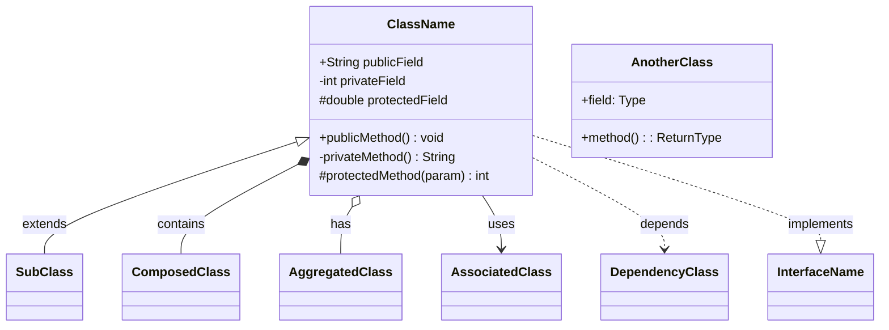
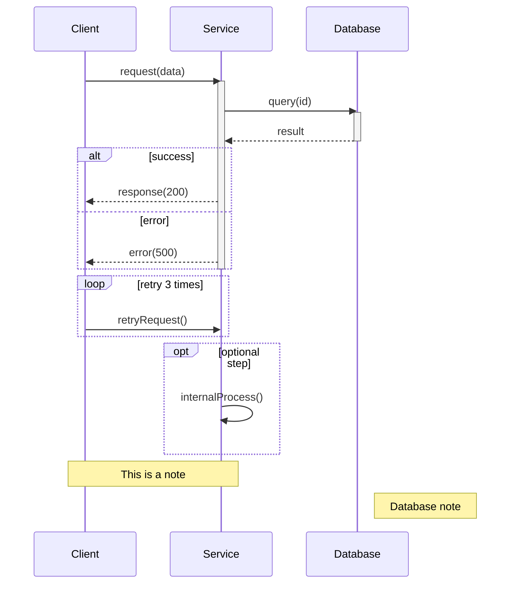
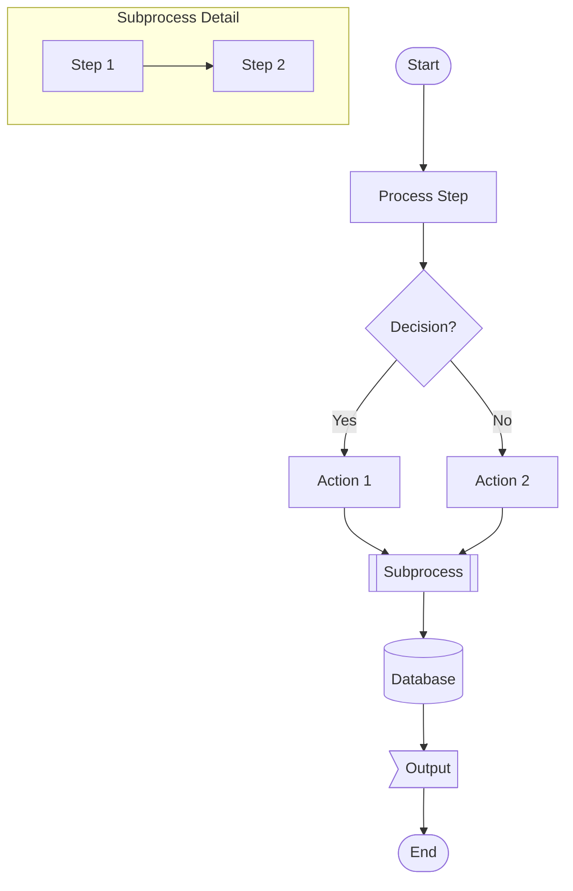
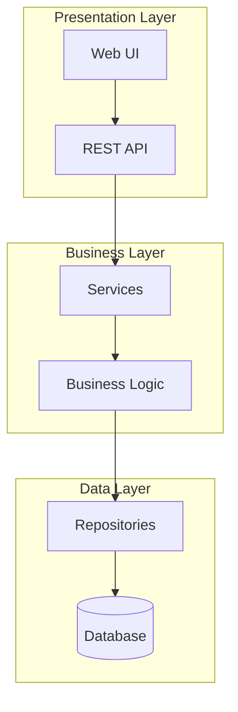
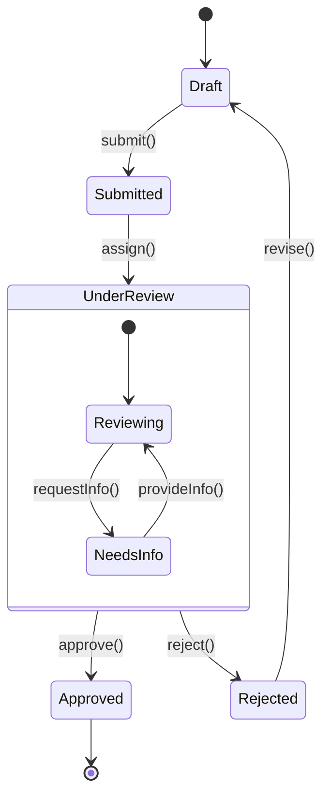
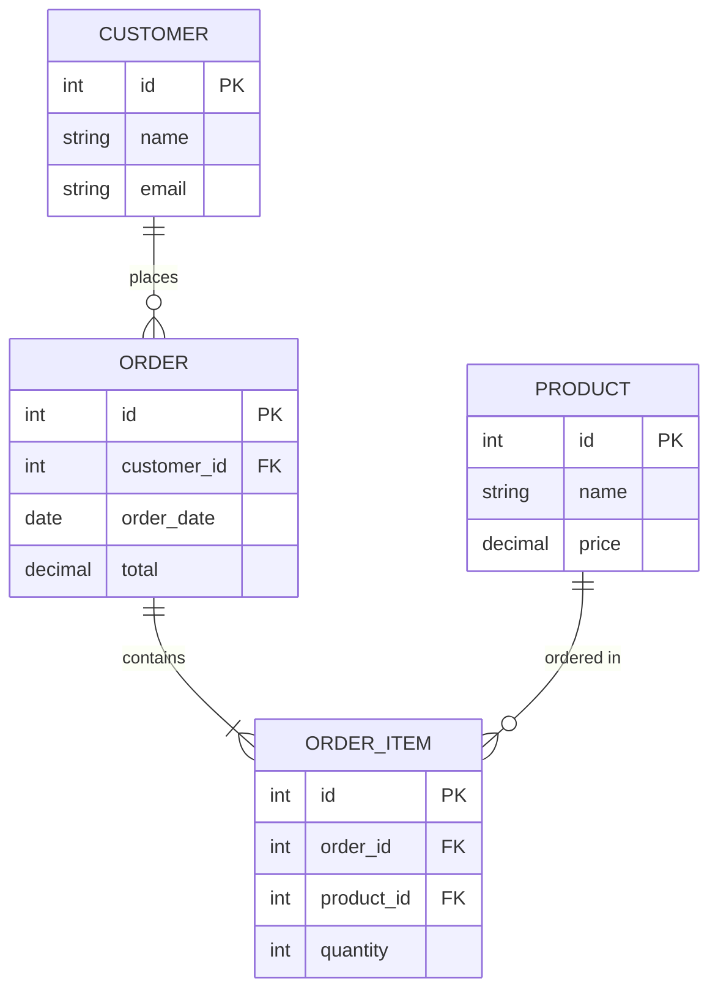
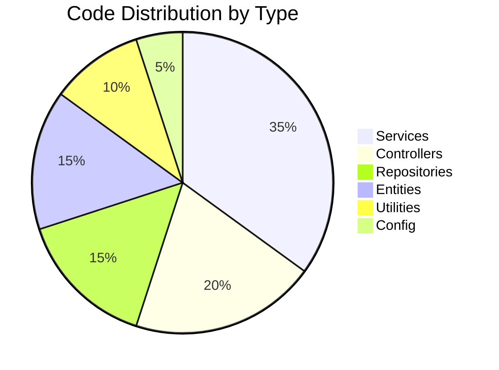

# Mermaid Diagrams Skill

This skill provides Mermaid syntax reference for generating diagrams in GenInsights documentation.

## Diagram Types

### 1. Class Diagram

**Relationship Types:**
| Symbol | Meaning |
|--------|---------|
| `<\|--` | Inheritance (extends) |
| `*--` | Composition (contains, lifecycle bound) |
| `o--` | Aggregation (has, independent lifecycle) |
| `-->` | Association (uses) |
| `..>` | Dependency (depends on) |
| `..\|>` | Realization (implements) |

**Visibility Modifiers:**
| Symbol | Meaning |
|--------|---------|
| `+` | Public |
| `-` | Private |
| `#` | Protected |
| `~` | Package/Internal |

### 2. Sequence Diagram

**Arrow Types:**
| Symbol | Meaning |
|--------|---------|
| `->>` | Solid line with arrowhead (sync call) |
| `-->>` | Dashed line with arrowhead (response) |
| `--)` | Solid line with open arrow (async) |
| `--)` | Dashed line with open arrow |
| `-x` | Solid line with X (lost message) |

### 3. Flowchart (BPMN-style)

**Node Shapes:**
| Syntax | Shape | Use For |
|--------|-------|---------|
| `[text]` | Rectangle | Process/Action |
| `([text])` | Stadium | Start/End |
| `{text}` | Diamond | Decision |
| `[[text]]` | Subroutine | Subprocess |
| `[(text)]` | Cylinder | Database |
| `((text))` | Circle | Connector |
| `>text]` | Flag | Output |
| `{{text}}` | Hexagon | Preparation |

**Direction:**
| Code | Direction |
|------|-----------|
| `TD` or `TB` | Top to Bottom |
| `BT` | Bottom to Top |
| `LR` | Left to Right |
| `RL` | Right to Left |

### 4. Component Diagram (using flowchart)

### 5. State Diagram

### 6. Entity Relationship Diagram

**ER Relationship Notation:**
| Symbol | Meaning |
|--------|---------|
| `\|\|` | Exactly one |
| `o\|` | Zero or one |
| `}o` | Zero or more |
| `}\|` | One or more |

### 7. Pie Chart

## Best Practices

1. **Keep diagrams focused** - One concept per diagram
2. **Use meaningful names** - Full class/method names, not abbreviations
3. **Add notes** - Clarify complex relationships
4. **Limit size** - Max 15-20 nodes per diagram for readability
5. **Use subgraphs** - Group related components
6. **Consistent styling** - Same patterns across all diagrams

## Common Issues & Fixes

| Issue | Fix |
|-------|-----|
| Special characters in text | Wrap in quotes: `["Text with (parens)"]` |
| Long labels | Use aliases: `participant S as ServiceName` |
| Arrow not rendering | Check arrow syntax matches diagram type |
| Subgraph not working | Ensure proper nesting and closing |

## Embedding in Markdown

Always use fenced code blocks:

~~~markdown

~~~
