# Arc42 Architecture Documentation

**Project**: Simple Calculator — Streamlit Web Application  
**Repository**: [xinni-cap/github-copilot-test](https://github.com/xinni-cap/github-copilot-test)  
**Version**: 1.0.0  
**Date**: 2025-01-30  
**Generated by**: Arc42 Documentation Generator  
**Language**: Python 3 · **Framework**: Streamlit ≥ 1.40.0  

---

> **Status**: Functionally correct minimal-viable utility · NOT production-ready  
> **Overall Health Score**: 4.0 / 10 · **Total LOC**: 50 · **Estimated Remediation**: ~30–40 person-hours

---

## Table of Contents

1. [Introduction and Goals](#1-introduction-and-goals)
2. [Constraints](#2-constraints)
3. [Context and Scope](#3-context-and-scope)
4. [Solution Strategy](#4-solution-strategy)
5. [Building Block View](#5-building-block-view)
6. [Runtime View](#6-runtime-view)
7. [Deployment View](#7-deployment-view)
8. [Crosscutting Concepts](#8-crosscutting-concepts)
9. [Architecture Decisions](#9-architecture-decisions)
10. [Quality Requirements](#10-quality-requirements)
11. [Risks and Technical Debt](#11-risks-and-technical-debt)
12. [Glossary](#12-glossary)

---

## 1. Introduction and Goals

### 1.1 Purpose and Business Context

The **Simple Calculator** is a single-page web utility built on the [Streamlit](https://streamlit.io/) framework. It provides users with a browser-based interface to perform the four fundamental arithmetic operations — addition, subtraction, multiplication, and division — on real-number inputs with up to six decimal places of precision.

The application was created as a demonstration project for the `xinni-cap/github-copilot-test` repository, showcasing how a minimal interactive web tool can be assembled using Python and Streamlit with approximately 50 lines of code.

### 1.2 Goals

| ID  | Goal | Priority |
|-----|------|----------|
| G-1 | Allow users to perform Add, Subtract, Multiply, and Divide operations on two numeric inputs | High |
| G-2 | Display results as human-readable infix expressions (`num1 OP num2 = result`) | High |
| G-3 | Prevent division-by-zero errors from causing unhandled exceptions | High |
| G-4 | Provide an expandable computation-details panel for transparency | Medium |
| G-5 | Run locally without any backend database, authentication, or external service | Low |

### 1.3 Quality Goals

The following quality attributes were derived from code analysis of the current implementation and the project's stated objectives:

| Priority | Quality Goal | Motivation |
|----------|-------------|------------|
| 1 | **Correctness** | Arithmetic results must be mathematically accurate; division-by-zero must be handled gracefully |
| 2 | **Usability** | The UI must be operable without instructions; default values and layout must be intuitive |
| 3 | **Maintainability** | Codebase should be structured to allow safe modification; currently the lowest-scoring attribute |
| 4 | **Reliability** | The application should not raise unhandled exceptions during normal user interactions |
| 5 | **Testability** | Business logic should be independently verifiable without spinning up a UI session |

### 1.4 Stakeholders

| Role | Name / Group | Expectations |
|------|-------------|--------------|
| Developer / Owner | xinni-cap | Working feature demonstration; readable code |
| End User | Any browser user | Fast, accurate arithmetic; clear error messages |
| Reviewer / Assessor | GitHub Copilot test evaluators | Code quality, architecture clarity, test coverage |
| Future Maintainer | Any Python developer | Ability to extend operations, add tests, deploy to cloud |

---

## 2. Constraints

### 2.1 Technical Constraints

| ID  | Constraint | Source |
|-----|-----------|--------|
| TC-1 | **Language**: Python 3 only — Streamlit does not support Python 2 | `requirements.txt` |
| TC-2 | **Framework**: Streamlit ≥ 1.40.0 is the sole declared dependency | `requirements.txt` |
| TC-3 | **Execution model**: Streamlit reruns the entire script top-to-bottom on every user interaction (reactive/stateless per-render model) | Streamlit architecture |
| TC-4 | **Single-file architecture**: All logic resides in `app.py`; no module structure enforced by tooling | `app.py` source |
| TC-5 | **No persistence layer**: No database, file system writes, or session storage beyond Streamlit's ephemeral session state | `app.py` source |
| TC-6 | **No external APIs**: The application is fully self-contained and offline-capable | `app.py` source |
| TC-7 | **Local execution only**: No containerization, CI/CD pipeline, or cloud deployment configuration exists | Repository state |
| TC-8 | **Floating-point arithmetic**: Python's native IEEE 754 `float` is used; no arbitrary-precision library | `app.py` source |

### 2.2 Organizational Constraints

| ID  | Constraint | Source |
|-----|-----------|--------|
| OC-1 | **Zero test coverage**: No `tests/` directory, no pytest configuration, no CI workflow | Repository state |
| OC-2 | **No type annotations**: The codebase contains no PEP 484 type hints | `app.py` source |
| OC-3 | **No docstrings**: No module, function, or class documentation strings | `app.py` source |
| OC-4 | **No linting configuration**: No `.flake8`, `pyproject.toml`, or `ruff.toml` present | Repository state |
| OC-5 | **Hard-coded operation strings**: Operation labels duplicated between `st.selectbox()` and `if/elif` chain | `app.py` lines 16–39 |

### 2.3 Conventions

| Convention | Detail |
|-----------|--------|
| Numeric precision | All inputs displayed and formatted to 6 decimal places (`"%.6f"`) |
| Default operation | Addition is always the pre-selected operation (`index=0`) |
| Default numeric inputs | Both operands default to `0.0` |
| Error handling style | `st.error()` + `st.stop()` pattern for fatal validation failures |
| Result format | Infix string: `"{num1} {symbol} {num2} = {result}"` |

---

## 3. Context and Scope

### 3.1 Business Context

The Simple Calculator operates entirely within a single user's browser session. There are no external system integrations, third-party services, or data exchange partners. The system boundary is the Streamlit web application process running on a local machine.

**External actors:**

| Actor | Interaction | Direction |
|-------|------------|-----------|
| Human User | Enters operands, selects operation, submits form, reads result | Bidirectional (HTTP/WebSocket) |
| Local Python Interpreter | Executes the script, evaluates arithmetic | Internal |
| Web Browser | Renders the Streamlit-generated HTML/CSS/JS UI | Client |

### 3.2 C4 Level 1 — System Context Diagram

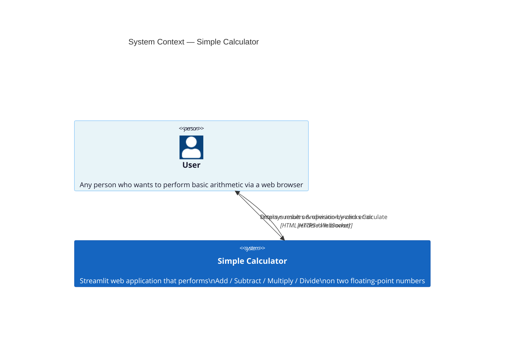

### 3.3 C4 Level 2 — Container Diagram

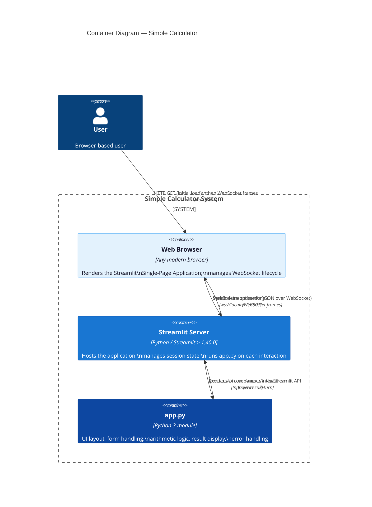

### 3.4 Technical Context

The application communicates exclusively over the local network loopback interface. There is no TLS termination, authentication layer, or reverse proxy in the current setup.

| Interface | Protocol | Port | Description |
|-----------|---------|------|-------------|
| Browser ↔ Streamlit | HTTP (initial) | 8501 | Static asset delivery on first load |
| Browser ↔ Streamlit | WebSocket | 8501 | Real-time bidirectional UI updates |
| Streamlit ↔ Python | In-process | N/A | Script re-execution on every render cycle |

---

## 4. Solution Strategy

### 4.1 Technology Decisions

| Decision | Choice | Rationale |
|----------|--------|-----------|
| UI Framework | Streamlit ≥ 1.40.0 | Rapid prototyping of data/utility apps in pure Python; no JavaScript required |
| Language | Python 3 | Streamlit's native language; ubiquitous for data and scripting workloads |
| Arithmetic | Python built-in `float` (IEEE 754) | Sufficient for a demonstration calculator; no arbitrary-precision requirement stated |
| Persistence | None | Stateless per-session design; calculator results are ephemeral by nature |
| Deployment | `streamlit run app.py` (local) | Simplest possible launch mechanism; no infrastructure overhead |

### 4.2 Top-Level Decomposition Strategy

The current implementation uses a **flat script** strategy — all concerns (page configuration, layout, form handling, business logic, result rendering) are co-located in a single 50-line file. This is acceptable for a demonstration but violates the **Single Responsibility Principle** at scale.

The recommended decomposition strategy for future growth is a **two-module separation**:

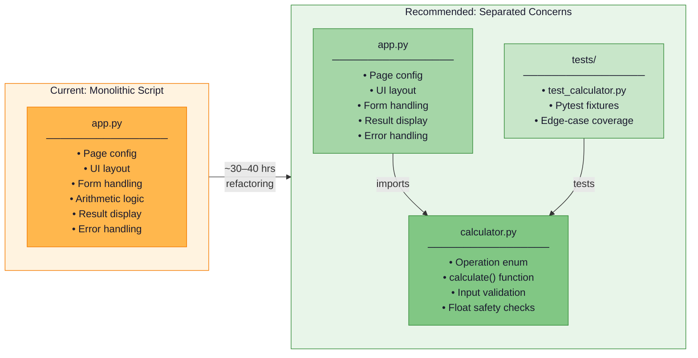

### 4.3 Approaches to Quality Goals

| Quality Goal | Current Approach | Recommended Approach |
|-------------|-----------------|---------------------|
| Correctness | `if/elif` chain + division guard | Extract `calculate()` with `math.isinf`/`math.isnan` guards |
| Usability | Streamlit default widgets with sensible defaults | No change needed at current scope |
| Maintainability | Single flat script | Separate `calculator.py` module + type hints + docstrings |
| Reliability | `st.stop()` halts render on error | Add `try/except` in UI layer; raise from logic layer |
| Testability | Untestable (UI and logic fused) | Pure `calculate()` function — fully unit-testable without Streamlit |

---

## 5. Building Block View

### 5.1 Level 1 — High-Level System Decomposition

The system is composed of a single deployable unit (the Streamlit application process) containing logically separable internal blocks:

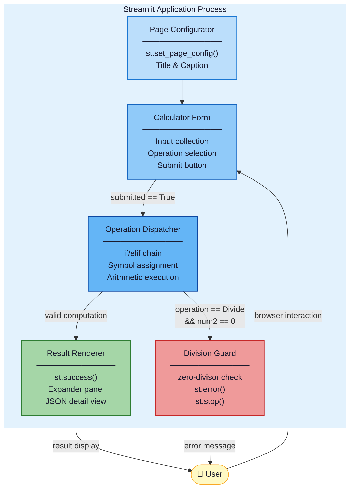

### 5.2 Level 2 — Internal Component Structure of app.py

```mermaid
graph TB
    subgraph app_py["app.py — Internal Structure"]
        direction TB

        subgraph init["Initialization Block (lines 1–6)"]
            IMP["import streamlit as st"]
            PGC["st.set_page_config()\n  page_title='Calculator'\n  page_icon='🧮'\n  layout='centered'"]
            TTL["st.title() + st.caption()"]
        end

        subgraph form_block["Form Block (lines 8–22)"]
            FRM["st.form('calculator_form')"]
            COLS["st.columns(2)\n  col1 | col2"]
            NUM1["st.number_input('First number')\n  value=0.0, format='%.6f'"]
            NUM2["st.number_input('Second number')\n  value=0.0, format='%.6f'"]
            SEL["st.selectbox('Operation')\n  Add | Subtract | Multiply | Divide\n  index=0"]
            SUB["st.form_submit_button('Calculate')\n  → submitted: bool"]
        end

        subgraph logic_block["Logic Block (lines 24–39)"]
            COND["if submitted:"]
            ADD["operation == 'Add'\n  result = num1 + num2\n  symbol = '+'"]
            SUB2["operation == 'Subtract'\n  result = num1 - num2\n  symbol = '-'"]
            MUL["operation == 'Multiply'\n  result = num1 × num2\n  symbol = '×'"]
            DIV["operation == 'Divide'\n  symbol = '÷'\n  [guard] num2 == 0 → error\n  result = num1 / num2"]
        end

        subgraph render_block["Render Block (lines 41–49)"]
            SUCC["st.success(f'Result: ...')"]
            EXP["st.expander('Computation details')\n  st.write(dict)"]
        end

        init --> form_block
        form_block --> logic_block
        logic_block --> render_block
    end

    style app_py fill:#f5f5f5,stroke:#616161,color:#1a1a2e
    style init fill:#e8eaf6,stroke:#3949AB,color:#1a1a2e
    style form_block fill:#e3f2fd,stroke:#1565C0,color:#1a1a2e
    style logic_block fill:#fff3e0,stroke:#E65100,color:#1a1a2e
    style render_block fill:#e8f5e9,stroke:#2E7D32,color:#1a1a2e
```

### 5.3 Level 3 — Data Entities and Operations

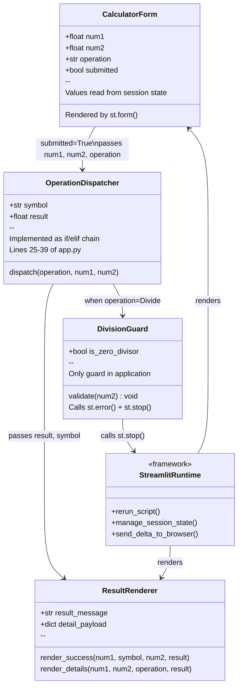

---

## 6. Runtime View

### 6.1 Happy Path — Successful Calculation

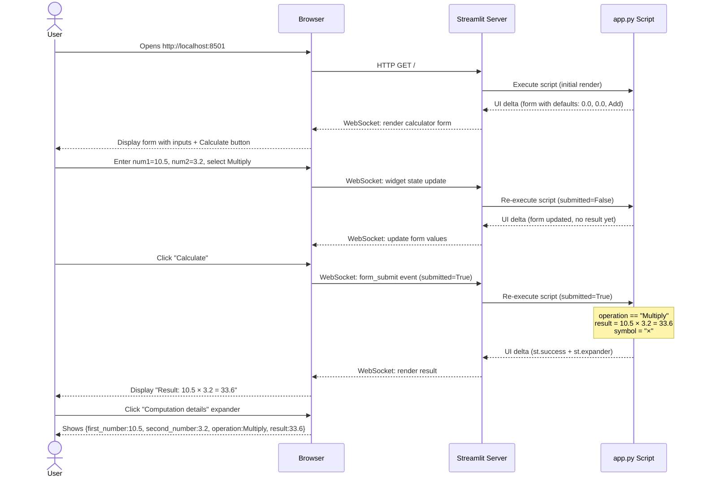

### 6.2 Error Path — Division by Zero

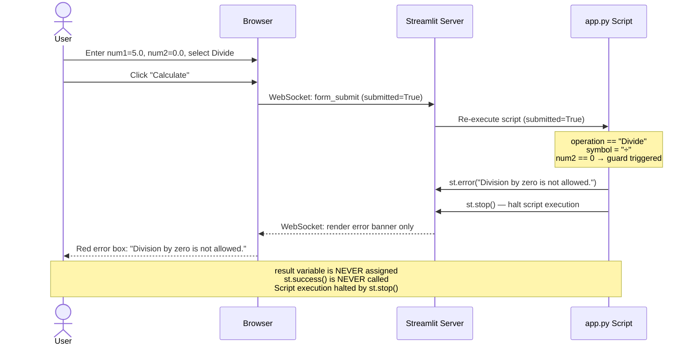

### 6.3 Application State Machine

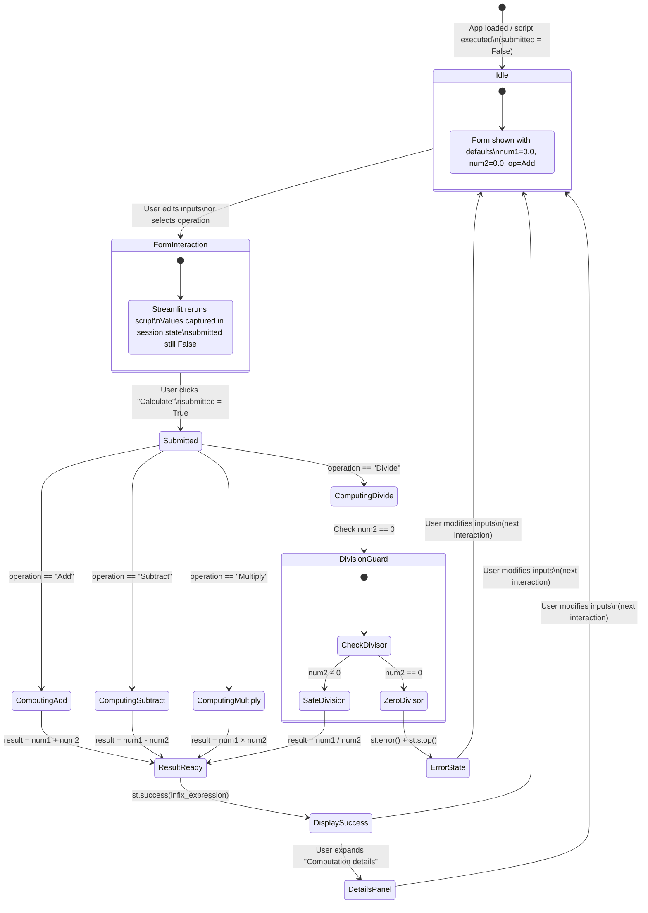

### 6.4 Data Flow — End-to-End

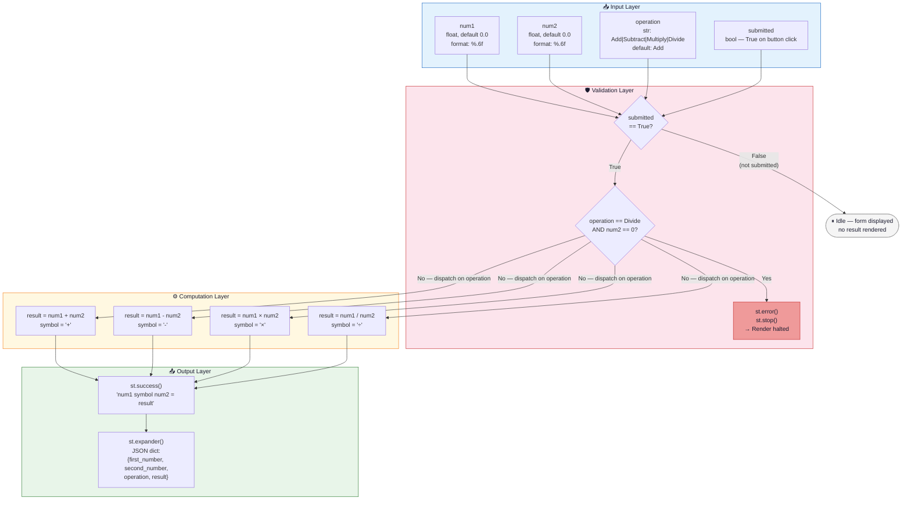

---

## 7. Deployment View

### 7.1 Local Development Deployment

The current deployment is entirely local. There is no containerization, cloud infrastructure, or CI/CD pipeline.

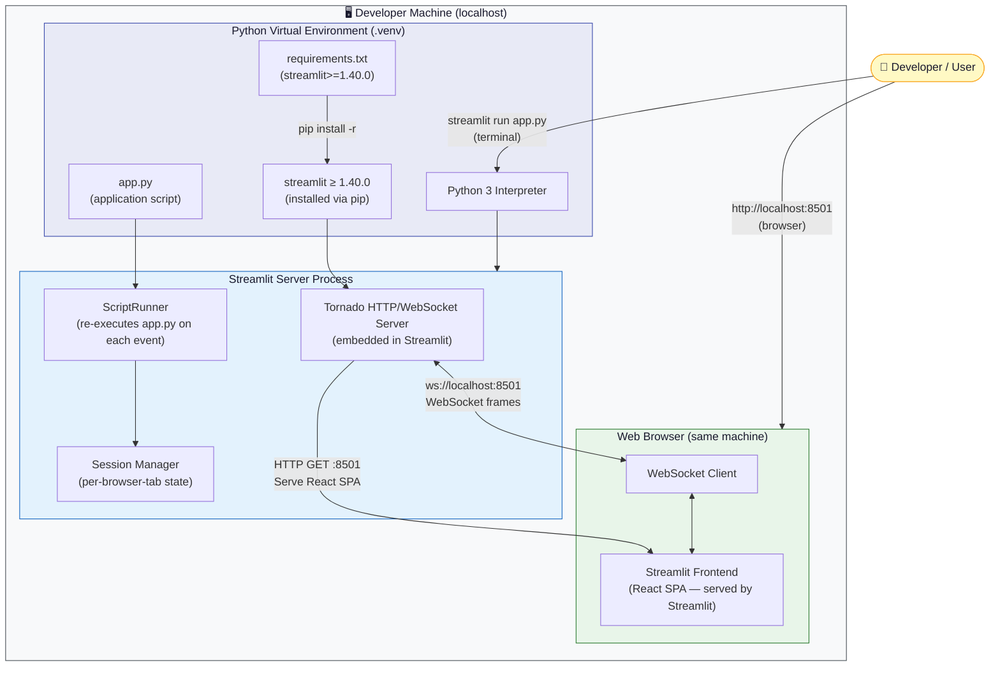

### 7.2 Deployment Steps

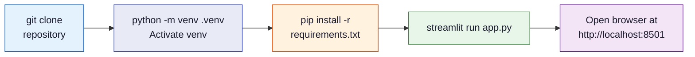

### 7.3 Infrastructure Requirements

| Requirement | Value |
|-------------|-------|
| Operating System | Any OS with Python 3 (Linux, macOS, Windows) |
| Python Version | 3.8+ (Streamlit ≥ 1.40.0 requirement) |
| RAM | ~200–400 MB (Streamlit process) |
| Disk | ~150 MB (Streamlit + dependencies) |
| Network Port | TCP 8501 (localhost only) |
| External connectivity | None required |

---

## 8. Crosscutting Concepts

### 8.1 Domain Model

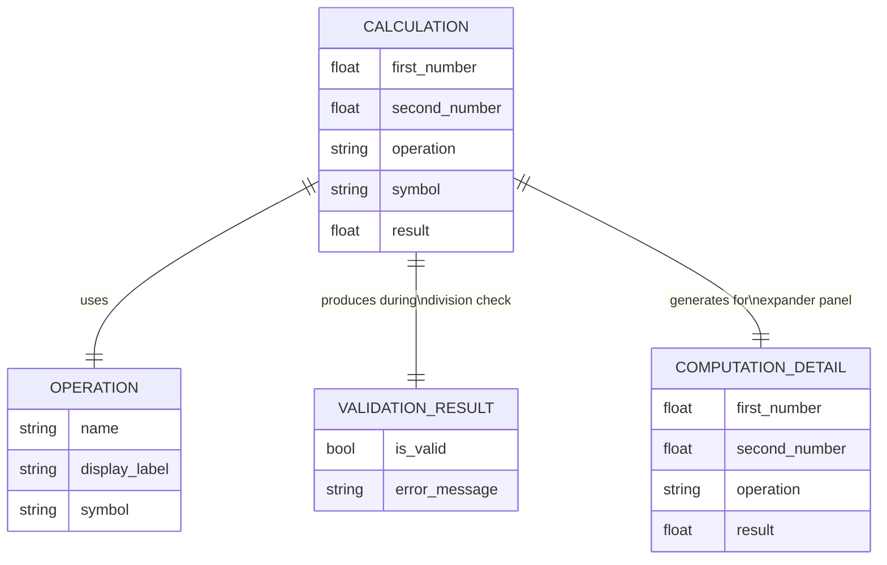

### 8.2 Business Rules

All business rules are encoded directly in `app.py` with no abstraction layer:

| ID | Rule | Location | Risk Level |
|----|------|----------|-----------|
| BR-1 | Division by zero is prohibited; triggers `st.error()` + `st.stop()` | `app.py:36–38` | ✅ Handled |
| BR-2 | Numeric inputs default to `0.0` with 6 decimal places of precision | `app.py:12–13` | ✅ Handled |
| BR-3 | Addition is the default operation (`index=0` in selectbox) | `app.py:19` | ✅ Handled |
| BR-4 | Supported operations are exactly: Add, Subtract, Multiply, Divide | `app.py:17–18` | ✅ Handled |
| BR-5 | Result is displayed as infix expression: `num1 symbol num2 = result` | `app.py:41` | ✅ Handled |
| BR-6 | Computation details (JSON dict) are shown in a collapsible expander | `app.py:43–49` | ✅ Handled |
| BR-7 | Calculation is only triggered on explicit form submission | `app.py:22,24` | ✅ Handled |
| BR-8 | Float overflow (`inf`) and NaN results are **not** detected | — | ⚠️ Missing |
| BR-9 | No input range validation (e.g., extremely large floats) | — | ⚠️ Missing |

### 8.3 Error Handling Concept

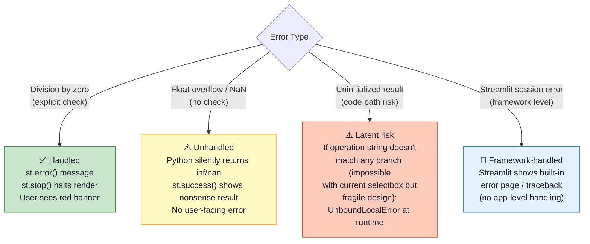

### 8.4 Design Patterns Identified

| Pattern | Application | Location |
|---------|------------|---------|
| **Script-driven reactive UI** | Streamlit's whole-script re-execution model; no explicit event loop | Entire `app.py` |
| **Form + Submit guard** | `st.form()` prevents widget interactions from triggering re-runs until submit | `app.py:8–22` |
| **Strategy (implicit, flat)** | `if/elif` chain selects arithmetic operation based on string key | `app.py:25–39` |
| **Stop-on-error** | `st.stop()` as an early-exit mechanism analogous to a guard clause | `app.py:37–38` |
| **Expander disclosure** | Progressive disclosure of computation details to avoid UI clutter | `app.py:43–49` |

### 8.5 Streamlit Reactive Execution Model

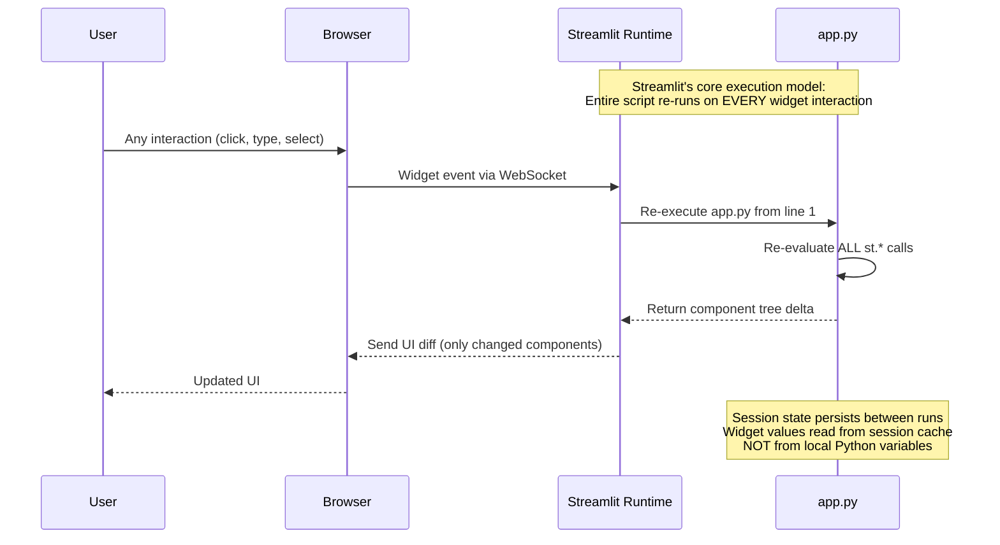

---

## 9. Architecture Decisions

### ADR-001: Single-File Architecture

**Status**: Accepted (current) → Superseded (recommended)  
**Date**: Project inception  
**Context**: A minimal calculator with 50 LOC needs no module structure for functionality.  
**Decision**: All code resides in `app.py`.  
**Consequences**:
- ✅ Zero module overhead; single file to run and understand
- ❌ Business logic not independently testable
- ❌ Hard-coded strings duplicated between UI (`selectbox`) and logic (`if/elif`)
- ❌ Violates Single Responsibility Principle

---

### ADR-002: Streamlit as the UI Framework

**Status**: Accepted  
**Date**: Project inception  
**Context**: Needed a quick, Python-native way to expose a web UI without writing HTML/CSS/JS.  
**Decision**: Use Streamlit ≥ 1.40.0.  
**Consequences**:
- ✅ Zero frontend code; all UI defined in Python
- ✅ Built-in form, error, expander, and column components
- ✅ WebSocket-based reactivity with no manual wiring
- ❌ Entire script re-executes on every interaction (performance overhead at scale)
- ❌ Tight coupling between UI framework and script structure

---

### ADR-003: No Persistence or Session State

**Status**: Accepted  
**Date**: Project inception  
**Context**: Calculator results are ephemeral; no history or user accounts required.  
**Decision**: Do not use `st.session_state`, databases, or any file I/O.  
**Consequences**:
- ✅ Stateless per render cycle; no data leakage between users
- ✅ No infrastructure dependencies
- ❌ Results lost on page reload
- ❌ No calculation history feature

---

### ADR-004: String-Based Operation Dispatch (if/elif)

**Status**: Accepted (current) → Superseded (recommended)  
**Date**: Project inception  
**Context**: Simple dispatch between four operations.  
**Decision**: Use a plain `if/elif` chain comparing string literals from `st.selectbox()`.  
**Consequences**:
- ✅ Simple and readable for 4 operations
- ❌ String literals duplicated in `selectbox` options AND `if/elif` conditions
- ❌ Adding an operation requires changes in two places → fragile
- ❌ No compile-time safety on the string comparison

**Recommended Alternative** (ADR-004-R):
```python
from enum import Enum
class Operation(Enum):
    ADD = "Add"
    SUBTRACT = "Subtract"
    MULTIPLY = "Multiply"
    DIVIDE = "Divide"
```

---

### ADR-005: Division-by-Zero as the Only Input Validation

**Status**: Accepted (current) → Needs extension  
**Date**: Project inception  
**Context**: The application has one obvious numeric edge case: division by zero.  
**Decision**: Guard only for `num2 == 0` when operation is Divide.  
**Consequences**:
- ✅ Prevents the one runtime exception that is likely in normal use
- ❌ No protection against float overflow (→ `inf`) or NaN propagation
- ❌ No protection against extremely large inputs
- ❌ `result` variable is uninitialized if the `else` branch is taken with `num2 == 0` and `st.stop()` is not reached (race condition in theory)

---

### ADR-006: No Automated Tests

**Status**: Accepted (current) → Must be remediated  
**Date**: Project inception  
**Context**: Demonstration project; tests not a stated requirement.  
**Decision**: Ship with zero test coverage.  
**Consequences**:
- ✅ No test setup time
- ❌ Regressions cannot be detected automatically
- ❌ Logic correctness relies solely on manual testing
- ❌ CI/CD pipeline cannot provide quality gates

**Remediation** (estimated effort: 4–8 hours):
```python
# tests/test_calculator.py
import pytest
from calculator import calculate, Operation

def test_add():        assert calculate(Operation.ADD, 1.0, 2.0) == 3.0
def test_subtract():   assert calculate(Operation.SUBTRACT, 5.0, 3.0) == 2.0
def test_multiply():   assert calculate(Operation.MULTIPLY, 4.0, 2.5) == 10.0
def test_divide():     assert calculate(Operation.DIVIDE, 10.0, 4.0) == 2.5
def test_div_by_zero():
    with pytest.raises(ValueError, match="Division by zero"):
        calculate(Operation.DIVIDE, 1.0, 0.0)
```

---

## 10. Quality Requirements

### 10.1 Quality Tree

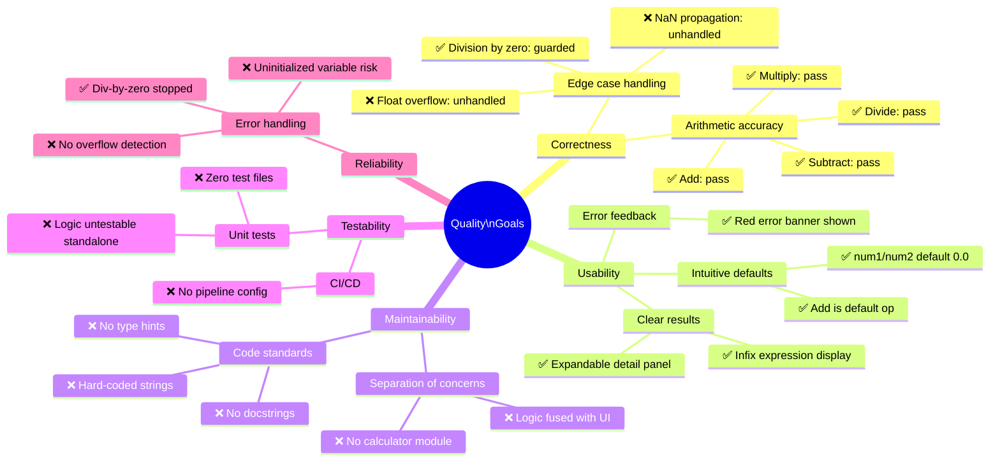

### 10.2 Code Quality Metrics

| Metric | Value | Assessment |
|--------|-------|-----------|
| **Overall Health Score** | 4.0 / 10 | ⚠️ Below acceptable threshold |
| **Cyclomatic Complexity** | 6 | ✅ Low (threshold: <10) |
| **Lines of Code** | 50 | ✅ Minimal |
| **Streamlit API Calls** | 14 total, 11 unique methods | ✅ Appropriate for scope |
| **Test Coverage** | 0% | ❌ Critical gap |
| **Type Hint Coverage** | 0% | ❌ No annotations |
| **Docstring Coverage** | 0% | ❌ No documentation |
| **Number of Functions** | 0 | ❌ All imperative, no functions |
| **Number of Classes** | 0 | ❌ No OO structure |
| **Hard-coded literals** | 4 operation strings × 2 locations | ⚠️ Duplication risk |
| **Input validation rules** | 1 of 3+ needed | ⚠️ Incomplete |

### 10.3 Quality Scenarios

| ID | Quality Attribute | Stimulus | Response | Measure |
|----|------------------|---------|---------|---------|
| QS-1 | Correctness | User inputs `10.5 + 3.2` and submits | Result displays `13.700000` | Error ≤ 1e-6 |
| QS-2 | Reliability | User inputs `5 ÷ 0` and submits | Red error banner; no exception raised | `st.stop()` invoked within 1 render cycle |
| QS-3 | Usability | First-time user opens app | Form is self-explanatory without instructions | No help text needed |
| QS-4 | Maintainability | Developer adds a 5th operation (Modulo) | Change requires ≤ 2 file edits; no regression | Current: fragile (2+ locations); Recommended: 1 location |
| QS-5 | Testability | CI pipeline runs test suite | All arithmetic correctness tests pass | Current: 0 tests; Target: ≥ 10 unit tests |
| QS-6 | Performance | User submits calculation | Result appears in < 500ms on localhost | Achieved in current implementation |

---

## 11. Risks and Technical Debt

### 11.1 Risk Register

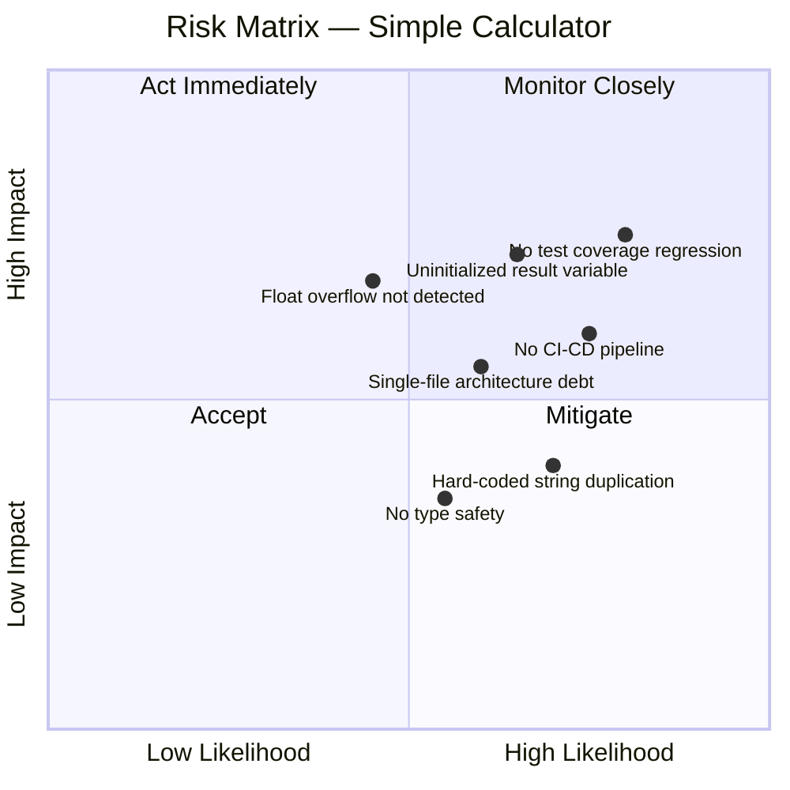

### 11.2 Detailed Risk Analysis

| ID | Risk | Likelihood | Impact | Severity | Mitigation |
|----|------|-----------|--------|---------|-----------|
| R-1 | **Uninitialized `result` variable** — If the `else` (Divide) branch is taken and `st.stop()` is called, `result` is never assigned. In a refactored flow, accessing `result` after the `if submitted:` block would raise `UnboundLocalError` | Medium | High | 🔴 High | Initialize `result = None` before the `if submitted:` block; wrap in `try/except` |
| R-2 | **Float overflow / NaN** — Operations on very large numbers silently return `inf` or `nan` without any user-visible error | Medium | High | 🔴 High | Add `math.isinf()` / `math.isnan()` checks post-computation |
| R-3 | **Zero test coverage** — Any future change to the arithmetic logic could silently introduce regression with no automated detection | High | High | 🔴 Critical | Extract `calculate()` function; write pytest suite |
| R-4 | **Hard-coded operation strings** — Operation labels in `selectbox` and `if/elif` are independent string literals; a typo or rename in one location breaks the other | High | Medium | 🟠 Medium | Use `Operation` enum shared between UI and logic |
| R-5 | **No CI/CD pipeline** — No automated quality gate prevents broken code from being committed | High | Medium | 🟠 Medium | Add GitHub Actions workflow with `pytest` + `ruff` |
| R-6 | **No type hints** — Function signatures and variable types are implicit, increasing cognitive load for maintainers | Medium | Low | 🟡 Low | Add PEP 484 annotations; run `mypy` in CI |
| R-7 | **Single-file architecture** — Business logic not independently testable or reusable | High | Medium | 🟠 Medium | Refactor to `calculator.py` + `app.py` (see ADR-004-R) |

### 11.3 Technical Debt Summary

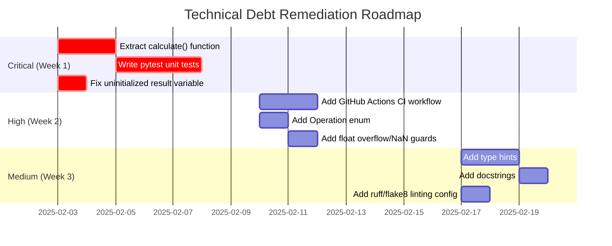

### 11.4 Remediation Effort Estimates

| Item | Effort | Priority | ROI |
|------|--------|---------|-----|
| Extract `calculate()` + pytest suite | 4–8 hours | 🔴 Critical | ⭐⭐⭐⭐⭐ Highest |
| Fix uninitialized `result` variable | 0.5 hours | 🔴 Critical | ⭐⭐⭐⭐⭐ Highest |
| Add `Operation` enum | 1–2 hours | 🟠 High | ⭐⭐⭐⭐ |
| Add float overflow/NaN guards | 1–2 hours | 🟠 High | ⭐⭐⭐⭐ |
| GitHub Actions CI workflow | 2–4 hours | 🟠 High | ⭐⭐⭐⭐ |
| Type hints + docstrings | 2–4 hours | 🟡 Medium | ⭐⭐⭐ |
| Linting configuration | 1 hour | 🟡 Medium | ⭐⭐⭐ |
| **Total** | **~30–40 hours** | | |

### 11.5 Recommended Future Architecture

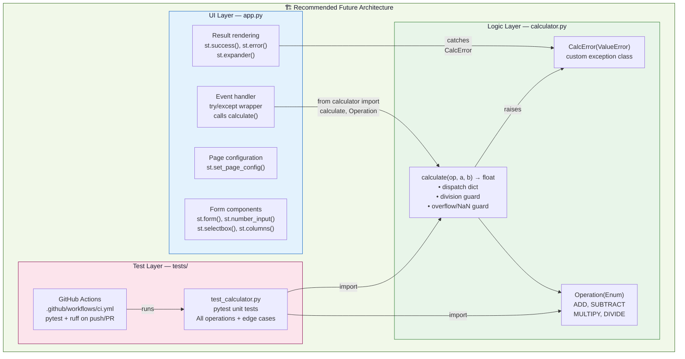

---

## 12. Glossary

### 12.1 Domain Terms

| Term | Definition | Source |
|------|-----------|--------|
| **Operand** | A numeric value on which an arithmetic operation is performed (`num1`, `num2` in the codebase) | `app.py:12–13` |
| **Operation** | One of the four supported arithmetic functions: Add, Subtract, Multiply, Divide | `app.py:17–18` |
| **Symbol** | The mathematical notation for an operation used in result display (`+`, `-`, `×`, `÷`) | `app.py:26–35` |
| **Result** | The floating-point output of applying the selected operation to the two operands | `app.py:41` |
| **Infix expression** | Result display format: `num1 symbol num2 = result` (e.g., `5.0 + 3.0 = 8.0`) | `app.py:41` |
| **Computation details** | A dictionary payload shown in the expandable panel: `{first_number, second_number, operation, result}` | `app.py:44–48` |
| **Division guard** | The conditional check `if num2 == 0` that prevents division-by-zero execution | `app.py:36–38` |

### 12.2 Technical Terms

| Term | Definition |
|------|-----------|
| **Streamlit** | An open-source Python framework for building interactive web applications without JavaScript; version ≥ 1.40.0 is required |
| **Reactive execution model** | Streamlit's core behavior: the entire `app.py` script is re-executed from top to bottom on every user interaction (widget event) |
| **Session state** | Streamlit's mechanism (`st.session_state`) for persisting values across script re-executions within a single browser session; not used in this application |
| **st.form()** | A Streamlit context manager that batches all widget interactions within it, only triggering a script re-run when the submit button is clicked |
| **st.stop()** | A Streamlit function that immediately halts the current script execution, preventing any subsequent rendering calls from being processed |
| **st.form_submit_button()** | A special Streamlit button that only works inside `st.form()` and returns `True` on the first re-run after the user clicks it |
| **Delta** | Streamlit's internal representation of UI changes sent over WebSocket; only modified components are transmitted to the browser |
| **ScriptRunner** | The internal Streamlit component responsible for executing the user's Python script in a background thread |
| **Cyclomatic complexity** | A software metric measuring the number of linearly independent paths through a program's source code; score of 6 in this application |
| **IEEE 754** | The international standard for floating-point arithmetic implemented by Python's `float` type; relevant to precision and overflow behavior |
| **UnboundLocalError** | A Python runtime exception raised when a local variable is referenced before it has been assigned a value; a latent risk in the current `result` variable handling |
| **ADR** | Architecture Decision Record — a short document capturing an important architectural choice, its context, and consequences |
| **LOC** | Lines of Code — a basic measure of codebase size; this application is 50 LOC |

### 12.3 Abbreviations

| Abbreviation | Expansion |
|-------------|-----------|
| LOC | Lines of Code |
| ADR | Architecture Decision Record |
| C4 | Context, Container, Component, Code (a hierarchical diagramming model) |
| UI | User Interface |
| CI/CD | Continuous Integration / Continuous Deployment |
| NaN | Not a Number (IEEE 754 special floating-point value) |
| API | Application Programming Interface |
| SPA | Single-Page Application |
| OOP | Object-Oriented Programming |
| BR | Business Rule |
| TC | Technical Constraint |
| OC | Organizational Constraint |

---

## Appendix A — Source File Reference

### app.py (complete, annotated)

```python
import streamlit as st                              # [INIT] Only dependency

# [INIT] Page configuration — must be first st.* call
st.set_page_config(page_title="Calculator", page_icon="🧮", layout="centered")

st.title("Simple Calculator")                       # [INIT] Page header
st.caption("Perform quick arithmetic with a clean Streamlit UI.")  # [INIT] Subtitle

# [FORM] Form container — batches widget interactions until submit
with st.form("calculator_form"):
    col1, col2 = st.columns(2)                      # [FORM] Two-column layout

    with col1:
        num1 = st.number_input("First number", value=0.0, format="%.6f")   # BR-2
    with col2:
        num2 = st.number_input("Second number", value=0.0, format="%.6f")  # BR-2

    operation = st.selectbox(                       # BR-4, BR-3
        "Operation",
        ("Add", "Subtract", "Multiply", "Divide"),  # TC-5: hard-coded strings
        index=0,                                    # BR-3: Add is default
    )

    submitted = st.form_submit_button("Calculate")  # BR-7: explicit submit

# [LOGIC] Only execute if form was submitted
if submitted:                                       # BR-7
    if operation == "Add":                          # ADR-004: string dispatch
        result = num1 + num2
        symbol = "+"
    elif operation == "Subtract":
        result = num1 - num2
        symbol = "-"
    elif operation == "Multiply":
        result = num1 * num2
        symbol = "×"
    else:                                           # Divide
        symbol = "÷"
        if num2 == 0:                               # BR-1: division guard
            st.error("Division by zero is not allowed.")
            st.stop()                               # BR-1: halt execution
        result = num1 / num2                        # ⚠️ R-1: result uninitialized if stop() called

    # [RENDER] Success path
    st.success(f"Result: {num1} {symbol} {num2} = {result}")   # BR-5

    with st.expander("Computation details"):        # BR-6
        st.write({
            "first_number": num1,
            "second_number": num2,
            "operation": operation,
            "result": result,
        })
```

### requirements.txt

```
streamlit>=1.40.0
```

---

*Generated by the Arc42 Documentation Generator*  
*Source: [xinni-cap/github-copilot-test](https://github.com/xinni-cap/github-copilot-test)*  
*Template: [arc42.org](https://arc42.org/) — Arc42 Architecture Documentation Template*
