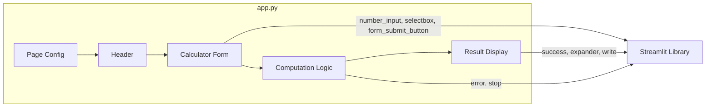
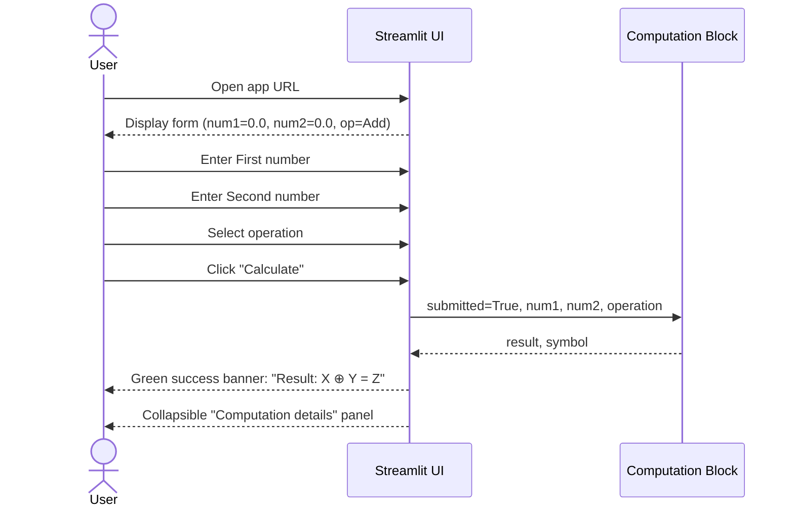
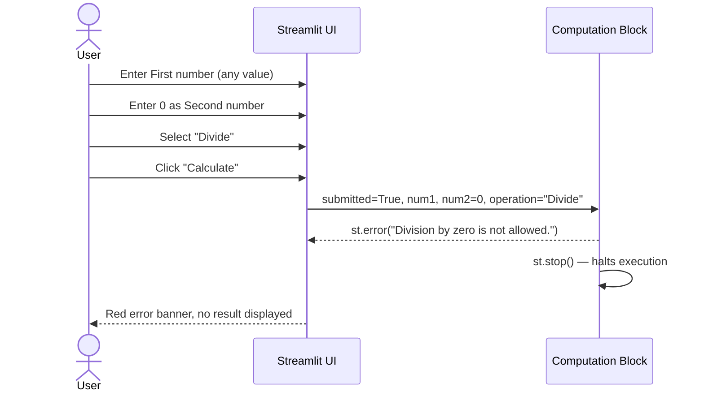

# Streamlit Calculator App — Comprehensive Documentation

> **Auto-generated by Code Documentation Specialist**
> Analysis date: 2025-01-31

---

## Table of Contents

1. [Application Overview](#1-application-overview)
2. [Architecture & File Structure](#2-architecture--file-structure)
3. [Business Rules](#3-business-rules)
4. [User Workflows](#4-user-workflows)
5. [API / UI Reference](#5-api--ui-reference)
6. [Configuration Guide](#6-configuration-guide)
7. [Developer Onboarding](#7-developer-onboarding)

---

## 1. Application Overview

| Attribute          | Value                                        |
|--------------------|----------------------------------------------|
| **Name**           | Streamlit Calculator App                     |
| **Purpose**        | Browser-based four-operation arithmetic calculator |
| **Language**       | Python 3                                     |
| **Framework**      | Streamlit ≥ 1.40.0                           |
| **Architecture**   | Single-file reactive Streamlit script        |
| **Entry Point**    | `app.py`                                     |

### 1.1 What the Application Does

The Streamlit Calculator App provides a minimal, clean web interface for performing the four fundamental arithmetic operations—**addition, subtraction, multiplication, and division**—on two user-supplied floating-point numbers.

Key capabilities:

- Accept two numbers with up to **six decimal places** of precision.
- Select an operation from a dropdown (Add, Subtract, Multiply, Divide).
- Compute and display the result in a human-readable expression (`num1 ⊕ num2 = result`).
- **Guard against division by zero** with a descriptive error message.
- Offer an expandable panel showing structured computation metadata for transparency.

### 1.2 Business Value

| Value Driver | Description |
|---|---|
| Accessibility | No installation required for end-users; runs in any browser |
| Safety | Prevents undefined arithmetic behaviour (÷ 0) gracefully |
| Transparency | Expander panel surfaces all computation inputs and outputs |
| Simplicity | Single-screen, zero-navigation UX |

---

## 2. Architecture & File Structure

```
github-copilot-test/
├── app.py                              # Main application (UI + business logic)
├── requirements.txt                   # Runtime dependency declaration
├── README.md                          # Setup and run instructions
├── analysis_results.json              # 📄 Generated: file-level code analysis
└── business_rules_extractor_analysis.json  # 📄 Generated: business rules catalogue
```

### 2.1 Execution Model

Streamlit uses a **reactive re-run model**: every time the user interacts with a widget, the entire `app.py` script is re-executed from top to bottom. State is preserved across re-runs only through Streamlit's session state mechanism (not used in this application) or via `st.form`, which **batches** all widget changes until the submit button is clicked.

```mermaid
flowchart TD
    A([Browser Request]) --> B[app.py starts executing]
    B --> C[Render page config & header]
    C --> D[Render calculator form]
    D --> E{Form submitted?}
    E -- No --> F([Wait for user interaction])
    E -- Yes --> G{Operation == Divide\nAND num2 == 0?}
    G -- Yes --> H[Show error message\nCall st.stop()]
    G -- No --> I[Compute result]
    I --> J[Show success banner\nwith expression]
    J --> K[Show Computation Details\nexpander]
```

### 2.2 Module & Dependency Map



---

## 3. Business Rules

All business rules extracted from `app.py` are catalogued here and in `business_rules_extractor_analysis.json`.

### 3.1 Input Rules

| Rule ID | Name | Description | Priority |
|---|---|---|---|
| BR-008 | Default Input Values | Both number inputs default to `0.0` on load | Medium |
| BR-009 | Number Input Precision | Inputs accept and display up to 6 decimal places (`%.6f`) | Medium |
| BR-010 | Form Submission Requirement | Computation only runs after explicit 'Calculate' button click | High |

### 3.2 Operation Rules

| Rule ID | Name | Description | Priority |
|---|---|---|---|
| BR-001 | Supported Operations | Exactly 4 operations: Add, Subtract, Multiply, Divide | High |
| BR-002 | Default Operation | 'Add' is pre-selected on load (index=0) | Low |
| BR-003 | Addition | `result = num1 + num2`, symbol `+` | High |
| BR-004 | Subtraction | `result = num1 - num2`, symbol `-` | High |
| BR-005 | Multiplication | `result = num1 * num2`, symbol `×` | High |
| BR-006 | Division | `result = num1 / num2`, symbol `÷` (only when `num2 ≠ 0`) | High |

### 3.3 Validation Rules

| Rule ID | Name | Description | Priority |
|---|---|---|---|
| **BR-007** | **Division by Zero Prevention** | When Divide is selected and `num2 == 0`, display error *"Division by zero is not allowed."* and call `st.stop()` to halt execution | **Critical** |

> ⚠️ **BR-007 is the only Critical business rule.** It must be preserved in any refactoring of the computation block.

### 3.4 Presentation Rules

| Rule ID | Name | Description | Priority |
|---|---|---|---|
| BR-011 | Result Expression Format | Render: `Result: {num1} {symbol} {num2} = {result}` in a green success banner | Medium |
| BR-012 | Operation Symbol Mapping | Add→`+`, Subtract→`-`, Multiply→`×` (U+00D7), Divide→`÷` (U+00F7) | Low |
| BR-013 | Computation Details Disclosure | Structured dict `{first_number, second_number, operation, result}` shown in collapsible expander | Low |

---

## 4. User Workflows

### 4.1 Happy Path — Successful Calculation



### 4.2 Error Path — Division by Zero



---

## 5. API / UI Reference

### 5.1 Page Configuration

| Setting | Value |
|---|---|
| `page_title` | `"Calculator"` |
| `page_icon` | `🧮` |
| `layout` | `"centered"` |

### 5.2 Form Inputs

| Widget | Label | Type | Default | Constraints |
|---|---|---|---|---|
| `st.number_input` | "First number" | `float` | `0.0` | Format: `%.6f` |
| `st.number_input` | "Second number" | `float` | `0.0` | Format: `%.6f` |
| `st.selectbox` | "Operation" | `str` | `"Add"` (index 0) | Options: Add, Subtract, Multiply, Divide |
| `st.form_submit_button` | "Calculate" | `bool` | `False` | Triggers computation |

### 5.3 Outputs

| Output | Type | Condition | Component |
|---|---|---|---|
| Success banner | String | Successful computation | `st.success()` |
| Error banner | String | `Divide` + `num2==0` | `st.error()` |
| Computation detail dict | Dict | Successful computation | `st.expander` → `st.write()` |

### 5.4 Operation Symbol Map

| Operation | Symbol | Unicode |
|---|---|---|
| Add | `+` | U+002B |
| Subtract | `-` | U+002D |
| Multiply | `×` | U+00D7 |
| Divide | `÷` | U+00F7 |

---

## 6. Configuration Guide

### 6.1 `requirements.txt`

```
streamlit>=1.40.0
```

The application has a **single runtime dependency**: Streamlit. The `>=1.40.0` minimum version constraint ensures availability of all UI components used (`st.form`, `st.columns`, `st.number_input`, `st.selectbox`, `st.form_submit_button`, `st.expander`).

> **Note**: No upper-bound pin is set. If a future Streamlit release introduces a breaking change, pin to a known-good range (e.g., `streamlit>=1.40.0,<2.0.0`).

### 6.2 No Environment Variables

This application uses no environment variables, secrets, or external configuration files.

---

## 7. Developer Onboarding

### 7.1 Prerequisites

- Python 3.8 or higher
- `pip` package manager

### 7.2 Local Setup

```bash
# 1. Clone the repository
git clone <repo-url>
cd github-copilot-test

# 2. (Recommended) Create and activate a virtual environment
python3 -m venv .venv
source .venv/bin/activate       # macOS/Linux
# .venv\Scripts\activate        # Windows

# 3. Install dependencies
pip install -r requirements.txt

# 4. Run the application
streamlit run app.py
```

The app will be available at **http://localhost:8501** (default Streamlit port).

### 7.3 Code Style Notes

| Observation | Detail |
|---|---|
| Single-file architecture | All logic lives in `app.py`; no modules, classes, or functions defined |
| Reactive pattern | No explicit state management; `st.form` batches widget state |
| Error handling | Uses `st.stop()` rather than Python exceptions for graceful UI termination |
| Numeric precision | `%.6f` format string controls display; actual float precision is IEEE 754 double |

### 7.4 Extending the Application

Common extension points:

| Feature | Approach |
|---|---|
| Add more operations (e.g., Power, Modulo) | Add options to `st.selectbox` and corresponding branches in the computation block |
| Input validation (e.g., range limits) | Add conditional checks before/after form submission block |
| Calculation history | Use `st.session_state` to accumulate past results |
| Unit conversion | Add a second selectbox for unit selection alongside the operation selector |
| Testing | Use `streamlit.testing.v1.AppTest` for headless UI testing |

### 7.5 Generated Documentation Files

| File | Format | Description |
|---|---|---|
| `analysis_results.json` | JSON | File-by-file structural and business analysis |
| `business_rules_extractor_analysis.json` | JSON | Full business rules catalogue with IDs, types, priorities, and workflow mapping |
| `DOCUMENTATION.md` | Markdown | This file — human-readable comprehensive documentation |

---

*Documentation generated by Code Documentation Specialist agent.*
