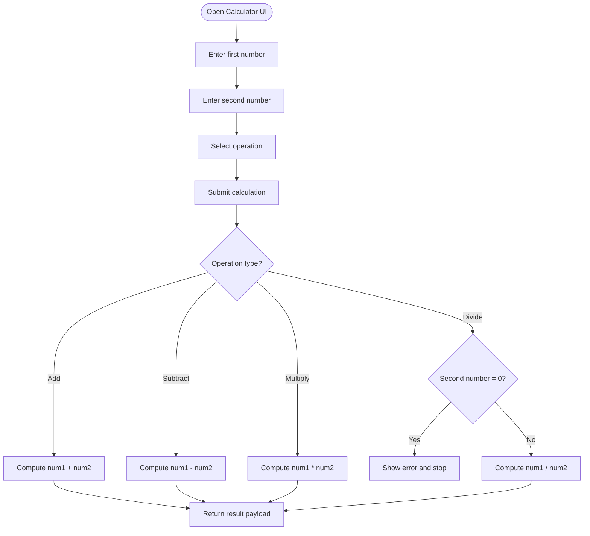

# Calculator workflow

```mermaid
graph TD
    A([Open Calculator UI]) --> B[Enter first number]
    B --> C[Enter second number]
    C --> D[Select operation]
    D --> E[Submit calculation]
    E --> F{Operation type?}
    F -->|Add| G[Compute num1 + num2]
    F -->|Subtract| H[Compute num1 - num2]
    F -->|Multiply| I[Compute num1 * num2]
    F -->|Divide| J{Second number = 0?}
    J -->|Yes| K[Show error and stop]
    J -->|No| L[Compute num1 / num2]
    G --> M[Return result payload]
    H --> M
    I --> M
    L --> M
```
