# Streamlit Calculator — Arc42 Architecture Documentation

**Version:** 1.0  
**Date:** 2025-01-30  
**Status:** Generated from direct source-code analysis  
**Authors:** GenInsights Arc42 Agent  

---

## Table of Contents

1. [Introduction and Goals](#1-introduction-and-goals)
2. [Constraints](#2-constraints)
3. [Context and Scope](#3-context-and-scope)
4. [Solution Strategy](#4-solution-strategy)
5. [Building Block View](#5-building-block-view)
6. [Runtime View](#6-runtime-view)
7. [Deployment View](#7-deployment-view)
8. [Cross-cutting Concepts](#8-cross-cutting-concepts)
9. [Architecture Decisions](#9-architecture-decisions)
10. [Quality Requirements](#10-quality-requirements)
11. [Risks and Technical Debt](#11-risks-and-technical-debt)
12. [Glossary](#12-glossary)

---

## 1. Introduction and Goals

### 1.1 Requirements Overview

The **Streamlit Calculator** is a browser-based arithmetic tool that allows end-users to perform the four fundamental arithmetic operations (addition, subtraction, multiplication, and division) through a clean, form-driven web interface. The application is self-contained in a single Python file (`app.py`) and is served by the Streamlit runtime.

The application was built with the following functional requirements in mind:

| ID | Capability | Description |
|----|------------|-------------|
| FR-01 | **Addition** | Compute the sum of two floating-point numbers |
| FR-02 | **Subtraction** | Compute the difference between two floating-point numbers |
| FR-03 | **Multiplication** | Compute the product of two floating-point numbers |
| FR-04 | **Division** | Compute the quotient of two floating-point numbers |
| FR-05 | **Division-by-Zero Guard** | Detect a zero divisor and display a meaningful error message before halting execution |
| FR-06 | **Result Display** | Present the full expression and computed result to the user in a human-readable format |
| FR-07 | **Computation Detail Disclosure** | Provide an expandable panel showing the raw input and output values for traceability |
| FR-08 | **Numeric Precision** | Accept and display numbers to six decimal places of precision |

### 1.2 Quality Goals

The following quality goals are ranked in descending order of priority and have been inferred from design choices observed directly in the source code.

| Priority | Quality Goal | Rationale (observed in code) |
|----------|--------------|------------------------------|
| 1 | **Usability** | Streamlit form layout, centered page, friendly captions, success/error feedback widgets, and a human-readable expression in the result message all prioritise a smooth end-user experience |
| 2 | **Reliability** | Explicit division-by-zero guard using `st.error` + `st.stop()` prevents runtime exceptions from reaching the user |
| 3 | **Maintainability** | Single-file, linear script structure with clear conditional branches keeps the codebase easy to read and modify |
| 4 | **Correctness** | Native Python float arithmetic with six-decimal-place formatting ensures consistent numerical output |
| 5 | **Portability** | Only one third-party dependency (`streamlit`) with a minimum version pin; runs on any platform that supports Python |

### 1.3 Stakeholders

| Role | Concern | Expectation |
|------|---------|-------------|
| **End User** | Performs everyday arithmetic quickly in a browser without installing a native app | Intuitive UI, immediate feedback, clear error messages |
| **Developer / Maintainer** | Extends the calculator with new operations or UI improvements | Simple code structure, no hidden coupling, easy local dev setup |
| **DevOps / Operator** | Deploys the application and keeps it running | Minimal dependencies, reproducible environment, straightforward startup command |
| **Architect** | Ensures the solution remains coherent and evolvable | Documented decisions, explicit constraints, identified risks |

---

## 2. Constraints

### 2.1 Technical Constraints

| Constraint | Value / Description |
|------------|---------------------|
| **Implementation Language** | Python (version unspecified; Streamlit ≥ 1.40.0 requires Python ≥ 3.8) |
| **UI Framework** | Streamlit ≥ 1.40.0 (declared in `requirements.txt`) |
| **External Dependencies** | Exactly one runtime dependency: `streamlit` (and its transitive dependencies) |
| **No Database** | All state is ephemeral and held in the Streamlit session; no persistence layer |
| **No REST API** | The application exposes no programmatic interface; all interaction is through the browser UI |
| **No Authentication** | The application has no login or access-control mechanism |
| **Numeric Type** | Python built-in `float` (IEEE 754 double precision); no arbitrary-precision arithmetic |
| **Single File** | All application logic resides in `app.py`; no package structure or modules |

### 2.2 Organisational Constraints

| Constraint | Description |
|------------|-------------|
| **Minimal Footprint** | The project intentionally avoids complexity — it is a learning/demonstration artefact |
| **No CI/CD Defined** | No pipeline configuration files (GitHub Actions, Dockerfile, etc.) are present in the repository |
| **No Automated Tests** | There are no test files or test framework configurations in the codebase |
| **Manual Deployment** | Operators must manually execute `streamlit run app.py`; no container or service definition exists |
| **README-driven Setup** | `README.md` is the sole operational runbook |

### 2.3 Coding Conventions

| Convention | Observation |
|------------|-------------|
| **Style** | PEP 8 compliant style: lowercase `snake_case` variable names (`num1`, `num2`, `symbol`, `result`) |
| **String formatting** | f-strings used for result output (Python 3.6+ idiom) |
| **Widget grouping** | Streamlit form (`st.form`) used to batch widget interactions and prevent premature re-runs |
| **Column layout** | `st.columns(2)` used to place inputs side-by-side for compact, desktop-friendly layout |
| **Error termination** | `st.stop()` called immediately after `st.error()` to halt script execution cleanly |

---

## 3. Context and Scope

### 3.1 Business Context

The calculator operates as a standalone, stateless web application. It has no integrations with external backend services, databases, or third-party APIs. The only external actor is the human user interacting through a web browser.

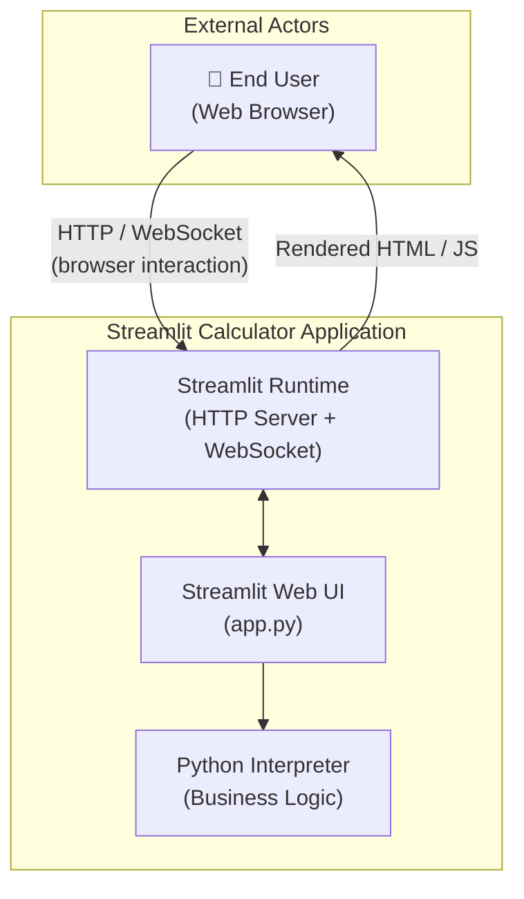

**External Interfaces:**

| Partner | Protocol | Direction | Description |
|---------|----------|-----------|-------------|
| End User (Browser) | HTTP + WebSocket | Bidirectional | User submits input via the form; Streamlit server pushes rendered UI back |
| Python Interpreter | In-process function call | Internal | Streamlit runtime invokes the `app.py` script on every interaction event |
| Operating System | Process / POSIX | Internal | `streamlit run` launches a Python process; OS provides network socket on port 8501 |

### 3.2 Technical Context

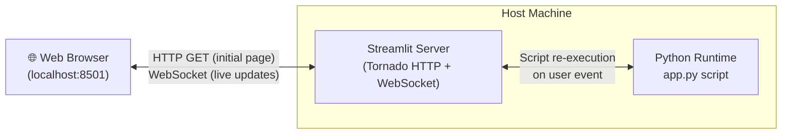

| Component | Technology | Role |
|-----------|-----------|------|
| Web Browser | Any modern browser | Renders the Streamlit front-end; sends form submissions |
| Streamlit Server | Tornado (embedded in Streamlit) | Serves the HTML/JS shell; manages WebSocket session; re-runs `app.py` on each interaction |
| Python Runtime | CPython | Executes `app.py`; evaluates arithmetic expressions |
| Host Machine | Any OS with Python | Provides compute, memory, and the network port |

---

## 4. Solution Strategy

### 4.1 Technology Decisions

| Decision | Technology Chosen | Rationale |
|----------|-------------------|-----------|
| **UI + Server** | Streamlit | Enables a full-stack interactive web UI with pure Python; eliminates the need for HTML/CSS/JavaScript authorship |
| **Language** | Python | Ubiquitous for data-adjacent tooling; native arithmetic operators; large ecosystem |
| **Arithmetic Engine** | Python built-in operators (`+`, `-`, `*`, `/`) | Zero-dependency, correct for everyday arithmetic; IEEE 754 double precision is sufficient |
| **State Management** | Streamlit session (implicit) | Streamlit re-runs the script top-to-bottom on each interaction; no external state store is needed for this workload |
| **Error Presentation** | `st.error` + `st.stop()` | Integrates with Streamlit's native notification system; halts further rendering immediately |
| **Result Presentation** | `st.success` + `st.expander` | `st.success` surfaces the answer prominently; the expander provides an optional structured view for transparency without cluttering the primary UI |

### 4.2 Architectural Style

The application follows a **Single-Page, Script-Based Reactive UI** pattern, which is the idiomatic Streamlit architecture:

- **Reactive / top-down re-execution:** Streamlit re-runs `app.py` from top to bottom every time the user interacts with a widget (e.g., submits the form). Widget state is persisted between runs by the Streamlit runtime.
- **Monolithic single file:** All rendering logic, input handling, and business logic reside in one script with no layers or modules.
- **Stateless computation:** Each form submission triggers a fresh evaluation; no in-memory history is retained.

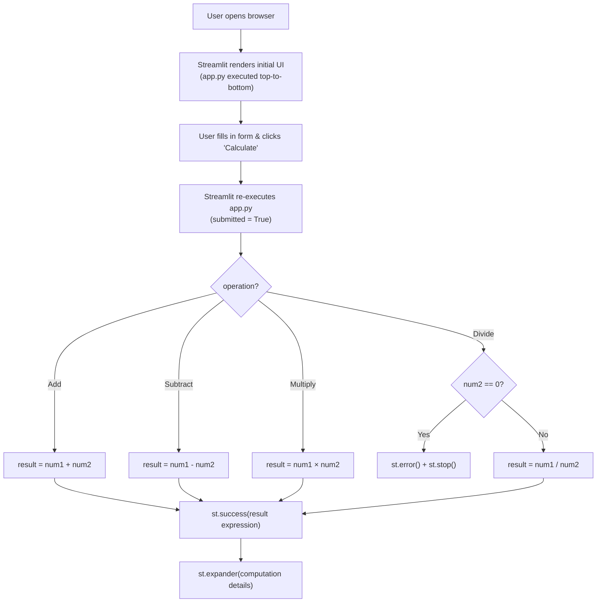

### 4.3 Quality Approach

| Quality Goal | Architectural Approach |
|--------------|------------------------|
| **Usability** | Streamlit form batches inputs to prevent mid-entry re-runs; two-column layout aligns numeric inputs; caption provides context at a glance |
| **Reliability** | Guard clause checks `num2 == 0` before the division path; `st.stop()` ensures no further code runs after an error |
| **Maintainability** | Linear `if/elif/else` dispatch requires no abstraction to understand; adding a new operation means adding one `elif` branch |
| **Correctness** | `format="%.6f"` enforces consistent precision display; Python float arithmetic is deterministic |
| **Portability** | Single `requirements.txt` with one pinned minimum version; no OS-specific code |

---

## 5. Building Block View

### 5.1 Level 1 — System Context

At the coarsest level, the system is a single deployable unit with one inbound interface (the browser session).

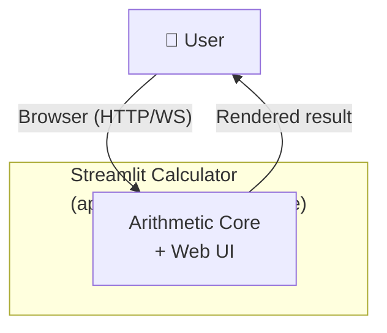

### 5.2 Level 2 — Internal Structure of `app.py`

Although the code is contained in a single file without explicit classes or functions, it has three logical layers that can be identified by responsibility:

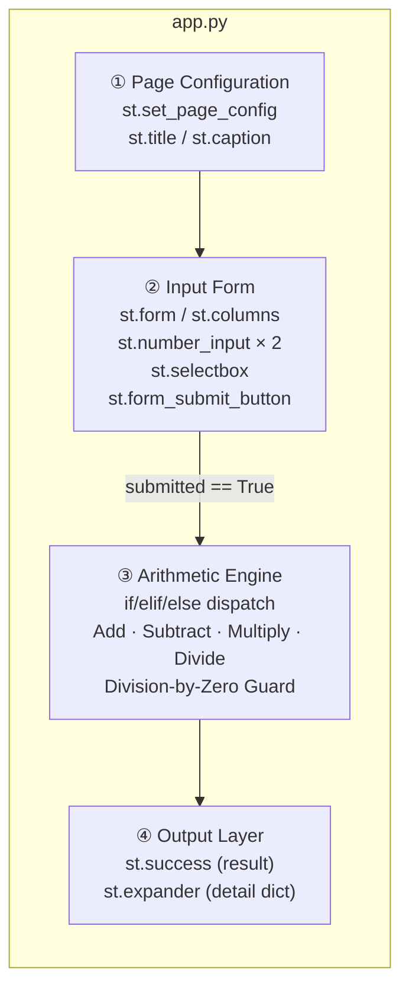

| Block | Responsibility | Key Streamlit Calls |
|-------|---------------|---------------------|
| **① Page Configuration** | Set browser tab title, favicon emoji, and page layout | `st.set_page_config`, `st.title`, `st.caption` |
| **② Input Form** | Collect both operands and the chosen operation atomically; gate execution until the user explicitly clicks *Calculate* | `st.form`, `st.columns`, `st.number_input`, `st.selectbox`, `st.form_submit_button` |
| **③ Arithmetic Engine** | Evaluate the selected operation; enforce the division-by-zero invariant | Pure Python `+`, `-`, `*`, `/`; `st.error`, `st.stop` |
| **④ Output Layer** | Render the result and optional detail view | `st.success`, `st.expander`, `st.write` |

### 5.3 Level 3 — Component Detail

#### 5.3.1 Input Form (Block ②)

**Purpose:** Collects user inputs in a single atomic batch so that the arithmetic engine is only invoked when all three inputs (num1, num2, operation) are confirmed by an explicit submit action.

**Widget Inventory:**

| Widget | Streamlit Call | Default Value | Precision |
|--------|---------------|---------------|-----------|
| First Number | `st.number_input("First number", value=0.0, format="%.6f")` | `0.0` | 6 d.p. |
| Second Number | `st.number_input("Second number", value=0.0, format="%.6f")` | `0.0` | 6 d.p. |
| Operation | `st.selectbox("Operation", ("Add","Subtract","Multiply","Divide"), index=0)` | `"Add"` | N/A |
| Submit | `st.form_submit_button("Calculate")` | — | N/A |

**Key design note:** Wrapping widgets in `st.form` means Streamlit defers re-execution until the submit button is clicked, preventing partial-input recalculations.

#### 5.3.2 Arithmetic Engine (Block ③)

**Purpose:** Maps the selected operation string to a Python expression, evaluates it, and enforces the single business constraint (no division by zero).

**Dispatch Table:**

| Operation String | Expression | Symbol | Guard |
|-----------------|------------|--------|-------|
| `"Add"` | `num1 + num2` | `"+"` | None |
| `"Subtract"` | `num1 - num2` | `"-"` | None |
| `"Multiply"` | `num1 * num2` | `"×"` | None |
| `"Divide"` | `num1 / num2` | `"÷"` | `num2 == 0` → `st.error` + `st.stop()` |

**State produced:** `result` (Python `float`), `symbol` (Python `str`)

#### 5.3.3 Output Layer (Block ④)

**Purpose:** Renders the computation outcome in a user-friendly format and optionally exposes the raw computation detail.

| Widget | Content | Condition |
|--------|---------|-----------|
| `st.success` | `f"Result: {num1} {symbol} {num2} = {result}"` | Always, when calculation succeeds |
| `st.expander` | `{"first_number": num1, "second_number": num2, "operation": operation, "result": result}` | On demand (collapsed by default) |
| `st.error` | `"Division by zero is not allowed."` | Only when `operation == "Divide"` and `num2 == 0` |

---

## 6. Runtime View

### 6.1 Scenario 1 — Successful Calculation (Happy Path)

**Description:** The user enters two numbers, selects an operation (here: `Multiply`), and clicks *Calculate*. The system evaluates the expression and displays the result.

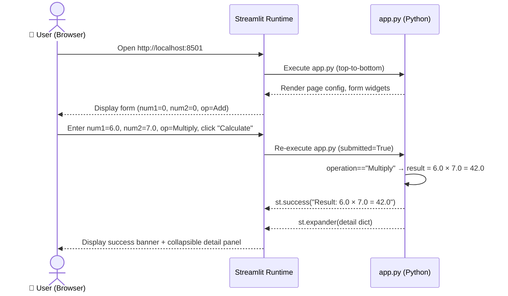

### 6.2 Scenario 2 — Division by Zero (Error Path)

**Description:** The user selects *Divide* with a zero denominator. The guard clause fires, renders an error banner, and halts execution before any `result` is computed.

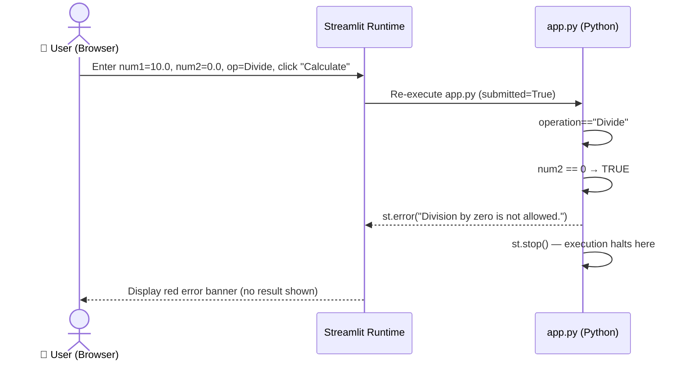

### 6.3 Scenario 3 — Page Refresh / Initial Load

**Description:** On every browser refresh (or first load), Streamlit re-executes `app.py` with `submitted = False`. The form is rendered but the result block is skipped.

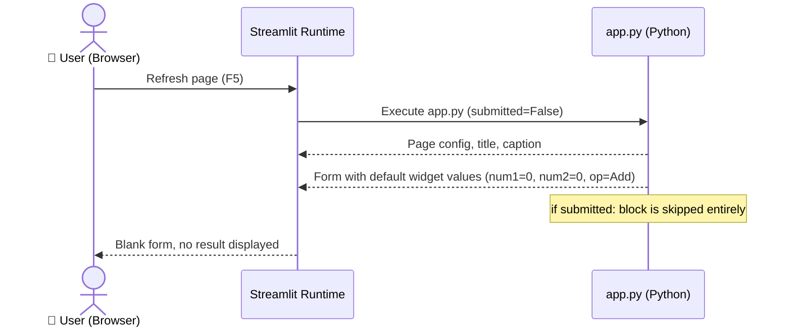

### 6.4 Business Workflow — Full Calculation Lifecycle

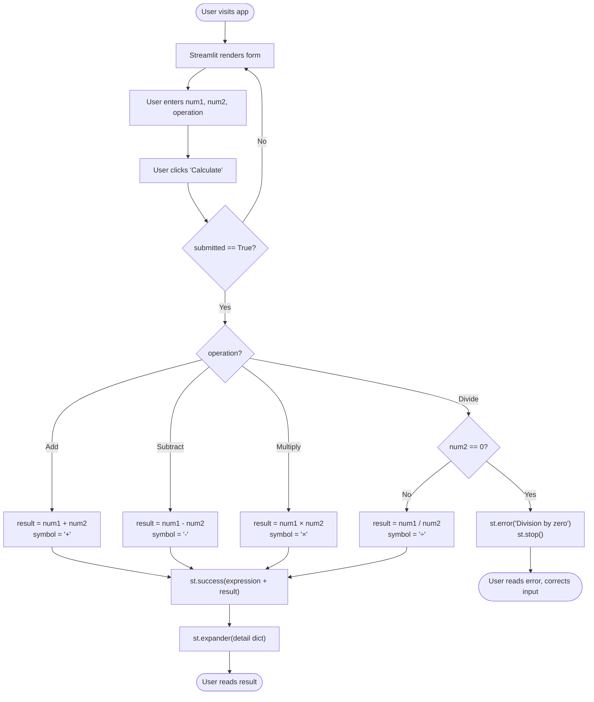

---

## 7. Deployment View

### 7.1 Infrastructure Overview

The application requires no cloud infrastructure and no container orchestration. It runs as a single operating-system process on any machine with Python installed.

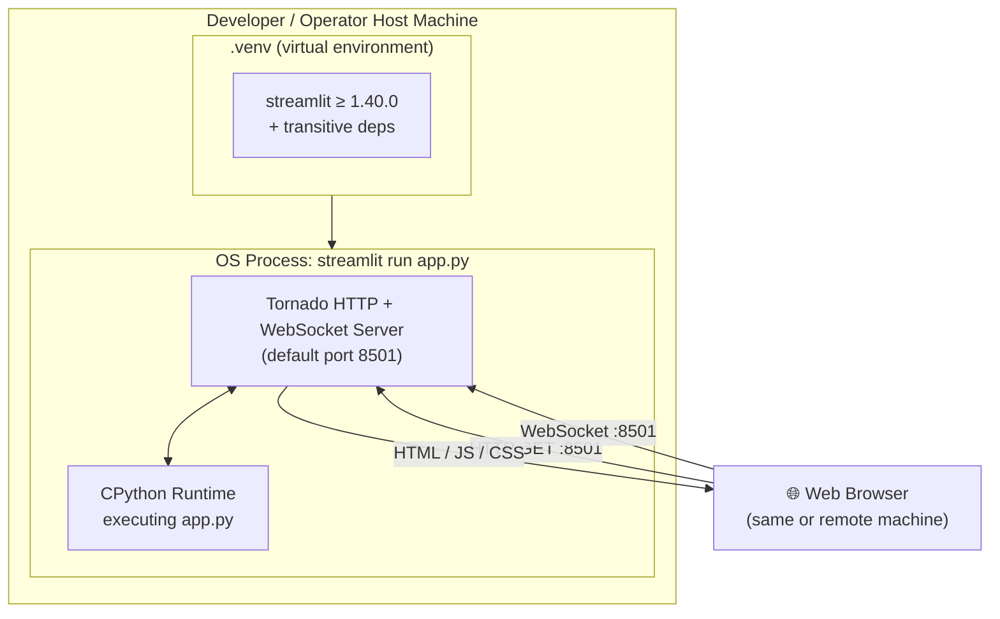

### 7.2 Startup Procedure

| Step | Command / Action | Notes |
|------|-----------------|-------|
| 1 | `python3 -m venv .venv` | Create isolated Python environment (optional but recommended) |
| 2 | `source .venv/bin/activate` | Activate virtual environment (Linux/macOS); `.venv\Scripts\activate` on Windows |
| 3 | `pip install -r requirements.txt` | Installs `streamlit` and all transitive dependencies |
| 4 | `streamlit run app.py` | Starts the Tornado HTTP server; prints local URL to terminal |
| 5 | Open `http://localhost:8501` | Default port; can be overridden with `--server.port` |

### 7.3 Deployment Variants

| Variant | Description | Suitability |
|---------|-------------|-------------|
| **Local development** | `streamlit run app.py` on developer machine | ✅ Primary intended use |
| **Streamlit Community Cloud** | Push repo to GitHub; connect to share.streamlit.io | ✅ Free, zero-config hosting for public apps |
| **Docker container** | Wrap `streamlit run app.py` in a `Dockerfile` with `python:3.x-slim` base | ✅ Reproducible, portable (not yet implemented) |
| **Cloud VM (AWS/GCP/Azure)** | Run process on a VM; expose port 8501 via security group/firewall | ✅ Feasible with minor ops overhead |
| **Kubernetes** | Containerise, then deploy as a `Deployment` + `Service` | ⚠️ Over-engineered for current scale |

### 7.4 Port & Network Considerations

| Concern | Detail |
|---------|--------|
| Default port | `8501` (TCP) |
| Protocol | HTTP for initial page load; WebSocket (`ws://`) for live interaction |
| TLS | Not provided by Streamlit by default; use a reverse proxy (nginx/Caddy) for HTTPS |
| Firewall | Port 8501 must be reachable from the user's browser; restrict to localhost for purely local use |

---

## 8. Cross-cutting Concepts

### 8.1 Domain Model

The domain is minimal — a single arithmetic operation applied to two operands.

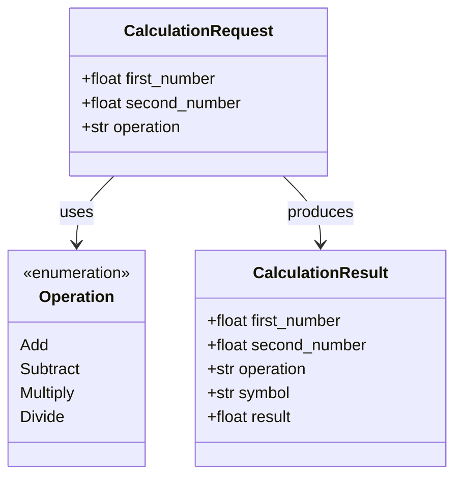

> **Note:** These are logical domain concepts inferred from the code. The application does not define explicit classes; all data is held in local variables within the script.

### 8.2 Error Handling

The application handles a single error case:

| Error Condition | Detection | Response |
|-----------------|-----------|----------|
| Division by zero (`num2 == 0` when operation is `Divide`) | Equality check before performing division | `st.error("Division by zero is not allowed.")` followed by `st.stop()` |

**Pattern:** *Guard Clause* — the dangerous condition is checked and handled before the main logic executes, keeping the happy path unindented and readable.

**Unhandled edge cases** (see also Section 11):

| Condition | Behaviour |
|-----------|-----------|
| Very large numbers (overflow) | Python floats silently become `inf`; no user-visible error |
| NaN input | Not possible via `st.number_input` (widget enforces numeric input) |
| Floating-point precision loss | IEEE 754 rounding; no notification to user |

### 8.3 Logging and Monitoring

The application contains **no explicit logging** (no `print`, `logging`, or third-party logger calls). Observability relies entirely on:

- **Streamlit server logs** written to stdout/stderr by the Streamlit runtime (request logs, Python exceptions).
- **Browser developer tools** for inspecting WebSocket frames.

Recommended additions for production use: structured logging via Python's `logging` module; integration with an observability platform (e.g., Datadog, Prometheus).

### 8.4 Security Concepts

| Concern | Current State | Risk Level |
|---------|--------------|------------|
| **Input validation** | `st.number_input` enforces numeric values at the widget level; no raw string input accepted | Low |
| **Injection attacks** | Not applicable — all arithmetic uses Python native operators, not `eval()` | None |
| **Authentication / Authorisation** | None; app is open to anyone who can reach port 8501 | Medium (for network-exposed deployments) |
| **Transport security** | No TLS; HTTP only | Medium (if deployed beyond localhost) |
| **Data privacy** | No data is stored, transmitted to third parties, or logged | None |

### 8.5 State Management

Streamlit's execution model means `app.py` is re-executed from the top on every user interaction. State management is therefore implicit:

| State | Mechanism |
|-------|-----------|
| Widget values between re-runs | Streamlit internal widget state cache (keyed by widget identity) |
| Form submission flag (`submitted`) | `st.form_submit_button` return value; `True` only on the run triggered by the submit click |
| Computation result | Local Python variable `result`; exists only during a single script execution |
| History of past calculations | **Not retained** — each calculation is independent |

### 8.6 Numeric Precision and Formatting

| Aspect | Implementation |
|--------|---------------|
| Input precision | `format="%.6f"` — displayed to 6 decimal places in the input widget |
| Internal arithmetic | Python `float` (IEEE 754 double precision, ~15–17 significant decimal digits) |
| Output precision | Python default `float` string representation in the f-string result message |
| Known limitation | Results are not rounded or formatted to a fixed precision in the output string; very long decimal expansions may appear (e.g., `1/3 = 0.3333333333333333`) |

### 8.7 Testability

The current architecture has low inherent testability because:

- Business logic is tightly coupled to Streamlit widget calls inside the same script.
- There are no pure functions or classes to unit-test in isolation.
- Testing requires either a full Streamlit runtime (integration test) or refactoring the arithmetic into a separate function/module.

Recommended refactoring for testability: extract `calculate(num1, num2, operation)` as a standalone function.

---

## 9. Architecture Decisions

### ADR-001: Use Streamlit as the Sole UI and Server Framework

**Status:** Implemented (observed in `app.py` and `requirements.txt`)

**Context:**  
A quick, browser-accessible arithmetic tool is needed. Authoring a traditional web application (HTML front-end + Flask/Django back-end) would require significantly more boilerplate and technology breadth.

**Decision:**  
Adopt Streamlit as both the rendering engine and the HTTP server, allowing the entire application to be expressed in a single Python script.

**Consequences:**

| Positive | Negative |
|----------|----------|
| Zero HTML/CSS/JS required | Application is tightly coupled to Streamlit's execution model |
| Instant hot-reload during development | Cannot expose a REST API alongside the UI without additional tooling |
| Very low dependency footprint (1 package) | Streamlit's re-run model makes stateful interactions complex |
| Easy deployment to Streamlit Community Cloud | Limited layout customisation compared to bespoke front-ends |

---

### ADR-002: Single-File Architecture (No Module Decomposition)

**Status:** Implemented (all code in `app.py`)

**Context:**  
The application has a small, well-understood scope (four arithmetic operations). Module decomposition would introduce structural overhead with no immediate benefit.

**Decision:**  
Keep all logic — page configuration, UI rendering, and arithmetic — in a single `app.py` file.

**Consequences:**

| Positive | Negative |
|----------|----------|
| Trivial to read; the entire app fits on one screen | Business logic is not independently unit-testable |
| No import graph to navigate | Adding a fifth or sixth operation will begin to strain readability |
| Minimal cognitive overhead for new contributors | No separation of concerns — layout and logic are interleaved |

---

### ADR-003: Native Python Arithmetic Operators (No `eval()`)

**Status:** Implemented (explicit `if/elif/else` dispatch in `app.py`)

**Context:**  
Arithmetic could be evaluated by passing the operation string and operands directly to Python's `eval()` built-in, which would reduce lines of code.

**Decision:**  
Use an explicit conditional dispatch (`if/elif/else`) that maps each named operation to its Python operator.

**Consequences:**

| Positive | Negative |
|----------|----------|
| No code-injection vulnerability | Slightly more verbose than `eval()`-based approach |
| Each branch is explicit and individually testable | Adding a new operation requires an additional `elif` |
| Static analysis tools can inspect every branch | — |

---

### ADR-004: `st.form` for Input Batching

**Status:** Implemented (form key `"calculator_form"` in `app.py`)

**Context:**  
Without a form, each widget interaction (typing a number, changing the selectbox) triggers a full script re-run, causing premature or flickering results.

**Decision:**  
Wrap all input widgets in an `st.form`, gating re-execution until the user explicitly clicks *Calculate*.

**Consequences:**

| Positive | Negative |
|----------|----------|
| Prevents mid-input recalculations | Slightly more verbose widget code |
| Single, intentional submit action improves UX | Real-time / live preview of the result is not possible |
| Consistent with Streamlit best practices for forms | — |

---

### ADR-005: Guard Clause with `st.stop()` for Division-by-Zero

**Status:** Implemented (`app.py`, lines 36–38)

**Context:**  
A zero denominator would raise a Python `ZeroDivisionError` exception, which Streamlit would render as an ugly stack trace in the browser.

**Decision:**  
Explicitly check `num2 == 0` before performing division; call `st.error()` to surface a user-friendly message, then call `st.stop()` to halt script execution immediately.

**Consequences:**

| Positive | Negative |
|----------|----------|
| User sees a clear, plain-English error message | `st.stop()` raises a `StopException` internally; could be surprising when reading the control flow |
| No unhandled exception or stack trace visible to the user | Check is specific to exact zero; does not warn on near-zero denominators (e.g., `1e-300`) |
| Consistent with the Streamlit idiomatic error-handling pattern | — |

---

## 10. Quality Requirements

### 10.1 Quality Tree

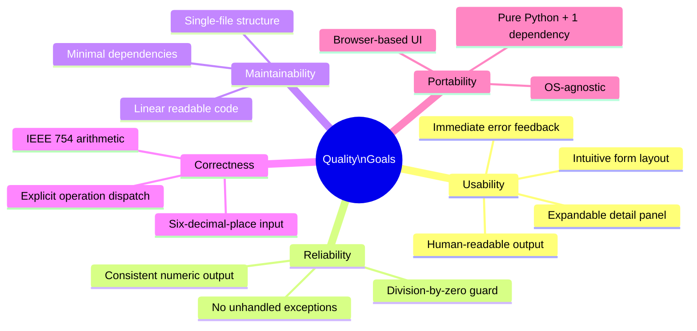

### 10.2 Quality Scenarios

| ID | Quality Attribute | Stimulus | Response | Measure |
|----|-------------------|----------|----------|---------|
| QS-01 | **Usability** | User visits the app for the first time | Form with clear labels and defaults is displayed; no instructions needed | User can complete a calculation within 30 seconds without documentation |
| QS-02 | **Usability** | User attempts to divide by zero | Error banner appears immediately with a clear message; no stack trace visible | Error message displayed in < 1 s; 0 technical jargon in message |
| QS-03 | **Reliability** | User enters `num2 = 0` and selects `Divide` | Application catches the condition and halts gracefully | 0 unhandled Python exceptions; 0 browser-visible stack traces |
| QS-04 | **Reliability** | User submits the form 100 times in a session | Application returns correct results each time | 0 result errors; 0 crashes |
| QS-05 | **Correctness** | User computes `1 / 3` | Result reflects IEEE 754 double-precision division | Result matches Python `1.0 / 3.0` to full float precision |
| QS-06 | **Maintainability** | Developer adds a fifth operation (e.g., Modulo) | Change is isolated to one `elif` branch and one selectbox option | Change requires < 10 lines of code; 0 side effects on existing operations |
| QS-07 | **Performance** | User submits form on a reasonably modern machine | Result is displayed without perceptible lag | Response time < 500 ms on localhost |
| QS-08 | **Portability** | Developer clones the repo on a fresh Python 3.8+ machine | App runs with `pip install -r requirements.txt && streamlit run app.py` | Setup completes in < 5 minutes; 0 additional OS packages required |

---

## 11. Risks and Technical Debt

### 11.1 Technical Risks

| ID | Risk | Probability | Impact | Mitigation |
|----|------|-------------|--------|------------|
| R-01 | **Floating-point precision surprises** — IEEE 754 arithmetic can produce results users find unexpected (e.g., `0.1 + 0.2 ≠ 0.3`) | Medium | Low | Document known limitation; optionally use `decimal.Decimal` for user-facing rounding |
| R-02 | **Streamlit version incompatibility** — future Streamlit releases may deprecate widgets or change the re-run model | Low | Medium | Pin a maximum version in `requirements.txt`; add CI to test on new Streamlit releases |
| R-03 | **Uncontrolled network exposure** — running with `--server.address=0.0.0.0` exposes the app to any network reachable host with no authentication | Medium | High | Document that production deployments must add a reverse proxy with TLS and authentication |
| R-04 | **Float overflow / `inf`** — multiplying very large numbers produces `inf` silently | Low | Low | Add an `math.isfinite(result)` guard and surface a warning to the user |
| R-05 | **Scalability** — Streamlit's process-per-session model does not scale horizontally without sticky sessions | Low | Medium | Not relevant for current use case; document for future multi-user deployments |

### 11.2 Technical Debt

| ID | Type | Description | Priority | Estimated Effort |
|----|------|-------------|----------|-----------------|
| TD-01 | **Design Debt** | Business logic (arithmetic) is interleaved with UI rendering code; it cannot be unit-tested without a running Streamlit server | High | 2 h — extract `calculate(num1, num2, operation)` as a pure function |
| TD-02 | **Test Debt** | No automated tests of any kind (unit, integration, end-to-end) | High | 4 h — add `pytest` unit tests for the extracted arithmetic function; optionally add `playwright` or Streamlit testing utilities for UI tests |
| TD-03 | **Operational Debt** | No `Dockerfile`, no CI/CD pipeline, no health-check endpoint | Medium | 3 h — add a minimal `Dockerfile` and a GitHub Actions workflow |
| TD-04 | **Documentation Debt** | `README.md` covers setup but omits architecture, limitations, and contribution guidelines | Low | 1 h — expand README or link to this arc42 document |
| TD-05 | **Code Debt** | Output f-string does not format `result` to a fixed decimal precision, leading to potentially long decimal strings | Low | 30 min — apply `round(result, 6)` or `f"{result:.6g}"` in the success message |
| TD-06 | **Feature Debt** | No calculation history; each submit wipes the previous result from the screen | Low | 4 h — use `st.session_state` to maintain a history list |

### 11.3 Improvement Recommendations

The following improvements are recommended, ordered by value-to-effort ratio:

1. **Extract arithmetic function** *(TD-01)* — Separate `calculate()` into a pure function at the top of `app.py` or in a `calculator.py` module. This is the single highest-leverage change: it enables unit testing, improves readability, and decouples logic from the UI.

2. **Add unit tests** *(TD-02)* — A `tests/test_calculator.py` file with `pytest` covering all four operations plus the division-by-zero guard would catch regressions immediately.

3. **Format result output** *(TD-05)* — Replace the raw `{result}` in the success f-string with `{result:.6g}` to avoid scientific notation for large numbers and excessive decimal places.

4. **Add overflow / `inf` guard** *(R-04)* — After computing `result`, check `math.isfinite(result)` and surface a user-friendly warning for overflow cases.

5. **Add `Dockerfile` and CI** *(TD-03)* — A two-stage GitHub Actions workflow (lint → test) and a minimal `Dockerfile` would make the project production-ready.

6. **Implement session history** *(TD-06)* — Use `st.session_state` to accumulate past calculations in a list and render them below the form.

---

## 12. Glossary

### 12.1 Domain Terms

| Term | Definition |
|------|------------|
| **Operand** | A numerical value on which an arithmetic operation is performed. In this application, `num1` and `num2` are the two operands. |
| **Operation** | One of the four arithmetic functions the user can select: Add, Subtract, Multiply, or Divide. |
| **Result** | The numerical value produced by applying the selected operation to the two operands. |
| **Expression** | The human-readable representation of the calculation shown in the success banner, e.g., `6.0 + 7.0 = 13.0`. |
| **Symbol** | The mathematical symbol representing the operation: `+`, `-`, `×`, or `÷`. |
| **Division by Zero** | The mathematically undefined operation of dividing any number by zero. The application explicitly prevents this with a guard clause. |
| **Computation Details** | The structured dictionary (`first_number`, `second_number`, `operation`, `result`) shown in the expandable detail panel. |

### 12.2 Technical Terms

| Term | Definition |
|------|------------|
| **Streamlit** | An open-source Python framework for building interactive web applications with pure Python scripts. The application re-executes the script top-to-bottom on every user interaction. |
| **`st.form`** | A Streamlit container that batches widget interactions; the enclosed widgets do not trigger a script re-run until `st.form_submit_button` is clicked. |
| **`st.form_submit_button`** | A button widget that, when clicked, triggers a script re-run and returns `True` for that run only. |
| **`st.number_input`** | A Streamlit widget that renders a numeric text field and returns a Python `float` (or `int`). |
| **`st.selectbox`** | A Streamlit widget that renders a dropdown list and returns the selected option string. |
| **`st.success`** | A Streamlit notification widget that renders a green banner with a success message. |
| **`st.error`** | A Streamlit notification widget that renders a red banner with an error message. |
| **`st.stop()`** | A Streamlit function that raises `StopException`, immediately halting further execution of the current script run. Subsequent lines are not evaluated. |
| **`st.expander`** | A Streamlit container that collapses its contents behind a clickable label, revealed on demand. |
| **`st.write`** | A versatile Streamlit function that renders Python objects (dicts, DataFrames, strings, etc.) using appropriate widgets. |
| **`st.columns`** | A Streamlit layout primitive that splits the page into side-by-side columns. |
| **`st.set_page_config`** | A Streamlit function that sets browser-level page metadata (tab title, favicon, layout). Must be the first Streamlit call in a script. |
| **IEEE 754** | The international standard for floating-point arithmetic. Python's built-in `float` type is an IEEE 754 double-precision (64-bit) number, offering approximately 15–17 significant decimal digits. |
| **Guard Clause** | A programming pattern where a conditional check is placed at the top of a code block to handle special cases early and return (or stop) before the main logic executes. |
| **`st.session_state`** | A Streamlit dictionary-like object that persists values across script re-runs within the same browser session. Not currently used by this application. |
| **Tornado** | The asynchronous Python web framework embedded within Streamlit that serves HTTP and WebSocket connections. |
| **Virtual Environment (`.venv`)** | An isolated Python environment containing a dedicated set of installed packages, preventing version conflicts with system-wide packages. |
| **`requirements.txt`** | A plain-text file listing Python package dependencies and their version constraints, used by `pip install -r requirements.txt`. |
| **ADR (Architecture Decision Record)** | A short document capturing a significant architectural decision, its context, the decision itself, and its consequences. |

---

## Appendix

### A. File Inventory

| File | Type | Purpose |
|------|------|---------|
| `app.py` | Python script | Entire application: UI rendering, input handling, arithmetic logic, output rendering |
| `requirements.txt` | Dependency manifest | Declares `streamlit>=1.40.0` as the sole runtime dependency |
| `README.md` | Documentation | Environment setup and application startup instructions |

### B. Mermaid Diagram Index

| Diagram | Section | Type | Description |
|---------|---------|------|-------------|
| Business Context | §3.1 | Flowchart | System boundary and external actors |
| Technical Context | §3.2 | Flowchart | Browser ↔ Streamlit ↔ Python runtime |
| Solution Strategy Flow | §4.2 | Flowchart | Full reactive execution flow with operation dispatch |
| Building Block L1 | §5.1 | Flowchart | System context (coarse-grained) |
| Building Block L2 | §5.2 | Flowchart | Internal blocks of `app.py` |
| Domain Model | §8.1 | Class diagram | Logical domain entities |
| Deployment View | §7.1 | Flowchart | Host machine, Streamlit process, browser |
| Scenario 1 — Happy Path | §6.1 | Sequence diagram | Successful multiplication |
| Scenario 2 — Division by Zero | §6.2 | Sequence diagram | Error handling flow |
| Scenario 3 — Page Refresh | §6.3 | Sequence diagram | Initial / refresh load |
| Business Workflow | §6.4 | Flowchart | Complete calculation lifecycle |
| Quality Tree | §10.1 | Mindmap | Quality attribute hierarchy |

### C. Analysis Metadata

| Attribute | Value |
|-----------|-------|
| **Documentation Date** | 2025-01-30 |
| **Source Files Analysed** | 3 (`app.py`, `requirements.txt`, `README.md`) |
| **Lines of Application Code** | 49 (`app.py`) |
| **External Dependencies** | 1 (`streamlit ≥ 1.40.0`) |
| **Arc42 Sections Completed** | 12 / 12 |
| **Mermaid Diagrams** | 12 |
| **Architecture Style** | Single-Page, Script-Based Reactive UI (Streamlit idiomatic) |

---

*This document was produced by the GenInsights Arc42 Agent through direct analysis of the repository source code. All architectural observations, decisions, and recommendations are grounded in the actual implementation found in `app.py`, `requirements.txt`, and `README.md`.*
