# Architecture Documentation (Arc42)

**Project**: Streamlit Calculator App
**Version**: 1.0.0
**Date**: 2025-01-01
**Generated by**: Arc42 Documentation Generator
**Repository**: xinni-cap/github-copilot-test

---

## Table of Contents

1. [Introduction and Goals](#1-introduction-and-goals)
2. [Constraints](#2-constraints)
3. [Context and Scope](#3-context-and-scope)
4. [Solution Strategy](#4-solution-strategy)
5. [Building Block View](#5-building-block-view)
6. [Runtime View](#6-runtime-view)
7. [Deployment View](#7-deployment-view)
8. [Crosscutting Concepts](#8-crosscutting-concepts)
9. [Architecture Decisions](#9-architecture-decisions)
10. [Quality Requirements](#10-quality-requirements)
11. [Risks and Technical Debt](#11-risks-and-technical-debt)
12. [Glossary](#12-glossary)

---

## 1. Introduction and Goals

### 1.1 Requirements Overview

The **Streamlit Calculator App** is a lightweight, browser-based arithmetic calculator built with Python and Streamlit. It provides a clean, form-driven web interface that allows users to perform the four fundamental arithmetic operations — **Add**, **Subtract**, **Multiply**, and **Divide** — on two floating-point numbers without requiring any installation beyond a Python environment.

The application is described in its own UI as:

> *"Perform quick arithmetic with a clean Streamlit UI."*

Key functional requirements derived from `app.py`:

| # | Requirement | Source |
|---|-------------|--------|
| FR-1 | Accept two numeric inputs (floating-point, 6 decimal places) | `st.number_input` in `app.py` |
| FR-2 | Support Add, Subtract, Multiply, Divide operations | `st.selectbox` + conditional logic in `app.py` |
| FR-3 | Display the full arithmetic expression and result on submission | `st.success(f"Result: ...")` in `app.py` |
| FR-4 | Reject division by zero with a user-facing error message | `if num2 == 0: st.error(...)` in `app.py` |
| FR-5 | Provide an expandable computation details panel | `st.expander("Computation details")` in `app.py` |
| FR-6 | Operate as a single-page, form-submit web application | `st.form("calculator_form")` in `app.py` |

### 1.2 Quality Goals

The top quality goals for this system, in priority order:

| Priority | Quality Goal | Scenario | Motivation |
|----------|-------------|----------|------------|
| 1 | **Correctness** | All arithmetic results must be mathematically accurate; division by zero must be gracefully rejected | Core purpose of a calculator |
| 2 | **Usability** | A first-time user should be able to perform a calculation within 10 seconds of opening the app | No training or documentation required |
| 3 | **Simplicity / Maintainability** | A developer should be able to understand and modify the entire application by reading a single 50-line file | Minimise operational overhead |
| 4 | **Availability** | The app should start and serve requests immediately after `streamlit run app.py` | Instant local use |
| 5 | **Portability** | The app should run on any OS where Python 3.8+ and `streamlit>=1.40.0` are installed | Broad accessibility |

### 1.3 Stakeholders

| Role | Name / Group | Expectation |
|------|-------------|-------------|
| End User | Any person opening the browser URL | Correct arithmetic results; intuitive UI; graceful error messages |
| Developer / Maintainer | Repository owner (`xinni-cap`) | Clean, readable single-file code; easy to extend with new operations |
| DevOps / Operator | Whoever runs the server | Simple one-command startup; minimal dependencies; no database or external services |
| Evaluator / Reviewer | GitHub Copilot test evaluators | Demonstrates Streamlit capability; illustrates clean Python practices |

---

## 2. Constraints

### 2.1 Technical Constraints

| ID | Constraint | Rationale |
|----|-----------|-----------|
| TC-1 | **Python runtime required** (3.8+) | Streamlit and the application are written in Python |
| TC-2 | **Streamlit >= 1.40.0** (pinned lower bound in `requirements.txt`) | Required for `st.form`, `st.columns`, `st.number_input`, `st.expander` APIs used in `app.py` |
| TC-3 | **Browser required for access** | Streamlit renders the UI exclusively as a web application served over HTTP |
| TC-4 | **Single compute node** (no horizontal scaling in default Streamlit) | Streamlit's default server is single-process; no built-in clustering |
| TC-5 | **Floating-point arithmetic precision** | Python's `float` (IEEE 754 double precision) governs numeric accuracy; no arbitrary-precision arithmetic library is used |
| TC-6 | **No persistent storage** | The application holds no database, file system writes, or session persistence beyond a single browser tab session |
| TC-7 | **No authentication or authorisation** | The application is fully public within its network scope |

### 2.2 Organisational Constraints

| ID | Constraint | Rationale |
|----|-----------|-----------|
| OC-1 | **Single-file architecture** (`app.py`) | Chosen to keep the project simple and self-contained for a demo/test context |
| OC-2 | **No test suite in repository** | No `tests/` directory, `pytest`, or CI test step is present |
| OC-3 | **Open source / public repository** | Hosted on GitHub (`xinni-cap/github-copilot-test`); no proprietary licensing constraints observed |
| OC-4 | **Minimal dependency footprint** | Only one third-party dependency (`streamlit`) is declared |

### 2.3 Conventions

| ID | Convention | Applied In |
|----|-----------|------------|
| CV-1 | Streamlit idiomatic patterns: `st.form`, `st.columns`, `st.expander` | `app.py` throughout |
| CV-2 | Number display format `"%.6f"` (six decimal places) | `st.number_input` calls |
| CV-3 | Unicode operator symbols (`×`, `÷`) in result string | Result display line |
| CV-4 | `st.stop()` used to halt execution on fatal user input error | Division-by-zero guard |

---

## 3. Context and Scope

### 3.1 Business Context

The Streamlit Calculator App operates as a **standalone, self-contained web application**. It has no integration with external services, databases, APIs, or authentication providers. All inputs originate from a human user via a web browser, and all outputs are rendered back to that same browser session.

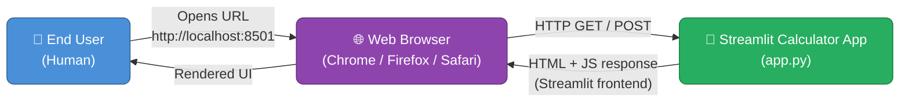

**External interfaces summary:**

| Interface | Direction | Protocol | Data |
|-----------|-----------|----------|------|
| User → Browser | Input | Human interaction | URL navigation, form fill, button click |
| Browser → Streamlit Server | Bidirectional | HTTP / WebSocket | Form data, UI state, rendered HTML+JS |
| Streamlit Server → Browser | Output | HTTP / WebSocket | Rendered calculator UI, result display |

There are **no outbound integrations** — the system does not call any external API, write to any database, or send data to any third party.

### 3.2 Technical Context

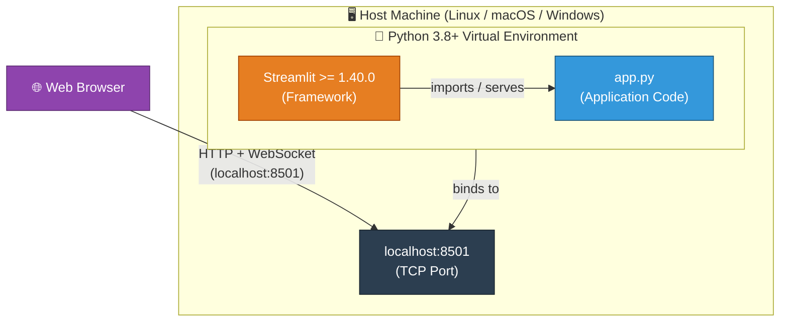

| Component | Technology | Version Constraint | Role |
|-----------|------------|-------------------|------|
| Host OS | Linux / macOS / Windows | Any modern | Execution environment |
| Python Runtime | CPython | >= 3.8 | Language runtime |
| Streamlit | Streamlit | >= 1.40.0 | Web UI framework and HTTP server |
| Application | `app.py` | 1.0.0 | Business logic + UI definition |
| Web Browser | Any modern browser | — | Client-side rendering |
| Network | localhost | TCP 8501 | Default Streamlit port |

---

## 4. Solution Strategy

### 4.1 Technology Decisions

| Decision | Choice | Alternatives Considered | Rationale |
|----------|--------|------------------------|-----------|
| UI Framework | **Streamlit** | Flask+Jinja2, FastAPI+HTMX, Dash, plain HTML | Streamlit enables Python-only development with zero HTML/CSS/JS; form widgets and layout are built-in |
| Language | **Python** | JavaScript (Node), Go, Java | Universal data-science and scripting language; Streamlit is Python-native |
| Arithmetic | **Python built-in `float`** | `decimal.Decimal`, `fractions.Fraction`, `mpmath` | Sufficient precision for the stated use case; zero additional dependencies |
| Architecture style | **Single-file script** | MVC separation, layered package | Minimises cognitive overhead for a micro-application; entire logic readable in < 60 seconds |
| Dependency management | **`requirements.txt`** | `pyproject.toml`, `Pipfile`, `conda` | Simplest, most universally understood Python dependency format |
| State management | **Streamlit session / form re-render** | Database, file storage, in-memory store | Stateless per-submit model is appropriate; no need for cross-session persistence |

### 4.2 Top-Level Decomposition Strategy

The application follows a **reactive, form-driven execution model**:

1. **Render phase** — Streamlit renders the complete UI (inputs + form) on every page load or re-run.
2. **Submit phase** — On form submit, Streamlit re-runs `app.py` with form values bound to widget variables.
3. **Compute phase** — Pure Python arithmetic is applied based on the selected operation.
4. **Display phase** — Result (or error) is rendered inline below the form.

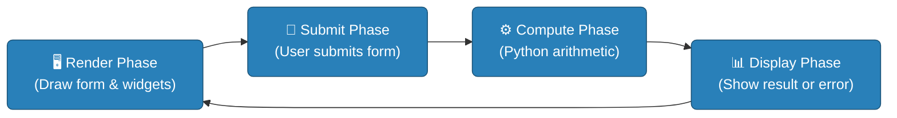

### 4.3 Approaches to Achieve Quality Goals

| Quality Goal | Strategy Applied |
|-------------|-----------------|
| **Correctness** | Python native arithmetic; explicit division-by-zero guard with `st.error` + `st.stop()` |
| **Usability** | Streamlit's default styling; two-column layout for parallel number inputs; form-submit paradigm (familiar to users) |
| **Simplicity** | Everything in one 50-line file; no frameworks-within-frameworks; no configuration files |
| **Availability** | One-command startup (`streamlit run app.py`); no database migrations, no seed data |
| **Portability** | Standard `requirements.txt`; no OS-specific code; cross-platform Streamlit |

---

## 5. Building Block View

### 5.1 Level 1 — High-Level System

At the highest level of abstraction, the system is a single deployable unit: the **Streamlit Calculator App**, accepting user input from a browser and returning computed results.

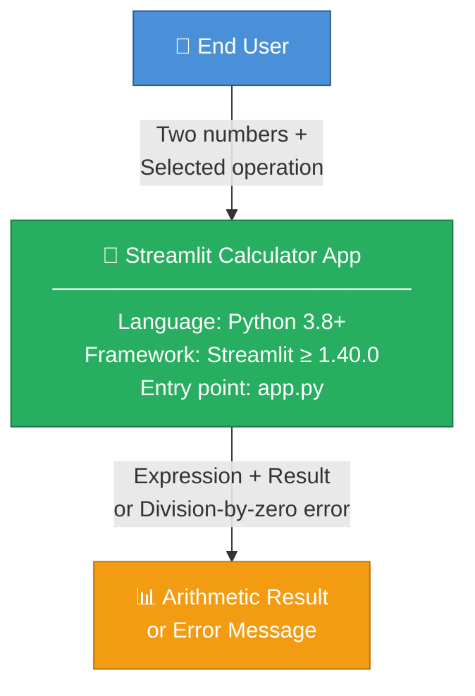

### 5.2 Level 2 — Internal Module Decomposition

Although the entire application lives in a single file (`app.py`), it is logically decomposed into four distinct responsibilities:

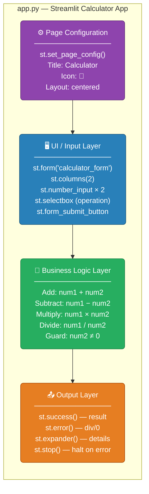

**Responsibility descriptions:**

| Block | Responsibility | Key Streamlit APIs |
|-------|---------------|-------------------|
| Page Configuration | Set browser tab title, favicon, and page layout | `st.set_page_config()` |
| UI / Input Layer | Render the two-column form; capture numeric inputs and operation selection | `st.form`, `st.columns`, `st.number_input`, `st.selectbox`, `st.form_submit_button` |
| Business Logic Layer | Apply the selected arithmetic operation; validate the divide operation guard | Pure Python `if/elif/else` + division guard |
| Output Layer | Render result or error; provide computation details in collapsible panel | `st.success`, `st.error`, `st.expander`, `st.stop` |

### 5.3 Level 3 — Detailed Code Structure

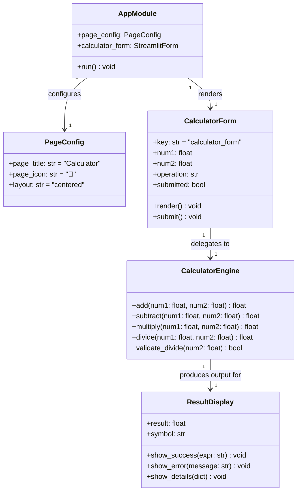

> **Note**: The class diagram above represents the *logical* responsibilities within `app.py`. The application is not structured as explicit Python classes; these are conceptual boundaries within the single procedural script.

---

## 6. Runtime View

### 6.1 Successful Calculation Scenario

This scenario describes the happy path when a user performs a valid arithmetic operation (e.g., `6.000000 ÷ 2.000000 = 3.000000`).

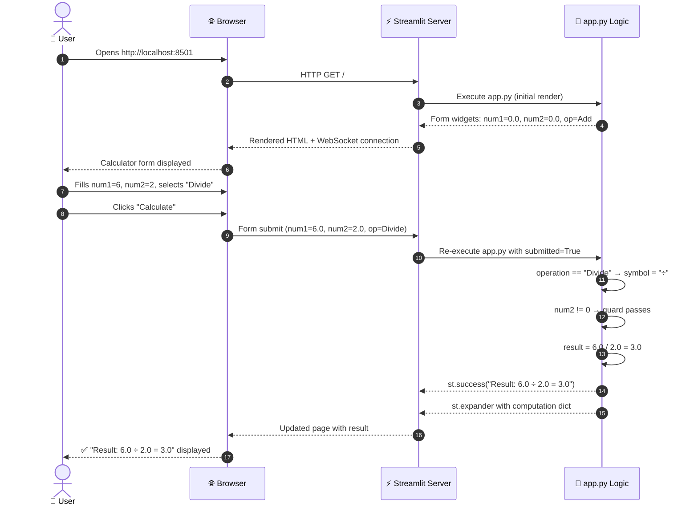

### 6.2 Division-by-Zero Error Scenario

This scenario describes the error path when a user attempts to divide by zero.

```mermaid
sequenceDiagram
    autonumber
    actor User as 👤 User
    participant Browser as 🌐 Browser
    participant Streamlit as ⚡ Streamlit Server
    participant AppPy as 🐍 app.py Logic

    User->>Browser: Fills num1=5, num2=0, selects "Divide"
    User->>Browser: Clicks "Calculate"
    Browser->>Streamlit: Form submit (num1=5.0, num2=0.0, op=Divide)
    Streamlit->>AppPy: Re-execute app.py with submitted=True

    AppPy->>AppPy: operation == "Divide" → symbol = "÷"
    AppPy->>AppPy: num2 == 0 → guard triggers
    AppPy-->>Streamlit: st.error("Division by zero is not allowed.")
    AppPy->>AppPy: st.stop() — halts further execution

    Streamlit-->>Browser: Page with error banner; no result section
    Browser-->>User: 🚫 Error: "Division by zero is not allowed."
```

### 6.3 Streamlit Re-Run Lifecycle

Streamlit's execution model re-runs the **entire** `app.py` script on every user interaction. Understanding this is critical to the runtime behaviour.

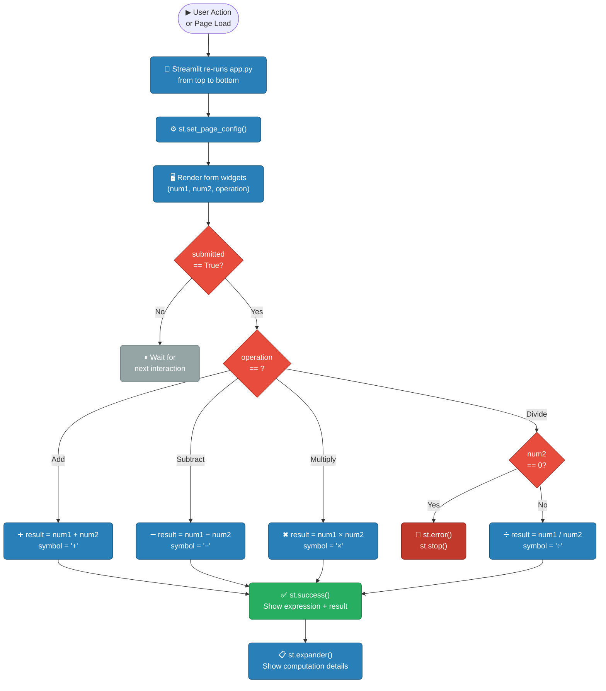

---

## 7. Deployment View

### 7.1 Local Development Deployment (Primary)

The documented deployment model in `README.md` is a **local workstation** setup.

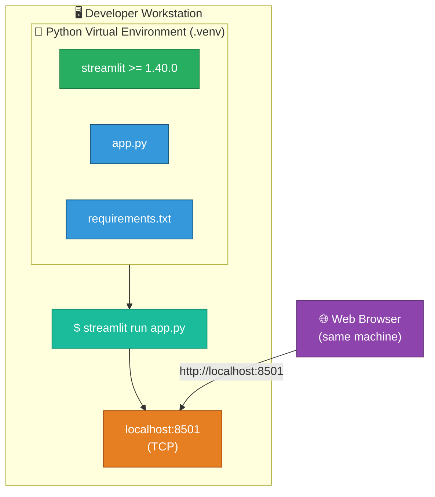

**Setup steps (from README.md):**

```bash
# Step 1: Create virtual environment (optional)
python3 -m venv .venv
source .venv/bin/activate       # Linux/macOS
# .venv\Scripts\activate        # Windows

# Step 2: Install dependencies
pip install -r requirements.txt

# Step 3: Run application
streamlit run app.py
# → App available at http://localhost:8501
```

### 7.2 Cloud / Production Deployment Options

Although not documented in the repository, the following deployment targets are architecturally compatible without code changes:

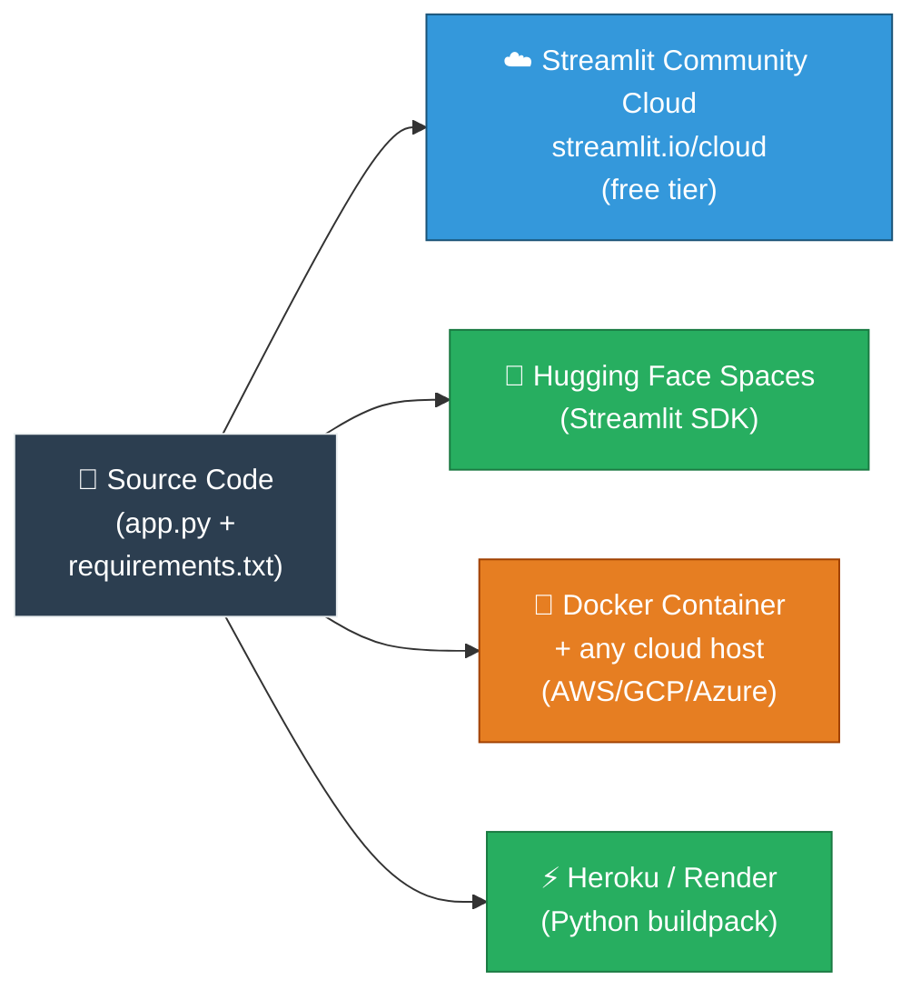

| Platform | Effort | Notes |
|----------|--------|-------|
| Streamlit Community Cloud | Minimal — connect GitHub repo | Free, native Streamlit support |
| Hugging Face Spaces | Minimal — push to Space repo | Free tier available; Streamlit runtime built-in |
| Docker + Cloud Run / ECS | Medium — write `Dockerfile` | Full control; `CMD ["streamlit", "run", "app.py", "--server.port=8080"]` |
| Heroku / Render | Medium — add `Procfile` | `web: streamlit run app.py --server.port=$PORT` |

### 7.3 Infrastructure Requirements

| Resource | Minimum | Recommended |
|----------|---------|-------------|
| CPU | 1 vCPU | 1 vCPU |
| RAM | 256 MB | 512 MB |
| Disk | < 50 MB (Python env) | 100 MB |
| Network | TCP port 8501 (local) | HTTPS:443 (production) |
| Python | 3.8+ | 3.11+ |

---

## 8. Crosscutting Concepts

### 8.1 Error Handling Strategy

The application implements a **fail-fast, user-friendly** error handling approach:

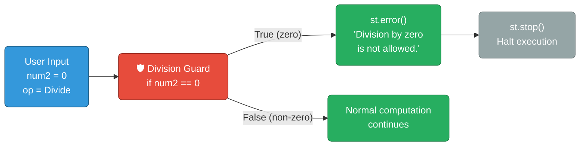

**Error handling patterns identified:**

| Pattern | Implementation | Location |
|---------|---------------|----------|
| Input validation | `if num2 == 0` guard before division | `app.py` line 36 |
| User-facing error message | `st.error("Division by zero is not allowed.")` | `app.py` line 37 |
| Execution halt | `st.stop()` prevents result block from rendering | `app.py` line 38 |
| No exception catching | ZeroDivisionError is prevented, not caught | Design choice |

### 8.2 State Management

Streamlit's programming model is **stateless per script execution**. The application exploits this intentionally:

| Concept | Behaviour |
|---------|-----------|
| **Per-run state** | Each form submission triggers a full re-run of `app.py`; widget values are passed as Python variables |
| **No persistent state** | No `st.session_state` is used; no results are saved between sessions |
| **No cross-user state** | Each browser tab / user has an independent Streamlit session |
| **Form batching** | `st.form` batches all widget interactions into a single submit event, preventing premature re-runs |

### 8.3 Numeric Precision Model

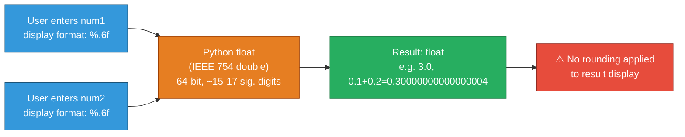

**Precision characteristics:**

| Aspect | Value |
|--------|-------|
| Input format | `%.6f` (6 decimal places displayed) |
| Internal representation | Python `float` = IEEE 754 double (64-bit) |
| Precision | ~15–17 significant decimal digits |
| Known edge case | `0.1 + 0.2 ≠ 0.3` exactly (floating-point rounding) |
| Mitigation | None currently applied (acceptable for demo context) |

### 8.4 UI / UX Patterns

| Pattern | Streamlit API | Purpose |
|---------|-------------|---------|
| Two-column layout | `st.columns(2)` | Side-by-side number inputs reduce vertical scrolling |
| Form submit model | `st.form` + `st.form_submit_button` | Prevents re-computation on every keystroke; groups inputs atomically |
| Inline result | `st.success(...)` | Immediate visual feedback using Streamlit's green success box |
| Progressive disclosure | `st.expander("Computation details")` | Keeps the UI clean; details available on demand |
| Page branding | `st.set_page_config(page_icon="🧮")` | Browser tab shows calculator emoji for quick identification |

### 8.5 Security Concepts

| Concern | Status | Notes |
|---------|--------|-------|
| Input sanitisation | ✅ Handled by Streamlit | `st.number_input` accepts only valid float values; no arbitrary string injection |
| XSS | ✅ Handled by Streamlit | Streamlit escapes output; `st.success` and `st.error` do not evaluate HTML |
| Authentication | ❌ Not implemented | Application is open to all users on the network; appropriate for local/internal use |
| HTTPS | ❌ Not configured | Default Streamlit serves HTTP; TLS termination must be added at a reverse proxy for production |
| Secrets / credentials | ✅ None required | Application has no API keys, database passwords, or tokens |

---

## 9. Architecture Decisions

### ADR-001: Use Streamlit as the Web Framework

| Field | Value |
|-------|-------|
| **Status** | Accepted |
| **Date** | Project inception |
| **Deciders** | Repository owner (xinni-cap) |

**Context:** A simple arithmetic calculator needs a web UI. The options range from heavyweight frameworks (Django, Flask+templates) to pure-Python reactive frameworks (Streamlit, Dash).

**Decision:** Use **Streamlit** as the sole web framework.

**Consequences:**
- ✅ Zero HTML, CSS, or JavaScript required
- ✅ Complete application in < 60 lines of Python
- ✅ Built-in form widgets, layout primitives, and feedback components
- ✅ One-command startup
- ❌ Limited control over HTML/CSS styling compared to Flask + custom templates
- ❌ Streamlit's re-run-on-interaction model requires understanding to avoid performance issues in complex apps (not relevant here)
- ❌ Horizontal scaling requires additional infrastructure (Streamlit does not natively cluster)

---

### ADR-002: Single-File Architecture

| Field | Value |
|-------|-------|
| **Status** | Accepted |
| **Date** | Project inception |

**Context:** For a four-operation calculator, separating code into packages, modules, controllers, and services would impose structural overhead that far exceeds the application's actual complexity.

**Decision:** Implement the entire application in **one file: `app.py`** (~50 lines).

**Consequences:**
- ✅ Any developer can understand the full system in under 60 seconds
- ✅ No import paths, module resolution, or package `__init__.py` complexity
- ✅ Single file to deploy, copy, or share
- ❌ Does not scale if the application grows (e.g., adding history, user accounts, scientific operations)
- ❌ Business logic and UI are not separated, making unit testing harder

---

### ADR-003: Use Python Built-in `float` for Arithmetic

| Field | Value |
|-------|-------|
| **Status** | Accepted |
| **Date** | Project inception |

**Context:** Arithmetic could be performed with Python's built-in `float`, the `decimal.Decimal` type, or the `fractions.Fraction` type.

**Decision:** Use **Python built-in `float`** (IEEE 754 double precision).

**Consequences:**
- ✅ No additional imports or dependencies
- ✅ Sufficient precision for everyday arithmetic (15–17 significant digits)
- ✅ Operations (+, -, *, /) work directly with operator syntax
- ❌ Subject to IEEE 754 floating-point rounding (e.g., `0.1 + 0.2 = 0.30000000000000004`)
- ❌ Not suitable for financial calculations requiring exact decimal representation

---

### ADR-004: Prevent Division by Zero with Guard + `st.stop()`

| Field | Value |
|-------|-------|
| **Status** | Accepted |
| **Date** | Project inception |

**Context:** Division by zero raises a Python `ZeroDivisionError`. This could be handled with a `try/except` block or with a pre-condition guard.

**Decision:** Use an **explicit pre-condition guard** (`if num2 == 0`) combined with `st.error()` and `st.stop()`.

**Consequences:**
- ✅ Clear, readable intent — no exception machinery needed for expected user input
- ✅ `st.stop()` immediately halts Streamlit execution, preventing any partial result display
- ✅ User receives a prominent red error message, not a Python traceback
- ❌ Guard uses exact equality (`== 0`) on a float; mathematically equivalent values very close to zero (e.g., `1e-300`) will not be caught
- ❌ No logging of the error event (acceptable for a demo app)

---

### ADR-005: Use `st.form` to Batch Input

| Field | Value |
|-------|-------|
| **Status** | Accepted |
| **Date** | Project inception |

**Context:** Streamlit re-runs `app.py` on every widget change by default. For a calculator, computing results on every keystroke would be jarring.

**Decision:** Wrap all inputs in **`st.form`** so the script only re-runs on explicit "Calculate" button submission.

**Consequences:**
- ✅ Computation only occurs on deliberate user action
- ✅ All three inputs (num1, num2, operation) are captured atomically in one re-run
- ✅ Matches the mental model of a traditional calculator (enter values, press equals)
- ❌ Users cannot see a live preview of the result as they type (acceptable trade-off)

---

## 10. Quality Requirements

### 10.1 Quality Tree

```mermaid
graph TB
    classDef root fill:#2C3E50,stroke:#ECF0F1,color:#fff,rx:8
    classDef branch fill:#2980B9,stroke:#1A5276,color:#fff,rx:6
    classDef leaf fill:#27AE60,stroke:#1A7A42,color:#fff,rx:4
    classDef risk fill:#E74C3C,stroke:#922B21,color:#fff,rx:4

    Q["🏆 Quality\n(Streamlit Calculator App)"]:::root

    C["✅ Correctness"]:::branch
    U["🎯 Usability"]:::branch
    M["🔧 Maintainability"]:::branch
    P["🌍 Portability"]:::branch
    SE["🔒 Security"]:::branch
    R["⚡ Reliability"]:::branch

    C1["Arithmetic operations\nproduce correct results"]:::leaf
    C2["Division by zero\nis rejected gracefully"]:::leaf
    C3["Float precision\n~15 significant digits"]:::leaf

    U1["Form UX:\n2-column layout"]:::leaf
    U2["Immediate feedback\nvia st.success/error"]:::leaf
    U3["Details on demand\nvia st.expander"]:::leaf

    M1["Single 50-line file\nfully readable"]:::leaf
    M2["No external config\nor env vars needed"]:::leaf
    M3["Standard requirements.txt\ndependency format"]:::leaf

    P1["Runs on Linux /\nmacOS / Windows"]:::leaf
    P2["Deployable to\nStreamlit Cloud / Docker"]:::leaf

    SE1["No user data stored\nor transmitted"]:::leaf
    SE2["Input sanitised\nby Streamlit widgets"]:::leaf

    R1["No external dependencies\nat runtime (just stdlib)"]:::leaf
    R2["No database / network\ncalls that can fail"]:::leaf

    Q --> C --> C1 & C2 & C3
    Q --> U --> U1 & U2 & U3
    Q --> M --> M1 & M2 & M3
    Q --> P --> P1 & P2
    Q --> SE --> SE1 & SE2
    Q --> R --> R1 & R2
```

### 10.2 Quality Scenarios

| ID | Quality Attribute | Scenario | Stimulus | Response | Measure |
|----|-----------------|----------|---------|----------|---------|
| QS-1 | Correctness | User inputs 7.5 and 2.5, selects Divide | Form submit | Result = 3.0 displayed | Exact float equality |
| QS-2 | Correctness | User inputs 5 and 0, selects Divide | Form submit | Error banner shown; no result rendered | `st.error` visible; no `st.success` |
| QS-3 | Usability | First-time user opens the app | Page load | Form with clear labels and two number inputs is visible | Completion of first calculation < 30 seconds |
| QS-4 | Usability | User wants to see raw computation data | Click expander | Dict with `first_number`, `second_number`, `operation`, `result` is shown | Expander reveals correctly structured dict |
| QS-5 | Maintainability | Developer adds a new operation (e.g., Modulo) | Code change | Add one `elif` branch and one entry to the `selectbox` tuple | < 5 lines of code changed |
| QS-6 | Portability | App is deployed on Streamlit Community Cloud | Git push to GitHub | App starts and is accessible via public URL | < 2 minutes from push to live |
| QS-7 | Reliability | App is run 1000 times without external service calls | Load/usage | No crashes due to missing external dependencies | Zero external HTTP calls in profiling |

### 10.3 Code Metrics

Derived from direct analysis of `app.py`:

| Metric | Value |
|--------|-------|
| Total lines of code | 50 |
| Lines of logic (non-blank, non-comment) | ~35 |
| Cyclomatic complexity | 5 (one `if submitted`, one `if/elif/else` for operation, one `if num2 == 0`) |
| Number of external dependencies | 1 (`streamlit`) |
| Number of functions/classes defined | 0 (procedural script) |
| Number of UI widgets | 5 (`number_input` ×2, `selectbox`, `form_submit_button`, `expander`) |
| Lines of test code | 0 |
| Test coverage | 0% |

---

## 11. Risks and Technical Debt

### 11.1 Risk Register

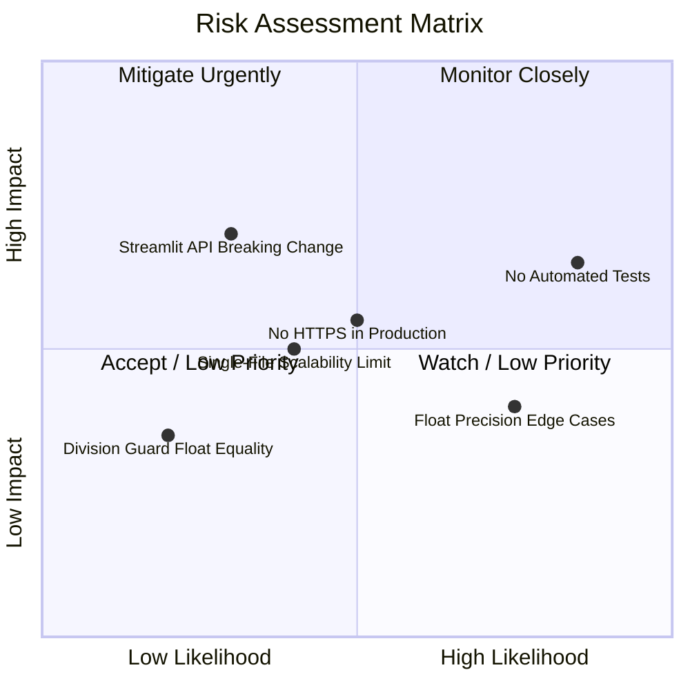

| ID | Risk | Likelihood | Impact | Category |
|----|------|-----------|--------|----------|
| R-1 | **No automated tests** — bugs introduced during refactoring will not be caught by a test suite | High | High | Process |
| R-2 | **No HTTPS** — the default Streamlit HTTP server transmits data unencrypted if exposed beyond localhost | Medium | High | Security |
| R-3 | **Streamlit breaking API change** — `streamlit>=1.40.0` without an upper bound means a future major Streamlit release could break the app | Low | High | Dependency |
| R-4 | **Floating-point display surprises** — `0.1 + 0.2` renders as `0.30000000000000004`; may confuse users expecting a "clean" result | High | Low | UX / Correctness |
| R-5 | **Float equality guard for zero** — `if num2 == 0` uses exact float equality; a subnormal number very close to zero will pass the guard, potentially producing `inf` or `nan` | Low | Low | Correctness |
| R-6 | **Single-file scalability** — adding features (history, scientific mode, multi-page) to `app.py` will quickly degrade readability | Medium | Medium | Architecture |

### 11.2 Technical Debt Items

| ID | Debt Item | Severity | Suggested Remediation |
|----|-----------|---------|----------------------|
| TD-1 | **Zero test coverage** | High | Add `pytest` unit tests for each arithmetic operation and the division-by-zero guard; use `streamlit.testing.v1.AppTest` for integration tests |
| TD-2 | **No result rounding / formatting** | Medium | Apply `round(result, 10)` or use Python `Decimal` for user-facing display to avoid floating-point representation noise |
| TD-3 | **Dependency unpinned upper bound** | Low | Pin `streamlit>=1.40.0,<2.0.0` in `requirements.txt` to prevent unexpected breaking upgrades |
| TD-4 | **No CI/CD pipeline** | Medium | Add a GitHub Actions workflow (`.github/workflows/ci.yml`) to run linting (`ruff`/`flake8`) and tests on every push |
| TD-5 | **No type annotations** | Low | The script is procedural and short; type hints on key variables would improve IDE support |
| TD-6 | **Business logic mixed with UI** | Low | For future extensibility, extract arithmetic functions (`add`, `subtract`, `multiply`, `divide`) into a separate `calculator.py` module |
| TD-7 | **No `requirements.txt` upper bounds** | Low | Lock dependencies with `pip freeze > requirements-lock.txt` for reproducible builds |

### 11.3 Mitigation Roadmap

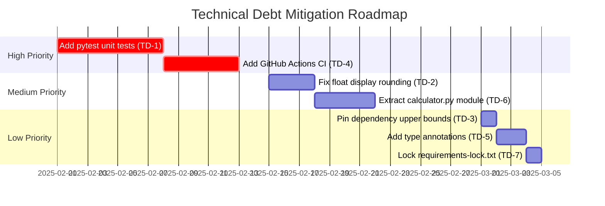

---

## 12. Glossary

### 12.1 Domain Terms

| Term | Definition |
|------|-----------|
| **Addition** | Arithmetic operation summing two operands (`num1 + num2`); represented by symbol `+` |
| **Subtraction** | Arithmetic operation computing the difference of two operands (`num1 - num2`); represented by symbol `−` |
| **Multiplication** | Arithmetic operation computing the product of two operands (`num1 × num2`); represented by symbol `×` |
| **Division** | Arithmetic operation computing the quotient of two operands (`num1 ÷ num2`); represented by symbol `÷` |
| **Operand** | A numeric value on which an arithmetic operation is performed; called `num1` (first number) and `num2` (second number) in this application |
| **Operation** | The arithmetic function selected by the user: Add, Subtract, Multiply, or Divide |
| **Result** | The numeric output produced by applying the selected operation to the two operands |
| **Division by Zero** | The mathematically undefined operation of dividing a number by zero; rejected by the application with an error message |
| **Expression** | The full arithmetic statement displayed to the user, e.g., `6.0 ÷ 2.0 = 3.0` |
| **Computation Details** | A collapsible panel showing the structured dict `{first_number, second_number, operation, result}` |

### 12.2 Technical Terms

| Term | Definition |
|------|-----------|
| **Streamlit** | Open-source Python framework for building interactive web applications; version `>= 1.40.0` used in this project |
| **`app.py`** | The single Python source file containing the entire application logic and UI definition |
| **`requirements.txt`** | Standard Python file listing package dependencies; contains `streamlit>=1.40.0` |
| **`st.form`** | Streamlit widget container that batches user inputs and triggers a single script re-run on submission |
| **`st.columns`** | Streamlit layout primitive that divides the page into equal-width horizontal columns |
| **`st.number_input`** | Streamlit widget rendering a numeric input field; configured with `format="%.6f"` (6 decimal places) |
| **`st.selectbox`** | Streamlit widget rendering a dropdown selector; used for operation selection |
| **`st.form_submit_button`** | Streamlit widget rendering a form submission button labelled "Calculate" |
| **`st.success`** | Streamlit component rendering a green banner used to display the arithmetic result |
| **`st.error`** | Streamlit component rendering a red banner used to display the division-by-zero error |
| **`st.expander`** | Streamlit component rendering a collapsible section; used for "Computation details" |
| **`st.stop`** | Streamlit function that immediately halts script execution; used to prevent result display after a division-by-zero error |
| **Re-run model** | Streamlit's execution paradigm: the entire `app.py` script is re-executed from top to bottom on every user interaction |
| **IEEE 754** | International standard for floating-point arithmetic; Python's `float` type is a 64-bit IEEE 754 double-precision number |
| **Float equality guard** | The pattern `if num2 == 0` used to detect a zero divisor before performing division |
| **Virtual environment** | An isolated Python runtime environment (`.venv`) used to avoid dependency conflicts between projects |
| **`localhost:8501`** | The default network address and port on which Streamlit serves the application during local development |
| **`st.set_page_config`** | Streamlit function called once at the top of the script to configure browser tab title, favicon, and layout |
| **Cyclomatic Complexity** | A software metric measuring the number of independent paths through code; this application has a cyclomatic complexity of 5 |
| **ADR** | Architecture Decision Record — a document capturing an architectural decision, its context, and its consequences |

---

*Documentation generated by the Arc42 Documentation Generator.*
*Based on direct analysis of: `app.py` (50 lines), `requirements.txt` (1 dependency), `README.md` (setup instructions).*
*Arc42 template: https://arc42.org*
