# Streamlit Calculator App — Architecture Documentation

**Template:** Arc42  
**Version:** 1.0  
**Date:** 2025-01-31  
**Status:** Generated from source-code analysis  
**Author:** GenInsights Arc42 Agent  

---

## Table of Contents

1. [Introduction and Goals](#1-introduction-and-goals)
2. [Constraints](#2-constraints)
3. [Context and Scope](#3-context-and-scope)
4. [Solution Strategy](#4-solution-strategy)
5. [Building Block View](#5-building-block-view)
6. [Runtime View](#6-runtime-view)
7. [Deployment View](#7-deployment-view)
8. [Crosscutting Concepts](#8-crosscutting-concepts)
9. [Architecture Decisions](#9-architecture-decisions)
10. [Quality Requirements](#10-quality-requirements)
11. [Risks and Technical Debt](#11-risks-and-technical-debt)
12. [Glossary](#12-glossary)

---

## 1. Introduction and Goals

### 1.1 Requirements Overview

The **Streamlit Calculator App** is a lightweight, browser-based arithmetic tool that enables end-users to perform the four fundamental mathematical operations — addition, subtraction, multiplication, and division — through a clean, form-driven web interface. The application requires no login, no persistent storage, and no backend service beyond the Streamlit runtime itself.

The table below summarises the functional capabilities inferred directly from `app.py`:

| # | Capability | Description |
|---|------------|-------------|
| C-1 | **Addition** | Compute the sum of two floating-point numbers |
| C-2 | **Subtraction** | Compute the difference between two floating-point numbers |
| C-3 | **Multiplication** | Compute the product of two floating-point numbers |
| C-4 | **Division** | Compute the quotient of two floating-point numbers; guards against division by zero |
| C-5 | **Result Display** | Presents the full expression and numeric result as a success banner |
| C-6 | **Computation Details** | Exposes a collapsible JSON-style detail panel with all inputs and the result |
| C-7 | **Input Validation** | Detects and reports a division-by-zero error before attempting computation |
| C-8 | **Responsive Layout** | Renders a two-column, centered layout suitable for desktop and mobile browsers |

### 1.2 Quality Goals

The following quality goals are ranked in priority order. They were derived by inspecting the implementation choices in `app.py` and the dependency declaration in `requirements.txt`.

| Priority | Quality Goal | Motivation |
|----------|--------------|------------|
| 1 | **Simplicity** | The entire application lives in a single 50-line Python file. Minimal cognitive overhead is the explicit design intent. |
| 2 | **Reliability / Correctness** | Division-by-zero is caught and reported rather than causing an unhandled Python exception (`ZeroDivisionError`). Inputs default to `0.0` to avoid missing-value errors. |
| 3 | **Usability** | Streamlit's form-based layout, labeled inputs, a dropdown for operation selection, and clear success/error messaging make the UI self-explanatory. |
| 4 | **Maintainability** | No custom classes, no hidden state, and a single dependency keep the codebase easy to understand and extend. |
| 5 | **Portability / Deployability** | A single `requirements.txt` pin and the standard `streamlit run app.py` invocation mean the app can be launched in any Python ≥ 3.8 environment in under a minute. |

### 1.3 Stakeholders

| Role | Description | Expectations |
|------|-------------|--------------|
| **End User** | Anyone who needs quick arithmetic in a browser | Immediate results, clear error messages, no registration required |
| **Developer / Maintainer** | Python developer extending or fixing the app | Readable, idiomatic Python; minimal dependencies; easy local run |
| **DevOps / Operator** | Person deploying or hosting the app | Single-command startup, no database setup, straightforward container packaging |
| **Architect / Reviewer** | Technical reviewer ensuring code quality | Clean structure, explicit constraints, documented decisions |

---

## 2. Constraints

### 2.1 Technical Constraints

| ID | Constraint | Detail |
|----|------------|--------|
| TC-1 | **Language: Python** | The application is written entirely in Python. No JavaScript, TypeScript, or compiled language is used in the application code. |
| TC-2 | **Framework: Streamlit ≥ 1.40.0** | Streamlit is the only declared dependency (`requirements.txt`). All UI rendering, state management, and HTTP serving are delegated to Streamlit. |
| TC-3 | **Single-file architecture** | All application logic resides in `app.py`. There are no modules, packages, or sub-directories for application code. |
| TC-4 | **Stateless computation** | No database, cache, file system, or external API is used. Every calculation is computed fresh on each form submission. |
| TC-5 | **Floating-point arithmetic** | Numbers are handled as Python `float` (IEEE 754 double precision). Results may exhibit standard floating-point rounding behaviour. |
| TC-6 | **Browser-only UI** | The user interface is rendered exclusively in a web browser via Streamlit's embedded Tornado HTTP server. There is no CLI or API interface. |
| TC-7 | **Python runtime** | Python 3.8 or later is required (Streamlit 1.40.x requirement). |

### 2.2 Organisational Constraints

| ID | Constraint | Detail |
|----|------------|--------|
| OC-1 | **Minimal dependency policy** | Only one third-party library (`streamlit`) is declared. This minimises supply-chain risk and update burden. |
| OC-2 | **No authentication / authorisation** | The app exposes no user accounts or access controls. It is intended for trusted or internal use. |
| OC-3 | **No data retention** | No user input is stored, logged, or transmitted to any third party. |

### 2.3 Conventions

| Convention | Detail |
|------------|--------|
| **Code style** | PEP 8 compliant Python; no linter configuration file is present but the code follows standard formatting. |
| **Number formatting** | All number inputs use `format="%.6f"` (six decimal places), ensuring consistent precision display. |
| **Symbolic representation** | Operation symbols (`+`, `−`, `×`, `÷`) follow standard mathematical notation in result output. |
| **Error handling** | Validation errors are surfaced via `st.error()` and immediately halt execution with `st.stop()`. |

---

## 3. Context and Scope

### 3.1 Business Context

The Streamlit Calculator App is a **self-contained utility**. It has no upstream or downstream business system integrations. The only external interaction is between the human user and the browser-rendered interface. No data enters or leaves the system boundary beyond what the user types in their browser session.

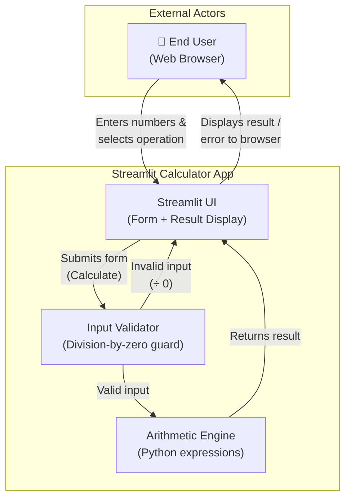

**External Interfaces:**

| Partner | Interface Type | Direction | Description |
|---------|---------------|-----------|-------------|
| End User / Browser | HTTP (Streamlit Tornado server) | Bidirectional | User loads the page, submits the form, receives rendered results |

*There are no integrations with external APIs, databases, message queues, or file systems.*

### 3.2 Technical Context

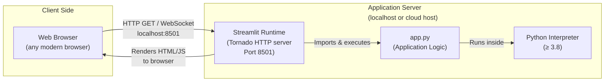

| Component | Technology | Role |
|-----------|-----------|------|
| Web Browser | Any HTML5-capable browser | Renders Streamlit's React-based frontend |
| Streamlit Runtime | Streamlit ≥ 1.40.0 (Tornado) | HTTP serving, WebSocket state sync, UI component rendering |
| Python Interpreter | Python ≥ 3.8 | Executes `app.py` logic |
| `app.py` | Pure Python (50 lines) | Defines UI layout, handles form state, and performs arithmetic |

---

## 4. Solution Strategy

### 4.1 Technology Decisions

| Decision | Technology Chosen | Rationale |
|----------|-------------------|-----------|
| **UI & Serving** | Streamlit | Eliminates need for a separate frontend framework (React, Vue, etc.) and a web framework (Flask, FastAPI). Python developers can build interactive UIs with pure Python. |
| **Language** | Python | Ubiquitous in data and tooling projects; native floating-point arithmetic; Streamlit is Python-native. |
| **State Management** | Streamlit `st.form` | Form-scoped state prevents re-running the calculation on every widget interaction; the result only updates on explicit "Calculate" submission. |
| **Error Reporting** | `st.error()` + `st.stop()` | Provides immediate, visible feedback without exceptions propagating to the user; `st.stop()` ensures partial state is not rendered. |
| **Dependency Management** | `requirements.txt` | Simple, universally understood Python packaging convention; compatible with `pip`, virtual environments, Docker, and CI systems. |

### 4.2 Top-Level Decomposition

The application follows a **Single-Tier, Script-Driven** architecture — the simplest viable pattern for a utility of this scope:

```
┌─────────────────────────────────────────────┐
│              app.py (single tier)            │
│                                              │
│  Presentation  ──►  Validation  ──►  Logic  │
│  (st.form)         (guard block)   (Python  │
│                                    arithmetic│
└─────────────────────────────────────────────┘
```

There is **no layered separation** between presentation, business logic, and data access — this is an intentional trade-off favouring simplicity over extensibility for a utility of this size.

### 4.3 How Quality Goals Are Addressed

| Quality Goal | Architectural Approach |
|--------------|----------------------|
| **Simplicity** | Everything in one file; no framework configuration; no build step |
| **Reliability** | Explicit pre-condition check (`if num2 == 0`) before division; `st.stop()` prevents corrupted state |
| **Usability** | Two-column layout, labelled inputs, dropdown selection, clear success/error banners, expandable detail panel |
| **Maintainability** | No custom abstractions; standard Python idioms; zero internal dependencies |
| **Deployability** | Single dependency pin; `streamlit run app.py` launches the app; trivially containerisable |

---

## 5. Building Block View

### 5.1 Level 1 — System Context (White-Box)

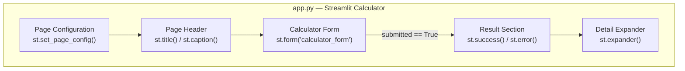

| Building Block | Responsibility | Streamlit API Used |
|----------------|---------------|-------------------|
| **Page Configuration** | Sets browser tab title (`Calculator`), emoji favicon (`🧮`), and centered layout | `st.set_page_config()` |
| **Page Header** | Renders the app title and descriptive caption | `st.title()`, `st.caption()` |
| **Calculator Form** | Provides scoped input collection; prevents reactive re-runs until submission | `st.form()`, `st.columns()`, `st.number_input()`, `st.selectbox()`, `st.form_submit_button()` |
| **Result Section** | Renders the formatted arithmetic result or a division-by-zero error message | `st.success()`, `st.error()`, `st.stop()` |
| **Detail Expander** | Renders a collapsible panel with the full input/output dictionary | `st.expander()`, `st.write()` |

### 5.2 Level 2 — Calculator Form (White-Box)

The form is the most complex building block. Its internal structure is:

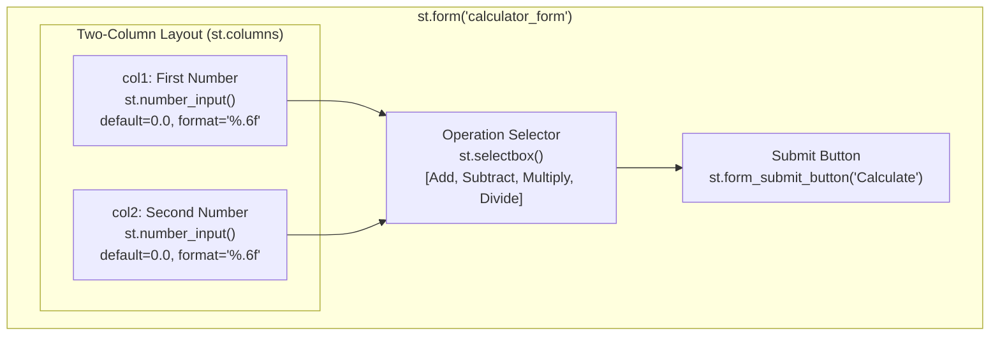

### 5.3 Level 2 — Arithmetic Engine (White-Box)

The arithmetic engine is the conditional block that executes after form submission:

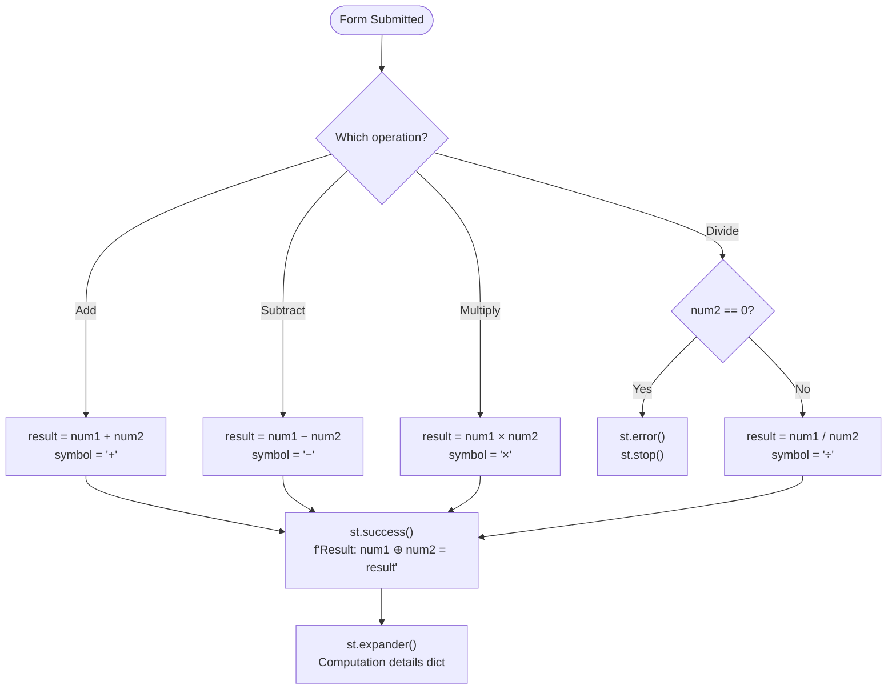

### 5.4 Class / Module Structure

The application contains no classes. All logic is at module (script) level. The complete component responsibility map is:

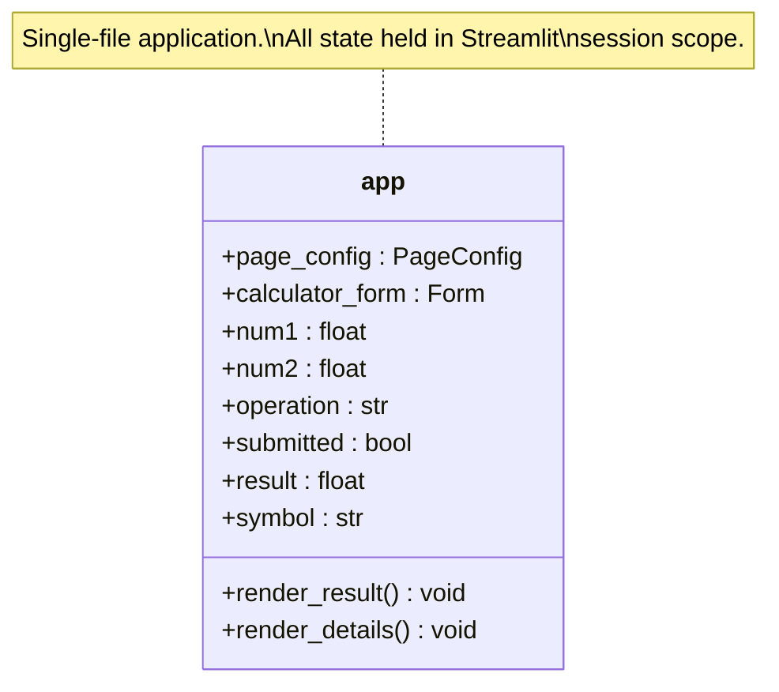

---

## 6. Runtime View

### 6.1 Scenario 1 — Successful Arithmetic (e.g., Addition)

**Description:** User opens the app, enters two numbers, selects "Add", and clicks "Calculate".

```mermaid
sequenceDiagram
    actor User as 👤 User (Browser)
    participant ST as Streamlit Runtime
    participant App as app.py

    User->>ST: HTTP GET http://localhost:8501
    ST->>App: Execute script (full re-run)
    App->>ST: Render page config, title, form
    ST->>User: Return HTML/JS page with empty form

    User->>ST: Enter num1=10.0, num2=5.0, op=Add
    Note over User,ST: Fields update locally (form scope — no re-run yet)

    User->>ST: Click "Calculate" (form submit)
    ST->>App: Re-execute script with submitted=True,\nnum1=10.0, num2=5.0, operation="Add"
    App->>App: result = 10.0 + 5.0 = 15.0; symbol = "+"
    App->>ST: st.success("Result: 10.0 + 5.0 = 15.0")
    App->>ST: st.expander() with detail dict
    ST->>User: Render updated page with result banner
```

### 6.2 Scenario 2 — Division by Zero (Error Path)

**Description:** User enters `num2 = 0`, selects "Divide", and clicks "Calculate".

```mermaid
sequenceDiagram
    actor User as 👤 User (Browser)
    participant ST as Streamlit Runtime
    participant App as app.py

    User->>ST: Enter num1=7.0, num2=0.0, op=Divide, click Calculate
    ST->>App: Re-execute script with submitted=True,\nnum1=7.0, num2=0.0, operation="Divide"
    App->>App: operation=="Divide" → check num2==0 → TRUE
    App->>ST: st.error("Division by zero is not allowed.")
    App->>ST: st.stop()  ← halts further rendering
    ST->>User: Render error banner; detail expander NOT shown
    Note over User,ST: No ZeroDivisionError exception is raised
```

### 6.3 Scenario 3 — Page Load (Initial State)

**Description:** First-time page load with no prior interaction.

```mermaid
sequenceDiagram
    actor User as 👤 User (Browser)
    participant ST as Streamlit Runtime
    participant App as app.py

    User->>ST: HTTP GET /
    ST->>App: Import streamlit; execute app.py top-to-bottom
    App->>ST: st.set_page_config(...)
    App->>ST: st.title("Simple Calculator")
    App->>ST: st.caption(...)
    App->>ST: Render form (num1=0.0, num2=0.0, op="Add")
    Note over App: submitted == False → result block skipped
    ST->>User: HTML page with blank form, no result shown
```

### 6.4 Business Workflow Summary

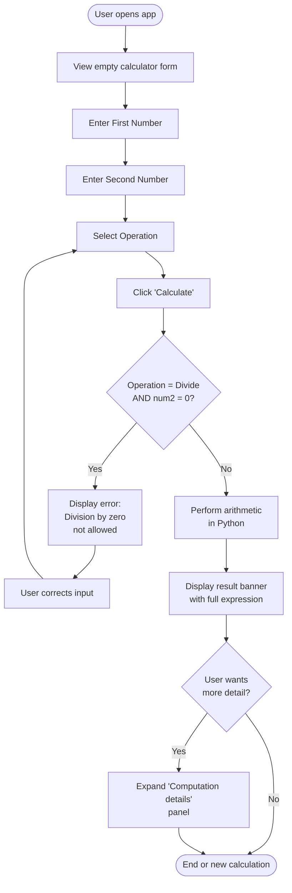

---

## 7. Deployment View

### 7.1 Local Development Deployment

The primary (and only officially documented) deployment mode is a local Python environment:

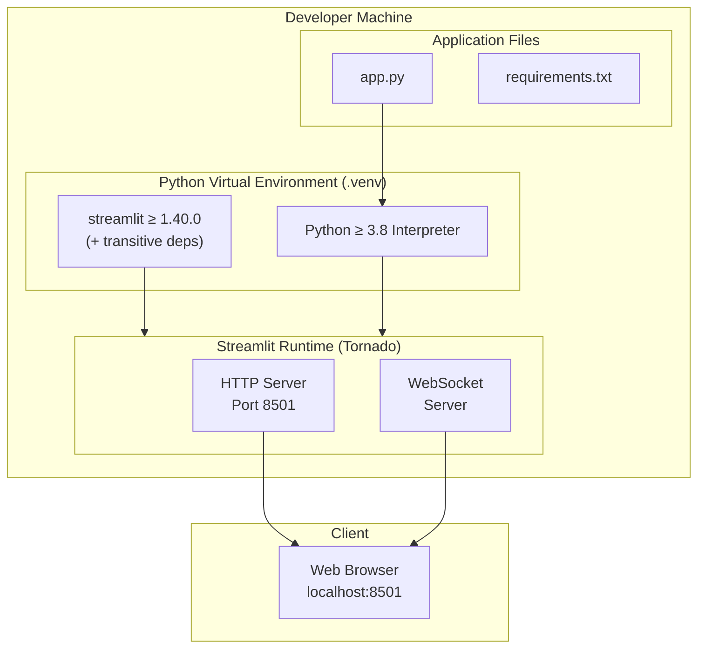

**Setup Steps (from README.md):**

```bash
# 1. Create virtual environment
python3 -m venv .venv
source .venv/bin/activate          # Linux/macOS
# .venv\Scripts\activate           # Windows

# 2. Install dependencies
pip install -r requirements.txt

# 3. Run the application
streamlit run app.py
# → App available at http://localhost:8501
```

### 7.2 Containerised Deployment (Inferred)

Although no `Dockerfile` is present in the repository, the application is trivially containerisable given its single-file, single-dependency structure:

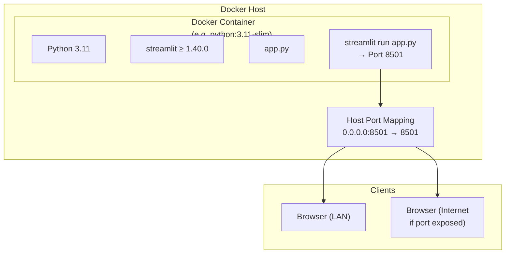

### 7.3 Cloud / PaaS Deployment (Inferred)

The app is compatible with **Streamlit Community Cloud**, **Heroku**, **Render**, **Railway**, and any PaaS that supports Python web apps:

| Platform | Method | Notes |
|----------|--------|-------|
| Streamlit Community Cloud | Connect GitHub repo; auto-detect `app.py` | Free tier available; zero config |
| Heroku / Render / Railway | `Procfile: web: streamlit run app.py --server.port $PORT` | Requires `$PORT` env var handling |
| Docker / Kubernetes | `Dockerfile` + `CMD ["streamlit", "run", "app.py"]` | Stateless; horizontally scalable |
| AWS / GCP / Azure App Service | Upload container or zip deploy | Standard Python web app deployment |

### 7.4 Infrastructure Requirements

| Requirement | Minimum | Recommended |
|-------------|---------|-------------|
| CPU | 0.1 vCPU | 0.5 vCPU |
| Memory | 128 MB RAM | 256 MB RAM |
| Storage | 50 MB (Python + Streamlit) | 100 MB |
| Network | Inbound TCP 8501 | HTTPS via reverse proxy |
| Python | 3.8 | 3.11+ |

---

## 8. Crosscutting Concepts

### 8.1 User Interface Patterns

Streamlit's **reactive scripting model** is the foundational UI pattern:

- The entire `app.py` script re-executes from top to bottom on every user interaction.
- The `st.form()` container batches all widget interactions, triggering a single re-run only when the submit button is clicked. This avoids flickering or partial-state rendering.
- Layout is achieved through `st.columns()` (a two-column responsive grid) and a `centered` page layout.

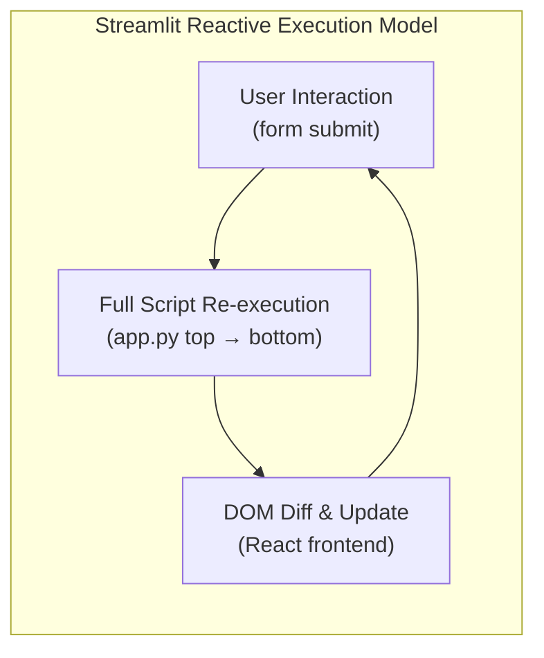

### 8.2 Input Validation

Validation is **minimal and targeted**:

| Validation Rule | Location in Code | Enforcement Mechanism |
|----------------|-----------------|----------------------|
| Division by zero | `app.py` lines 36–38 | `if num2 == 0: st.error(); st.stop()` |
| Numeric input type | Implicit via `st.number_input()` | Streamlit enforces numeric-only input at the widget level |
| Default values | `value=0.0` on both inputs | Prevents `None`/empty-field errors |

No schema validation library (e.g., Pydantic) is used, consistent with the app's simplicity goal.

### 8.3 Error Handling

| Error Type | Handling Strategy | User Experience |
|------------|-------------------|-----------------|
| Division by zero | Pre-condition check + `st.error()` + `st.stop()` | Red error banner; no exception stack trace shown |
| Invalid numeric input | Handled by Streamlit widget | Browser-level input rejection (non-numeric chars blocked) |
| Unhandled exceptions | Default Streamlit error display | Yellow warning banner with traceback (development only) |

The application does **not** use Python `try/except` blocks. The one explicit error case (division by zero) is handled via a guard clause pattern.

### 8.4 State Management

```mermaid
stateDiagram-v2
    [*] --> InitialLoad : User opens app
    InitialLoad --> FormReady : Script executes; form rendered\nsubmitted=False
    FormReady --> FormReady : User types in widgets\n(no re-run inside form scope)
    FormReady --> Calculating : User clicks "Calculate"\nsubmitted=True
    Calculating --> ResultDisplayed : Valid input → arithmetic → st.success()
    Calculating --> ErrorDisplayed : num2==0, op==Divide → st.error() → st.stop()
    ResultDisplayed --> FormReady : User modifies inputs\nor clicks Calculate again
    ErrorDisplayed --> FormReady : User corrects input
```

- All state is **ephemeral per session** — Streamlit's session state is not explicitly used (`st.session_state` is not referenced).
- Widget values (`num1`, `num2`, `operation`) are passed directly into the calculation block via Streamlit's form submission context.
- No caching directives (`@st.cache_data`, `@st.cache_resource`) are used, which is appropriate since calculations are pure functions with negligible cost.

### 8.5 Logging and Observability

No explicit application-level logging is present. Streamlit itself emits startup and request logs to stdout:

```
  You can now view your Streamlit app in your browser.
  Local URL: http://localhost:8501
  Network URL: http://192.168.x.x:8501
```

For production deployments, standard Python logging or Streamlit's built-in telemetry can be enabled. No monitoring hooks (Prometheus, Sentry, etc.) are present in the codebase.

### 8.6 Security Concepts

| Security Area | Current State | Notes |
|---------------|--------------|-------|
| Authentication | None | App is designed for open, trusted access |
| Input sanitisation | Handled by Streamlit number inputs | No free-text injection vectors exist |
| Data transmission | HTTP (plaintext) by default | HTTPS requires a reverse proxy (nginx, Caddy) in production |
| Data at rest | None | No data is persisted |
| Secrets management | Not applicable | No credentials or API keys are used |
| Dependency security | Single dependency | `streamlit` should be kept updated; no known CVEs in ≥ 1.40.0 at time of writing |

### 8.7 Internationalisation and Localisation

No i18n/l10n support is present. All UI strings are hardcoded in English. Number formatting uses Python's default locale-independent `float` representation (period as decimal separator).

---

## 9. Architecture Decisions

### ADR-001: Single-File Architecture

| Attribute | Value |
|-----------|-------|
| **ID** | ADR-001 |
| **Status** | Implemented (observed in code) |
| **Date** | Project inception |

**Context:**  
A simple arithmetic utility does not require the complexity of a multi-module Python package, a src-layout, or a plugin architecture. Over-engineering small tools introduces unnecessary indirection.

**Decision:**  
All application logic is placed in a single file, `app.py`.

**Consequences:**
- ✅ Extremely low onboarding time for new contributors
- ✅ No import/module resolution complexity
- ✅ Trivial deployment (copy one file)
- ⚠️ Adding significant new features (e.g., history, scientific functions) will require refactoring into modules
- ⚠️ Unit testing requires importing `app.py` as a module, which triggers Streamlit side-effects

---

### ADR-002: Streamlit as the UI and Server Framework

| Attribute | Value |
|-----------|-------|
| **ID** | ADR-002 |
| **Status** | Implemented (observed in code) |
| **Date** | Project inception |

**Context:**  
Building a browser-based UI for a Python application traditionally requires either a JavaScript frontend (React, Vue) or a Python web framework (Flask, FastAPI) plus HTML templates. Both approaches require significantly more boilerplate for a utility of this scope.

**Decision:**  
Streamlit is chosen as the single dependency that provides both the HTTP server and the UI rendering layer.

**Consequences:**
- ✅ Zero HTML/CSS/JS required
- ✅ Single `pip install` setup
- ✅ Built-in form, layout, and display components
- ✅ Free deployment tier on Streamlit Community Cloud
- ⚠️ Streamlit's reactive re-run model may require architectural changes for stateful features
- ⚠️ Limited control over HTML/CSS compared to a custom frontend
- ⚠️ Vendor dependency: app cannot run without Streamlit

---

### ADR-003: `st.form()` for Input Collection

| Attribute | Value |
|-----------|-------|
| **ID** | ADR-003 |
| **Status** | Implemented (observed in code) |
| **Date** | Project inception |

**Context:**  
Streamlit re-runs the entire script on every widget change by default. Without a form, entering `num1` would trigger a recalculation before `num2` is entered, causing confusing intermediate results.

**Decision:**  
All inputs and the submit button are wrapped in `st.form("calculator_form")`. The calculation only runs after explicit submission.

**Consequences:**
- ✅ Calculation only executes when all inputs are ready
- ✅ Prevents unnecessary re-renders and flickering
- ✅ Clear user intent: "Calculate" button is the explicit trigger
- ⚠️ Live/real-time calculation (as-you-type) is not possible within a form scope

---

### ADR-004: Guard Clause for Division by Zero

| Attribute | Value |
|-----------|-------|
| **ID** | ADR-004 |
| **Status** | Implemented (observed in code) |
| **Date** | Project inception |

**Context:**  
Python raises a `ZeroDivisionError` exception when dividing by zero. Allowing this exception to propagate would display a cryptic error traceback to the user via Streamlit's default exception handler.

**Decision:**  
Before performing division, the code explicitly checks `if num2 == 0` and calls `st.error()` followed by `st.stop()`.

**Consequences:**
- ✅ User receives a clear, human-readable error message
- ✅ No Python exception is raised
- ✅ `st.stop()` cleanly halts rendering without showing the detail expander in an invalid state
- ⚠️ The guard clause is only for division; other edge cases (e.g., overflow for very large floats) are not explicitly handled

---

### ADR-005: Floating-Point Precision Display

| Attribute | Value |
|-----------|-------|
| **ID** | ADR-005 |
| **Status** | Implemented (observed in code) |
| **Date** | Project inception |

**Context:**  
Python's `float` type can produce long decimal expansions. The `st.number_input()` widget requires a format string to control display precision.

**Decision:**  
`format="%.6f"` is used on both number inputs, displaying six decimal places consistently.

**Consequences:**
- ✅ Consistent, predictable number display
- ✅ Sufficient precision for common use cases
- ⚠️ Users requiring more than 6 decimal places of precision cannot adjust this in the UI
- ⚠️ Results are displayed using Python's default `float.__str__()`, which may show more or fewer decimals than the input format

---

## 10. Quality Requirements

### 10.1 Quality Attribute Tree

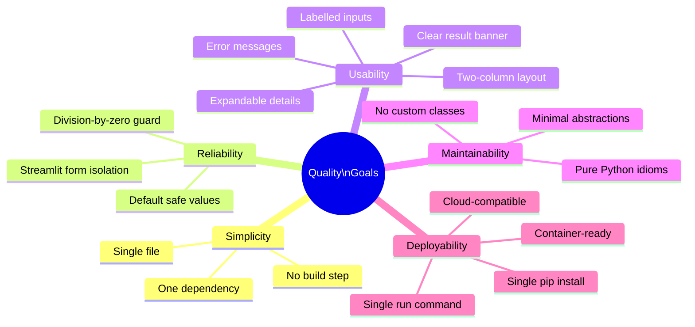

### 10.2 Quality Scenarios

| ID | Quality Attribute | Stimulus | Response | Measure |
|----|------------------|---------|----------|---------|
| QS-1 | **Reliability** | User divides by zero | Error message shown, no exception | Error banner visible within 1 render cycle (<100 ms) |
| QS-2 | **Usability** | First-time user opens the app | All controls are self-explanatory without a manual | User completes first calculation within 30 seconds |
| QS-3 | **Performance** | User clicks "Calculate" | Result displayed | < 200 ms on a standard laptop (local deployment) |
| QS-4 | **Maintainability** | Developer adds a new operation (e.g., Modulo) | Code change scoped to `app.py` | < 15 minutes for a Python developer familiar with Streamlit |
| QS-5 | **Deployability** | Developer clones repo on a new machine | App running in browser | < 3 minutes from `git clone` to `streamlit run app.py` |
| QS-6 | **Portability** | App deployed to Streamlit Community Cloud | App accessible via public URL | Deployment completes with zero config changes to `app.py` |
| QS-7 | **Security** | User attempts to inject non-numeric input | Input rejected at widget level | No server-side error; Streamlit blocks non-numeric characters |

---

## 11. Risks and Technical Debt

### 11.1 Technical Risks

| ID | Risk | Probability | Impact | Mitigation |
|----|------|-------------|--------|------------|
| R-1 | **Streamlit API Breaking Change** | Low | High | Pin Streamlit to a specific minor version (e.g., `streamlit==1.40.0`) rather than `>=1.40.0` for production deployments |
| R-2 | **Floating-Point Precision Errors** | Medium | Low | Inform users of IEEE 754 limitations in UI; consider `decimal.Decimal` for high-precision use cases |
| R-3 | **No HTTPS by Default** | Medium | Medium | Deploy behind a TLS-terminating reverse proxy (nginx, Caddy) or use Streamlit Community Cloud (HTTPS by default) |
| R-4 | **No Authentication** | Low (for internal tool) | High (if publicly exposed) | Add Streamlit authentication or network-level access controls if deployed publicly |
| R-5 | **Single Point of Failure** | Low | Medium | Containerise and use a process manager (e.g., `supervisord`, Kubernetes) for production |

### 11.2 Technical Debt

| ID | Type | Description | Priority | Estimated Effort |
|----|------|-------------|----------|-----------------|
| TD-1 | **Testability Debt** | There are no unit tests. The arithmetic logic is embedded in the Streamlit script, making it difficult to test without running the full app. Extracting arithmetic into a pure function would enable pytest coverage. | High | 2–4 hours |
| TD-2 | **Version Pinning** | `requirements.txt` uses `streamlit>=1.40.0` (unpinned upper bound). A future Streamlit major version could introduce breaking changes silently. | Medium | 30 minutes (pin to exact version + add `pip-compile`) |
| TD-3 | **No Type Annotations** | Variables such as `num1`, `num2`, `result`, `symbol`, and `operation` lack Python type hints. Adding them would improve IDE support and static analysis. | Low | 1 hour |
| TD-4 | **Hardcoded UI Strings** | All text (title, caption, labels, error messages) is hardcoded in English with no i18n support. | Low | 4–8 hours (if i18n required) |
| TD-5 | **No Logging** | No application-level logging exists. Adding `logging.getLogger(__name__)` calls would aid debugging in production. | Low | 1–2 hours |
| TD-6 | **No Dockerfile** | The app is containerisable but no `Dockerfile` is provided. This creates a gap for teams wanting to deploy via container orchestration. | Medium | 1–2 hours |
| TD-7 | **Arithmetic Logic Not Separated** | The calculation logic (`result = num1 + num2`, etc.) is directly inline with the presentation code. Extracting it to a `calculate(op, a, b)` function would improve testability and reuse. | High | 1 hour |

### 11.3 Improvement Recommendations

1. **Extract arithmetic logic** into a standalone pure function:
   ```python
   def calculate(operation: str, num1: float, num2: float) -> float:
       ...
   ```
   This enables unit testing with `pytest` and separates concerns.

2. **Add a test suite** (`tests/test_calculator.py`) with parametrised tests for all four operations and the division-by-zero edge case.

3. **Pin Streamlit version** exactly in `requirements.txt` and introduce a `requirements-dev.txt` for test dependencies.

4. **Add a `Dockerfile`** for consistent, reproducible deployments:
   ```dockerfile
   FROM python:3.11-slim
   WORKDIR /app
   COPY requirements.txt app.py ./
   RUN pip install --no-cache-dir -r requirements.txt
   EXPOSE 8501
   CMD ["streamlit", "run", "app.py", "--server.address=0.0.0.0"]
   ```

5. **Consider `st.session_state`** if calculation history (e.g., last N results) is added as a feature.

---

## 12. Glossary

### 12.1 Domain Terms

| Term | Definition |
|------|------------|
| **Addition** | Arithmetic operation computing the sum of two numbers (`num1 + num2`) |
| **Subtraction** | Arithmetic operation computing the difference of two numbers (`num1 − num2`) |
| **Multiplication** | Arithmetic operation computing the product of two numbers (`num1 × num2`) |
| **Division** | Arithmetic operation computing the quotient of two numbers (`num1 ÷ num2`); undefined when the divisor is zero |
| **Division by Zero** | The mathematical undefined operation `x / 0`; handled as a user-facing validation error in this application |
| **Operand** | One of the two numbers (`num1` or `num2`) supplied by the user as input to an arithmetic operation |
| **Operation** | The arithmetic function to apply to the two operands; selected from `[Add, Subtract, Multiply, Divide]` |
| **Result** | The computed numeric output of applying the selected operation to the two operands |
| **Expression** | The full human-readable representation of a computation, e.g., `10.0 + 5.0 = 15.0` |
| **Computation Details** | The collapsible panel displaying the full input/output dictionary for a completed calculation |

### 12.2 Technical Terms

| Term | Definition |
|------|------------|
| **Streamlit** | An open-source Python library for building interactive web applications with pure Python. It handles HTTP serving, WebSocket state synchronisation, and React-based frontend rendering. |
| **`st.form()`** | A Streamlit container that batches all enclosed widget interactions, triggering a single script re-run only when the associated submit button is clicked. |
| **`st.form_submit_button()`** | A button widget that triggers form submission and sets `submitted = True` on click. |
| **`st.number_input()`** | A Streamlit widget rendering a numeric input field in the browser, enforcing numeric-only input. |
| **`st.selectbox()`** | A Streamlit widget rendering a dropdown selector with a predefined list of options. |
| **`st.success()`** | Renders a green-highlighted success banner with the provided message string. |
| **`st.error()`** | Renders a red-highlighted error banner with the provided message string. |
| **`st.stop()`** | Immediately halts Streamlit script execution, preventing any further widget or layout rendering below the call site. |
| **`st.expander()`** | A collapsible Streamlit container that hides its contents until the user expands it. |
| **`st.columns()`** | A Streamlit layout primitive that divides the page into N equal-width vertical columns. |
| **Reactive Script Model** | Streamlit's execution model whereby the entire Python script is re-executed from top to bottom on every user interaction. |
| **Tornado** | The Python asynchronous web framework used internally by Streamlit to serve HTTP requests and WebSocket connections. |
| **IEEE 754** | The international standard for floating-point arithmetic defining how `float` values are stored and computed in Python (and most programming languages). |
| **Guard Clause** | A programming pattern where a conditional check returns (or halts) early when a precondition is not met, avoiding deeply nested logic. Used in this app for the division-by-zero check. |
| **Virtual Environment (`venv`)** | An isolated Python environment that allows project-specific dependency installation without affecting the system Python installation. |
| **`requirements.txt`** | A plain-text file listing Python package dependencies for a project, used by `pip install -r requirements.txt`. |
| **ADR (Architecture Decision Record)** | A short document capturing an important architectural decision, its context, rationale, and consequences. |
| **Arc42** | A free, open template for documenting software and system architectures, structured into 12 sections covering goals, constraints, context, building blocks, runtime, deployment, quality, risks, and glossary. |

---

## Appendix

### A. File Inventory

| File | Size | Purpose |
|------|------|---------|
| `app.py` | 50 lines | Complete application: UI layout, input handling, arithmetic logic, result rendering |
| `requirements.txt` | 1 line | Declares the single runtime dependency: `streamlit>=1.40.0` |
| `README.md` | 18 lines | Setup instructions (venv creation, pip install, streamlit run) |

### B. Source Code Reference

The complete `app.py` for reference:

```python
import streamlit as st

st.set_page_config(page_title="Calculator", page_icon="🧮", layout="centered")

st.title("Simple Calculator")
st.caption("Perform quick arithmetic with a clean Streamlit UI.")

with st.form("calculator_form"):
    col1, col2 = st.columns(2)

    with col1:
        num1 = st.number_input("First number", value=0.0, format="%.6f")
    with col2:
        num2 = st.number_input("Second number", value=0.0, format="%.6f")

    operation = st.selectbox(
        "Operation",
        ("Add", "Subtract", "Multiply", "Divide"),
        index=0,
    )

    submitted = st.form_submit_button("Calculate")

if submitted:
    if operation == "Add":
        result = num1 + num2
        symbol = "+"
    elif operation == "Subtract":
        result = num1 - num2
        symbol = "-"
    elif operation == "Multiply":
        result = num1 * num2
        symbol = "×"
    else:
        symbol = "÷"
        if num2 == 0:
            st.error("Division by zero is not allowed.")
            st.stop()
        result = num1 / num2

    st.success(f"Result: {num1} {symbol} {num2} = {result}")

    with st.expander("Computation details"):
        st.write({
            "first_number": num1,
            "second_number": num2,
            "operation": operation,
            "result": result,
        })
```

### C. Analysis Metadata

| Field | Value |
|-------|-------|
| **Analysis Date** | 2025-01-31 |
| **Files Analysed** | 3 (`app.py`, `requirements.txt`, `README.md`) |
| **Lines of Application Code** | 50 |
| **Dependencies** | 1 (`streamlit>=1.40.0`) |
| **Arc42 Sections Completed** | 12 / 12 |
| **Mermaid Diagrams Included** | 12 |
| **Architecture Agent** | GenInsights Arc42 Agent |
| **Document Format** | Markdown (Arc42 template) |

---

*This document was automatically generated by the GenInsights Arc42 Agent through direct source-code analysis of the Streamlit Calculator App repository.*  
*Template: Arc42 — https://arc42.org*
