# Architecture Documentation (Arc42)

**Project**: Streamlit Calculator Web Application  
**Version**: 1.0.0  
**Date**: 2025-01-01  
**Generated by**: Arc42 Documentation Generator  
**Source Repository**: `/home/runner/work/github-copilot-test/github-copilot-test`

---

## Table of Contents

1. [Introduction and Goals](#1-introduction-and-goals)
2. [Architecture Constraints](#2-architecture-constraints)
3. [Context and Scope](#3-context-and-scope)
4. [Solution Strategy](#4-solution-strategy)
5. [Building Block View](#5-building-block-view)
6. [Runtime View](#6-runtime-view)
7. [Deployment View](#7-deployment-view)
8. [Cross-cutting Concepts](#8-cross-cutting-concepts)
9. [Architecture Decisions](#9-architecture-decisions)
10. [Quality Requirements](#10-quality-requirements)
11. [Risks and Technical Debt](#11-risks-and-technical-debt)
12. [Glossary](#12-glossary)

---

## 1. Introduction and Goals

### 1.1 Purpose and Overview

The **Streamlit Calculator** is a lightweight, browser-based arithmetic calculator implemented as a single-page web application using the Python Streamlit framework. It provides end users with a clean, interactive interface to perform the four fundamental arithmetic operations — addition, subtraction, multiplication, and division — on two floating-point numbers.

The application prioritises simplicity, zero-infrastructure overhead, and instant deployability. It is well-suited for educational demonstrations of Streamlit, internal tooling prototypes, or personal productivity utilities.

### 1.2 Goals

| ID  | Goal                          | Description                                                                                  |
|-----|-------------------------------|----------------------------------------------------------------------------------------------|
| G-1 | Functional Arithmetic         | Support Add, Subtract, Multiply, and Divide operations on two floating-point operands.       |
| G-2 | Safe Error Handling           | Detect and communicate division-by-zero gracefully without crashing the application.         |
| G-3 | Transparent Computation       | Surface a detailed breakdown of each computation (operands, symbol, result) to the user.    |
| G-4 | Minimal Dependency Footprint  | Rely on a single third-party dependency (`streamlit`) to reduce maintenance surface area.   |
| G-5 | Instant Startup               | Allow any developer or operator to run the application with a single command.               |

### 1.3 Quality Goals

| Priority | Quality Attribute | Motivation                                                                        |
|----------|-------------------|-----------------------------------------------------------------------------------|
| 1        | Usability         | Centred layout, clear labels, and inline error messages ensure intuitive UX.      |
| 2        | Reliability       | Division-by-zero guard prevents runtime exceptions reaching the user.             |
| 3        | Maintainability   | Single-file design (~50 lines) allows any Python developer to understand quickly. |
| 4        | Portability       | Pure Python + pip — runs on any OS with Python 3.8+ installed.                   |

### 1.4 Stakeholders

| Role                   | Expectations                                                                              |
|------------------------|-------------------------------------------------------------------------------------------|
| **End User**           | A responsive, error-tolerant UI with immediate calculation feedback.                      |
| **Developer / Author** | Clean, idiomatic Streamlit code that is trivial to extend with new operations.            |
| **DevOps / Operator**  | A single `pip install` + `streamlit run` deployment with no database or server config.    |
| **Reviewer / Assessor**| Well-structured code serving as a reference for Streamlit application conventions.        |

---

## 2. Architecture Constraints

### 2.1 Technical Constraints

| ID   | Constraint                                | Rationale                                                                                        |
|------|-------------------------------------------|--------------------------------------------------------------------------------------------------|
| TC-1 | Python runtime required (≥ 3.8)          | Streamlit 1.40+ requires Python 3.8 or higher.                                                  |
| TC-2 | Streamlit ≥ 1.40.0                        | Declared in `requirements.txt`; minimum version for stable `st.form` and `st.columns` support. |
| TC-3 | Single-file application (`app.py`)        | All application logic resides in one file; no package or module structure is used.              |
| TC-4 | No persistent storage                     | The application is stateless — calculations are not stored between sessions or page reloads.   |
| TC-5 | No authentication or authorisation layer  | The application is designed for open, local, or trusted-network access only.                   |
| TC-6 | Browser-based UI only                     | Interaction occurs exclusively through a web browser; no CLI or API interface is provided.     |
| TC-7 | Floating-point arithmetic (Python native) | Calculations use Python's built-in `float` type; no arbitrary-precision library is used.       |

### 2.2 Organisational Constraints

| ID   | Constraint                             | Rationale                                                                           |
|------|----------------------------------------|-------------------------------------------------------------------------------------|
| OC-1 | Dependency pinning via `requirements.txt` | All third-party packages must be declared and version-constrained in this file. |
| OC-2 | Virtual-environment recommended        | README guidance mandates use of a Python virtual environment for isolation.        |
| OC-3 | Default Streamlit port (8501)          | Application runs on `localhost:8501` by default unless overridden at runtime.      |

### 2.3 Conventions

- **Code style**: Implicit PEP 8 compliance (short, flat structure with no class definitions).
- **Number formatting**: Inputs are formatted to 6 decimal places (`%.6f`).
- **Operation symbols**: Unicode characters are used for display (`×`, `÷`, `+`, `-`).

---

## 3. Context and Scope

### 3.1 Business Context

The calculator operates as a self-contained system with no external integrations. Users interact with it entirely through their web browser, and all computation is performed server-side by the Python process.

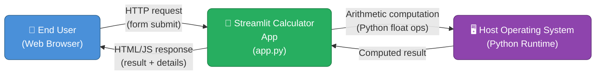

**External Actors:**

| Actor           | Role                                                                                   | Interface         |
|-----------------|----------------------------------------------------------------------------------------|-------------------|
| **End User**    | Provides two numbers and selects an operation; receives the result.                   | Web browser (HTTP)|
| **Host OS/Runtime** | Executes the Python process; provides native floating-point arithmetic.          | Python interpreter|

### 3.2 Technical Context

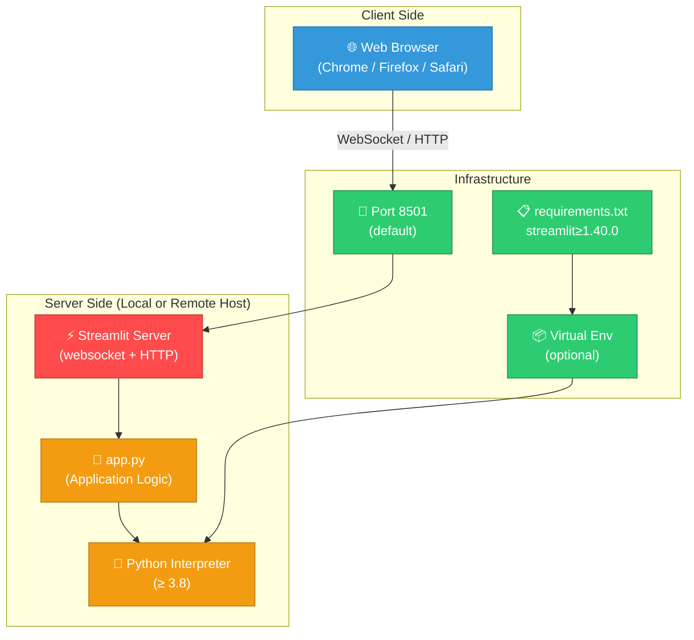

**Technical Interfaces:**

| Interface        | Protocol   | Description                                                         |
|------------------|------------|---------------------------------------------------------------------|
| Browser ↔ Server | HTTP + WebSocket | Streamlit's built-in tornado server handles all communication. |
| Python runtime   | In-process | `app.py` is executed directly by the Python interpreter.            |

---

## 4. Solution Strategy

### 4.1 Technology Decisions

| Decision                          | Choice                   | Rationale                                                                                       |
|-----------------------------------|--------------------------|-------------------------------------------------------------------------------------------------|
| **UI Framework**                  | Streamlit                | Provides a complete web UI in pure Python, eliminating the need for HTML/CSS/JS development.   |
| **Language**                      | Python 3                 | Universally available, readable, and natively supported by Streamlit.                         |
| **Architecture style**            | Single-file script       | Appropriate for a utility of this scope; avoids premature abstraction overhead.                |
| **State management**              | Streamlit form (stateless per submit) | Each calculation is a fresh, isolated computation — no server-side session state needed. |
| **Error handling strategy**       | Early exit with `st.stop()` | Prevents further page rendering when a fatal input error (division by zero) is detected.  |
| **Number representation**         | Python `float` (IEEE 754) | Sufficient precision for typical arithmetic; no need for `Decimal` or `fractions` modules.   |

### 4.2 Top-Level Decomposition

The solution is deliberately **un-decomposed** at the module level. The entire application logic lives in `app.py` and follows a linear, top-to-bottom execution model characteristic of Streamlit scripts:

1. **Page configuration** — sets title, icon, and layout.
2. **Input collection** — renders the form with two number inputs and an operation selector.
3. **Computation** — evaluates the selected operation once the form is submitted.
4. **Output rendering** — displays the result and expandable computation details.

### 4.3 Approach to Quality Goals

| Quality Goal    | Strategy Applied                                                                                 |
|-----------------|--------------------------------------------------------------------------------------------------|
| Usability       | `layout="centered"`, two-column inputs, descriptive labels, `st.success` / `st.error` feedback. |
| Reliability     | Explicit `num2 == 0` guard before division; `st.stop()` halts rendering on error.               |
| Maintainability | ≤ 50 lines, no custom classes, idiomatic Streamlit patterns.                                    |
| Portability     | Standard `pip install` + single command launch; no OS-specific code.                           |

---

## 5. Building Block View

### 5.1 Level 1 — System Overview

At the highest level, the system comprises a single deployable unit: the Python script `app.py`, served by the Streamlit runtime.

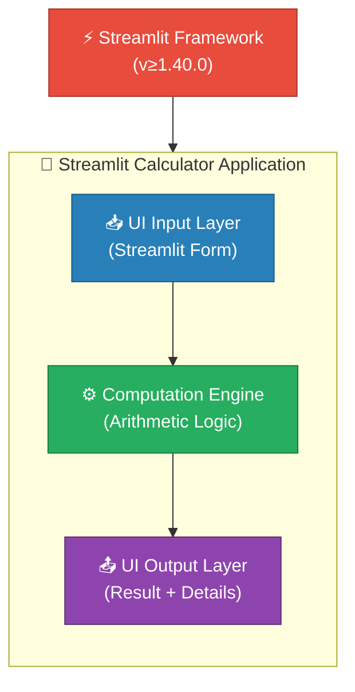

### 5.2 Level 2 — Internal Structure of `app.py`

The file is structured as a sequence of logical blocks:

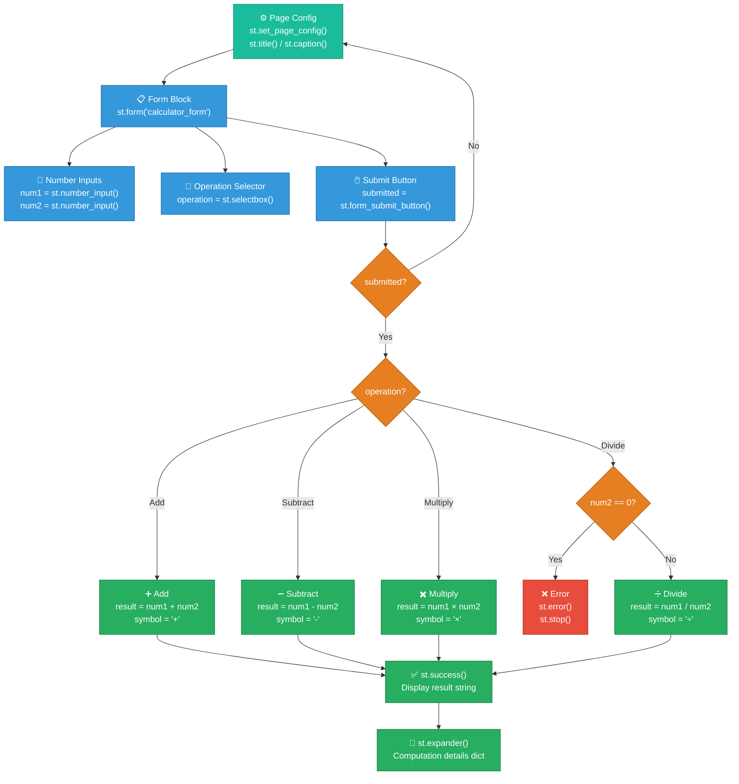

### 5.3 Component Responsibilities

| Component               | Source Location | Responsibility                                                                                 |
|-------------------------|-----------------|-----------------------------------------------------------------------------------------------|
| **Page Configuration**  | `app.py:3`      | Sets browser tab title ("Calculator"), page icon (🧮), and centred layout.                   |
| **Form Block**          | `app.py:8–22`   | Groups all inputs and the submit button so the page only re-renders on explicit submission.   |
| **Number Input — num1** | `app.py:12`     | Accepts the first floating-point operand; defaults to `0.0`.                                  |
| **Number Input — num2** | `app.py:14`     | Accepts the second floating-point operand; defaults to `0.0`.                                 |
| **Operation Selector**  | `app.py:16–20`  | Dropdown offering Add / Subtract / Multiply / Divide; defaults to Add.                        |
| **Computation Branch**  | `app.py:24–39`  | Evaluates the selected operation; guards against division by zero.                            |
| **Result Display**      | `app.py:41`     | Renders `st.success` banner with the full expression and result.                              |
| **Detail Expander**     | `app.py:43–48`  | Provides a collapsible JSON-like dict showing operands, operation name, and result.           |

---

## 6. Runtime View

### 6.1 Happy Path — Successful Calculation

The following sequence describes a complete, successful interaction where the user calculates `6 ÷ 2`.

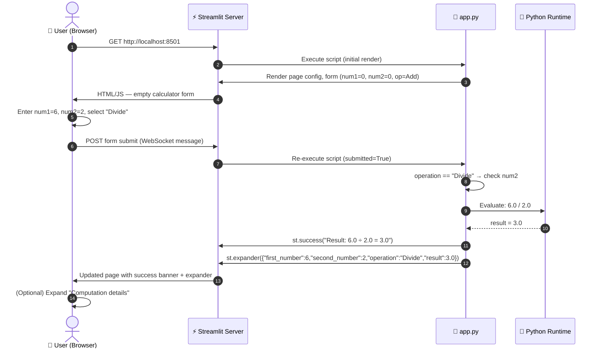

### 6.2 Error Path — Division by Zero

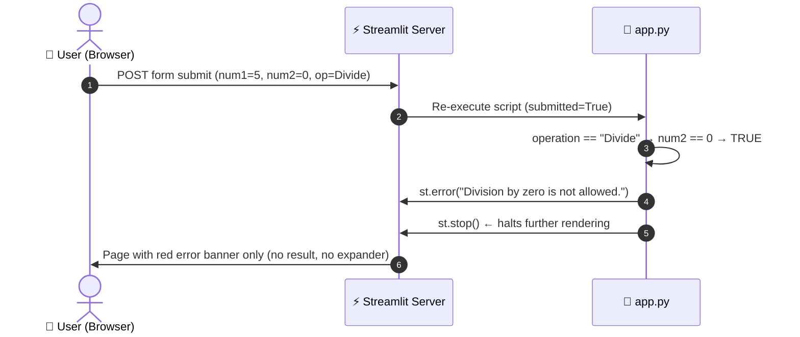

### 6.3 Streamlit Re-execution Model (Flowchart)

Streamlit re-runs the entire `app.py` script on every user interaction. The following diagram shows the full execution lifecycle:

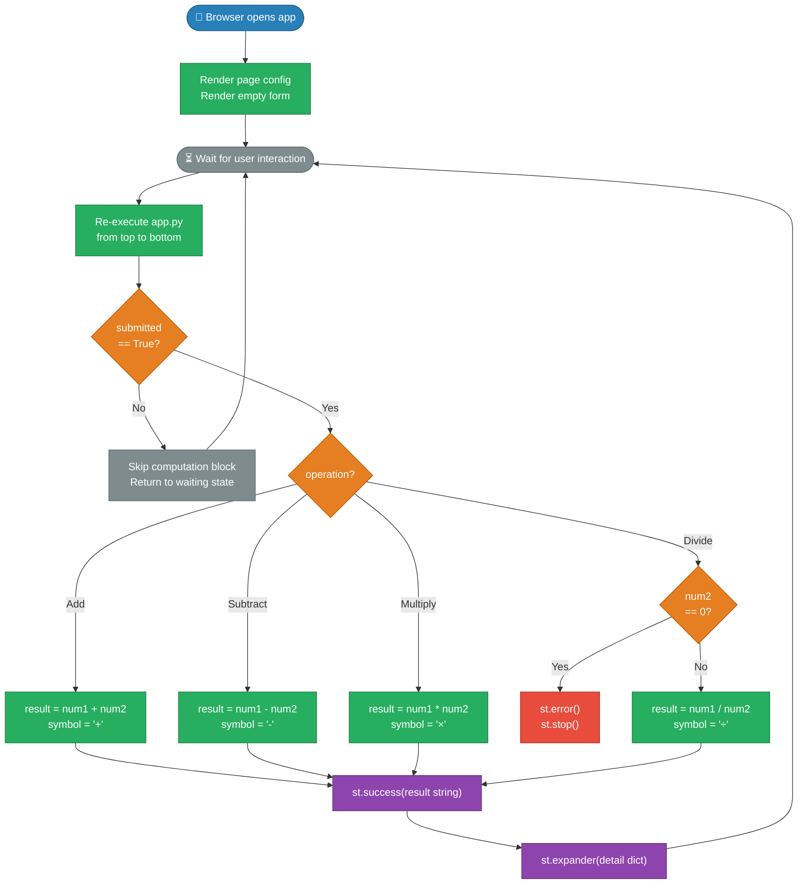

### 6.4 Runtime Scenarios Summary

| Scenario                   | Trigger                            | Outcome                                                  |
|----------------------------|------------------------------------|----------------------------------------------------------|
| Initial page load          | User opens URL                     | Empty form rendered; `submitted = False`                 |
| Add / Subtract / Multiply  | Submit with any valid num2         | `st.success` with full expression; expander with details |
| Divide (valid)             | Submit with `num2 ≠ 0`             | Same as above with `÷` symbol                            |
| Divide by zero             | Submit with `num2 == 0`, op=Divide | `st.error` message; `st.stop()` halts rendering          |
| Page refresh               | Browser reload                     | State reset; form returns to default values              |

---

## 7. Deployment View

### 7.1 Deployment Topology

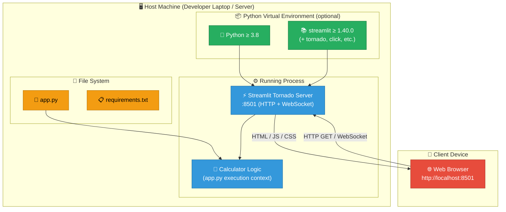

### 7.2 Deployment Steps

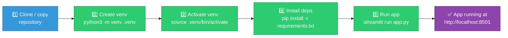

### 7.3 Infrastructure Requirements

| Requirement             | Value / Notes                                               |
|-------------------------|-------------------------------------------------------------|
| **Operating System**    | Any OS with Python support (Linux, macOS, Windows)          |
| **Python Version**      | ≥ 3.8                                                       |
| **Streamlit Version**   | ≥ 1.40.0                                                    |
| **Network Port**        | TCP 8501 (default; configurable via `--server.port`)        |
| **RAM**                 | ~100–150 MB (Streamlit overhead)                            |
| **Disk Space**          | ~50 MB (Streamlit + dependencies)                           |
| **Internet Access**     | Only needed for initial `pip install`; runtime is offline   |
| **Database**            | None                                                        |
| **Persistent Storage**  | None                                                        |

### 7.4 Alternative Deployment Options

| Option                     | Command / Method                                              | Notes                                                  |
|----------------------------|---------------------------------------------------------------|--------------------------------------------------------|
| **Local dev (default)**    | `streamlit run app.py`                                        | Runs on `localhost:8501`                               |
| **Custom port**            | `streamlit run app.py --server.port 9000`                     | Useful when 8501 is occupied                           |
| **Streamlit Community Cloud** | Connect GitHub repo; set `app.py` as entrypoint          | Free, zero-infra public deployment                     |
| **Docker container**       | `FROM python:3.11-slim` + pip install + CMD streamlit run    | Reproducible, isolated container deployment            |
| **Remote server**          | `streamlit run app.py --server.address 0.0.0.0`               | Exposes app on all network interfaces                  |

---

## 8. Cross-cutting Concepts

### 8.1 Error Handling Strategy

The application uses Streamlit's built-in UI feedback components for error communication rather than Python exceptions or logging frameworks:

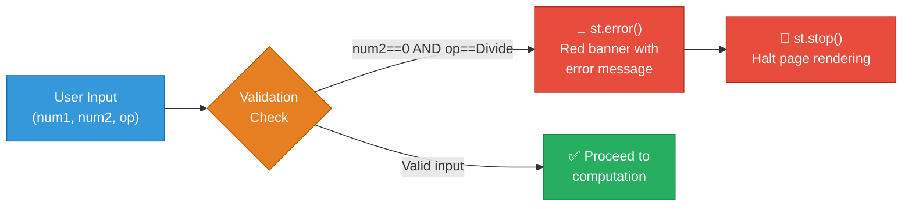

**Error handling principles applied:**
- **Fail fast**: The division-by-zero check occurs before the division operation.
- **User-friendly messages**: Errors are presented in natural language ("Division by zero is not allowed."), not as Python tracebacks.
- **Rendering halt**: `st.stop()` ensures no partial or misleading output appears below the error.

### 8.2 State Management

Streamlit's execution model is inherently **stateless per script run**. The application explicitly relies on this:

| Aspect                    | Approach                                                                                   |
|---------------------------|--------------------------------------------------------------------------------------------|
| **Form state**            | `st.form()` batches widget updates and only triggers re-run on `st.form_submit_button()`. |
| **Computation state**     | No server-side session storage; result is re-computed on every submit.                    |
| **Default values**        | Widget defaults (`value=0.0`) serve as the initial state on first render.                 |
| **Between-session state** | None — closing the browser tab discards all state.                                        |

### 8.3 UI/UX Conventions

| Convention              | Implementation                                                                 |
|-------------------------|--------------------------------------------------------------------------------|
| Centred layout          | `st.set_page_config(layout="centered")`                                        |
| Two-column input        | `col1, col2 = st.columns(2)` — side-by-side inputs for natural form flow      |
| 6-decimal precision     | `format="%.6f"` — consistent display of floating-point inputs                 |
| Unicode math symbols    | `+`, `-`, `×`, `÷` used in result string for mathematical clarity             |
| Expandable details      | `st.expander` keeps the UI clean while providing transparency on request       |
| Feedback colour coding  | `st.success` (green) for results, `st.error` (red) for errors                 |

### 8.4 Data Model

Although there is no explicit class or data structure, the implicit data model of a single computation is:

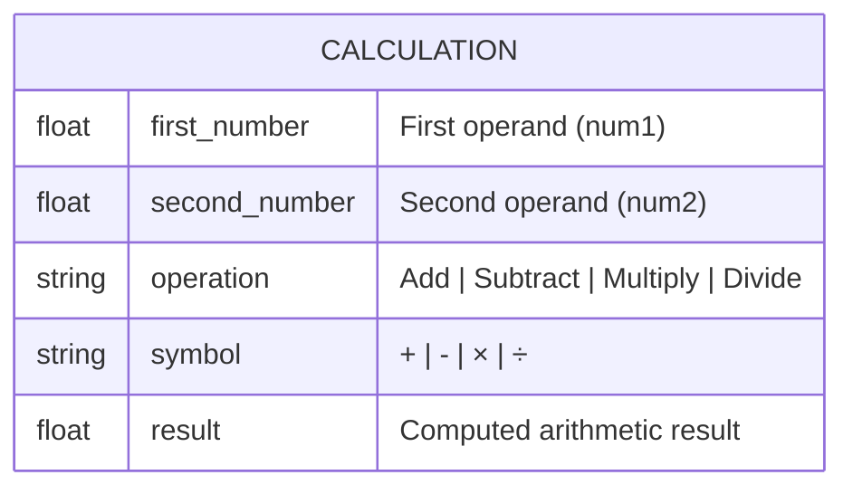

This ephemeral record is constructed in memory during each form submission and surfaced to the user via the expander detail view as a Python dictionary.

### 8.5 Arithmetic Domain Rules

| Rule ID | Business Rule                                     | Implementation             |
|---------|---------------------------------------------------|----------------------------|
| BR-01   | Addition: `result = num1 + num2`                  | `app.py:26`                |
| BR-02   | Subtraction: `result = num1 - num2`               | `app.py:29`                |
| BR-03   | Multiplication: `result = num1 * num2`            | `app.py:32`                |
| BR-04   | Division: `result = num1 / num2`                  | `app.py:39`                |
| BR-05   | Division by zero is **forbidden**                 | `app.py:36–38` (guard + `st.stop()`) |
| BR-06   | Both operands default to `0.0` on first load      | `app.py:12, 14`            |
| BR-07   | Default operation is **Add** (index=0)            | `app.py:20`                |

---

## 9. Architecture Decisions

### ADR-001 — Use Streamlit as the Sole Framework

| Attribute   | Detail                                                                                             |
|-------------|----------------------------------------------------------------------------------------------------|
| **Status**  | Accepted                                                                                           |
| **Context** | A simple calculator UI needs to be built quickly with minimal boilerplate.                        |
| **Decision**| Use Streamlit as the only framework; no Flask, FastAPI, or frontend framework.                    |
| **Rationale**| Streamlit provides a complete, browser-renderable UI with pure Python syntax. Zero HTML/CSS/JS required. Ideal for utility tools and rapid prototypes. |
| **Consequences** | (+) Single dependency; fast development. (−) Limited UI customisation; no REST API exposed; all UI must be in Python. |

---

### ADR-002 — Single-File Architecture

| Attribute   | Detail                                                                                             |
|-------------|----------------------------------------------------------------------------------------------------|
| **Status**  | Accepted                                                                                           |
| **Context** | The application has ~50 lines of logic with no external integrations.                             |
| **Decision**| Keep all code in `app.py`; do not create packages, modules, or service layers.                   |
| **Rationale**| For an application of this scope, additional file/module structure would introduce unnecessary complexity. A single file maximises readability. |
| **Consequences** | (+) Zero onboarding friction; instantly comprehensible. (−) Does not scale well if new operations, persistence, or APIs are required in the future. |

---

### ADR-003 — Stateless, Form-Driven Interaction Model

| Attribute   | Detail                                                                                             |
|-------------|----------------------------------------------------------------------------------------------------|
| **Status**  | Accepted                                                                                           |
| **Context** | Streamlit re-runs the entire script on every widget change by default.                            |
| **Decision**| Wrap all inputs in `st.form()` so re-execution only occurs on explicit "Calculate" button press.  |
| **Rationale**| Prevents redundant computations and partial result flickers on each keystroke in the number inputs. |
| **Consequences** | (+) Predictable, intentional computation flow. (−) Users must click "Calculate" after every change — no live/reactive updates. |

---

### ADR-004 — Use `st.stop()` for Error Termination

| Attribute   | Detail                                                                                             |
|-------------|----------------------------------------------------------------------------------------------------|
| **Status**  | Accepted                                                                                           |
| **Context** | On a division-by-zero error, the page should not attempt to render result components.             |
| **Decision**| Call `st.stop()` immediately after `st.error()` to halt script execution.                        |
| **Rationale**| Prevents `result` variable being undefined and causing an `UnboundLocalError` if execution were to continue. Also ensures no confusing partial output is shown below the error. |
| **Consequences** | (+) Clean, safe error UX. (−) Any code added after `st.stop()` in future would silently never execute. |

---

### ADR-005 — Python `float` for All Arithmetic

| Attribute   | Detail                                                                                             |
|-------------|----------------------------------------------------------------------------------------------------|
| **Status**  | Accepted                                                                                           |
| **Context** | The calculator must handle decimal numbers.                                                       |
| **Decision**| Use Python's native `float` (IEEE 754 double precision) for all calculations.                    |
| **Rationale**| For a general-purpose, non-financial calculator, `float` precision (15–17 significant digits) is more than adequate. Using `decimal.Decimal` would add complexity without user-visible benefit. |
| **Consequences** | (+) Simple, dependency-free arithmetic. (−) Standard floating-point rounding artefacts may appear for edge-case inputs (e.g., `0.1 + 0.2`). |

---

## 10. Quality Requirements

### 10.1 Quality Tree

```mermaid
graph TB
    classDef root fill:#2C3E50,stroke:#1A252F,color:#fff
    classDef cat fill:#2980B9,stroke:#1A5C8A,color:#fff
    classDef leaf fill:#27AE60,stroke:#1A7A40,color:#fff
    classDef risk fill:#E74C3C,stroke:#A93226,color:#fff

    ROOT["⭐ Software Quality\n(Streamlit Calculator)"]:::root

    U["🖥️ Usability"]:::cat
    R["🛡️ Reliability"]:::cat
    M["🔧 Maintainability"]:::cat
    P["📦 Portability"]:::cat
    PE["⚡ Performance"]:::cat

    U1["Centred, clean layout\n✅ Achieved"]:::leaf
    U2["Clear input labels\n✅ Achieved"]:::leaf
    U3["Inline error feedback\n✅ Achieved"]:::leaf
    U4["Computation transparency\n✅ Achieved (expander)"]:::leaf

    R1["Division-by-zero guard\n✅ Achieved"]:::leaf
    R2["No unhandled exceptions\n✅ Achieved (st.stop)"]:::leaf
    R3["Consistent default state\n✅ Achieved (value=0.0)"]:::leaf

    M1["Single-file ≤50 lines\n✅ Achieved"]:::leaf
    M2["No custom classes\n✅ Achieved"]:::leaf
    M3["Idiomatic Streamlit\n✅ Achieved"]:::leaf

    P1["Cross-OS (Python)\n✅ Achieved"]:::leaf
    P2["pip-installable\n✅ Achieved"]:::leaf
    P3["Docker-ready\n⚠️ Not yet configured"]:::risk

    PE1["Sub-second response\n✅ Achieved (local)"]:::leaf
    PE2["Scalability\n⚠️ Single process only"]:::risk

    ROOT --> U & R & M & P & PE
    U --> U1 & U2 & U3 & U4
    R --> R1 & R2 & R3
    M --> M1 & M2 & M3
    P --> P1 & P2 & P3
    PE --> PE1 & PE2
```

### 10.2 Quality Scenarios

| ID    | Quality Attribute | Scenario                                                       | Expected Response                                                  | Status      |
|-------|-------------------|----------------------------------------------------------------|--------------------------------------------------------------------|-------------|
| QS-01 | Usability         | User enters two numbers and clicks Calculate                   | Result displayed within 1 second with success banner               | ✅ Met       |
| QS-02 | Usability         | User wants to inspect the computation                          | "Computation details" expander shows operands, operation, result   | ✅ Met       |
| QS-03 | Reliability       | User enters `num2=0` and selects Divide                        | Red error banner; no crash; no partial result shown                | ✅ Met       |
| QS-04 | Reliability       | User submits form without changing defaults                    | `0.0 + 0.0 = 0.0` calculated and displayed correctly              | ✅ Met       |
| QS-05 | Maintainability   | New developer reads `app.py` for the first time                | Fully understood within 5 minutes; no external docs required       | ✅ Met       |
| QS-06 | Portability       | Developer sets up app on a new machine                         | Running with 3 commands (`venv`, `pip install`, `streamlit run`)   | ✅ Met       |
| QS-07 | Performance       | Arithmetic computation time                                    | < 10 ms for any supported operation                                | ✅ Met       |
| QS-08 | Portability       | Containerised deployment                                       | Docker image can be built and run without modification             | ⚠️ Partial  |

### 10.3 Code Metrics

| Metric                        | Value       | Assessment                    |
|-------------------------------|-------------|-------------------------------|
| Total lines of code (`app.py`)| 50          | ✅ Minimal                     |
| Number of functions/classes   | 0           | ✅ Appropriate for this scope  |
| Cyclomatic complexity         | ~5          | ✅ Low (4 operation branches + 1 error branch) |
| External dependencies         | 1           | ✅ Minimal                     |
| Test coverage                 | 0%          | ⚠️ No automated tests present |
| Documentation (inline)        | 0 comments  | ⚠️ Self-documenting but no docstrings |

---

## 11. Risks and Technical Debt

### 11.1 Identified Risks

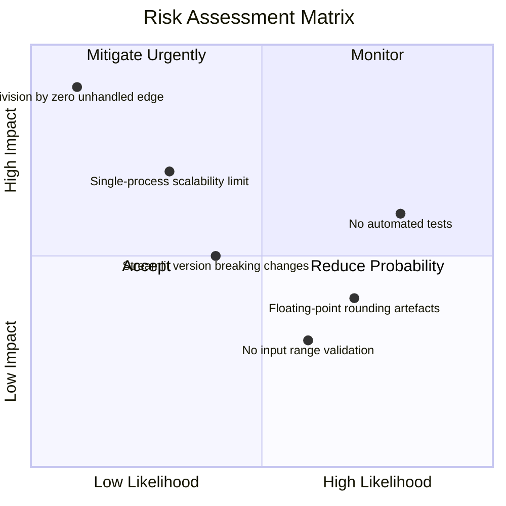

| Risk ID | Risk Description                          | Likelihood | Impact | Mitigation                                                                        |
|---------|-------------------------------------------|------------|--------|-----------------------------------------------------------------------------------|
| R-01    | **No automated tests**                    | High       | Medium | Add `pytest` unit tests for each arithmetic branch; mock Streamlit components.   |
| R-02    | **Floating-point rounding artefacts**     | Medium     | Low    | Document known behaviour; optionally use `round()` or `decimal.Decimal` if precision matters. |
| R-03    | **Streamlit API breaking changes**        | Medium     | Medium | Pin to a specific Streamlit minor version; add CI dependency update checks.      |
| R-04    | **Single-process scalability**            | Low        | High   | For multi-user scenarios, deploy behind a load balancer or migrate to a stateless API. |
| R-05    | **No input range validation**             | Medium     | Low    | Add `min_value` / `max_value` constraints to `st.number_input` if overflow is a concern. |
| R-06    | **Division-by-zero edge (other ops)**     | Very Low   | High   | Currently only Divide is guarded; Add/Subtract/Multiply have no overflow guards. |

### 11.2 Technical Debt

| Debt ID | Item                                  | Category         | Effort | Priority | Description                                                                                 |
|---------|---------------------------------------|------------------|--------|----------|---------------------------------------------------------------------------------------------|
| TD-01   | No unit/integration tests             | Testing          | Low    | High     | `app.py` has zero automated test coverage; business logic is not independently testable.   |
| TD-02   | Arithmetic logic not separated        | Architecture     | Low    | Medium   | The `if/elif` computation block is embedded in the UI script; should be a pure function.   |
| TD-03   | No `Dockerfile` or `docker-compose.yml`| DevOps          | Low    | Medium   | Container deployment requires manual setup; a `Dockerfile` would enable reproducible deploys. |
| TD-04   | No CI/CD pipeline                     | DevOps           | Medium | Medium   | No automated linting, testing, or deployment pipeline (e.g., GitHub Actions).              |
| TD-05   | No `.streamlit/config.toml`           | Configuration    | Low    | Low      | Streamlit server settings (port, theme) are not version-controlled.                        |
| TD-06   | No inline code comments               | Documentation    | Low    | Low      | The code is self-documenting but lacks docstrings or section comments for new contributors. |
| TD-07   | Hardcoded default values              | Flexibility      | Low    | Low      | `value=0.0` and `index=0` are hardcoded; could be externalised to a config if defaults change. |

### 11.3 Recommended Next Steps

1. **[HIGH]** Extract the arithmetic logic into a pure Python function (e.g., `calculate(num1, num2, operation) -> float`) and add unit tests with `pytest`.
2. **[HIGH]** Create a `Dockerfile` and add a GitHub Actions workflow for automated testing and linting (`flake8` or `ruff`).
3. **[MEDIUM]** Add a `.streamlit/config.toml` with a defined theme to make the visual configuration reproducible.
4. **[LOW]** Consider adding `min_value` and `max_value` guards to `st.number_input` for extreme float values.

---

## 12. Glossary

| Term                        | Definition                                                                                                   |
|-----------------------------|--------------------------------------------------------------------------------------------------------------|
| **Streamlit**               | An open-source Python framework for building interactive web applications without HTML/CSS/JS.               |
| **`app.py`**                | The single source file containing all application logic for this calculator.                                 |
| **`st.form()`**             | A Streamlit component that groups widgets and defers re-execution until the form's submit button is pressed. |
| **`st.form_submit_button()`** | A button within an `st.form()` that triggers the Streamlit script re-run when clicked.                    |
| **`st.number_input()`**     | A Streamlit widget that renders a numeric input field accepting integer or float values.                    |
| **`st.selectbox()`**        | A Streamlit widget rendering a dropdown selector for choosing one item from a list.                         |
| **`st.success()`**          | A Streamlit component that displays a green-highlighted success message on the page.                        |
| **`st.error()`**            | A Streamlit component that displays a red-highlighted error message on the page.                            |
| **`st.expander()`**         | A Streamlit component that renders a collapsible/expandable panel for optional content.                     |
| **`st.stop()`**             | A Streamlit function that halts further execution of the current script run immediately.                    |
| **`submitted`**             | A boolean variable set to `True` when the form submit button is clicked; gates all computation logic.       |
| **Operand**                 | A numeric value on which an arithmetic operation is performed (referred to as `num1` and `num2` in code).   |
| **Operation**               | One of the four arithmetic functions: Add, Subtract, Multiply, or Divide.                                   |
| **Symbol**                  | The Unicode character used to represent an operation in the result string: `+`, `-`, `×`, or `÷`.          |
| **Result**                  | The computed floating-point output of applying the selected operation to the two operands.                  |
| **Division by Zero**        | An undefined arithmetic condition where a number is divided by zero; detected and rejected by the app.      |
| **Re-execution model**      | Streamlit's behaviour of re-running the full Python script from top to bottom on every user interaction.    |
| **Virtual environment**     | An isolated Python environment (created via `python3 -m venv`) that scopes package installations locally.   |
| **IEEE 754**                | The international standard for floating-point arithmetic used by Python's `float` type.                    |
| **Cyclomatic complexity**   | A software metric measuring the number of linearly independent paths through a program's source code.       |
| **ADR**                     | Architecture Decision Record — a document capturing an important architectural choice and its rationale.    |
| **Arc42**                   | A template for architecture communication and documentation, structured into 12 standard sections.         |
| **BPMN**                    | Business Process Model and Notation — a graphical standard for representing business workflows.             |
| **C4 Model**                | A hierarchical approach to visualising software architecture at four levels: Context, Container, Component, Code. |

---

*Documentation generated by the **Arc42 Documentation Generator** agent.*  
*Source: `/home/runner/work/github-copilot-test/github-copilot-test`*  
*All diagrams rendered with [Mermaid](https://mermaid.js.org/).*
