# Architecture Documentation (Arc42)

**Project**: Streamlit Calculator App  
**Version**: 1.0.0  
**Date**: 2025-01-01  
**Generated by**: Arc42 Documentation Generator  
**Source Repository**: `/home/runner/work/github-copilot-test/github-copilot-test`

---

## Table of Contents

1. [Introduction and Goals](#1-introduction-and-goals)
2. [Constraints](#2-constraints)
3. [Context and Scope](#3-context-and-scope)
4. [Solution Strategy](#4-solution-strategy)
5. [Building Block View](#5-building-block-view)
6. [Runtime View](#6-runtime-view)
7. [Deployment View](#7-deployment-view)
8. [Crosscutting Concepts](#8-crosscutting-concepts)
9. [Architecture Decisions](#9-architecture-decisions)
10. [Quality Requirements](#10-quality-requirements)
11. [Risks and Technical Debt](#11-risks-and-technical-debt)
12. [Glossary](#12-glossary)

---

## 1. Introduction and Goals

> **Sources analysed**: `app.py`, `README.md`, `requirements.txt`

### 1.1 Requirements Overview

The **Streamlit Calculator App** is a lightweight, browser-based arithmetic calculator delivered as a single-page web application. It provides end-users with a clean, form-driven interface to perform the four fundamental arithmetic operations: **Addition**, **Subtraction**, **Multiplication**, and **Division**.

The application was designed with the following functional requirements:

| ID   | Requirement                                                                 | Status      |
|------|-----------------------------------------------------------------------------|-------------|
| FR-1 | Accept two floating-point numbers as operands                               | ✅ Implemented |
| FR-2 | Support Add, Subtract, Multiply, and Divide operations                      | ✅ Implemented |
| FR-3 | Display the full arithmetic expression and result upon submission            | ✅ Implemented |
| FR-4 | Guard against division-by-zero with a user-friendly error message           | ✅ Implemented |
| FR-5 | Provide an expandable details panel showing the full computation breakdown  | ✅ Implemented |

### 1.2 Quality Goals

The top quality goals for this system, derived from code structure and technology choices, are:

| Priority | Quality Goal       | Motivation                                                                                     |
|----------|--------------------|-----------------------------------------------------------------------------------------------|
| 1        | **Correctness**    | Arithmetic results must be mathematically accurate; division-by-zero must be safely handled.  |
| 2        | **Usability**      | The UI is form-based with clear labels, sensible defaults, and immediate visual feedback.      |
| 3        | **Simplicity**     | Single-file architecture minimises operational complexity and onboarding friction.             |
| 4        | **Maintainability**| Standard Python and a well-documented framework (Streamlit) keep future changes low-cost.     |
| 5        | **Portability**    | Pure-Python + pip dependency model allows the app to run on any OS with Python 3 installed.   |

### 1.3 Stakeholders

| Stakeholder          | Role / Interest                                                                  |
|----------------------|----------------------------------------------------------------------------------|
| **End User**         | Performs arithmetic calculations via the browser UI.                             |
| **Developer**        | Maintains and extends the application; owns `app.py`.                            |
| **DevOps / Operator**| Deploys and runs the Streamlit server (local or cloud).                          |
| **Architect**        | Evaluates the design for scalability, quality, and technical debt.               |

---

## 2. Constraints

> **Sources analysed**: `requirements.txt`, `app.py`, `README.md`

### 2.1 Technical Constraints

| ID    | Constraint                          | Rationale / Impact                                                                                 |
|-------|-------------------------------------|----------------------------------------------------------------------------------------------------|
| TC-1  | **Python 3** runtime required       | Streamlit is a Python-only framework; the application is written in Python 3 syntax.               |
| TC-2  | **Streamlit ≥ 1.40.0**              | The sole declared dependency; the UI abstraction, server, and session model are all Streamlit-provided. |
| TC-3  | **Browser-based execution only**    | The rendering layer runs entirely in the user's web browser; no native desktop client is supported. |
| TC-4  | **Stateless session model**         | Streamlit re-runs the entire script on each user interaction; no persistent state or database is used. |
| TC-5  | **Single Python module**            | All application logic lives in `app.py`; no package/module structure is present.                  |
| TC-6  | **No external APIs or services**    | The application is fully self-contained; it makes no network calls beyond serving the UI.         |
| TC-7  | **IEEE 754 double-precision floats**| Python's `float` type is used; results are subject to standard floating-point precision limits.    |

### 2.2 Organisational Constraints

| ID    | Constraint                          | Rationale / Impact                                                                                 |
|-------|-------------------------------------|----------------------------------------------------------------------------------------------------|
| OC-1  | **Minimal dependency footprint**    | Only one third-party library is declared, reducing supply-chain risk.                              |
| OC-2  | **No authentication / authorisation** | The app is intended for open, local, or trusted-network use; no login mechanism exists.           |
| OC-3  | **No logging or monitoring**        | No structured logging, metrics, or tracing is implemented.                                         |

### 2.3 Conventions

| Convention                               | Observed In      |
|------------------------------------------|------------------|
| `st.form` pattern for batched input submission | `app.py` L8–22 |
| `st.columns` for side-by-side inputs     | `app.py` L9–14   |
| `st.stop()` for early exit on error      | `app.py` L38     |
| `st.expander` for optional detail views  | `app.py` L43–49  |
| Six decimal places for float display     | `app.py` L12–13  |

---

## 3. Context and Scope

> **Sources analysed**: `app.py`, `README.md`

### 3.1 Business Context

The Streamlit Calculator App operates as a standalone, single-user web utility. There are no integrations with external business systems, databases, or third-party APIs. The system boundary is narrow: a user opens a browser, submits numbers and an operation, and receives an immediate result.

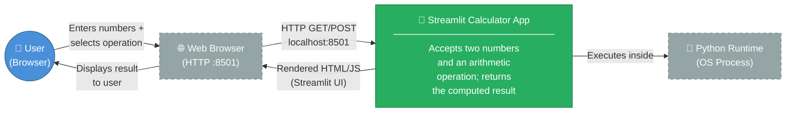

**External interfaces**: None. The only communication channel is the HTTP connection between the user's browser and the Streamlit development server.

### 3.2 Technical Context

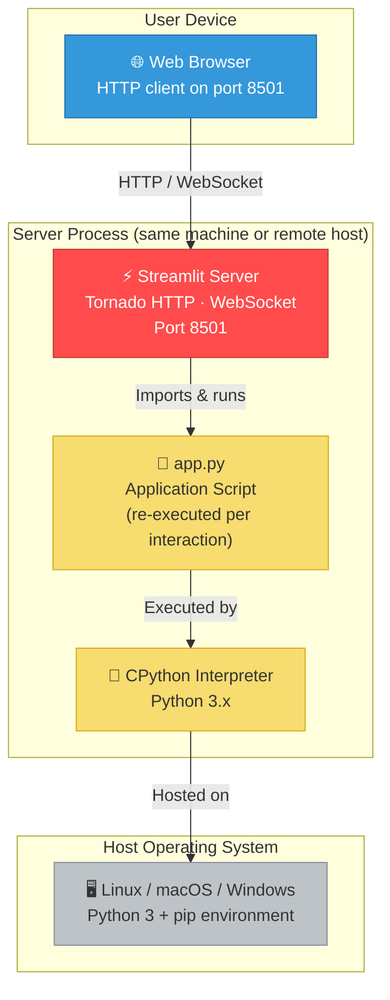

| Channel            | Protocol         | Direction       | Description                            |
|--------------------|------------------|-----------------|----------------------------------------|
| Browser ↔ Server   | HTTP / WebSocket | Bidirectional   | UI rendering and form submissions      |
| Server → Script    | Python import    | Server → Script | Streamlit re-runs `app.py` per event   |

---

## 4. Solution Strategy

> **Sources analysed**: `requirements.txt`, `app.py`

### 4.1 Technology Decisions

| Decision                              | Choice                    | Rationale                                                                                       |
|---------------------------------------|---------------------------|-------------------------------------------------------------------------------------------------|
| **UI Framework**                      | Streamlit ≥ 1.40.0        | Eliminates need for HTML/CSS/JavaScript; Python-native reactive UI with minimal boilerplate.   |
| **Programming Language**              | Python 3                  | Ubiquitous in data/utility tooling; expressive arithmetic operators; cross-platform.           |
| **Application Architecture**          | Single-file monolith      | Appropriate for the scope (< 50 LoC); zero configuration overhead; trivial to deploy.          |
| **State Management**                  | Streamlit form + re-run   | `st.form` batches inputs and triggers a full script re-run on submit, providing a simple and predictable state model. |
| **Error Handling Strategy**           | Inline guard + `st.stop()`| Division-by-zero is checked immediately before computation; `st.stop()` prevents further rendering. |
| **Data Persistence**                  | None (stateless)          | Calculator results are ephemeral; no storage layer is required.                                |

### 4.2 Architectural Approach

The solution follows a **reactive single-page application** pattern delivered via Streamlit's execution model:

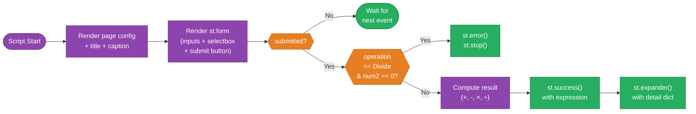

---

## 5. Building Block View

> **Sources analysed**: `app.py` (full source)

### 5.1 Level 1 — System Overview

At the highest level of abstraction the application is a single deployable unit composed of three logical layers that are all encoded inside `app.py`:

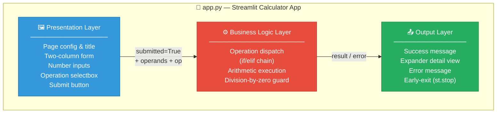

### 5.2 Level 2 — Module Breakdown

The single file `app.py` can be decomposed into five logical code blocks:

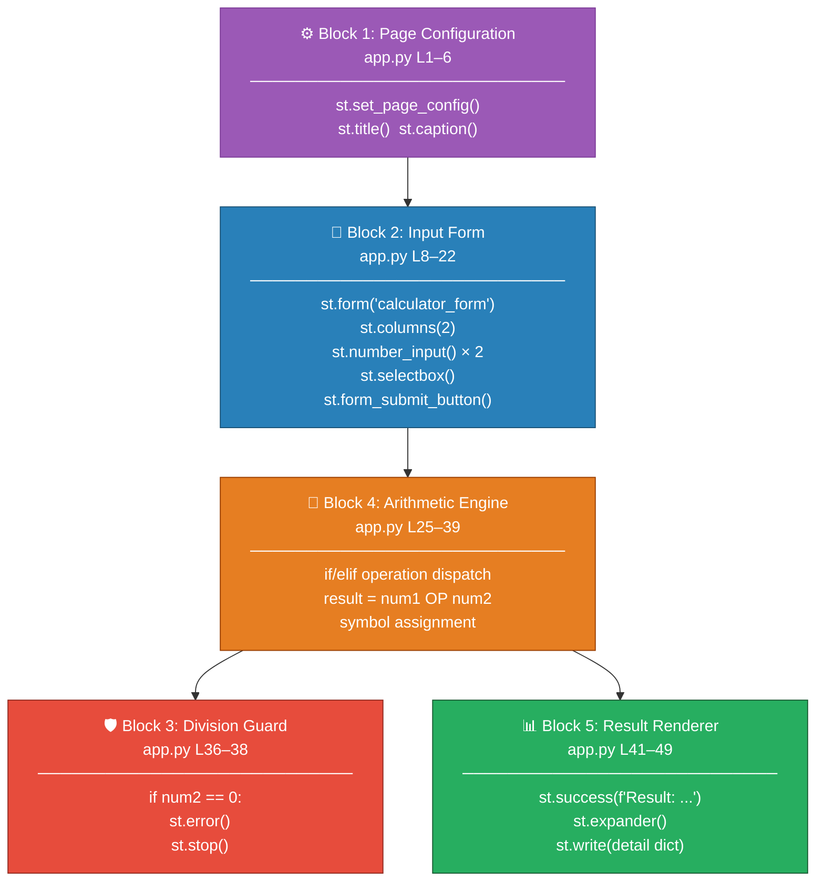

### 5.3 Level 3 — Code Element Inventory

| Element              | Type             | Location   | Responsibility                                          |
|----------------------|------------------|------------|---------------------------------------------------------|
| `st.set_page_config` | Streamlit call   | L3         | Sets browser tab title, emoji icon, and layout mode     |
| `st.title`           | Streamlit call   | L5         | Renders the `<h1>` page heading                         |
| `st.caption`         | Streamlit call   | L6         | Renders a small subtitle below the heading              |
| `st.form`            | Context manager  | L8–22      | Batches all user inputs into a single submission event  |
| `col1, col2`         | Column layout    | L9         | Creates two equal-width side-by-side columns            |
| `num1`               | `float` variable | L12        | First operand; default `0.0`; 6 decimal places          |
| `num2`               | `float` variable | L14        | Second operand; default `0.0`; 6 decimal places         |
| `operation`          | `str` variable   | L16–20     | Selected operation; one of `Add/Subtract/Multiply/Divide` |
| `submitted`          | `bool` variable  | L22        | Truthy when the form submit button is clicked           |
| `result`             | `float` variable | L26–39     | Computed arithmetic result                              |
| `symbol`             | `str` variable   | L27–35     | Human-readable operator symbol (`+`, `-`, `×`, `÷`)    |
| `st.error`           | Streamlit call   | L37        | Renders a red error banner for division-by-zero         |
| `st.stop`            | Streamlit call   | L38        | Halts script execution to prevent further rendering     |
| `st.success`         | Streamlit call   | L41        | Renders a green success banner with the result string   |
| `st.expander`        | Context manager  | L43–49     | Collapsible panel containing computation detail dict    |
| `st.write`           | Streamlit call   | L44–49     | Renders the detail dictionary as a formatted table      |

---

## 6. Runtime View

> **Sources analysed**: `app.py` (control flow, L1–49)

### 6.1 Scenario 1 — Successful Arithmetic Calculation

The following sequence shows the complete interaction for a successful calculation (e.g., `7.5 + 2.25`):

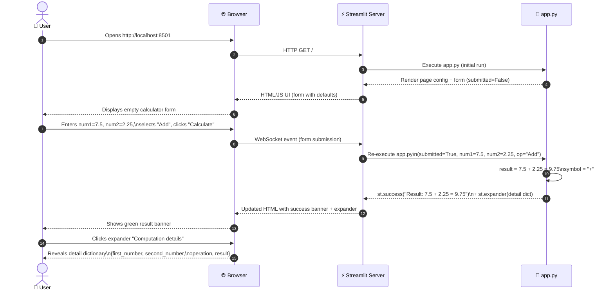

### 6.2 Scenario 2 — Division by Zero Error

```mermaid
sequenceDiagram
    autonumber
    actor User as 👤 User
    participant Browser as 🌐 Browser
    participant Streamlit as ⚡ Streamlit Server
    participant Script as 📄 app.py

    User->>Browser: Enters num1=5.0, num2=0.0,\nselects "Divide", clicks "Calculate"
    Browser->>Streamlit: WebSocket event (form submission)
    Streamlit->>Script: Re-execute app.py\n(submitted=True, num1=5.0, num2=0.0, op="Divide")
    Script->>Script: operation == "Divide" → enter else branch\nnum2 == 0 → guard triggered
    Script-->>Streamlit: st.error("Division by zero is not allowed.")
    Script->>Script: st.stop() — execution halted
    Streamlit-->>Browser: Updated HTML with red error banner only
    Browser-->>User: Shows red error message;\nno result rendered
```

### 6.3 Scenario 3 — Page Load (No Submission)

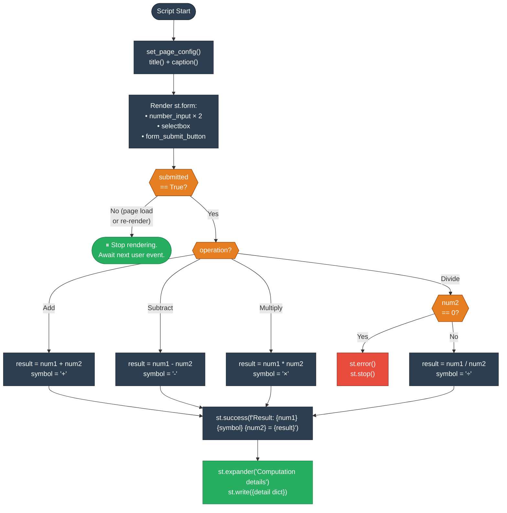

### 6.4 Operation Symbol Mapping

| Operation  | Python Expression | Display Symbol | Notes                         |
|------------|-------------------|----------------|-------------------------------|
| Add        | `num1 + num2`     | `+`            | Standard Python addition      |
| Subtract   | `num1 - num2`     | `-`            | Standard Python subtraction   |
| Multiply   | `num1 * num2`     | `×`            | Unicode multiplication sign   |
| Divide     | `num1 / num2`     | `÷`            | Zero guard applied first      |

---

## 7. Deployment View

> **Sources analysed**: `README.md`, `requirements.txt`, `app.py`

### 7.1 Infrastructure Overview

The application has no mandatory infrastructure beyond a machine with Python 3 and pip. Streamlit bundles its own Tornado-based HTTP server, so no external web server (Nginx, Apache, etc.) is required for development or simple production use.

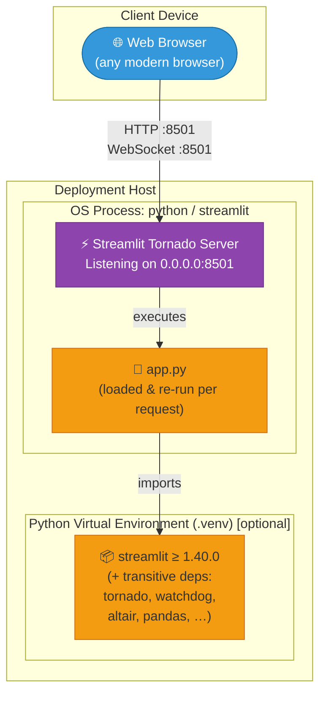

### 7.2 Local Development Deployment

**Prerequisites**:

| Requirement       | Version      | Purpose                     |
|-------------------|--------------|-----------------------------|
| Python            | 3.x          | Interpreter                 |
| pip               | latest       | Package installer           |
| streamlit         | ≥ 1.40.0     | Web framework + dev server  |

**Startup sequence** (from `README.md`):

```bash
# 1. Create and activate a virtual environment (recommended)
python3 -m venv .venv
source .venv/bin/activate          # macOS / Linux
# .venv\Scripts\activate           # Windows

# 2. Install dependencies
pip install -r requirements.txt

# 3. Launch the application
streamlit run app.py
# → App available at http://localhost:8501
```

### 7.3 Cloud Deployment Options

Although no cloud deployment is configured in this repository, the application is compatible with the following platforms without code changes:

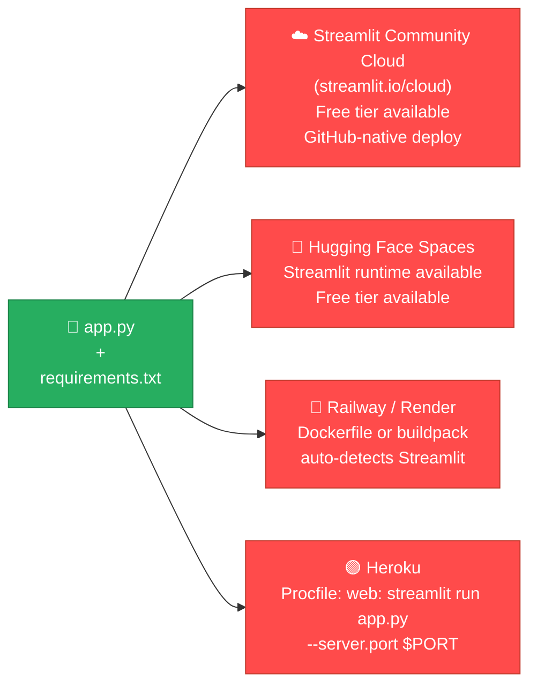

### 7.4 Port and Network Configuration

| Parameter         | Default Value     | Override                                   |
|-------------------|-------------------|--------------------------------------------|
| HTTP port         | `8501`            | `streamlit run app.py --server.port XXXX`  |
| Bind address      | `localhost`       | `--server.address 0.0.0.0` (for remote access) |
| Browser auto-open | `true`            | `--server.headless true` (for server mode) |

---

## 8. Crosscutting Concepts

> **Sources analysed**: `app.py` (all blocks)

### 8.1 Error Handling Strategy

The application uses a **fail-fast, render-then-stop** error handling pattern. Errors are detected immediately before the operation that could cause them, displayed as a prominent UI element, and then execution is halted to prevent partial or misleading output.

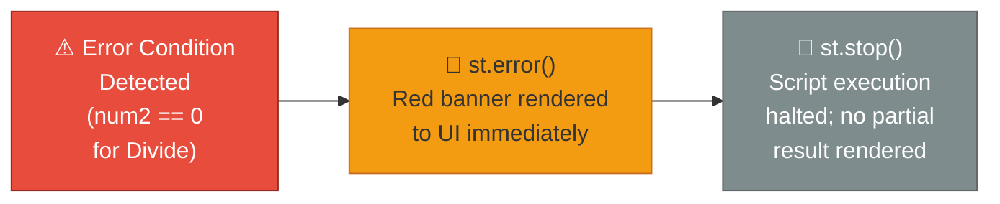

**Current error coverage**:

| Error Condition       | Handling Mechanism         | User Feedback                          |
|-----------------------|----------------------------|----------------------------------------|
| Division by zero      | `if num2 == 0` guard       | Red error banner via `st.error()`      |
| Invalid number input  | Streamlit `number_input`   | Browser-level numeric validation       |
| Empty / null input    | Default value `0.0`        | Prevents null; zero-divide guard fires |

### 8.2 Input Validation

Input validation is handled at two layers:

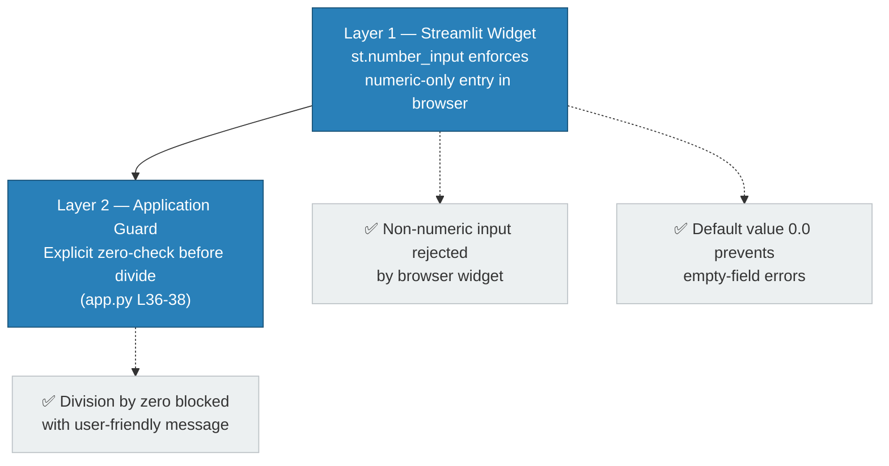

### 8.3 UI/UX Design Patterns

| Pattern                    | Implementation                          | Benefit                                          |
|----------------------------|-----------------------------------------|--------------------------------------------------|
| **Form submission batch**  | `st.form` + `st.form_submit_button`     | Prevents partial re-runs while user is typing    |
| **Two-column layout**      | `st.columns(2)`                         | Visually groups related inputs side by side       |
| **Sensible defaults**      | `value=0.0` on both inputs              | Allows immediate submission without data entry   |
| **Symbolic operator**      | Unicode `×` and `÷` in result string    | Increases mathematical readability               |
| **Expandable details**     | `st.expander("Computation details")`    | Progressive disclosure; clean default view       |
| **Consistent precision**   | `format="%.6f"` on both inputs          | Uniform display of floating-point values         |

### 8.4 Streamlit Execution Model

Understanding Streamlit's execution model is critical for this application:

```mermaid
stateDiagram-v2
    [*] --> InitialLoad : User opens URL
    InitialLoad --> FormDisplayed : Script runs top-to-bottom;\nsubmitted = False
    FormDisplayed --> FormDisplayed : User types in inputs\n(no re-run triggered\ndue to st.form batching)
    FormDisplayed --> CalculationRun : User clicks "Calculate"\n(submitted = True)
    CalculationRun --> ErrorDisplayed : Division by zero\n→ st.stop() called
    CalculationRun --> ResultDisplayed : Valid operation\n→ result rendered
    ResultDisplayed --> FormDisplayed : User modifies inputs\nor reloads page
    ErrorDisplayed --> FormDisplayed : User corrects input\nand resubmits
```

### 8.5 Floating-Point Arithmetic Considerations

The application uses Python's native `float` type (IEEE 754 double-precision, 64-bit). This means:

- Results are accurate to approximately **15–17 significant decimal digits**
- Classic floating-point artefacts may appear (e.g., `0.1 + 0.2 ≠ 0.3` exactly)
- The `%.6f` display format rounds the display to 6 decimal places, masking most rounding artefacts
- For financial or scientific use-cases requiring arbitrary precision, `decimal.Decimal` would be required

---

## 9. Architecture Decisions

> **Sources analysed**: `app.py`, `requirements.txt`

### ADR-001 — Use Streamlit as the UI Framework

| Field       | Content                                                                                     |
|-------------|---------------------------------------------------------------------------------------------|
| **Status**  | Accepted                                                                                    |
| **Context** | A calculator UI is needed without dedicated frontend expertise or a complex SPA framework. |
| **Decision**| Use Streamlit ≥ 1.40.0 as the sole UI/server framework.                                    |
| **Rationale**| Streamlit enables fully functional browser UIs in pure Python with minimal boilerplate. It removes the need for HTML, CSS, or JavaScript. |
| **Consequences (+)** | Extremely low code volume (< 50 LoC); fast iteration; standard pip install.      |
| **Consequences (−)** | Tied to Streamlit's opinionated re-run model; limited custom styling; UI server not production-hardened out of the box. |

---

### ADR-002 — Single-File Application Architecture

| Field       | Content                                                                                     |
|-------------|---------------------------------------------------------------------------------------------|
| **Status**  | Accepted                                                                                    |
| **Context** | The application's scope is a simple four-operation calculator with no persistence or external integrations. |
| **Decision**| Implement the entire application in a single file: `app.py`.                               |
| **Rationale**| The functionality does not justify a package structure; a single file minimises cognitive load and deployment friction. |
| **Consequences (+)** | Zero import graph complexity; trivial to read, copy, and deploy.                 |
| **Consequences (−)** | Does not scale beyond ~100 LoC without becoming unmaintainable; business logic and UI are co-located. |

---

### ADR-003 — No Data Persistence

| Field       | Content                                                                                     |
|-------------|---------------------------------------------------------------------------------------------|
| **Status**  | Accepted                                                                                    |
| **Context** | Calculator results are transient; there is no stated requirement to save or recall previous calculations. |
| **Decision**| Implement no database, file storage, or session persistence.                               |
| **Rationale**| Eliminates infrastructure dependencies; simplifies deployment; aligns with the stateless Streamlit re-run model. |
| **Consequences (+)** | Zero infrastructure requirements; no data security concerns.                     |
| **Consequences (−)** | Calculation history is lost on page refresh; no audit trail.                     |

---

### ADR-004 — Inline Arithmetic with Native Python Operators

| Field       | Content                                                                                     |
|-------------|---------------------------------------------------------------------------------------------|
| **Status**  | Accepted                                                                                    |
| **Context** | The four arithmetic operations need to be performed on two user-supplied floating-point numbers. |
| **Decision**| Use Python's native `+`, `-`, `*`, `/` operators directly inline (no `math` library, no `eval`). |
| **Rationale**| Native operators are the simplest, safest, and most readable approach. Using `eval` would introduce a security vulnerability. The `math` module adds no value for basic arithmetic. |
| **Consequences (+)** | Readable; safe; no additional imports.                                           |
| **Consequences (−)** | Precision limited to IEEE 754 float; not suitable for arbitrary-precision arithmetic. |

---

### ADR-005 — `st.form` for Input Batching

| Field       | Content                                                                                     |
|-------------|---------------------------------------------------------------------------------------------|
| **Status**  | Accepted                                                                                    |
| **Context** | Without a form, each keystroke in a Streamlit `number_input` triggers a full script re-run, causing premature calculation attempts. |
| **Decision**| Wrap all inputs in `st.form("calculator_form")`.                                           |
| **Rationale**| Batches all input changes into a single submission event, preventing intermediate/invalid states from triggering calculations. |
| **Consequences (+)** | Clean UX; no flickering results while typing; clear "Calculate" action.          |
| **Consequences (−)** | Slightly more boilerplate than bare widgets; form state is reset on re-run.      |

---

## 10. Quality Requirements

> **Sources analysed**: `app.py`, `requirements.txt`

### 10.1 Quality Tree

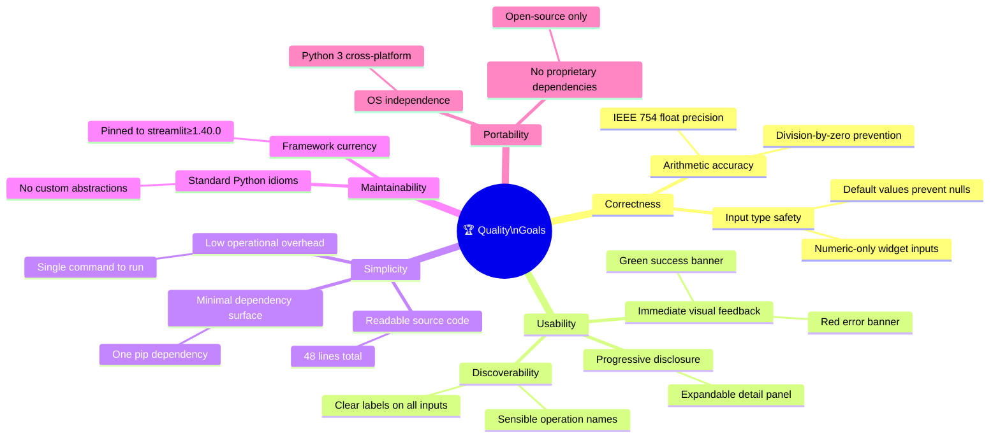

### 10.2 Quality Scenarios

| ID   | Quality Attribute | Stimulus                                           | Response                                                    | Measurable Target         |
|------|-------------------|----------------------------------------------------|-------------------------------------------------------------|---------------------------|
| QS-1 | Correctness       | User computes `3.0 ÷ 4.0`                         | Result displayed as `0.75` (exact in IEEE 754)              | 100% arithmetic accuracy  |
| QS-2 | Correctness       | User attempts `5 ÷ 0`                             | Error banner shown; no result rendered                      | 0 unhandled exceptions    |
| QS-3 | Usability         | User submits form                                  | Result visible within one Streamlit re-run cycle            | < 500 ms response time    |
| QS-4 | Usability         | User enters non-numeric value                      | Browser widget rejects input before submission              | 0 invalid type errors     |
| QS-5 | Simplicity        | Developer clones repo and runs app                 | App runs with 2 commands (`pip install`, `streamlit run`)   | ≤ 2 setup commands        |
| QS-6 | Maintainability   | Developer reads source to add a new operation      | All relevant code is in one file, one `if/elif` block       | Time to understand < 5 min|
| QS-7 | Portability       | App deployed on Linux, macOS, and Windows          | Identical behaviour on all platforms                        | 0 OS-specific code paths  |

### 10.3 Code Metrics

| Metric                          | Value        | Assessment                                           |
|---------------------------------|--------------|------------------------------------------------------|
| Total lines of code (LoC)       | 50           | ✅ Minimal; entirely readable in one sitting          |
| Number of functions / classes   | 0            | ⚠️ All logic is top-level; fine for this scope       |
| Cyclomatic complexity (approx.) | 6            | ✅ Low; one if-submitted + one if-divide + op dispatch|
| Number of external dependencies | 1            | ✅ Minimal supply-chain risk                          |
| Test coverage                   | 0%           | ❌ No test files present                              |
| Error handling coverage         | 1/1 known    | ✅ Division-by-zero is the only arithmetic error      |
| Documentation coverage          | Partial      | ⚠️ README present; no inline docstrings or comments  |

---

## 11. Risks and Technical Debt

> **Sources analysed**: `app.py`, `requirements.txt`, code quality assessment

### 11.1 Risk Register

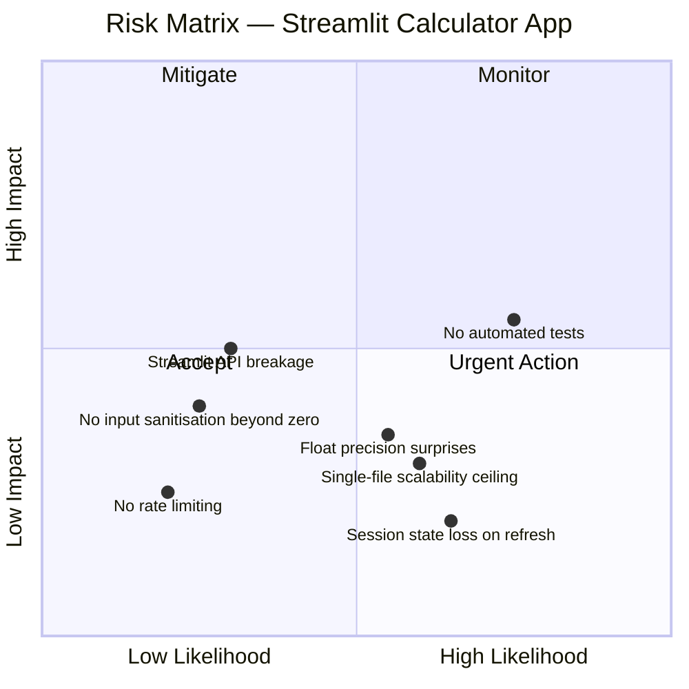

### 11.2 Detailed Risk Items

| ID   | Risk                              | Likelihood | Impact | Description                                                                                         | Mitigation                                                                          |
|------|-----------------------------------|-----------|--------|-----------------------------------------------------------------------------------------------------|-------------------------------------------------------------------------------------|
| R-1  | **No automated tests**            | High       | Medium | There are no unit tests, integration tests, or UI tests. Regressions can go undetected.             | Add `pytest` unit tests for arithmetic logic; add Streamlit `AppTest` for UI flows. |
| R-2  | **Float precision surprises**     | Medium     | Low    | IEEE 754 arithmetic can produce unexpected results (e.g., `0.1 + 0.2 = 0.30000000000000004`).      | Document limitation; optionally add `decimal.Decimal` support for precision mode.   |
| R-3  | **Streamlit API deprecation**     | Low        | Medium | Streamlit evolves rapidly; a future release may deprecate `st.form` or other used APIs.            | Pin to a specific version range; monitor Streamlit changelog.                        |
| R-4  | **No rate limiting**              | Low        | Low    | If exposed publicly, the server accepts unlimited requests.                                          | Use Streamlit Community Cloud's built-in limits, or add a reverse proxy (Nginx).    |
| R-5  | **Session state loss on refresh** | High       | Low    | Browser refresh clears all inputs and results (by design in Streamlit stateless model).             | Accept as a design choice; document in user-facing help text if needed.              |
| R-6  | **Single-file scalability**       | Medium     | Low    | Adding significant new features (history, unit conversion, etc.) to `app.py` will reduce maintainability. | Refactor to a package structure (`calculator/`, `ui.py`, `engine.py`) when LoC > 150. |

### 11.3 Technical Debt Items

| ID   | Debt Item                        | Effort | Priority | Description                                                                                    |
|------|----------------------------------|--------|----------|------------------------------------------------------------------------------------------------|
| TD-1 | **Zero test coverage**           | Low    | High     | No test files exist. A `tests/test_calculator.py` with 5–10 unit tests would cover all logic. |
| TD-2 | **No inline documentation**      | Low    | Medium   | `app.py` has no comments or docstrings. Adding block comments would aid future contributors.   |
| TD-3 | **Hardcoded operation list**     | Low    | Low      | The operations tuple `("Add", "Subtract", "Multiply", "Divide")` is hardcoded. An `enum` or constant would be cleaner. |
| TD-4 | **No `.gitignore`**              | Low    | Low      | No `.gitignore` file to exclude `.venv/`, `__pycache__/`, and `.streamlit/` from version control. |
| TD-5 | **No version pin for Python**    | Low    | Low      | No `.python-version` or `pyproject.toml` declares the required Python version range.          |
| TD-6 | **Business logic not isolated**  | Medium | Medium   | Arithmetic logic is inline with UI rendering. Extracting a `calculate(num1, op, num2)` function would enable unit testing and reuse. |

### 11.4 Recommended Refactoring

The highest-value improvement with the least effort is extracting the arithmetic engine into a testable function:

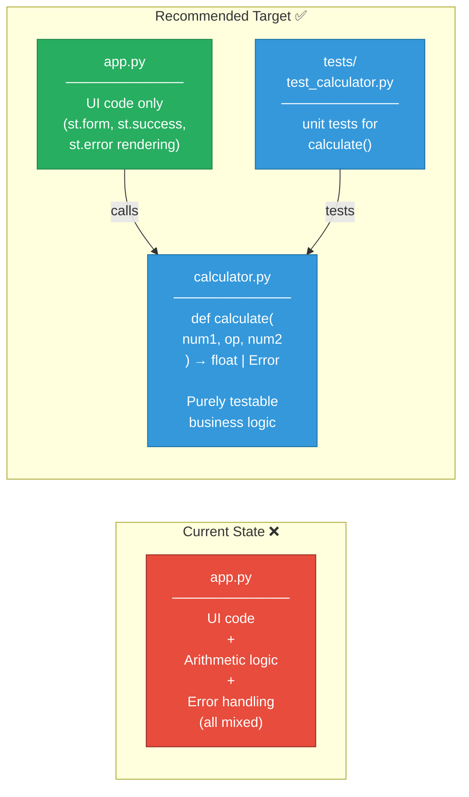

---

## 12. Glossary

> **Sources analysed**: `app.py`, `README.md`, Streamlit framework documentation

### 12.1 Domain Terms

| Term                    | Definition                                                                                                   |
|-------------------------|--------------------------------------------------------------------------------------------------------------|
| **Operand**             | A number that is used as input to an arithmetic operation. In this app, `num1` and `num2` are the operands.  |
| **Operator / Operation**| The arithmetic function to be applied to the operands: Add (`+`), Subtract (`−`), Multiply (`×`), Divide (`÷`). |
| **Result**              | The numeric output of applying the operator to the two operands.                                             |
| **Division by Zero**    | An undefined arithmetic operation that occurs when the divisor (`num2`) equals zero. Guarded against in code. |
| **Expression**          | The full representation of the calculation, e.g., `7.5 + 2.25 = 9.75`, as rendered in the success banner.   |
| **Computation Details** | The structured dictionary `{first_number, second_number, operation, result}` shown in the expander panel.   |

### 12.2 Technical Terms

| Term                     | Definition                                                                                                           |
|--------------------------|----------------------------------------------------------------------------------------------------------------------|
| **Streamlit**            | An open-source Python framework for building interactive web applications. Handles UI rendering, server, and session management. |
| **`st.form`**            | A Streamlit context manager that groups widgets and defers re-runs until the form's submit button is clicked.        |
| **`st.form_submit_button`** | A button widget inside `st.form` that, when clicked, sets `submitted = True` and triggers a script re-run.        |
| **`st.number_input`**    | A Streamlit widget that renders a numeric input field in the browser. Enforces numeric-only entry.                   |
| **`st.selectbox`**       | A Streamlit widget that renders a dropdown menu from a tuple of options.                                             |
| **`st.success`**         | A Streamlit call that renders a green-coloured alert banner, used here to display the calculation result.            |
| **`st.error`**           | A Streamlit call that renders a red-coloured alert banner, used here for the division-by-zero error message.         |
| **`st.expander`**        | A Streamlit context manager that renders a collapsible section (progressive disclosure UI pattern).                  |
| **`st.stop`**            | A Streamlit function that immediately halts the execution of the current script re-run.                              |
| **`st.columns`**         | A Streamlit layout function that splits the page into N equal-width horizontal columns.                              |
| **Re-run**               | Streamlit's execution model: the entire `app.py` script is re-executed from top to bottom on every user interaction. |
| **Script re-run model**  | The stateless execution paradigm of Streamlit where the script is the declarative definition of the UI.             |
| **IEEE 754**             | The international standard for floating-point arithmetic. Python's `float` type is a 64-bit (double-precision) IEEE 754 number. |
| **`format="%.6f"`**      | A Python format string specifying 6 decimal places for floating-point display in `st.number_input`.                 |
| **Tornado**              | The asynchronous web framework used internally by Streamlit to serve HTTP requests and WebSocket connections.        |
| **WebSocket**            | The persistent bidirectional communication channel between the browser and the Streamlit server, used to push UI updates. |
| **Virtual Environment**  | An isolated Python environment (`.venv`) containing the project's dependencies, separate from the system Python.    |
| **`pip`**                | The Python package installer used to install `streamlit` from `requirements.txt`.                                    |

---

*Documentation generated by **Arc42 Documentation Generator** based on static analysis of source files `app.py`, `requirements.txt`, and `README.md`.*

*All diagrams are rendered using [Mermaid](https://mermaid.js.org/) — a Markdown-native diagram language supported by GitHub, GitLab, and major documentation platforms.*
