# Architecture Documentation (Arc42)

**Project**: Streamlit Calculator App  
**Version**: 1.0.0  
**Date**: 2025-01-01  
**Generated by**: Arc42 Documentation Generator  
**Source Repository**: `/home/runner/work/github-copilot-test/github-copilot-test`

---

## Table of Contents

1. [Introduction and Goals](#1-introduction-and-goals)
2. [Constraints](#2-constraints)
3. [Context and Scope](#3-context-and-scope)
4. [Solution Strategy](#4-solution-strategy)
5. [Building Block View](#5-building-block-view)
6. [Runtime View](#6-runtime-view)
7. [Deployment View](#7-deployment-view)
8. [Crosscutting Concepts](#8-crosscutting-concepts)
9. [Architecture Decisions](#9-architecture-decisions)
10. [Quality Requirements](#10-quality-requirements)
11. [Risks and Technical Debt](#11-risks-and-technical-debt)
12. [Glossary](#12-glossary)

---

## 1. Introduction and Goals

> **Sources**: `README.md`, `app.py` (lines 1–6), project structure analysis

### 1.1 Requirements Overview

The **Streamlit Calculator App** is a lightweight, browser-based arithmetic calculator built as a single-page web application using the Streamlit framework. Its primary purpose is to expose four fundamental arithmetic operations — addition, subtraction, multiplication, and division — through an accessible, zero-configuration web interface.

The application targets users who need to perform quick numerical calculations without installing dedicated software. It is intentionally minimal in scope, prioritising simplicity of code, ease of deployment, and immediate usability.

| ID   | Requirement                                                               | Priority |
|------|---------------------------------------------------------------------------|----------|
| R-01 | Accept two floating-point numbers as input                                | High     |
| R-02 | Support four arithmetic operations: Add, Subtract, Multiply, Divide       | High     |
| R-03 | Display the result in a human-readable format with operation symbol       | High     |
| R-04 | Prevent division by zero and surface a clear error message to the user    | High     |
| R-05 | Show detailed computation metadata on demand (expandable panel)           | Medium   |
| R-06 | Provide a clean, centred UI suitable for desktop browsers                 | Medium   |
| R-07 | Support six decimal places of precision in input and output               | Low      |

### 1.2 Quality Goals

The following quality goals are the most important ones for the architecture of this system, ordered by priority:

| Priority | Quality Goal        | Motivation                                                                                   |
|----------|---------------------|----------------------------------------------------------------------------------------------|
| 1        | **Simplicity**      | The entire application is a single 50-line Python file; zero architectural complexity is a design goal |
| 2        | **Usability**       | The UI uses Streamlit's form layout to provide a clean, self-explanatory two-column input form |
| 3        | **Correctness**     | Arithmetic operations must produce accurate results; division-by-zero must be explicitly guarded |
| 4        | **Deployability**   | One-command startup (`streamlit run app.py`) with a single dependency in `requirements.txt`  |
| 5        | **Maintainability** | Flat code structure and standard Python idioms make the app trivially readable and modifiable |

### 1.3 Stakeholders

| Role                     | Name / Description              | Expectations                                                                         |
|--------------------------|---------------------------------|--------------------------------------------------------------------------------------|
| End User                 | Anyone needing quick arithmetic | Accurate results, intuitive UI, clear error messages                                 |
| Developer / Maintainer   | Project author / contributor    | Minimal dependencies, easy local setup, readable code                                |
| DevOps / Deployment Team | Person running the application  | Single-command startup, no database or infrastructure requirements                   |

---

## 2. Constraints

> **Sources**: `requirements.txt`, `README.md`, Python/Streamlit ecosystem characteristics

### 2.1 Technical Constraints

| ID    | Constraint                              | Background / Rationale                                                                                      |
|-------|-----------------------------------------|-------------------------------------------------------------------------------------------------------------|
| TC-01 | **Python runtime required**             | The application is written in Python. A Python 3 interpreter must be present in the execution environment. |
| TC-02 | **Streamlit ≥ 1.40.0**                  | The only declared dependency. Streamlit handles the entire web server, WebSocket layer, and UI rendering.   |
| TC-03 | **Single-file architecture**            | All application logic resides in `app.py`. No package structure, no modules, no separate config files.     |
| TC-04 | **Stateless computation**               | No database, no session persistence, no file I/O. All state is ephemeral within a single browser session.  |
| TC-05 | **No authentication / authorisation**   | The app exposes no access controls; it is intended for trusted local or intranet use.                       |
| TC-06 | **Browser-based UI only**               | No CLI, REST API, or non-browser interface is provided.                                                     |
| TC-07 | **Floating-point arithmetic precision** | Python's native `float` (IEEE 754 double precision) is used; no arbitrary-precision library is employed.   |

### 2.2 Organisational Constraints

| ID    | Constraint                              | Background                                                                                       |
|-------|-----------------------------------------|--------------------------------------------------------------------------------------------------|
| OC-01 | **No CI/CD pipeline (current state)**   | No `.github/workflows` automation is active for linting, testing, or deployment.                |
| OC-02 | **No automated tests**                  | The project contains no test files (`test_*.py` or `*_test.py`). Testing is manual/exploratory. |
| OC-03 | **No containerisation**                 | No `Dockerfile` or `docker-compose.yml` exists; deployment assumes a bare Python environment.   |

### 2.3 Conventions

| ID    | Convention                              | Description                                                                                    |
|-------|-----------------------------------------|------------------------------------------------------------------------------------------------|
| CV-01 | **PEP 8 coding style**                  | Python standard style guide applies by default (not enforced by a linter in current setup).    |
| CV-02 | **Streamlit reactive execution model**  | The script re-executes top-to-bottom on every user interaction; no explicit event loop coding. |
| CV-03 | **Six decimal places display format**   | `format="%.6f"` is used consistently for both number inputs.                                   |

---

## 3. Context and Scope

> **Sources**: `app.py` (full file), `README.md`, Streamlit architecture model

### 3.1 Business Context

The Streamlit Calculator App operates as a **self-contained single-page web application**. It has no external system dependencies, no upstream data sources, and no downstream integrations. The system boundary encloses one actor (the human user interacting through a browser) and the application itself.

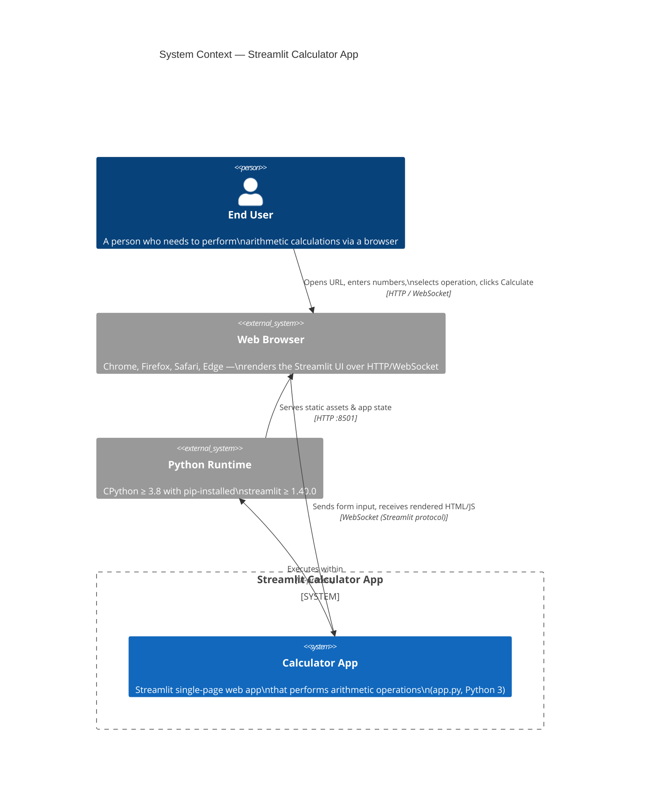

### 3.2 Technical Context

The following table describes all interfaces at the system boundary:

| Interface          | Direction      | Technology                         | Description                                                  |
|--------------------|----------------|------------------------------------|--------------------------------------------------------------|
| Browser ↔ App      | Bidirectional  | HTTP + WebSocket (port 8501)       | Streamlit uses WebSockets to push UI updates reactively      |
| User → Browser     | Inbound        | Keyboard, mouse (HTML form)        | User enters `num1`, `num2`, selects operation, submits form  |
| App → Browser      | Outbound       | HTML / CSS / JavaScript (rendered) | Streamlit renders result, error messages, computation detail |
| App → Python RT    | In-process     | Python function calls              | Standard library float arithmetic, `st.*` framework calls   |
| Terminal → App     | Launch command | CLI (`streamlit run app.py`)       | Process start; Streamlit opens a local web server on :8501   |

---

## 4. Solution Strategy

> **Sources**: `app.py` (architecture decisions implicit in code), `requirements.txt`

### 4.1 Technology Decisions

| Decision                                          | Rationale                                                                                                           |
|---------------------------------------------------|---------------------------------------------------------------------------------------------------------------------|
| **Streamlit as the sole framework**               | Provides a full web application stack (server, UI, state management) from a pure-Python script with zero HTML/JS   |
| **Single Python file (`app.py`)**                 | The problem domain is simple enough that a module boundary would add overhead without benefit                       |
| **Python native `float` for arithmetic**          | Sufficient for the targeted use cases; no need for `decimal.Decimal` or external math libraries                    |
| **`st.form` for input grouping**                  | Batches all user inputs into one submit event, preventing premature re-computation on individual field changes      |
| **`st.stop()` for divide-by-zero guard**          | Halts further script execution immediately after surfacing the error, preventing a partial result from being shown  |
| **`st.expander` for computation detail**          | Keeps the primary result view clean while making debug/audit information available on demand                        |

### 4.2 Top-Level Decomposition Strategy

The application follows **Streamlit's reactive, top-to-bottom execution model**. There is no traditional layered architecture; instead the script is decomposed into three **logical phases** that execute on every page interaction:

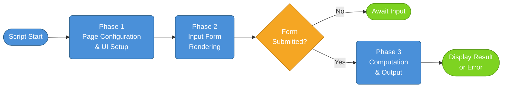

### 4.3 Approach to Quality Goals

| Quality Goal        | Approach                                                                                              |
|---------------------|-------------------------------------------------------------------------------------------------------|
| **Simplicity**      | No abstraction layers, classes, or modules — everything is top-level imperative Streamlit calls      |
| **Usability**       | Two-column layout, labelled inputs, dropdown operation selector, descriptive success/error messages   |
| **Correctness**     | Explicit `if/elif/else` dispatch for operations; explicit `num2 == 0` guard before division          |
| **Deployability**   | `requirements.txt` with single pinned-minimum dependency; README with two-step setup                 |
| **Maintainability** | Linear, sequential code flow; no hidden state; each logical section immediately readable             |

---

## 5. Building Block View

> **Sources**: `app.py` (structural decomposition), Streamlit component model

### 5.1 Level 1 — High-Level System Components

At the highest level of abstraction, the system consists of three logical blocks:

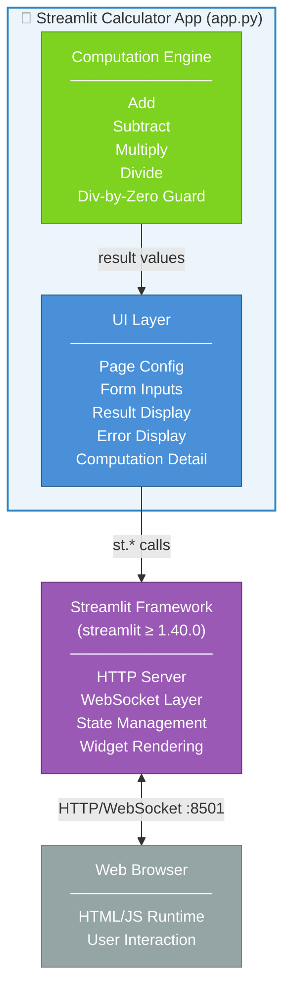

### 5.2 Level 2 — Module / File Structure

The entire application is a single file. The table below documents the logical sections within `app.py`:

| Section (Lines) | Logical Block              | Responsibility                                                                   |
|-----------------|----------------------------|----------------------------------------------------------------------------------|
| 1               | Import                     | Import Streamlit (`import streamlit as st`)                                      |
| 3               | Page Configuration         | Set browser tab title, favicon emoji, and centred layout                         |
| 5–6             | Page Header                | Render application title and descriptive caption                                 |
| 8–22            | Input Form                 | Render two-column number inputs, operation selector, and submit button           |
| 24–49           | Computation & Output       | Conditional dispatch to arithmetic operation, guard against division by zero, render result and details |

### 5.3 Level 3 — Detailed Component View

Although the application has no explicit classes, the logical components can be modelled as follows:

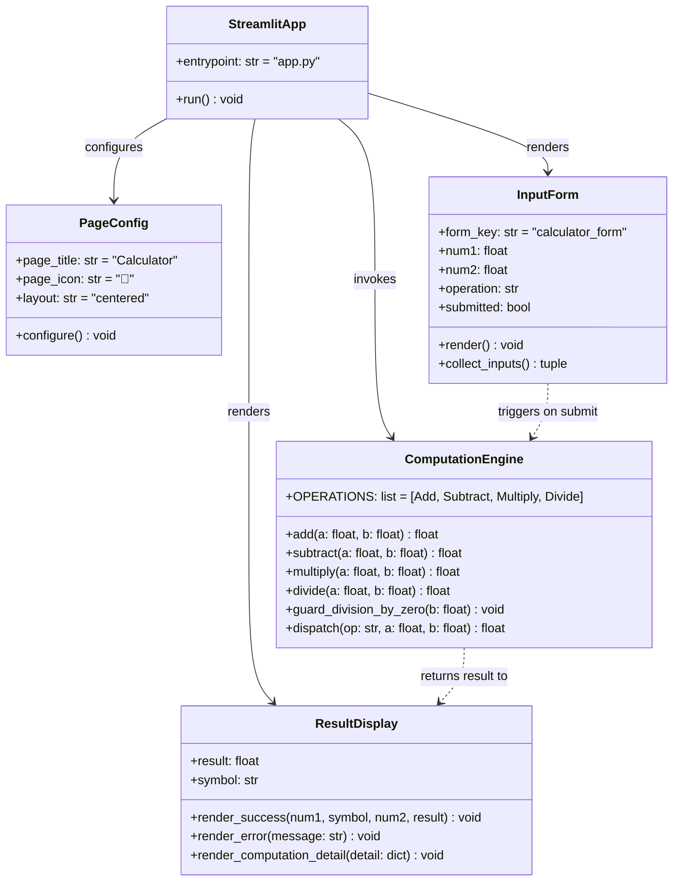

---

## 6. Runtime View

> **Sources**: `app.py` (lines 24–49), Streamlit execution model

### 6.1 Scenario 1 — Successful Arithmetic Calculation

This scenario covers the happy path: a user enters two numbers, selects an operation (Add, Subtract, or Multiply), and submits the form.

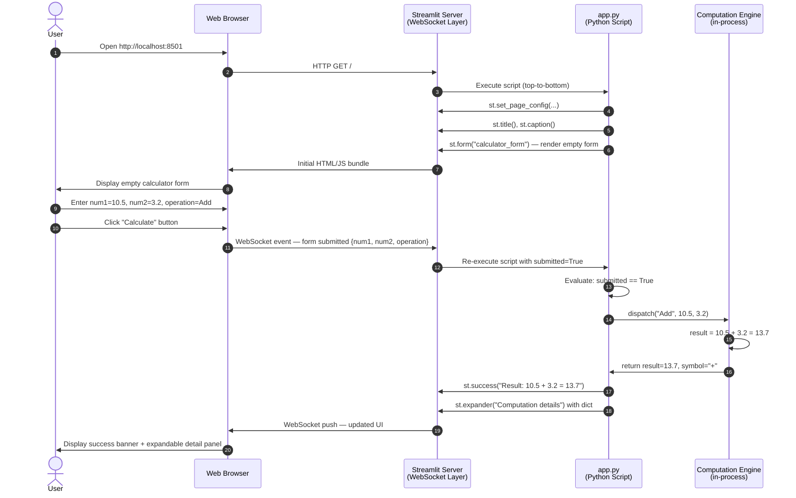

### 6.2 Scenario 2 — Division by Zero Guard

This scenario describes the error path when a user attempts to divide by zero.

```mermaid
sequenceDiagram
    autonumber
    actor User
    participant Browser as Web Browser
    participant Streamlit as Streamlit Server
    participant App as app.py

    User->>Browser: Enter num1=5.0, num2=0.0, operation=Divide
    User->>Browser: Click "Calculate"
    Browser->>Streamlit: WebSocket event — form submitted
    Streamlit->>App: Re-execute script with submitted=True

    App->>App: operation == "Divide" → enter else branch
    App->>App: symbol = "÷"
    App->>App: CHECK: num2 == 0 → TRUE

    App->>Streamlit: st.error("Division by zero is not allowed.")
    Streamlit->>Browser: Render error message (red banner)
    App->>App: st.stop() — HALT script execution
    Note over App: No result is computed or displayed.<br/>Execution terminates immediately after error.
    Browser->>User: Display error banner; no result shown
```

### 6.3 Computation Logic Flowchart

The complete decision flow for the computation phase:

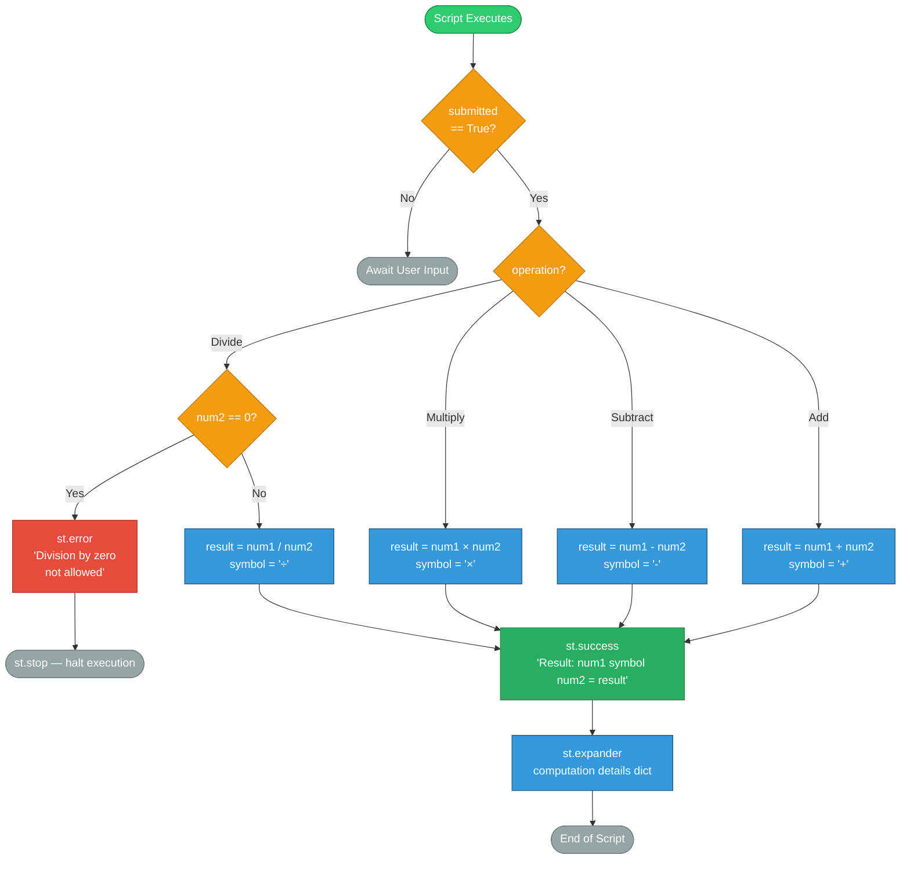

---

## 7. Deployment View

> **Sources**: `README.md`, `requirements.txt`, Streamlit server architecture

### 7.1 Infrastructure Overview

The application targets a **local development / lightweight deployment** topology. There is no containerisation, cloud deployment, or reverse proxy configuration documented. The entire stack runs in a single process on one machine.

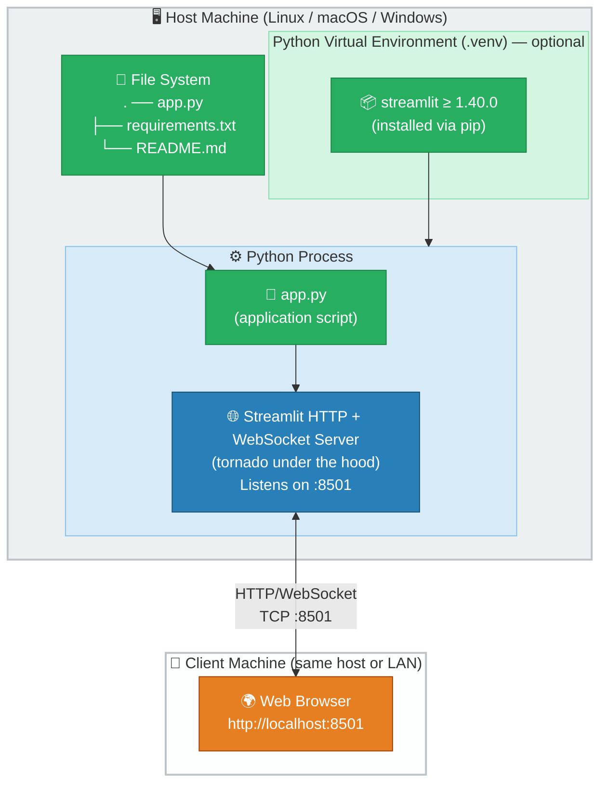

### 7.2 Deployment Steps

| Step | Command / Action                                                        | Notes                                         |
|------|-------------------------------------------------------------------------|-----------------------------------------------|
| 1    | `python3 -m venv .venv`                                                 | Optional — creates isolated Python environment |
| 2    | `source .venv/bin/activate` (Linux/macOS) or `.venv\Scripts\activate`  | Activate the virtual environment              |
| 3    | `pip install -r requirements.txt`                                       | Installs `streamlit ≥ 1.40.0`                 |
| 4    | `streamlit run app.py`                                                  | Starts the HTTP server on port 8501           |
| 5    | Open `http://localhost:8501` in a browser                               | Access the application                        |

### 7.3 Runtime Requirements

| Requirement       | Minimum                | Recommended             |
|-------------------|------------------------|-------------------------|
| Python version    | 3.8                    | 3.11+                   |
| RAM               | ~100 MB                | 256 MB                  |
| Disk space        | ~50 MB (for Streamlit) | 100 MB                  |
| Network port      | 8501 (TCP)             | Configurable via `--server.port` |
| OS                | Linux, macOS, Windows  | Any with Python support |

---

## 8. Crosscutting Concepts

> **Sources**: `app.py` (full analysis), Streamlit framework conventions

### 8.1 Domain Model

The conceptual data model of the application, expressed as an entity-relationship diagram:

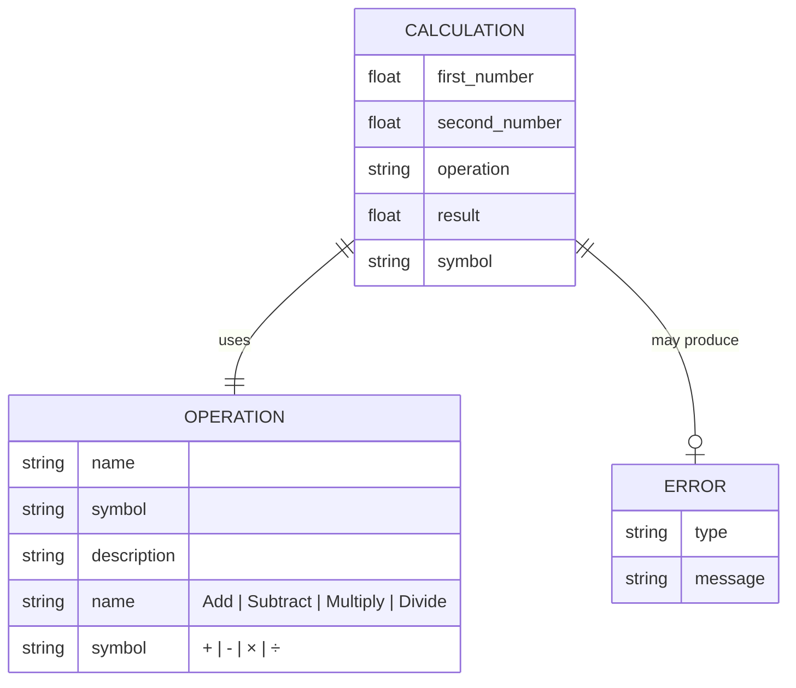

**Domain entities:**

| Entity        | Description                                                                               |
|---------------|-------------------------------------------------------------------------------------------|
| `Calculation` | A single arithmetic computation event with two operands, one operation, and one result    |
| `Operation`   | One of four supported arithmetic operations, each with a name and display symbol          |
| `Error`       | A computation-time error (currently only: division by zero)                               |

### 8.2 Application State Model

Streamlit re-executes the script on every interaction. The application's implicit state machine is:

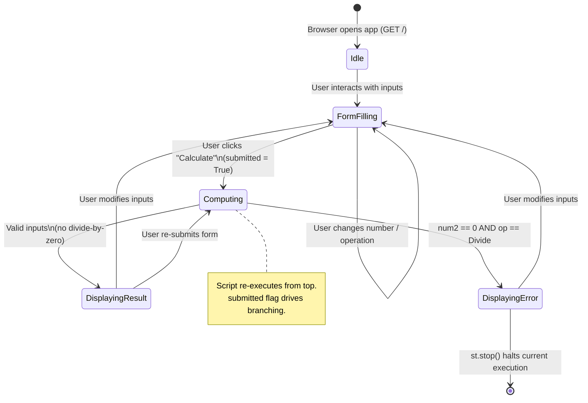

### 8.3 Error Handling Strategy

| Error Condition        | Detection Point                     | Handling Mechanism                                    | User Feedback                                     |
|------------------------|-------------------------------------|-------------------------------------------------------|---------------------------------------------------|
| Division by zero       | `num2 == 0` in the `else` branch    | `st.error(...)` + `st.stop()`                         | Red error banner; no result displayed             |
| Invalid number input   | Handled by Streamlit widget         | `st.number_input` enforces numeric values at widget level | Browser-side input validation; non-numeric input is rejected |
| Python runtime errors  | Not explicitly handled              | Streamlit renders an unhandled exception traceback    | Framework-level yellow warning banner             |

### 8.4 Number Formatting Convention

The application applies a consistent precision policy:

| Aspect               | Convention                          | Implementation               |
|----------------------|-------------------------------------|------------------------------|
| Input precision      | 6 decimal places                    | `format="%.6f"` on both `st.number_input` widgets |
| Result display       | Python's default float `str()`      | f-string interpolation: `f"{result}"` |
| Internal computation | IEEE 754 double precision (64-bit)  | Python native `float`        |

### 8.5 UI Layout Conventions

| Convention              | Implementation                                             |
|-------------------------|------------------------------------------------------------|
| Centred page layout     | `st.set_page_config(layout="centered")`                    |
| Two-column input grid   | `st.columns(2)` with `col1` / `col2` context managers     |
| Form-based submission   | `st.form("calculator_form")` batches all inputs            |
| Progressive disclosure  | `st.expander("Computation details")` hides verbose output  |

---

## 9. Architecture Decisions

> **Sources**: `app.py`, `requirements.txt`, codebase structure analysis

### ADR-001 — Use Streamlit as the Sole Framework

| Field       | Value                                                                                                                                   |
|-------------|-----------------------------------------------------------------------------------------------------------------------------------------|
| **Status**  | Accepted                                                                                                                                |
| **Context** | A simple calculator needs a UI. Options include: raw HTML/JS, Flask + Jinja2, FastAPI + HTMX, or a Python-native UI framework.        |
| **Decision**| Use Streamlit as the sole framework, providing both the web server and the UI component library from one `pip install`.                |
| **Rationale**| Streamlit eliminates the need to write any HTML, CSS, or JavaScript. A complete web app is achievable in ~50 lines of Python. Ideal for developer-facing or internal tools. |
| **Consequences (positive)**| Zero front-end knowledge required; reactive UI out of the box; one-command startup.                                     |
| **Consequences (negative)**| Tightly coupled to Streamlit's execution model; not suitable for high-concurrency or REST API exposure without refactoring. |

---

### ADR-002 — Single-File Application Structure

| Field       | Value                                                                                                                                  |
|-------------|----------------------------------------------------------------------------------------------------------------------------------------|
| **Status**  | Accepted                                                                                                                               |
| **Context** | The application logic is trivial (4 arithmetic operations + 1 guard). A module structure would add indirection without benefit.       |
| **Decision**| Maintain all code in a single `app.py` file with no sub-packages, no configuration files, and no separate logic modules.             |
| **Rationale**| The problem domain does not justify abstraction. YAGNI (You Aren't Gonna Need It) applies.                                           |
| **Consequences (positive)**| Maximum readability; zero onboarding friction; trivially deployable.                                                    |
| **Consequences (negative)**| Does not scale; adding new features (e.g. history, scientific functions) would require refactoring into modules.        |

---

### ADR-003 — Use `st.form` for Input Batching

| Field       | Value                                                                                                                                  |
|-------------|----------------------------------------------------------------------------------------------------------------------------------------|
| **Status**  | Accepted                                                                                                                               |
| **Context** | Without a form, every change to a Streamlit widget triggers a full script re-execution. For a calculator, this would compute partial results as the user types. |
| **Decision**| Wrap all inputs in `st.form("calculator_form")` so that computation only triggers on explicit submit.                                |
| **Rationale**| Improves UX by decoupling data entry from computation; aligns with the mental model of "fill in the form, then calculate".           |
| **Consequences (positive)**| No spurious intermediate computations; clear user intent captured at submit.                                            |
| **Consequences (negative)**| Slightly more verbose code; state is reset on each submit (no persistent history).                                      |

---

### ADR-004 — Use `st.stop()` for Division-by-Zero Guard

| Field       | Value                                                                                                                                  |
|-------------|----------------------------------------------------------------------------------------------------------------------------------------|
| **Status**  | Accepted                                                                                                                               |
| **Context** | After displaying an error for division by zero, the script must not continue to compute or display a result.                         |
| **Decision**| Call `st.stop()` immediately after `st.error(...)` to halt script execution.                                                         |
| **Rationale**| `st.stop()` is the Streamlit-idiomatic way to conditionally terminate rendering. Using `raise` or `sys.exit()` would produce an unhandled exception UI. |
| **Consequences (positive)**| Clean error UX; no risk of displaying a partial or undefined result.                                                    |
| **Consequences (negative)**| Control flow is non-obvious to developers unfamiliar with Streamlit's `st.stop()` idiom.                               |

---

### ADR-005 — No Persistent Storage

| Field       | Value                                                                                                                                  |
|-------------|----------------------------------------------------------------------------------------------------------------------------------------|
| **Status**  | Accepted                                                                                                                               |
| **Context** | Calculators could optionally record computation history.                                                                              |
| **Decision**| The application stores no data. Every page reload or form submission is stateless.                                                   |
| **Rationale**| The application scope is a single arithmetic computation. History features are out of scope and would require session management.    |
| **Consequences (positive)**| Zero infrastructure requirements (no database, no file I/O, no session store).                                         |
| **Consequences (negative)**| Users cannot review previous calculations; no audit trail.                                                              |

---

## 10. Quality Requirements

> **Sources**: `app.py` analysis, identified patterns and gaps

### 10.1 Quality Tree

```mermaid
graph TD
    classDef root fill:#2C3E50,stroke:#1A252F,color:#fff
    classDef cat fill:#2980B9,stroke:#1A5276,color:#fff
    classDef scenario fill:#27AE60,stroke:#1E8449,color:#fff
    classDef risk fill:#E74C3C,stroke:#A93226,color:#fff

    ROOT["🎯 Quality Goals\nStreamlit Calculator"]:::root

    SIMPLE["Simplicity\n⭐⭐⭐⭐⭐"]:::cat
    USABLE["Usability\n⭐⭐⭐⭐"]:::cat
    CORRECT["Correctness\n⭐⭐⭐⭐"]:::cat
    DEPLOY["Deployability\n⭐⭐⭐⭐⭐"]:::cat
    MAINTAIN["Maintainability\n⭐⭐⭐"]:::cat
    SECURE["Security\n⭐⭐"]:::risk
    TESTABLE["Testability\n⭐⭐"]:::risk

    ROOT --> SIMPLE & USABLE & CORRECT & DEPLOY & MAINTAIN & SECURE & TESTABLE

    SIMPLE --> S1["Single file, 50 LOC"]:::scenario
    SIMPLE --> S2["One dependency"]:::scenario

    USABLE --> U1["Labelled two-column form"]:::scenario
    USABLE --> U2["Clear success/error messages"]:::scenario
    USABLE --> U3["Progressive detail disclosure"]:::scenario

    CORRECT --> C1["4 operations with correct symbols"]:::scenario
    CORRECT --> C2["Division-by-zero guard"]:::scenario
    CORRECT --> C3["IEEE 754 float precision"]:::scenario

    DEPLOY --> D1["One-command startup"]:::scenario
    DEPLOY --> D2["requirements.txt dependency pinning"]:::scenario

    MAINTAIN --> M1["Linear, readable code flow"]:::scenario
    MAINTAIN --> M2["No hidden state"]:::scenario

    SECURE --> SEC1["⚠️ No input sanitisation"]:::risk
    SECURE --> SEC2["⚠️ No access controls"]:::risk

    TESTABLE --> T1["⚠️ No automated tests"]:::risk
    TESTABLE --> T2["⚠️ No test harness"]:::risk
```

### 10.2 Quality Scenarios

| ID    | Quality Attribute | Stimulus                                           | Response                                                              | Metric / Target                           |
|-------|-------------------|----------------------------------------------------|-----------------------------------------------------------------------|-------------------------------------------|
| QS-01 | Correctness       | User enters `10.5 + 3.2`                           | App displays `Result: 10.5 + 3.2 = 13.7`                             | Result matches Python float addition      |
| QS-02 | Correctness       | User enters `5 ÷ 0`                                | App displays error; no result shown; `st.stop()` called              | Error message visible; no result rendered |
| QS-03 | Usability         | First-time user opens the app                      | Form is self-explanatory; user can calculate within 10 seconds       | No training or documentation required    |
| QS-04 | Deployability     | Developer clones repo on a new machine             | App runs via `pip install -r requirements.txt && streamlit run app.py` | ≤ 2 commands; < 2 minutes setup          |
| QS-05 | Performance       | User submits the form                              | Result is displayed within 200 ms                                     | Single Python float operation latency     |
| QS-06 | Maintainability   | Developer adds a new operation (e.g., Modulo)      | Change requires editing `app.py` only; < 10 lines added              | No architectural restructuring needed    |

---

## 11. Risks and Technical Debt

> **Sources**: `app.py` structural analysis, absence of tests/CI, dependency audit

### 11.1 Identified Risks

| ID    | Risk                             | Probability | Impact | Description                                                                                       | Mitigation                                                                     |
|-------|----------------------------------|-------------|--------|---------------------------------------------------------------------------------------------------|--------------------------------------------------------------------------------|
| RI-01 | **No automated tests**           | High        | Medium | There are no unit tests, integration tests, or UI tests. Regressions cannot be caught automatically. | Add `pytest` tests for the computation logic; consider `streamlit.testing` for UI tests. |
| RI-02 | **Floating-point imprecision**   | Medium      | Low    | Native `float` arithmetic can produce results like `0.1 + 0.2 = 0.30000000000000004`.            | Use `decimal.Decimal` for precision-critical use cases; display rounded results. |
| RI-03 | **No input range validation**    | Low         | Low    | Extremely large floats (`1e308 * 10`) will produce `inf`; no upper/lower bound check exists.      | Add guards for `math.isinf()` and `math.isnan()` in the computation branch.   |
| RI-04 | **Streamlit version lock**       | Low         | Medium | `streamlit>=1.40.0` is a loose floor constraint. A future breaking change could break the app.  | Pin to a specific minor version (e.g., `streamlit==1.40.0`) for reproducible builds. |
| RI-05 | **No CI/CD pipeline**            | High        | Low    | No linting, testing, or deployment automation exists. Manual process is error-prone at scale.     | Add GitHub Actions workflow for linting (`ruff`) and testing (`pytest`).       |
| RI-06 | **Single-file scaling ceiling**  | Medium      | Medium | Adding features (history, user accounts, scientific ops) will quickly make `app.py` unmanageable. | Define a module boundary now (e.g., `calculator/engine.py`, `calculator/ui.py`) before feature growth. |

### 11.2 Technical Debt Items

| ID    | Debt Item                             | Severity | Effort to Fix | Description                                                                                          |
|-------|---------------------------------------|----------|---------------|------------------------------------------------------------------------------------------------------|
| TD-01 | **No unit tests for computation logic** | High   | Low           | The arithmetic dispatch logic (`if/elif/else` block) is untested. Pure function extraction + `pytest` would resolve this. |
| TD-02 | **Inline business logic in UI script** | Medium  | Low           | The computation logic is embedded directly in the Streamlit script rather than a separate callable function or module. |
| TD-03 | **No type annotations**               | Low      | Low           | `num1`, `num2`, `result` have no type hints. Adding `float` annotations would improve IDE support and static analysis. |
| TD-04 | **No logging**                        | Low      | Low           | No `logging` calls exist. Adding structured logging would aid debugging in non-interactive environments. |
| TD-05 | **Result display precision uncontrolled** | Low   | Low           | `f"{result}"` uses Python's default float formatting. For very small/large results, scientific notation may appear unexpectedly. Use `f"{result:.6f}"` for consistency. |

### 11.3 Recommended Refactoring Roadmap

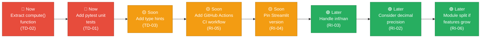

---

## 12. Glossary

> **Sources**: `app.py` identifiers, Streamlit framework terminology, arithmetic domain

| Term                     | Definition                                                                                                                          |
|--------------------------|-------------------------------------------------------------------------------------------------------------------------------------|
| **app.py**               | The single Python source file that constitutes the entire Streamlit Calculator application.                                        |
| **Arithmetic Operation** | One of the four supported mathematical operations: Add (`+`), Subtract (`-`), Multiply (`×`), Divide (`÷`).                       |
| **`calculator_form`**    | The Streamlit form key used to group `num1`, `num2`, and `operation` inputs into a single batched submission event.               |
| **Computation Engine**   | The logical block (lines 24–49 of `app.py`) responsible for dispatching arithmetic operations and enforcing business rules.       |
| **Divide-by-Zero Guard** | The business rule that prevents division when `num2 == 0`; implemented as an explicit `if` check before the `/` operator.         |
| **`float`**              | Python's native 64-bit IEEE 754 double-precision floating-point type, used for all numeric values in this application.            |
| **Form Submission**      | The user action of clicking the "Calculate" button, which sets `submitted = True` and triggers script re-execution with inputs.   |
| **IEEE 754**             | International standard for floating-point arithmetic; defines the precision and rounding behaviour of Python's `float` type.      |
| **`num1` / `num2`**      | Variable names for the first and second operands in a calculation, both of type `float`, defaulting to `0.0`.                     |
| **`operation`**          | The user-selected arithmetic operation, captured as a string: `"Add"`, `"Subtract"`, `"Multiply"`, or `"Divide"`.                |
| **Reactive Execution**   | Streamlit's execution model in which the entire Python script is re-run from top to bottom on every UI interaction.               |
| **`result`**             | The computed output of the arithmetic operation, stored as a Python `float`.                                                       |
| **`st.error()`**         | Streamlit function that renders a red error banner in the UI, used here to display the division-by-zero message.                  |
| **`st.expander()`**      | Streamlit component that renders a collapsible panel; used to show computation detail metadata without cluttering the main view.  |
| **`st.form()`**          | Streamlit component that groups widgets and defers their events until a submit button is clicked.                                  |
| **`st.number_input()`**  | Streamlit widget that renders a numeric text input with up/down stepper controls; enforces numeric-only input at the widget level.|
| **`st.stop()`**          | Streamlit function that immediately halts further script execution; used after surfacing the division-by-zero error.              |
| **`st.success()`**       | Streamlit function that renders a green success banner; used to display the computation result.                                   |
| **Streamlit**            | An open-source Python framework (`streamlit>=1.40.0`) that converts Python scripts into interactive web applications.             |
| **`submitted`**          | Boolean flag set by `st.form_submit_button()`; `True` only when the user has clicked "Calculate" in the current script execution. |
| **`symbol`**             | A single-character string (`+`, `-`, `×`, `÷`) representing the display form of the selected arithmetic operation.               |
| **Virtual Environment**  | An isolated Python environment (`.venv`) used to install project-specific dependencies without polluting the system Python.       |
| **WebSocket**            | The persistent bidirectional protocol used by Streamlit to push UI updates from the server to the browser without full page reloads. |

---

*Documentation generated by Arc42 Documentation Generator.*  
*Based on source analysis of `app.py` (50 LOC), `requirements.txt`, and `README.md`.*  
*All diagrams rendered as Mermaid code blocks — no external image files required.*
