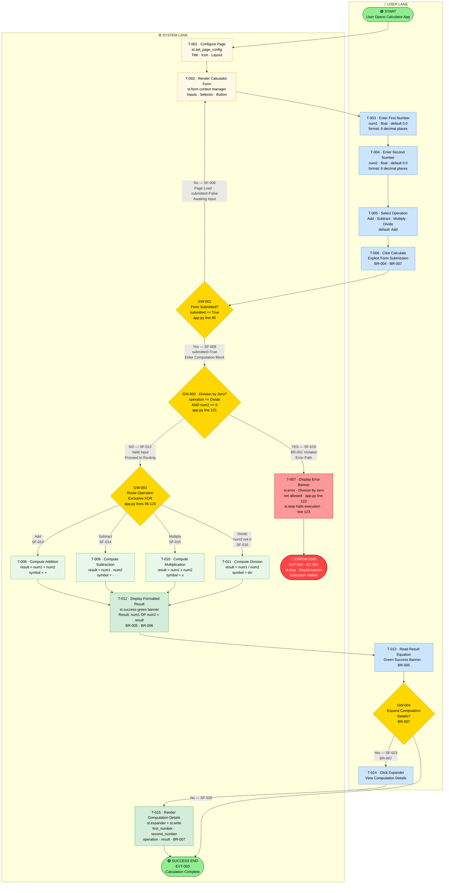
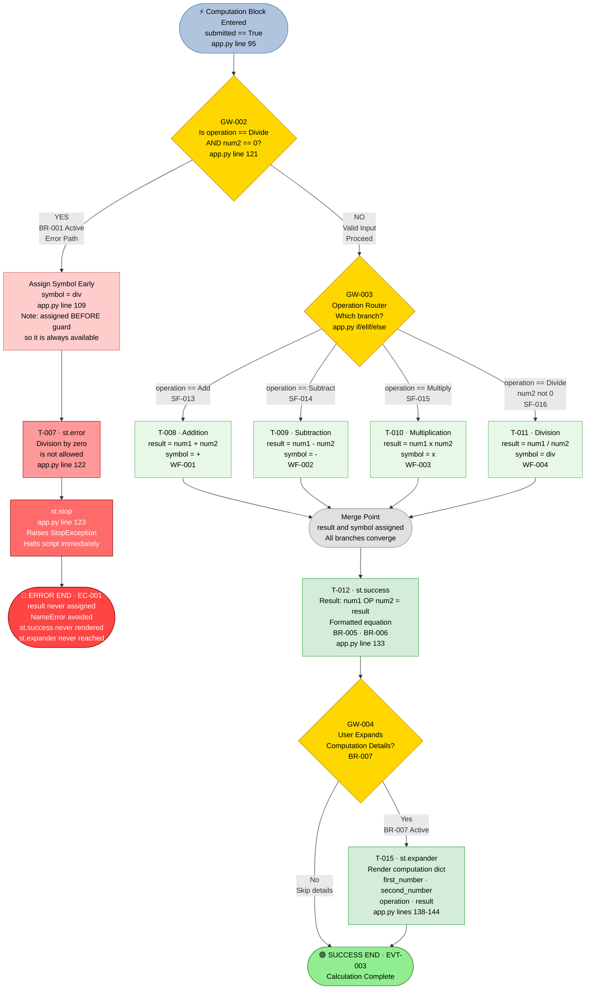
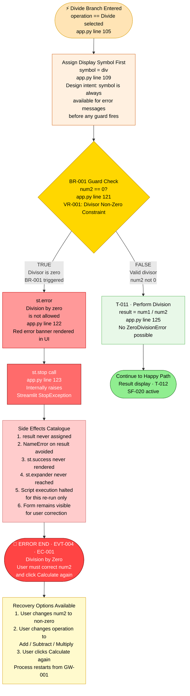
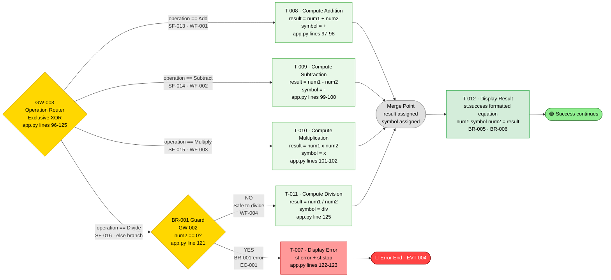
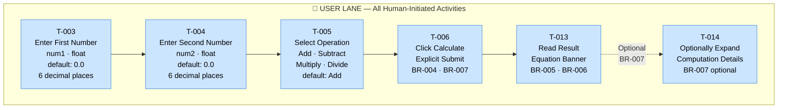
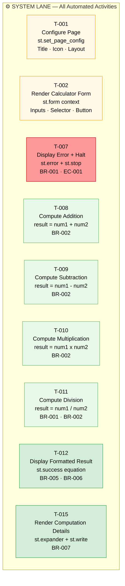
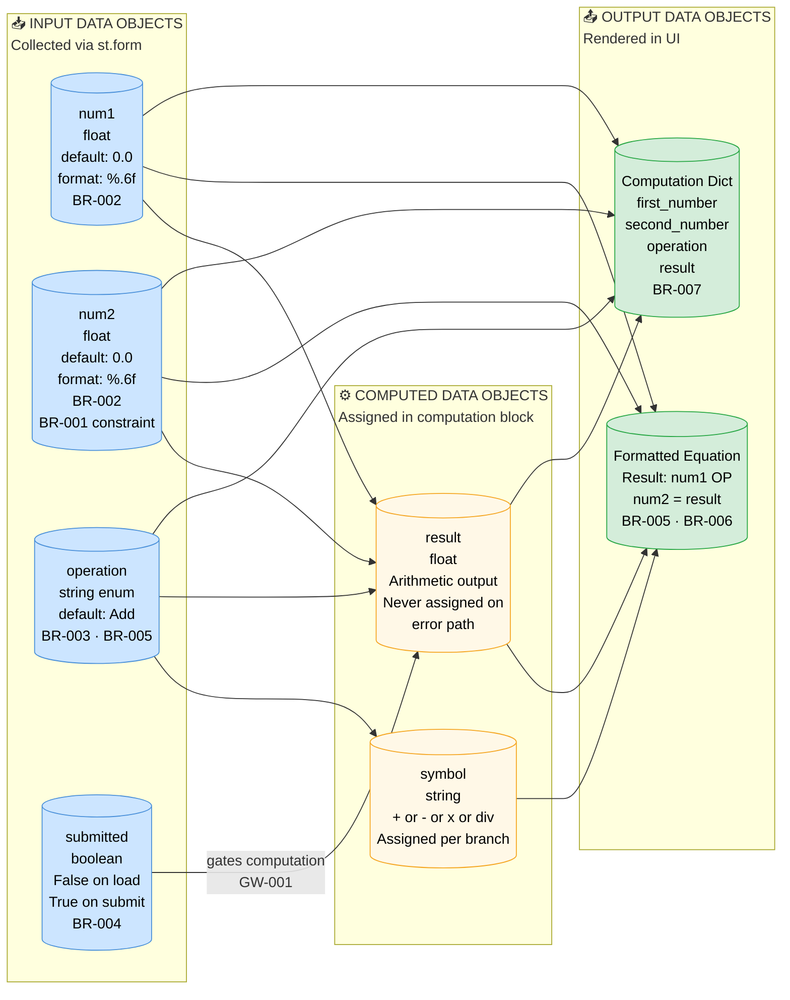
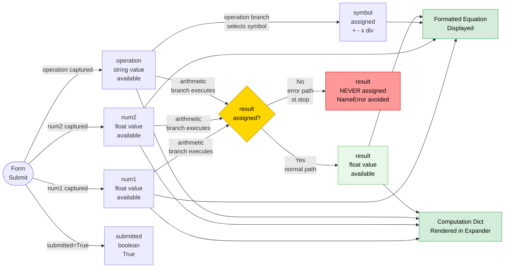

# BPMN 2.0 Process Model — Streamlit Calculator Application

> **Source**: `app.py` · **Framework**: Streamlit ≥ 1.40.0 · **Language**: Python 3  
> **Process Model Standard**: BPMN 2.0 (visualised as Mermaid flowcharts)  
> **Generated from**: `app.py` source code, `business_rules_extractor_analysis.json`, `ast_analysis.json`

---

## Table of Contents

1. [Process Narrative](#1-process-narrative)
2. [Process Elements Catalog](#2-process-elements-catalog)
3. [BPMN Diagrams](#3-bpmn-diagrams)
   - 3.1 [Full Process with Swimlanes](#31-full-process-with-swimlanes)
   - 3.2 [Computation Engine — Decision Detail](#32-computation-engine--decision-detail)
   - 3.3 [Error Handling Sub-Process](#33-error-handling-sub-process)
   - 3.4 [Operation Routing Detail](#34-operation-routing-detail)
4. [Process Metrics](#4-process-metrics)
5. [Lane / Participant Breakdown](#5-lane--participant-breakdown)
6. [Business Rule — Process Mapping](#6-business-rule--process-mapping)
7. [Data Objects and Field Catalog](#7-data-objects-and-field-catalog)

---

## 1. Process Narrative

### 1.1 Overview

The **Simple Calculator** is a single-page, browser-based Streamlit web application that performs the four fundamental arithmetic operations — Addition, Subtraction, Multiplication, and Division — on two floating-point numbers provided by the user.

The process follows Streamlit's **reactive top-to-bottom execution model**: the entire Python script re-runs on every user interaction. A `st.form` context batches all input widgets so that no calculation is triggered while the user is still editing values. Computation is deferred and only begins when the user explicitly clicks the **"Calculate"** button, causing Streamlit to re-run the script with `submitted = True`.

### 1.2 Process Boundaries

| Boundary | Element | Description |
|---|---|---|
| **Start** | User opens the calculator URL in a browser | Streamlit serves the application page |
| **Happy End** | Formatted result equation displayed on screen | Calculation completes without error |
| **Error End** | Division-by-zero error banner shown, execution halted | `st.stop()` raises a `StopException` |

### 1.3 Participants / Pools

| Pool | Role |
|---|---|
| **User** | The human actor who provides inputs and reads outputs |
| **Streamlit System** | The framework and application code that renders the UI, validates inputs, computes results, and displays outputs |

### 1.4 Narrative Walk-Through

**Step 1 — Application Initialisation (System)**  
When the user navigates to the calculator URL, Streamlit executes `app.py` from top to bottom with `submitted = False`. The system configures the page metadata (`st.set_page_config`), renders the title and caption, and draws the input form containing: two floating-point number inputs (defaulting to `0.0`, formatted to six decimal places per **BR-002** and **BR-006**), an operation selector defaulting to "Add" (**BR-003**, **BR-004**), and a "Calculate" submit button. The computation block is skipped entirely because `submitted` is `False` — the `if submitted:` guard at line 95 is not entered.

**Step 2 — User Input Collection (User)**  
The user fills in the form fields at their own pace. Each individual keystroke or dropdown change does **not** trigger a recalculation because all widgets are wrapped in a `st.form` context manager (**BR-004** / **BR-007**). Input changes are batched within the browser until the form is submitted.

**Step 3 — Form Submission (User → System boundary)**  
The user clicks "Calculate". Streamlit detects the submit event and re-runs the script with `submitted = True`, passing the current form values as `num1`, `num2`, and `operation`.

**Step 4 — Submission Gate (System)**  
The `if submitted:` guard at line 95 of `app.py` acts as the first exclusive gateway. Because `submitted = True`, execution enters the computation block.

**Step 5 — Input Validation: Division-by-Zero Guard (System)**  
Inside the computation block, if the user selected "Divide", the system performs a pre-computation guard check (**BR-001**): it tests whether `num2 == 0`. If the divisor is zero, the system displays a red error banner and immediately calls `st.stop()`, which raises a Streamlit `StopException` and halts further script execution. The `result` variable is never assigned. No success banner or expander is rendered. The process terminates at the **Error End Event**.

**Step 6 — Operation Routing (System)**  
If the input is valid, an exclusive four-way gateway routes execution to the matching arithmetic branch:

- **Add**: `result = num1 + num2`, `symbol = "+"`
- **Subtract**: `result = num1 - num2`, `symbol = "-"`
- **Multiply**: `result = num1 * num2`, `symbol = "×"`
- **Divide** (only reached when `num2 ≠ 0`): `result = num1 / num2`, `symbol = "÷"`

**Step 7 — Result Display (System)**  
After the arithmetic branch completes, the system renders a green success banner (`st.success`) containing the formatted equation: `"Result: {num1} {symbol} {num2} = {result}"` (**BR-005** / **BR-006**).

**Step 8 — Optional Details Panel (User → System)**  
A collapsible `st.expander` labelled "Computation details" is rendered but collapsed by default (**BR-007**). If the user clicks to expand it, the system displays the raw computation dictionary: `{first_number, second_number, operation, result}`. This is an optional extension activity.

**Step 9 — Process End**  
The process reaches the **Successful Calculation End Event**. The user may repeat the process by modifying inputs and clicking "Calculate" again, which triggers a fresh re-run.

---

## 2. Process Elements Catalog

### 2.1 Events

| ID | Element | BPMN Type | Description | Code Reference |
|---|---|---|---|---|
| **EVT-001** | User Opens Calculator App | Start Event (None) | User navigates to the Streamlit URL; script executes for the first time | `streamlit run app.py` |
| **EVT-002** | Calculate Button Clicked | Boundary Event (Form Submit) | User clicks the "Calculate" button; triggers script re-run with `submitted=True` | `st.form_submit_button("Calculate")` |
| **EVT-003** | Successful Calculation End | End Event (None) | Result displayed; process completes successfully | After `st.success()` / `st.expander()` |
| **EVT-004** | Division-by-Zero Error End | End Event (Error) | `st.stop()` called; process terminates in error state | `app.py` line 123 |

### 2.2 Tasks

| ID | Task Name | BPMN Task Type | Lane | Description | Code Reference |
|---|---|---|---|---|---|
| **T-001** | Configure Page | Service Task | System | Set browser tab title, icon, and layout | `st.set_page_config(...)` |
| **T-002** | Render Calculator Form | Service Task | System | Draw title, caption, two number inputs, operation selector, and Calculate button | `st.form("calculator_form")` |
| **T-003** | Enter First Number | User Task | User | User types or adjusts `num1` (float, default `0.0`, 6 d.p.) | `st.number_input("First number", ...)` |
| **T-004** | Enter Second Number | User Task | User | User types or adjusts `num2` (float, default `0.0`, 6 d.p.) | `st.number_input("Second number", ...)` |
| **T-005** | Select Operation | User Task | User | User picks one of: Add, Subtract, Multiply, Divide (default: Add) | `st.selectbox("Operation", ...)` |
| **T-006** | Submit Form | User Task | User | User explicitly clicks "Calculate" to batch-submit all form values | `st.form_submit_button("Calculate")` |
| **T-007** | Display Error Banner | Service Task | System | Render `st.error("Division by zero is not allowed.")` then call `st.stop()` | `app.py` lines 122–123 |
| **T-008** | Compute Addition | Script Task | System | `result = num1 + num2`; `symbol = "+"` | `app.py` lines 97–98 |
| **T-009** | Compute Subtraction | Script Task | System | `result = num1 - num2`; `symbol = "-"` | `app.py` lines 99–100 |
| **T-010** | Compute Multiplication | Script Task | System | `result = num1 * num2`; `symbol = "×"` | `app.py` lines 101–102 |
| **T-011** | Compute Division | Script Task | System | `result = num1 / num2`; `symbol = "÷"` (guard already passed) | `app.py` line 125 |
| **T-012** | Display Formatted Result | Service Task | System | Render `st.success(f"Result: {num1} {symbol} {num2} = {result}")` | `app.py` line 133 |
| **T-013** | View Result Equation | User Task | User | User reads the formatted result in the green success banner | UI interaction |
| **T-014** | Expand Computation Details | User Task | User | User optionally clicks the "Computation details" expander | `st.expander(...)` |
| **T-015** | Render Computation Details | Service Task | System | Display raw dict: `{first_number, second_number, operation, result}` | `app.py` lines 138–144 |

### 2.3 Gateways

| ID | Gateway Name | BPMN Type | Description | Outgoing Flows | Code Reference |
|---|---|---|---|---|---|
| **GW-001** | Form Submission Check | Exclusive (XOR) | Was the form explicitly submitted in this script re-run? | Yes → Validate Input · No → Show Form Only | `if submitted:` (line 95) |
| **GW-002** | Division-by-Zero Check | Exclusive (XOR) | Is the selected operation "Divide" AND is `num2 == 0`? | Yes → Error Path · No → Route Operation | `if num2 == 0:` (line 121) |
| **GW-003** | Operation Router | Exclusive (XOR) | Which arithmetic operation was selected? | Add · Subtract · Multiply · Divide | `if/elif/else` chain (lines 96–125) |
| **GW-004** | Expand Details Check | Exclusive (XOR) | Did the user click to expand the computation details panel? | Yes → Show Details · No → End | `st.expander(...)` interaction |

### 2.4 Sequence Flows

| ID | From | To | Condition |
|---|---|---|---|
| **SF-001** | EVT-001 | T-001 | Always — script starts |
| **SF-002** | T-001 | T-002 | Always |
| **SF-003** | T-002 | T-003 | Always — form rendered |
| **SF-004** | T-003 | T-004 | Always |
| **SF-005** | T-004 | T-005 | Always |
| **SF-006** | T-005 | T-006 | Always |
| **SF-007** | T-006 | GW-001 | Always — form submitted signal sent |
| **SF-008** | GW-001 | T-002 | `submitted == False` (page load / no submit) |
| **SF-009** | GW-001 | GW-002 | `submitted == True` |
| **SF-010** | GW-002 | T-007 | `operation == "Divide" AND num2 == 0` |
| **SF-011** | T-007 | EVT-004 | Always — st.stop() halts |
| **SF-012** | GW-002 | GW-003 | `NOT (operation == "Divide" AND num2 == 0)` |
| **SF-013** | GW-003 | T-008 | `operation == "Add"` |
| **SF-014** | GW-003 | T-009 | `operation == "Subtract"` |
| **SF-015** | GW-003 | T-010 | `operation == "Multiply"` |
| **SF-016** | GW-003 | T-011 | `operation == "Divide"` (guard passed) |
| **SF-017** | T-008 | T-012 | Always |
| **SF-018** | T-009 | T-012 | Always |
| **SF-019** | T-010 | T-012 | Always |
| **SF-020** | T-011 | T-012 | Always |
| **SF-021** | T-012 | T-013 | Always — user reads result |
| **SF-022** | T-013 | GW-004 | Always |
| **SF-023** | GW-004 | T-014 | User clicks expander |
| **SF-024** | T-014 | T-015 | Always |
| **SF-025** | T-015 | EVT-003 | Always |
| **SF-026** | GW-004 | EVT-003 | User does not expand details |

---

## 3. BPMN Diagrams

### 3.1 Full Process with Swimlanes

This diagram presents the complete end-to-end calculator workflow organised into two swimlanes: the **User Lane** (human actor interactions) and the **System Lane** (automated Streamlit processing). All four BPMN element types — events, tasks, gateways, and flows — are represented.

> **Legend**:  
> 🟢 Green nodes = Start / Success End events  
> 🔴 Red nodes = Error End event / Error tasks  
> 🟡 Yellow nodes = Exclusive decision gateways  
> 🔵 Blue nodes = User tasks  
> ⚪ White/beige nodes = System tasks  
> Green compute nodes = Arithmetic script tasks

---

### 3.2 Computation Engine — Decision Detail

This diagram zooms into the **Computation Engine** (Section 4 of `app.py`, lines 95–144) and shows every decision branch and arithmetic path in full detail, including the critical division-by-zero guard, the symbol assignment ordering, and the result display chain.

---

### 3.3 Error Handling Sub-Process

This diagram isolates the **Division-by-Zero error sub-process** (Business Rule BR-001 / Error Condition EC-001) and shows the complete guard chain, the `st.stop()` termination mechanism, all side effects, and the recovery options available to the user. It maps directly to `app.py` lines 105–123.

---

### 3.4 Operation Routing Detail

This diagram shows the **four-way exclusive gateway** (GW-003 / DL-001) with all branch conditions, the co-located `symbol` variable assignment for each operation, the embedded division guard, and the convergence to the result display. It directly mirrors the `if/elif/else` chain at `app.py` lines 96–125.

---

## 4. Process Metrics

### 4.1 Element Count

| BPMN Element Category | Count | Details |
|---|---|---|
| **Start Events** | 1 | EVT-001: User Opens Calculator App |
| **End Events** | 2 | EVT-003: Success End · EVT-004: Error End |
| **Intermediate / Boundary Events** | 1 | EVT-002: Form Submit Boundary Event |
| **Total Events** | **4** | |
| **User Tasks** | 6 | T-003, T-004, T-005, T-006, T-013, T-014 |
| **Service Tasks** | 5 | T-001, T-002, T-007, T-012, T-015 |
| **Script Tasks** | 4 | T-008, T-009, T-010, T-011 |
| **Total Tasks** | **15** | All activities combined |
| **Exclusive Gateways (XOR)** | 4 | GW-001, GW-002, GW-003, GW-004 |
| **Parallel Gateways (AND)** | 0 | No concurrent execution paths |
| **Total Gateways** | **4** | |
| **Sequence Flows** | 26 | SF-001 through SF-026 |
| **Pools / Participants** | 2 | User · Streamlit System |
| **Swimlanes** | 2 | User Lane · System Lane |
| **Data Objects** | 6 | num1 · num2 · operation · submitted · result · symbol |

### 4.2 Path Analysis

#### Happy Path — Add Operation (Minimum Required Steps)

The shortest complete path for a successful calculation (Add, no details expansion):

| Step # | Element ID | Type | Description |
|---|---|---|---|
| 1 | EVT-001 | Start Event | User opens calculator |
| 2 | T-001 | Service Task | Configure page metadata |
| 3 | T-002 | Service Task | Render calculator form |
| 4 | T-003 | User Task | Enter first number (num1) |
| 5 | T-004 | User Task | Enter second number (num2) |
| 6 | T-005 | User Task | Select operation (Add) |
| 7 | T-006 | User Task | Click Calculate button |
| 8 | GW-001 | XOR Gateway | submitted=True → proceed |
| 9 | GW-002 | XOR Gateway | Not divide/zero → proceed |
| 10 | GW-003 | XOR Gateway | Route to Add branch |
| 11 | T-008 | Script Task | Compute addition |
| 12 | T-012 | Service Task | Display formatted result |
| 13 | T-013 | User Task | View result equation |
| 14 | GW-004 | XOR Gateway | No details expansion |
| 15 | EVT-003 | End Event | Successful Calculation End |

**Happy path length: 15 steps** (12 tasks + 3 gateways + start/end)  
**With optional details panel: 17 steps** (adds T-014 and T-015)

#### Error Path — Division by Zero

| Step # | Element ID | Type | Description |
|---|---|---|---|
| 1 | EVT-001 | Start Event | User opens calculator |
| 2 | T-001 | Service Task | Configure page |
| 3 | T-002 | Service Task | Render form |
| 4 | T-003 | User Task | Enter num1 |
| 5 | T-004 | User Task | Enter 0 as num2 |
| 6 | T-005 | User Task | Select Divide |
| 7 | T-006 | User Task | Click Calculate |
| 8 | GW-001 | XOR Gateway | submitted=True |
| 9 | GW-002 | XOR Gateway | Divide AND num2=0 → error |
| 10 | T-007 | Service Task | Display error + st.stop() |
| 11 | EVT-004 | Error End Event | Execution halted |

**Error path length: 11 steps** (8 tasks + 2 gateways + start/error end)

### 4.3 Complete Execution Path Inventory

All distinct complete execution paths through the process:

| Path ID | Operation | Division Guard | Details Expanded | Steps | End Event |
|---|---|---|---|---|---|
| **P-01** | Add | N/A | No | 15 | Success |
| **P-02** | Add | N/A | Yes | 17 | Success |
| **P-03** | Subtract | N/A | No | 15 | Success |
| **P-04** | Subtract | N/A | Yes | 17 | Success |
| **P-05** | Multiply | N/A | No | 15 | Success |
| **P-06** | Multiply | N/A | Yes | 17 | Success |
| **P-07** | Divide (num2 ≠ 0) | Pass | No | 15 | Success |
| **P-08** | Divide (num2 ≠ 0) | Pass | Yes | 17 | Success |
| **P-09** | Divide (num2 = 0) | Fail | N/A | 11 | Error |

**Total distinct complete paths: 9**  
*(The page-load-only path where submitted=False does not constitute a complete business process execution)*

### 4.4 Cyclomatic Complexity

Cyclomatic complexity measures the number of linearly independent paths through the process graph. It indicates the minimum number of test cases required for full path coverage.

#### Formula 1 — McCabe's Formula: `V(G) = E − N + 2P`

| Variable | Value | Explanation |
|---|---|---|
| **E** (edges / sequence flows) | 26 | Total directed flows (SF-001 through SF-026) |
| **N** (nodes / process elements) | 23 | 15 tasks + 4 gateways + 4 events |
| **P** (connected components) | 1 | Single connected process graph |
| **V(G)** | **5** | `26 − 23 + 2(1) = 5` |

#### Formula 2 — Decision Point Count: `V(G) = binary_decisions + 1`

| Gateway | Branches | Binary Decision Equivalent |
|---|---|---|
| GW-001: Form Submitted? | 2 outgoing | 1 binary decision |
| GW-002: Division by Zero? | 2 outgoing | 1 binary decision |
| GW-003: Operation Router | 4 outgoing | 3 binary decisions |
| GW-004: Expand Details? | 2 outgoing | 1 binary decision |
| **Total binary decisions** | | **6** |
| **V(G) = 6 + 1** | | **7** |

#### Summary

| Metric | Value | Interpretation |
|---|---|---|
| **Base Cyclomatic Complexity** | **5** | E−N+2P formula |
| **Extended Cyclomatic Complexity** | **7** | All binary decision points |
| **Distinct Execution Paths** | **9** | All complete paths through process |
| **Error Paths** | **1** | Division by Zero (BR-001 / EC-001) |
| **Happy Paths** | **8** | 4 operations × 2 detail options |
| **Minimum Test Cases for Full Coverage** | **9** | One per distinct path |

> **Complexity Assessment**: A cyclomatic complexity of 5–7 falls in the **low complexity** range (1–10 = simple, well-structured). The process is linear, easy to understand, and has a single well-defined error boundary. All error handling is centralised at GW-002 with no cascading failures.

---

## 5. Lane / Participant Breakdown

### 5.1 User Lane

The User Lane contains all activities requiring direct human interaction. The user is the sole external actor and interacts with the system exclusively through the Streamlit web UI rendered in a browser.

| Task ID | Activity | Trigger | Outputs |
|---|---|---|---|
| T-003 | Enter First Number | Form displayed | `num1` (float, 6 d.p.) |
| T-004 | Enter Second Number | After T-003 | `num2` (float, 6 d.p.) |
| T-005 | Select Operation | After T-004 | `operation` ∈ {Add, Subtract, Multiply, Divide} |
| T-006 | Click Calculate | User decision | `submitted = True`; script re-run triggered |
| T-013 | Read Result Equation | After T-012 completes | (perception — no system output generated) |
| T-014 | Expand Details Panel | User decision (optional) | Expander opens; T-015 triggered |

### 5.2 System Lane

The System Lane contains all automated activities performed by the Streamlit framework and the application's Python logic, with no direct user action required to execute them.

| Task ID | Activity | BPMN Type | Key Code | Business Rule |
|---|---|---|---|---|
| T-001 | Configure Page | Service Task | `st.set_page_config(...)` | — |
| T-002 | Render Calculator Form | Service Task | `st.form("calculator_form")` | BR-004, BR-007 |
| T-007 | Display Error + Halt | Service Task | `st.error(...); st.stop()` | BR-001 |
| T-008 | Compute Addition | Script Task | `result = num1 + num2` | BR-002 |
| T-009 | Compute Subtraction | Script Task | `result = num1 - num2` | BR-002 |
| T-010 | Compute Multiplication | Script Task | `result = num1 * num2` | BR-002 |
| T-011 | Compute Division | Script Task | `result = num1 / num2` | BR-001, BR-002 |
| T-012 | Display Formatted Result | Service Task | `st.success(f"Result: ...")` | BR-005, BR-006 |
| T-015 | Render Computation Details | Service Task | `st.expander(...); st.write(...)` | BR-007 |

### 5.3 Responsibility Matrix (RACI)

| Activity | User | Streamlit System |
|---|---|---|
| Provide num1 input | **R** | I |
| Provide num2 input | **R** | I |
| Select operation | **R** | I |
| Trigger calculation | **R** | I |
| Render form | C | **R** |
| Validate division guard (BR-001) | — | **R** |
| Route operation (GW-003) | — | **R** |
| Compute arithmetic result | — | **R** |
| Assign display symbol | — | **R** |
| Display result equation | I | **R** |
| Display error banner | I | **R** |
| Optionally expand details | **R** | I |
| Render details expander panel | C | **R** |

*R = Responsible · C = Consulted · I = Informed*

---

## 6. Business Rule — Process Mapping

This table maps each Business Rule from `app.py` to the specific BPMN process element(s) that enforce it, enabling full traceability from specification to model.

| Rule ID | Rule Name | Priority | Enforcing BPMN Element(s) | Code Reference |
|---|---|---|---|---|
| **BR-001** | Division by Zero Prevention | 🔴 Critical | GW-002 (guard check) + T-007 (error banner) + EVT-004 (error end) | `app.py` lines 121–123 |
| **BR-002** | Floating-Point Precision (6 d.p.) | 🟡 Medium | T-003, T-004 (number input attributes) | `format="%.6f"` in `st.number_input` |
| **BR-003** | Default Operation is Addition | 🟢 Low | T-002 (form render — selectbox default) | `selectbox(index=0)` |
| **BR-004** | Calculation Gated by Explicit Submission | 🟠 High | GW-001 (submission gate) + EVT-002 (boundary event) | `if submitted:` line 95 |
| **BR-005** | Exactly Four Operations Supported | 🟠 High | GW-003 (4-way exclusive operation router) | `options=("Add","Subtract","Multiply","Divide")` |
| **BR-006** | Result Displayed as Formatted Equation | 🟡 Medium | T-012 (result display service task) | `st.success(f"Result: {num1} {symbol} {num2} = {result}")` |
| **BR-007** | Computation Details Available on Demand | 🟢 Low | GW-004 (expand check) + T-015 (details render) | `st.expander("Computation details")` |

---

## 7. Data Objects and Field Catalog

### 7.1 Process Data Flow

### 7.2 Field Definitions

| Field | Type | Source | Default | Constraints | Lifecycle |
|---|---|---|---|---|---|
| `num1` | `float` | `st.number_input` | `0.0` | Format `%.6f`; any valid float | Input → Computation → Result display → Details dict |
| `num2` | `float` | `st.number_input` | `0.0` | Format `%.6f`; **must ≠ 0 when Divide (BR-001)** | Input → Guard check → Computation → Result display → Details dict |
| `operation` | `str` | `st.selectbox` | `"Add"` | ∈ {Add, Subtract, Multiply, Divide} (UI-enforced) | Input → GW-002 check → GW-003 routing → Details dict |
| `submitted` | `bool` | `st.form_submit_button` | `False` | `True` only on the re-run immediately following button click | GW-001 gate |
| `symbol` | `str` | Assigned in computation block | N/A | ∈ {+, -, ×, ÷}; assigned before guard in Divide branch | Computation → Result display |
| `result` | `float` | Arithmetic computation | N/A | **Never assigned on error path** (EC-001 guard) | Computation → Result display → Details dict |

### 7.3 Variable Lifecycle Diagram

---

## Summary

| Metric | Value |
|---|---|
| **Total Process Tasks** | 15 (6 user · 5 service · 4 script) |
| **Total Gateways** | 4 (all Exclusive / XOR) |
| **Total Events** | 4 (1 start · 2 end · 1 boundary) |
| **Total Sequence Flows** | 26 |
| **Process Participants** | 2 (User · Streamlit System) |
| **Swimlanes** | 2 (User Lane · System Lane) |
| **Happy Path Length** | 15 steps (17 with optional details) |
| **Error Path Length** | 11 steps |
| **Total Distinct Execution Paths** | 9 |
| **Happy Paths** | 8 (4 operations × no/yes details) |
| **Error Paths** | 1 (BR-001: Division by Zero) |
| **Cyclomatic Complexity** | V(G) = 5 (base) · 7 (extended) |
| **Complexity Rating** | Low (1–10 scale) |
| **Business Rules Modelled** | 7 (BR-001 through BR-007) |
| **Error Conditions** | 1 (EC-001: Division by Zero) |
| **Validation Rules** | 3 (VR-001, VR-002, VR-003) |
| **BPMN Diagrams Generated** | 4 (swimlane · engine detail · error sub-process · routing) |

> **Process Assessment**: The Streamlit Calculator exhibits a **well-structured, low-complexity BPMN process** with a single clearly defined error boundary (BR-001) and a linear happy path. The four-way exclusive gateway (GW-003) is the primary branching point, mapping directly to the Python `if/elif/else` chain. All seven business rules are enforced at explicit, identifiable process elements, making the process fully traceable from specification to code. The `st.form` batching mechanism (GW-001) is the key architectural decision that prevents intermediate recalculation during input editing.

---

*Generated by BPMN Generator Agent · Source: `app.py` · Model Standard: BPMN 2.0 (Mermaid representation) · Diagrams: 4 Mermaid flowcharts*
