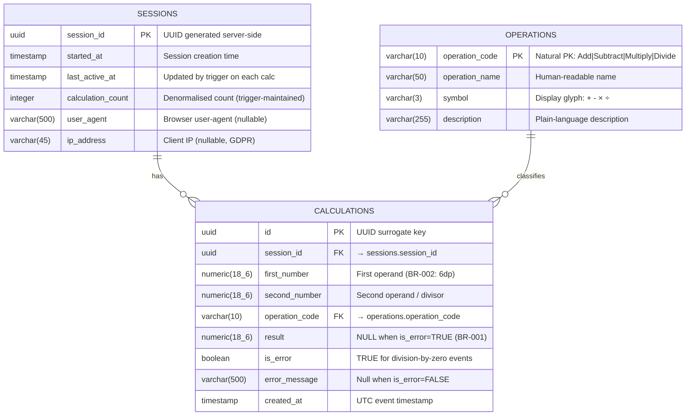

# Data Model Design — Streamlit Calculator Application

## Overview

This document explains the design decisions behind the production database schema (`database_schema.sql`) for the Streamlit Calculator application. The app is currently **stateless** — this schema introduces a persistence layer to record calculation history, track user sessions, and enable usage analytics.

---

## ER Diagram

---

## Tables

### `operations` — Lookup / Reference Table

| Column | Type | Notes |
|---|---|---|
| `operation_code` | `VARCHAR(10)` PK | Natural key matching app selectbox values |
| `operation_name` | `VARCHAR(50)` | Full name for display |
| `symbol` | `VARCHAR(3)` | Maths glyph: `+` `-` `×` `÷` |
| `description` | `VARCHAR(255)` | Documentation string |

**Design Decisions**
- **Natural PK** chosen over a surrogate integer because `operation_code` values (`Add`, `Subtract`, `Multiply`, `Divide`) are stable, short, business-meaningful strings — identical to what the application already uses. No translation layer is needed in application code.
- **Seeded at schema creation** with all four rows. The table is effectively an enum materialised as a table so it can be `JOIN`-ed in SQL views without application-level enum mapping.
- A `CHECK` constraint on `symbol` prevents data corruption if a manual INSERT is attempted.

---

### `sessions` — Session Tracking Table

| Column | Type | Notes |
|---|---|---|
| `session_id` | `UUID` PK | Generated via `gen_random_uuid()` |
| `started_at` | `TIMESTAMP` | Set once on session creation |
| `last_active_at` | `TIMESTAMP` | Trigger-maintained |
| `calculation_count` | `INTEGER` | Trigger-maintained denormalised count |
| `user_agent` | `VARCHAR(500)` | Optional analytics metadata |
| `ip_address` | `VARCHAR(45)` | Nullable — supports IPv4 + IPv6 |

**Design Decisions**
- **UUID PK** avoids sequential integer exposure in client-side `session_state` and is safe to store in a browser cookie/token without leaking row counts.
- `calculation_count` is **denormalised intentionally** — dashboard queries asking "sessions with > N calculations" run in O(1) against the sessions table rather than requiring a `COUNT` aggregation across millions of calculation rows.
- `last_active_at` and `calculation_count` are kept consistent by the `trg_calculations_update_session` trigger; application code does not need to update `sessions` manually.
- `ip_address` is **nullable** to support GDPR / privacy-by-design deployments where IP collection is restricted.

---

### `calculations` — Core Fact Table

| Column | Type | Notes |
|---|---|---|
| `id` | `UUID` PK | Surrogate key |
| `session_id` | `UUID` FK | → `sessions` |
| `first_number` | `NUMERIC(18,6)` | 6dp per BR-002 |
| `second_number` | `NUMERIC(18,6)` | 6dp; must ≠ 0 for Divide unless error |
| `operation_code` | `VARCHAR(10)` FK | → `operations` |
| `result` | `NUMERIC(18,6)` | NULL when `is_error = TRUE` |
| `is_error` | `BOOLEAN` | TRUE for division-by-zero attempts |
| `error_message` | `VARCHAR(500)` | NULL when success |
| `created_at` | `TIMESTAMP` | UTC insert timestamp |

**Design Decisions**
- **`NUMERIC(18,6)` not `FLOAT/DOUBLE`** — financial and scientific correctness requires exact decimal arithmetic. `FLOAT` stores binary approximations; `NUMERIC` stores exact values. This matches BR-002 (6dp precision) and avoids equality comparison surprises.
- **`result` is nullable** — BR-001 states division by zero is prohibited and produces no valid result. Rather than storing `NULL` ambiguously, the `is_error` flag makes the reason explicit. A `CHECK` constraint enforces the pair: `(is_error=FALSE ↔ result IS NOT NULL)`.
- **Error rows are persisted** — division-by-zero *attempts* are stored as `is_error=TRUE` rows. This enables error-rate monitoring and alerts (e.g., "10% of Divide operations are failing in session X").
- **`operation_code` as FK string** — avoids joining through an integer surrogate just to get back the operation name. Consistent with the natural-PK design of `operations`.

---

## Constraints Summary

| Constraint | Table | Purpose |
|---|---|---|
| `chk_calculations_result_error_consistency` | `calculations` | `result IS NULL ↔ is_error=TRUE` |
| `chk_calculations_error_message_required` | `calculations` | `error_message` must be set when `is_error=TRUE` |
| `chk_calculations_division_by_zero` | `calculations` | Blocks `second_number=0` + `operation=Divide` + `is_error=FALSE` |
| `chk_operations_symbol` | `operations` | Symbol must be one of `+`, `-`, `×`, `÷` |
| `chk_sessions_calc_count` | `sessions` | `calculation_count >= 0` |
| `chk_sessions_last_active_gte_started` | `sessions` | `last_active_at >= started_at` |

---

## Indexes

| Index | Table | Columns | Rationale |
|---|---|---|---|
| `idx_calculations_session_id` | `calculations` | `session_id` | FK join performance |
| `idx_calculations_operation` | `calculations` | `operation_code` | FK join + filter performance |
| `idx_calculations_created_at` | `calculations` | `created_at DESC` | Time-range queries (dashboards) |
| `idx_calculations_is_error` | `calculations` | `is_error` (partial, errors only) | Error monitoring — small filtered set |
| `idx_calculations_session_time` | `calculations` | `(session_id, created_at DESC)` | Session history view |
| `idx_calculations_op_error` | `calculations` | `(operation_code, is_error)` | Error-rate-by-operation analytics |
| `idx_sessions_started_at` | `sessions` | `started_at` | Time-range session analytics |
| `idx_sessions_last_active` | `sessions` | `last_active_at` | Stale session detection |

---

## Views

### `v_calculation_summary`
Aggregated statistics per operation type (total count, error count, error rate %, average operands, average result, first/last used timestamps). Uses `LEFT JOIN` from `operations` so all four operations appear even with zero historical usage.

**Primary use case:** Admin analytics dashboard — "which operations are used most? which fail most often?"

### `v_recent_calculations`
Last 100 calculation events enriched with operation symbol and name, ordered newest-first.

**Primary use case:** Real-time calculation history panel — surfacing recent activity to users or support staff.

---

## Business Rules Mapped to Schema

| Business Rule | Schema Enforcement |
|---|---|
| BR-001 Division by zero prohibited | `chk_calculations_division_by_zero` CHECK + `result` nullable + `is_error` flag |
| BR-002 6 decimal precision | `NUMERIC(18,6)` for `first_number`, `second_number`, `result` |
| BR-003 Default operation is Add | `operations` seed row; no DB constraint needed (UI-enforced) |
| BR-004 Exactly 4 operations | FK `operation_code → operations.operation_code` with `ON DELETE RESTRICT` |
| BR-005 Result derived from inputs | `chk_calculations_result_error_consistency` ensures result is never stored alongside an error |

---

## Schema Statistics

| Metric | Value |
|---|---|
| Tables | 3 (`operations`, `sessions`, `calculations`) |
| Views | 2 (`v_calculation_summary`, `v_recent_calculations`) |
| Triggers | 1 (`trg_calculations_update_session`) |
| Indexes | 8 |
| CHECK Constraints | 6 |
| Foreign Keys | 2 |
| Seed Rows | 4 (one per operation) |

---

## DDL File

The complete SQL DDL script is at: [`database_schema.sql`](database_schema.sql)

Target database: **PostgreSQL 14+** (uses `gen_random_uuid()` via `pgcrypto`, partial indexes, `FILTER` aggregate syntax).
