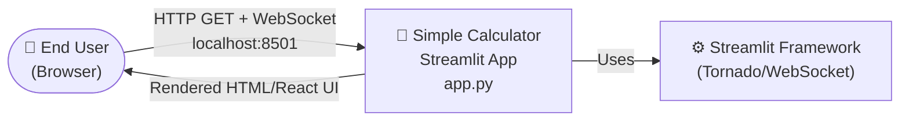
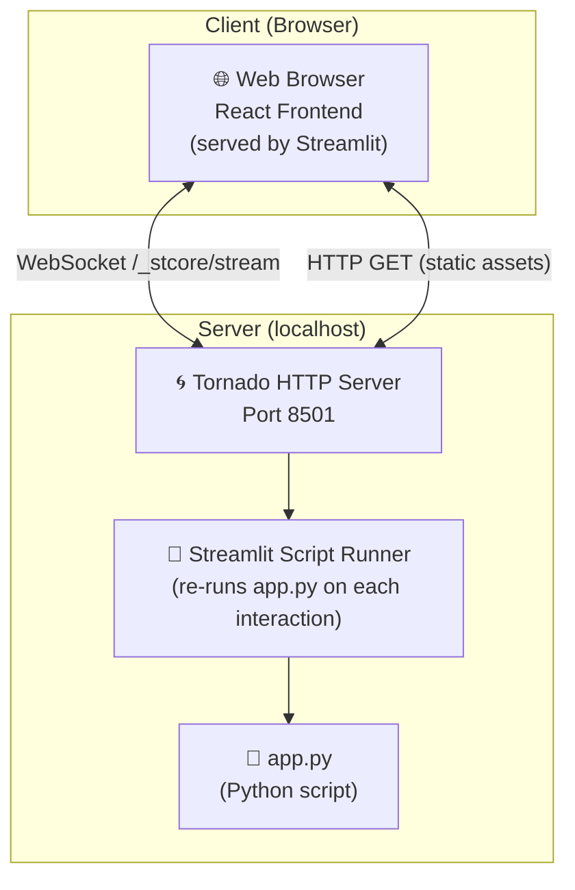
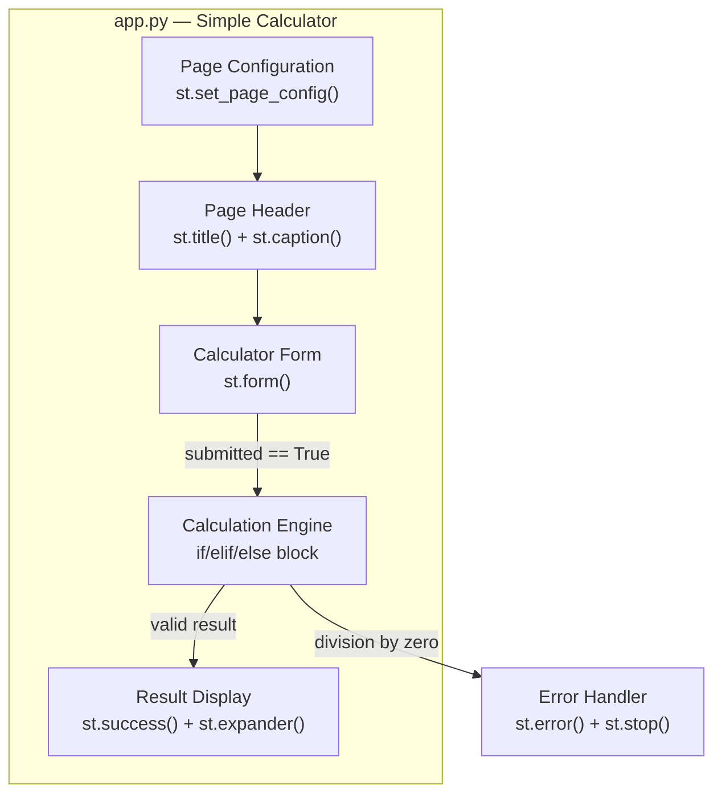
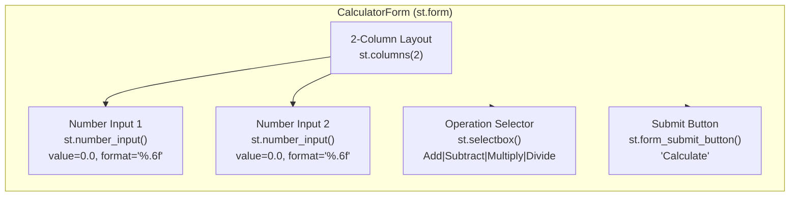
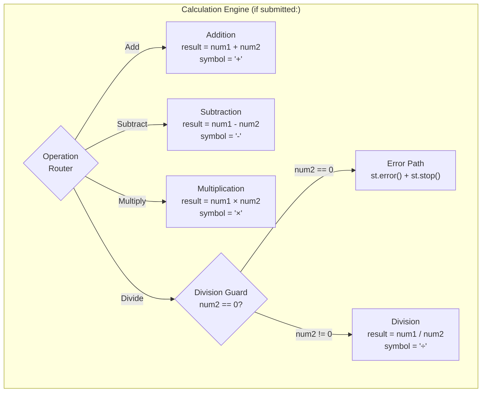
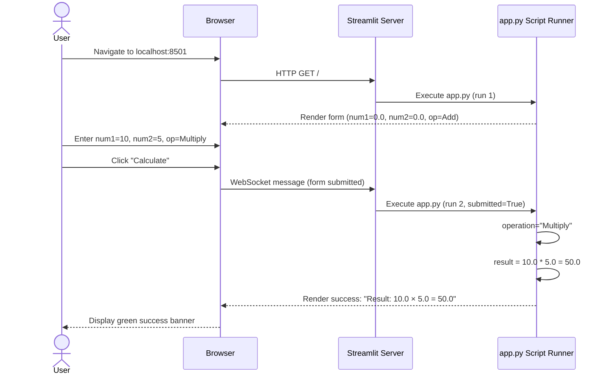
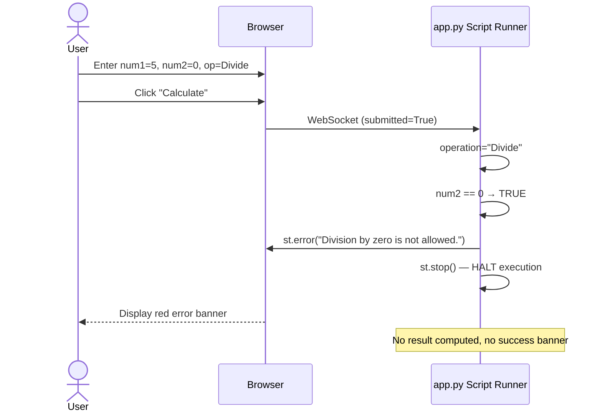
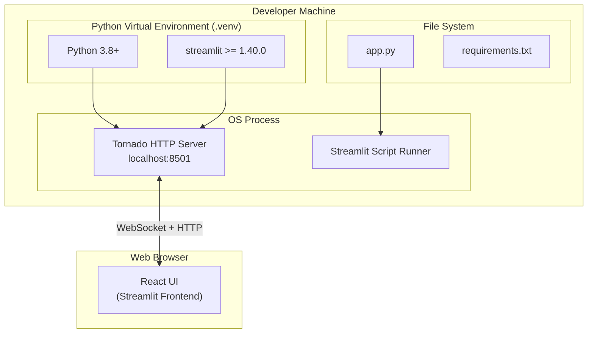

# Architecture Documentation (Arc42)

**Project**: Simple Calculator  
**Repository**: xinni-cap/github-copilot-test  
**Technology**: Python 3 · Streamlit ≥ 1.40.0  
**Version**: 1.0.0  
**Generated**: 2025-07-14

---

## Table of Contents

1. [Introduction and Goals](#1-introduction-and-goals)
2. [Constraints](#2-constraints)
3. [Context and Scope](#3-context-and-scope)
4. [Solution Strategy](#4-solution-strategy)
5. [Building Block View](#5-building-block-view)
6. [Runtime View](#6-runtime-view)
7. [Deployment View](#7-deployment-view)
8. [Cross-cutting Concepts](#8-cross-cutting-concepts)
9. [Architecture Decisions](#9-architecture-decisions)
10. [Quality Requirements](#10-quality-requirements)
11. [Risks and Technical Debt](#11-risks-and-technical-debt)
12. [Glossary](#12-glossary)

---

## 1. Introduction and Goals

### 1.1 Purpose

The **Simple Calculator** is a browser-based arithmetic web application that enables users to perform the four fundamental arithmetic operations (Add, Subtract, Multiply, Divide) through a clean, form-based web interface. The application is built with Streamlit and deployed as a single-file Python application.

### 1.2 Quality Goals

| Priority | Quality Goal | Scenario |
|---|---|---|
| 1 | **Correctness** | All four arithmetic operations produce mathematically correct results |
| 2 | **Usability** | A new user can perform a calculation within 10 seconds of opening the app |
| 3 | **Reliability** | Division by zero is detected and handled gracefully without crashes |
| 4 | **Simplicity** | The application can be understood and modified by any Python developer in < 15 minutes |
| 5 | **Deployability** | The application starts with a single command: `streamlit run app.py` |

### 1.3 Stakeholders

| Role | Expectation |
|---|---|
| **End User** | Simple, fast arithmetic in browser; clear error messages |
| **Developer** | Clean, readable code; easy to extend with new operations |
| **DevOps** | Single-command startup; minimal dependencies |

---

## 2. Constraints

### 2.1 Technical Constraints

| Constraint | Rationale |
|---|---|
| Python 3.8+ | Required by Streamlit ≥ 1.40.0 |
| Streamlit ≥ 1.40.0 | Core UI framework; drives all rendering |
| Single-file architecture | Intentional simplicity; `app.py` is the sole source file |
| No database | Stateless application; no persistent storage |
| No external APIs | Self-contained computation; no network dependencies |

### 2.2 Organizational Constraints

| Constraint | Rationale |
|---|---|
| Single-developer scope | No collaboration features required |
| Local development only | No production deployment configuration currently |
| No authentication | No user identification or access control |

---

## 3. Context and Scope

### 3.1 Business Context



### 3.2 Technical Context



---

## 4. Solution Strategy

### 4.1 Core Strategy Decisions

| Decision | Choice | Rationale |
|---|---|---|
| **UI Framework** | Streamlit | Enables Python-only web apps with zero HTML/CSS/JS |
| **Architecture** | Single-file procedural | Maximum simplicity for calculator scope |
| **Input batching** | `st.form` container | Prevents per-keystroke re-runs; groups inputs logically |
| **Error handling** | Guard clause + `st.stop()` | Clean early-exit pattern; prevents error state from propagating |
| **State** | Stateless (no `st.session_state`) | Simplest approach; each calculation is independent |

### 4.2 Technology Decisions

| Layer | Technology | Version |
|---|---|---|
| Language | Python | 3.8+ |
| UI Framework | Streamlit | ≥ 1.40.0 |
| HTTP Server | Tornado | (bundled with Streamlit) |
| Frontend | React | (bundled with Streamlit) |
| Arithmetic | Python built-ins | IEEE 754 float |

---

## 5. Building Block View

### 5.1 Level 1 — System Overview



### 5.2 Level 2 — Calculator Form Detail



### 5.3 Level 2 — Calculation Engine Detail



---

## 6. Runtime View

### 6.1 Happy Path — Successful Calculation



### 6.2 Error Path — Division by Zero



---

## 7. Deployment View

### 7.1 Local Development Deployment



### 7.2 Startup Sequence

```
1. $ source .venv/bin/activate
2. $ streamlit run app.py
3.   → Streamlit starts Tornado server on port 8501
4.   → Browser opens automatically (or user navigates to localhost:8501)
5.   → app.py executes for the first time → UI rendered
6.   → User interactions trigger app.py re-execution via WebSocket
```

### 7.3 Missing Production Deployment

The application currently has **no production deployment configuration**. To deploy to production, the following would be needed:

| Component | Status | Required For Production |
|---|---|---|
| Dockerfile | ❌ Missing | Container deployment |
| docker-compose.yml | ❌ Missing | Local container orchestration |
| HTTPS/TLS | ❌ Missing | Secure transport |
| Reverse proxy (nginx) | ❌ Missing | Production HTTP serving |
| CI/CD pipeline | ❌ Missing | Automated testing and deployment |
| Health check endpoint | ✅ Built-in | `/_stcore/health` (Streamlit native) |

---

## 8. Cross-cutting Concepts

### 8.1 Streamlit Re-run Model

Every user interaction triggers a **complete re-execution** of `app.py` from top to bottom. This is fundamental to understanding the application's runtime behavior.

```
User action (click, input change) 
    → WebSocket message to server
    → Streamlit re-runs app.py completely
    → UI is reconstructed from scratch
    → Only st.form batches this: re-run deferred until form submit
```

### 8.2 Error Handling Strategy

The application uses a **guard clause pattern** for error handling:

```python
# Guard: check for invalid condition FIRST
if num2 == 0:
    st.error("Division by zero is not allowed.")
    st.stop()  # ← HALT; nothing below executes
# Happy path: only reached if guard passes
result = num1 / num2
```

`st.stop()` is Streamlit's equivalent of a function `return` for the script execution context.

### 8.3 Form Batching Pattern

```python
with st.form("calculator_form"):
    # All inputs inside st.form are batched
    num1 = st.number_input(...)
    num2 = st.number_input(...)
    operation = st.selectbox(...)
    submitted = st.form_submit_button("Calculate")
# Only executes after "Calculate" is clicked
if submitted:
    ...
```

This is a deliberate architectural choice to prevent the calculation from running on every keystroke.

### 8.4 Statelessness

The application is **fully stateless** — no `st.session_state`, no database, no file I/O. Each calculation run is independent with no memory of previous results.

---

## 9. Architecture Decisions

### ADR-001: Single-File Architecture

**Context**: A simple 4-operation calculator needs minimal infrastructure.  
**Decision**: Implement the entire application in a single file (`app.py`).  
**Rationale**: Maximizes simplicity; reduces cognitive load; all logic visible in one screen.  
**Consequences**: ✅ Simple | ⚠️ Hard to unit test | ⚠️ Will not scale to complex features.

### ADR-002: Streamlit as UI Framework

**Context**: Need a web UI without frontend expertise.  
**Decision**: Use Streamlit as the sole UI framework.  
**Rationale**: Python-native; zero HTML/CSS/JS required; rapid development; built-in WebSocket handling.  
**Consequences**: ✅ Fast to build | ⚠️ Framework lock-in | ⚠️ Limited UI customization.

### ADR-003: st.form for Input Batching

**Context**: Streamlit re-runs the entire script on every widget interaction.  
**Decision**: Wrap all inputs in `st.form` container.  
**Rationale**: Prevents calculation from running on every keystroke; groups related inputs logically.  
**Consequences**: ✅ Better UX | ✅ Performance | ⚠️ Must click Calculate explicitly.

### ADR-004: Guard Clause with st.stop() for Division by Zero

**Context**: Division by zero must be caught before arithmetic execution.  
**Decision**: Use early-exit guard clause pattern with `st.stop()`.  
**Rationale**: Clean, readable error handling; `st.stop()` prevents any further execution.  
**Consequences**: ✅ Clear error path | ✅ No exception propagation | ⚠️ Non-obvious `st.stop()` semantics.

### ADR-005: IEEE 754 Float Arithmetic (Not Rejected)

**Context**: Arithmetic precision vs. implementation simplicity.  
**Decision**: Use Python native float arithmetic (IEEE 754 double-precision).  
**Rationale**: Simplest implementation; acceptable for general-purpose calculator scope.  
**Consequences**: ✅ Simple | ⚠️ Silent precision errors (e.g., 0.1+0.2≠0.3) | Should use `decimal.Decimal` for financial use.

---

## 10. Quality Requirements

### 10.1 Quality Scenarios

| ID | Quality Attribute | Scenario | Current Status |
|---|---|---|---|
| QS-001 | Correctness | User enters 10 + 5 → receives 15.0 | ✅ Met |
| QS-002 | Reliability | User enters x ÷ 0 → receives error, no crash | ✅ Met |
| QS-003 | Usability | New user performs first calculation in < 10s | ✅ Met |
| QS-004 | Simplicity | Developer understands full codebase in < 15min | ✅ Met |
| QS-005 | Testability | Calculate logic can be unit tested without browser | ❌ Not Met |
| QS-006 | Precision | 0.1 + 0.2 = 0.3 exactly | ❌ Not Met (IEEE 754) |
| QS-007 | Deployability | One-command startup | ✅ Met |
| QS-008 | Documentation | New developer understands features from README | ❌ Not Met (22% coverage) |

---

## 11. Risks and Technical Debt

### 11.1 Risk Register

| ID | Risk | Likelihood | Impact | Severity | Mitigation |
|---|---|---|---|---|---|
| R-001 | Float precision causes incorrect results for some inputs | High | Medium | 🟠 High | Use `decimal.Decimal` |
| R-002 | No tests → regression introduced during future change | High | Medium | 🟠 High | Add pytest suite |
| R-003 | Tight coupling prevents safe refactoring | High | Medium | 🟠 High | Extract `calculate()` function |
| R-004 | No deployment path → app never reaches production | Medium | Medium | 🟡 Medium | Add Dockerfile + CI/CD |
| R-005 | Statelessness limits real-world utility | High | Low | 🟡 Medium | Add `st.session_state` |
| R-006 | Single Streamlit developer dependency | Low | High | 🟡 Medium | Document alternatives |

### 11.2 Technical Debt Register

| ID | Item | Severity | Effort to Fix |
|---|---|---|---|
| TD-001 | Zero unit test coverage | 🔴 Critical | 2-3 hrs |
| TD-002 | Business logic not in callable function | 🟠 High | 1-2 hrs |
| TD-003 | IEEE 754 float arithmetic (not decimal.Decimal) | 🟡 Medium | 1 hr |
| TD-004 | README covers only 22% of features | 🟡 Medium | 3-4 hrs |
| TD-005 | No type annotations | 🟡 Low | <1 hr |
| TD-006 | No calculation history (st.session_state) | 🟡 Medium | 4-6 hrs |
| TD-007 | No deployment configuration | 🟡 Medium | 2-3 hrs |

**Total estimated remediation effort: ~15-20 engineering hours**

---

## 12. Glossary

| Term | Definition |
|---|---|
| **Streamlit** | Python-native web framework that renders UI widgets and manages a WebSocket server |
| **st.form** | Streamlit widget container that batches all enclosed widget interactions until the submit button is clicked |
| **st.stop()** | Streamlit function that immediately halts script execution for the current re-run cycle |
| **Re-run** | Streamlit's execution model: the entire `app.py` script is re-executed top-to-bottom on every user interaction |
| **Guard clause** | A conditional check at the start of a code path that exits early if a precondition is not met |
| **IEEE 754** | The international standard for floating-point arithmetic, used by Python's `float` type |
| **Tornado** | The HTTP/WebSocket server framework bundled with Streamlit |
| **st.session_state** | Streamlit's mechanism for persisting data between re-run cycles within a user session |
| **Widget** | A Streamlit UI component (input, button, selectbox, etc.) |
| **Script Runner** | Streamlit's internal component that executes the user's Python script on each re-run |
