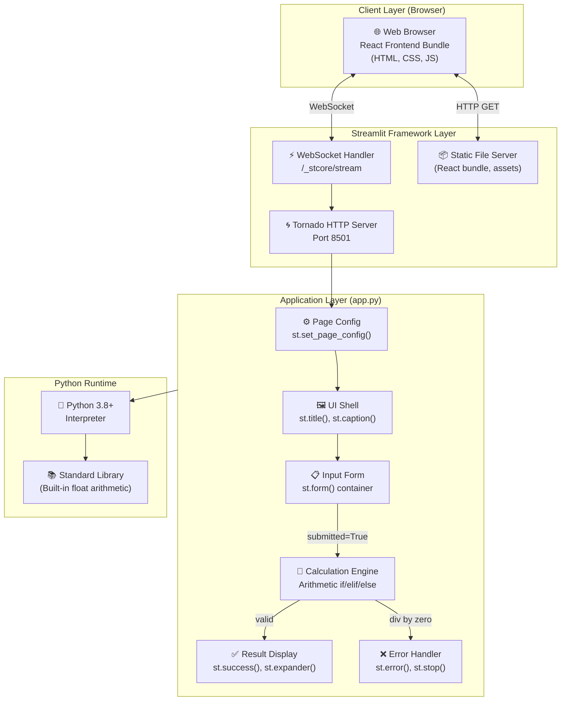
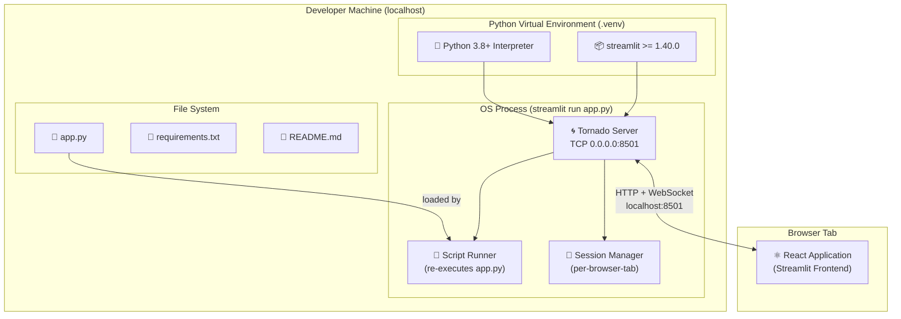
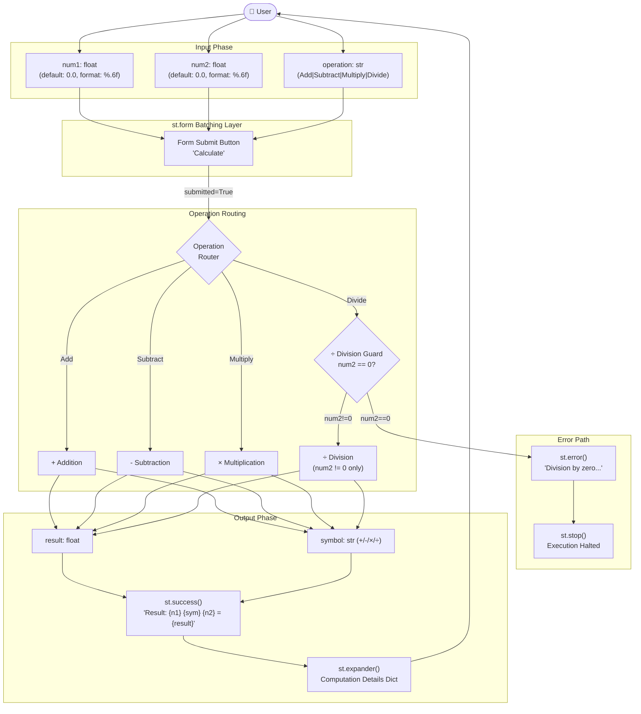
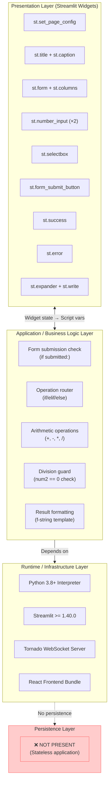

# Architecture Diagrams — Simple Calculator (Streamlit)

**Repository**: xinni-cap/github-copilot-test  
**Generated**: 2025-07-14

---

## 1. High-Level Component Architecture



---

## 2. Deployment Architecture (Local Development)



---

## 3. Data Flow Diagram



---

## 4. Layer Architecture



---

## Key Architectural Insights

### 🔄 Streamlit Re-run Model

The entire `app.py` re-executes **top-to-bottom on every interaction**. The `st.form` widget deliberately **batches** all three inputs so the re-run only triggers on "Calculate" — not on every keystroke.

### 🛡️ Guard Clause Pattern

```python
if num2 == 0:
    st.error("Division by zero is not allowed.")
    st.stop()   # ← halts the re-run; nothing below executes
result = num1 / num2  # Only reached if num2 != 0
```

### 🌐 Transport Layer (Managed by Streamlit)

```
Browser ←── HTTP GET ──────────→ Tornado :8501  [initial page shell]
Browser ←── WebSocket ─────────→ Tornado :8501  [/_stcore/stream]
Browser ←── HTTP GET (static) →  Tornado :8501  [React bundle, CSS, JS]
```

All network code is **fully managed by Streamlit** — the developer writes zero network code.

### ☁️ Cloud-Readiness Checklist

| Feature | Status |
|---|---|
| Stateless (no shared state between sessions) | ✅ Ready |
| Single port (8501) for load balancer | ✅ Ready |
| Built-in health endpoint (`/_stcore/health`) | ✅ Ready |
| Single-file (easy to containerize) | ✅ Ready |
| HTTPS/TLS termination | ❌ Needs reverse proxy |
| Authentication | ❌ Needs implementation |
| Calculation history | ❌ Needs `st.session_state` |
| Dockerfile | ❌ Missing |
