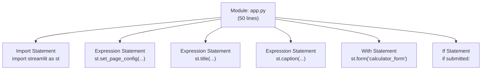
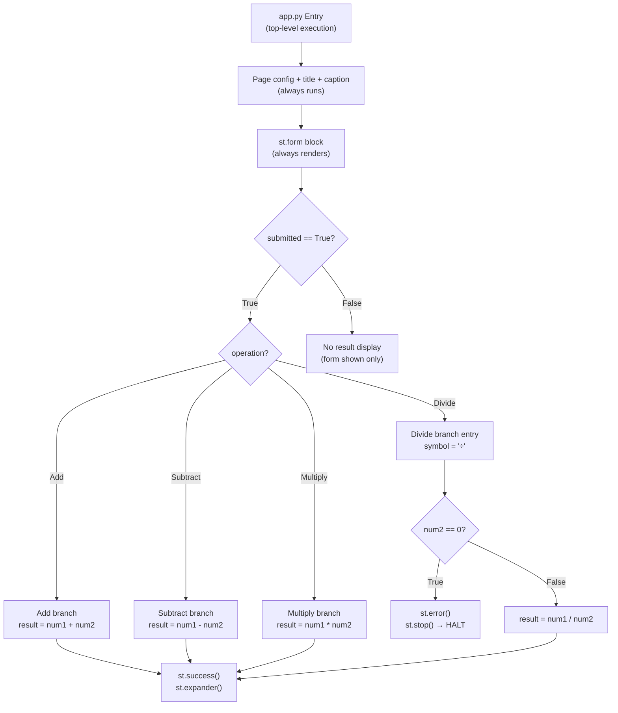
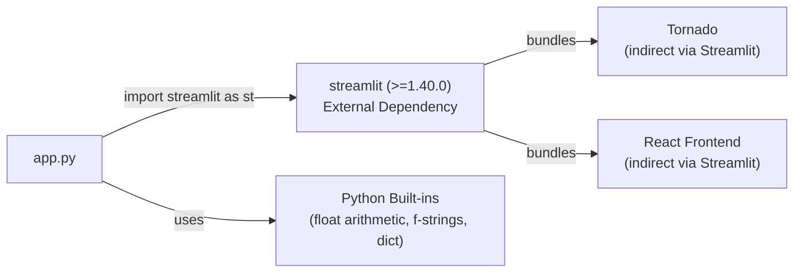

# Abstract Syntax Tree (AST) Analysis — Simple Calculator (Streamlit)

**Repository**: xinni-cap/github-copilot-test  
**Source File**: app.py  
**Language**: Python 3  
**Generated**: 2025-07-14

---

## 1. Module-Level Structure



---

## 2. Import Statements

| Node Type | Module | Alias | Usage Count | Usage Locations |
|---|---|---|---|---|
| `ImportFrom` (alias) | `streamlit` | `st` | 13+ calls | Lines 3, 5, 6, 8, 12, 14, 16, 22, 37, 38, 41, 43, 44 |

**Dependency**: Single external dependency — `streamlit` aliased as `st`.

---

## 3. Function Call Inventory

| Call Expression | Line | Arguments | Return Captured |
|---|---|---|---|
| `st.set_page_config()` | 3 | `page_title="Calculator"`, `page_icon="🧮"`, `layout="centered"` | No |
| `st.title()` | 5 | `"Simple Calculator"` | No |
| `st.caption()` | 6 | `"Perform quick arithmetic..."` | No |
| `st.form()` | 8 | `"calculator_form"` | Context Manager (`with`) |
| `st.columns()` | 9 | `2` | Tuple → `col1, col2` |
| `st.number_input()` | 12 | `"First number"`, `value=0.0`, `format="%.6f"` | `num1: float` |
| `st.number_input()` | 14 | `"Second number"`, `value=0.0`, `format="%.6f"` | `num2: float` |
| `st.selectbox()` | 16-20 | `"Operation"`, `("Add","Subtract","Multiply","Divide")`, `index=0` | `operation: str` |
| `st.form_submit_button()` | 22 | `"Calculate"` | `submitted: bool` |
| `st.error()` | 37 | `"Division by zero is not allowed."` | No |
| `st.stop()` | 38 | _(none)_ | No (halts execution) |
| `st.success()` | 41 | `f"Result: {num1} {symbol} {num2} = {result}"` | No |
| `st.expander()` | 43 | `"Computation details"` | Context Manager (`with`) |
| `st.write()` | 44-49 | `dict` with 4 keys | No |

**Total Streamlit API calls**: 14

---

## 4. Variable Declarations and Assignments

| Variable | Line | Type | Scope | Assignment Source |
|---|---|---|---|---|
| `col1` | 9 | `DeltaGenerator` | Module | `st.columns(2)[0]` (tuple unpack) |
| `col2` | 9 | `DeltaGenerator` | Module | `st.columns(2)[1]` (tuple unpack) |
| `num1` | 12 | `float` | Module | `st.number_input(...)` return value |
| `num2` | 14 | `float` | Module | `st.number_input(...)` return value |
| `operation` | 16 | `str` | Module | `st.selectbox(...)` return value |
| `submitted` | 22 | `bool` | Module | `st.form_submit_button(...)` return value |
| `result` | 26,29,32,39 | `float` | Module (conditional) | Arithmetic expression |
| `symbol` | 27,30,33,35 | `str` | Module (conditional) | String literal |

**Note**: `result` and `symbol` are assigned inside conditional branches — they are only defined if `submitted == True` AND the relevant branch executes. This creates a potential `NameError` if accessed outside the conditional (though this cannot occur in the current code flow due to `st.stop()`).

---

## 5. Control Flow Structures

### 5.1 With Statements (Context Managers)

| Statement | Line | Context Expression | Purpose |
|---|---|---|---|
| `with st.form(...)` | 8 | `st.form("calculator_form")` | Batch all widget inputs |
| `with col1:` | 11 | `col1` (DeltaGenerator) | Render into left column |
| `with col2:` | 13 | `col2` (DeltaGenerator) | Render into right column |
| `with st.expander(...)` | 43 | `st.expander("Computation details")` | Collapsible detail panel |

### 5.2 If/Elif/Else Chain (Operation Router)

```
if submitted:                          # Line 24 — outer guard
    if operation == "Add":             # Line 25 — branch 1
        ...
    elif operation == "Subtract":      # Line 28 — branch 2
        ...
    elif operation == "Multiply":      # Line 31 — branch 3
        ...
    else:                              # Line 34 — branch 4 (Divide)
        if num2 == 0:                  # Line 36 — nested guard
            st.error(...)              # Line 37
            st.stop()                  # Line 38 — execution halt
        result = num1 / num2           # Line 39 — post-guard
```

### 5.3 Control Flow Graph



---

## 6. Expression Analysis

### 6.1 Binary Operations

| Expression | Line | Operator | Left | Right | Result Type |
|---|---|---|---|---|---|
| `num1 + num2` | 26 | `Add` | `float` | `float` | `float` |
| `num1 - num2` | 29 | `Sub` | `float` | `float` | `float` |
| `num1 * num2` | 32 | `Mult` | `float` | `float` | `float` |
| `num1 / num2` | 39 | `Div` | `float` | `float` | `float` |

### 6.2 Comparison Operations

| Expression | Line | Operator | Left | Right |
|---|---|---|---|---|
| `submitted` (truthiness) | 24 | implicit `== True` | `bool` | — |
| `operation == "Add"` | 25 | `Eq` | `str` | `str` |
| `operation == "Subtract"` | 28 | `Eq` | `str` | `str` |
| `operation == "Multiply"` | 31 | `Eq` | `str` | `str` |
| `num2 == 0` | 36 | `Eq` | `float` | `int` |

### 6.3 F-String Expressions

| F-String | Line | Interpolated Variables |
|---|---|---|
| `f"Result: {num1} {symbol} {num2} = {result}"` | 41 | `num1`, `symbol`, `num2`, `result` |

---

## 7. Code Complexity Metrics

| Metric | Value | Assessment |
|---|---|---|
| **Lines of Code** | 50 | Very low — micro-application |
| **Cyclomatic Complexity** | 6 | Low (5 decision points + 1) |
| **Maximum Nesting Depth** | 4 | `with form → with col → if submitted → if operation == Divide → if num2 == 0` |
| **Number of Functions** | 0 | No function definitions |
| **Number of Classes** | 0 | No class definitions |
| **Number of Variables** | 8 | col1, col2, num1, num2, operation, submitted, result, symbol |
| **Number of Imports** | 1 | `streamlit` only |
| **Number of API Calls** | 14 | All Streamlit `st.*` calls |
| **Conditional Branches** | 6 | 5 if/elif/else + 1 nested if |
| **String Literals** | 14 | Labels, messages, option values |
| **Docstrings** | 0 | No documentation strings |
| **Comments** | 0 | No inline comments |
| **Type Annotations** | 0 | No type hints |

---

## 8. Dependency Graph



---

## 9. AST Summary

The `app.py` module consists of a flat, procedural script with:
- **1 import** statement (streamlit as st)
- **4 top-level expression statements** (page config, title, caption)
- **1 with statement** (st.form context manager)
- **1 if statement** (form submission guard) containing:
  - **1 if/elif/elif/else chain** (operation routing, 4 branches)
  - **1 nested if** (division-by-zero guard)
  - **1 nested with** (st.expander)

The code follows a **linear execution model** — no recursion, no loops, no generators, no async/await. Control flow complexity is low (cyclomatic complexity = 6). The entire application logic is expressed in a single script scope with no function or class definitions.
