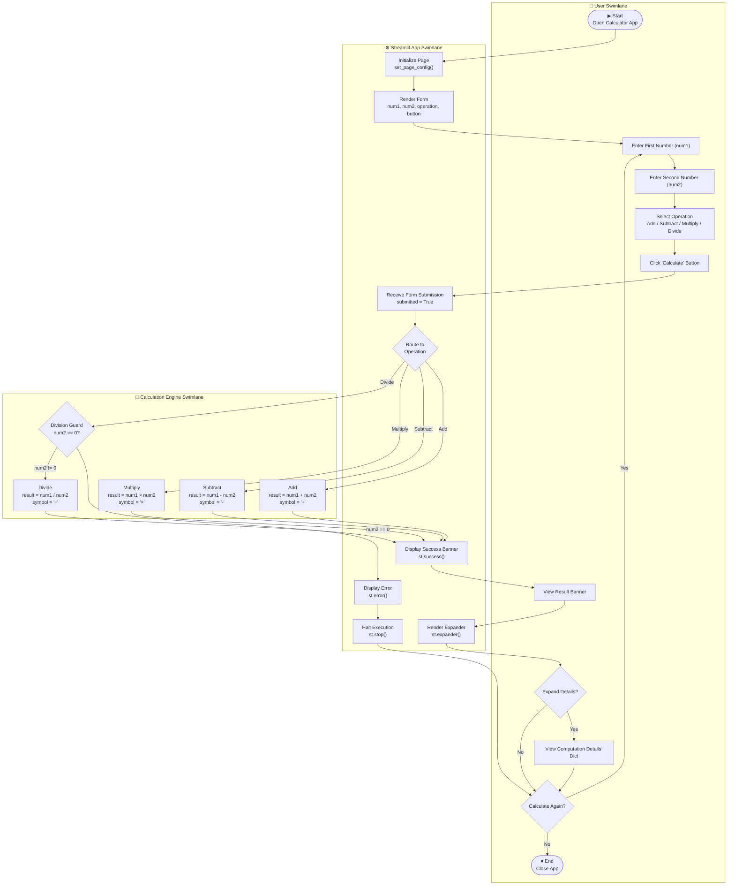
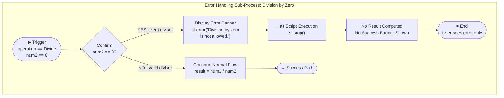

# BPMN 2.0 Process Model — Simple Calculator (Streamlit)

**Repository**: xinni-cap/github-copilot-test  
**Generated**: 2025-07-14  
**Standard**: BPMN 2.0 (Business Process Model and Notation)

---

## Overview

This document describes the business processes of the Simple Calculator application using BPMN 2.0 notation, rendered as Mermaid flowcharts.

### Process Participants (Swimlanes)
- **User** — the human actor interacting with the browser
- **Streamlit App** — the Python/Streamlit server executing app.py
- **Calculation Engine** — the arithmetic computation logic within app.py

---

## 1. Main Calculation Process

---

## 2. Error Handling Sub-Process

---

## 3. BPMN Element Legend

| BPMN Element | Mermaid Representation | Usage in Calculator |
|---|---|---|
| **Start Event** | Rounded rectangle with ▶ | App open, trigger event |
| **End Event** | Rounded rectangle with ⏹ | App close, execution halt |
| **Task** | Rectangle | Enter input, click button, display result |
| **Exclusive Gateway (XOR)** | Diamond `{}` with conditions | Operation routing, error check, user decisions |
| **Sequence Flow** | Arrow `-->` | Process transitions |
| **Swimlane** | `subgraph` block | User, App, Engine participants |
| **Sub-Process** | Separate `subgraph` | Error handling sub-process |

---

## 4. Process Metrics

| Metric | Value |
|---|---|
| **Number of Tasks** | 14 |
| **Number of Gateways** | 5 |
| **Number of Swimlanes** | 3 (User, App, Engine) |
| **Happy Paths** | 4 (one per operation) |
| **Error Paths** | 1 (division by zero) |
| **Cyclomatic Complexity** | 6 (5 branches + 1) |
| **Process Participants** | 2 (Human: User; System: Calculator) |

---

## 5. Process Description

### Happy Path (Any Valid Calculation)
1. User opens the application in a browser
2. Streamlit initializes and renders the calculator form
3. User enters `num1`, `num2`, selects an operation, clicks "Calculate"
4. Streamlit receives the form submission (`submitted = True`)
5. The operation router determines the arithmetic path
6. The calculation engine computes the result
7. Streamlit displays a green success banner with the formatted result
8. User optionally expands "Computation details" to view the detail dict
9. User either starts another calculation or closes the app

### Error Path (Division by Zero)
1. Steps 1-5 same as above, with `operation = "Divide"`
2. Division Guard checks: `num2 == 0` → **TRUE**
3. `st.error("Division by zero is not allowed.")` displays red error banner
4. `st.stop()` halts all script execution immediately
5. No result is computed, no success banner is shown
6. User must modify `num2` to a non-zero value and resubmit
