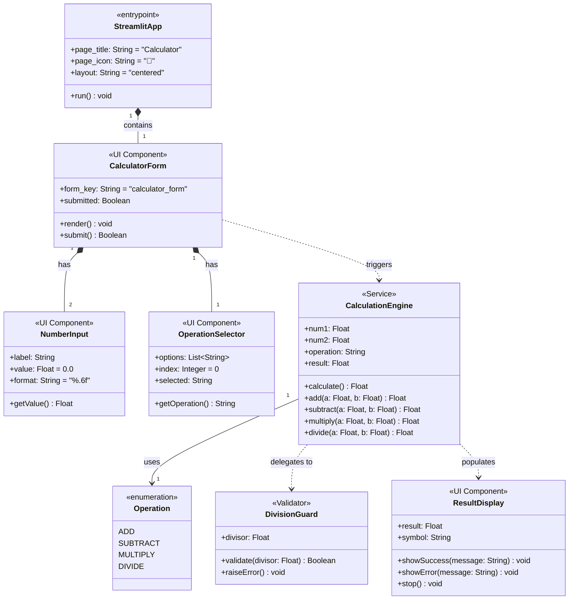
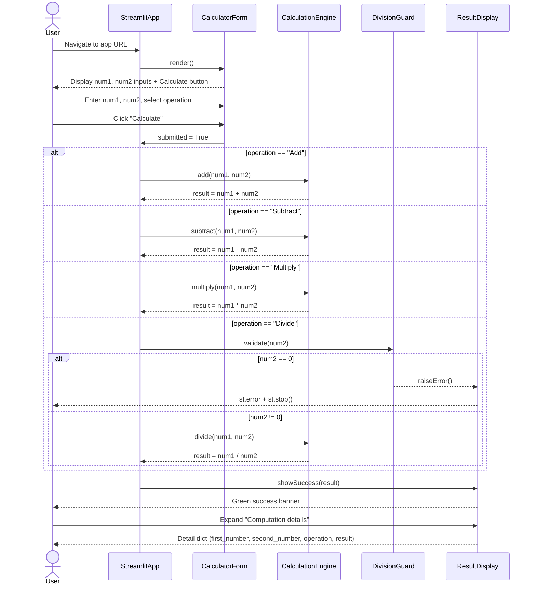
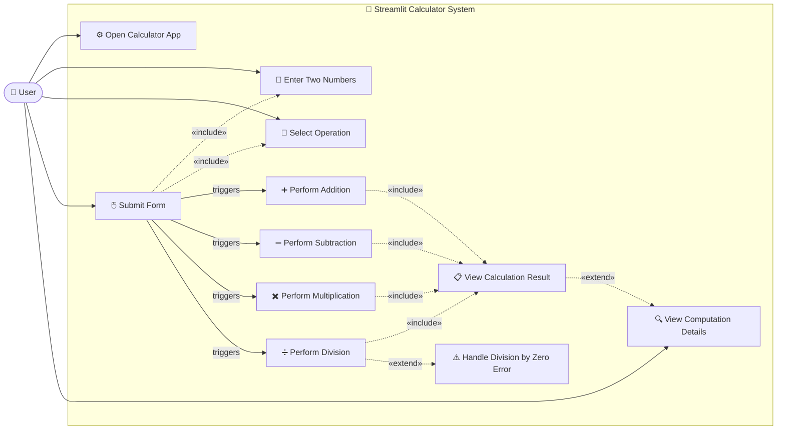
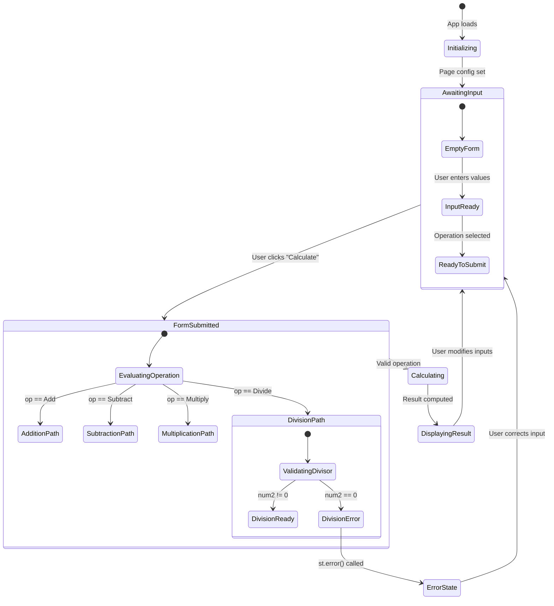
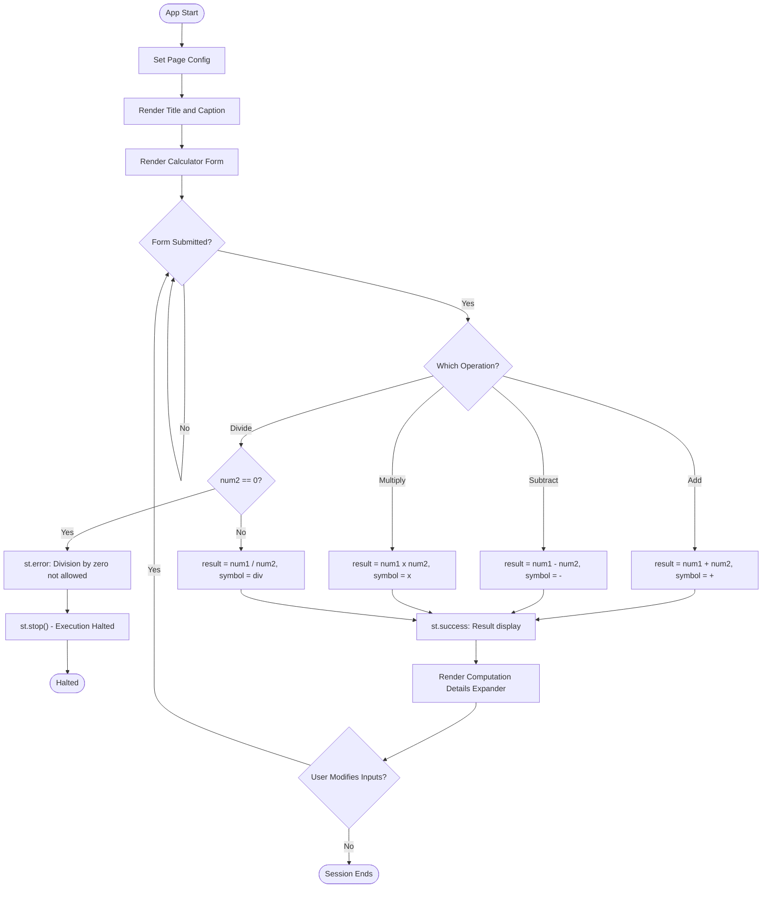

# UML Diagrams — Simple Calculator (Streamlit)

**Repository**: xinni-cap/github-copilot-test  
**Generated**: 2025-07-14

---

## 1. Class Diagram

---

## 2. Sequence Diagram

---

## 3. Use Case Diagram

---

## 4. State Diagram

---

## 5. Activity Diagram

