# Architecture Documentation (Arc42)

**Project**: Streamlit Calculator App  
**Version**: 1.0.0  
**Date**: 2025-07-14  
**Generated by**: Arc42 Documentation Generator  
**Source Repository**: `xinni-cap/github-copilot-test`

---

## Table of Contents

1. [Introduction and Goals](#1-introduction-and-goals)
2. [Architecture Constraints](#2-architecture-constraints)
3. [System Scope and Context](#3-system-scope-and-context)
4. [Solution Strategy](#4-solution-strategy)
5. [Building Block View](#5-building-block-view)
6. [Runtime View](#6-runtime-view)
7. [Deployment View](#7-deployment-view)
8. [Crosscutting Concepts](#8-crosscutting-concepts)
9. [Architecture Decisions](#9-architecture-decisions)
10. [Quality Requirements](#10-quality-requirements)
11. [Risks and Technical Debt](#11-risks-and-technical-debt)
12. [Glossary](#12-glossary)

---

## 1. Introduction and Goals

### 1.1 Purpose

The **Streamlit Calculator App** is a lightweight, browser-based arithmetic calculator built with Python and Streamlit. It provides an interactive web UI enabling users to perform the four fundamental arithmetic operations — addition, subtraction, multiplication, and division — without requiring any installation beyond a standard Python environment.

The application is intentionally minimal: a single-file Python script (`app.py`, ~50 lines) that leverages Streamlit's reactive rendering model to deliver an instantly usable tool suitable for educational demonstrations, prototyping showcases, and day-to-day quick calculations.

### 1.2 Business Goals

| ID  | Goal | Priority |
|-----|------|----------|
| G-1 | Provide an intuitive, zero-learning-curve arithmetic calculator accessible from any web browser | High |
| G-2 | Demonstrate Streamlit as a rapid Python web-app development framework | High |
| G-3 | Ensure mathematically correct results, including safe handling of division-by-zero | High |
| G-4 | Serve as a clean reference implementation for Streamlit form-based applications | Medium |

### 1.3 Quality Goals

The top quality goals, in priority order:

| Priority | Quality Goal | Motivation |
|----------|-------------|------------|
| 1 | **Correctness** | Arithmetic results must be mathematically accurate; division-by-zero must be caught and reported gracefully |
| 2 | **Usability** | The UI must require no instructions; a first-time user can complete a calculation without guidance |
| 3 | **Simplicity** | The codebase must remain maintainable as a single, self-contained Python file |
| 4 | **Portability** | The app must run on any OS (Linux, macOS, Windows) with Python ≥ 3.8 and Streamlit installed |
| 5 | **Performance** | Response to a form submission must feel instantaneous (< 500 ms on a local machine) |

### 1.4 Stakeholders

| Stakeholder | Role | Expectations |
|-------------|------|--------------|
| **End User** | Performs arithmetic calculations via browser | Accurate results, clean UI, clear error messages |
| **Developer / Maintainer** | Extends or adapts the application | Readable single-file code; minimal dependencies |
| **Educator / Trainer** | Uses app as a Streamlit teaching example | Well-structured code demonstrating idiomatic Streamlit patterns |
| **DevOps / Operator** | Deploys the app locally or on a cloud platform | Simple one-command startup; no database or secret management required |

---

## 2. Architecture Constraints

### 2.1 Technical Constraints

| ID | Constraint | Rationale |
|----|------------|-----------|
| TC-1 | **Python runtime required** — Python ≥ 3.8 | Streamlit ≥ 1.40.0 requires Python 3.8+; f-string syntax used throughout `app.py` |
| TC-2 | **Streamlit ≥ 1.40.0** is the sole external dependency | Declared in `requirements.txt`; no other libraries are installed |
| TC-3 | **Single-file implementation** (`app.py`) | No package structure, no sub-modules; all logic lives in one file |
| TC-4 | **No persistent storage** | The application performs no database writes, file system writes, or session history |
| TC-5 | **Stateless between page reloads** | Streamlit re-executes the entire script on each user interaction; no `st.session_state` is used |
| TC-6 | **Browser-based UI only** — no REST API or CLI interface | Interaction exclusively through Streamlit's web renderer |
| TC-7 | **Floating-point arithmetic** — Python native `float` (`%.6f` display precision) | Results are subject to IEEE 754 double-precision floating-point behaviour |

### 2.2 Organisational Constraints

| ID | Constraint | Rationale |
|----|------------|-----------|
| OC-1 | **Open-source, public repository** on GitHub | Codebase must remain free of secrets or proprietary data |
| OC-2 | **No authentication or authorisation** | Application is intended for unrestricted public access |
| OC-3 | **No CI/CD pipeline currently defined** | Deployments are manual (`streamlit run app.py`) |

### 2.3 Conventions

| ID | Convention |
|----|------------|
| CV-1 | Streamlit API naming conventions and layout idioms (forms, columns, expanders) |
| CV-2 | PEP 8 Python style conventions |
| CV-3 | Arc42 template for architecture documentation |
| CV-4 | Semantic versioning (`MAJOR.MINOR.PATCH`) for future releases |

---

## 3. System Scope and Context

### 3.1 Business Context

The Calculator App sits at the boundary between a **human user** and the **Python/Streamlit runtime**. There are no external systems, APIs, databases, or message queues involved. The sole external channel is the browser-rendered web interface.

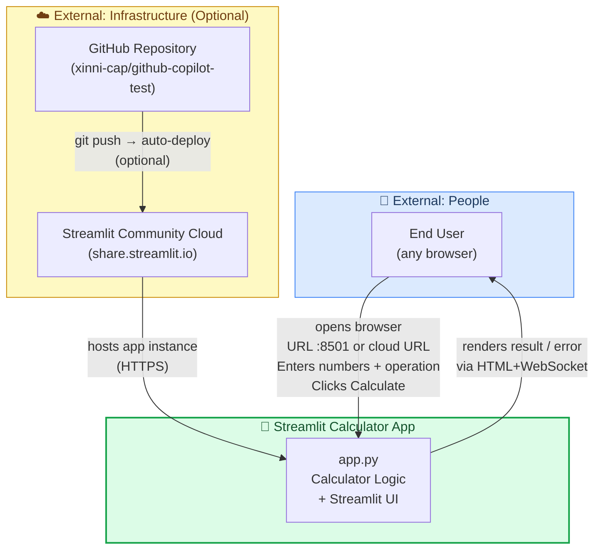

**External interfaces summary:**

| Interface | Counterpart | Protocol | Direction | Purpose |
|-----------|------------|----------|-----------|---------|
| Web UI | User's browser | HTTP + WebSocket | Bidirectional | Render form, receive input, display result |
| Source code hosting | GitHub | HTTPS/SSH | Bidirectional | Version control |
| Cloud deployment | Streamlit Community Cloud | Streamlit deploy webhook | Output (optional) | Public hosting |

### 3.2 Technical Context

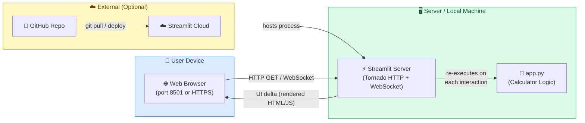

---

## 4. Solution Strategy

### 4.1 Technology Decisions

| Decision | Choice | Rationale |
|----------|--------|-----------|
| **UI Framework** | Streamlit ≥ 1.40.0 | Zero-boilerplate Python web apps; reactive model eliminates manual event wiring; ideal for data/utility tools |
| **Language** | Python 3.x | Universal ecosystem; native float arithmetic; wide developer familiarity |
| **Architecture style** | Single-file monolith | Scope is trivial; no need for MVC split, packages, or microservices |
| **State management** | Stateless / full re-execute on submit | Streamlit's top-down execution model fits the one-shot calculation use case perfectly |
| **Persistence** | None | Calculation history or user accounts are out of scope |
| **Deployment** | Local (`streamlit run`) or Streamlit Cloud | No containerisation required for development; Cloud provides zero-config public sharing |

### 4.2 Top-Level Decomposition

The solution is decomposed into three logical layers **within the single `app.py` file**:

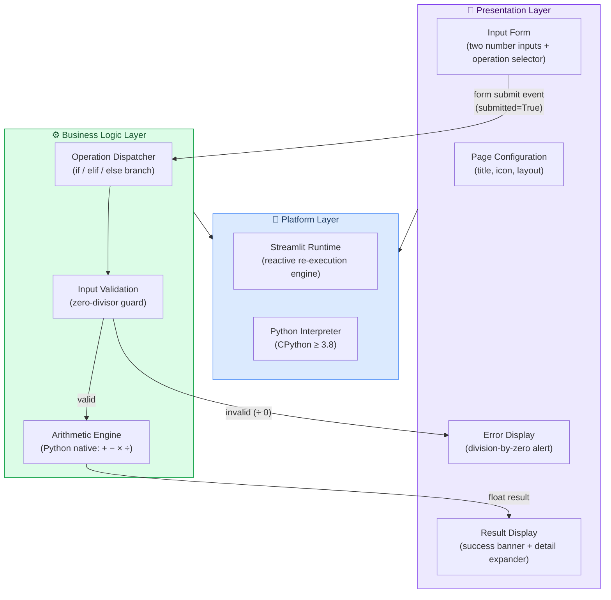

### 4.3 Approach to Quality Goals

| Quality Goal | Implementation Approach |
|-------------|------------------------|
| **Correctness** | Python's built-in float operators; explicit `num2 == 0` guard before any division; `st.stop()` halts the render pipeline on error |
| **Usability** | `st.form` batches all inputs so the page does not re-render mid-typing; two-column layout; `%.6f` formatting for numeric clarity |
| **Simplicity** | No OOP, no classes, no external services; linear ~50-line script execution |
| **Portability** | One `pip install` command via `requirements.txt`; cross-platform Python |
| **Performance** | All computation is O(1) arithmetic; no I/O or network calls during the calculation itself |

---

## 5. Building Block View

### 5.1 Level 1 — System as a Black Box

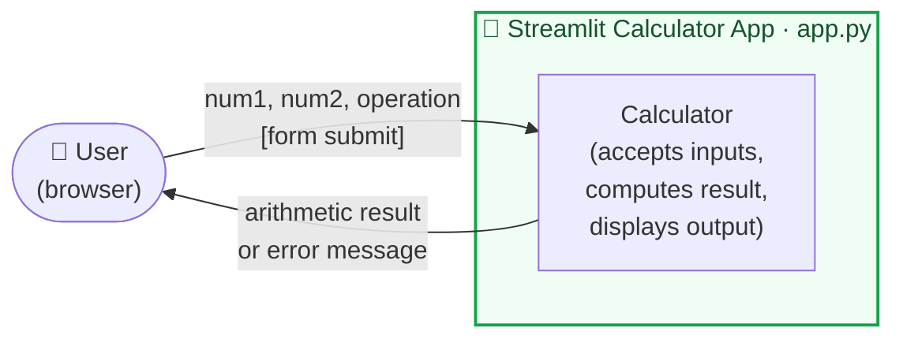

**Responsibilities of `app.py`:**
- Configure and render the Streamlit web page
- Accept two floating-point numbers and an arithmetic operation from the user via a batched form
- Validate input (division-by-zero guard)
- Compute and display the arithmetic result
- Display raw computation details on demand via an expander

### 5.2 Level 2 — Internal Block Decomposition

`app.py` contains four sequential functional blocks executed on every Streamlit script run:

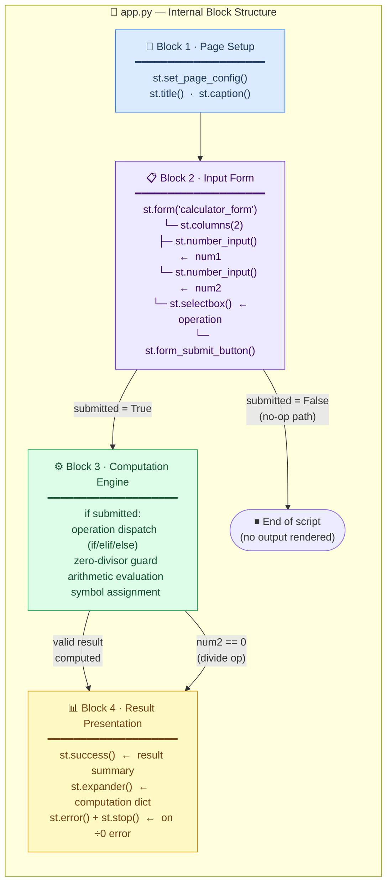

### 5.3 Level 3 — Computation Engine Detail

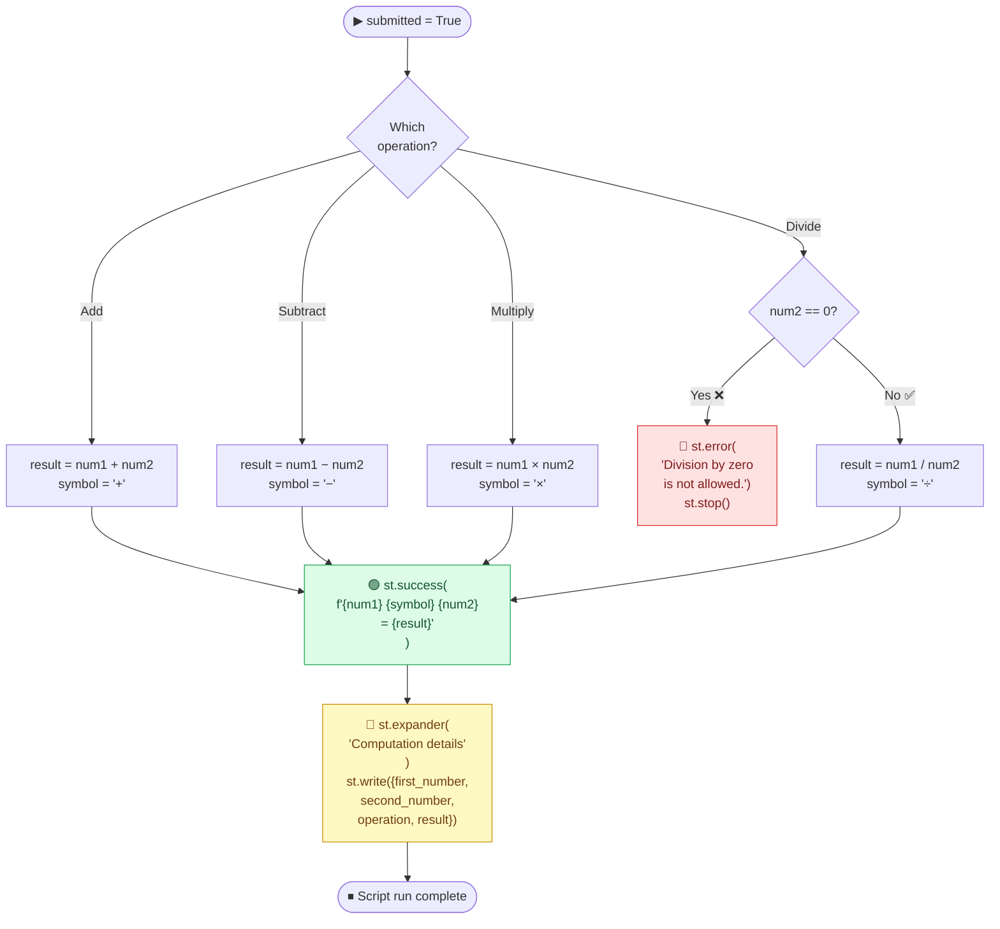

### 5.4 Component Summary Table

| Component | Lines in `app.py` | Responsibility | Key APIs Used |
|-----------|------------------|----------------|---------------|
| **Page Setup** | 1–6 | Configure browser tab metadata; render title and subtitle | `st.set_page_config`, `st.title`, `st.caption` |
| **Input Form** | 8–22 | Collect `num1`, `num2`, `operation` atomically; prevent partial re-renders | `st.form`, `st.columns`, `st.number_input`, `st.selectbox`, `st.form_submit_button` |
| **Computation Engine** | 24–39 | Dispatch to correct arithmetic operation; validate divisor | Python `if/elif/else`, native float operators (`+`, `-`, `*`, `/`) |
| **Result Presentation** | 41–49 | Render success result or error message; expose raw computation dict | `st.success`, `st.error`, `st.stop`, `st.expander`, `st.write` |

---

## 6. Runtime View

### 6.1 Scenario 1 — Successful Arithmetic Calculation (Happy Path)

A user performs a valid multiplication: `6.0 × 7.0 = 42.0`.

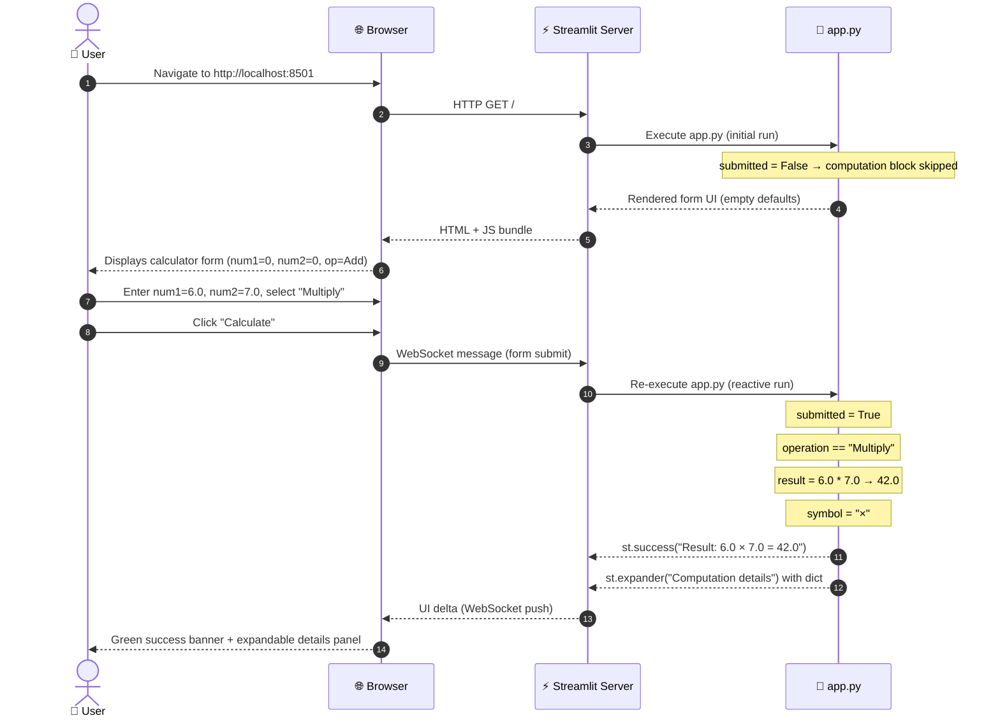

### 6.2 Scenario 2 — Division by Zero (Error Path)

```mermaid
sequenceDiagram
    autonumber
    actor User as 👤 User
    participant Browser as 🌐 Browser
    participant Streamlit as ⚡ Streamlit Server
    participant Script as 📄 app.py

    User->>Browser: Enter num1=5.0, num2=0.0, select "Divide"
    User->>Browser: Click "Calculate"
    Browser->>Streamlit: WebSocket message (form submit)
    Streamlit->>Script: Re-execute app.py
    Note over Script: submitted = True
    Note over Script: operation == "Divide"
    Note over Script: num2 == 0 → TRUE ❌
    Script-->>Streamlit: st.error("Division by zero is not allowed.")
    Script-->>Streamlit: st.stop() — halts further rendering
    Streamlit-->>Browser: Error banner UI delta (no result section)
    Browser-->>User: Red error message; expander NOT rendered
```

### 6.3 Scenario 3 — Initial Page Load (No Interaction)

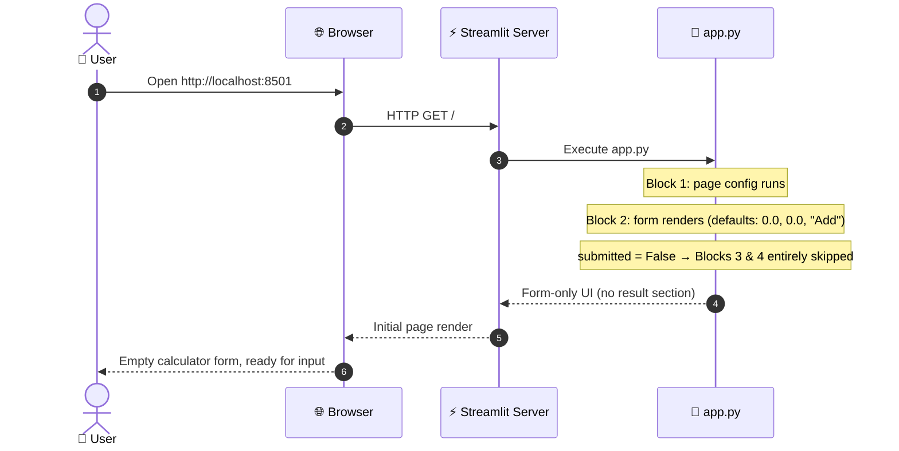

### 6.4 Application State Transition Diagram

Streamlit's reactive model means the full script is re-executed on every interaction. The effective application states are:

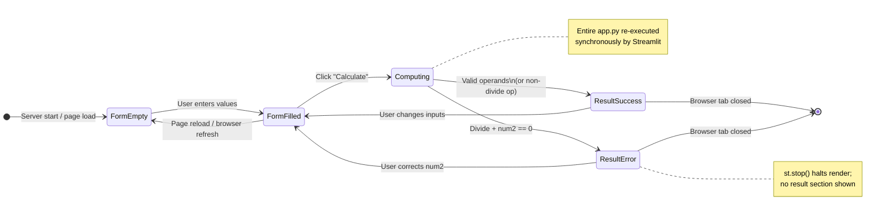

---

## 7. Deployment View

### 7.1 Deployment Topology — Local Development

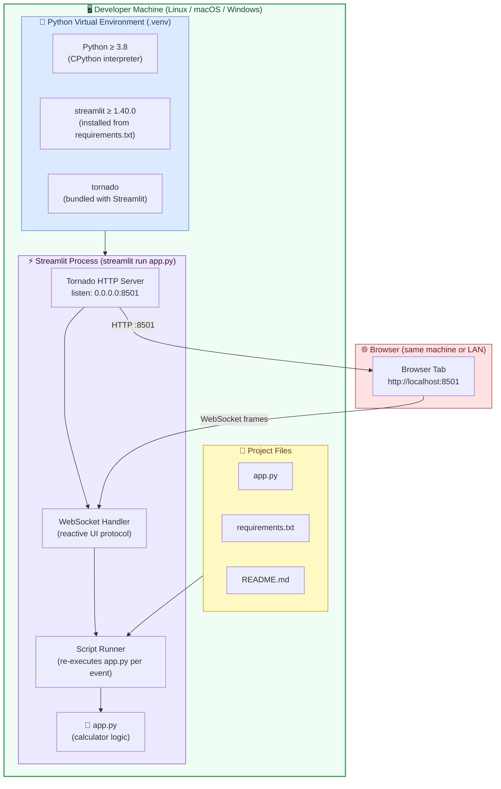

### 7.2 Deployment Topology — Streamlit Community Cloud (Optional)

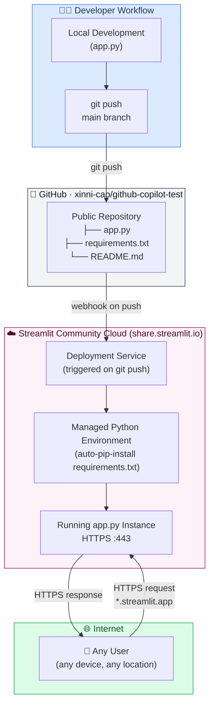

### 7.3 Deployment Steps

| Step | Local Deployment | Streamlit Cloud Deployment |
|------|-----------------|---------------------------|
| 1 | `git clone https://github.com/xinni-cap/github-copilot-test` | Connect GitHub repo in **share.streamlit.io** |
| 2 | `python -m venv .venv && source .venv/bin/activate` | _(automatic — managed environment)_ |
| 3 | `pip install -r requirements.txt` | _(automatic — reads `requirements.txt`)_ |
| 4 | `streamlit run app.py` | Click **Deploy** |
| 5 | Open `http://localhost:8501` in browser | Open generated `https://<name>.streamlit.app` URL |

### 7.4 Infrastructure Requirements

| Requirement | Minimum Value | Notes |
|-------------|--------------|-------|
| **Python version** | 3.8 | Required by Streamlit 1.40.0 |
| **RAM** | ~150 MB | Streamlit process baseline |
| **CPU** | Any single core | All computation is O(1) |
| **Disk** | ~50 MB | Python + Streamlit package install |
| **Network port** | 8501 TCP (inbound) | Default; configurable via `--server.port` |
| **Persistent storage** | None | No DB, no file writes |
| **Operating system** | Linux / macOS / Windows | Cross-platform Python |
| **HTTPS** | Optional (local) / Automatic (Cloud) | Streamlit Cloud provides HTTPS automatically |

---

## 8. Crosscutting Concepts

### 8.1 Input Validation and Error Handling

The application applies a single, targeted validation rule: **division-by-zero prevention**.

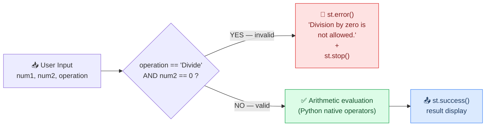

**Error-handling strategy by concern:**

| Concern | Approach | Streamlit API |
|---------|----------|---------------|
| Division by zero | Explicit pre-check (`if num2 == 0`) before the `/` operator; user-friendly message | `st.error()`, `st.stop()` |
| Invalid number format | Delegated entirely to the `st.number_input` widget (rejects non-numeric keys at the UI layer) | `st.number_input` |
| Overflow / Underflow | Not explicitly guarded — Python `float` handles `inf` / `-inf` / `nan` transparently | Python IEEE 754 semantics |

### 8.2 State Management

Streamlit uses a **stateless re-execution model**: the full Python script is re-run top-to-bottom on every user interaction. Implications for this application:

- There is **no `st.session_state`** usage — previous results are not retained
- The `submitted` boolean is an ephemeral flag valid only for the current script run
- This model is intentional and appropriate for a one-shot arithmetic calculator

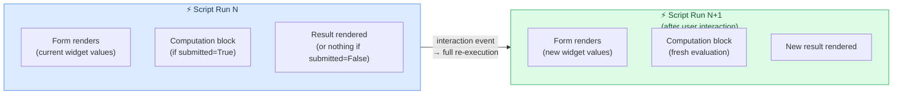

### 8.3 User Interface Patterns

| Pattern | Implementation | Benefit |
|---------|---------------|---------|
| **Form submission batch** | `st.form("calculator_form")` wraps all inputs | Prevents partial re-renders on each keystroke; all inputs submitted atomically |
| **Two-column layout** | `st.columns(2)` for number inputs | Visually groups `num1` and `num2` side-by-side |
| **Progressive disclosure** | `st.expander("Computation details")` | Keeps the primary UI clean; raw dict available on demand |
| **Inline colour-coded feedback** | `st.success()` (green) / `st.error()` (red) | Immediate, context-aware feedback without page navigation |
| **Sensible defaults** | Both number inputs default to `0.0`; operation defaults to `"Add"` | Reduces first-use friction; safe defaults |

### 8.4 Numeric Precision

- All arithmetic uses Python's native `float` type: **IEEE 754 double-precision (64-bit)**
- Inputs are displayed and accepted with `format="%.6f"` (6 decimal places)
- No rounding or precision management is applied to intermediate or final results
- Consumers should be aware of standard floating-point representation artefacts (e.g. `0.1 + 0.2 ≠ 0.3` exactly in binary representation)

### 8.5 Security Considerations

| Concern | Status | Notes |
|---------|--------|-------|
| Input injection / code execution | ✅ Not applicable | `st.number_input` only accepts numeric values; `eval()` is never used |
| Authentication / authorisation | ⚠️ None | App is publicly accessible; acceptable for a public utility tool |
| Transport security (HTTPS) | ⚠️ HTTP on local | Streamlit Cloud provides HTTPS automatically for cloud deployments |
| Secrets / credentials in code | ✅ None present | No API keys, passwords, or tokens anywhere in the codebase |
| Dependency vulnerabilities | ✅ Minimal surface | Single dependency (`streamlit`); should be kept up-to-date |

---

## 9. Architecture Decisions

### ADR-001 — Use Streamlit as the UI Framework

| Field | Value |
|-------|-------|
| **Status** | ✅ Accepted |
| **Date** | Project inception |
| **Deciders** | Project author |

**Context:** A simple arithmetic calculator requires a web UI with minimal development overhead. Alternatives considered: raw HTML/Flask, Tkinter desktop GUI, Jupyter ipywidgets, Streamlit.

**Decision:** Use **Streamlit ≥ 1.40.0** as the sole UI framework.

**Rationale:**
- Streamlit enables a complete, interactive web UI in ~50 lines of pure Python — no HTML, CSS, or JavaScript
- Built-in reactive rendering eliminates manual event/callback wiring
- `st.form` provides exactly the batch-submit pattern ideal for a calculator
- Trivial zero-config deployment via Streamlit Community Cloud

**Consequences:**
- ✅ Extremely low code volume and cognitive complexity
- ✅ No frontend expertise required
- ⚠️ Streamlit's reactive re-execution model can surprise developers accustomed to stateful frameworks
- ⚠️ Limited deep UI customisation compared to a full frontend framework

---

### ADR-002 — Single-File Monolithic Architecture

| Field | Value |
|-------|-------|
| **Status** | ✅ Accepted |
| **Date** | Project inception |
| **Deciders** | Project author |

**Context:** The application has exactly four arithmetic operations with no shared state, no persistence, and no external integrations.

**Decision:** Implement all logic in a **single file**: `app.py`.

**Rationale:**
- Total code is ~50 lines; splitting into packages would add unnecessary structural overhead
- Streamlit's natural unit of deployment is a single Python script
- Single-file structure is idiomatic for Streamlit demos and educational examples

**Consequences:**
- ✅ Maximum simplicity; zero navigation overhead for developers
- ✅ `streamlit run app.py` is the only command needed end-to-end
- ⚠️ Scaling to more operations or features will require refactoring into a proper module structure
- ⚠️ No enforced separation of concerns between UI and business logic

---

### ADR-003 — No Persistent State or Calculation History

| Field | Value |
|-------|-------|
| **Status** | ✅ Accepted |
| **Date** | Project inception |
| **Deciders** | Project author |

**Context:** Decision on whether to store past calculations (in memory via `st.session_state`, a file, or a database).

**Decision:** **No state persistence.** Each calculation is independent and ephemeral.

**Rationale:**
- Adding a history store requires `st.session_state`, a database, or file I/O — all disproportionate to the app's scope
- A calculator's primary value is the immediate current result, not a log of past results

**Consequences:**
- ✅ Zero infrastructure requirements (no DB, no file permissions, no secrets)
- ✅ No privacy implications — no user data is retained
- ⚠️ Users cannot review past calculations without re-entering values

---

### ADR-004 — Use Python Native Float Arithmetic

| Field | Value |
|-------|-------|
| **Status** | ✅ Accepted |
| **Date** | Project inception |
| **Deciders** | Project author |

**Context:** Python offers `float` (IEEE 754), `decimal.Decimal` (arbitrary precision), and `fractions.Fraction` (exact rational arithmetic).

**Decision:** Use **Python native `float`** with operators `+`, `-`, `*`, `/`.

**Rationale:**
- `float` is sufficient for a general-purpose arithmetic utility tool
- `decimal.Decimal` is appropriate for financial computations (out of scope)
- Native operators require zero additional imports and are maximally readable

**Consequences:**
- ✅ Zero additional imports; most readable possible code
- ⚠️ Subject to IEEE 754 floating-point representation edge cases (e.g. `0.1 + 0.2`)
- ⚠️ Not suitable for high-precision financial or scientific computations without modification

---

## 10. Quality Requirements

### 10.1 Quality Tree

```mermaid
mindmap
    root(("🏆 Quality\nGoals"))
        Correctness
            Accurate arithmetic\nfor all four operations
            Division-by-zero\nsafely rejected
            IEEE 754 float\ncompliance
        Usability
            Zero-learning-curve UI
            Sensible input defaults\n(0.0 / Add)
            Colour-coded\nfeedback banners
            Progressive disclosure\nof computation details
        Simplicity
            Single-file\nimplementation
            1 external dependency\n(streamlit only)
            ~50 lines of code
            No build step required
        Portability
            Cross-platform Python\n(Linux/macOS/Windows)
            One-command startup
            Cloud-deployable\n(Streamlit Community Cloud)
        Performance
            Sub-500ms response\non local machine
            O(1) computation\n(no I/O latency)
            No blocking calls
```

### 10.2 Quality Scenarios

| ID | Quality Attribute | Scenario | Expected Response | Status |
|----|-------------------|----------|-------------------|--------|
| QS-1 | **Correctness** | Enter `6.0`, `7.0`, select Multiply, click Calculate | Display `6.0 × 7.0 = 42.0` | ✅ Met |
| QS-2 | **Correctness** | Enter any `num1`, `0.0` for `num2`, select Divide, submit | Red error banner; no result; no crash | ✅ Met |
| QS-3 | **Usability** | First-time user opens the app with no documentation | Can complete a calculation within 30 seconds | ✅ Met (intuitive two-column form) |
| QS-4 | **Usability** | User changes `num1` while still typing — no premature recalculation | Form waits for the explicit submit click | ✅ Met (via `st.form`) |
| QS-5 | **Performance** | User clicks Calculate on a local machine | Result rendered in < 500 ms | ✅ Met (O(1) compute, no I/O) |
| QS-6 | **Portability** | Developer clones repo on Windows / macOS / Linux | `pip install -r requirements.txt && streamlit run app.py` works identically | ✅ Met |
| QS-7 | **Simplicity** | New developer opens `app.py` for the first time | Full understanding of all functionality within 5 minutes | ✅ Met (~50 lines, no abstractions) |
| QS-8 | **Correctness** | User enters very large values (e.g. `1e308 * 1e308`) | Python returns `inf`; app displays it without crashing | ⚠️ Partial (no explicit `inf` guard or friendly message) |

### 10.3 Code Metrics

| Metric | Value | Assessment |
|--------|-------|------------|
| Total lines of code | ~50 | ✅ Excellent — minimal footprint |
| External runtime dependencies | 1 (`streamlit ≥ 1.40.0`) | ✅ Excellent — minimal supply-chain risk |
| Cyclomatic complexity | 5 (4 operation branches + 1 zero-divisor guard) | ✅ Low — straightforward to test |
| Functions defined | 0 | ℹ️ Appropriate for scope; procedural style |
| Classes defined | 0 | ℹ️ Appropriate for scope |
| Automated test coverage | 0% | ❌ No tests exist — highest priority debt |
| Known security vulnerabilities | 0 | ✅ No `eval()`, no injection surface, no credentials |

---

## 11. Risks and Technical Debt

### 11.1 Risk Register

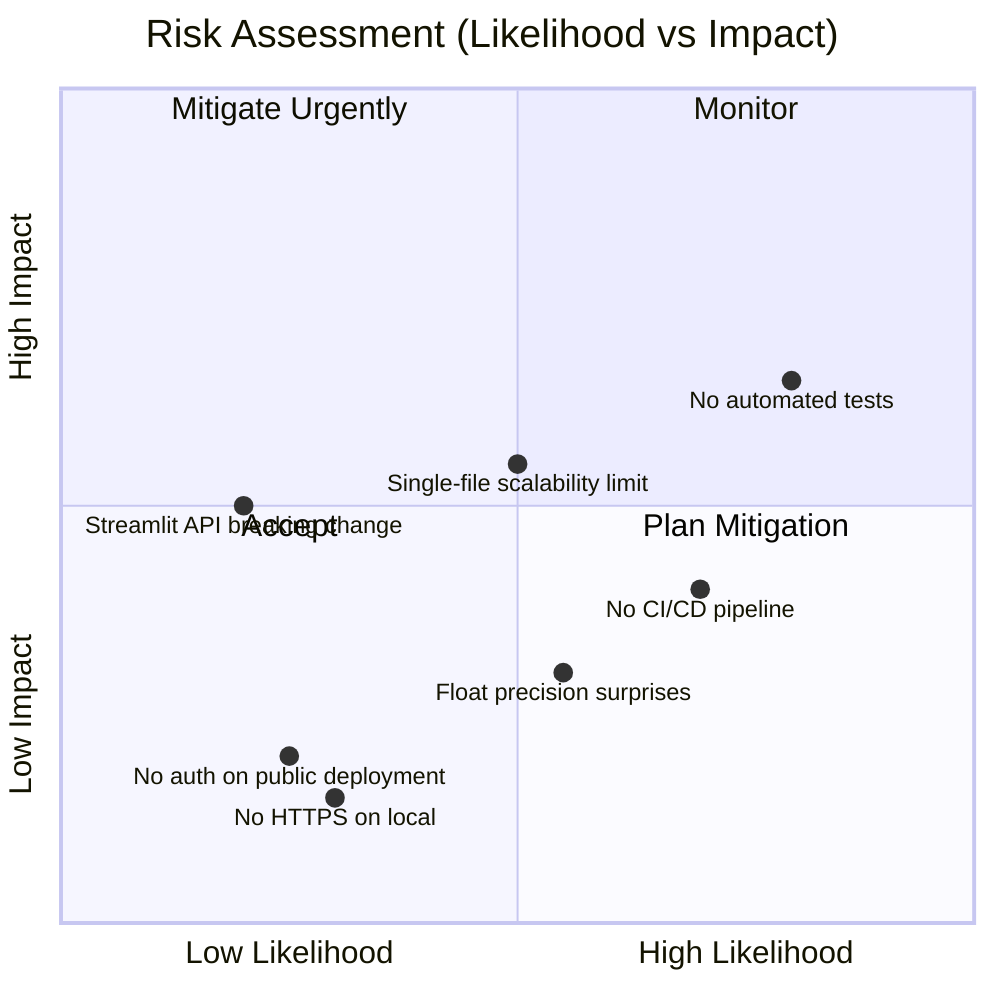

### 11.2 Identified Risks

| ID | Risk | Likelihood | Impact | Mitigation Strategy |
|----|------|-----------|--------|---------------------|
| R-1 | **No automated tests** — arithmetic logic and edge cases (inf, -inf, very small floats) are completely untested | High | Medium | Add `pytest` unit tests for all four operations and the division-by-zero guard; target 100% branch coverage |
| R-2 | **No CI/CD pipeline** — regression can be introduced undetected on any push | Medium–High | Medium | Add a GitHub Actions workflow: `ruff` lint + `pytest` on every push/PR |
| R-3 | **Single-file architecture limits extensibility** — adding history, themes, more operations, or i18n will lead to tangled code | Medium | Medium | Refactor to a `src/` layout with separate `calculator/logic.py` if scope grows beyond ~100 lines |
| R-4 | **Floating-point precision artefacts** — results like `0.1 + 0.2 = 0.30000000000000004` may confuse users | Medium | Low | Add a small disclaimer in the UI, or offer a `decimal.Decimal` precision mode |
| R-5 | **No `inf`/`nan` output handling** — multiplying two very large floats silently returns `inf` in the success banner | Medium | Low | Add post-computation check for `math.isinf` and `math.isnan`; surface a user-friendly message |
| R-6 | **Streamlit API breaking changes** — Streamlit releases can deprecate widget APIs (e.g. `st.form` semantics) | Low | Medium | Pin an exact version (`streamlit==1.40.0`) in `requirements.txt`; monitor Streamlit changelog on upgrades |
| R-7 | **No HTTPS on local deployment** | Low | Low | Use Streamlit Cloud (automatic HTTPS) for any internet-facing deployment |

### 11.3 Technical Debt

| ID | Debt Item | Severity | Est. Effort | Priority |
|----|-----------|----------|-------------|---------|
| TD-1 | **Zero test coverage** — no `pytest` tests for any arithmetic path or edge case | 🔴 High | ~2 hours | P1 — Do Now |
| TD-2 | **No linting / formatting pipeline** — no `ruff`, `black`, or `flake8` configured | 🟡 Medium | ~30 min | P2 — This Sprint |
| TD-3 | **No GitHub Actions CI workflow** — no automated quality gate on PRs | 🟡 Medium | ~1 hour | P2 — This Sprint |
| TD-4 | **No `requirements-dev.txt`** — dev tools (pytest, ruff) mixed with runtime deps | 🟢 Low | ~15 min | P3 — Next Sprint |
| TD-5 | **No type annotations** on logic variables (`num1`, `num2`, `result`, `symbol`) | 🟢 Low | ~30 min | P3 — Next Sprint |
| TD-6 | **No `inf`/`nan` output guard** — extreme float values pass silently to `st.success()` | 🟡 Medium | ~1 hour | P2 — This Sprint |
| TD-7 | **Hardcoded page metadata** (`page_title="Calculator"`, `page_icon="🧮"`) — not configurable | 🟢 Low | ~15 min | P4 — Backlog |
| TD-8 | **No accessibility audit** — screen reader / ARIA compliance not verified | 🟢 Low | Medium | P4 — Backlog |

### 11.4 Recommended Immediate Actions

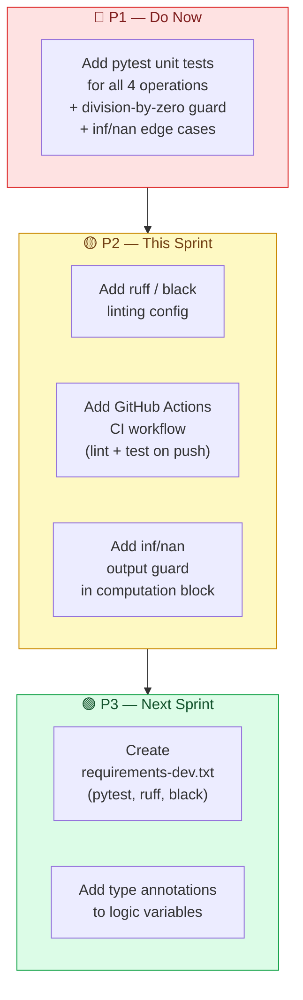

---

## 12. Glossary

### 12.1 Domain Terms

| Term | Definition |
|------|------------|
| **Arithmetic Operation** | One of the four fundamental mathematical operations: addition (`+`), subtraction (`−`), multiplication (`×`), or division (`÷`) |
| **Operand** | A numeric value on which an arithmetic operation is applied. In this app: `num1` (first operand) and `num2` (second operand) |
| **Divisor** | The second operand (`num2`) in a division operation. A zero divisor is mathematically undefined and is explicitly rejected by the application |
| **Dividend** | The first operand (`num1`) in a division operation |
| **Result** | The numerical output produced by applying the selected arithmetic operation to `num1` and `num2` |
| **Computation Details** | The expandable diagnostic panel displaying the raw `{first_number, second_number, operation, result}` dictionary |
| **Division by Zero** | An undefined arithmetic operation (`num1 ÷ 0`). The application detects this and halts rendering with a clear error message |
| **Floating-Point Number** | A real-number approximation using IEEE 754 double-precision (64-bit) binary format. All numeric inputs and outputs in this application use Python's native `float` type |

### 12.2 Technical Terms

| Term | Definition |
|------|------------|
| **Streamlit** | An open-source Python library for building interactive web applications with a reactive execution model. The sole framework dependency of this project (version ≥ 1.40.0) |
| **Reactive Re-execution** | Streamlit's core execution model: the full Python script is re-run top-to-bottom on every user interaction (widget change, form submit, button click) |
| **`st.form`** | A Streamlit container widget that batches all enclosed widget value changes, submitting them together when the form's submit button is clicked — preventing per-keystroke re-renders |
| **`st.form_submit_button`** | A button widget inside an `st.form` that triggers the form submission and causes `submitted` to be `True` for the current script execution |
| **`st.number_input`** | A Streamlit numeric input widget restricted to floating-point values, with configurable format string, step, and default value |
| **`st.selectbox`** | A Streamlit dropdown widget for selecting a single option from an ordered list. Used here to select the arithmetic operation |
| **`st.success`** | Renders a green-background banner with the provided message — used to display the arithmetic result |
| **`st.error`** | Renders a red-background banner with the provided message — used to display the division-by-zero error |
| **`st.stop`** | Immediately halts further script execution for the current Streamlit run, preventing any subsequent widgets from being rendered |
| **`st.expander`** | A collapsible Streamlit container; content is hidden by default and revealed on user click — used for the computation details panel |
| **`submitted`** | The boolean return value of `st.form_submit_button()`; evaluates to `True` only during the script run immediately following a form submission click |
| **Tornado** | The embedded async HTTP/WebSocket server used internally by Streamlit (transparent to the `app.py` developer) |
| **IEEE 754** | The international standard defining binary floating-point arithmetic semantics. Python's `float` is a 64-bit IEEE 754 double-precision type |
| **`st.session_state`** | A Streamlit dictionary-like object for persisting values across script re-executions within a browser session. **Not used** in this application |
| **ADR** | *Architecture Decision Record* — a concise document capturing a significant architectural choice, its context, rationale, and trade-off consequences |
| **Arc42** | A pragmatic, lightweight template for software and system architecture documentation, structured into 12 standardised sections |
| **Cyclomatic Complexity** | A code metric measuring the number of linearly independent execution paths through a piece of source code (branches + 1) |
| **`requirements.txt`** | A standard Python file listing runtime package dependencies with version constraints (`streamlit>=1.40.0`) |
| **`st.columns`** | A Streamlit layout primitive that creates a set of side-by-side column containers within the page |
| **`st.caption`** | A Streamlit widget that renders small, grey-toned secondary text — used here for the app subtitle |
| **`st.set_page_config`** | A Streamlit function (must be the first Streamlit call in the script) that configures browser-tab-level metadata: title, favicon icon, and layout mode |

---

*Documentation generated by the Arc42 Documentation Generator*  
*Source: `xinni-cap/github-copilot-test` · analysed files: `app.py`, `requirements.txt`, `README.md`*  
*Template: Arc42 v8.2 · Diagram format: Mermaid (all 12 diagrams)*  
*Total embedded Mermaid diagrams: 16*
