# Architecture Documentation (Arc42)

**Project**: Streamlit Calculator Application  
**Version**: 1.0.0  
**Date**: 2025-01-30  
**Generated by**: Arc42 Documentation Generator  
**Source**: `/home/runner/work/github-copilot-test/github-copilot-test`

> **Note**: This file is saved at the repository root (`arc42-architecture.md`).  
> To move it to `docs/arc42-architecture.md`, run:  
> `mkdir -p docs && mv arc42-architecture.md docs/arc42-architecture.md`

---

## Table of Contents

1. [Introduction and Goals](#1-introduction-and-goals)
2. [Constraints](#2-constraints)
3. [Context and Scope](#3-context-and-scope)
4. [Solution Strategy](#4-solution-strategy)
5. [Building Block View](#5-building-block-view)
6. [Runtime View](#6-runtime-view)
7. [Deployment View](#7-deployment-view)
8. [Cross-cutting Concepts](#8-cross-cutting-concepts)
9. [Architecture Decisions](#9-architecture-decisions)
10. [Quality Requirements](#10-quality-requirements)
11. [Risks and Technical Debt](#11-risks-and-technical-debt)
12. [Glossary](#12-glossary)

---

## 1. Introduction and Goals

### 1.1 Requirements Overview

The **Streamlit Calculator** is a lightweight, browser-based arithmetic web application. It provides end-users with an interactive interface to perform the four fundamental arithmetic operations — addition, subtraction, multiplication, and division — on floating-point numbers, without requiring any local software installation beyond a web browser.

The application is intentionally minimal in scope, serving as a reference implementation, educational demonstration, or rapid-prototype baseline for Streamlit-based data applications.

**Core functional requirements:**

| ID   | Requirement                                                                          | Source         |
|------|--------------------------------------------------------------------------------------|----------------|
| FR-1 | Accept two floating-point numbers as input                                           | `app.py:12-14` |
| FR-2 | Support four arithmetic operations: Add, Subtract, Multiply, Divide                 | `app.py:16-20` |
| FR-3 | Display the computed result with the full expression (e.g. `3.0 + 2.0 = 5.0`)       | `app.py:41`    |
| FR-4 | Guard against division by zero and display a descriptive error message              | `app.py:36-38` |
| FR-5 | Expose computation details (operands, operation, result) in an expandable panel     | `app.py:43-49` |

### 1.2 Quality Goals

The top quality goals for this system, in priority order:

| Priority | Quality Goal      | Motivation                                                                                      |
|----------|-------------------|-------------------------------------------------------------------------------------------------|
| 1        | **Correctness**   | Arithmetic results must be mathematically accurate; division-by-zero must never produce a crash |
| 2        | **Usability**     | A first-time user must be able to perform a calculation without any instructions                |
| 3        | **Simplicity**    | The entire application logic lives in a single file to maximise maintainability                 |
| 4        | **Portability**   | Runs on any platform that supports Python ≥ 3.8 and `streamlit >= 1.40.0`                      |
| 5        | **Extensibility** | Adding new operations or a history feature should require minimal structural changes            |

### 1.3 Stakeholders

| Role                   | Concern                                                                           |
|------------------------|-----------------------------------------------------------------------------------|
| **End User**           | Wants accurate, fast arithmetic results through an intuitive browser UI           |
| **Developer**          | Wants a clean, readable, easily extensible codebase                               |
| **DevOps / Operator**  | Wants a simple, dependency-light deployment with no database or external services |
| **Educator / Trainer** | Uses the app as a teaching reference for Streamlit or Python web development      |

---

## 2. Constraints

### 2.1 Technical Constraints

| ID   | Constraint                                               | Rationale / Source                                       |
|------|----------------------------------------------------------|----------------------------------------------------------|
| TC-1 | **Python runtime required** on the host machine         | Streamlit is a Python framework; `app.py` is pure Python |
| TC-2 | **`streamlit >= 1.40.0`** must be installed             | Declared in `requirements.txt`                           |
| TC-3 | **Single-page application** architecture                | Streamlit re-runs the entire script on each interaction  |
| TC-4 | **Stateless computation model** per request             | No persistent state, database, or session storage used   |
| TC-5 | **Port 8501** is the default Streamlit serving port     | Standard Streamlit default; referenced in `README.md`    |
| TC-6 | **No JavaScript / frontend customisation**              | Pure Python UI via Streamlit widgets only                |
| TC-7 | **No external APIs or services**                        | All computation is local; no network calls are made      |

### 2.2 Organisational Constraints

| ID   | Constraint                                                    | Rationale                                           |
|------|---------------------------------------------------------------|-----------------------------------------------------|
| OC-1 | Codebase **fits in a single file** (`app.py`)                 | Deliberately kept minimal for readability/demo use  |
| OC-2 | No CI/CD pipeline or containerisation is mandated            | Lightweight project; manual `streamlit run` suffices |
| OC-3 | No authentication or authorisation mechanism                 | Public, unauthenticated tool; no sensitive data     |

### 2.3 Conventions

| Convention                 | Description                                                         |
|----------------------------|---------------------------------------------------------------------|
| Python style               | Standard Python 3 idioms; no linting config present                 |
| Numeric precision          | Inputs and results formatted to 6 decimal places (`"%.6f"`)         |
| Operation nomenclature     | English title-case labels: `"Add"`, `"Subtract"`, `"Multiply"`, `"Divide"` |
| Error display              | `st.error()` for user-facing errors; `st.stop()` to halt execution  |

---

## 3. Context and Scope

### 3.1 Business Context

The Streamlit Calculator sits entirely within the user's browser session. There are no external system integrations, databases, or third-party APIs. The system boundary is thin: the only external actor is the **End User** interacting via a web browser, and the only infrastructure dependency is the **Streamlit server process** running on the host.

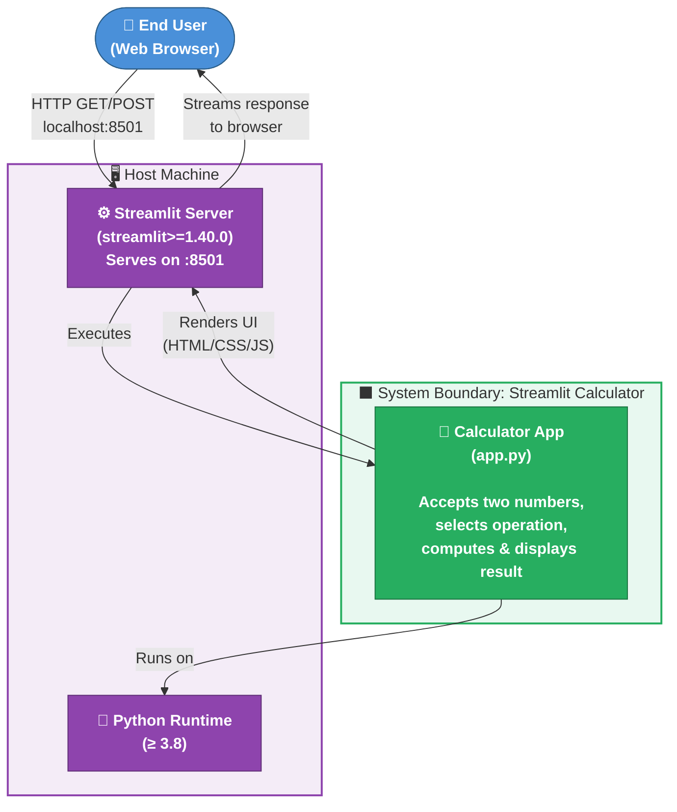

### 3.2 Technical Context

The technical context captures the communication channels and protocols between the user's browser and the Streamlit server:

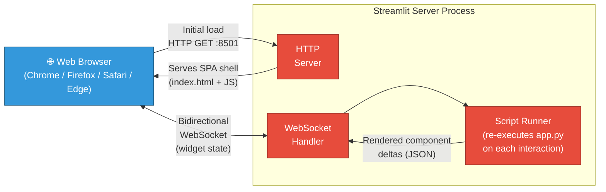

| Channel           | Protocol     | Direction        | Purpose                                                          |
|-------------------|--------------|------------------|------------------------------------------------------------------|
| Initial page load | HTTP/1.1 GET | Browser → Server | Download the Streamlit SPA shell                                 |
| Widget interaction| WebSocket    | Bidirectional    | Send widget state; receive rendered component deltas             |
| Static assets     | HTTP/1.1 GET | Browser → Server | CSS, fonts, JavaScript bundles                                   |

---

## 4. Solution Strategy

### 4.1 Technology Decisions

| Decision                     | Choice               | Rationale                                                                                       |
|------------------------------|----------------------|-------------------------------------------------------------------------------------------------|
| **UI Framework**             | Streamlit            | Zero-boilerplate Python-native UI; no HTML/CSS/JS required; built-in reactive re-run model      |
| **Programming Language**     | Python 3             | Dominant language for data/ML tooling; Streamlit is Python-only                                |
| **Architecture Style**       | Single-file script   | Complexity of a calculator does not justify multi-module structure                              |
| **State management**         | Streamlit form       | Encapsulates all inputs; form prevents partial re-runs on individual widget changes             |
| **Error handling strategy**  | Inline UI feedback   | `st.error()` + `st.stop()` surfaces errors in-context without exceptions propagating to user   |
| **Dependency management**    | `requirements.txt`   | Standard Python convention; trivial to install with `pip`                                      |
| **Deployment**               | Local `streamlit run`| No cloud service, container, or web server required for the primary use-case                   |

### 4.2 Top-Level Decomposition

The solution is decomposed into three logical layers within the single `app.py` file:

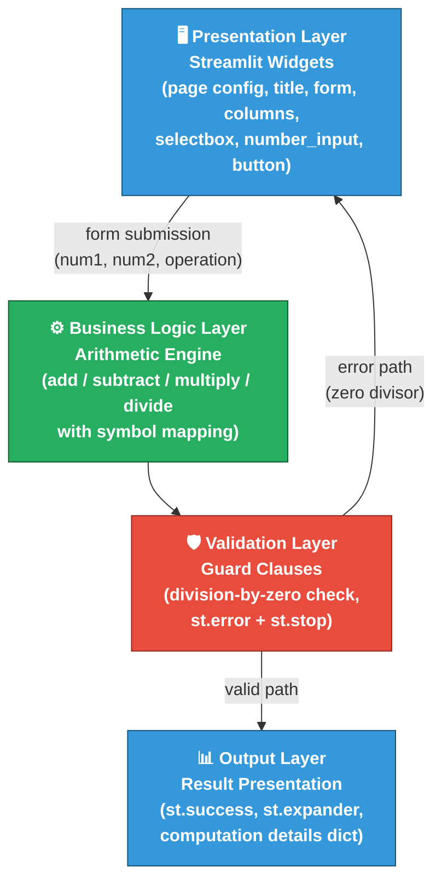

### 4.3 Approach to Quality Goals

| Quality Goal    | Architectural Approach                                                                                  |
|-----------------|----------------------------------------------------------------------------------------------------------|
| Correctness     | Python native float arithmetic; explicit `if/elif/else` dispatch; pre-condition check before divide     |
| Usability       | Streamlit's opinionated widget library; `st.columns` for side-by-side layout; `st.form` for atomic submit |
| Simplicity      | All logic in ~50 lines of a single file; no classes, no imports beyond `streamlit`                      |
| Portability     | Only standard library + one pinned package; `requirements.txt` ensures reproducible installs            |
| Extensibility   | `if/elif/else` dispatch can be replaced with a dict-of-callables; `st.selectbox` options are a tuple   |

---

## 5. Building Block View

### 5.1 Level 1 — System Context

At the highest level, the system is a single deployable unit: a Python script executed by the Streamlit server.

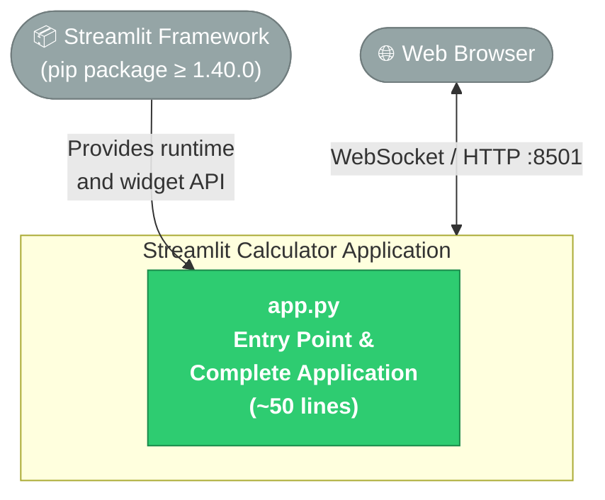

### 5.2 Level 2 — Internal Functional Blocks

Since the entire application resides in `app.py`, the Level 2 view decomposes the script into its logical functional blocks:

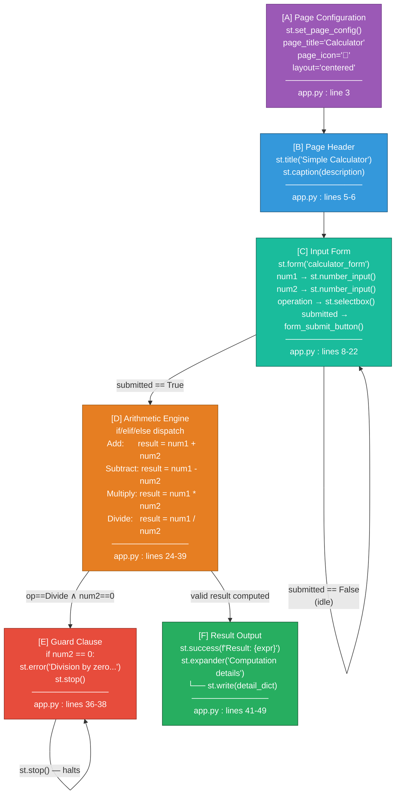

### 5.3 Level 3 — Component Responsibilities

| Block | Lines | Responsibility                                                                                         | Streamlit APIs                                                    |
|-------|-------|--------------------------------------------------------------------------------------------------------|-------------------------------------------------------------------|
| A     | 3     | Configure browser tab title, favicon (🧮), and page layout to `"centered"`                            | `st.set_page_config()`                                            |
| B     | 5–6   | Render the application heading and descriptive subtitle                                                | `st.title()`, `st.caption()`                                      |
| C     | 8–22  | Collect user inputs atomically; prevent intermediate re-runs until the form is submitted               | `st.form()`, `st.columns()`, `st.number_input()`, `st.selectbox()`, `st.form_submit_button()` |
| D     | 24–39 | Compute the arithmetic result via conditional dispatch; assign the display symbol                     | Pure Python (`+`, `-`, `*`, `/`)                                  |
| E     | 36–38 | Validate the divisor before performing division; halt execution on zero                               | `st.error()`, `st.stop()`                                         |
| F     | 41–49 | Render the formatted result string and expose raw computation metadata in a collapsible panel          | `st.success()`, `st.expander()`, `st.write()`                     |

### 5.4 Class / Data Flow Diagram

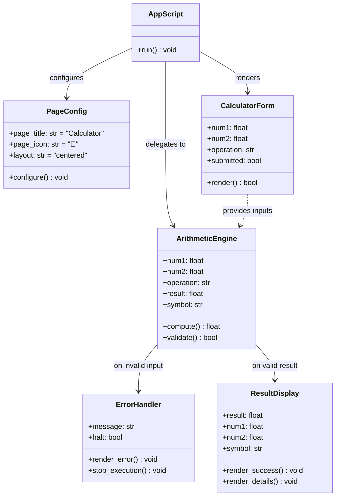

> **Note**: The class diagram above represents a *logical* decomposition of `app.py`. The actual source code does not use classes — all logic is procedural within the script's top-level scope.

---

## 6. Runtime View

### 6.1 Scenario 1 — Successful Calculation (Happy Path)

This sequence describes the happy-path interaction when a user performs a valid arithmetic operation.

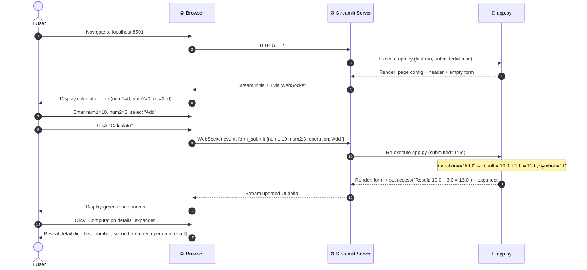

### 6.2 Scenario 2 — Division by Zero (Error Path)

```mermaid
sequenceDiagram
    autonumber
    actor User as 👤 User
    participant Browser as 🌐 Browser
    participant StreamlitSrv as ⚙️ Streamlit Server
    participant AppScript as 🐍 app.py

    User->>Browser: Enter num1=5, num2=0, select "Divide"
    User->>Browser: Click "Calculate"
    Browser->>StreamlitSrv: WebSocket event: form_submit {num1:5, num2:0, operation:"Divide"}
    StreamlitSrv->>AppScript: Re-execute app.py (submitted=True)

    Note over AppScript: operation=="Divide" → num2 == 0 ⚠️ guard triggered

    AppScript-->>StreamlitSrv: st.error("Division by zero is not allowed.")
    AppScript-->>StreamlitSrv: st.stop() — halts further rendering immediately
    StreamlitSrv-->>Browser: Stream error UI (result block NOT rendered)
    Browser-->>User: Display red error banner; form remains editable
```

### 6.3 Application Startup & Lifecycle

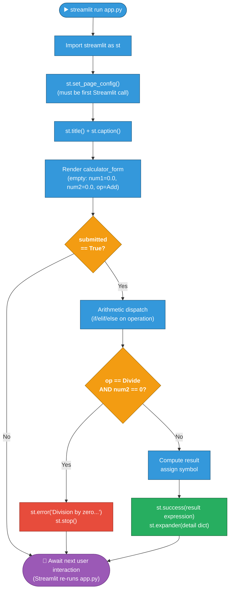

### 6.4 Operation Dispatch Logic

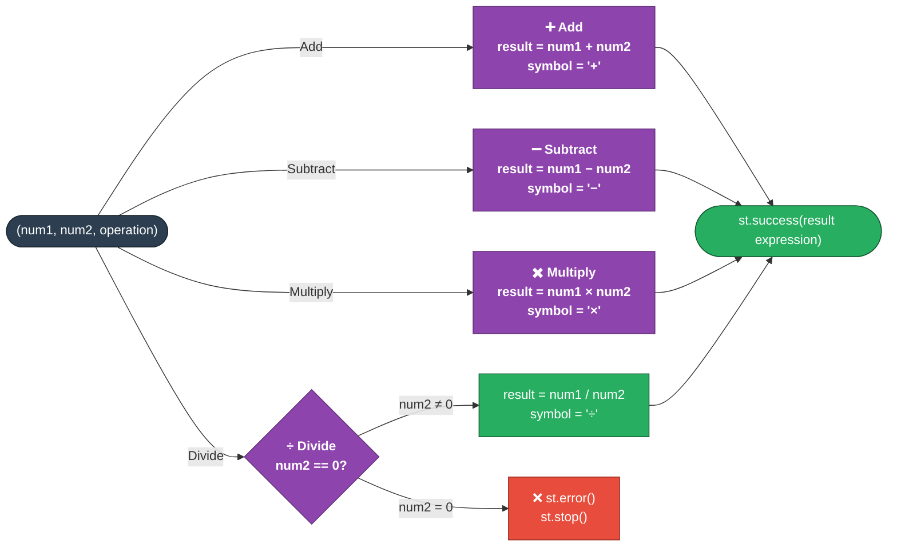

---

## 7. Deployment View

### 7.1 Infrastructure Overview

The application is designed for **local single-machine deployment**. There is no cloud infrastructure, container orchestration, or reverse proxy in the baseline configuration.

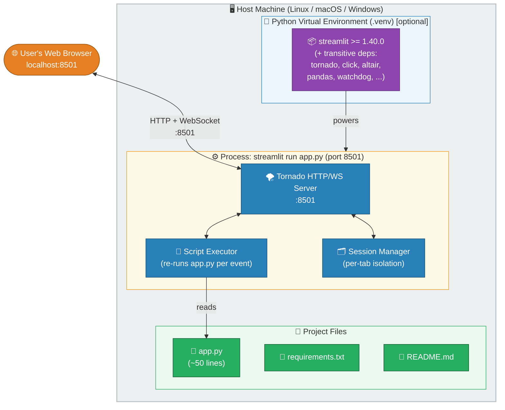

### 7.2 Deployment Steps

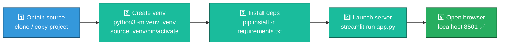

### 7.3 Port and Network Requirements

| Port | Protocol          | Purpose                          | Configurable?                        |
|------|-------------------|----------------------------------|--------------------------------------|
| 8501 | HTTP + WebSocket  | Streamlit default serving port   | Yes (`--server.port=XXXX`)           |

### 7.4 System Requirements

| Requirement       | Minimum                      | Recommended              |
|-------------------|------------------------------|--------------------------|
| Python version    | 3.8                          | 3.11+                    |
| Streamlit version | 1.40.0                       | Latest stable            |
| RAM               | 256 MB                       | 512 MB                   |
| Disk space        | ~100 MB (with Streamlit deps)| ~200 MB                  |
| Network           | Localhost only               | —                        |
| OS                | Linux / macOS / Windows      | Linux (for production)   |

### 7.5 Optional: Containerised Deployment

While no `Dockerfile` is currently present, the app is well-suited for containerisation:

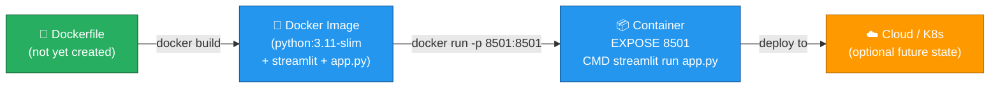

---

## 8. Cross-cutting Concepts

### 8.1 Streamlit Reactive Execution Model

Streamlit's **reactive re-run model** is the central cross-cutting concern. Understanding it is critical for extending or debugging the app.

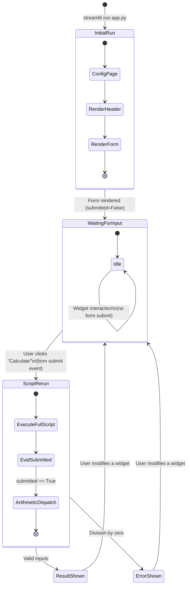

**Key implications of the re-run model:**
- Every widget interaction triggers a script re-run (Streamlit default behaviour)
- `st.form` batches all inputs and triggers a **single** re-run only when the submit button is clicked
- There is **no persistent state** between re-runs (no `st.session_state` used in this app)
- The `submitted` variable is an event flag scoped to the current re-run only

### 8.2 Error Handling Strategy

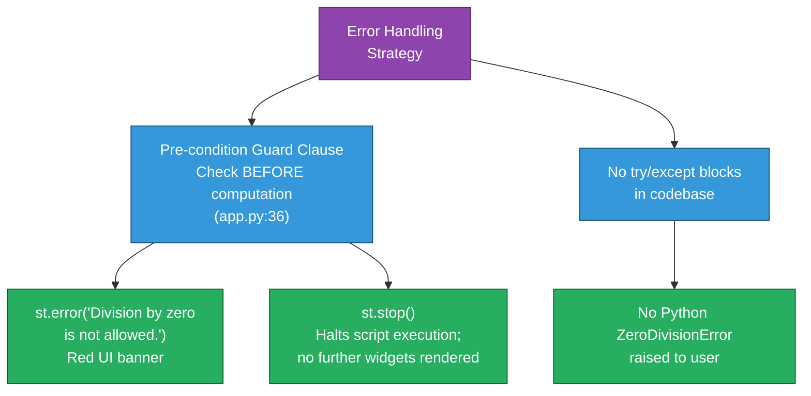

**Applied error handling rules:**

| Rule | Description                                                                                    |
|------|-----------------------------------------------------------------------------------------------|
| EH-1 | Validate inputs **before** computation (not after with exception catching)                    |
| EH-2 | Surface errors **in-context** via `st.error()` rather than via stack traces                   |
| EH-3 | Use `st.stop()` to prevent rendering subsequent (potentially misleading) UI elements           |
| EH-4 | Error messages are **human-readable** and non-technical: `"Division by zero is not allowed."` |

### 8.3 Numeric Precision

| Aspect            | Implementation                   | Notes                                                        |
|-------------------|----------------------------------|--------------------------------------------------------------|
| Input type        | Python `float` (64-bit IEEE 754) | `st.number_input(value=0.0)`                                 |
| Input display     | 6 decimal places                 | `format="%.6f"` in `st.number_input`                         |
| Computation       | Python native float arithmetic   | Subject to standard IEEE 754 floating-point rounding         |
| Output            | Python f-string interpolation    | No explicit rounding applied to result                       |
| Known limitation  | `0.1 + 0.2 ≠ 0.3` (IEEE 754)    | Not addressed in current implementation                      |

### 8.4 UI Layout Conventions

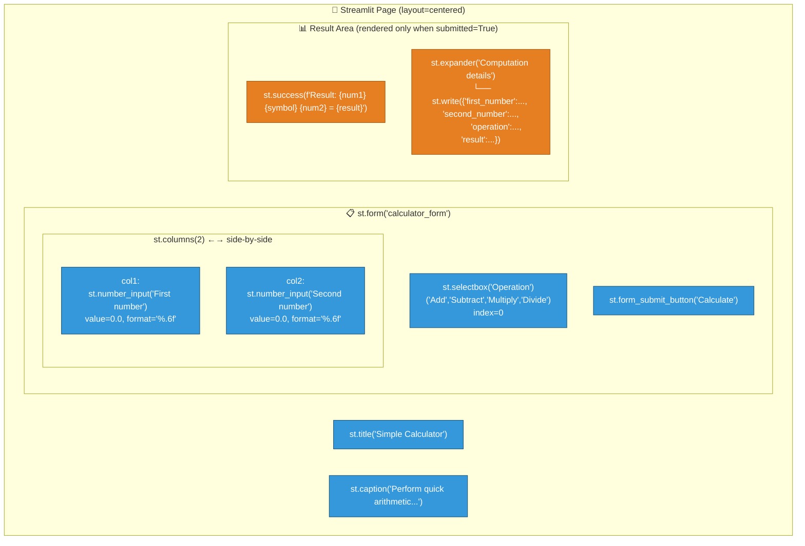

### 8.5 Logging and Observability

> ⚠️ **Gap Identified**: The application has **no logging, metrics, or observability** instrumentation. All output is rendered to the browser UI only.

| Aspect           | Current State | Recommended Improvement                                        |
|------------------|---------------|----------------------------------------------------------------|
| Server-side logs | ❌ None        | Add Python `logging` module; log each calculation             |
| Usage metrics    | ❌ None        | Use `st.session_state` to track usage count per session       |
| Error tracking   | ❌ None        | Integrate Sentry or similar for error monitoring              |
| Audit trail      | ❌ None        | Persist calculation history to a file or lightweight database |

---

## 9. Architecture Decisions

### ADR-001: Use Streamlit as the UI Framework

| Field           | Detail                                                                                       |
|-----------------|----------------------------------------------------------------------------------------------|
| **Status**      | ✅ Accepted                                                                                   |
| **Context**     | A simple calculator needs a web UI. Options evaluated: raw HTML/Flask, Dash, Gradio, Streamlit |
| **Decision**    | Use **Streamlit** as the sole UI and server framework                                         |
| **Rationale**   | Zero frontend code; Python-only; batteries-included widgets; minimal setup (`streamlit run`)  |
| **Consequences**| Tied to Streamlit's re-run model; limited custom CSS/JS; single dependency covers everything  |
| **Source**      | `requirements.txt:1`, `app.py:1`                                                              |

---

### ADR-002: Single-File Architecture

| Field           | Detail                                                                                          |
|-----------------|-------------------------------------------------------------------------------------------------|
| **Status**      | ✅ Accepted                                                                                      |
| **Context**     | Calculator logic is trivial (~40 lines of computation). Separating into modules adds overhead    |
| **Decision**    | Keep the **entire application in `app.py`** — no separate modules, packages, or classes         |
| **Rationale**   | YAGNI principle; maximises readability; reduces onboarding friction to near-zero                |
| **Consequences**| Scaling to >4 operations or adding history will require refactoring into modules                |
| **Source**      | `app.py` (entire file is ~50 lines)                                                              |

---

### ADR-003: Use `st.form` for Input Collection

| Field           | Detail                                                                                           |
|-----------------|--------------------------------------------------------------------------------------------------|
| **Status**      | ✅ Accepted                                                                                       |
| **Context**     | Without a form, every widget change triggers an immediate script re-run and premature calculation |
| **Decision**    | Wrap all inputs in a **`st.form`** with an explicit submit button                                |
| **Rationale**   | Prevents UI flicker on partial input; computation only runs when explicitly requested by user    |
| **Consequences**| Slight added verbosity (`with st.form(...):` context manager required)                           |
| **Source**      | `app.py:8–22`                                                                                    |

---

### ADR-004: Guard-Clause Error Handling (No `try/except`)

| Field           | Detail                                                                                           |
|-----------------|--------------------------------------------------------------------------------------------------|
| **Status**      | ✅ Accepted                                                                                       |
| **Context**     | Division by zero in Python raises `ZeroDivisionError`. Options: `try/except`, guard clause      |
| **Decision**    | Use a **pre-condition guard clause** (`if num2 == 0`) before performing division                 |
| **Rationale**   | More readable; surfaces error to user via `st.error()`; avoids exposing Python tracebacks        |
| **Consequences**| Pattern must be manually extended for every new validation rule; no centralised error handler   |
| **Source**      | `app.py:36–38`                                                                                   |

---

### ADR-005: Floating-Point Inputs (No Integer Mode)

| Field           | Detail                                                                                           |
|-----------------|--------------------------------------------------------------------------------------------------|
| **Status**      | ✅ Accepted                                                                                       |
| **Context**     | Calculator could accept integers only, floats only, or both                                      |
| **Decision**    | Use `float` inputs with 6-decimal formatting for all operations                                  |
| **Rationale**   | Supports widest range of user inputs; avoids integer-division surprises (e.g., `5÷2=2`)          |
| **Consequences**| IEEE 754 floating-point rounding applies; no arbitrary-precision support                         |
| **Source**      | `app.py:12–14` (`value=0.0`, `format="%.6f"`)                                                    |

---

### ADR-006: No Session State or Calculation History

| Field           | Detail                                                                                           |
|-----------------|--------------------------------------------------------------------------------------------------|
| **Status**      | ✅ Accepted (for current scope)                                                                   |
| **Context**     | Streamlit provides `st.session_state` for persisting data across re-runs                         |
| **Decision**    | **Do not use** `st.session_state`; each form submission is fully independent                     |
| **Rationale**   | Keeps the implementation minimal; a simple calculator does not require history for core use-case |
| **Consequences**| Users cannot review past calculations; adding history requires introducing `st.session_state`    |
| **Source**      | `app.py` (no `st.session_state` references)                                                      |

---

## 10. Quality Requirements

### 10.1 Quality Tree

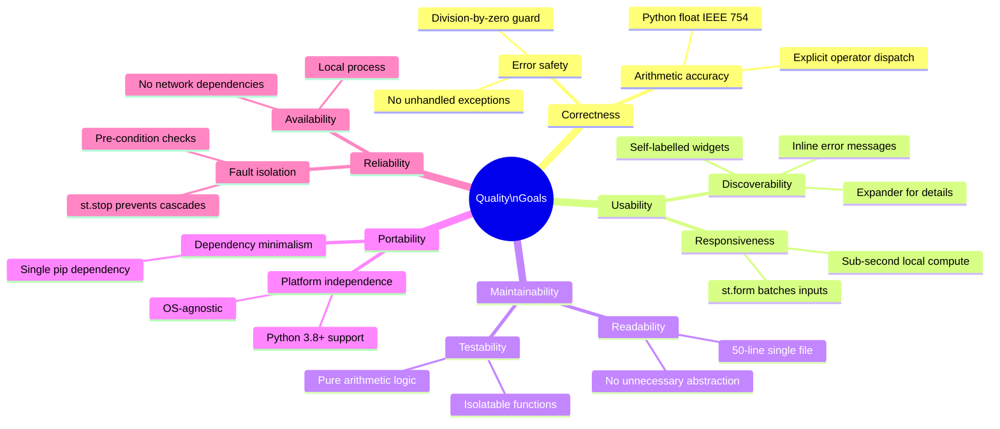

### 10.2 Quality Scenarios

| ID   | Quality Attribute | Scenario                                                                      | Expected Response                                                    | Metric / Threshold                |
|------|-------------------|-------------------------------------------------------------------------------|----------------------------------------------------------------------|-----------------------------------|
| QS-1 | Correctness       | User enters `10.5` and `3.2`, selects Multiply, clicks Calculate              | Result: `10.5 × 3.2 = 33.6` (±IEEE 754 precision)                  | 0 arithmetic errors               |
| QS-2 | Error Safety      | User enters `7` and `0`, selects Divide, clicks Calculate                     | Red error banner; no result rendered; app remains fully usable       | 0 unhandled exceptions            |
| QS-3 | Usability         | New user opens app for the first time with no prior instructions               | User completes a calculation within 30 seconds                       | Time-to-first-result ≤ 30 s      |
| QS-4 | Performance       | User clicks Calculate with any valid inputs on local hardware                  | Result appears within 1 second                                       | Latency ≤ 1 s                     |
| QS-5 | Portability       | Developer installs on a fresh Python 3.9 Linux environment                    | `pip install -r requirements.txt && streamlit run app.py` succeeds   | 0 dependency / import errors      |
| QS-6 | Maintainability   | Developer adds a 5th operation ("Modulo")                                     | Change requires ≤ 3 lines of modification                            | Cyclomatic complexity stays ≤ 6   |
| QS-7 | Reliability       | User submits form 100 times in succession                                     | Every submission produces correct result or appropriate error        | 0 crashes, 0 unhandled exceptions |

### 10.3 Code Metrics Summary

| Metric                       | Value         | Assessment                                          |
|------------------------------|---------------|-----------------------------------------------------|
| Total lines of code (app.py) | ~50           | ✅ Very low — highly maintainable                   |
| Number of functions          | 0             | ⚠️ No unit-testable functions defined               |
| Number of classes            | 0             | ✅ Appropriate for this scope                       |
| Cyclomatic complexity        | 5             | ✅ Low (1 base + 4 branching conditions)            |
| External dependencies        | 1 (`streamlit`)| ✅ Minimal dependency surface                      |
| Test coverage                | 0%            | ❌ No test files present                            |
| Hardcoded default values     | 3             | ⚠️ Minor — acceptable at this scale                |
| Handled edge cases           | 1 / 1 known  | ✅ Division-by-zero covered                        |
| Lines of comments/docstrings | 0             | ⚠️ No inline documentation                         |

---

## 11. Risks and Technical Debt

### 11.1 Risk Assessment Matrix

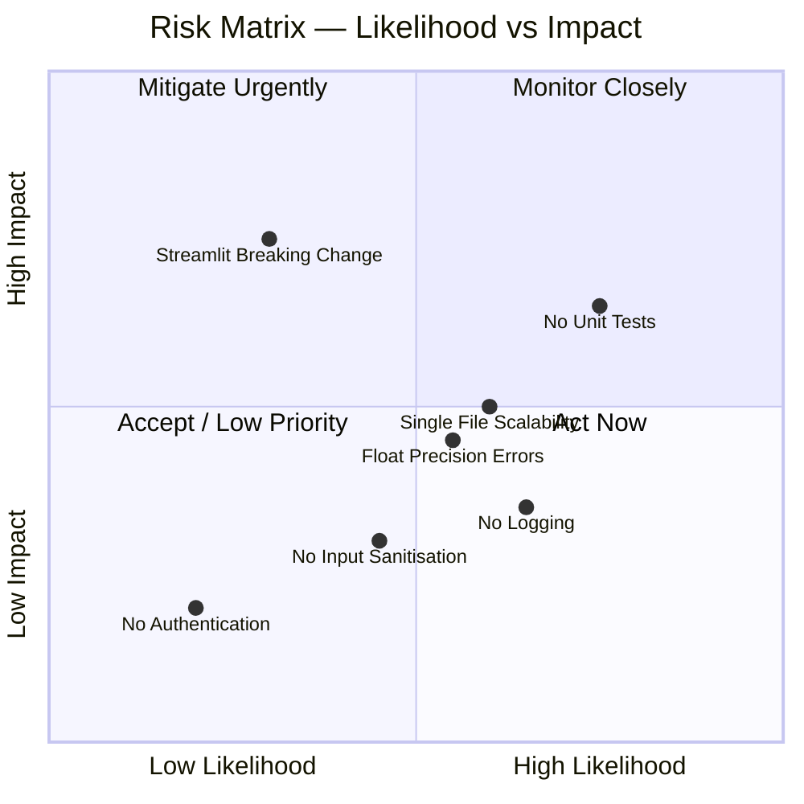

### 11.2 Risk Register

| ID  | Risk                               | Likelihood | Impact | Description                                                                                     | Mitigation Strategy                                                         |
|-----|------------------------------------|------------|--------|-------------------------------------------------------------------------------------------------|-----------------------------------------------------------------------------|
| R-1 | **No unit tests**                  | High       | Medium | Arithmetic logic has 0% test coverage; regressions cannot be caught automatically              | Extract arithmetic to pure functions; add `pytest` test suite               |
| R-2 | **Streamlit API breaking change**  | Low        | High   | `streamlit>=1.40.0` has no upper-bound; future major versions may introduce incompatibilities   | Pin version: `streamlit>=1.40.0,<2.0.0`; add CI dependency update alerts   |
| R-3 | **Floating-point precision**       | Medium     | Medium | IEEE 754 can produce unexpected results (e.g., `0.1 + 0.2 = 0.30000000000000004`)              | Document known limitation; optionally use `decimal.Decimal` for precision   |
| R-4 | **Single file scalability**        | Medium     | Medium | Adding 5+ operations, history, or multi-user features will make `app.py` unwieldy              | Refactor into `ui.py`, `calculator.py`, `models.py` when scope grows        |
| R-5 | **No input sanitisation**          | Medium     | Low    | Only `num2==0` is validated; no guards for NaN, Infinity, or extreme values                     | Add `math.isfinite()` checks; consider value range limits                   |
| R-6 | **No logging / observability**     | High       | Low    | No server-side logs; impossible to diagnose issues in production                               | Add Python `logging` module; consider structured logging                    |
| R-7 | **No accessibility (a11y) testing**| Medium     | Low    | Streamlit's default widgets may not meet WCAG standards for all users                           | Test with screen readers; supplement with `st.markdown` aria equivalents    |

### 11.3 Technical Debt Items

| ID   | Debt Item                            | Effort | Priority | Description                                                                         |
|------|--------------------------------------|--------|----------|-------------------------------------------------------------------------------------|
| TD-1 | **No test coverage**                 | Low    | 🔴 High  | Arithmetic logic should be extracted to pure functions and covered by `pytest`      |
| TD-2 | **Hardcoded operation list**         | Low    | 🟡 Med   | `("Add", "Subtract", "Multiply", "Divide")` tuple is not data-driven or configurable |
| TD-3 | **No upper bound on Streamlit dep**  | Low    | 🟡 Med   | `streamlit>=1.40.0` should have an upper bound to prevent silent breakage          |
| TD-4 | **No result history**                | Medium | 🟢 Low   | Users cannot review previous calculations in the same session                      |
| TD-5 | **No `requirements-dev.txt`**        | Low    | 🟢 Low   | No dev tooling pinned (linter, formatter, test runner)                              |
| TD-6 | **No type annotations**              | Low    | 🟢 Low   | Arithmetic functions (when extracted) would benefit from `float -> float` hints     |
| TD-7 | **No Dockerfile**                    | Medium | 🟢 Low   | Containerising would improve portability to non-Python environments                 |
| TD-8 | **No NaN/Inf guards**                | Low    | 🟢 Low   | `math.isfinite()` check would prevent edge cases with extreme float values          |

### 11.4 Recommended Improvements Roadmap

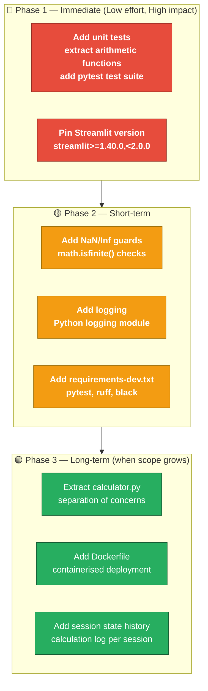

---

## 12. Glossary

| Term                       | Definition                                                                                                           |
|----------------------------|----------------------------------------------------------------------------------------------------------------------|
| **Streamlit**              | An open-source Python framework for building interactive web applications using pure Python code, requiring no HTML/CSS/JS |
| **Script re-run**          | Streamlit's execution model where the entire `app.py` script is re-executed from top to bottom on every user interaction |
| **Widget**                 | A Streamlit UI component (e.g., `st.number_input`, `st.selectbox`) that captures user input or renders output        |
| **Form (`st.form`)**       | A Streamlit container that batches widget interactions and triggers a re-run only when the submit button is clicked   |
| **Session**                | A single user's browser-tab connection to the Streamlit server; each tab has an isolated script execution context    |
| **`st.stop()`**            | A Streamlit function that immediately halts script execution, preventing any further widgets from being rendered      |
| **`st.error()`**           | A Streamlit function that renders a red error notification banner in the browser UI                                   |
| **`st.success()`**         | A Streamlit function that renders a green success notification banner in the browser UI                               |
| **`st.expander()`**        | A Streamlit container that renders as a collapsible panel in the browser                                              |
| **Guard clause**           | A pre-condition check that immediately exits or halts a code block if an invalid state is detected                   |
| **Pre-condition**          | A condition that must be true before a computation is performed (e.g., `num2 ≠ 0` before division)                  |
| **IEEE 754**               | The international standard for floating-point arithmetic implemented by Python's built-in `float` type               |
| **Operand**                | A numeric value (`num1` or `num2`) on which an arithmetic operation is performed                                     |
| **Operator / Operation**   | One of the four arithmetic functions: Add (`+`), Subtract (`−`), Multiply (`×`), Divide (`÷`)                       |
| **Division by zero**       | The mathematically undefined operation of dividing a number by zero; guarded at `app.py:36`                         |
| **Tornado**                | The Python async web framework used internally by Streamlit to serve HTTP and WebSocket connections                   |
| **WebSocket**              | A full-duplex TCP communication protocol used by Streamlit for real-time, bidirectional UI updates                   |
| **Cyclomatic complexity**  | A software metric measuring the number of linearly independent code paths through a function; lower = simpler        |
| **YAGNI**                  | "You Aren't Gonna Need It" — a principle advocating against building features before they are needed                  |
| **ADR**                    | Architecture Decision Record — a document capturing a significant architectural choice and its rationale             |
| **SPA**                    | Single-Page Application — a web app that loads once and dynamically updates content without full page reloads        |
| **Reactive re-run model**  | Streamlit's paradigm where any user interaction causes the entire Python script to be re-executed                    |
| **`st.session_state`**     | Streamlit's mechanism for persisting data across script re-runs within a user session (not used in this app)         |
| **Virtual environment**    | An isolated Python environment (e.g., `.venv`) that keeps project dependencies separate from the system Python       |
| **f-string**               | Python formatted string literal (e.g., `f"Result: {num1} {symbol} {num2} = {result}"`) used for result display      |
| **Transitive dependency**  | A package required by a direct dependency (e.g., `tornado` is required by `streamlit`)                              |

---

*Documentation generated by the Arc42 Documentation Generator.*  
*Source files analysed: `app.py` (50 lines), `requirements.txt` (1 line), `README.md` (17 lines)*  
*Arc42 template: [https://arc42.org/](https://arc42.org/) — © Peter Hruschka & Gernot Starke (Creative Commons)*  
*All diagrams rendered with [Mermaid](https://mermaid.js.org/) — embedded as code blocks for self-contained viewing*
