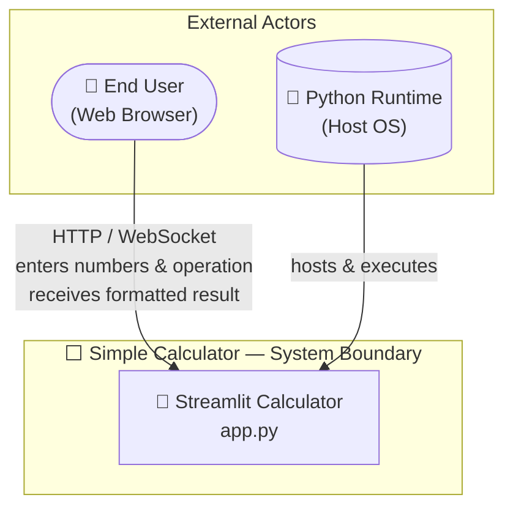
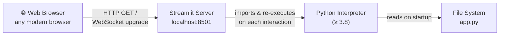
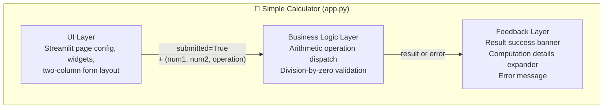
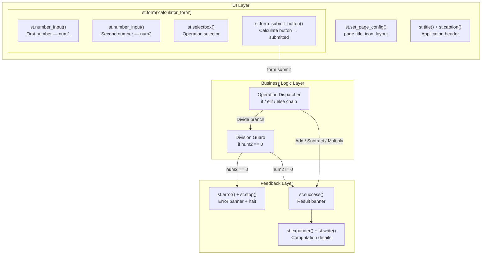
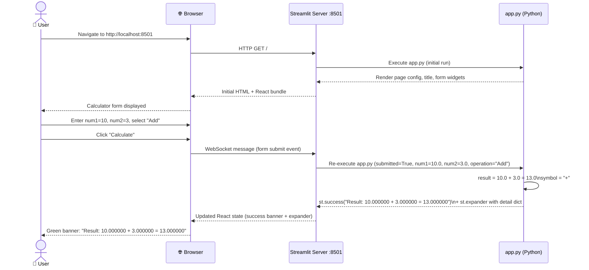
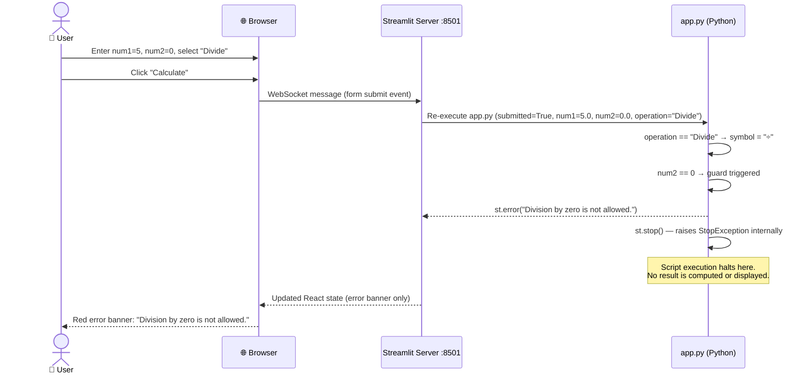
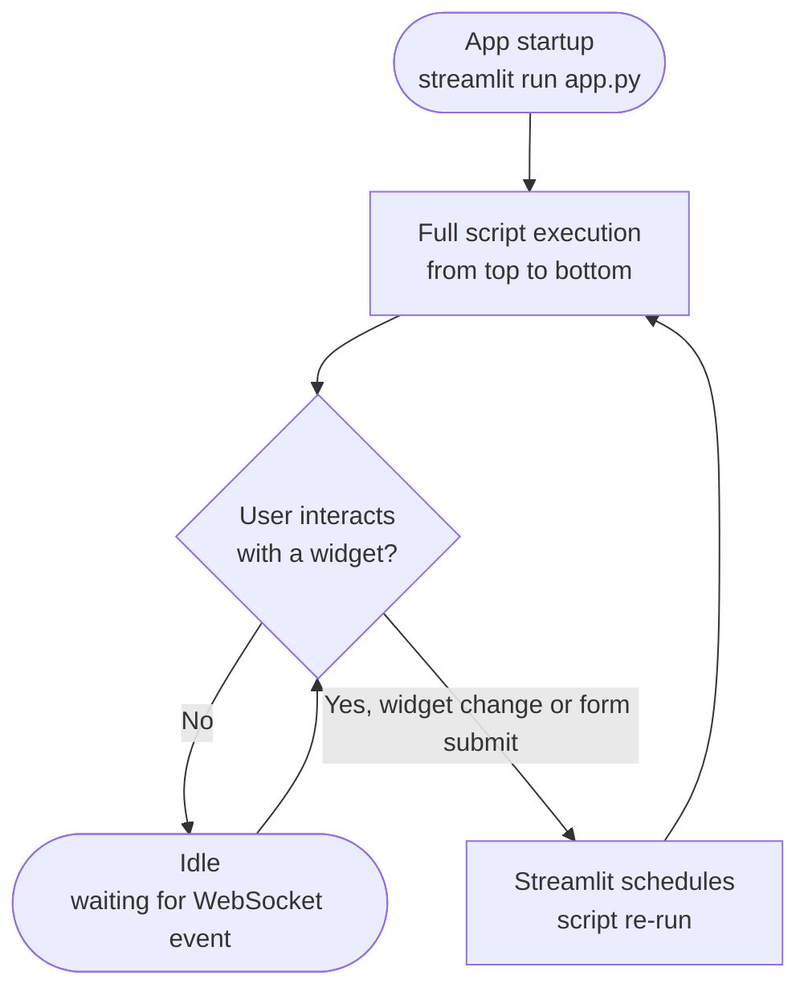
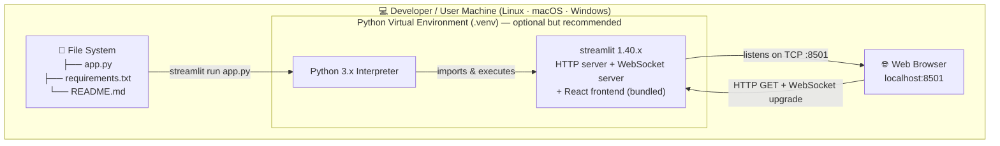
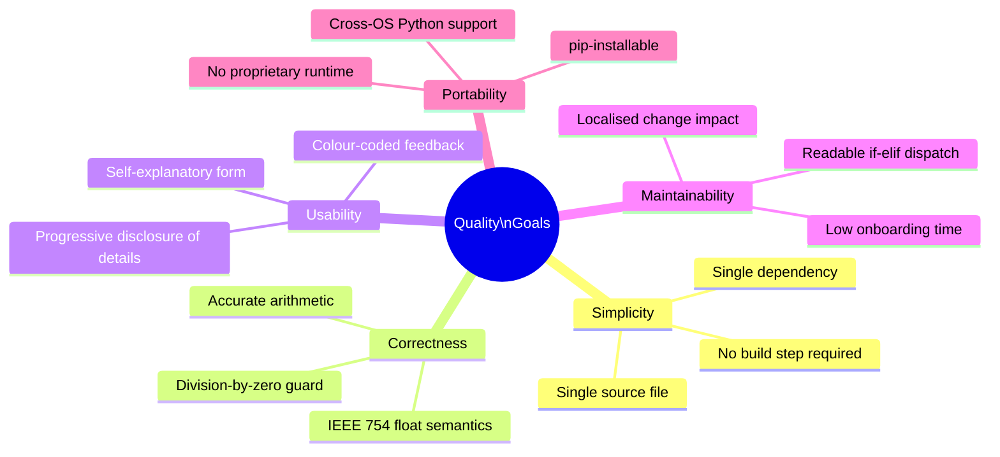

# Simple Calculator — Arc42 Architecture Documentation

**Version:** 1.0  
**Date:** 2025-01-31  
**Status:** Generated from source-code analysis  
**Repository:** xinni-cap/github-copilot-test  

---

## Table of Contents

1. [Introduction and Goals](#1-introduction-and-goals)
2. [Architecture Constraints](#2-architecture-constraints)
3. [System Scope and Context](#3-system-scope-and-context)
4. [Solution Strategy](#4-solution-strategy)
5. [Building Block View](#5-building-block-view)
6. [Runtime View](#6-runtime-view)
7. [Deployment View](#7-deployment-view)
8. [Cross-cutting Concepts](#8-cross-cutting-concepts)
9. [Architecture Decisions](#9-architecture-decisions)
10. [Quality Requirements](#10-quality-requirements)
11. [Risks and Technical Debt](#11-risks-and-technical-debt)
12. [Glossary](#12-glossary)

---

## 1. Introduction and Goals

### 1.1 Requirements Overview

The **Simple Calculator** is a lightweight, browser-based arithmetic tool built with Python and [Streamlit](https://streamlit.io). It allows end-users to perform the four fundamental arithmetic operations on pairs of floating-point numbers through a clean, form-based UI — with no installation required on the client side.

| # | Requirement | Description |
|---|-------------|-------------|
| R-01 | Addition | Compute the sum of two numbers |
| R-02 | Subtraction | Compute the difference of two numbers |
| R-03 | Multiplication | Compute the product of two numbers |
| R-04 | Division | Compute the quotient of two numbers; reject division by zero |
| R-05 | Result display | Show the formatted expression and result prominently |
| R-06 | Computation details | Expose a collapsible breakdown of all inputs and the result |
| R-07 | Error feedback | Provide a clear, inline error message for invalid inputs |
| R-08 | Accessibility | Render correctly in any modern browser without plugins |

### 1.2 Quality Goals

The following quality attributes, listed in descending priority, guide the architectural choices:

| Priority | Quality Goal | Motivation |
|----------|--------------|------------|
| 1 | **Simplicity** | The codebase must remain small enough for a single file; any developer should understand it within minutes |
| 2 | **Correctness** | Arithmetic results and edge-case handling (division by zero) must always be accurate |
| 3 | **Usability** | The UI must be self-explanatory; no user manual required |
| 4 | **Maintainability** | Adding new operations or changing the UI layout should require minimal, localised changes |
| 5 | **Portability** | The application must run on any OS that supports Python ≥ 3.8 and Streamlit ≥ 1.40 |

### 1.3 Stakeholders

| Role | Description | Key Expectations |
|------|-------------|------------------|
| **End User** | A person who needs to perform quick arithmetic in a browser | Instant results, clear error messages, no sign-up |
| **Developer / Maintainer** | The engineer who owns the repository | Readable, well-documented, easy-to-extend code |
| **Architect (Reviewer)** | Evaluates structural soundness of the solution | Appropriate technology choice, no over-engineering |
| **DevOps / Platform Engineer** | Deploys and operates the application | One-command startup, no infrastructure surprises |

---

## 2. Architecture Constraints

### 2.1 Technical Constraints

| ID | Constraint | Rationale |
|----|------------|-----------|
| TC-01 | **Python** is the implementation language | Streamlit requires Python; the team chose Python for speed of development |
| TC-02 | **Streamlit ≥ 1.40.0** is the only declared dependency | Keeps the dependency surface minimal; all UI, server, and WebSocket handling is delegated to the framework |
| TC-03 | **No external database** | All state is ephemeral — calculations are stateless and not persisted between sessions |
| TC-04 | **Single-file application** (`app.py`) | Enforced by the project structure; logic, UI, and error handling co-exist in one module |
| TC-05 | **No authentication layer** | The calculator is a public utility; no user identity is required or stored |
| TC-06 | **No JavaScript authored by the project** | All client-side rendering is handled by Streamlit's built-in React frontend |

### 2.2 Organisational Constraints

| ID | Constraint | Rationale |
|----|------------|-----------|
| OC-01 | **Open-source repository on GitHub** | No proprietary frameworks may be introduced without licence review |
| OC-02 | **Minimal operational overhead** | The project targets environments with no dedicated ops team; self-contained startup is mandatory |
| OC-03 | **No CI/CD pipeline defined** | Testing and deployment are currently manual; future automation is desirable but not mandated |

### 2.3 Conventions

| Convention | Detail |
|------------|--------|
| Python style | PEP 8 (inferred from code formatting) |
| Floating-point display precision | Six decimal places (`"%.6f"` format string) |
| Operation vocabulary | Canonical names: Add, Subtract, Multiply, Divide (title case, matching UI labels) |
| Error handling | Uses Streamlit's built-in `st.error()` + `st.stop()` idiom; no custom exception classes |

---

## 3. System Scope and Context

### 3.1 Business Context

The diagram below shows the system boundary and external actors.



**External interface descriptions:**

| Partner | Protocol | Direction | Description |
|---------|----------|-----------|-------------|
| End User (Browser) | HTTP + WebSocket | Bidirectional | User submits the calculator form; the server pushes rendered HTML/React state back to the browser |
| Python Runtime (Host OS) | In-process execution | Inbound | Streamlit's server is started inside the Python interpreter; the OS provides the execution environment |

### 3.2 Technical Context



| Channel | Protocol | Notes |
|---------|----------|-------|
| Browser ↔ Streamlit server | HTTP + WebSocket (`ws://localhost:8501`) | Streamlit serves a React single-page app; UI state updates travel over the WebSocket |
| Streamlit ↔ Python interpreter | In-process function calls | `app.py` is re-executed top-to-bottom on every user interaction (Streamlit's reactive model) |
| Python interpreter ↔ File system | OS file I/O | `app.py` is read at startup; Streamlit's file watcher detects changes and triggers hot-reload |

---

## 4. Solution Strategy

### 4.1 Technology Decisions

| Decision | Choice | Rationale |
|----------|--------|-----------|
| UI & server framework | **Streamlit** | Eliminates the need for HTML/CSS/JS authoring; Python-native; ships its own HTTP + WebSocket server |
| Language | **Python 3** | Universal in the data/tooling domain; Streamlit is Python-only |
| State management | **Streamlit form + implicit session state** | `st.form` batches all widget values into a single submission event, avoiding partial re-renders |
| Persistence | **None (stateless)** | Arithmetic results have no value after the session; persisting them would add complexity with no benefit |
| Packaging | **`requirements.txt`** | Simplest packaging mechanism; compatible with `pip`, `venv`, and container-based environments |

### 4.2 Architectural Style

The application follows a **single-tier, reactive web-script** pattern:

- There is no explicit layering (no separate service, repository, or controller classes).
- Streamlit's execution model acts as an implicit **event-driven loop**: the entire script is re-run from top to bottom whenever the user interacts with a widget or submits the form.
- Business logic (arithmetic + validation) is **inline** within the single script, which is appropriate given the application's trivially simple domain.

### 4.3 Quality Goal Mapping

| Quality Goal | Architectural Approach |
|--------------|----------------------|
| **Simplicity** | Single file, single dependency, no build step |
| **Correctness** | Python built-in `float` arithmetic; explicit division-by-zero guard before any division |
| **Usability** | Streamlit form groups all inputs; `st.success` / `st.error` provide immediate colour-coded feedback |
| **Maintainability** | Adding an operation requires one `elif` branch and one entry in the `selectbox` tuple |
| **Portability** | Pure Python + pip; runs on Linux, macOS, and Windows |

---

## 5. Building Block View

### 5.1 Level 1 — System Overview

At the highest level, the system is a single deployable unit with three logical responsibilities:



| Block | Responsibility |
|-------|---------------|
| **UI Layer** | Page configuration, two-column number inputs, operation selector drop-down, submit button |
| **Business Logic Layer** | Operation dispatch (`if/elif` chain), division-by-zero guard, arithmetic computation |
| **Feedback Layer** | Success banner with formatted expression, collapsible detail expander, error message + early exit |

### 5.2 Level 2 — Component Detail



### 5.3 Module Structure

| Symbol | Type | Source Lines | Description |
|--------|------|-------------|-------------|
| `app.py` | Python module | 1–50 | Entire application; entry point invoked by `streamlit run` |
| `st` | External package alias | Line 1 | `import streamlit as st` — provides all UI primitives and the server |
| `num1` | `float` | Line 12 | First operand; widget default `0.0`; display format `%.6f` |
| `num2` | `float` | Line 13 | Second operand; widget default `0.0`; display format `%.6f` |
| `operation` | `str` | Lines 16–20 | Selected operation; one of `"Add"`, `"Subtract"`, `"Multiply"`, `"Divide"` |
| `submitted` | `bool` | Line 22 | Form submission flag; `True` only when the Calculate button is clicked |
| `result` | `float` | Lines 26–39 | Computed output; defined only when `submitted=True` and no error occurs |
| `symbol` | `str` | Lines 26–38 | Unicode operator (`+`, `-`, `×`, `÷`) used in the result display string |

---

## 6. Runtime View

### 6.1 Scenario A — Successful Calculation (Addition)



### 6.2 Scenario B — Division by Zero Error



### 6.3 Streamlit Reactive Execution Loop



> **Key insight:** Streamlit re-executes `app.py` completely on every user interaction. Widget values from the previous run are injected into the new run via Streamlit's session state, making the application functionally stateless from the developer's perspective.

---

## 7. Deployment View

### 7.1 Local Development Deployment

This is the primary (and currently only documented) deployment topology.



**Startup procedure:**

```bash
# Step 1 — (optional) create and activate a virtual environment
python3 -m venv .venv
source .venv/bin/activate          # macOS / Linux
# .venv\Scripts\activate           # Windows PowerShell

# Step 2 — install dependencies
pip install -r requirements.txt

# Step 3 — launch the application
streamlit run app.py
# Output: "Local URL: http://localhost:8501"
```

### 7.2 Compatible Alternative Deployment Patterns

While not defined in the repository, the following deployment patterns are directly compatible with the application's architecture and require no code changes:

| Environment | Mechanism | Notes |
|-------------|-----------|-------|
| **Docker container** | `FROM python:3.12-slim` + `COPY` + `pip install` + `CMD ["streamlit","run","app.py","--server.port=8501","--server.address=0.0.0.0"]` | Single-container; no orchestration needed |
| **Streamlit Community Cloud** | Connect GitHub repo; auto-detects `app.py` and `requirements.txt` | Zero-config PaaS; provides free HTTPS |
| **Cloud VM (EC2 / GCE / Azure VM)** | Clone repo, install deps, run with `nohup` or `systemd` | Add nginx reverse proxy for HTTPS on port 443 |
| **Kubernetes Pod** | Wrap Docker container in Deployment + Service + Ingress | Adds operational overhead not justified at this scale |

### 7.3 Network and Port Configuration

| Property | Value |
|----------|-------|
| Default port | `8501` (Streamlit default) |
| Bind address | `localhost` (local-only by default) |
| Protocol | HTTP (plaintext) + WebSocket upgrade |
| TLS | ❌ Not configured by this project — recommend nginx reverse proxy or Streamlit Cloud for production |
| External runtime dependencies | None — all computation is local; no outbound network calls |

---

## 8. Cross-cutting Concepts

### 8.1 Error Handling

The application uses Streamlit's built-in error-presentation primitives rather than Python exception propagation:

| Situation | Mechanism | User Experience |
|-----------|-----------|-----------------|
| Division by zero | `st.error(message)` + `st.stop()` | Red banner displayed; script halted; no traceback exposed |
| Non-numeric input | Prevented at widget level by `st.number_input` | Browser rejects non-numeric keystrokes natively |
| Unknown operation | Not reachable — `st.selectbox` is bounded to four known values | N/A |

```python
# Idiomatic Streamlit guard pattern used in app.py (lines 36–38)
if num2 == 0:
    st.error("Division by zero is not allowed.")
    st.stop()
# Code below is only reached when num2 != 0
result = num1 / num2
```

> `st.stop()` raises Streamlit's internal `StopException`, cleanly terminating the script run without exposing a Python traceback to the user.

### 8.2 Input Validation

| Input | Validation Layer | Mechanism | Default |
|-------|-----------------|-----------|---------|
| `num1` — First number | Widget (browser) | `st.number_input` enforces numeric type | `0.0` |
| `num2` — Second number | Widget (browser) | `st.number_input` enforces numeric type | `0.0` |
| `operation` | Widget (browser) | `st.selectbox` presents a bounded enumeration | `"Add"` |
| Division operand `num2` | Business logic (server) | Explicit `if num2 == 0` guard | Triggers error |

### 8.3 State Management

| Concept | Implementation |
|---------|---------------|
| **Form batching** | `st.form("calculator_form")` collects all widget state; commits on submit button click |
| **Inter-run state** | Streamlit injects previous widget values automatically via its session store (no explicit `st.session_state` usage) |
| **Result lifetime** | `result` and `symbol` are local variables scoped to the current script execution; they do not persist across runs |
| **Page reload** | A full browser refresh resets all widgets to their default values |

### 8.4 User Interface Conventions

| Convention | Implementation |
|------------|---------------|
| Page layout | `layout="centered"` — constrains content width for readability on wide screens |
| Two-column inputs | `st.columns(2)` places `num1` and `num2` side by side |
| Floating-point display | `"%.6f"` — six decimal places for both number inputs and result output |
| Feedback colour coding | Green `st.success` for valid results; Red `st.error` for validation failures |
| Progressive disclosure | Computation details hidden behind `st.expander` to keep the primary UI uncluttered |
| Page metadata | Title `"Calculator"`, icon `"🧮"` set via `st.set_page_config` (affects browser tab) |

### 8.5 Logging and Observability

The application currently has **no application-level logging**. Streamlit emits the following to stdout at startup:

```
  You can now view your Streamlit app in your browser.
  Local URL:  http://localhost:8501
  Network URL: http://<ip>:8501
```

No structured logging, metrics, tracing, or health-check endpoints are implemented. Refer to [Section 11 — Technical Debt TD-03](#112-technical-debt) for the associated debt item.

### 8.6 Security Concepts

| Concern | Current Status | Notes |
|---------|---------------|-------|
| Input injection | ✅ Mitigated | `number_input` and `selectbox` widgets prevent injection at the framework level |
| Authentication / authorisation | ❌ Not implemented | Acceptable for a public, anonymous calculator utility |
| Transport security (TLS) | ❌ Not configured | HTTP only; a reverse proxy (nginx + Let's Encrypt) is recommended for public deployments |
| Secrets / credentials in code | ✅ None present | No API keys, passwords, or tokens exist in the codebase |
| Dependency vulnerability scanning | ⚠️ Not configured | No Dependabot, Snyk, or `pip audit` integration exists |
| Information disclosure | ✅ Mitigated | `st.stop()` prevents raw Python tracebacks from reaching the browser |

### 8.7 Floating-Point Precision

Python uses IEEE 754 double-precision floating-point (`float`). Implications for this application:

- Operations on certain decimal fractions yield imprecise binary representations (e.g., `0.1 + 0.2 = 0.30000000000000004`).
- Results are displayed with six decimal places via `%.6f`, which may mask or surface rounding artefacts.
- For exact decimal arithmetic, Python's `decimal.Decimal` type would be required — this is not currently implemented (see [TD-06](#112-technical-debt)).

---

## 9. Architecture Decisions

### ADR-001: Use Streamlit as the Sole UI and Server Framework

| Attribute | Detail |
|-----------|--------|
| **Status** | ✅ Implemented (observed in code) |
| **Context** | A simple arithmetic web UI was needed with minimal development effort |

**Options considered:**

| Option | Pros | Cons |
|--------|------|------|
| Flask + Jinja2 + HTML/CSS | Full control over UI | Requires HTML/CSS/JS knowledge; significantly more boilerplate |
| Jupyter Notebook | Familiar Python environment | Not suited for end-user web deployment |
| **Streamlit** ✅ | Pure Python, zero HTML, built-in server, form widgets | Reactive re-run model unfamiliar to traditional web developers |

**Decision:** Use Streamlit as the single framework responsible for both HTTP serving and UI rendering.

**Consequences:**

| ✅ Positive | ⚠️ Negative |
|------------|------------|
| Zero HTML/CSS/JS required | Streamlit's re-run model is conceptually unfamiliar to traditional web developers |
| Single dependency in `requirements.txt` | UI customisation options are limited without injecting raw HTML |
| Built-in form handling and widget state | Not suited for high-concurrency production workloads without additional infrastructure |
| Free hosting on Streamlit Community Cloud | WebSocket requirement can complicate deployment behind certain proxies |

---

### ADR-002: Single-File Architecture (`app.py`)

| Attribute | Detail |
|-----------|--------|
| **Status** | ✅ Implemented (observed in code) |
| **Context** | The application domain has trivial complexity (four arithmetic operations) |

**Decision:** Implement the entire application — page configuration, UI widgets, business logic, and feedback — in a single Python file `app.py`.

**Consequences:**

| ✅ Positive | ⚠️ Negative |
|------------|------------|
| Minimal project scaffolding; instantly readable | Business logic is not unit-testable in isolation without refactoring |
| No module import complexity | Adding complex features would make the file unwieldy |
| Ideal for demonstrating Streamlit to newcomers | Violates single-responsibility principle at the module level |

---

### ADR-003: Use `st.form` to Batch Widget Submissions

| Attribute | Detail |
|-----------|--------|
| **Status** | ✅ Implemented (observed in code) |
| **Context** | Without a form wrapper, every widget change triggers a full script re-run and potentially premature re-calculation |

**Decision:** Wrap all inputs and the submit button in `st.form("calculator_form")`.

**Consequences:**

| ✅ Positive | ⚠️ Negative |
|------------|------------|
| Calculation only triggers on explicit user intent (click) | Adds one level of code indentation |
| Prevents displaying a stale result when only the operation is changed | Slightly more boilerplate than standalone widgets |
| Creates a natural point for server-side validation before computation | |

---

### ADR-004: Guard Division by Zero with Pre-check + `st.stop()`

| Attribute | Detail |
|-----------|--------|
| **Status** | ✅ Implemented (observed in code) |
| **Context** | Dividing by zero raises `ZeroDivisionError` in Python; a user-friendly error must be shown |

**Decision:** Pre-check `num2 == 0` before division, call `st.error()` to render a friendly banner, then call `st.stop()` to halt the script.

**Consequences:**

| ✅ Positive | ⚠️ Negative |
|------------|------------|
| Idiomatic Streamlit error-handling pattern | `st.stop()` uses an internal `StopException`; may surprise developers unfamiliar with Streamlit internals |
| Clear, friendly message without raw Python traceback | |
| Code below the guard is never reached, preventing silent errors | |

---

## 10. Quality Requirements

### 10.1 Quality Attribute Tree



### 10.2 Quality Scenarios

| ID | Quality Attribute | Stimulus | Environment | Response | Measure |
|----|-------------------|----------|-------------|----------|---------|
| QS-01 | **Correctness** | User submits `num1=7`, `num2=3`, `operation=Divide` | Normal operation | Result displayed | Matches Python `7.0/3.0` to 6 decimal places → `2.333333` |
| QS-02 | **Correctness** | User submits `num2=0`, `operation=Divide` | Normal operation | Error banner shown; no result | `st.error` rendered; `st.stop()` called; no `ZeroDivisionError` traceback visible |
| QS-03 | **Usability** | New user visits the app for the first time with no prior instruction | Fresh browser session | User completes a calculation | Task completion time < 30 seconds without any documentation |
| QS-04 | **Maintainability** | Developer needs to add a Modulo (`%`) operation | Development workstation | Feature added | Change fully contained in ≤ 5 lines of `app.py`; no new files; no framework changes |
| QS-05 | **Portability** | Developer clones the repo on a fresh macOS machine | Clean Python 3 environment | App runs successfully | Requires exactly 2 commands (`pip install -r requirements.txt` + `streamlit run app.py`); no manual config |
| QS-06 | **Maintainability** | Python developer unfamiliar with Streamlit reviews the code | Code review session | Developer understands full application flow | Understanding achieved within 5 minutes of reading `app.py` |

---

## 11. Risks and Technical Debt

### 11.1 Technical Risks

| ID | Risk | Probability | Impact | Mitigation |
|----|------|-------------|--------|------------|
| TR-01 | **Streamlit breaking change** in a future minor/major version alters the widget or form API | Low | Medium | Pin `streamlit==<specific version>` instead of `>=`; add a CI job that tests against new releases |
| TR-02 | **Floating-point precision surprises** confuse users (e.g., `0.1 + 0.2 ≠ 0.3`) | Medium | Low | Document IEEE 754 behaviour in the UI or README; optionally switch to `decimal.Decimal` |
| TR-03 | **No TLS in production** exposes calculation requests over plaintext HTTP | High (if publicly deployed) | Medium | Add nginx + Let's Encrypt reverse proxy, or deploy to Streamlit Community Cloud |
| TR-04 | **Unscanned transitive dependencies** may carry known CVEs | Medium | Medium | Enable GitHub Dependabot or run `pip audit` in CI |
| TR-05 | **No automated tests** means regressions may go undetected | High | Medium | Extract `calculate()` as a pure function and write `pytest` unit tests (see TD-01, TD-02) |

### 11.2 Technical Debt

| ID | Category | Description | Priority | Estimated Effort |
|----|----------|-------------|----------|-----------------|
| TD-01 | **Test Debt** | No unit tests exist. Business logic is embedded directly in the Streamlit script, making it non-testable without refactoring. | High | 3–4 h |
| TD-02 | **Design Debt** | Business logic is not separated from UI code. Extracting a pure `calculate(num1, num2, operation)` function would enable isolated unit testing and reuse. | Medium | 1–2 h |
| TD-03 | **Operational Debt** | No structured logging, no health-check endpoint, no metrics. Monitoring requires reading raw Streamlit stdout. | Medium | 4–6 h |
| TD-04 | **Dependency Debt** | `requirements.txt` uses an open upper bound (`streamlit>=1.40.0`). A future breaking release could silently break the application. | Low | 30 min |
| TD-05 | **Security Debt** | No `pip audit` or Dependabot configured. Transitive dependency vulnerabilities go undetected. | Medium | 2 h |
| TD-06 | **Precision Debt** | `float` arithmetic used without explicit rounding. Users may see unexpected results for certain decimal fractions. | Low | 2 h |

### 11.3 Improvement Recommendations

Listed in recommended implementation order:

**1. Extract a pure `calculate()` function (TD-02)**

```python
# calculator.py — pure arithmetic module, no Streamlit dependency
from decimal import Decimal, InvalidOperation

def calculate(num1: float, num2: float, operation: str) -> float:
    """Perform the requested arithmetic operation and return the result."""
    if operation == "Add":
        return num1 + num2
    elif operation == "Subtract":
        return num1 - num2
    elif operation == "Multiply":
        return num1 * num2
    elif operation == "Divide":
        if num2 == 0:
            raise ValueError("Division by zero is not allowed.")
        return num1 / num2
    else:
        raise ValueError(f"Unknown operation: {operation!r}")
```

**2. Add unit tests with `pytest` (TD-01)**

```python
# tests/test_calculator.py
import pytest
from calculator import calculate

def test_addition():      assert calculate(3, 4, "Add")      == 7.0
def test_subtraction():   assert calculate(10, 3, "Subtract") == 7.0
def test_multiplication(): assert calculate(3, 4, "Multiply") == 12.0
def test_division():      assert calculate(10, 4, "Divide")   == 2.5
def test_division_by_zero():
    with pytest.raises(ValueError, match="Division by zero"):
        calculate(5, 0, "Divide")
```

**3. Pin the Streamlit version (TD-04)**

Change `requirements.txt` from `streamlit>=1.40.0` to `streamlit==1.40.2` (or the latest stable release tested).

**4. Add `pip audit` to a GitHub Actions workflow (TD-05)**

```yaml
# .github/workflows/security.yml
- run: pip install pip-audit && pip-audit -r requirements.txt
```

**5. Add TLS via reverse proxy or Streamlit Community Cloud (TR-03)**

For any public-facing deployment, terminate TLS at a reverse proxy layer (nginx + Certbot) before traffic reaches the Streamlit server.

---

## 12. Glossary

### 12.1 Domain Terms

| Term | Definition |
|------|------------|
| **Addition** | Arithmetic operation that computes the sum of two operands (`num1 + num2`) |
| **Subtraction** | Arithmetic operation that computes the difference of two operands (`num1 - num2`) |
| **Multiplication** | Arithmetic operation that computes the product of two operands (`num1 × num2`) |
| **Division** | Arithmetic operation that computes the quotient of two operands (`num1 ÷ num2`); undefined when `num2 = 0` |
| **Division by zero** | An illegal arithmetic operation where the divisor is zero; mathematically undefined; must be caught and reported as an error |
| **Operand** | A number supplied as input to an arithmetic operation — specifically `num1` (first) or `num2` (second) |
| **Operation** | The arithmetic function applied to the two operands; constrained to: Add, Subtract, Multiply, Divide |
| **Result** | The floating-point output of applying the selected operation to the two operands |
| **Operator symbol** | The Unicode character representing the operation in the result string: `+`, `-`, `×`, `÷` |

### 12.2 Technical Terms

| Term | Definition |
|------|------------|
| **Streamlit** | An open-source Python framework for building interactive web applications without writing HTML, CSS, or JavaScript. Provides both a UI widget library and a built-in HTTP/WebSocket server. See [streamlit.io](https://streamlit.io). |
| **Reactive re-run** | Streamlit's execution model in which the entire Python script is re-executed from top to bottom on every user interaction |
| **`st.form`** | A Streamlit container widget that batches all enclosed widget state and submits it together when the user clicks the form's submit button |
| **`st.form_submit_button`** | A button widget that, when clicked inside a form, triggers a form submission event and returns `True` for that script run |
| **`st.stop()`** | A Streamlit function that raises an internal `StopException` to immediately halt the current script execution; no further widgets are rendered |
| **`st.error()`** | A Streamlit function that renders a red alert banner in the browser UI |
| **`st.success()`** | A Streamlit function that renders a green success banner in the browser UI |
| **`st.expander()`** | A Streamlit widget that renders a collapsible/expandable section; used here for the computation details panel |
| **`st.number_input()`** | A Streamlit widget that renders a numeric input field with configurable format, step, and default value |
| **`st.selectbox()`** | A Streamlit widget that renders a drop-down selector from a fixed sequence of string options |
| **`st.columns()`** | A Streamlit layout primitive that divides the horizontal space into N equal (or weighted) columns |
| **WebSocket** | A full-duplex communication protocol over TCP used by Streamlit to push UI state updates from the Python server to the browser without polling |
| **IEEE 754** | The international standard for binary floating-point arithmetic implemented by Python's native `float` type; defines 64-bit double-precision representation and rounding rules |
| **`requirements.txt`** | A plain-text file listing Python package dependencies (and optional version specifiers) consumed by `pip install -r requirements.txt` |
| **Virtual environment (`venv`)** | An isolated Python environment created with `python3 -m venv <dir>` that scopes installed packages to a specific project without affecting the system Python installation |
| **`pip audit`** | A command-line tool that checks Python dependencies against known vulnerability databases (CVE, PyPI Advisory Database) |
| **ADR** | Architecture Decision Record — a lightweight document that captures an important architectural decision, its context, alternatives considered, and its consequences |
| **PEP 8** | Python Enhancement Proposal 8 — the de-facto code style guide for Python programs |
| **`StopException`** | Streamlit's internal exception type raised by `st.stop()`; caught by the Streamlit framework to cleanly terminate the current script run |

---

## Appendix

### A. File Inventory

| File | Category | Lines | Purpose |
|------|----------|-------|---------|
| `app.py` | Application | 50 | Entire application: UI, business logic, error handling, result display |
| `requirements.txt` | Configuration | 1 | Declares `streamlit>=1.40.0` as the sole dependency |
| `README.md` | Documentation | 18 | Setup instructions (venv creation, pip install, streamlit run) |

### B. Dependency Manifest

| Package | Declared Version | Role in Application |
|---------|-----------------|---------------------|
| `streamlit` | `>=1.40.0` | HTTP server, WebSocket server, React frontend, all UI widget primitives |

**Significant transitive dependencies** (installed automatically with Streamlit; not directly used by `app.py`):

| Transitive Package | Role |
|--------------------|------|
| `tornado` | HTTP and WebSocket server implementation |
| `altair` | Declarative charting (unused by this app) |
| `pandas` | DataFrame support (unused by this app) |
| `numpy` | Numerical arrays (unused by this app) |
| `click` | CLI argument parsing for `streamlit run` |
| `watchdog` | File-system monitoring for hot-reload |
| `pillow` | Image handling (unused by this app) |

### C. Mermaid Diagram Index

| Diagram | Section | Type | Description |
|---------|---------|------|-------------|
| Business Context | §3.1 | Flowchart | System boundary with external actors |
| Technical Context | §3.2 | Flowchart | Technology integration points |
| Level 1 Building Blocks | §5.1 | Flowchart | Three logical layers of the application |
| Level 2 Component Detail | §5.2 | Flowchart | Individual Streamlit widget components and data flow |
| Sequence — Successful Calculation | §6.1 | Sequence | Happy-path interaction for an addition |
| Sequence — Division by Zero | §6.2 | Sequence | Error-path interaction with guard and halt |
| Reactive Execution Loop | §6.3 | Flowchart | Streamlit's re-run lifecycle |
| Deployment — Local | §7.1 | Flowchart | Local developer/user machine topology |
| Quality Attribute Tree | §10.1 | Mindmap | Hierarchy of quality goals |

### D. Analysis Metadata

| Property | Value |
|----------|-------|
| **Analysis Date** | 2025-01-31 |
| **Files Analysed** | 3 (`app.py`, `requirements.txt`, `README.md`) |
| **Total Lines of Application Code** | 50 |
| **Generating Agent** | GenInsights arc42-agent |
| **Arc42 Sections Completed** | 12 / 12 |
| **Mermaid Diagrams Included** | 9 |
| **Skills Referenced** | `arc42-template`, `mermaid-diagrams`, `geninsights-logging` |
| **Work Log** | `.geninsights/agent-work-log.md` |

---

*This document was automatically generated by the **GenInsights arc42 Agent** from direct source-code analysis of the `xinni-cap/github-copilot-test` repository. All architectural observations are inferred from the committed source files; no runtime profiling or stakeholder interviews were conducted.*
