# Architecture Documentation (Arc42)

**Project**: Streamlit Calculator App  
**Version**: 1.0.0  
**Date**: 2025-01-01  
**Generated by**: Arc42 Documentation Generator  
**Source files analysed**: `app.py` · `requirements.txt` · `README.md`

> 📁 **Intended path**: `docs/arc42-architecture.md`  
> Place this file in a `docs/` subdirectory once the directory is created:  
> `mkdir -p docs && mv arc42-architecture.md docs/`

---

## Table of Contents

1. [Introduction and Goals](#1-introduction-and-goals)
2. [Architecture Constraints](#2-architecture-constraints)
3. [System Scope and Context](#3-system-scope-and-context)
4. [Solution Strategy](#4-solution-strategy)
5. [Building Block View](#5-building-block-view)
6. [Runtime View](#6-runtime-view)
7. [Deployment View](#7-deployment-view)
8. [Cross-cutting Concepts](#8-cross-cutting-concepts)
9. [Architecture Decisions](#9-architecture-decisions)
10. [Quality Requirements](#10-quality-requirements)
11. [Risks and Technical Debt](#11-risks-and-technical-debt)
12. [Glossary](#12-glossary)

---

## 1. Introduction and Goals

### 1.1 Requirements Overview

The **Streamlit Calculator App** is a lightweight, browser-based arithmetic calculator delivered as a
single-page web application. It allows end-users to perform the four fundamental arithmetic operations —
**Addition**, **Subtraction**, **Multiplication**, and **Division** — on two floating-point numbers
through a clean, form-driven interface built entirely in Python.

The application demonstrates how [Streamlit](https://streamlit.io/) eliminates the need for a
dedicated frontend (HTML / CSS / JavaScript) by generating a reactive web UI purely from Python code.

#### Feature Summary

| Feature | Detail |
|---|---|
| Supported operations | Add, Subtract, Multiply, Divide |
| Input type | Floating-point numbers (Python `float` / IEEE 754 double) |
| Input precision display | 6 decimal places (`format="%.6f"`) |
| Error handling | Division-by-zero guard — red error banner + halt |
| Result presentation | Green success banner: `a ⊕ b = result` |
| Detail disclosure | Expandable JSON-style computation panel |
| UI framework | Streamlit ≥ 1.40.0 |
| Lines of code | ~50 (single file) |

### 1.2 Quality Goals

The following quality goals are listed in descending priority order, derived from the codebase analysis:

| Priority | Quality Goal | Evidence in Code |
|---|---|---|
| 1 | **Correctness** | Native Python `+`, `-`, `*`, `/` operators; explicit `if num2 == 0` guard before division; `st.stop()` prevents partial output. |
| 2 | **Usability** | Two-column form layout; single "Calculate" button; inline `st.success()` / `st.error()` feedback; `st.expander()` for optional detail. |
| 3 | **Simplicity / Maintainability** | 50-line single-file implementation; zero classes; one external dependency. |
| 4 | **Portability** | Pure Python + one pip package; cross-platform; one-command startup. |
| 5 | **Availability** | Local: developer machine uptime; Cloud: inherits Streamlit Community Cloud / container platform SLA. |

### 1.3 Stakeholders

| Role | Concern / Expectation |
|---|---|
| **End User** | Fast, accurate arithmetic in a browser — no installation, no login. |
| **Developer / Maintainer** | Readable ~50-line codebase that is trivial to extend with new operations or features. |
| **DevOps / Platform Engineer** | Minimal dependency footprint; easy to containerise or deploy to Streamlit Cloud in minutes. |
| **Educator / Demonstrator** | Canonical example of Streamlit idioms: `st.form`, `st.columns`, `st.expander`, `st.stop`. |

---

## 2. Architecture Constraints

### 2.1 Technical Constraints

| ID | Constraint | Rationale |
|---|---|---|
| TC-01 | **Python runtime required** (≥ 3.8) | Streamlit is a Python framework; the host environment must provide a compatible Python interpreter. |
| TC-02 | **Streamlit ≥ 1.40.0** | Pinned in `requirements.txt`; `st.form_submit_button` and `st.stop()` semantics align with this release line. |
| TC-03 | **Stateless re-run execution model** | Streamlit re-executes `app.py` top-to-bottom on every widget interaction; the architecture must not rely on Python-level mutable state persisting across runs. |
| TC-04 | **No persistent storage** | All state is ephemeral and scoped to a single browser session; no database, file I/O, or external cache is used or required. |
| TC-05 | **Browser-only delivery** | There is no REST API, CLI interface, or native desktop GUI — the Streamlit web server is the sole delivery channel. |
| TC-06 | **Single dependency** | `requirements.txt` lists exactly one package (`streamlit`). No scientific computing stack (NumPy, Pandas, etc.) is present or needed. |

### 2.2 Organisational Constraints

| ID | Constraint | Rationale |
|---|---|---|
| OC-01 | **Single-file architecture** | All application logic resides in `app.py`; modularisation is deferred until the feature set grows. |
| OC-02 | **No authentication / authorisation** | The application is designed for open, unauthenticated access — suitable for a local demo or public tool. |
| OC-03 | **No automated tests** | The repository currently contains no `pytest` or similar test suite. |
| OC-04 | **No CI/CD pipeline** | No `.github/workflows/` actions are defined for automated build, test, or deploy. |

### 2.3 Coding Conventions

| Convention | Description |
|---|---|
| Style | Implicitly PEP 8; no linter configuration file present. |
| Numeric format | All number widget values rendered to 6 decimal places (`format="%.6f"`). |
| Error signalling | `st.error()` for user-visible message; `st.stop()` to halt rendering immediately after. |
| Widget key | The form is identified by the string key `"calculator_form"`. |

---

## 3. System Scope and Context

### 3.1 Business Context

The calculator is a self-contained system. The only external actor is the human end-user interacting
via a web browser. No external APIs, databases, or third-party services are involved.

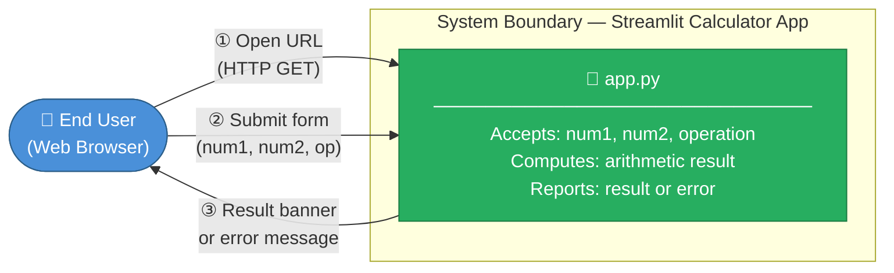

**Business context table:**

| Element | Description |
|---|---|
| **User** | Any person with a browser and network access to the Streamlit server port. |
| **System** | `app.py` — serves the UI and performs all computation in the same Python process. |
| **Input** | Two floating-point numbers + one operation selected from {Add, Subtract, Multiply, Divide}. |
| **Output** | Computed result in a success banner, or a division-by-zero error message. |
| **External interfaces** | None — no outbound HTTP calls, no database, no message queue. |

### 3.2 Technical Context

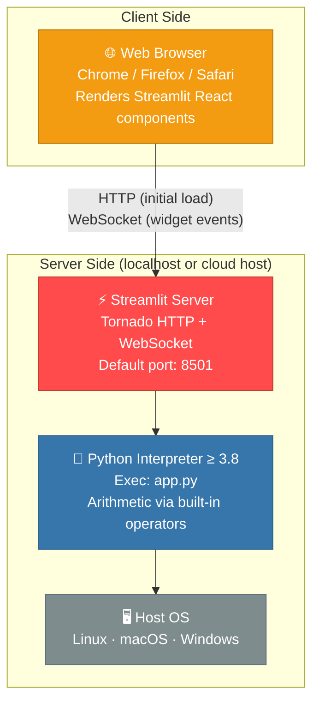

| Communication channel | Protocol | Notes |
|---|---|---|
| Browser ↔ Streamlit server | HTTP + WebSocket | Tornado serves the initial HTML; subsequent widget interactions use a persistent WebSocket connection. |
| Streamlit server ↔ Python | In-process function call | Streamlit calls `exec()` / re-runs `app.py` within the same process on each widget event. |
| Python ↔ OS | Standard process I/O | No file system access in this application. |

---

## 4. Solution Strategy

### 4.1 Technology Decisions

| Decision | Choice | Rationale |
|---|---|---|
| **UI + backend framework** | Streamlit ≥ 1.40.0 | Eliminates a separate frontend; Python-only development; rich built-in component library. |
| **Language** | Python | Streamlit is Python-native; arithmetic is a first-class language primitive. |
| **Arithmetic implementation** | Python built-in operators (`+`, `-`, `*`, `/`) | No external dependency needed for four-function arithmetic; IEEE 754 precision is sufficient. |
| **State management** | Streamlit's stateless re-run model | One form submission = one re-run; no cross-request session state required. |
| **Deployment** | `streamlit run app.py` locally; Streamlit Cloud for public hosting | Zero-config local start; one-click cloud deploy via GitHub integration. |

### 4.2 Top-Level Architectural Decomposition

The application deliberately uses a **flat, single-module design**. There are no layers, services,
or classes. The code maps to exactly four sequential concerns:

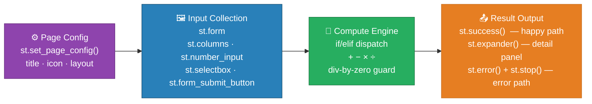

### 4.3 Quality Goal Approaches

| Quality Goal | Architectural Approach |
|---|---|
| **Correctness** | Python native floats; explicit `num2 == 0` guard before division; `st.stop()` halts execution on error to prevent `NameError` on the unset `result` variable. |
| **Usability** | `st.form` batches all inputs — no premature recalculation on keystroke; two-column layout; inline coloured feedback banners. |
| **Simplicity** | 50 lines, 0 classes, 1 dependency — any Python developer can read and understand the full application in under two minutes. |
| **Portability** | `pip install -r requirements.txt` + `streamlit run app.py` is the complete setup on any OS. |

---

## 5. Building Block View

### 5.1 Level 1 — System White-Box

At the highest level of abstraction the system is a single Python module executed by the Streamlit runtime.

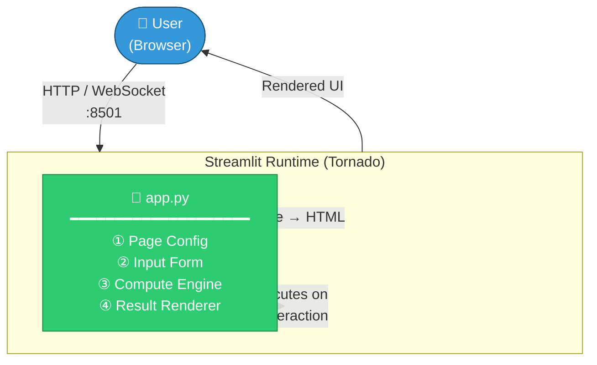

**Level 1 building blocks:**

| Block | Responsibility | Location in `app.py` |
|---|---|---|
| **Page Config** | Sets browser tab title (`Calculator`), emoji icon (`🧮`), and `centered` layout. | Line 3 |
| **Input Form** | Collects `num1`, `num2`, `operation`; batches submission via a single button. | Lines 8–22 |
| **Compute Engine** | Evaluates the selected operation; raises division-by-zero error path. | Lines 24–39 |
| **Result Renderer** | Displays result via `st.success()` and detail panel via `st.expander()`. | Lines 41–49 |

### 5.2 Level 2 — Internal Structure of `app.py`

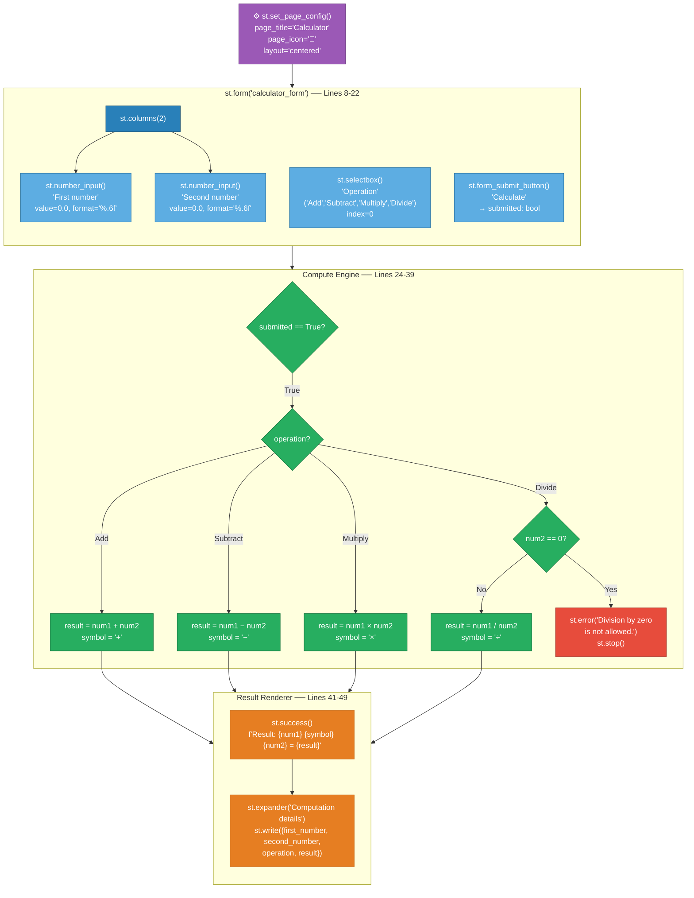

### 5.3 Level 3 — Data Flow

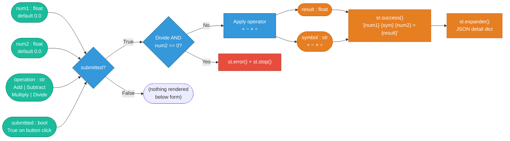

---

## 6. Runtime View

### 6.1 Scenario 1 — Successful Calculation (e.g., 6 ÷ 2 = 3)

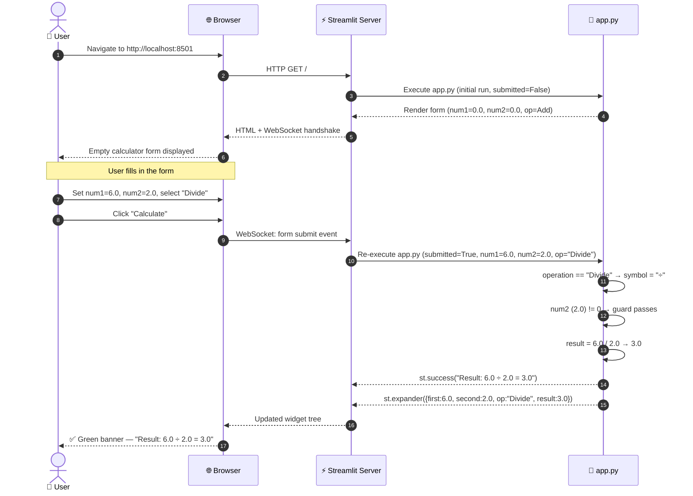

### 6.2 Scenario 2 — Division by Zero Error

```mermaid
sequenceDiagram
    autonumber
    actor User as 👤 User
    participant Browser as 🌐 Browser
    participant Server as ⚡ Streamlit Server
    participant App as 🐍 app.py

    User->>Browser: Set num1=5.0, num2=0.0, select "Divide"
    User->>Browser: Click "Calculate"
    Browser->>Server: WebSocket: form submit event
    Server->>App: Re-execute app.py (submitted=True, num1=5.0, num2=0.0, op="Divide")

    App->>App: operation == "Divide" → symbol = "÷"
    App->>App: num2 == 0 → ERROR GUARD triggered

    App-->>Server: st.error("Division by zero is not allowed.")
    App-->>Server: st.stop() — StopException raised; script halts here

    Note over App: Code below st.stop() is never reached
    Note over App: 'result' variable is never assigned
    Note over App: No NameError, no partial output

    Server-->>Browser: Updated widget tree (error banner only)
    Browser-->>User: 🔴 Red banner — "Division by zero is not allowed."
```

### 6.3 Scenario 3 — Page Refresh (State Reset)

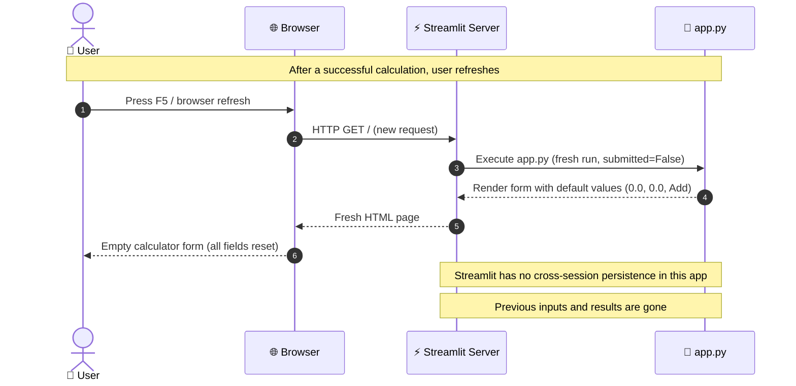

### 6.4 Streamlit Re-Run State Machine

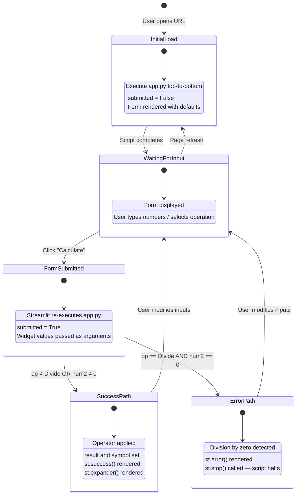

---

## 7. Deployment View

### 7.1 Local Development Deployment (Primary)

The documented and primary deployment mode is running the app directly from the command line on
a developer's machine.

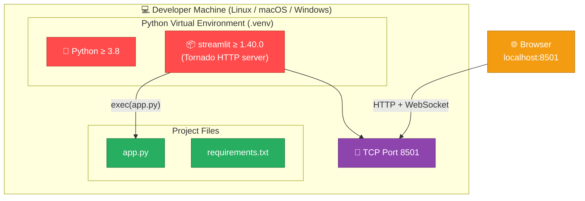

**Startup commands:**
```bash
# 1. Create and activate virtual environment (recommended)
python3 -m venv .venv
source .venv/bin/activate          # Linux / macOS
# .venv\Scripts\activate           # Windows

# 2. Install the single dependency
pip install -r requirements.txt

# 3. Start the app
streamlit run app.py
# Output:
#   Local URL:   http://localhost:8501
#   Network URL: http://<LAN-IP>:8501
```

### 7.2 Streamlit Community Cloud (Public Hosting)

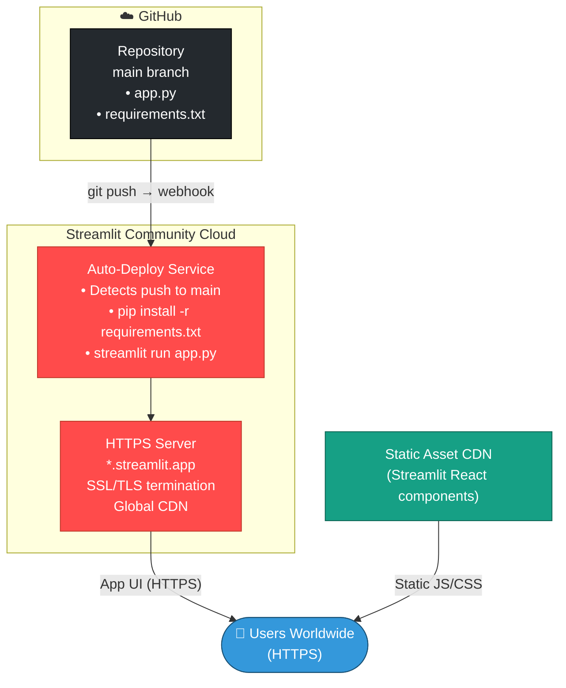

### 7.3 Docker / Container Deployment (Optional, Not Currently Implemented)

While no `Dockerfile` exists in the repository, the application is trivially containerisable:

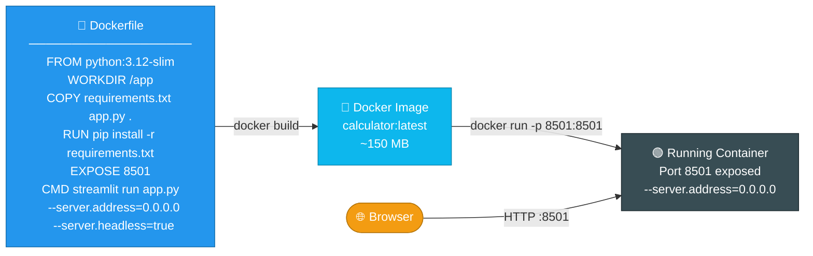

### 7.4 Deployment Requirements Matrix

| Requirement | Local Dev | Streamlit Cloud | Docker |
|---|---|---|---|
| Python version | ≥ 3.8 (host) | Managed by platform | Baked into image |
| Streamlit | `pip install` | Auto-installed | `pip install` in build |
| Port | 8501 (configurable) | 443 (HTTPS, managed) | 8501 (host-mapped) |
| Persistent storage | ❌ Not required | ❌ Not required | ❌ Not required |
| Authentication | ❌ None | ❌ None (public) | ⚠️ Via reverse proxy |
| HTTPS | ❌ Not configured | ✅ Automatic | ⚠️ Via reverse proxy |
| Memory footprint | ~50–100 MB | Managed | ~50–100 MB |
| Startup time | < 5 seconds | ~30–60 seconds | < 10 seconds |
| Multi-user support | ⚠️ Single session | ✅ Session isolation | ✅ Session isolation |

---

## 8. Cross-cutting Concepts

### 8.1 Domain Model

The following is a *logical* domain model. In the current implementation these entities are
implicit data flows within `app.py` rather than explicit Python classes.

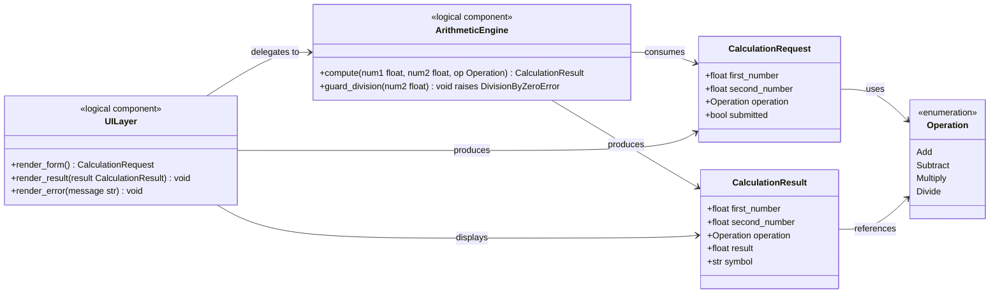

### 8.2 Error Handling Strategy

The application uses a **fail-fast, user-visible, halt-on-error** pattern:

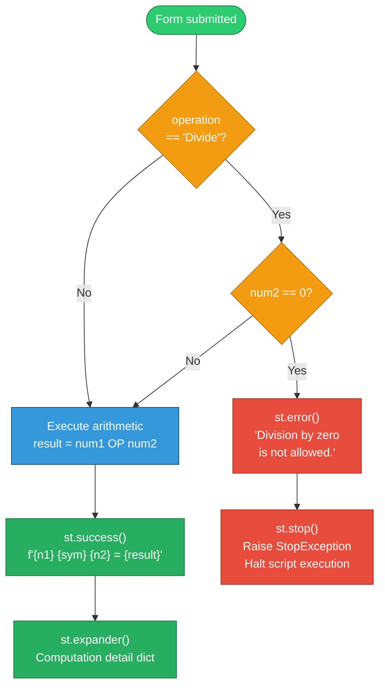

**Error handling principles applied:**
1. Only the division-by-zero case is currently guarded (the sole mathematically undefined operation in the four supported).
2. `st.error()` presents a human-readable message — no stack traces, no Python exception text.
3. `st.stop()` ensures the `result` variable (which was never assigned in the error branch) is never referenced, preventing a `NameError`.
4. All other float operations use Python's standard IEEE 754 semantics (overflow → `inf`, not a crash).

### 8.3 User Interface Patterns

| Pattern | Streamlit API | Purpose |
|---|---|---|
| **Form batching** | `st.form` + `st.form_submit_button` | All widget changes are collected silently; a single button click triggers the re-run. Prevents premature recalculation on every keystroke. |
| **Two-column layout** | `st.columns(2)` | Visually balances the two number inputs side by side, reducing vertical scrolling. |
| **Inline feedback** | `st.success()` / `st.error()` | Coloured contextual banners appear immediately below the form — no navigation or modal required. |
| **Progressive disclosure** | `st.expander("Computation details")` | Full breakdown (JSON dict) is hidden by default; revealed on demand to avoid clutter. |
| **Numeric precision** | `format="%.6f"` on `st.number_input` | Consistent 6-decimal display on both inputs prevents confusing rounding artefacts. |
| **Page branding** | `st.set_page_config(page_title, page_icon, layout)` | Sets browser tab title and emoji favicon; `layout="centered"` constrains content width for readability. |

### 8.4 Floating-Point Behaviour

The app uses Python's native `float` type — IEEE 754 double-precision (64-bit). Key characteristics:

| Aspect | Behaviour | Risk Level |
|---|---|---|
| Precision | ~15–17 significant decimal digits | ✅ Sufficient for a general calculator |
| Display precision | 6 decimal places (UI only) | ✅ Intentional by `format="%.6f"` |
| `0.1 + 0.2` | Returns `0.30000000000000004` | ⚠️ Classic float artefact; no mitigation currently |
| Overflow (e.g., `1e308 * 10`) | Returns `inf` — no exception | ⚠️ No user-visible guard |
| `nan` propagation | Arithmetic on `nan` returns `nan` | ⚠️ `st.number_input` prevents manual entry of `nan` but doesn't guard against edge cases |
| Division `/` | Python floor-free true division | ✅ Correct for all non-zero `num2` |

### 8.5 Security Concepts

| Concern | Current State | Recommendation |
|---|---|---|
| Input validation | Minimal — only `num2 == 0` for Divide | Add `math.isfinite()` guard for production use |
| Code injection | Not applicable — no `eval()`, no SQL, no shell exec | ✅ Safe by design |
| XSS / CSRF | Managed by Streamlit framework | ✅ No custom HTML/JS injected |
| Authentication | None — fully open | Acceptable for public/local tool; add Streamlit auth or reverse proxy for restricted deployments |
| HTTPS | Not configured locally | Streamlit Cloud provides HTTPS automatically; use `--server.sslCertFile` for self-hosted |
| Secrets / credentials | None used in this app | ✅ No secrets to manage |
| Rate limiting | None | Streamlit does not throttle; add a reverse proxy (nginx, Caddy) for production |

---

## 9. Architecture Decisions

### ADR-001 — Single-File Architecture

| Field | Value |
|---|---|
| **Status** | Accepted |
| **Context** | The application performs exactly four simple arithmetic operations. Separating concerns into multiple Python modules, packages, or architectural layers would create structural overhead that is entirely disproportionate to the actual feature set and codebase size. |
| **Decision** | All application logic is contained in a single file: `app.py` (~50 lines). |
| **Alternatives considered** | `calculator/ui.py` + `calculator/engine.py` package structure. |
| **Positive consequences** | ✅ Zero onboarding friction — any Python developer reads the full app in < 2 minutes. ✅ Single artefact to deploy, version, and maintain. |
| **Negative consequences** | ⚠️ Compute logic cannot be unit-tested without a running Streamlit context. ⚠️ Will become unwieldy if the feature set grows significantly. |

---

### ADR-002 — Streamlit as the Sole UI and Server Framework

| Field | Value |
|---|---|
| **Status** | Accepted |
| **Context** | A browser-accessible calculator UI is required with minimal development effort. Alternatives were evaluated: Flask + Jinja2 templates, FastAPI + HTMX, and a React SPA with a Python backend. |
| **Decision** | Use Streamlit ≥ 1.40.0 as the only framework — UI, server, and widget library in one. |
| **Positive consequences** | ✅ No HTML/CSS/JavaScript required. ✅ Complete app in ~50 lines of Python. ✅ Rich component library: `number_input`, `selectbox`, `form`, `columns`, `expander`, `success`, `error`. ✅ One-command deployment. |
| **Negative consequences** | ⚠️ Streamlit's re-run model is non-standard; developers unfamiliar with it may inadvertently introduce bugs. ⚠️ Limited UI customisation compared to a full frontend framework. ⚠️ Not suited for high-concurrency or complex multi-step stateful workflows. |

---

### ADR-003 — `st.form` for Input Batching

| Field | Value |
|---|---|
| **Status** | Accepted |
| **Context** | Without `st.form`, every keystroke in `st.number_input` triggers a full script re-run, causing premature and potentially flickering calculation results as the user is still typing. |
| **Decision** | Wrap all inputs (`num1`, `num2`, `operation`) inside `st.form("calculator_form")` with a single `st.form_submit_button("Calculate")`. |
| **Positive consequences** | ✅ Calculation happens only on explicit user intent (button click). ✅ No flickering or intermediate/nonsensical results mid-input. ✅ Clear user mental model: fill form, press button, see result. |
| **Negative consequences** | ⚠️ Slightly more verbose than bare widgets. |

---

### ADR-004 — Python Native Arithmetic (No Math Library)

| Field | Value |
|---|---|
| **Status** | Accepted |
| **Context** | Four-function arithmetic (add, subtract, multiply, divide) is a first-class Python language primitive. Adding NumPy, the `math` module, or a `decimal` library would add dependency weight without functional benefit at this scope. |
| **Decision** | Use Python's built-in `+`, `-`, `*`, `/` operators directly on `float` values. |
| **Positive consequences** | ✅ Zero additional dependencies beyond Streamlit. ✅ IEEE 754 double precision (64-bit) is adequate for a general-purpose calculator. |
| **Negative consequences** | ⚠️ Classic float representation issues (e.g., `0.1 + 0.2 ≠ 0.3` exactly). Use `decimal.Decimal` if arbitrary precision is required in a future iteration. |

---

### ADR-005 — `st.stop()` for Error-Path Termination

| Field | Value |
|---|---|
| **Status** | Accepted |
| **Context** | After displaying a division-by-zero error, the script would continue executing and reach `st.success(f"Result: {num1} {symbol} {num2} = {result}")`. Since `result` was never assigned in the error branch, this would raise a `NameError: name 'result' is not defined`. |
| **Decision** | Call `st.stop()` immediately after `st.error()` in the division-by-zero branch to halt script execution at that point. |
| **Positive consequences** | ✅ Prevents `NameError` and confusing partial UI rendering. ✅ Clean user experience — only the error banner is visible. ✅ `st.stop()` is the idiomatic Streamlit pattern for early exit. |
| **Negative consequences** | ⚠️ `st.stop()` raises `StopException` internally; adding bare `except Exception` blocks in future refactoring could silently swallow this. |

---

## 10. Quality Requirements

### 10.1 Quality Tree

```mermaid
graph TD
    classDef root fill:#2C3E50,stroke:#1A252F,color:#fff
    classDef q1 fill:#8E44AD,stroke:#6C3483,color:#fff
    classDef q2 fill:#2980B9,stroke:#1A5276,color:#fff
    classDef q3 fill:#27AE60,stroke:#1A7A42,color:#fff
    classDef q4 fill:#E67E22,stroke:#CA6F1E,color:#fff
    classDef q5 fill:#E74C3C,stroke:#A93226,color:#fff
    classDef leaf fill:#ECF0F1,stroke:#BDC3C7,color:#2C3E50

    ROOT["🏆 Quality Goals\nStreamlit Calculator App"]:::root

    ROOT --> CORR["✅ Correctness\n(Priority 1)"]:::q1
    ROOT --> USAB["👆 Usability\n(Priority 2)"]:::q2
    ROOT --> SIMP["🔧 Simplicity\n(Priority 3)"]:::q3
    ROOT --> PORT["📦 Portability\n(Priority 4)"]:::q4
    ROOT --> AVAIL["🟢 Availability\n(Priority 5)"]:::q5

    CORR --> C1["Arithmetic results\nmathematically correct\nfor valid inputs"]:::leaf
    CORR --> C2["Division-by-zero\ndetected and reported\ngracefully"]:::leaf
    CORR --> C3["No silent errors\nNo partial/misleading\nresults shown"]:::leaf

    USAB --> U1["Minimal friction:\n2-input form,\n1 button"]:::leaf
    USAB --> U2["Immediate inline\nfeedback (success\nor error)"]:::leaf
    USAB --> U3["Optional detail\npanel via expander"]:::leaf
    USAB --> U4["Accessible layout:\ncentred, 2-column\ninputs"]:::leaf

    SIMP --> S1["~50-line\nsingle file"]:::leaf
    SIMP --> S2["1 dependency\n(streamlit)"]:::leaf
    SIMP --> S3["0 classes, 0 DBs\n0 config files"]:::leaf

    PORT --> P1["Runs on Linux,\nmacOS, Windows"]:::leaf
    PORT --> P2["One-command\nstartup"]:::leaf
    PORT --> P3["Cloud-deployable\nwithout changes"]:::leaf

    AVAIL --> A1["Local: developer\nmachine uptime"]:::leaf
    AVAIL --> A2["Cloud: Streamlit\nCommunity Cloud SLA"]:::leaf
```

### 10.2 Quality Scenarios

| ID | Quality Attribute | Stimulus | Expected Response | Current Status |
|---|---|---|---|---|
| QS-01 | Correctness | `num1=10`, `num2=3`, op=`Divide` | Displays `3.333333` (6 d.p.) | ✅ Met |
| QS-02 | Correctness | `num1=5`, `num2=0`, op=`Divide` | Red error banner; no `result` shown | ✅ Met |
| QS-03 | Correctness | `num1=0.1`, `num2=0.2`, op=`Add` | Displays `0.300000` (rendered to 6 d.p. though internally `0.30000000000000004`) | ⚠️ Float artefact — cosmetically masked by 6 d.p. format |
| QS-04 | Usability | First-time user opens the app | Zero training needed; form is self-explanatory | ✅ Met |
| QS-05 | Usability | Submit form without changing defaults | Correctly displays `0.000000 + 0.000000 = 0.0` | ✅ Met |
| QS-06 | Simplicity | New developer reads `app.py` | Entire file understood in < 2 minutes | ✅ Met |
| QS-07 | Portability | Fresh macOS with Python 3.11 | `pip install … && streamlit run app.py` succeeds | ✅ Met |
| QS-08 | Correctness | `num1=1e308`, `num2=10`, op=`Multiply` | Returns `inf`; no crash but no user warning | ⚠️ No guard |

### 10.3 Code Metrics

| Metric | Value | Assessment |
|---|---|---|
| Lines of code (`app.py`) | 50 | ✅ Minimal — well below any complexity threshold |
| Number of Python functions | 0 | ℹ️ All logic is inline (acceptable at this scale) |
| Number of Python classes | 0 | ℹ️ None needed |
| Cyclomatic complexity | ~5 | ✅ Very low (one if/elif chain + one nested if) |
| Number of external dependencies | 1 (`streamlit`) | ✅ Minimum possible for this type of app |
| Test coverage | 0% | ❌ No automated tests |
| Documentation files | 1 (`README.md`) | ⚠️ Adequate for current scope |
| Import statements | 1 (`import streamlit as st`) | ✅ |

---

## 11. Risks and Technical Debt

### 11.1 Risk Register

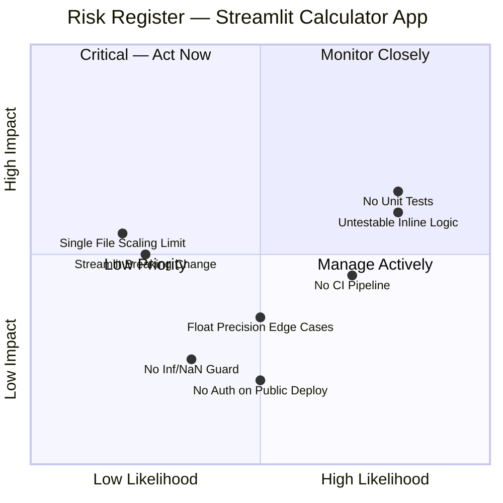

| ID | Risk | Likelihood | Impact | Mitigation |
|---|---|---|---|---|
| R-01 | **No unit tests** — regressions when adding operations or refactoring will go undetected | High | High | Extract compute logic into `engine.py`; add `pytest` test suite covering all four operations and the error path. |
| R-02 | **Compute logic is untestable** — arithmetic is inlined in UI code, requiring a live Streamlit context to test | High | Medium | Refactor: move `calculate(num1, num2, op)` to a separate pure function; test independently. |
| R-03 | **No CI pipeline** — no automated quality gate on pull requests | High | Medium | Add `.github/workflows/ci.yml` with `pip install`, `pytest`, and optionally `ruff`/`flake8`. |
| R-04 | **Float precision surprises** — `0.1 + 0.2 = 0.30000000000000004` may confuse users | Medium | Low | Document behaviour; optionally switch to `decimal.Decimal` for high-precision use cases. |
| R-05 | **Streamlit API drift** — minimum-version pin (`>=1.40.0`) allows untested major upgrades | Low | Medium | Pin exact version in production (`==x.y.z`); add a CI job to test new Streamlit releases. |
| R-06 | **No guard for `inf` / `nan`** — overflow results in `inf` with no user warning | Low | Low | Add `math.isfinite(num1) and math.isfinite(num2)` validation before computing. |
| R-07 | **Single-file architecture won't scale** — adding features (history, unit conversion, etc.) will make `app.py` unmaintainable | Low | Medium | Refactor into a `calculator/` package when ≥ 3 new features are planned. |
| R-08 | **No auth on public deployments** | Medium | Low | Acceptable for a public demo tool; add Streamlit auth or nginx basic auth for restricted use. |

### 11.2 Technical Debt Backlog

| ID | Debt Item | Effort | Priority |
|---|---|---|---|
| TD-01 | **Zero test coverage** — no `pytest` or any test suite exists | 1–2 days | 🔴 High |
| TD-02 | **Compute logic not unit-testable** — arithmetic inlined in Streamlit UI code | < 1 day | 🔴 High |
| TD-03 | **No CI/CD pipeline** — no GitHub Actions workflow for automated test/build/deploy | 0.5–1 day | 🟡 Medium |
| TD-04 | **Streamlit version not pinned** — `>=1.40.0` instead of `==x.y.z` | Minutes | 🟡 Medium |
| TD-05 | **No `inf` / `nan` input guard** — edge-case float results not caught | < 0.5 day | 🟡 Medium |
| TD-06 | **Hardcoded operation list** — adding Modulo, Power, Sqrt requires touching multiple lines in the if/elif chain | < 1 day | 🟡 Medium |
| TD-07 | **No calculation history** — previous results not retained within a session | 2–3 days | 🟢 Low |
| TD-08 | **No keyboard shortcut** — pressing Enter does not submit the form | < 0.5 day | 🟢 Low |
| TD-09 | **No `Dockerfile`** — containerisation is not formalised | < 0.5 day | 🟢 Low |

### 11.3 Recommended Refactoring — Extract the Compute Engine

The single highest-value improvement is separating arithmetic logic from the UI layer:

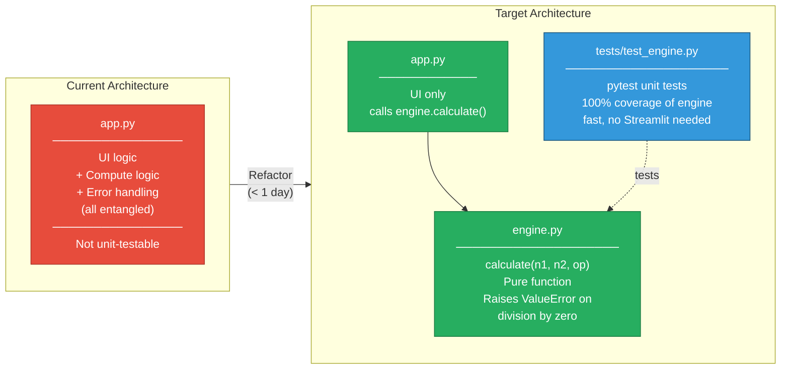

**Proposed `engine.py` interface:**
```python
# calculator/engine.py
from typing import Literal

Operation = Literal["Add", "Subtract", "Multiply", "Divide"]

SYMBOLS: dict[Operation, str] = {
    "Add": "+", "Subtract": "−", "Multiply": "×", "Divide": "÷"
}

def calculate(num1: float, num2: float, operation: Operation) -> tuple[float, str]:
    """Return (result, symbol). Raises ValueError on division by zero."""
    if operation == "Divide" and num2 == 0:
        raise ValueError("Division by zero is not allowed.")
    ops = {
        "Add":      num1 + num2,
        "Subtract": num1 - num2,
        "Multiply": num1 * num2,
        "Divide":   num1 / num2,
    }
    return ops[operation], SYMBOLS[operation]
```

---

## 12. Glossary

| Term | Definition |
|---|---|
| **`app.py`** | The single Python source file containing the entire Streamlit Calculator application (~50 lines). |
| **Arithmetic Engine** | The logical component (currently inline in `app.py`) responsible for evaluating arithmetic expressions. Implemented via Python built-in operators `+`, `-`, `*`, `/`. |
| **Division by Zero** | The mathematically undefined operation `n ÷ 0`. Detected with `if num2 == 0` and reported via `st.error()` + `st.stop()`. |
| **`float` / `float64`** | Python's native floating-point type; IEEE 754 double-precision 64-bit. Used for all numeric inputs and results in this application. |
| **Form Batching** | The pattern of wrapping multiple widgets inside `st.form()` so that all value changes are collected silently until the submit button is clicked, triggering a single re-run. |
| **Form Submit** | The user action of clicking the "Calculate" button; returns `submitted = True` and triggers a Streamlit re-run with the batched form input values. |
| **IEEE 754** | The international standard for floating-point arithmetic that defines `float`, `inf`, `-inf`, and `NaN` semantics. Python's `float` fully implements this standard. |
| **`inf`** | Positive infinity — the result of floating-point overflow (e.g., `1e308 * 10`). Python does not raise an exception; the value propagates silently. Not currently guarded in this app. |
| **`nan` (Not a Number)** | The IEEE 754 value for undefined float results. Arithmetic involving `nan` returns `nan`. The `st.number_input` widget prevents users from manually entering `nan`. |
| **Operation** | One of the four supported arithmetic operations: Add (`+`), Subtract (`−`), Multiply (`×`), Divide (`÷`). Presented to users as a `st.selectbox` dropdown. |
| **Re-run Model** | Streamlit's core execution model: the entire `app.py` script is re-executed from top to bottom on every user widget interaction (keystroke, selection change, button click). |
| **`st.columns()`** | A Streamlit layout function that divides the page into side-by-side columns. Used here to place `num1` and `num2` inputs side by side. |
| **`st.error()`** | A Streamlit function that renders a red-styled alert banner containing the provided error message. |
| **`st.expander()`** | A Streamlit widget that renders a labelled collapsible panel. Content inside is hidden by default and revealed when the user clicks the panel header. |
| **`st.form()`** | A Streamlit container widget that batches all enclosed widget interactions and defers re-runs until `st.form_submit_button()` is clicked. |
| **`st.number_input()`** | A Streamlit widget that renders a numeric input field with increment/decrement arrows. Returns a Python `float` value. |
| **`st.selectbox()`** | A Streamlit widget that renders a dropdown selector. Returns the currently selected option as a Python `str`. |
| **`st.set_page_config()`** | A Streamlit function (must be the first Streamlit call) that configures the browser tab title, favicon emoji, and page layout mode. |
| **`st.stop()`** | A Streamlit function that raises `streamlit.runtime.scriptrunner.StopException`, immediately halting script execution and preventing any further UI rendering. Idiomatic for early exit after an error. |
| **`st.success()`** | A Streamlit function that renders a green-styled success banner containing the provided message. |
| **Streamlit** | An open-source Python framework for building interactive web applications entirely in Python, without writing HTML, CSS, or JavaScript. Backed by a Tornado HTTP/WebSocket server. |
| **Streamlit Community Cloud** | Streamlit's free public hosting platform. Connects to GitHub repositories and auto-deploys the app on every push to the configured branch. Provides HTTPS automatically. |
| **`submitted`** | The `bool` return value of `st.form_submit_button()`. Evaluates to `True` only during the specific re-run triggered by the user clicking the submit button. |
| **Symbol** | A single Unicode character representing the arithmetic operation in the result display string: `+` (Add), `−` (Subtract), `×` (Multiply), `÷` (Divide). |
| **Tornado** | The Python asynchronous web framework used internally by Streamlit to serve HTTP requests and maintain persistent WebSocket connections to browser clients. |
| **Virtual Environment (`.venv`)** | An isolated Python environment created via `python3 -m venv .venv`. Recommended to keep the project's single dependency (`streamlit`) separate from the system Python. |
| **WebSocket** | The persistent, full-duplex communication protocol over a single TCP connection, used by Streamlit for real-time widget event delivery between the browser and the Tornado server. |

---

*— End of Arc42 Architecture Documentation —*

---

*📝 **Document metadata**:*  
*Generated by the Arc42 Documentation Generator for the **Streamlit Calculator App**.*  
*All diagrams are rendered with [Mermaid](https://mermaid.js.org/) — compatible with GitHub Markdown,*  
*VS Code (Markdown Preview Mermaid Support extension), IntelliJ, Obsidian, and most modern Markdown renderers.*  
*Source: `app.py` (50 lines) · `requirements.txt` (1 line) · `README.md` (17 lines)*
