# Architecture Documentation (Arc42)

**Project**: Streamlit Calculator App  
**Version**: 1.0.0  
**Date**: 2025-01-01  
**Generated by**: Arc42 Documentation Generator  
**Source Repository**: `xinni-cap/github-copilot-test`

---

## Table of Contents

1. [Introduction and Goals](#1-introduction-and-goals)
2. [Constraints](#2-constraints)
3. [Context and Scope](#3-context-and-scope)
4. [Solution Strategy](#4-solution-strategy)
5. [Building Block View](#5-building-block-view)
6. [Runtime View](#6-runtime-view)
7. [Deployment View](#7-deployment-view)
8. [Cross-cutting Concepts](#8-cross-cutting-concepts)
9. [Architecture Decisions](#9-architecture-decisions)
10. [Quality Requirements](#10-quality-requirements)
11. [Risks and Technical Debt](#11-risks-and-technical-debt)
12. [Glossary](#12-glossary)

---

## 1. Introduction and Goals

### 1.1 Requirements Overview

The Streamlit Calculator App is a lightweight, browser-based arithmetic calculator delivered as a single-page web application. It enables end-users to perform the four fundamental arithmetic operations — **Addition**, **Subtraction**, **Multiplication**, and **Division** — through a clean, form-driven user interface rendered entirely by the Streamlit framework.

The application was designed with the following primary objectives:

| # | Objective | Description |
|---|-----------|-------------|
| O-1 | Arithmetic correctness | Produce accurate results for all four operations across floating-point inputs |
| O-2 | Safe division | Detect and reject division-by-zero attempts with a clear user-facing error message |
| O-3 | Instant feedback | Return results to the user within the same page interaction (form submit) |
| O-4 | Transparency | Expose computation details (inputs, operation, result) via an expandable detail panel |
| O-5 | Minimal footprint | Rely on a single third-party dependency (`streamlit`) and a single source file |

### 1.2 Quality Goals

The following top-level quality goals, derived from the codebase and its constraints, drive the architecture:

| Priority | Quality Goal | Motivation |
|----------|-------------|------------|
| 1 | **Simplicity** | Single-file implementation; zero custom back-end logic beyond arithmetic |
| 2 | **Reliability** | Division-by-zero guard; Streamlit's reactive model prevents partial-state issues |
| 3 | **Usability** | Centered layout, labelled inputs, colour-coded success/error feedback |
| 4 | **Maintainability** | Pure Python; no database, no authentication, no stateful server-side logic |
| 5 | **Portability** | Runs on any Python ≥ 3.8 environment with a single `pip install` |

### 1.3 Stakeholders

| Stakeholder | Role | Expectations |
|-------------|------|--------------|
| End User | Operates the calculator in a browser | Fast, accurate arithmetic; clear error messages |
| Developer | Maintains and extends `app.py` | Readable code; easy local setup via `requirements.txt` |
| DevOps / Operator | Deploys and monitors the app | Simple startup command; minimal infrastructure dependencies |

---

## 2. Constraints

### 2.1 Technical Constraints

| ID | Constraint | Source | Rationale |
|----|-----------|--------|-----------|
| TC-1 | Python runtime required | `requirements.txt`, `README.md` | Streamlit is a Python-only framework |
| TC-2 | `streamlit >= 1.40.0` | `requirements.txt` | Only declared dependency; dictates UI model and server |
| TC-3 | Single-file application | `app.py` (50 lines) | All UI, logic, and routing live in one module |
| TC-4 | Stateless computation | `app.py` | No database, no session persistence beyond Streamlit's widget state |
| TC-5 | Browser-based UI | Streamlit framework | Requires a modern web browser to interact with the app |
| TC-6 | Port 8501 (default) | Streamlit default | The development server binds to `localhost:8501` by default |
| TC-7 | Floating-point arithmetic | `app.py` lines 12–14 | Inputs are typed `float` (`format="%.6f"`); subject to IEEE 754 precision |

### 2.2 Organizational Constraints

| ID | Constraint | Impact |
|----|-----------|--------|
| OC-1 | No CI/CD pipeline present in repo | Deployments are manual; no automated test execution |
| OC-2 | No automated test suite | Correctness is verified by manual testing only |
| OC-3 | No containerization artifacts (Dockerfile) | Deployment is developer-managed; no Docker-based reproducibility |
| OC-4 | README-only documentation | Operational knowledge is minimal and informally captured |

### 2.3 Conventions

| Convention | Description |
|-----------|-------------|
| PEP 8 | Standard Python style conventions apply |
| Streamlit form pattern | All inputs grouped inside `st.form()` to batch widget state updates |
| Column layout | Two-column layout (`st.columns(2)`) for number inputs for visual symmetry |

---

## 3. Context and Scope

### 3.1 Business Context

The calculator is a **self-contained utility application**. Its system boundary is narrow: it accepts two numeric inputs and an operation selector from a human user, executes Python built-in arithmetic, and returns a formatted result. There are no external systems, APIs, databases, or message queues involved.

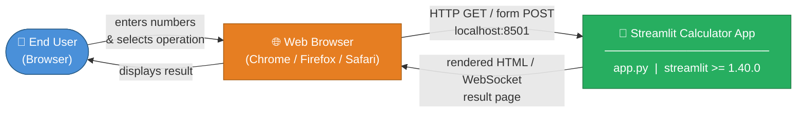

**System boundary**: everything within the `Streamlit Calculator App` box. The browser and the human user are external actors.

### 3.2 Technical Context

The application uses Streamlit's built-in HTTP + WebSocket server. There are no custom back-end endpoints, no external APIs, and no persistent storage.

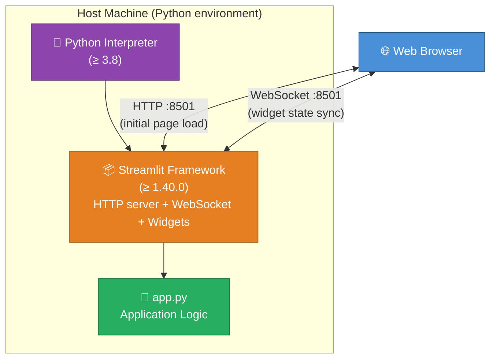

| Interface | Protocol | Direction | Description |
|-----------|----------|-----------|-------------|
| User ↔ Browser | Visual / Mouse / Keyboard | Bidirectional | Input entry and result reading |
| Browser ↔ Streamlit server | HTTP + WebSocket on port 8501 | Bidirectional | Page load, widget events, re-render |
| Streamlit ↔ app.py | Python function calls | Internal | Widget values passed as Python variables |

---

## 4. Solution Strategy

### 4.1 Technology Decisions

| Decision | Choice | Rationale |
|----------|--------|-----------|
| UI Framework | **Streamlit** | Eliminates the need for separate front-end code (HTML/CSS/JS); Python-native reactive UI |
| Language | **Python** | Ubiquitous, readable, native floating-point arithmetic |
| Application structure | **Single module** (`app.py`) | Problem domain is small; a monolithic script avoids over-engineering |
| State management | **Streamlit form widget state** | Batches all inputs before executing arithmetic; prevents partial computation |
| Error handling | **Inline guard + `st.stop()`** | Stops script execution on division-by-zero; prevents rendering a stale result |

### 4.2 Top-Level Decomposition Strategy

The application is intentionally **not decomposed** into layers, services, or modules — the domain is too small to justify it. The architecture follows a **script-oriented reactive UI** pattern:

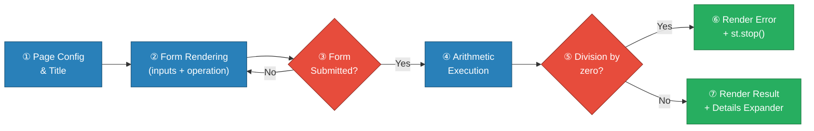

### 4.3 Approach to Quality Goals

| Quality Goal | Approach |
|-------------|----------|
| Simplicity | One file, one dependency, Streamlit handles all UI plumbing |
| Reliability | Explicit division-by-zero check; Streamlit reactive model re-runs script on every interaction |
| Usability | `st.success` / `st.error` colour feedback; `st.expander` for optional detail |
| Maintainability | Pure Python script; no frameworks, ORMs, or config files to maintain |
| Portability | `requirements.txt` pins only the minimum version; works on Linux/macOS/Windows |

---

## 5. Building Block View

### 5.1 Level 1 — System Context

At the highest level the system is a single deployable unit: the Streamlit process running `app.py`.

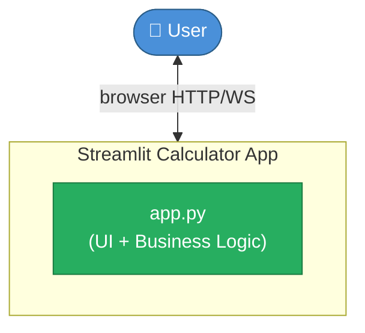

### 5.2 Level 2 — Internal Module Structure

Because the entire application lives in `app.py`, the logical internal decomposition maps to **functional regions** within the script rather than separate files or classes.

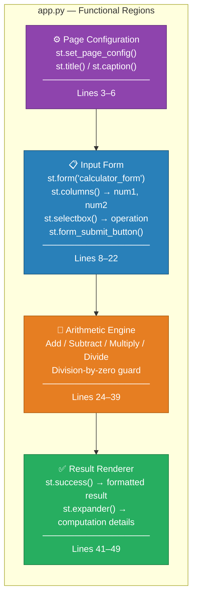

### 5.3 Level 3 — Detailed Component Responsibilities

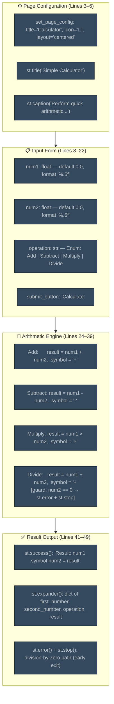

---

## 6. Runtime View

### 6.1 Scenario 1 — Successful Arithmetic Calculation

This is the happy-path scenario covering Add, Subtract, and Multiply operations (and Divide when the divisor is non-zero).

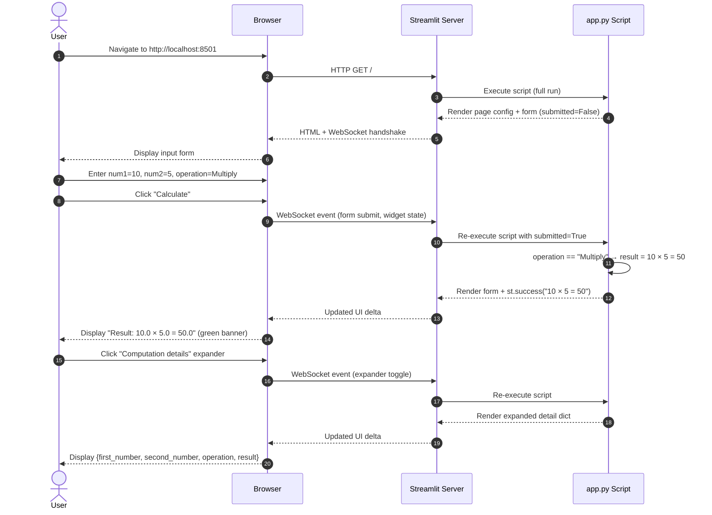

### 6.2 Scenario 2 — Division by Zero Error

```mermaid
sequenceDiagram
    autonumber
    actor User
    participant Browser
    participant Streamlit as Streamlit Server
    participant App as app.py Script

    User->>Browser: Enter num1=7, num2=0, operation=Divide
    User->>Browser: Click "Calculate"
    Browser->>Streamlit: WebSocket event (form submit)
    Streamlit->>App: Re-execute script with submitted=True

    App->>App: operation == "Divide"
    App->>App: num2 == 0 → True
    App-->>Streamlit: st.error("Division by zero is not allowed.")
    App->>App: st.stop() — halt script execution
    Streamlit-->>Browser: Updated UI (error banner only)
    Browser-->>User: Display red error message
    Note over App: Script halted by st.stop();\nno result or expander is rendered
```

### 6.3 Scenario 3 — Streamlit Reactive Re-run Lifecycle

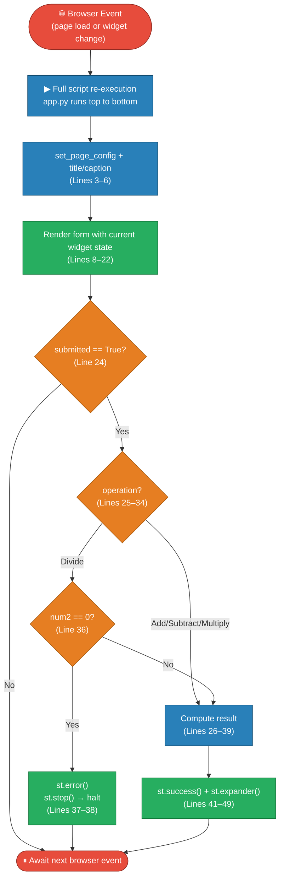

---

## 7. Deployment View

### 7.1 Infrastructure Overview

The application has a minimal single-tier deployment footprint. The Streamlit server, application logic, and static asset serving all run within a single OS process on the host machine.

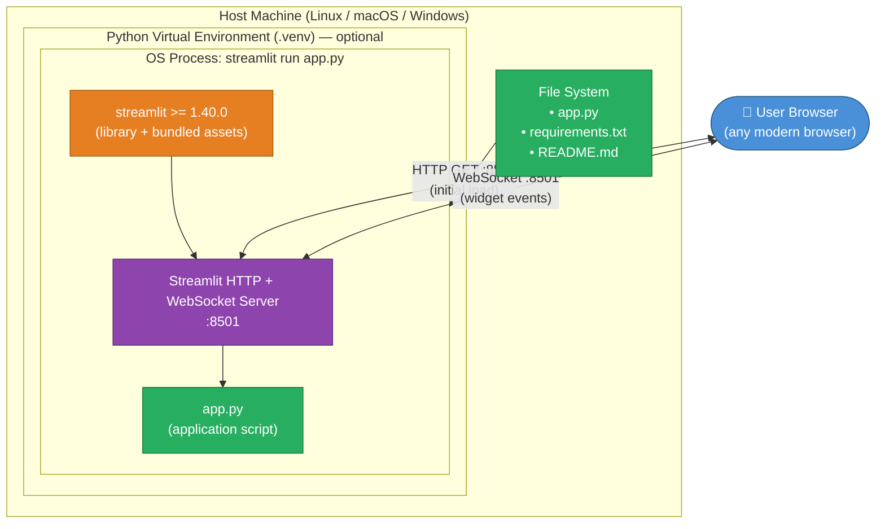

### 7.2 Deployment Steps

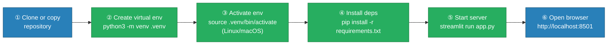

### 7.3 Deployment Topology Summary

| Aspect | Current State | Notes |
|--------|-------------|-------|
| Deployment model | Single-process, single-host | No containerization |
| Network exposure | `localhost:8501` (default) | Use `--server.address=0.0.0.0` for LAN access |
| Process manager | None | Manual start via CLI |
| Persistence | None | Stateless; no files written at runtime |
| Scalability | Single instance | No native horizontal scaling |
| OS compatibility | Linux, macOS, Windows | Any OS with Python ≥ 3.8 |
| Start command | `streamlit run app.py` | As documented in `README.md` |

---

## 8. Cross-cutting Concepts

### 8.1 Domain Model

The core domain is **arithmetic computation over real numbers**. The domain model is intentionally flat — there are no entities, aggregates, or repositories.

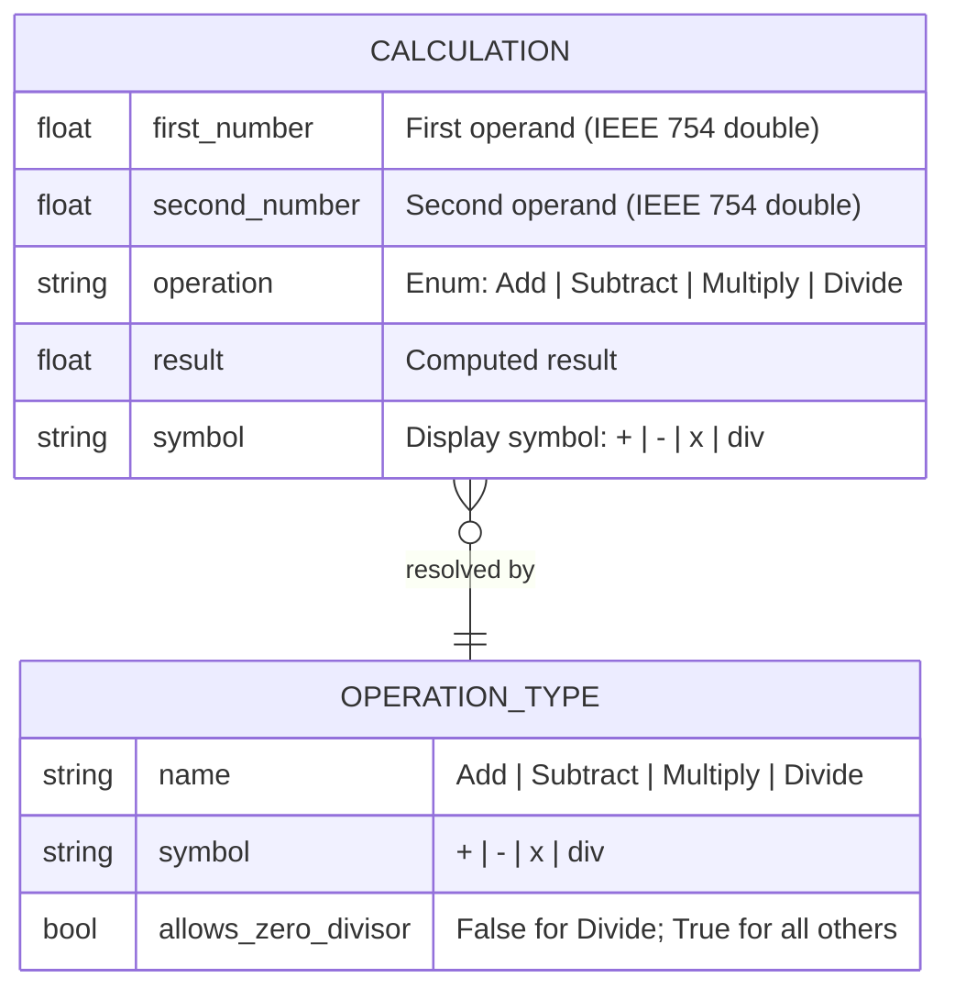

### 8.2 Business Rules

| Rule ID | Rule | Code Location | Enforcement Mechanism |
|---------|------|--------------|----------------------|
| BR-1 | Division by zero is prohibited | `app.py` lines 36–38 | `if num2 == 0: st.error(...); st.stop()` |
| BR-2 | All inputs are floating-point numbers | `app.py` lines 12–14 | `st.number_input(format="%.6f")` returns `float` |
| BR-3 | Operation must be one of four defined values | `app.py` lines 16–20 | `st.selectbox` with fixed tuple; no free-text entry |
| BR-4 | Calculation triggers only on explicit submit | `app.py` lines 22–24 | `st.form_submit_button` gates the `if submitted:` block |
| BR-5 | Result is shown with full equation context | `app.py` line 41 | `f"Result: {num1} {symbol} {num2} = {result}"` |

### 8.3 Error Handling Concept

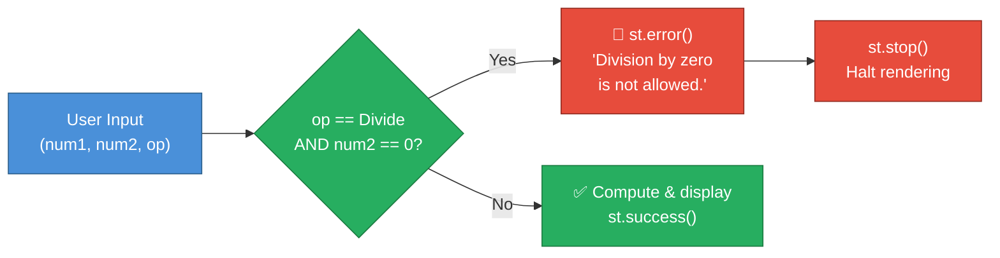

**Error handling philosophy**: The application applies *fail-fast with user-visible feedback*. There is no silent failure — the error banner is prominently displayed in red and the script is halted via `st.stop()` to prevent any stale or partial state from rendering.

### 8.4 UI / UX Concepts

| Concept | Implementation | Benefit |
|---------|---------------|---------|
| Form batching | `st.form()` groups all inputs | Prevents re-calculation on each keystroke |
| Two-column input layout | `st.columns(2)` | Visual alignment of num1 / num2 side-by-side |
| Colour-coded feedback | `st.success` (green) / `st.error` (red) | Instant visual distinction between success and failure |
| Progressive disclosure | `st.expander("Computation details")` | Advanced detail hidden by default; available on demand |
| Centred layout | `layout="centered"` in `set_page_config` | Focused, single-column experience on all screen sizes |
| Numeric precision display | `format="%.6f"` on inputs | Consistent 6 decimal place display for float inputs |

### 8.5 Numeric Precision Concept

All arithmetic uses **Python's native `float` type** (IEEE 754 double-precision, 64-bit). This implies:

- Numbers are displayed to 6 decimal places in input fields (`format="%.6f"`)
- Results inherit standard floating-point rounding behaviour (e.g., `0.1 + 0.2 ≠ 0.3` exactly)
- No arbitrary-precision or `decimal.Decimal`-safe arithmetic is applied
- The division-by-zero guard uses **exact equality** (`num2 == 0`), not a near-zero tolerance

---

## 9. Architecture Decisions

### ADR-001: Use Streamlit as the Sole UI Framework

| Attribute | Value |
|-----------|-------|
| **Status** | Accepted |
| **Context** | A web UI is needed for a simple arithmetic calculator |
| **Alternatives considered** | Flask + Jinja2, FastAPI + React, raw HTML/JS |

**Decision**: Use **Streamlit ≥ 1.40.0** as the only dependency.

**Rationale**:
- Eliminates all front-end tooling (npm, webpack, HTML templates)
- Provides reactive widget state management out-of-the-box
- Entire UI is expressed in Python, keeping the codebase in a single language
- `pip install streamlit` is the only installation step

**Consequences**:
- ✅ Zero HTML/CSS/JavaScript written
- ✅ Reactive re-run model handles state automatically
- ⚠️ Streamlit's opinionated rendering model limits fine-grained UI control
- ⚠️ Not suited for high-concurrency production workloads without additional infrastructure (e.g., reverse proxy, multiple workers)

---

### ADR-002: Single-File Architecture

| Attribute | Value |
|-----------|-------|
| **Status** | Accepted |
| **Context** | The application scope is a four-operation calculator with no persistence, authentication, or external integrations |

**Decision**: Implement everything in **one Python file** (`app.py`, ~50 lines).

**Rationale**: The domain complexity does not justify separate modules, packages, or layered architecture. A single file maximises readability and minimises cognitive overhead for a utility-scale application.

**Consequences**:
- ✅ Trivial to read, understand, and modify
- ✅ No import management, package structure, or `__init__.py` overhead
- ⚠️ Will require refactoring if scope expands significantly (e.g., history, scientific functions, API endpoints)

---

### ADR-003: Inline Division-by-Zero Guard with `st.stop()`

| Attribute | Value |
|-----------|-------|
| **Status** | Accepted |
| **Context** | Division by zero must be gracefully handled |

**Decision**: Check `num2 == 0` before dividing; call `st.error()` then `st.stop()`.

**Rationale**:
- `st.stop()` prevents all downstream `st.*` calls from executing, avoiding a blank or partial UI
- `st.error()` uses Streamlit's native error styling, consistent with the framework's UX patterns
- Avoids `try/except ZeroDivisionError` for a condition that is knowable before execution

**Consequences**:
- ✅ Clean, user-visible error with no Python traceback exposed to the user
- ✅ No partial or stale result rendered after an error
- ⚠️ `num2 == 0` is an exact float equality check — very small floats near zero are not caught

---

### ADR-004: Use `st.form()` to Batch Input Submission

| Attribute | Value |
|-----------|-------|
| **Status** | Accepted |
| **Context** | Without a form, Streamlit re-runs the script on every widget change (each keystroke or dropdown selection), causing premature arithmetic |

**Decision**: Wrap all inputs inside `st.form("calculator_form")` with a single `st.form_submit_button`.

**Rationale**: The form pattern ensures arithmetic is executed only when the user explicitly clicks "Calculate", providing a familiar, intentional interaction model akin to a native desktop app.

**Consequences**:
- ✅ No spurious calculations on partial input
- ✅ Familiar "fill then submit" UX pattern
- ⚠️ Slightly more verbose widget declaration than raw individual widgets

---

## 10. Quality Requirements

### 10.1 Quality Tree

```mermaid
graph TD
    classDef root fill:#2C3E50,stroke:#1A252F,color:#fff
    classDef category fill:#2980B9,stroke:#1A5276,color:#fff
    classDef good fill:#27AE60,stroke:#1A7A40,color:#fff
    classDef risk fill:#E74C3C,stroke:#922B21,color:#fff
    classDef warn fill:#E67E22,stroke:#A85A0D,color:#fff

    ROOT["🏆 Quality\nStreamlit Calculator App"]:::root

    ROOT --> FUNC["⚙️ Functional Suitability"]:::category
    ROOT --> PERF["⚡ Performance Efficiency"]:::category
    ROOT --> USE["🎨 Usability"]:::category
    ROOT --> MAINT["🔧 Maintainability"]:::category
    ROOT --> PORT["📦 Portability"]:::category
    ROOT --> REL["🛡️ Reliability"]:::category

    FUNC --> F1["All four arithmetic ops\ncorrectly implemented ✅"]:::good
    FUNC --> F2["Division-by-zero\ndetected and reported ✅"]:::good
    FUNC --> F3["No test suite to verify\ncorrectness automatically ⚠️"]:::risk

    PERF --> P1["Result in one\nStreamlit re-run cycle ✅"]:::good
    PERF --> P2["No I/O calls — pure\nin-memory arithmetic ✅"]:::good

    USE --> U1["Colour-coded feedback\ngreen/red banners ✅"]:::good
    USE --> U2["Progressive disclosure\nvia expander ✅"]:::good
    USE --> U3["Centred, responsive\nlayout ✅"]:::good

    MAINT --> M1["Single-file, 50 lines ✅"]:::good
    MAINT --> M2["No type annotations ⚠️"]:::warn
    MAINT --> M3["No automated tests ⚠️"]:::risk

    PORT --> PT1["Linux / macOS / Windows\nPython ≥ 3.8 ✅"]:::good
    PORT --> PT2["No Dockerfile ⚠️"]:::warn

    REL --> R1["Fail-fast error handling\nst.stop() ✅"]:::good
    REL --> R2["Exact float equality\nfor zero — edge case ⚠️"]:::warn
```

### 10.2 Quality Scenarios

| ID | Quality Attribute | Scenario | Expected Response | Current Status |
|----|-----------------|----------|------------------|----------------|
| QS-1 | Correctness | User computes `7 ÷ 2` | Result displays `3.5` | ✅ Met |
| QS-2 | Reliability | User attempts `5 ÷ 0` | Red error banner; no result rendered | ✅ Met |
| QS-3 | Performance | User submits any operation | Result appears within <1 s on localhost | ✅ Met (pure in-memory) |
| QS-4 | Usability | User wants to inspect inputs | Expander reveals `{first_number, second_number, operation, result}` | ✅ Met |
| QS-5 | Maintainability | Developer adds Modulo operation | Requires <5 lines of change in `app.py` | ✅ Achievable |
| QS-6 | Portability | Deployment on a new machine | `pip install -r requirements.txt && streamlit run app.py` | ✅ Met |
| QS-7 | Testability | Automated regression test for arithmetic | No test suite exists | ⚠️ Gap |
| QS-8 | Precision | User computes `0.1 + 0.2` | May display `0.300000` (IEEE 754) | ⚠️ Known limitation |

---

## 11. Risks and Technical Debt

### 11.1 Risk Register

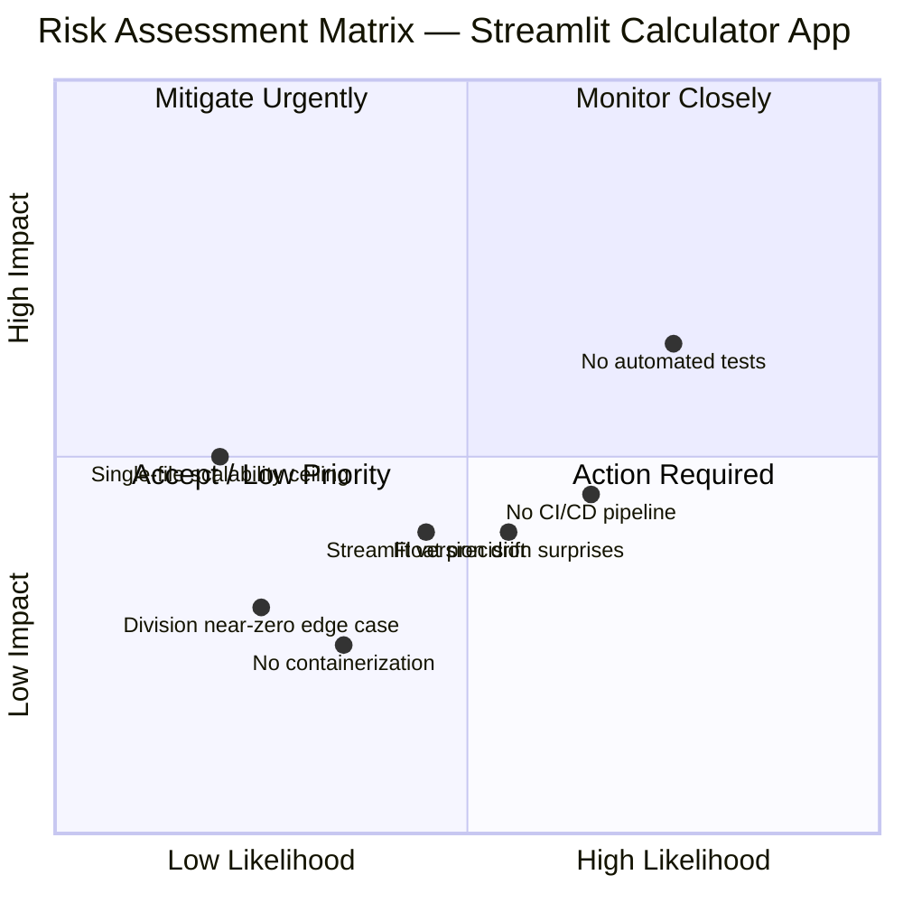

### 11.2 Detailed Risk Items

| ID | Risk | Likelihood | Impact | Description | Recommended Mitigation |
|----|------|-----------|--------|-------------|------------------------|
| R-1 | **No automated test suite** | High | High | Arithmetic correctness and error paths are not regression-tested. Any future change risks silent breakage. | Add `pytest` unit tests for each operation and the division-by-zero guard; target 100% branch coverage for arithmetic logic |
| R-2 | **Floating-point precision surprises** | Medium | Medium | IEEE 754 arithmetic produces inexact results for some decimal inputs (e.g., `0.1 + 0.2 → 0.30000000000000004`). No rounding applied to display. | Use `round(result, 10)` for display, or switch to `decimal.Decimal` for exact decimal arithmetic |
| R-3 | **Streamlit version drift** | Medium | Medium | `streamlit >= 1.40.0` allows any future Streamlit version. A breaking API change could silently break the app on the next `pip install`. | Pin to a specific version (e.g., `streamlit==1.40.0`) and configure Dependabot for automated update PRs |
| R-4 | **No CI/CD pipeline** | High | Medium | No automated checks run on push; bugs can be merged without visibility. | Add a GitHub Actions workflow that lints (`flake8`/`ruff`) and runs tests on every PR |
| R-5 | **No containerization** | Low | Low | Deployment depends on the operator's local Python environment, creating "works on my machine" risk. | Add a `Dockerfile` and optionally a `docker-compose.yml` for reproducible deployments |
| R-6 | **Single-file scalability ceiling** | Low | Medium | If the app grows (history, multiple pages, API endpoints), the single-file pattern becomes unmanageable. | Establish a package layout (`calculator/logic.py`, `calculator/ui.py`) before scope expands |
| R-7 | **Exact zero check for division guard** | Low | Low | `num2 == 0` only catches exact IEEE 754 zero. Very small floats (e.g., `1e-300`) yield near-infinite results without warning. | Add a tolerance-based guard: `abs(num2) < 1e-15` with a suitable warning message |

### 11.3 Technical Debt Summary

| Debt Item | Category | Estimated Effort | Priority |
|-----------|---------|-----------------|----------|
| No unit tests | Testing | Low (1–2 hours) | 🔴 High |
| No CI/CD pipeline (GitHub Actions) | DevOps | Medium (2–4 hours) | 🟠 Medium |
| No pinned Streamlit version | Dependency management | Trivial (5 minutes) | 🟠 Medium |
| No type annotations (`num1: float`, etc.) | Code quality | Low (30 minutes) | 🟡 Low |
| No Dockerfile | Infrastructure | Low (1 hour) | 🟡 Low |
| No `__main__` guard or function extraction | Code structure | Low (30 minutes) | 🟡 Low |
| No `.github/dependabot.yml` | Dependency management | Trivial (10 minutes) | 🟡 Low |

---

## 12. Glossary

| Term | Definition |
|------|-----------|
| **Arc42** | A pragmatic, lightweight template for software and system architecture documentation structured into 12 sections; see [arc42.org](https://arc42.org) |
| **Arithmetic Engine** | The logical region of `app.py` (lines 25–39) that evaluates the selected operation (`+`, `-`, `×`, `÷`) on the two input numbers |
| **Business Rule** | A specific constraint or requirement that the application must enforce; for this system, the primary rule is the prohibition of division by zero (BR-1) |
| **Division by Zero** | The mathematically undefined result of dividing any number by zero; detected at runtime by `if num2 == 0` and handled with `st.error()` + `st.stop()` |
| **IEEE 754** | The international standard for floating-point arithmetic used by most processors and languages; governs how Python's `float` type stores and computes decimal numbers, including rounding behaviour |
| **Reactive Re-run** | Streamlit's execution model: the entire `app.py` script is re-executed from top to bottom every time a browser widget event (page load, form submit, expander toggle) is received |
| **`st.error()`** | A Streamlit function that renders a red-background error banner in the browser |
| **`st.expander()`** | A Streamlit function that renders a collapsible UI section; used here to show computation details on demand |
| **`st.form()`** | A Streamlit container that batches all enclosed widget changes and submits them together on a single button click, preventing intermediate re-runs |
| **`st.number_input()`** | A Streamlit widget that renders a numeric input field; returns a Python `float` value |
| **`st.selectbox()`** | A Streamlit widget that renders a dropdown selector; returns the selected option as a Python `str` |
| **`st.stop()`** | A Streamlit function that immediately halts the execution of the current script run, preventing any further UI elements from being rendered |
| **`st.success()`** | A Streamlit function that renders a green-background success banner in the browser |
| **Streamlit** | An open-source Python framework (https://streamlit.io) for building interactive data and utility web applications using only Python, without requiring HTML, CSS, or JavaScript |
| **Widget State** | The current values of all Streamlit input widgets (e.g., `num1`, `num2`, `operation`, `submitted`) that are maintained by the Streamlit server between script re-runs via session state |
| **WebSocket** | A full-duplex communication protocol over a persistent TCP connection; used by Streamlit to synchronise widget state changes between the browser client and the Python server without full page reloads |

---

*This document was generated by the **Arc42 Documentation Generator** agent based on static analysis of the repository source files: `app.py`, `requirements.txt`, and `README.md`.*

*Analysis sources: direct code inspection of `app.py` (50 lines), `requirements.txt` (1 dependency), `README.md` (setup/run instructions).*
