# Architecture Documentation (Arc42)

**Project**: Streamlit Calculator App  
**Version**: 1.0.0  
**Date**: 2025-01-01  
**Generated by**: Arc42 Documentation Generator  
**Source Repository**: `/home/runner/work/github-copilot-test/github-copilot-test`

> **ℹ️ Note for operators**: Move this file to `docs/arc42.md` with:
> ```bash
> mkdir -p docs && mv arc42.md docs/arc42.md
> ```

---

## Table of Contents

1. [Introduction and Goals](#1-introduction-and-goals)
2. [Architecture Constraints](#2-architecture-constraints)
3. [System Scope and Context](#3-system-scope-and-context)
4. [Solution Strategy](#4-solution-strategy)
5. [Building Block View](#5-building-block-view)
6. [Runtime View](#6-runtime-view)
7. [Deployment View](#7-deployment-view)
8. [Cross-cutting Concepts](#8-cross-cutting-concepts)
9. [Architecture Decisions](#9-architecture-decisions)
10. [Quality Requirements](#10-quality-requirements)
11. [Risks and Technical Debt](#11-risks-and-technical-debt)
12. [Glossary](#12-glossary)

---

## 1. Introduction and Goals

### 1.1 Overview

The **Streamlit Calculator App** is a lightweight, single-page web application that provides users with a clean, browser-based interface to perform the four fundamental arithmetic operations: **addition**, **subtraction**, **multiplication**, and **division**. The application is implemented as a single Python source file (`app.py`) using the [Streamlit](https://streamlit.io/) framework, which handles all UI rendering, state management, and HTTP serving without requiring a separate backend service or database.

The primary goal of this application is to demonstrate a minimal but complete Streamlit application pattern — form submission, input validation, error handling, and result presentation — while remaining approachable for developers new to Streamlit or Python web development.

### 1.2 Business Goals and Objectives

| ID | Goal | Description |
|----|------|-------------|
| G-01 | Provide arithmetic computation | Enable users to add, subtract, multiply, and divide two numbers via a web browser |
| G-02 | Graceful error handling | Prevent crashes by detecting and communicating invalid inputs (e.g., division by zero) |
| G-03 | Transparency of computation | Show users the full details of each computation through an expandable detail panel |
| G-04 | Zero-friction setup | Allow any developer to run the app with a single command after installing one dependency |
| G-05 | Clean UI experience | Present a tidy, centered, form-based layout using Streamlit's native column system |

### 1.3 Quality Goals

The following top-level quality goals drive architectural decisions, listed in priority order:

| Priority | Quality Goal | Motivation |
|----------|-------------|------------|
| 1 | **Simplicity** | The entire application is a single file; the architecture must not add unnecessary complexity |
| 2 | **Usability** | The UI must be immediately understandable without documentation or training |
| 3 | **Reliability** | All edge cases (especially division by zero) must be handled gracefully, never producing unhandled exceptions visible to the user |
| 4 | **Maintainability** | New arithmetic operations or UI changes should require minimal code modification |
| 5 | **Portability** | The app must run on any platform where Python 3 and pip are available |

### 1.4 Stakeholders

| Role | Name / Group | Expectation |
|------|-------------|-------------|
| End User | Any browser user | A functional, intuitive calculator accessible via web URL |
| Developer | Python / Streamlit developer | Clean, readable source code that is easy to extend or fork |
| DevOps / Operator | System administrator | Simple deployment requiring only `pip install` and `streamlit run` |
| Reviewer / Evaluator | Code reviewers, interview panels | A well-structured example of Streamlit application patterns |

---

## 2. Architecture Constraints

### 2.1 Technical Constraints

| ID | Constraint | Rationale |
|----|-----------|-----------|
| TC-01 | **Python 3** is the sole implementation language | Streamlit is a Python-native framework; no JavaScript or TypeScript written by the developer |
| TC-02 | **Streamlit ≥ 1.40.0** is the only declared dependency | Defined in `requirements.txt`; keeps the dependency footprint minimal |
| TC-03 | **No persistent storage** | The app is stateless; no database, file system writes, or session persistence |
| TC-04 | **No backend API layer** | All logic executes inside the Streamlit server-side script; no REST, GraphQL, or RPC layer |
| TC-05 | **Single-file architecture** | All application code resides in `app.py`; no multi-module package structure |
| TC-06 | **Streamlit re-execution model** | The entire `app.py` script re-executes top-to-bottom on every user interaction; no persistent in-memory state between runs |

### 2.2 Organizational Constraints

| ID | Constraint | Rationale |
|----|-----------|-----------|
| OC-01 | **Minimal dependency footprint** | Only one third-party library; reduces supply-chain risk and onboarding friction |
| OC-02 | **Self-contained repository** | Runnable from a fresh clone with two commands (`pip install -r requirements.txt` then `streamlit run app.py`) |
| OC-03 | **No authentication or authorization** | Public calculator; no user accounts or permissions required |

### 2.3 Conventions

| ID | Convention | Description |
|----|-----------|-------------|
| CV-01 | **Streamlit form pattern** | All user inputs wrapped in `st.form` to batch widget state, avoiding partial re-renders |
| CV-02 | **Column-based layout** | `st.columns(2)` positions the two numeric inputs side-by-side |
| CV-03 | **`st.stop()` for early exit** | Division-by-zero handled by `st.error(...)` followed by `st.stop()`, halting execution cleanly |
| CV-04 | **6-decimal float precision** | Both number inputs use `format="%.6f"` for consistent display |

---

## 3. System Scope and Context

### 3.1 Business Context

The Streamlit Calculator App is a **self-contained, single-tier web application** with no external system dependencies. The only external entities are the user's web browser and the host machine providing the Python runtime.

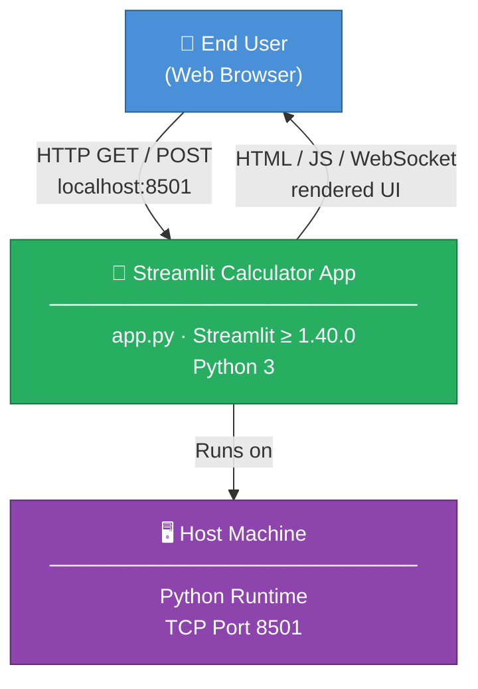

> **Figure 3.1** — Business context diagram. The calculator is the sole system; the browser and host machine are the only external entities. No external APIs or data stores exist.

### 3.2 Technical Context

This diagram shows the technical communication paths between the user's browser and the Streamlit runtime, including the WebSocket channel used for reactive UI updates.

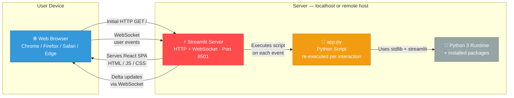

> **Figure 3.2** — Technical context. HTTP handles the initial page load; subsequent interactions travel via WebSocket using Streamlit's protobuf delta protocol.

### 3.3 External Interfaces Summary

| Interface | Direction | Protocol | Description |
|-----------|-----------|----------|-------------|
| Browser ↔ Streamlit Server | Bidirectional | HTTP + WebSocket | Initial load over HTTP; interactive events via WebSocket |
| User ↔ Browser | Input | Mouse / Keyboard | Number entry, operation selection, form submission |

> **No** external API calls, database connections, file I/O, or third-party service integrations exist.

---

## 4. Solution Strategy

### 4.1 Technology Decision Summary

The architecture follows a deliberate **minimum-viable-complexity** strategy:

| Decision | Choice | Rationale |
|----------|--------|-----------|
| Web framework | Streamlit | Single Python file serves as both UI definition and logic; no separate frontend build step or API layer needed |
| Language | Python 3 | Native Streamlit language; widely available and sufficient for arithmetic operations |
| State model | Stateless / script re-execution | Streamlit's model re-runs the script per event; no custom state management needed for a single-form calculator |
| Input batching | `st.form` | Prevents partial re-renders while typing; computation only runs on explicit "Calculate" press |
| Error strategy | Guard clause + `st.stop()` | Handles the sole error condition (divide-by-zero) without `try/except` noise |
| Persistence | None | No history needed; eliminates an entire tier of complexity |

### 4.2 Logical Layer Decomposition

Despite residing in a single file, the application decomposes into three logical layers:

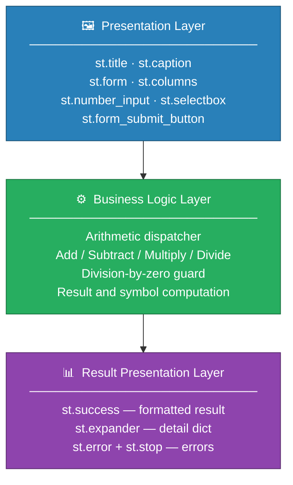

> **Figure 4.1** — Logical layer decomposition within `app.py`.

### 4.3 Quality Goal Strategies

| Quality Goal | Approach |
|-------------|----------|
| **Simplicity** | Single file, single dependency, no build step, no config files |
| **Usability** | Streamlit's widget system provides accessible, mobile-friendly UI; emoji favicon and descriptive title aid orientation |
| **Reliability** | Explicit `num2 == 0` guard before division; `st.stop()` prevents all downstream rendering after an error |
| **Maintainability** | A new operation requires one `elif` branch and one selectbox entry; no architectural changes |
| **Portability** | Pure Python + one pip package; runs on Linux, macOS, and Windows without modification |

---

## 5. Building Block View

### 5.1 Level 1 — Whitebox: Overall System

The system is a single deployable process. Internally it consists of four logical building blocks that execute sequentially on each script run.

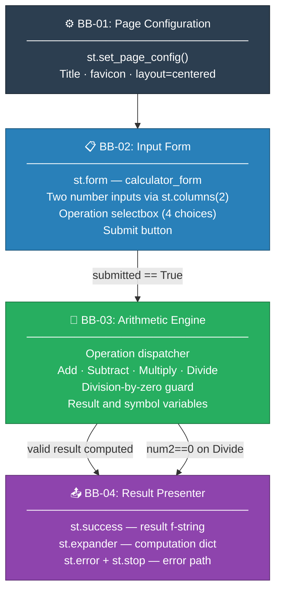

> **Figure 5.1** — Level 1 building block view. Boxes are logical groupings within `app.py`. Arrows show execution and data flow.

### 5.2 Level 2 — Whitebox: Arithmetic Engine (BB-03)

The arithmetic engine contains all conditional logic. It dispatches on the `operation` string and enforces the single business rule.

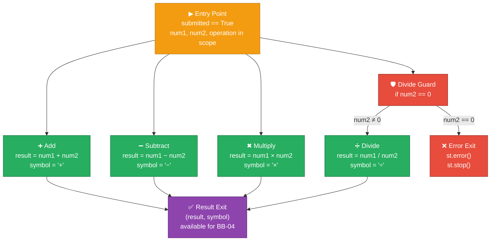

> **Figure 5.2** — Level 2 decomposition of the Arithmetic Engine, showing all four operation paths and the division-by-zero guard.

### 5.3 Level 3 — Script-Level Identifier Reference

The application is a procedural script (no classes or functions). The complete identifier table:

| Identifier | Python Type | Scope | Responsibility |
|-----------|-------------|-------|---------------|
| `st` | Module | Global | Streamlit API surface |
| `col1`, `col2` | `DeltaGenerator` | Form block | Two-column layout containers |
| `num1` | `float` | Script | First operand (from `st.number_input`) |
| `num2` | `float` | Script | Second operand (from `st.number_input`) |
| `operation` | `str` | Script | Selected operation name (`"Add"` / `"Subtract"` / `"Multiply"` / `"Divide"`) |
| `submitted` | `bool` | Script | `True` when the "Calculate" button has been pressed |
| `result` | `float` | Conditional | Arithmetic result (only exists if `submitted == True` and no error) |
| `symbol` | `str` | Conditional | Display operator character (`+`, `−`, `×`, `÷`) |

---

## 6. Runtime View

### 6.1 Scenario 1 — Successful Calculation (Happy Path)

The user opens the app, fills in both numbers, selects an operation, and submits the form.

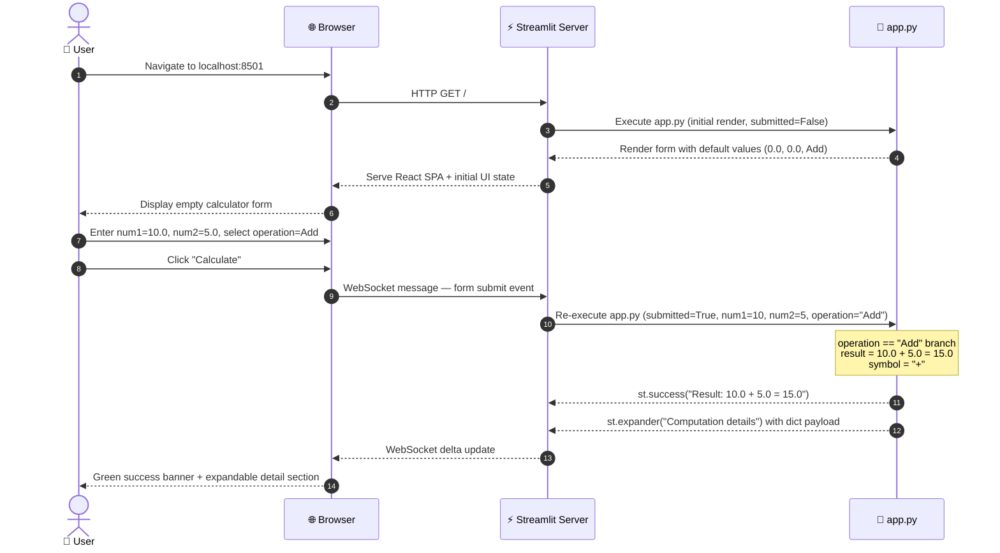

> **Figure 6.1** — Sequence diagram for a successful addition. The same flow applies to Subtract and Multiply.

### 6.2 Scenario 2 — Division by Zero Error Path

```mermaid
sequenceDiagram
    autonumber
    actor User as 👤 User
    participant Browser as 🌐 Browser
    participant Streamlit as ⚡ Streamlit Server
    participant Script as 🐍 app.py

    User->>Browser: Enter num1=7.0, num2=0.0, select operation=Divide
    User->>Browser: Click "Calculate"
    Browser->>Streamlit: WebSocket message — form submit
    Streamlit->>Script: Re-execute app.py (submitted=True, num1=7, num2=0, operation="Divide")

    Note over Script: operation == "Divide" branch<br/>num2 == 0 → guard clause fires<br/>No arithmetic attempted

    Script-->>Streamlit: st.error("Division by zero is not allowed.")
    Script-->>Streamlit: st.stop() — raises StopException, halts execution

    Streamlit-->>Browser: WebSocket delta — error banner only
    Browser-->>User: Red error message displayed; no result shown
```

> **Figure 6.2** — Sequence diagram for the division-by-zero error path. `st.stop()` prevents any further rendering.

### 6.3 Scenario 3 — Complete Script Execution Flowchart

Streamlit re-executes the entire `app.py` from top to bottom on every user event. This flowchart captures the complete control flow for one execution cycle.

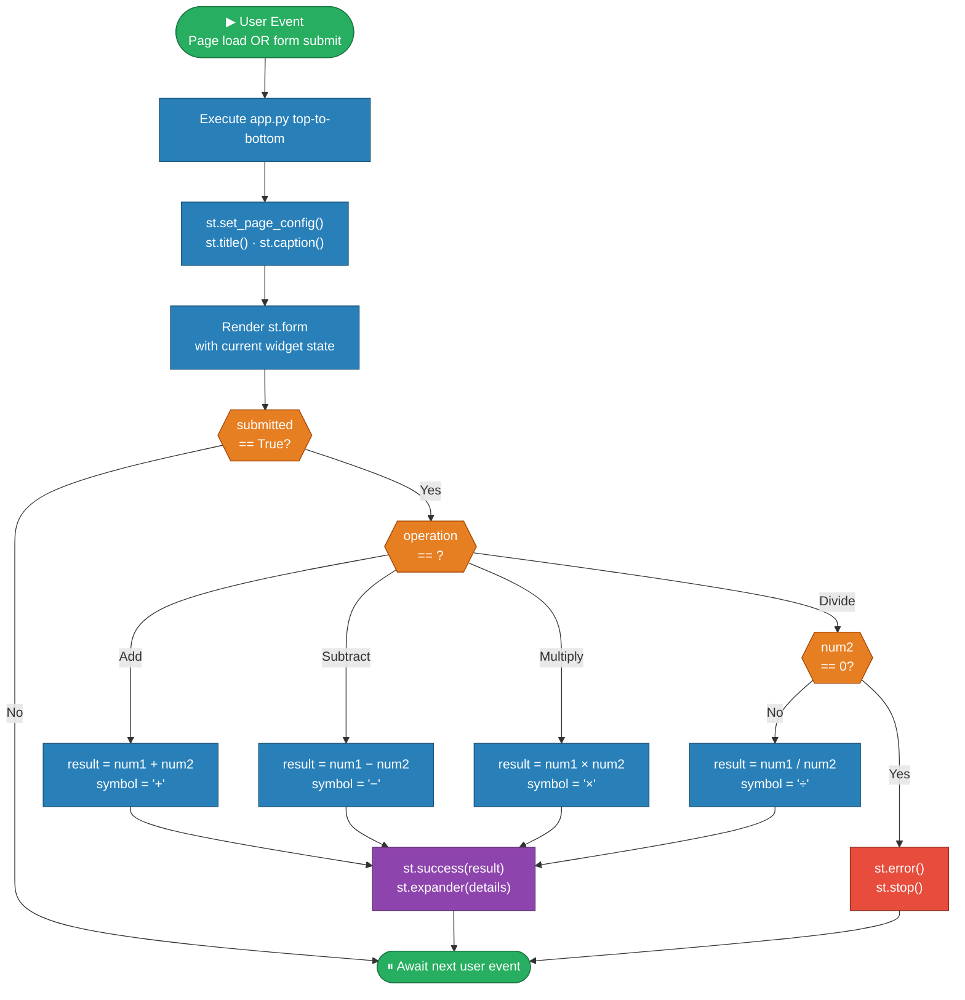

> **Figure 6.3** — Full runtime flowchart of a single Streamlit script execution cycle.

---

## 7. Deployment View

### 7.1 Deployment Options Overview

The application supports three primary deployment configurations:

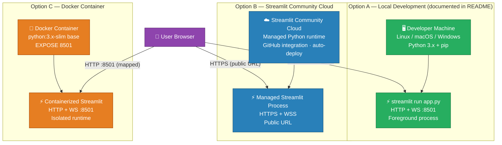

> **Figure 7.1** — Supported deployment configurations.

### 7.2 Local Deployment Architecture (Primary — Documented in README)

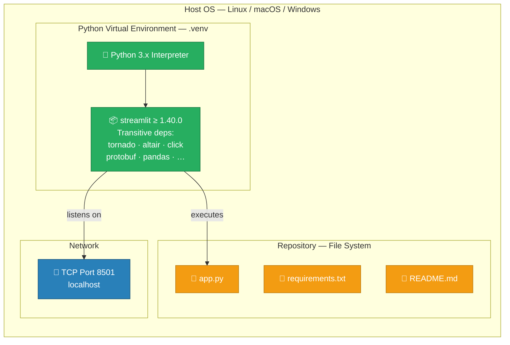

> **Figure 7.2** — Local deployment component diagram.

### 7.3 Deployment Prerequisites

| Requirement | Minimum | Notes |
|------------|---------|-------|
| Python | 3.8+ | Required by Streamlit ≥ 1.40.0 |
| pip | Any recent | For dependency installation |
| streamlit | ≥ 1.40.0 | Only declared dependency |
| TCP port | 8501 | Default; override with `--server.port` |
| RAM | ~128 MB | Streamlit server + Python runtime |
| Disk | ~50 MB | Streamlit + transitive dependencies |

### 7.4 Step-by-Step Deployment Procedure

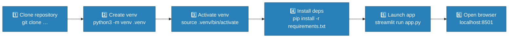

> **Figure 7.3** — Linear deployment procedure from clone to running application.

---

## 8. Cross-cutting Concepts

### 8.1 Domain Model

The problem domain is pure arithmetic. The conceptual model is intentionally minimal:

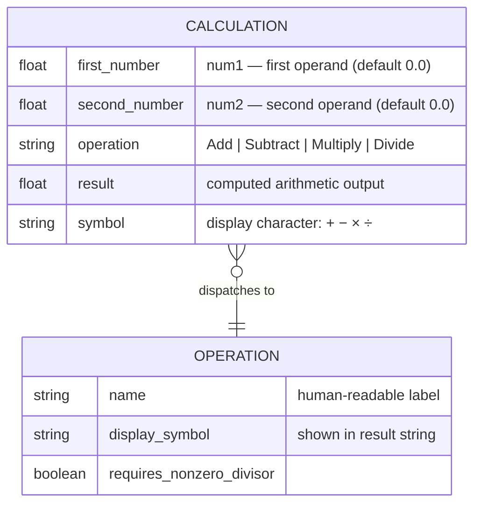

> **Figure 8.1** — Conceptual domain model. `CALCULATION` is an ephemeral, per-request in-memory entity; no persistence layer exists.

### 8.2 Supported Operations Reference

| Operation | Selectbox Value | Display Symbol | Computation | Valid When |
|-----------|----------------|----------------|------------|-----------|
| Addition | `"Add"` | `+` | `num1 + num2` | Always |
| Subtraction | `"Subtract"` | `−` | `num1 - num2` | Always |
| Multiplication | `"Multiply"` | `×` | `num1 * num2` | Always |
| Division | `"Divide"` | `÷` | `num1 / num2` | `num2 ≠ 0` only |

### 8.3 Business Rules

| ID | Rule | Code Location | Enforcement |
|----|------|--------------|-------------|
| BR-01 | Division by zero is prohibited | `app.py` lines 36–38 | `if num2 == 0: st.error(...); st.stop()` |
| BR-02 | Both operands default to `0.0` | `app.py` lines 12–14 | `st.number_input(..., value=0.0)` |
| BR-03 | Default operation is "Add" | `app.py` lines 16–20 | `st.selectbox(..., index=0)` |
| BR-04 | Numbers are IEEE 754 double-precision floats | `app.py` lines 12–14 | Python `float` type from `st.number_input` |
| BR-05 | Result is rendered as a Python f-string | `app.py` line 41 | `f"Result: {num1} {symbol} {num2} = {result}"` |

### 8.4 Error Handling Pattern

The application uses a **guard clause with early exit** — Streamlit's idiomatic error handling pattern:

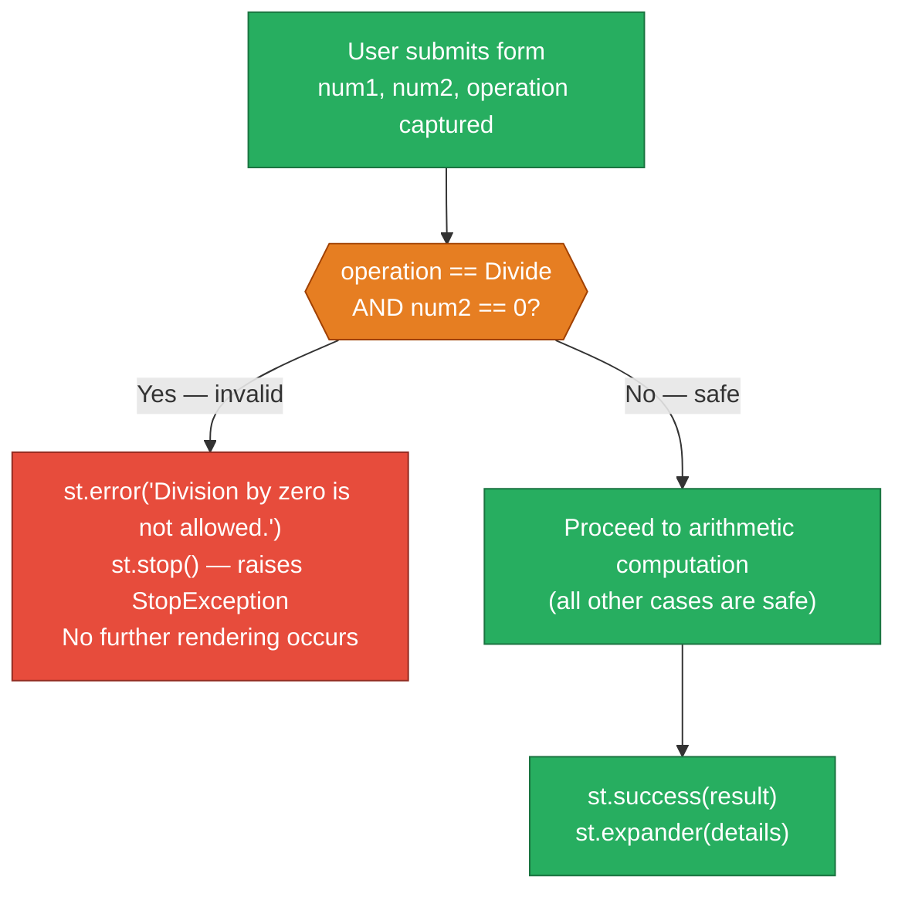

> **Figure 8.2** — Guard clause error handling pattern. `st.stop()` halts the render pipeline cleanly.

### 8.5 UI / UX Concepts

| Concept | Implementation | User Benefit |
|---------|---------------|-------------|
| Centered layout | `layout="centered"` in `st.set_page_config` | Readable on all screen widths including mobile |
| Form batching | `st.form("calculator_form")` | No stale intermediate results while user is still editing |
| Two-column input | `st.columns(2)` | Visually groups the two operands side-by-side |
| Emoji favicon | `page_icon="🧮"` | Instant visual identification in browser tabs |
| Progressive disclosure | `st.expander("Computation details")` | Detailed dict available on demand without cluttering the result |
| Semantic color coding | `st.success()` green / `st.error()` red | Immediate, color-coded feedback on outcome |

### 8.6 Numerical Precision Behavior

- `st.number_input` returns Python's native `float` (IEEE 754 double-precision, 64-bit)
- Input widget display format: `"%.6f"` — 6 decimal places
- Result display: Python's default `float` `__repr__` via f-string (no explicit rounding)
- Standard floating-point rounding applies (e.g., `0.1 + 0.2` may display as `0.30000000000000004`)
- No arbitrary-precision arithmetic or explicit rounding is applied

---

## 9. Architecture Decisions

### ADR-001 — Use Streamlit as the Sole Framework

| Field | Value |
|-------|-------|
| **Status** | ✅ Accepted |
| **Context** | A web-based calculator is needed. Alternatives evaluated: vanilla HTML/CSS/JS, Flask + Jinja2 templates, Streamlit. |
| **Decision** | Use Streamlit exclusively — no separate frontend |
| **Rationale** | Streamlit allows a single Python file to serve as both the UI definition and the application logic. It eliminates HTML templates, a JavaScript build step, CSS files, and a separate WSGI/ASGI server configuration. For a simple calculator, this dramatically reduces accidental complexity. |
| **Positive Consequences** | Minimal codebase (50 LOC total); no build toolchain; instant developer onboarding |
| **Negative Consequences** | Streamlit's re-execution model may be surprising to developers unfamiliar with it; UI customization is limited to Streamlit's widget API |

---

### ADR-002 — Single-File Architecture (`app.py`)

| Field | Value |
|-------|-------|
| **Status** | ✅ Accepted |
| **Context** | Four arithmetic operations on one screen; multi-module structure would add packaging overhead with zero benefit |
| **Decision** | All code lives in `app.py` |
| **Rationale** | At this scope, a single file is the most readable and maintainable structure. Python packages add value when multiple concerns must be separated; there are none here. |
| **Positive Consequences** | Zero navigation overhead; fully comprehensible in under 5 minutes |
| **Negative Consequences** | Would need refactoring if scope grows (history, scientific functions, multi-page layout) |

---

### ADR-003 — Use `st.form` to Batch Input Events

| Field | Value |
|-------|-------|
| **Status** | ✅ Accepted |
| **Context** | Without `st.form`, Streamlit re-runs the script on every keystroke and dropdown change, producing confusing intermediate results while the user is still entering numbers. |
| **Decision** | Wrap all inputs in `st.form("calculator_form")` with an explicit "Calculate" button |
| **Rationale** | The form pattern ensures computation only runs when the user explicitly requests it, matching the mental model of a physical calculator (press `=`). |
| **Positive Consequences** | Predictable UX; no confusing partial computations |
| **Negative Consequences** | Slightly more boilerplate than free-floating widgets |

---

### ADR-004 — Handle Division by Zero with Guard Clause + `st.stop()`

| Field | Value |
|-------|-------|
| **Status** | ✅ Accepted |
| **Context** | Python raises `ZeroDivisionError` for `x / 0`. The error must be caught and communicated to the user without showing a Python traceback. |
| **Decision** | Check `num2 == 0` before dividing; call `st.error()` then `st.stop()` |
| **Rationale** | `st.stop()` is Streamlit's idiomatic mechanism for halting script execution mid-render. It prevents any subsequent `st.success()` or `st.expander()` calls, leaving only the error message visible. No `try/except` block required. |
| **Positive Consequences** | Clean user-facing error; no traceback; idiomatic Streamlit pattern |
| **Negative Consequences** | `st.stop()` raises `StopException` internally — developers must know this is intentional, not a bug |

---

### ADR-005 — No Persistent State or Calculation History

| Field | Value |
|-------|-------|
| **Status** | ✅ Accepted |
| **Context** | A calculator could maintain history via `st.session_state` or a database |
| **Decision** | No history, no `st.session_state`, no database |
| **Rationale** | Statelessness eliminates complexity around concurrency, storage, and session management. The scope is explicitly a single-calculation-at-a-time tool. |
| **Positive Consequences** | Zero infrastructure dependencies; horizontally scalable without sticky sessions |
| **Negative Consequences** | Users cannot review past calculations after navigating away |

---

## 10. Quality Requirements

### 10.1 Quality Attribute Tree

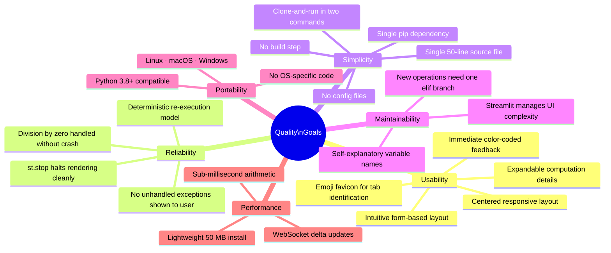

> **Figure 10.1** — Quality attribute tree.

### 10.2 Quality Scenarios

| ID | Attribute | Stimulus | Expected Response | Success Criterion |
|----|-----------|----------|------------------|------------------|
| QS-01 | **Reliability** | User submits `num2=0` with Divide | Red error banner; no crash, no traceback | 100% of divide-by-zero attempts show `st.error`; zero unhandled exceptions |
| QS-02 | **Usability** | First-time user opens the app | User completes a calculation without reading docs | Task completion in < 30 s for ≥ 95% of first-time users |
| QS-03 | **Performance** | User clicks "Calculate" on localhost | Result appears in browser | Round-trip latency < 500 ms on localhost |
| QS-04 | **Portability** | Developer runs on Windows 11 / Python 3.11 | App starts and works correctly | Zero platform-specific failures |
| QS-05 | **Maintainability** | Developer adds "Modulo" (%) operation | Change isolated to one `elif` block | ≤ 5 lines of code; no architectural changes |
| QS-06 | **Simplicity** | New developer evaluates codebase | Full comprehension of the application | Achievable in < 5 minutes (50 LOC, 1 dependency) |

### 10.3 Code Metrics

| Metric | Value | Assessment |
|--------|-------|-----------|
| Lines of code (`app.py`) | 50 | ✅ Extremely lean |
| Classes | 0 | ✅ Appropriate for a procedural script |
| Functions | 0 | ✅ Appropriate at this scope |
| Cyclomatic complexity | 6 | ✅ Low (4 operation branches + 1 submit guard + 1 zero-division guard) |
| Runtime dependencies | 1 (`streamlit`) | ✅ Minimal supply-chain surface |
| Transitive dependencies | ~30 (via streamlit) | ℹ️ Managed by Streamlit; not developer-controlled |
| Test coverage | 0% | ⚠️ No test suite — see §11 |
| Type annotations | None | ⚠️ Minor IDE tooling gap |

---

## 11. Risks and Technical Debt

### 11.1 Risk Register

| ID | Risk | Probability | Impact | Severity | Mitigation Strategy |
|----|------|:-----------:|:------:|:--------:|---------------------|
| R-01 | **Streamlit API breaking change** in a future release | Low | Medium | 🟡 Medium | Pin exact version (`streamlit==1.40.0`); use `pip-compile` lock file |
| R-02 | **Floating-point precision surprises** (`0.1 + 0.2 ≠ 0.3`) | Medium | Low | 🟡 Low-Med | Document in README; optionally add `round(result, 10)` for display |
| R-03 | **Non-finite results** (`inf`, `nan`) from very large inputs | Low | Low | 🟢 Low | Add `math.isfinite(result)` check if scientific-scale inputs expected |
| R-04 | **No automated tests** — regressions go undetected | Medium | Medium | 🟡 Medium | Add `pytest` unit tests (see §11.4) |
| R-05 | **Public access without auth** | High (by design) | Low | 🟢 Acceptable | Not a risk for a public calculator; document if restriction is needed |
| R-06 | **Scalability ceiling** — single-process Streamlit server | Low | Medium | 🟡 Low-Med | Deploy behind load balancer with multiple instances if load grows |

### 11.2 Technical Debt Register

| ID | Debt Item | Category | Estimated Effort | Priority |
|----|----------|:--------:|:----------------:|:--------:|
| TD-01 | **No unit tests** for arithmetic logic or error handling | Testing | Low — 1–2 h | 🔴 High |
| TD-02 | **Loose version pinning** (`>=1.40.0`) instead of exact locked version | Dependency mgmt | Low — 30 min | 🟡 Medium |
| TD-03 | **No CI/CD pipeline** — no automated test runs on push | DevOps | Medium — 2–4 h | 🟡 Medium |
| TD-04 | **Arithmetic logic coupled to Streamlit UI** — not extractable for unit testing | Design | Low — 1 h | 🟡 Medium |
| TD-05 | **No type annotations** on script-level variables | Code quality | Low — 30 min | 🟢 Low |
| TD-06 | **No structured logging or observability** | Observability | Low — 1 h | 🟢 Low |

### 11.3 Technical Debt Prioritization Matrix

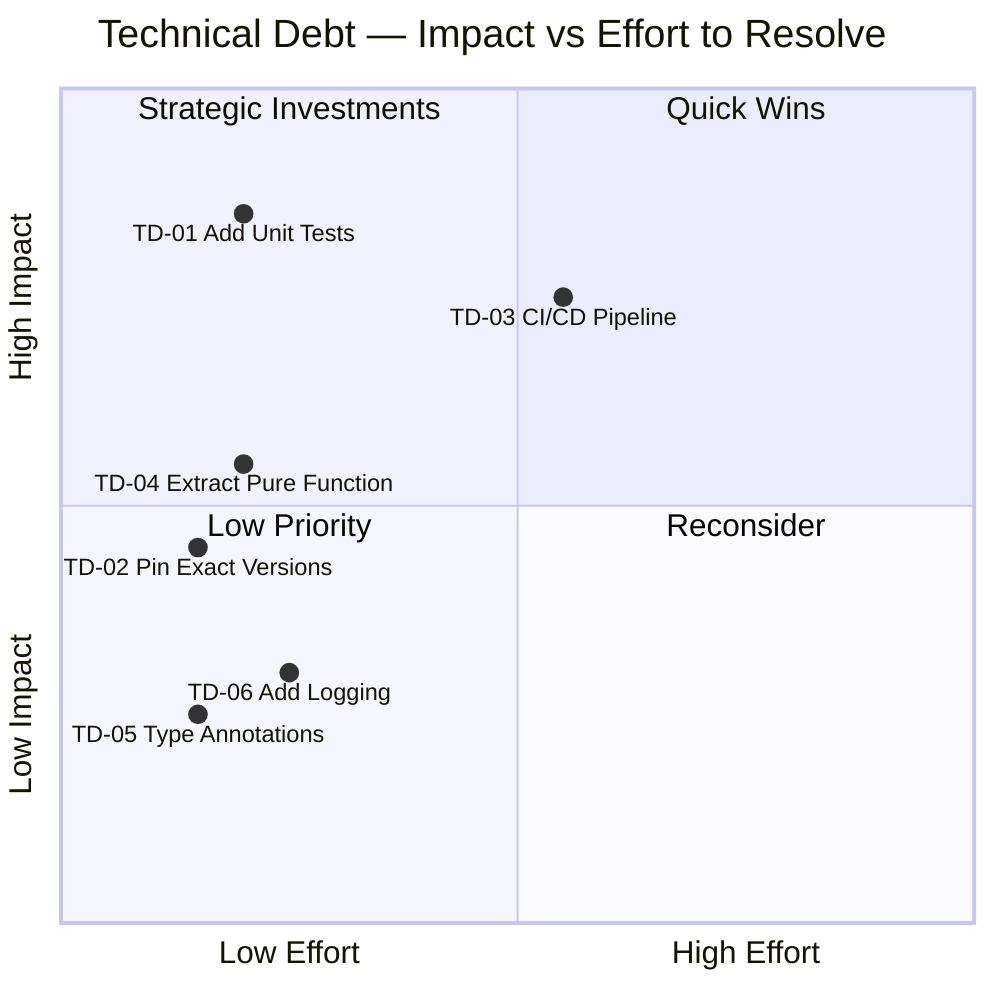

> **Figure 11.1** — Technical debt quadrant chart. Items in the top-left (**Quick Wins**) deliver high value for low effort and should be addressed first.

### 11.4 Recommended Improvements (Ordered by Priority)

1. **Extract a pure `calculate()` function** to decouple arithmetic logic from the Streamlit render loop — this is a prerequisite for unit testing:
   ```python
   def calculate(num1: float, num2: float, operation: str) -> tuple[float, str]:
       if operation == "Add":
           return num1 + num2, "+"
       elif operation == "Subtract":
           return num1 - num2, "−"
       elif operation == "Multiply":
           return num1 * num2, "×"
       elif operation == "Divide":
           if num2 == 0:
               raise ValueError("Division by zero is not allowed.")
           return num1 / num2, "÷"
       raise ValueError(f"Unknown operation: {operation}")
   ```

2. **Add `pytest` unit tests** covering all four operations and the zero-division guard:
   ```python
   def test_add(): assert calculate(3, 4, "Add") == (7.0, "+")
   def test_divide_by_zero():
       with pytest.raises(ValueError): calculate(1, 0, "Divide")
   ```

3. **Set up GitHub Actions CI** — run `pytest` on every push and pull request

4. **Pin exact dependency versions** — replace `streamlit>=1.40.0` with `streamlit==<exact>` and add a `requirements-lock.txt` via `pip-compile`

5. **Add type annotations** — annotate the extracted function and script variables for better IDE support

---

## 12. Glossary

| Term | Definition |
|------|-----------|
| **Arc42** | A template for documenting software and system architecture, organized into 12 standardized sections. Created by the arc42 community (arc42.org). |
| **Arithmetic Engine** | The conditional dispatch block in `app.py` (lines 25–39) that selects and executes the correct arithmetic operation based on the user's `operation` selection |
| **Building Block** | An Arc42 term for a named, encapsulated unit of the system — a module, class, function, or logical grouping |
| **Delta Update** | Streamlit's mechanism for transmitting only the changed UI elements to the browser via WebSocket, avoiding full page reloads |
| **`DeltaGenerator`** | The internal Streamlit type returned by container functions such as `st.columns()`, `st.form()`, and `st.expander()` |
| **Division by Zero** | The mathematical error of dividing a number by zero (undefined). Prevented in `app.py` by the `if num2 == 0` guard clause |
| **Form Batching** | The behaviour of `st.form` that collects all widget state changes together and submits them on button press, preventing intermediate re-renders |
| **Guard Clause** | A programming pattern where an early conditional check exits a block immediately when an invalid condition is detected, keeping the main code path clean |
| **IEEE 754** | The international standard for floating-point arithmetic. Python's built-in `float` is an IEEE 754 double-precision (64-bit) value |
| **Mermaid** | A JavaScript-based diagramming tool using Markdown-like text definitions. All diagrams in this document use Mermaid syntax embedded as code blocks. |
| **Operand** | One of the two numeric inputs to an arithmetic operation. Named `num1` (first number) and `num2` (second number) in the code |
| **Operation** | One of the four arithmetic functions: Add, Subtract, Multiply, Divide |
| **pip** | The Python package installer used to install `streamlit` from `requirements.txt` |
| **React SPA** | The Single-Page Application that Streamlit internally builds with React.js and automatically serves to the browser as its frontend UI layer |
| **Script Re-execution** | Streamlit's core execution model: the entire Python script is re-run from top to bottom on every user interaction |
| **Stateless** | A system that retains no data between requests. Each calculator form submission is fully independent of any previous one |
| **`st.error()`** | Streamlit API function that renders a red error banner in the browser UI |
| **`st.expander()`** | Streamlit API function that renders a collapsible/expandable content section |
| **`st.form()`** | Streamlit API function that creates a form container, batching widget state changes until the submit button is pressed |
| **`st.stop()`** | Streamlit API function that immediately halts further script execution. Raises `StopException` internally; used here to prevent result rendering after an error |
| **`st.success()`** | Streamlit API function that renders a green success banner in the browser UI |
| **`StopException`** | The internal Streamlit exception raised by `st.stop()`. It is caught by the Streamlit framework, not the application code, making it safe to use as an early-exit mechanism |
| **Streamlit** | An open-source Python framework for building interactive web applications. Converts annotated Python scripts into shareable web apps without requiring frontend code. |
| **Symbol** | The human-readable arithmetic operator character shown in the result string: `+`, `−`, `×`, `÷` |
| **Virtual Environment (`venv`)** | An isolated Python runtime created by `python3 -m venv .venv`, keeping project dependencies separate from system Python |
| **WebSocket** | A bidirectional, full-duplex TCP communication protocol. Streamlit uses WebSocket to push UI delta updates from server to browser and receive user events in reverse |

---

*End of Arc42 Architecture Documentation*

---

> **Document Metadata**
>
> | Field | Value |
> |-------|-------|
> | Generated by | Arc42 Documentation Generator |
> | Source files analyzed | `app.py` (50 LOC) · `requirements.txt` (1 dep) · `README.md` |
> | Arc42 sections | 12 of 12 (complete) |
> | Embedded Mermaid diagrams | 13 |
> | External file references | **None** — fully self-contained |
> | Recommended next step | `mkdir -p docs && mv arc42.md docs/arc42.md` |
