# Architecture Documentation (Arc42)

**Project**: Streamlit Calculator Application  
**Version**: 1.0.0  
**Date**: 2025-01-30  
**Generated by**: Arc42 Documentation Generator  
**Source Repository**: `/home/runner/work/github-copilot-test/github-copilot-test`

---

## Table of Contents

1. [Introduction and Goals](#1-introduction-and-goals)
2. [Architecture Constraints](#2-architecture-constraints)
3. [System Scope and Context](#3-system-scope-and-context)
4. [Solution Strategy](#4-solution-strategy)
5. [Building Block View](#5-building-block-view)
6. [Runtime View](#6-runtime-view)
7. [Deployment View](#7-deployment-view)
8. [Cross-cutting Concepts](#8-cross-cutting-concepts)
9. [Architecture Decisions](#9-architecture-decisions)
10. [Quality Requirements](#10-quality-requirements)
11. [Risks and Technical Debt](#11-risks-and-technical-debt)
12. [Glossary](#12-glossary)

---

## 1. Introduction and Goals

### 1.1 Requirements Overview

The **Streamlit Calculator** is a lightweight, browser-based arithmetic application that provides
end-users with a clean, interactive interface to perform the four fundamental arithmetic operations:

| Operation  | Symbol | Description                                          |
|------------|--------|------------------------------------------------------|
| Add        | `+`    | Sums two floating-point numbers                      |
| Subtract   | `-`    | Computes the difference of two numbers               |
| Multiply   | `×`    | Computes the product of two numbers                  |
| Divide     | `÷`    | Computes the quotient, guarded against division-by-zero |

The application is a **single-page web app (SPA)** with no persistent storage, no authentication,
and no external API dependencies. It is entirely self-contained within a single Python source file
(`app.py`, 50 lines) and one dependency declaration (`requirements.txt`).

**Core Features — derived from source code analysis of `app.py`:**

- Dual numeric input fields (64-bit floating-point, 6 decimal-place precision via `format="%.6f"`)
- Operation selector with four choices rendered as a dropdown (`st.selectbox`)
- Form-based submission pattern (`st.form` / `st.form_submit_button`) preventing mid-entry re-renders
- Result display via a styled success banner (`st.success`)
- Expandable computation detail panel (`st.expander`) showing the full input/output dictionary
- Graceful division-by-zero handling: user-visible error message + hard stop (`st.stop()`)

### 1.2 Quality Goals

The top quality goals for this system, ordered by priority:

| Priority | Quality Goal      | Motivation                                                              |
|----------|-------------------|-------------------------------------------------------------------------|
| 1        | **Correctness**   | Arithmetic results must be exactly correct for all valid inputs         |
| 2        | **Usability**     | The UI must be immediately understandable without any training          |
| 3        | **Robustness**    | Invalid inputs (e.g. division by zero) must produce clear error feedback |
| 4        | **Simplicity**    | The codebase must remain minimal and easy to maintain                   |
| 5        | **Deployability** | The app must start with a single command on any Python 3.x environment  |

### 1.3 Stakeholders

| Role                  | Expectation                                                                       |
|-----------------------|-----------------------------------------------------------------------------------|
| **End User**          | A responsive, accurate calculator accessible from any modern web browser          |
| **Developer**         | Simple, readable code that is easy to extend with new operations                  |
| **DevOps / Operator** | One-command startup (`streamlit run app.py`), zero infrastructure overhead        |
| **Tester / QA**       | Clear, testable arithmetic logic with observable input/output states              |

---

## 2. Architecture Constraints

### 2.1 Technical Constraints

| ID    | Constraint                          | Rationale / Source                                               |
|-------|-------------------------------------|------------------------------------------------------------------|
| TC-01 | **Python runtime required**         | Application is written in Python; CPython 3.8+ recommended       |
| TC-02 | **Streamlit ≥ 1.40.0**              | Pinned minimum version in `requirements.txt`                     |
| TC-03 | **Single-file architecture**        | All application logic resides in `app.py`                        |
| TC-04 | **Stateless computation model**     | No database, no session persistence; results exist only in-page  |
| TC-05 | **Browser-based UI only**           | Streamlit renders UI in the browser; no native/desktop GUI       |
| TC-06 | **No external API calls**           | All arithmetic is performed locally in the Python process        |
| TC-07 | **IEEE 754 floating-point**         | Python `float` (double-precision) is the sole number type        |

### 2.2 Organisational Constraints

| ID    | Constraint                          | Rationale                                                        |
|-------|-------------------------------------|------------------------------------------------------------------|
| OC-01 | **Minimal dependency footprint**    | Only one direct dependency (`streamlit`) to ease maintenance     |
| OC-02 | **No build step required**          | The app runs directly via the Streamlit CLI                      |
| OC-03 | **README-driven setup**             | All setup and run instructions live in `README.md`               |

### 2.3 Conventions

| ID    | Convention                          | Details                                                          |
|-------|-------------------------------------|------------------------------------------------------------------|
| CV-01 | **PEP 8 coding style**              | Standard Python conventions followed throughout `app.py`        |
| CV-02 | **f-string formatting**             | Result message: `f"Result: {num1} {symbol} {num2} = {result}"`  |
| CV-03 | **Form-based UI pattern**           | `st.form` batches all widget interactions before computation     |
| CV-04 | **Guard clauses for error paths**   | Division-by-zero check precedes computation and calls `st.stop()`|

---

## 3. System Scope and Context

### 3.1 Business Context

The Streamlit Calculator sits at the intersection of a human user and a Python computation engine,
delivered through a standard web browser. No external business systems, databases, or third-party
services are involved.

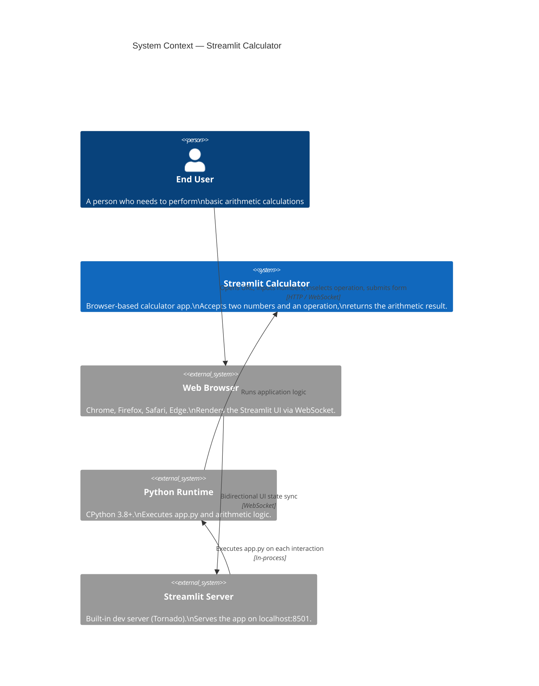

### 3.2 Technical Context

The following table describes all technical interfaces at the system boundary:

| Interface           | Direction     | Protocol / Mechanism           | Description                                          |
|---------------------|---------------|--------------------------------|------------------------------------------------------|
| Browser ↔ Server    | Bidirectional | HTTP (initial) + WebSocket     | Streamlit state sync between frontend and backend    |
| User → Form         | Input         | Browser form interaction       | Number inputs, operation selection, form submit      |
| Server → Browser    | Output        | WebSocket / HTML + JS render   | Success message, error banner, expander panel        |
| Python ↔ OS         | System        | Standard Python I/O            | File reads for serving static assets                 |

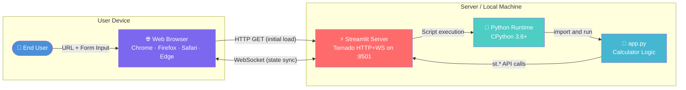

---

## 4. Solution Strategy

### 4.1 Technology Decisions

| Decision                       | Choice                    | Rationale                                                                               |
|--------------------------------|---------------------------|-----------------------------------------------------------------------------------------|
| **UI Framework**               | Streamlit                 | Zero HTML/CSS/JS; Python-native; ideal for data/utility tools                          |
| **Programming Language**       | Python 3.x                | Ubiquitous for data tools; native `float` covers required precision                    |
| **Number Representation**      | `float` (IEEE 754 double) | 15–17 significant digits; sufficient for everyday arithmetic                            |
| **Input Display Format**       | `%.6f` (6 decimal places) | Balances precision visibility with UI readability                                       |
| **Interaction Model**          | `st.form` submit pattern  | Prevents premature computation; batches all inputs into a single trigger               |
| **Error Handling**             | Inline `st.error` + stop  | Immediate visual feedback; `st.stop()` prevents render of invalid state                |
| **Deployment**                 | Streamlit CLI             | Single command; no containerisation or web-server configuration required               |

### 4.2 Top-Level Decomposition Strategy

The application follows a **linear, reactive scripting model** — Streamlit re-executes the entire
`app.py` script from top to bottom on every user interaction. The logical decomposition is:

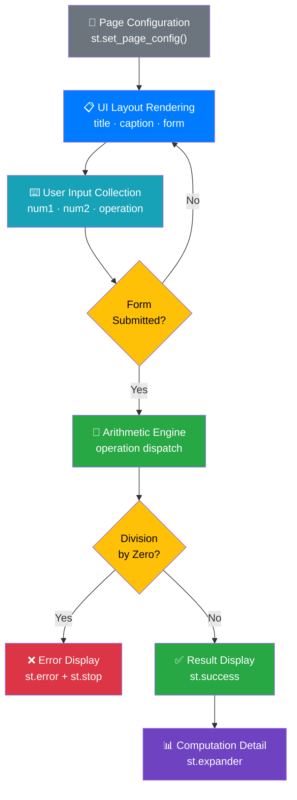

### 4.3 Approaches to Quality Goals

| Quality Goal    | Architectural Approach                                                                    |
|-----------------|-------------------------------------------------------------------------------------------|
| Correctness     | Delegate arithmetic to Python built-in operators; no custom numeric libraries             |
| Usability       | Use Streamlit's opinionated component library for consistent, accessible UI               |
| Robustness      | Explicit division-by-zero guard with `st.stop()` halting further execution                |
| Simplicity      | Single file, no class hierarchy, no ORM, no configuration files                          |
| Deployability   | `pip install -r requirements.txt` + `streamlit run app.py`; no Docker required           |

---

## 5. Building Block View

### 5.1 Level 1 — Whitebox: Overall System

The system is a single deployable unit. At the highest level it consists of one Python module
(`app.py`) driven by the Streamlit framework.

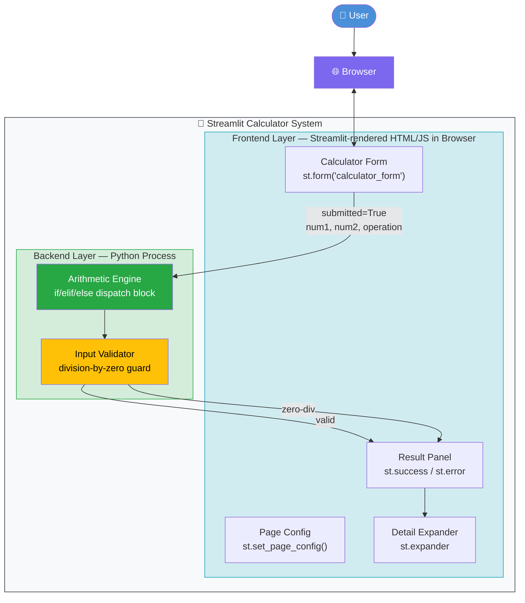

### 5.2 Level 2 — Whitebox: `app.py` Logical Block Decomposition

Since all application logic is in a single module, Level 2 decomposes `app.py` into its four
distinct logical blocks as identified by static analysis:

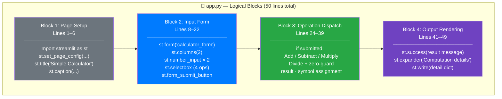

### 5.3 Level 3 — Data Flow and State

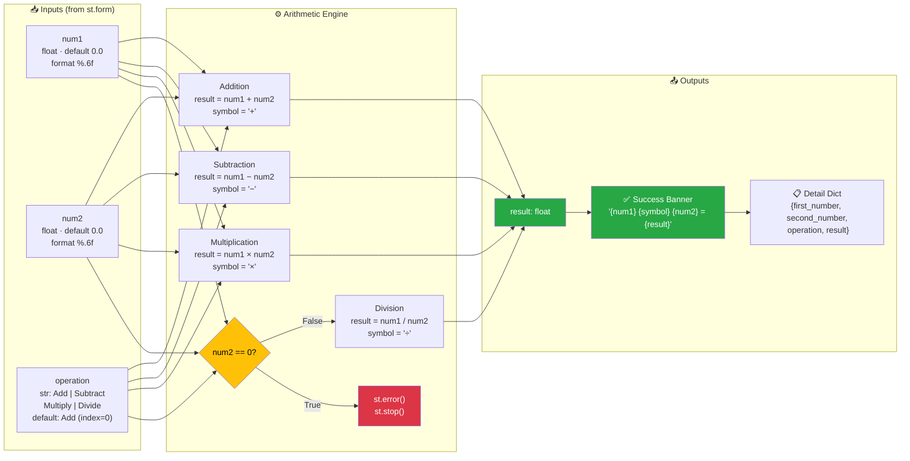

---

## 6. Runtime View

### 6.1 Scenario 1 — Successful Addition

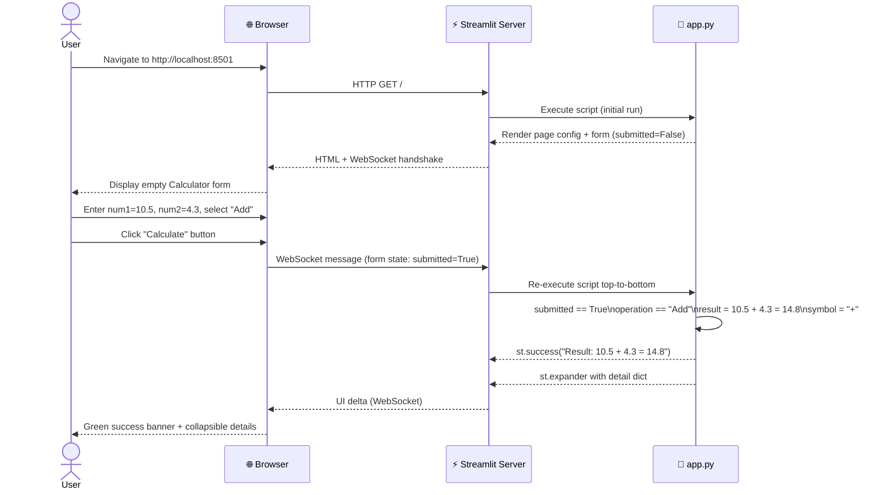

### 6.2 Scenario 2 — Division by Zero (Error Path)

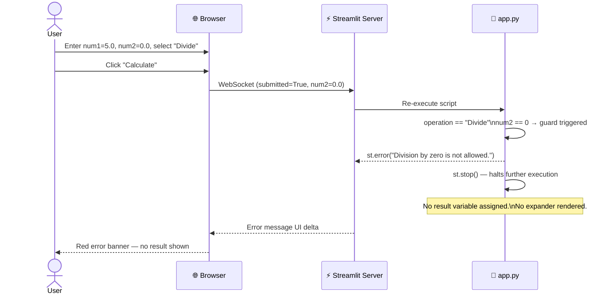

### 6.3 Scenario 3 — Multiply Operation

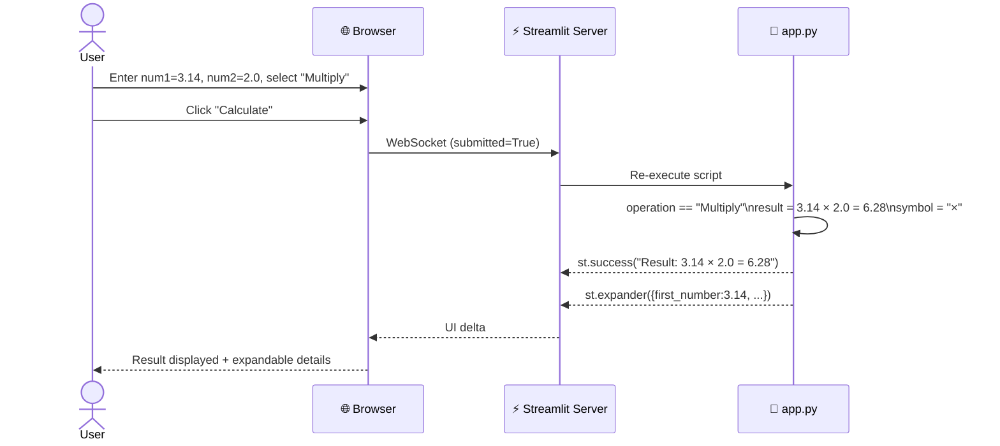

### 6.4 Application Execution Lifecycle (Reactive Script Model)

Streamlit re-executes `app.py` **from line 1 to line 50** on every user interaction:

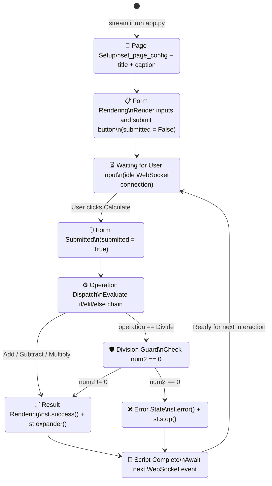

---

## 7. Deployment View

### 7.1 Infrastructure Requirements

| Requirement   | Minimum                      | Recommended                          |
|---------------|------------------------------|--------------------------------------|
| **OS**        | Any OS with Python support   | Linux / macOS / Windows 10+          |
| **Python**    | 3.8+                         | 3.11+                                |
| **RAM**       | ~128 MB                      | ~256 MB                              |
| **CPU**       | Single core                  | Single core (arithmetic is trivial)  |
| **Network**   | Localhost only (default)     | Behind reverse proxy for public      |
| **Storage**   | ~50 MB (Python + Streamlit)  | ~100 MB with virtual environment     |
| **Port**      | 8501 (Streamlit default)     | Configurable via `--server.port`     |

### 7.2 Local Development Deployment Topology

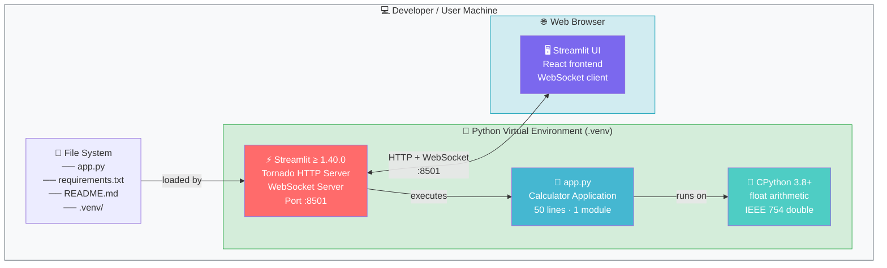

### 7.3 Deployment Steps

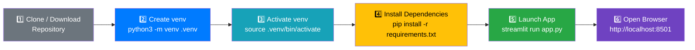

### 7.4 Optional: Cloud / Public Deployment

For sharing beyond localhost the app can be deployed to **Streamlit Community Cloud** or behind a
reverse proxy:

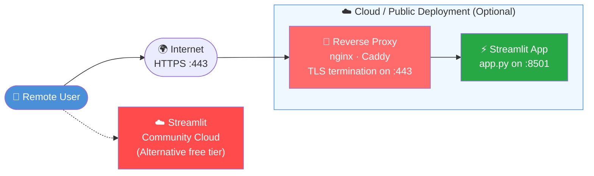

---

## 8. Cross-cutting Concepts

### 8.1 Domain Model

The calculator domain is a stateless arithmetic model with no persistent entities:

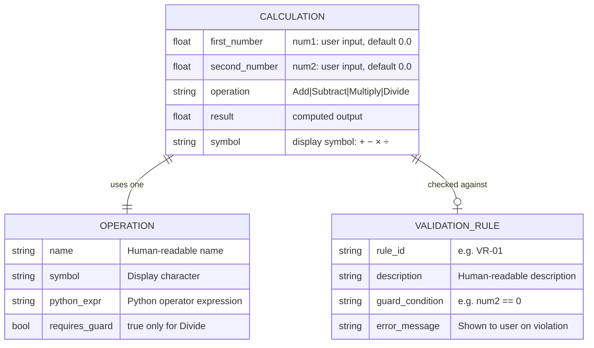

### 8.2 Business Rules

All business rules are embedded directly in `app.py`:

| ID    | Rule                       | Implementation                                  | Source Line |
|-------|----------------------------|-------------------------------------------------|-------------|
| BR-01 | **Addition**               | `result = num1 + num2`                          | 26          |
| BR-02 | **Subtraction**            | `result = num1 - num2`                          | 29          |
| BR-03 | **Multiplication**         | `result = num1 * num2`                          | 32          |
| BR-04 | **Division**               | `result = num1 / num2`                          | 39          |
| BR-05 | **Division-by-Zero Guard** | `if num2 == 0: st.error(...); st.stop()`        | 36–38       |
| BR-06 | **Default Input Values**   | Both numbers default to `0.0`                   | 12–13       |
| BR-07 | **Default Operation**      | `Add` is selected by default (`index=0`)        | 19          |
| BR-08 | **Input Precision**        | Inputs displayed to 6 decimal places `%.6f`     | 12–13       |

### 8.3 UI / UX Patterns

| Pattern                   | Implementation Detail                                              |
|---------------------------|--------------------------------------------------------------------|
| **Form Batching**         | `st.form` groups all inputs; prevents reactive re-runs mid-entry  |
| **Two-Column Layout**     | `st.columns(2)` places num1 and num2 side-by-side                 |
| **Centred Page Layout**   | `layout="centered"` in `st.set_page_config`                       |
| **Contextual Feedback**   | `st.success` (green) for results; `st.error` (red) for errors     |
| **Progressive Disclosure**| `st.expander` hides computation details behind a collapsible toggle|
| **Page Branding**         | Browser tab title "Calculator" + 🧮 favicon emoji                  |

### 8.4 Error Handling Concept

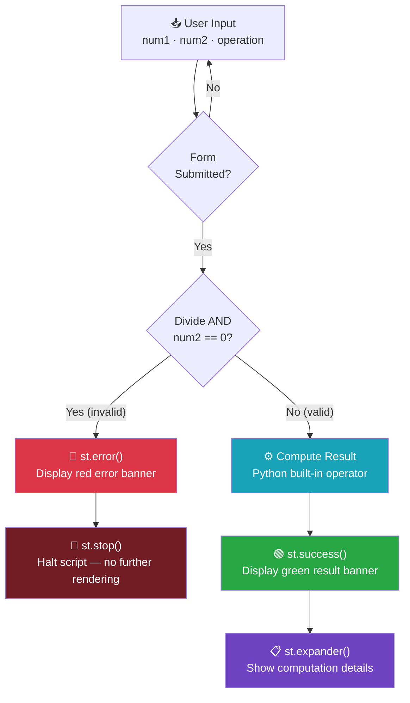

### 8.5 Floating-Point Precision Behaviour

The application uses Python's native `float` (IEEE 754 double-precision):

| Aspect              | Detail                                                              |
|---------------------|---------------------------------------------------------------------|
| **Type**            | `float` — IEEE 754 double (64-bit)                                  |
| **Precision**       | ~15–17 significant decimal digits                                   |
| **Display (input)** | `%.6f` — 6 decimal places in number input widgets                  |
| **Display (output)**| Python default `str(float)` representation                          |
| **Known Artefact**  | `0.1 + 0.2` → `0.30000000000000004` (expected IEEE 754 behaviour)  |
| **Mitigation**      | None currently; could add `round(result, 10)` in a future version  |

---

## 9. Architecture Decisions

### ADR-001: Streamlit as the UI Framework

| Attribute              | Value                                                                                        |
|------------------------|----------------------------------------------------------------------------------------------|
| **Status**             | Accepted                                                                                     |
| **Context**            | A calculator UI must be quickly buildable, browser-accessible, and Python-native             |
| **Decision**           | Use Streamlit as the sole UI and server framework                                            |
| **Rationale**          | Eliminates HTML/CSS/JS; provides ready-made widgets, layout, and a built-in dev server       |
| **Consequences (+)**   | Rapid development; no frontend skills needed; live-reload included                           |
| **Consequences (−)**   | Entire script re-runs on every interaction (reactive model); cannot easily share state       |
| **Alternatives**       | Flask + Jinja2, FastAPI + HTMX, Tkinter, PyQt5                                              |

---

### ADR-002: Single-File Architecture

| Attribute              | Value                                                                                        |
|------------------------|----------------------------------------------------------------------------------------------|
| **Status**             | Accepted                                                                                     |
| **Context**            | Application is a minimal, single-purpose utility with 50 lines of logic                     |
| **Decision**           | All application logic in one file (`app.py`)                                                 |
| **Rationale**          | No architectural layering is justified for a 4-operation calculator                         |
| **Consequences (+)**   | Zero overhead; trivially readable; immediate onboarding for new developers                  |
| **Consequences (−)**   | Not scalable beyond toy scope; arithmetic logic is coupled to the UI                        |
| **Alternatives**       | Separate `ui.py` + `calculator.py` modules                                                  |

---

### ADR-003: `st.form` for Input Batching

| Attribute              | Value                                                                                        |
|------------------------|----------------------------------------------------------------------------------------------|
| **Status**             | Accepted                                                                                     |
| **Context**            | Without a form, Streamlit re-executes the script after every keystroke in number inputs     |
| **Decision**           | Wrap all inputs in `st.form("calculator_form")` with an explicit submit button              |
| **Rationale**          | Prevents premature computation; user controls exactly when to trigger the calculation       |
| **Consequences (+)**   | Stable UX; predictable execution; no partial-state renders                                  |
| **Consequences (−)**   | Requires explicit button click rather than instant reactive feedback                        |
| **Alternatives**       | Direct widget callbacks (`on_change`), `st.session_state` reactive updates                 |

---

### ADR-004: `st.stop()` for Error Flow Termination

| Attribute              | Value                                                                                        |
|------------------------|----------------------------------------------------------------------------------------------|
| **Status**             | Accepted                                                                                     |
| **Context**            | On division by zero, the script must not proceed to render a result                         |
| **Decision**           | Call `st.stop()` immediately after `st.error()` in the division-by-zero guard              |
| **Rationale**          | `st.stop()` is the idiomatic Streamlit mechanism for halting script execution               |
| **Consequences (+)**   | Clean error state; no undefined variables rendered downstream                              |
| **Consequences (−)**   | Relies on Streamlit-specific API rather than standard Python exception handling             |
| **Alternatives**       | `raise ValueError`, `sys.exit()`, `return` (invalid at module scope)                       |

---

### ADR-005: IEEE 754 `float` Without Decimal Correction

| Attribute              | Value                                                                                        |
|------------------------|----------------------------------------------------------------------------------------------|
| **Status**             | Accepted                                                                                     |
| **Context**            | `decimal.Decimal` offers exact base-10 arithmetic; `float` does not                        |
| **Decision**           | Use native Python `float` for all arithmetic                                                 |
| **Rationale**          | Sufficient for a general-purpose calculator; `decimal` adds complexity without clear need   |
| **Consequences (+)**   | Simpler code; no imports beyond `streamlit`; familiar to all Python developers              |
| **Consequences (−)**   | Floating-point rounding artefacts observable for certain inputs (e.g. `0.1 + 0.2`)         |
| **Alternatives**       | `decimal.Decimal` (exact base-10), `fractions.Fraction` (exact rational)                   |

---

## 10. Quality Requirements

### 10.1 Quality Tree

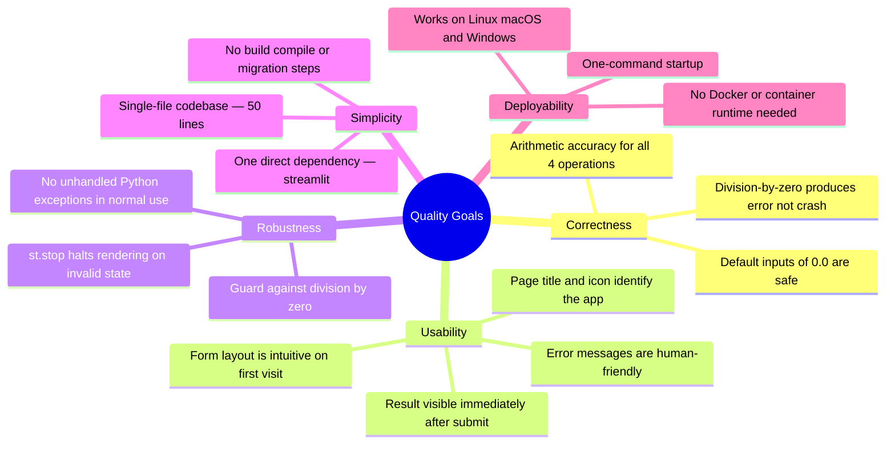

### 10.2 Quality Scenarios

| ID    | Quality Attribute | Scenario                                                   | Expected Response                                  |
|-------|-------------------|------------------------------------------------------------|-----------------------------------------------------|
| QS-01 | Correctness       | User adds `1.5 + 2.5`                                     | Result = `4.0`; displayed in green success banner   |
| QS-02 | Correctness       | User divides `10.0 / 4.0`                                 | Result = `2.5`; displayed correctly                 |
| QS-03 | Robustness        | User divides any number by `0`                             | Red error banner; no result rendered                |
| QS-04 | Usability         | First-time user opens the app                             | Form visible with no training needed                |
| QS-05 | Deployability     | Developer clones repo on a fresh Python 3.11 machine      | App running in under 2 minutes                      |
| QS-06 | Simplicity        | Developer reads the source code for the first time        | Full logic understood in under 5 minutes            |
| QS-07 | Correctness       | User submits without changing defaults (`0.0 + 0.0`)      | Result = `0.0`; no crash or error                   |
| QS-08 | Correctness       | User multiplies `−3.0 × 2.5`                              | Result = `−7.5`; handles negative inputs correctly  |

### 10.3 Code Metrics Summary

| Metric                      | Value                                                        |
|-----------------------------|--------------------------------------------------------------|
| **Lines of Code (LoC)**     | 50 (including blanks)                                        |
| **Cyclomatic Complexity**   | 5 (`if submitted` + `if/elif/else` chain + `if num2 == 0`)  |
| **Number of Functions**     | 0 (procedural script)                                        |
| **Number of Classes**       | 0                                                            |
| **External Dependencies**   | 1 (`streamlit ≥ 1.40.0`)                                    |
| **Decision Branches**       | 5 (Add / Subtract / Multiply / Divide-valid / Divide-zero)  |
| **Automated Test Coverage** | 0 % (no test files present in repository)                   |
| **Config Files**            | 1 (`requirements.txt`); no `pyproject.toml` or `.flake8`   |

---

## 11. Risks and Technical Debt

### 11.1 Identified Risks

| ID   | Risk                              | Likelihood | Impact | Mitigation Strategy                                              |
|------|-----------------------------------|------------|--------|------------------------------------------------------------------|
| R-01 | **No automated tests**            | High       | Medium | Add `pytest` unit tests for all 5 arithmetic branches           |
| R-02 | **Floating-point precision loss** | Medium     | Low    | Document limitation; optionally adopt `decimal.Decimal`         |
| R-03 | **No input range validation**     | Low        | Low    | Add `min_value` / `max_value` to `st.number_input` if needed    |
| R-04 | **Single-file scalability limit** | Low        | Medium | Refactor into `ui.py` + `calculator.py` if operations grow      |
| R-05 | **Streamlit upgrade compatibility**| Low       | Low    | `>=1.40.0` floor; run regression tests on each Streamlit update |
| R-06 | **No CI/CD pipeline**             | Medium     | Low    | Add GitHub Actions workflow for linting and test execution      |
| R-07 | **Accessibility not verified**    | Medium     | Medium | Validate keyboard navigation and screen-reader compatibility    |

### 11.2 Technical Debt Items

| ID    | Debt Item                                          | Effort | Priority | Recommended Action                                              |
|-------|----------------------------------------------------|--------|----------|-----------------------------------------------------------------|
| TD-01 | **Zero test coverage**                             | Small  | 🔴 High  | Create `tests/test_calculator.py` with `pytest` unit tests     |
| TD-02 | **Arithmetic logic coupled to UI**                 | Small  | 🟡 Med   | Extract a pure `calculate(num1, num2, operation)` function     |
| TD-03 | **No type hints**                                  | Small  | 🟢 Low   | Add PEP 484 annotations to any extracted functions             |
| TD-04 | **No linting / formatting configuration**          | Small  | 🟢 Low   | Add `pyproject.toml` with `ruff` or `flake8` rules             |
| TD-05 | **Floating-point output not rounded**              | Small  | 🟢 Low   | Add `round(result, 10)` to suppress IEEE 754 display artefacts |
| TD-06 | **No requirements lock file**                      | Small  | 🟡 Med   | Generate `requirements-lock.txt` via `pip freeze`              |
| TD-07 | **No `.gitignore` for Python artefacts**           | Tiny   | 🟢 Low   | Add standard Python `.gitignore` (covers `__pycache__`, `.venv`)|

### 11.3 Recommended Remediation Roadmap

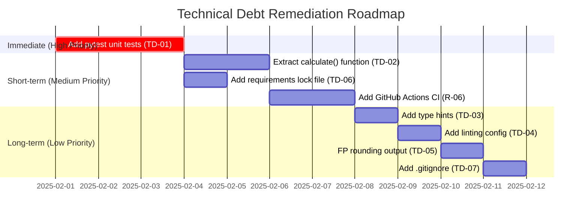

---

## 12. Glossary

| Term                        | Definition                                                                                                         |
|-----------------------------|--------------------------------------------------------------------------------------------------------------------|
| **Arc42**                   | A template for documenting and communicating software architectures, structured in 12 sections                     |
| **Streamlit**               | An open-source Python framework for building interactive web apps, primarily for data tools and utilities          |
| **Reactive Script Model**   | Streamlit's execution model where the entire `app.py` script re-runs top-to-bottom on every user interaction       |
| **st.form**                 | A Streamlit widget container that batches widget interactions and submits them together via a single button         |
| **st.stop()**               | A Streamlit API call that immediately halts further script execution and UI rendering for the current run          |
| **st.success()**            | A Streamlit function that renders a green-bordered informational success message box                               |
| **st.error()**              | A Streamlit function that renders a red-bordered error message box                                                 |
| **st.expander**             | A Streamlit component rendering a collapsible panel for progressive disclosure of supplementary content            |
| **st.selectbox**            | A Streamlit widget rendering a dropdown selection element                                                          |
| **st.number_input**         | A Streamlit widget rendering a numeric input field with configurable step, min, max, and display format            |
| **IEEE 754**                | The international standard for floating-point arithmetic; governs Python's `float` type behaviour                  |
| **float**                   | Python's built-in double-precision (64-bit) floating-point number type; ~15–17 significant decimal digits          |
| **Division by Zero**        | The arithmetic error arising from dividing any number by zero; mathematically undefined                            |
| **Guard Clause**            | A conditional check placed early in a code path to handle invalid inputs before main logic executes                |
| **Cyclomatic Complexity**   | A software metric measuring the number of linearly independent paths through a program's source code               |
| **Tornado**                 | The Python async web framework used internally by Streamlit to serve HTTP requests and WebSocket connections       |
| **WebSocket**               | A bidirectional, full-duplex communication protocol over a persistent TCP connection; used by Streamlit for sync   |
| **venv**                    | Python's built-in module (`python -m venv`) for creating isolated virtual environments                             |
| **PEP 8**                   | The official Python style guide covering naming conventions, indentation, line length, and code layout             |
| **PEP 484**                 | The Python Enhancement Proposal introducing optional static type hints via the `typing` module                     |
| **ADR**                     | Architecture Decision Record — a short document capturing one significant architectural decision and its rationale |
| **LoC**                     | Lines of Code — a basic software size and complexity metric                                                        |
| **SPA**                     | Single-Page Application — a web app that loads a single HTML page and dynamically updates content                  |
| **CI/CD**                   | Continuous Integration / Continuous Deployment — automated pipelines for building, testing, and deploying code     |

---

*Documentation generated by the **Arc42 Documentation Generator**.*  
*Sources analysed: `app.py` (50 LoC), `requirements.txt`, `README.md`.*  
*All diagrams rendered using [Mermaid](https://mermaid.js.org/) — no PlantUML, no ASCII art.*  
*Generated: 2025-01-30*
