# Architecture Documentation (Arc42)

**Project**: Streamlit Calculator App  
**Version**: 1.0.0  
**Date**: 2025-01-01  
**Generated by**: Arc42 Documentation Generator  
**Source Repository**: `/home/runner/work/github-copilot-test/github-copilot-test`

---

## Table of Contents

1. [Introduction and Goals](#1-introduction-and-goals)
2. [Constraints](#2-constraints)
3. [Context and Scope](#3-context-and-scope)
4. [Solution Strategy](#4-solution-strategy)
5. [Building Block View](#5-building-block-view)
6. [Runtime View](#6-runtime-view)
7. [Deployment View](#7-deployment-view)
8. [Crosscutting Concepts](#8-crosscutting-concepts)
9. [Architecture Decisions](#9-architecture-decisions)
10. [Quality Requirements](#10-quality-requirements)
11. [Risks and Technical Debt](#11-risks-and-technical-debt)
12. [Glossary](#12-glossary)

---

## 1. Introduction and Goals

### 1.1 Purpose and Overview

The **Streamlit Calculator App** is a lightweight, browser-based arithmetic calculator built with Python and the Streamlit framework. It provides a clean, interactive web UI that allows any user with a browser to perform the four fundamental arithmetic operations — addition, subtraction, multiplication, and division — on floating-point numbers without installing any local software.

The application is intentionally minimal: a single Python source file (`app.py`) drives both the UI and the computation logic, making it an excellent template or teaching example for Streamlit-based tooling.

### 1.2 Goals

| ID   | Goal                                        | Priority |
|------|---------------------------------------------|----------|
| G-01 | Support the four basic arithmetic operations (Add, Subtract, Multiply, Divide) | High |
| G-02 | Present results clearly and immediately after form submission | High |
| G-03 | Protect users from runtime errors (e.g. division by zero) | High |
| G-04 | Require zero client-side installation beyond a modern web browser | Medium |
| G-05 | Remain simple enough to serve as a Streamlit reference implementation | Medium |

### 1.3 Quality Goals

The top-five quality attributes driving architectural decisions (ordered by priority):

| Priority | Quality Attribute | Scenario |
|----------|-------------------|----------|
| 1 | **Usability** | A first-time user completes a calculation within 10 seconds of opening the app |
| 2 | **Reliability** | The app never crashes on invalid input; division by zero yields a user-friendly error |
| 3 | **Simplicity / Maintainability** | A Python developer unfamiliar with the codebase can read and understand `app.py` in under 5 minutes |
| 4 | **Portability** | The app runs identically on any OS with Python ≥ 3.8 and Streamlit ≥ 1.40.0 |
| 5 | **Performance** | The result is displayed within 1 second of clicking "Calculate" on a standard machine |

### 1.4 Stakeholders

| Stakeholder | Role | Concern |
|-------------|------|---------|
| End User | Consumer of the calculator UI | Accurate results, clear error messages, fast feedback |
| Developer / Maintainer | Owner of the codebase | Readability, extensibility, low operational overhead |
| DevOps / Deployer | Runs the Streamlit server | Simple dependency management, clear startup instructions |

---

## 2. Constraints

### 2.1 Technical Constraints

| ID    | Constraint | Source |
|-------|-----------|--------|
| TC-01 | **Python runtime required** — the application is written entirely in Python | `app.py`, `requirements.txt` |
| TC-02 | **Streamlit ≥ 1.40.0** — the sole declared dependency; all UI primitives are Streamlit built-ins | `requirements.txt` |
| TC-03 | **Single-file architecture** — all logic lives in `app.py`; no packages, modules, or separate service layers | `app.py` |
| TC-04 | **No persistent storage** — the application is stateless; no database, file system, or cache is used | `app.py` |
| TC-05 | **No authentication or authorisation** — the app is designed for open, unauthenticated access | `app.py` |
| TC-06 | **No external API calls** — all computation happens in-process with native Python arithmetic | `app.py` |
| TC-07 | **Floating-point precision** — numbers are handled as Python `float` (IEEE 754 double precision) with a display format of 6 decimal places | `app.py` lines 12–13 |

### 2.2 Organisational Constraints

| ID    | Constraint |
|-------|-----------|
| OC-01 | Development follows a "keep it simple" philosophy; no frameworks beyond Streamlit are introduced |
| OC-02 | The project must be runnable with a single command (`streamlit run app.py`) as documented in `README.md` |
| OC-03 | Dependency management is via `pip` and `requirements.txt`; no Poetry, Conda, or Docker is mandated |

### 2.3 Conventions

| Convention | Description |
|------------|-------------|
| Python PEP 8 | Implicit coding style convention |
| Streamlit form pattern | All user inputs are gathered inside a `st.form` block and processed only on submission |
| Operation names | Operations are consistently referred to by their English names: `Add`, `Subtract`, `Multiply`, `Divide` |
| Symbol mapping | Display symbols are `+`, `-`, `×`, `÷` mapped from operation names at render time |

---

## 3. Context and Scope

### 3.1 Business Context

The Streamlit Calculator App operates as a self-contained web tool. The only external actor is the **End User** interacting via a web browser. There are no integrations with external systems, APIs, or databases.

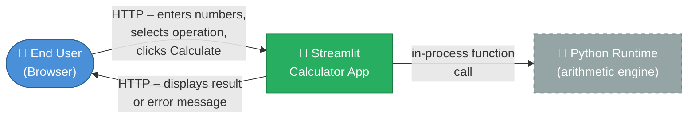

**Business Context Table**

| Neighbour | Interface | Direction | Description |
|-----------|-----------|-----------|-------------|
| End User (Browser) | HTTP / HTTPS | Bidirectional | User submits the calculator form; app returns computed result or error |
| Python Runtime | In-process call | Internal | Native arithmetic operators (`+`, `-`, `*`, `/`) evaluate the calculation |

### 3.2 Technical Context

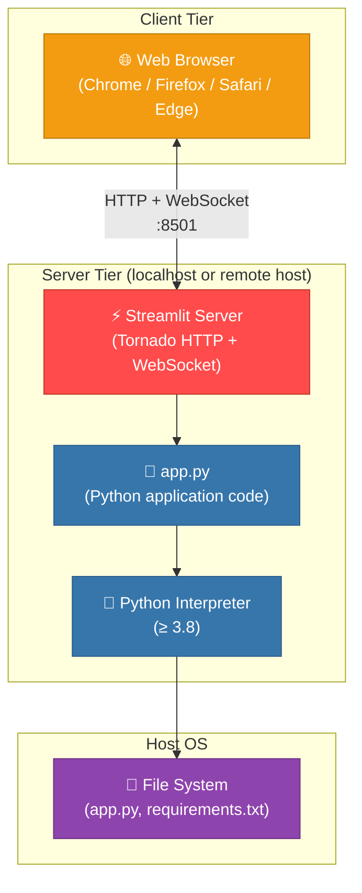

**Technical Interfaces**

| Interface | Protocol | Port | Notes |
|-----------|----------|------|-------|
| Browser ↔ Streamlit Server | HTTP + WebSocket | 8501 (default) | Streamlit's Tornado server handles both static assets and live component updates via WebSocket |
| Streamlit Server → `app.py` | Python import / exec | N/A | Streamlit re-executes the script top-to-bottom on each user interaction |
| `app.py` → Python arithmetic | In-process | N/A | Standard Python operators; no subprocess or IPC |

---

## 4. Solution Strategy

### 4.1 Technology Decisions

| Decision | Choice | Rationale |
|----------|--------|-----------|
| UI Framework | **Streamlit** | Enables building an interactive web UI purely in Python without HTML/CSS/JS knowledge; ideal for data tools and simple utilities |
| Language | **Python** | Ubiquitous, concise, and natively supported by Streamlit |
| Dependency management | **pip + requirements.txt** | Minimal tooling; matches the simplicity goal of the project |
| Deployment model | **Local server** (`streamlit run`) | Zero-config startup, suitable for personal or internal tools |
| State model | **Stateless / ephemeral** | No session persistence required; every form submission is independent |

### 4.2 Top-Level Decomposition

The system is decomposed into three logical layers within the single `app.py` file:

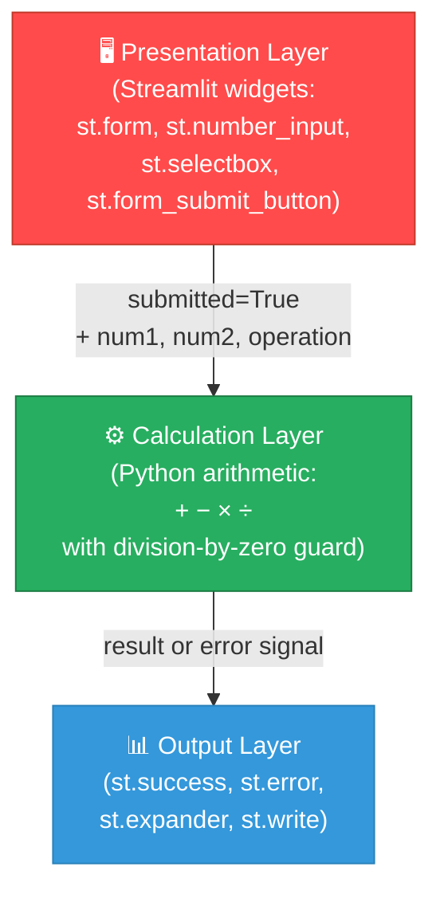

### 4.3 Approaches to Quality Goals

| Quality Goal | Approach |
|--------------|----------|
| Usability | Single-page form layout; two columns for number inputs; clear labels; centred layout (`layout="centered"`) |
| Reliability | Explicit `if num2 == 0` guard before division; `st.stop()` prevents further rendering on error |
| Simplicity | All code in one file; no abstractions, classes, or external services |
| Portability | Pure-Python arithmetic; only one pip dependency |
| Performance | In-process arithmetic completes in microseconds; Streamlit re-render is the only latency factor |

---

## 5. Building Block View

### 5.1 Level 1 — System Overview

At the highest level the system is a single deployable unit: the **Streamlit Calculator Application**, served by the Streamlit runtime.

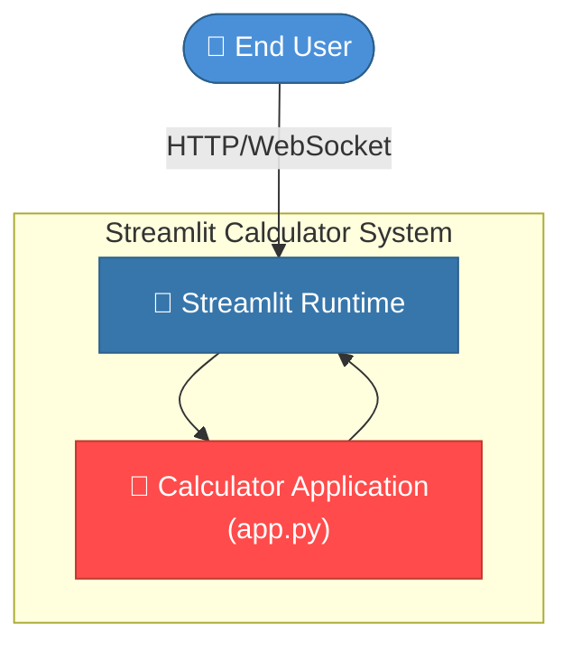

### 5.2 Level 2 — Module / Component Structure

`app.py` is composed of four logical blocks executed sequentially on each Streamlit script run:

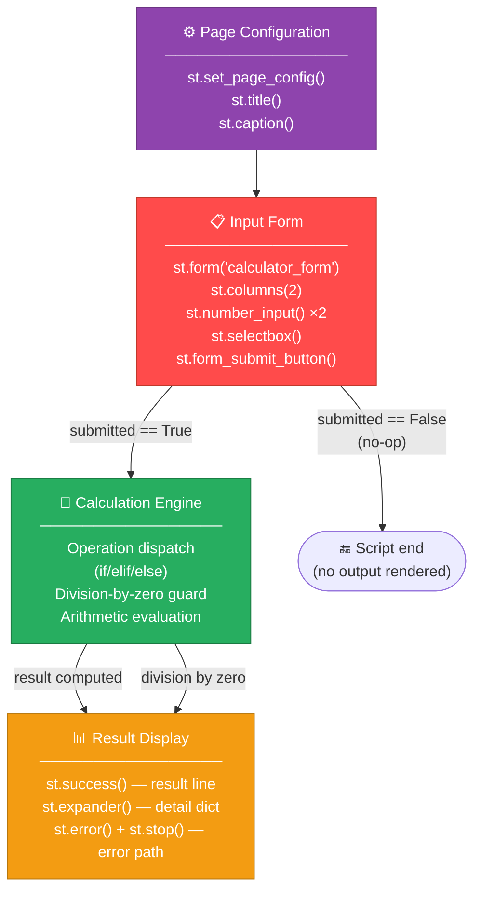

### 5.3 Level 3 — Detailed Component Responsibilities

| Component | Location (lines) | Responsibility | Key Streamlit APIs |
|-----------|-----------------|----------------|--------------------|
| **Page Configuration** | 1–6 | Sets browser tab title, emoji favicon, and centred layout; renders app heading and caption | `st.set_page_config`, `st.title`, `st.caption` |
| **Input Form** | 8–22 | Collects `num1`, `num2`, and `operation` from the user in a single atomic submit group | `st.form`, `st.columns`, `st.number_input`, `st.selectbox`, `st.form_submit_button` |
| **Calculation Engine** | 24–39 | Dispatches to the correct arithmetic operator; enforces the division-by-zero business rule; produces `result` and `symbol` | Pure Python (`+`, `-`, `*`, `/`) |
| **Result Display** | 41–49 | Renders the formatted equation result in a success banner; shows a structured detail dictionary in a collapsible expander | `st.success`, `st.expander`, `st.write`, `st.error`, `st.stop` |

### 5.4 Data Flow Diagram

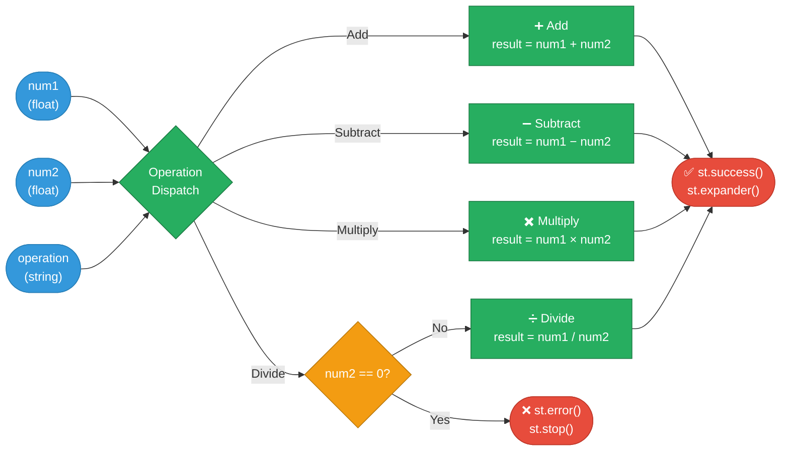

---

## 6. Runtime View

### 6.1 Scenario 1 — Successful Calculation

This scenario covers the happy path: a user enters two numbers, selects an operation, and receives a result.

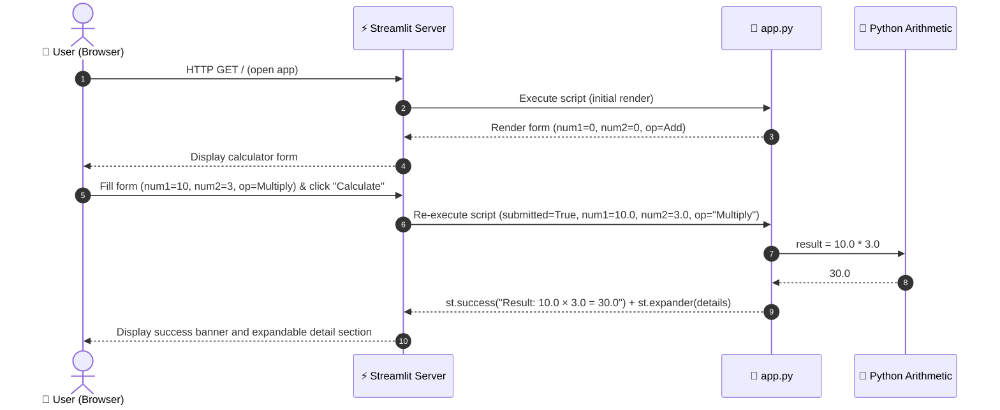

### 6.2 Scenario 2 — Division by Zero Error

This scenario covers the guard clause that prevents a Python `ZeroDivisionError` from reaching the user.

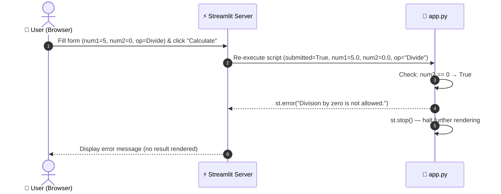

### 6.3 Scenario 3 — Page Load (No Submission)

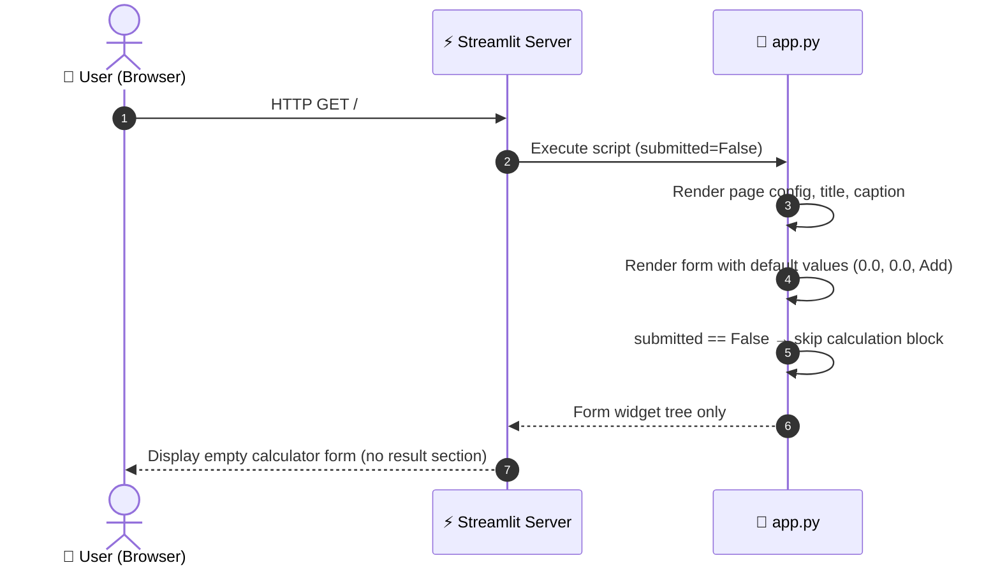

### 6.4 End-to-End Business Process Flow

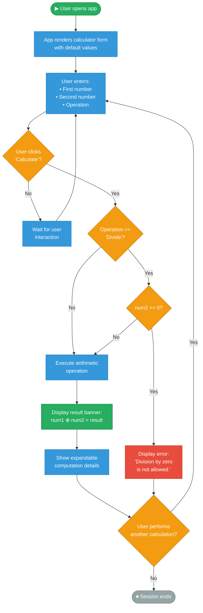

---

## 7. Deployment View

### 7.1 Infrastructure Overview

The application requires no cloud infrastructure, containerisation, or orchestration for its baseline deployment. A single host running Python is sufficient.

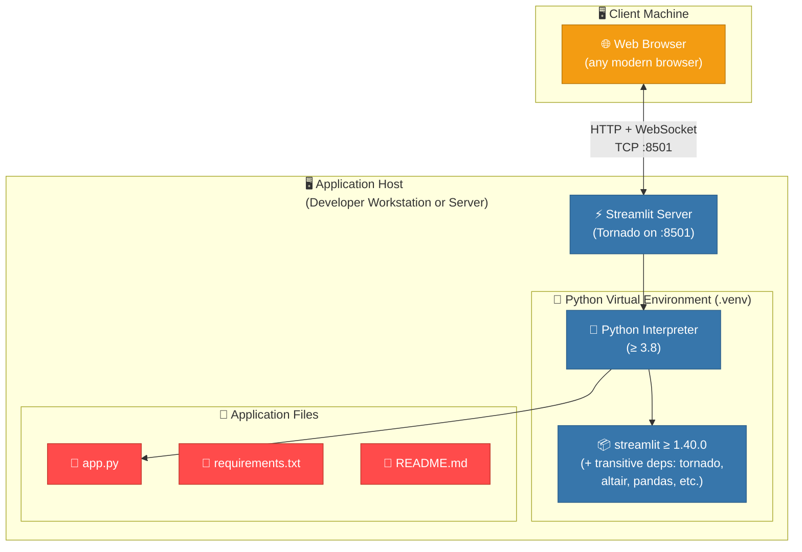

### 7.2 Deployment Steps

| Step | Command | Description |
|------|---------|-------------|
| 1. Create virtualenv | `python3 -m venv .venv` | Isolate dependencies from the system Python |
| 2. Activate virtualenv | `source .venv/bin/activate` | (Linux/macOS) or `.venv\Scripts\activate` (Windows) |
| 3. Install dependencies | `pip install -r requirements.txt` | Installs Streamlit ≥ 1.40.0 and its transitive dependencies |
| 4. Start server | `streamlit run app.py` | Launches Tornado HTTP server on port 8501 |
| 5. Open browser | `http://localhost:8501` | Default URL printed to terminal on startup |

### 7.3 Runtime Requirements

| Requirement | Minimum | Recommended |
|-------------|---------|-------------|
| Python | 3.8 | 3.11+ |
| Streamlit | 1.40.0 | Latest stable |
| RAM | ~150 MB | 256 MB |
| CPU | Any modern single core | N/A |
| Network | Localhost loopback | N/A |
| Disk | ~50 MB (deps + app) | N/A |
| OS | Linux / macOS / Windows | Linux (production) |

### 7.4 Alternative Deployment Targets

| Target | Notes |
|--------|-------|
| **Streamlit Community Cloud** | Push repo to GitHub; deploy from `share.streamlit.io` — zero-config PaaS |
| **Docker container** | `pip install` in a `python:3.11-slim` image; `EXPOSE 8501`; `CMD ["streamlit","run","app.py","--server.address","0.0.0.0"]` |
| **Cloud VM (EC2, GCE, Azure VM)** | Same as local deployment; open port 8501 in the firewall; optionally put Nginx in front |

---

## 8. Crosscutting Concepts

### 8.1 Error Handling Strategy

The application implements a single, targeted error-handling rule: **division by zero protection**.

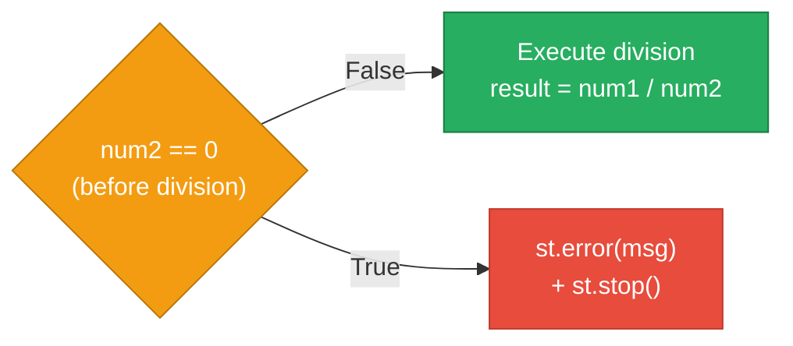

**Pattern**: _Guard Clause_ — the check is performed _before_ the potentially erroneous operation. `st.stop()` is a Streamlit-specific mechanism that immediately halts script execution, preventing any further rendering (including a potentially confusing empty result section).

All other operations (`+`, `-`, `*`) are mathematically safe for any two Python floats (overflow to `inf` is handled transparently) and therefore require no additional guards.

### 8.2 State Management

Streamlit follows a **reactive, stateless script-execution model**:

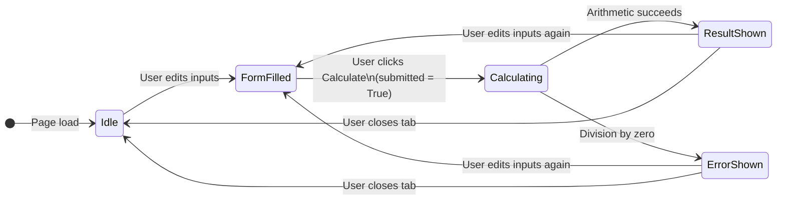

- The Streamlit server **re-executes `app.py` from top to bottom** on every widget interaction.
- The `st.form` widget batches all input changes and only triggers a re-run when the submit button is pressed, reducing unnecessary server round-trips.
- No explicit session state (`st.session_state`) is used; the form's default values (`value=0.0`) provide the initial state on each load.

### 8.3 Input / Number Handling

| Concern | Implementation |
|---------|---------------|
| Input type | `st.number_input` — renders a native HTML `<input type="number">` with browser-side numeric validation |
| Precision | `format="%.6f"` — display is capped at 6 decimal places for readability; full float64 precision used internally |
| Default value | Both inputs default to `0.0`; the operation defaults to `Add` (index 0 of the selectbox) |
| Range | No explicit min/max; Python float range (approx ±1.8 × 10³⁰⁸) |

### 8.4 UI / UX Conventions

| Convention | Implementation |
|------------|---------------|
| Layout | `layout="centered"` — content constrained to a centred column for readability |
| Page identity | `page_title="Calculator"`, `page_icon="🧮"` set browser tab metadata |
| Two-column input | `st.columns(2)` places num1 and num2 side-by-side, reducing vertical scroll |
| Result format | `f"Result: {num1} {symbol} {num2} = {result}"` — human-readable equation string |
| Detail disclosure | `st.expander` hides the raw dict by default, keeping the primary view clean |
| Symbol mapping | Mathematical symbols (`+`, `−`, `×`, `÷`) used in display vs. English words in the operation selector |

### 8.5 Business Rules

| Rule ID | Rule | Enforcement Location |
|---------|------|---------------------|
| BR-01 | Division by zero is not permitted | `app.py` lines 36–38 |
| BR-02 | Numbers are treated as floating-point (not integers) | `st.number_input(value=0.0)` |
| BR-03 | Exactly four operations are supported: Add, Subtract, Multiply, Divide | `st.selectbox` option tuple |
| BR-04 | Computation only executes after explicit form submission | `st.form` / `submitted` flag |

---

## 9. Architecture Decisions

### ADR-001 — Use Streamlit as the UI Framework

| Field | Detail |
|-------|--------|
| **Status** | Accepted |
| **Date** | Project inception |
| **Context** | A calculator UI needs interactive widgets (inputs, dropdown, button) and a way to display dynamic results — all in Python without writing HTML/CSS/JavaScript. |
| **Decision** | Use **Streamlit** as the single UI framework. |
| **Rationale** | Streamlit lets Python developers build interactive web apps with minimal boilerplate. Its widget model (form, number_input, selectbox) maps exactly to the calculator's requirements. Alternatives like Flask + Jinja2 or Dash would require significantly more code and front-end knowledge. |
| **Consequences** | (+) Very low code volume; (−) Streamlit's top-down re-execution model is non-intuitive for developers used to event-driven frameworks; (−) limited styling customisation without injecting raw HTML/CSS. |

---

### ADR-002 — Single-File Architecture

| Field | Detail |
|-------|--------|
| **Status** | Accepted |
| **Date** | Project inception |
| **Context** | The application scope is a four-operation calculator with no persistence, authentication, or service integrations. |
| **Decision** | Implement the entire application in a **single file (`app.py`)**. |
| **Rationale** | The scope does not justify a layered architecture (controllers, services, repositories). A single file minimises cognitive overhead, simplifies deployment, and aligns with Streamlit's "script" mental model. |
| **Consequences** | (+) Extremely easy to read, run, and share; (−) not scalable if the number of operations or business rules grows significantly; (−) no unit-testable functions (business logic is inline). |

---

### ADR-003 — Form-Based Input Collection

| Field | Detail |
|-------|--------|
| **Status** | Accepted |
| **Date** | Project inception |
| **Context** | Streamlit can trigger a re-run on every individual widget change. Without grouping, changing `num1` would immediately re-execute the calculation before `num2` is set. |
| **Decision** | Wrap all inputs inside a `st.form` block and compute only when the **submit button** is clicked. |
| **Rationale** | `st.form` batches widget changes into a single re-run, preventing partial/premature calculations and providing a natural "calculate" action boundary. |
| **Consequences** | (+) No spurious re-computations; cleaner UX; (−) users must click "Calculate" explicitly even when changing only one number. |

---

### ADR-004 — Guard Clause for Division by Zero

| Field | Detail |
|-------|--------|
| **Status** | Accepted |
| **Date** | Project inception |
| **Context** | Python raises a `ZeroDivisionError` exception when dividing by zero. An unhandled exception in Streamlit renders a red error traceback, which is not user-friendly. |
| **Decision** | Explicitly check `num2 == 0` **before** the division and display a friendly `st.error` message, then call `st.stop()`. |
| **Rationale** | Proactive guard clause is simpler and more user-friendly than `try/except`. `st.stop()` ensures the result section is not rendered in an incomplete state. |
| **Consequences** | (+) No raw tracebacks visible to users; (+) clear, actionable error message; (−) `num2 == 0.0` uses float equality which is technically imprecise for extremely small subnormal values — acceptable for this use case. |

---

### ADR-005 — No Persistent State

| Field | Detail |
|-------|--------|
| **Status** | Accepted |
| **Date** | Project inception |
| **Context** | A basic calculator does not need to persist history, user preferences, or session data. |
| **Decision** | Use **no persistent storage** (no database, no files, no `st.session_state` for history). |
| **Rationale** | Adds zero complexity; each form submission is fully independent. Stateless design also avoids concurrency concerns when multiple browser tabs or users connect. |
| **Consequences** | (+) No data management burden; (−) no calculation history; (−) refreshing the page resets all inputs to defaults. |

---

## 10. Quality Requirements

### 10.1 Quality Tree

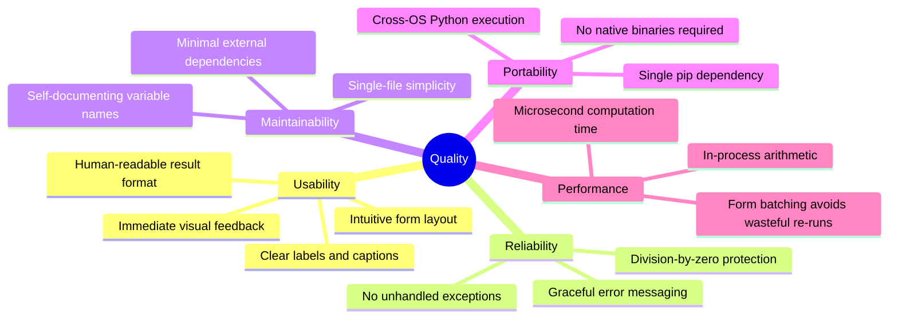

### 10.2 Quality Scenarios

| ID | Quality Attribute | Stimulus | Response | Measure |
|----|-------------------|----------|----------|---------|
| QS-01 | **Usability** | First-time user opens the app | Form is visible with clear labels; no additional explanation needed | User completes first calculation within 10 s |
| QS-02 | **Reliability** | User submits Divide with `num2 = 0` | Friendly error message displayed; no stack trace; no crash | Error message shown in < 500 ms; app remains interactive |
| QS-03 | **Performance** | User submits any valid calculation | Result displayed | < 1 s end-to-end on any modern machine |
| QS-04 | **Maintainability** | Developer needs to add a new operation (e.g. Modulo) | Change confined to `app.py` | 1 `selectbox` option + 1 `elif` branch added; < 5 min effort |
| QS-05 | **Portability** | App installed on a fresh Python 3.8+ environment | `pip install -r requirements.txt && streamlit run app.py` succeeds | Zero additional configuration required |

### 10.3 Code Quality Metrics

| Metric | Value | Assessment |
|--------|-------|------------|
| Lines of code | 49 | ✅ Extremely concise |
| Number of source files | 1 (`app.py`) | ✅ Minimal surface area |
| External dependencies | 1 (`streamlit`) | ✅ Very low dependency risk |
| Cyclomatic complexity | ~5 (form branch + 4 operation branches + zero guard) | ✅ Low complexity |
| Test coverage | 0% (no tests present) | ⚠️ Gap — no automated tests |
| Code duplication | None | ✅ |
| Dead code | None | ✅ |
| Hardcoded values | 3 (default `0.0`, format `"%.6f"`, Streamlit default port) | ✅ Acceptable at this scale |

---

## 11. Risks and Technical Debt

### 11.1 Risk Register

| ID | Risk | Likelihood | Impact | Mitigation |
|----|------|-----------|--------|-----------|
| R-01 | **No unit tests** — logic errors in arithmetic dispatch may go unnoticed | Medium | Low (operations are trivial) | Add `pytest` tests for each operation and the zero-guard |
| R-02 | **Streamlit version not pinned** — `>=1.40.0` does not cap the upper bound; a breaking change in a future release could break the app | Low | Medium | Pin to a specific minor version; use Dependabot or Renovate for updates |
| R-03 | **Float equality for zero guard** — `num2 == 0` uses float comparison; underflowed values (e.g. `1e-400` → `0.0`) would trigger the guard silently | Very Low | Very Low | Document the behaviour; acceptable for a basic calculator |
| R-04 | **No HTTPS / authentication** — if deployed publicly, any user can access the app | Medium (if public) | Low (no sensitive data processed) | Add Streamlit's built-in authentication or deploy behind an identity-aware proxy |
| R-05 | **Single point of failure** — all logic in one file; a syntax error brings the entire app down | Low | High | Add linting in CI (`flake8` / `ruff`) |
| R-06 | **No logging or observability** — errors only visible in the server terminal | Medium | Low | Add `logging` module calls or integrate with a log aggregator for production use |

### 11.2 Technical Debt Overview

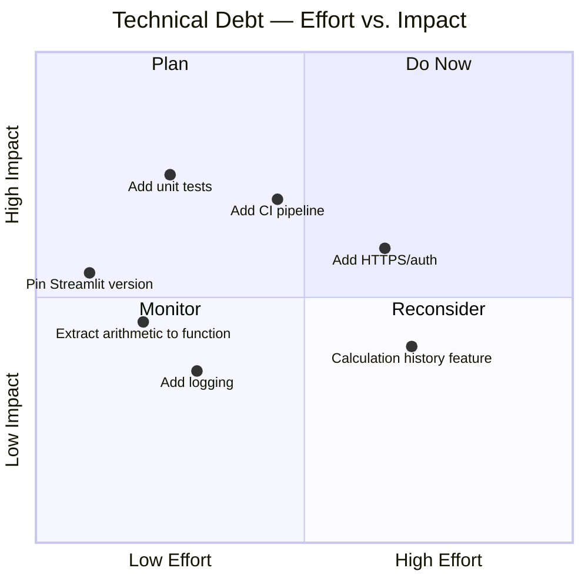

### 11.3 Debt Items

| ID | Item | Category | Effort | Impact | Priority |
|----|------|----------|--------|--------|----------|
| TD-01 | No automated tests for arithmetic logic or error paths | Testing | Low | High | **High** |
| TD-02 | Streamlit version not pinned (`>=` rather than `==`) | Dependency | Very Low | Medium | **Medium** |
| TD-03 | Business logic (arithmetic dispatch) is inline, not in a testable function | Design | Low | Medium | **Medium** |
| TD-04 | No CI/CD pipeline (linting, testing, deployment) | DevOps | Medium | Medium | **Medium** |
| TD-05 | No logging — errors/usage invisible to operators | Observability | Low | Low | Low |
| TD-06 | Float equality used for zero guard (`== 0`) | Correctness | Very Low | Very Low | Low |

### 11.4 Recommended Immediate Actions

1. **Extract a pure calculation function** (no Streamlit calls) to enable unit testing:

   ```python
   def calculate(num1: float, num2: float, operation: str) -> float:
       """Perform arithmetic. Raises ValueError on division by zero."""
       if operation == "Add":       return num1 + num2
       if operation == "Subtract":  return num1 - num2
       if operation == "Multiply":  return num1 * num2
       if operation == "Divide":
           if num2 == 0:
               raise ValueError("Division by zero is not allowed.")
           return num1 / num2
       raise ValueError(f"Unknown operation: {operation}")
   ```

2. **Add `pytest` tests** covering all four operations and the zero-division guard.
3. **Pin Streamlit** to a specific minor version and automate dependency updates.
4. **Add a GitHub Actions workflow** for linting (`ruff` or `flake8`) and tests (`pytest`) on every push.

---

## 12. Glossary

| Term | Definition |
|------|-----------|
| **app.py** | The single Python source file containing all application logic and UI definitions |
| **Arithmetic operation** | One of the four supported calculations: Add, Subtract, Multiply, Divide |
| **Calculate (button)** | The `st.form_submit_button` that triggers re-execution of the script with `submitted=True` |
| **Calculation Engine** | The conditional dispatch block in `app.py` (lines 24–39) that maps the selected operation to a Python arithmetic expression |
| **Cyclomatic Complexity** | A software metric counting the number of linearly independent paths through code; correlates with number of `if`/`elif` branches |
| **Division by zero** | The mathematically undefined operation of dividing a number by zero; caught and handled by business rule BR-01 |
| **`st.expander`** | A Streamlit widget that renders a collapsible section; used here to show computation details without cluttering the primary view |
| **Float / float64** | Python's native floating-point type (IEEE 754 double precision, 64-bit); used for all numeric values in this application |
| **`st.form`** | A Streamlit widget block that groups multiple inputs and only triggers a re-run when its submit button is clicked |
| **Guard Clause** | A programming pattern where a precondition is checked at the top of a code block and execution is aborted early (via `st.stop()`) if the condition fails |
| **`num1` / `num2`** | Variable names in `app.py` representing the first and second numeric operands provided by the user |
| **Operation** | The user-selected arithmetic function; stored internally as a Python string: `"Add"`, `"Subtract"`, `"Multiply"`, or `"Divide"` |
| **`result`** | The computed floating-point output of the selected arithmetic operation |
| **Script re-execution** | Streamlit's core execution model: the entire Python script is run from top to bottom on every user interaction or widget change |
| **`st.error()`** | A Streamlit function that renders a red error banner in the UI |
| **`st.stop()`** | A Streamlit function that immediately halts script execution at the call site, preventing further widget rendering |
| **`st.success()`** | A Streamlit function that renders a green success banner in the UI; used to display the computation result |
| **Streamlit** | An open-source Python framework for building interactive web data apps; see [streamlit.io](https://streamlit.io) |
| **Symbol** | The mathematical display character representing an operation: `+` (Add), `−` (Subtract), `×` (Multiply), `÷` (Divide) |
| **Tornado** | The Python async web framework embedded within Streamlit that serves HTTP requests and manages WebSocket connections |
| **Virtual environment (`.venv`)** | An isolated Python environment created by `python -m venv` to avoid polluting system-wide packages |
| **WebSocket** | A persistent, bidirectional TCP-based protocol used by Streamlit to push widget state changes and render updates between browser and server in real time |

---

*End of Arc42 Architecture Documentation*

---

> **Document generated by**: Arc42 Documentation Generator  
> **Source analysed**: `app.py` (49 lines), `requirements.txt` (1 line), `README.md` (17 lines)  
> **Total diagrams**: 13 embedded Mermaid diagrams  
> **Self-contained**: ✅ All content is within this single file — no external references  
