# Architecture Documentation (Arc42)

**Project**: Simple Calculator  
**Version**: 1.0.0  
**Date**: 2025-01-01  
**Generated by**: Arc42 Documentation Generator  
**Source Repository**: `/home/runner/work/github-copilot-test/github-copilot-test`

---

## Table of Contents

1. [Introduction and Goals](#1-introduction-and-goals)
2. [Architecture Constraints](#2-architecture-constraints)
3. [System Scope and Context](#3-system-scope-and-context)
4. [Solution Strategy](#4-solution-strategy)
5. [Building Block View](#5-building-block-view)
6. [Runtime View](#6-runtime-view)
7. [Deployment View](#7-deployment-view)
8. [Cross-cutting Concepts](#8-cross-cutting-concepts)
9. [Architecture Decisions](#9-architecture-decisions)
10. [Quality Requirements](#10-quality-requirements)
11. [Risks and Technical Debt](#11-risks-and-technical-debt)
12. [Glossary](#12-glossary)

---

## 1. Introduction and Goals

### 1.1 Purpose and Overview

The **Simple Calculator** is a lightweight, browser-based arithmetic web application built with [Streamlit](https://streamlit.io/). It provides a clean, form-driven interface that allows users to perform the four fundamental arithmetic operations — addition, subtraction, multiplication, and division — on any two floating-point numbers without requiring any local installation beyond a Python environment.

The application is intentionally minimal: a single Python source file (`app.py`) and a single runtime dependency (`streamlit`). Its primary purpose is to serve as a reference implementation, a learning resource, or a starter template for Streamlit-based tooling.

### 1.2 Business Goals

| # | Goal | Priority |
|---|------|----------|
| G-1 | Provide instant, zero-friction arithmetic computation through a web browser | High |
| G-2 | Demonstrate a clean Streamlit UI pattern with forms, columns, and expanders | High |
| G-3 | Handle edge cases (e.g., division by zero) gracefully with user-friendly error messages | High |
| G-4 | Keep the codebase simple enough to be understood in a single reading | Medium |
| G-5 | Serve as a reusable starting template for more complex Streamlit applications | Low |

### 1.3 Quality Goals

| Priority | Quality Attribute | Motivation |
|----------|------------------|------------|
| 1 | **Correctness** | Arithmetic results must always be mathematically accurate; division-by-zero must be caught before execution |
| 2 | **Usability** | Form-based layout with clear labels, formatted numeric inputs, and inline success/error feedback |
| 3 | **Simplicity** | Single-file implementation; no database, no authentication, no external API calls |
| 4 | **Portability** | Runs on any OS with Python ≥ 3.8 and `streamlit ≥ 1.40.0` installed |
| 5 | **Maintainability** | Linear, side-effect-free logic makes changes and extensions straightforward |

### 1.4 Stakeholders

| Role | Person / Group | Expectations |
|------|---------------|--------------|
| End User | Anyone with a browser | Reliable arithmetic, clear UI, instant feedback |
| Developer / Maintainer | Repository owner | Readable code, easy to extend, documented architecture |
| Reviewer / Evaluator | Technical assessors, interviewers | Demonstrates Streamlit best practices and clean Python style |

---

## 2. Architecture Constraints

### 2.1 Technical Constraints

| ID | Constraint | Rationale |
|----|-----------|-----------|
| TC-1 | **Python runtime required** — Python ≥ 3.8 | Streamlit 1.40.x requires Python 3.8+ |
| TC-2 | **Streamlit ≥ 1.40.0** is the only allowed UI framework | Declared in `requirements.txt`; the entire rendering model is Streamlit-native |
| TC-3 | **Single-page application** — no multi-page routing | `st.set_page_config` is called once; no `pages/` directory exists |
| TC-4 | **Stateless computation** — no persistent storage | No database, no file I/O, no session-state persistence across page reloads |
| TC-5 | **Client/server co-located by default** — server runs locally | Default `streamlit run` launches on `localhost:8501`; no containerisation layer is mandated |
| TC-6 | **Floating-point arithmetic only** — Python built-in `float` | Inputs formatted to 6 decimal places; no `Decimal` or arbitrary-precision library used |

### 2.2 Organisational Constraints

| ID | Constraint | Rationale |
|----|-----------|-----------|
| OC-1 | **Minimal dependency footprint** | Only `streamlit` is listed in `requirements.txt`; no additional packages may be introduced without review |
| OC-2 | **Single source file** | All application logic lives in `app.py`; splitting into modules requires a deliberate architectural decision |
| OC-3 | **Open-source friendly** | No proprietary SDKs, no paid services, no licence-restricted libraries |

### 2.3 Conventions

- PEP 8 Python code style
- Streamlit form pattern: all inputs collected inside `st.form`, submitted via `st.form_submit_button`
- Results displayed via `st.success` / `st.error` outside the form block
- Numeric precision: 6 decimal places (`format="%.6f"`)

---

## 3. System Scope and Context

### 3.1 Business Context

The Simple Calculator sits at the boundary between a **human user** (operating a web browser) and the **Streamlit runtime** (a Python process serving the reactive web UI). There are no external services, third-party APIs, or persistent data stores involved.

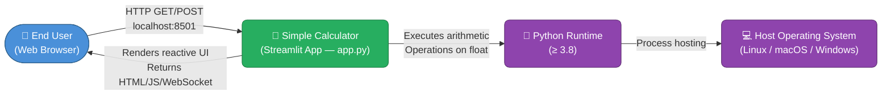

**External Interfaces:**

| Interface | Direction | Protocol | Description |
|-----------|-----------|----------|-------------|
| Browser ↔ Streamlit Server | Bidirectional | HTTP + WebSocket | UI rendering and user-event delivery |
| Streamlit ↔ Python Runtime | Internal | In-process function calls | Script re-execution on every interaction |

### 3.2 Technical Context

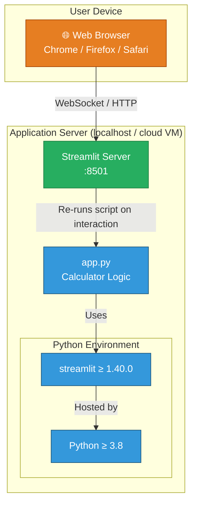

---

## 4. Solution Strategy

### 4.1 Technology Decisions

| Decision | Choice | Rationale |
|----------|--------|-----------|
| **UI Framework** | Streamlit | Zero-boilerplate reactive web UI; Python-native; no HTML/CSS/JS required from the developer |
| **Language** | Python 3 | Universal data/scripting language; natively supported by Streamlit |
| **Arithmetic Engine** | Python built-in `float` operations | Sufficient precision (6 d.p.) for a general-purpose calculator; no additional library needed |
| **State Model** | Stateless (form submit → compute → display) | Simplest possible model; no session state needed for single-operation calculations |
| **Deployment** | `streamlit run app.py` | One-command startup; no build step, no container required for local use |

### 4.2 Top-Level Decomposition Strategy

The application follows a **single-script reactive model** characteristic of Streamlit:

```
Configure Page  →  Render Form  →  Handle Submit  →  Compute Result  →  Display Result
```

- Every browser interaction causes Streamlit to **re-execute `app.py` from top to bottom**.
- The `st.form` widget **batches** all input changes until the user clicks "Calculate", preventing partial-state re-runs.
- Guard clauses (division-by-zero check + `st.stop()`) implement early-exit defensive programming.

### 4.3 Approaches to Quality Goals

| Quality Goal | Approach |
|-------------|----------|
| Correctness | Python's IEEE 754 float arithmetic; explicit division-by-zero guard before division |
| Usability | Two-column layout, descriptive labels, `st.success` / `st.error` feedback, expander for details |
| Simplicity | Single file, linear control flow, no frameworks beyond Streamlit |
| Portability | Pure-Python + one pip-installable dependency |
| Maintainability | Adding a new operation requires one `elif` branch and one entry in the `selectbox` tuple |

---

## 5. Building Block View

### 5.1 Level 1 — System Decomposition

At the highest level the system is a **single deployable unit**: the Streamlit application process.

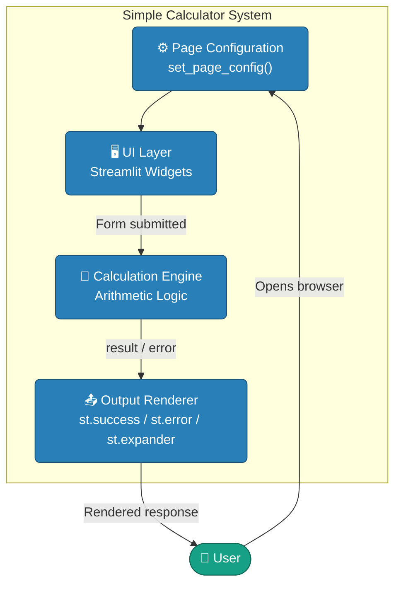

### 5.2 Level 2 — Module / Block Breakdown

Because the entire application resides in `app.py`, the "modules" are logical blocks within the script:

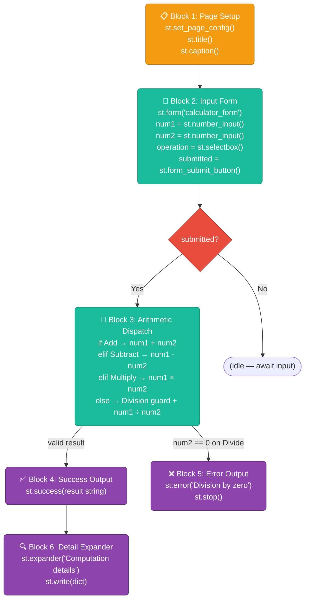

### 5.3 Level 3 — Key Component Details

| Block | Streamlit Widgets / Python Constructs | Responsibility |
|-------|--------------------------------------|----------------|
| Page Setup | `st.set_page_config`, `st.title`, `st.caption` | Sets browser tab title, icon, layout, and page heading |
| Input Form | `st.form`, `st.columns`, `st.number_input`, `st.selectbox`, `st.form_submit_button` | Collects both operands and the desired operation atomically |
| Arithmetic Dispatch | `if / elif / else` chain, Python `+`, `-`, `*`, `/` operators | Selects and executes the correct operation; maps operation name to Unicode symbol |
| Division Guard | `if num2 == 0: st.error(); st.stop()` | Prevents `ZeroDivisionError`; halts script execution with user-visible message |
| Success Output | `st.success` | Renders green result banner with full expression string |
| Detail Expander | `st.expander`, `st.write` | Provides optional drill-down into raw computation dictionary |

---

## 6. Runtime View

### 6.1 Scenario 1 — Successful Arithmetic Operation (e.g. Addition)

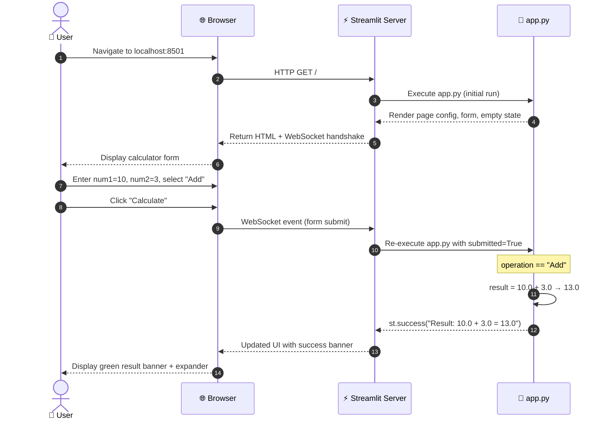

### 6.2 Scenario 2 — Division by Zero (Error Path)

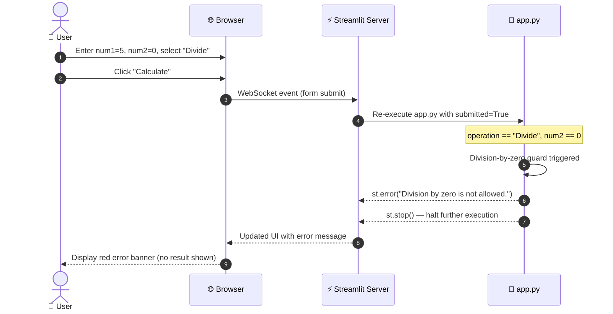

### 6.3 Scenario 3 — Idle State (No Submission)

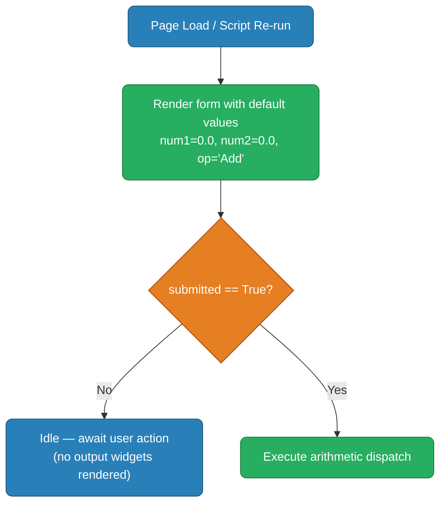

### 6.4 Supported Operations Summary

| Operation | Input | Computation | Guard |
|-----------|-------|-------------|-------|
| Add | num1, num2 | `num1 + num2` | None |
| Subtract | num1, num2 | `num1 - num2` | None |
| Multiply | num1, num2 | `num1 * num2` | None |
| Divide | num1, num2 | `num1 / num2` | `num2 == 0` → error + stop |

---

## 7. Deployment View

### 7.1 Local Development Deployment

The standard and primary deployment mode is a developer's local machine.

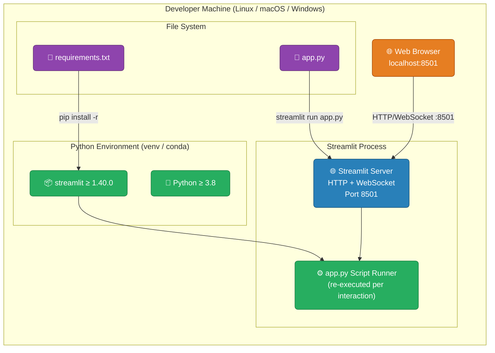

**Startup sequence:**
```
pip install -r requirements.txt
streamlit run app.py
# → Streamlit server starts on http://localhost:8501
```

### 7.2 Cloud / Container Deployment (Illustrative)

While not explicitly configured in the repository, the app can be deployed to any container-capable platform (e.g., Streamlit Community Cloud, Docker, Heroku):

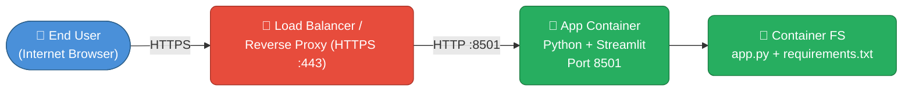

### 7.3 Infrastructure Requirements

| Requirement | Minimum | Recommended |
|-------------|---------|-------------|
| Python | 3.8 | 3.11+ |
| RAM | 256 MB | 512 MB |
| CPU | 1 vCPU | 1 vCPU |
| Disk | 50 MB (env) | 100 MB |
| Network Port | TCP 8501 (local) | TCP 443 (cloud, via proxy) |
| OS | Any (Linux preferred) | Ubuntu 22.04 LTS |

---

## 8. Cross-cutting Concepts

### 8.1 Domain Model

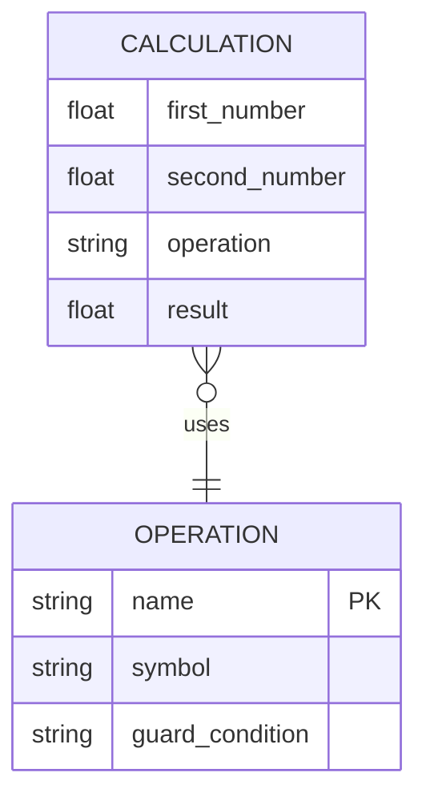

**Domain entities:**

| Entity | Description |
|--------|-------------|
| `Calculation` | A single arithmetic computation event: two operands, one operation, one result |
| `Operation` | One of {Add, Subtract, Multiply, Divide}; each has a display symbol and an optional guard |

### 8.2 UI / UX Patterns

| Pattern | Implementation | Purpose |
|---------|---------------|---------|
| **Form Batching** | `st.form` + `st.form_submit_button` | Prevents partial re-renders while user is still typing; submits all inputs atomically |
| **Two-Column Layout** | `st.columns(2)` | Side-by-side operand inputs reduce vertical scrolling |
| **Inline Feedback** | `st.success` / `st.error` | Immediate, colour-coded result without page navigation |
| **Progressive Disclosure** | `st.expander("Computation details")` | Hides raw data by default; available on demand for power users / debugging |
| **Early Exit Guard** | `st.stop()` after `st.error` | Prevents downstream code from running after a fatal validation failure |

### 8.3 Error Handling Strategy

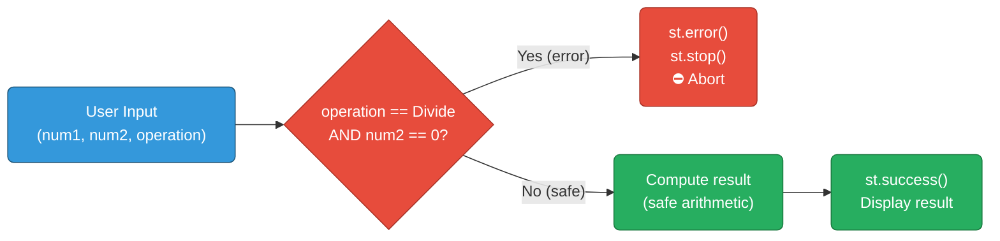

- Only **one explicit guard** is needed: division-by-zero.
- Python's `+`, `-`, `*` on `float` are unconditionally safe for all finite inputs (overflow to `inf` is not a use-case concern for a basic calculator).
- Streamlit's `st.number_input` inherently rejects non-numeric input at the widget level.

### 8.4 Numeric Precision Model

- All inputs and outputs use Python's **IEEE 754 double-precision float** (`float64`).
- Display precision is fixed at **6 decimal places** via `format="%.6f"`.
- No rounding or truncation is applied to the computed result before display.

### 8.5 Streamlit Execution Model

Streamlit follows a **reactive script re-execution** model. Understanding this is critical for all future development:

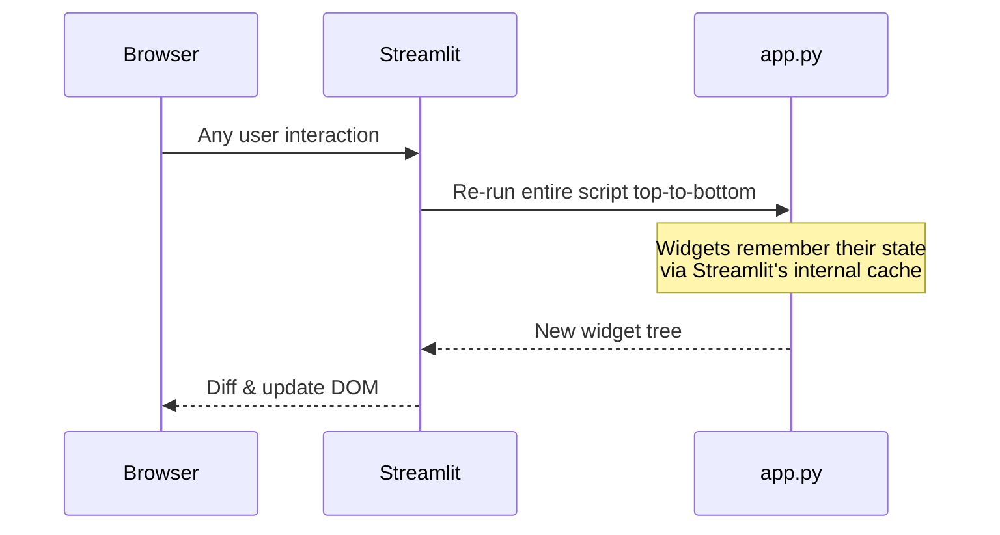

- **Implication**: There is no persistent Python object between re-runs. If state must survive re-runs, `st.session_state` must be used (currently not needed).

---

## 9. Architecture Decisions

### ADR-001 — Use Streamlit as the sole UI framework

| Field | Value |
|-------|-------|
| **Status** | Accepted |
| **Date** | Project inception |
| **Deciders** | Repository owner |

**Context**: A simple calculator needs a browser-based UI without the overhead of a full web framework (Flask + Jinja2, Django, FastAPI + React, etc.).

**Decision**: Use Streamlit exclusively. No HTML, CSS, or JavaScript is written by the developer.

**Consequences**:
- ✅ Extremely fast to build and iterate
- ✅ Single dependency in `requirements.txt`
- ✅ Built-in reactive state management
- ⚠️ UI customisation is limited to what Streamlit exposes
- ⚠️ Not suitable if REST API or non-browser clients are required in the future

---

### ADR-002 — Stateless computation model (no session state)

| Field | Value |
|-------|-------|
| **Status** | Accepted |
| **Date** | Project inception |
| **Deciders** | Repository owner |

**Context**: The calculator computes one result per form submission. There is no history, no memory of previous calculations.

**Decision**: Do not use `st.session_state`. Each submission is independent.

**Consequences**:
- ✅ Simplest possible implementation
- ✅ No state management bugs
- ⚠️ History / undo features would require introducing `st.session_state`

---

### ADR-003 — Form-batched input collection

| Field | Value |
|-------|-------|
| **Status** | Accepted |
| **Date** | Project inception |

**Context**: Streamlit re-runs the script on every widget interaction. Without a form, changing `num1` would trigger a re-run before `num2` is entered.

**Decision**: Wrap all inputs in `st.form("calculator_form")` so the script only re-runs on explicit "Calculate" click.

**Consequences**:
- ✅ Avoids premature computation with incomplete inputs
- ✅ More predictable UX
- ⚠️ Inputs cannot dynamically react to each other (acceptable for this use case)

---

### ADR-004 — Division-by-zero guard via `st.stop()`

| Field | Value |
|-------|-------|
| **Status** | Accepted |
| **Date** | Project inception |

**Context**: Python raises `ZeroDivisionError` if `num2 == 0` is passed to `/`. This must be caught before the operation.

**Decision**: Explicitly check `num2 == 0` before division, show `st.error`, and call `st.stop()` to halt execution.

**Consequences**:
- ✅ User-friendly error message instead of a Python traceback
- ✅ `st.stop()` prevents any downstream code from running
- ✅ Pattern is idiomatic Streamlit

---

### ADR-005 — Float precision fixed at 6 decimal places

| Field | Value |
|-------|-------|
| **Status** | Accepted |
| **Date** | Project inception |

**Context**: `st.number_input` requires a `format` string. Six decimal places balances readability with precision.

**Decision**: Use `format="%.6f"` for both inputs.

**Consequences**:
- ✅ Consistent display across both inputs
- ⚠️ Results are displayed with Python's default float `str()` representation (which may show more or fewer decimals)

---

## 10. Quality Requirements

### 10.1 Quality Tree

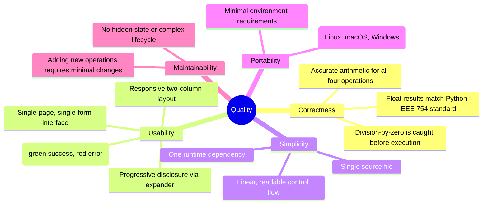

### 10.2 Quality Scenarios

| ID | Quality Attribute | Scenario | Expected Response | Priority |
|----|------------------|----------|-------------------|----------|
| QS-1 | Correctness | User calculates 10 ÷ 3 | Result displays `3.3333333333333335` (Python float) | High |
| QS-2 | Correctness | User attempts 7 ÷ 0 | Red error banner; no result shown; script halted | High |
| QS-3 | Usability | User enters values and clicks Calculate | Result visible without page reload; < 500 ms latency on localhost | High |
| QS-4 | Usability | User wants to see raw computation data | Clicks expander; sees dict with all four fields | Medium |
| QS-5 | Portability | Developer on Windows installs and runs | `pip install -r requirements.txt && streamlit run app.py` succeeds | High |
| QS-6 | Maintainability | Developer adds "Modulo" operation | Adds one `elif` branch + one entry in `selectbox` tuple; no other changes needed | Medium |

### 10.3 Code Quality Metrics

| Metric | Value | Assessment |
|--------|-------|------------|
| Source lines of code (SLOC) | ~35 | ✅ Minimal |
| Number of dependencies | 1 (`streamlit`) | ✅ Very low |
| Cyclomatic complexity | 5 (one `if` chain with 4 branches) | ✅ Low |
| Number of functions / classes | 0 (procedural script) | ✅ Appropriate for size |
| Test coverage | 0% (no test files present) | ⚠️ Gap identified |
| Documentation coverage | README + Arc42 | ✅ Good for scope |

---

## 11. Risks and Technical Debt

### 11.1 Identified Risks

| ID | Risk | Probability | Impact | Mitigation |
|----|------|-------------|--------|------------|
| R-1 | **Floating-point precision surprises** — e.g. `0.1 + 0.2 ≠ 0.3` in IEEE 754 | High | Low | Acceptable for a general calculator; document behaviour; use `decimal.Decimal` if exact arithmetic is required |
| R-2 | **No automated tests** — arithmetic logic is untested | High | Medium | Add `pytest` unit tests for each operation and the division-by-zero guard |
| R-3 | **Streamlit version drift** — future Streamlit releases may deprecate current API | Low | Medium | Pin exact version in `requirements.txt`; monitor release notes |
| R-4 | **No input validation beyond widget type** — very large floats (`1e308`) accepted without warning | Medium | Low | Add range validation if scientific/engineering use is intended |
| R-5 | **No HTTPS in default deployment** — localhost only; insecure over public network | Medium | High | Use a reverse proxy (nginx + TLS) or Streamlit Community Cloud for any public deployment |

### 11.2 Technical Debt Items

| ID | Debt Item | Severity | Effort to Resolve | Notes |
|----|-----------|----------|-------------------|-------|
| TD-1 | **Zero test coverage** | High | Low | Add `pytest` + `unittest.mock` for Streamlit components, or use `streamlit.testing.v1` |
| TD-2 | **Result display precision inconsistency** — inputs show 6 d.p., result uses Python default float repr | Low | Low | Apply `f"{result:.6f}"` in the success string for consistency |
| TD-3 | **No type annotations** | Low | Low | Add `float` type hints and a `-> None` return annotation |
| TD-4 | **No CI/CD pipeline** | Medium | Medium | Add GitHub Actions workflow for linting (`ruff`/`flake8`) and tests |
| TD-5 | **Magic strings for operations** | Low | Low | Replace `"Add"`, `"Subtract"` etc. with an `Enum` or constants for safer dispatch |

### 11.3 Recommended Next Steps

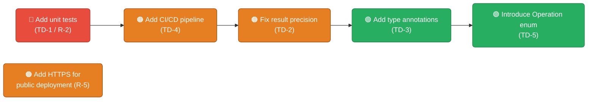

---

## 12. Glossary

| Term | Definition |
|------|-----------|
| **Arc42** | A pragmatic template for documenting software architectures, consisting of 12 standardised sections |
| **Arithmetic Dispatch** | The `if / elif / else` block in `app.py` that selects and executes the correct arithmetic operation based on user selection |
| **Division Guard** | The explicit `if num2 == 0` check that prevents `ZeroDivisionError` and shows a user-friendly error message |
| **Early Exit** | The use of `st.stop()` to immediately halt Streamlit script execution after an error condition is detected |
| **Float** | Python's `float` type — a 64-bit IEEE 754 double-precision floating-point number |
| **Form Batching** | The Streamlit pattern of wrapping widgets in `st.form` so that all inputs are submitted together on a single button click, preventing intermediate re-runs |
| **IEEE 754** | The international standard for floating-point arithmetic used by Python's `float` type |
| **Progressive Disclosure** | A UX pattern where additional detail (here: computation details) is hidden by default and revealed on user demand (via `st.expander`) |
| **Reactive Execution Model** | Streamlit's execution model where the entire Python script is re-run from top to bottom on every user interaction |
| **Session State** | `st.session_state` — a Streamlit dictionary that persists values across script re-runs; **not used** in this application |
| **SLOC** | Source Lines of Code — a basic measure of codebase size |
| **Streamlit** | An open-source Python framework for building interactive web applications without writing HTML/CSS/JS |
| **`st.error()`** | A Streamlit function that renders a red error banner in the browser |
| **`st.expander()`** | A Streamlit widget that renders a collapsible section, used here for computation details |
| **`st.form()`** | A Streamlit container that batches widget interactions and submits them as a single event |
| **`st.number_input()`** | A Streamlit widget that renders a numeric input field with configurable format and default value |
| **`st.selectbox()`** | A Streamlit widget that renders a dropdown selector |
| **`st.stop()`** | A Streamlit function that immediately halts execution of the current script run |
| **`st.success()`** | A Streamlit function that renders a green success banner in the browser |
| **WebSocket** | The persistent bidirectional communication protocol used between the Streamlit server and the browser for real-time UI updates |
| **ZeroDivisionError** | Python's built-in exception raised when dividing by zero; explicitly prevented in this application before it can be triggered |

---

*Documentation generated by the Arc42 Documentation Generator.*  
*Based on source analysis of `app.py`, `requirements.txt`, and `README.md`.*  
*Template: Arc42 v8 — https://arc42.org*
