# Simple Calculator — Architecture Documentation (arc42)

**Version:** 1.0  
**Date:** 2026-02-05  
**Status:** Generated from code analysis  
**Repository:** github-copilot-test  

---

## Table of Contents

1. [Introduction and Goals](#1-introduction-and-goals)
2. [Constraints](#2-constraints)
3. [Context and Scope](#3-context-and-scope)
4. [Solution Strategy](#4-solution-strategy)
5. [Building Block View](#5-building-block-view)
6. [Runtime View](#6-runtime-view)
7. [Deployment View](#7-deployment-view)
8. [Crosscutting Concepts](#8-crosscutting-concepts)
9. [Architectural Decisions](#9-architectural-decisions)
10. [Quality Requirements](#10-quality-requirements)
11. [Risks and Technical Debt](#11-risks-and-technical-debt)
12. [Glossary](#12-glossary)

---

## 1. Introduction and Goals

### 1.1 Requirements Overview

The **Simple Calculator** is a self-contained, single-page web application built with [Streamlit](https://streamlit.io/). It provides an interactive arithmetic calculator supporting four fundamental operations — Addition, Subtraction, Multiplication, and Division — through a clean, form-based browser UI. The application is deliberately minimal: no database, no authentication, no external API calls, and no background processes.

**Key capabilities:**

| Capability | Description |
|---|---|
| Arithmetic Computation | Perform Add, Subtract, Multiply, or Divide on two floating-point operands |
| Input Validation | Enforce numeric-only entry and a strict four-value operation enumeration |
| Division-by-Zero Guard | Detect and reject division-by-zero attempts with a user-friendly error message |
| Result Display | Show a formatted equation (using Unicode math symbols) and expandable computation details |
| Form-Gated Execution | Prevent partial recalculation on widget change; require explicit form submission |

### 1.2 Quality Goals

| Priority | Quality Goal | Description |
|---|---|---|
| 1 | Correctness | Arithmetic results must be mathematically accurate; division-by-zero must always be caught |
| 2 | Usability | The UI should be immediately understandable with no training; defaults must be sensible |
| 3 | Maintainability | The code must be easy to read and extend for a single developer |
| 4 | Safety | No unhandled exceptions should propagate to the user; error states must be graceful |

### 1.3 Stakeholders

| Role | Description | Expectations |
|---|---|---|
| End User | Person performing arithmetic calculations in a browser | Correct results, clear error messages, intuitive form |
| Developer | Maintains and extends the application | Readable code, simple deployment, clear structure |
| Product Owner | Owns the calculator feature | All four operations work correctly; division-by-zero is always blocked |
| UX Designer | Designs the user experience | Clean layout, success/error feedback, transparency via computation details |

---

## 2. Constraints

### 2.1 Technical Constraints

| Constraint | Description |
|---|---|
| Programming Language | Python (sole runtime language) |
| Web Framework | Streamlit ≥ 1.40.0 (mandatory; provides all UI rendering, widget management, and HTTP serving) |
| Numeric Type | IEEE 754 double-precision floating-point (`float`) — inherited from Python and Streamlit `number_input` |
| No Database | All state is ephemeral; no persistence layer exists |
| No External APIs | All computation is local in-process Python arithmetic |
| No Authentication | The application is publicly accessible to anyone who can reach the server port |
| Single File | All application logic resides in `app.py` (~50 lines); no modules, packages, or classes |

### 2.2 Organizational Constraints

| Constraint | Description |
|---|---|
| Single Developer | The project appears to be maintained by one person; no evidence of team workflow tooling |
| No CI/CD Pipeline | No GitHub Actions, Dockerfile, or deployment scripts are present |
| No Test Suite | Zero test coverage — no `tests/` directory, no `pytest`, no `unittest` files detected |
| Dependency Pinning | Only a minimum version constraint (`streamlit>=1.40.0`); upper bound is not pinned |

### 2.3 Conventions

| Convention | Detail |
|---|---|
| Numeric Display Precision | All number inputs display to 6 decimal places (`format="%.6f"`) |
| Operation Default | `"Add"` is pre-selected on every page load (selectbox `index=0`) |
| Unicode Math Symbols | `+` (Add), `-` (Subtract), `×` U+00D7 (Multiply), `÷` U+00F7 (Divide) |
| Error Handling Pattern | `st.error()` + `st.stop()` — Streamlit-native halt, no Python exceptions raised |

---

## 3. Context and Scope

### 3.1 Business Context

The Simple Calculator exists entirely within a single business domain: **Arithmetic Computation**. There are no external partner systems, payment providers, data feeds, or authentication services. The only external actor is the **End User** operating a web browser.

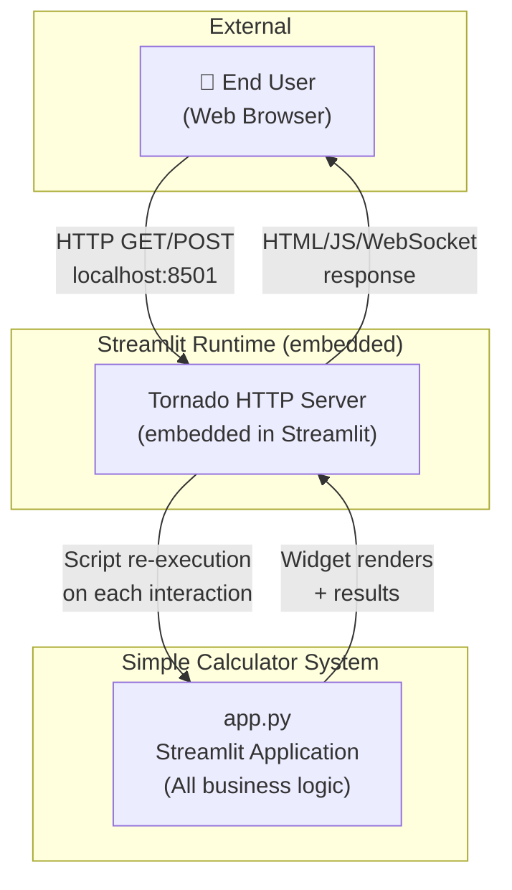

**External Interfaces:**

| Partner/Actor | Interface Type | Protocol | Description |
|---|---|---|---|
| End User | Web Browser | HTTP + WebSocket | User accesses the app at `http://localhost:8501`; Streamlit manages the session via WebSocket |
| PyPI | Package Registry | HTTPS (pip install) | `streamlit>=1.40.0` is resolved from PyPI at environment setup time only; no runtime calls |

### 3.2 Technical Context

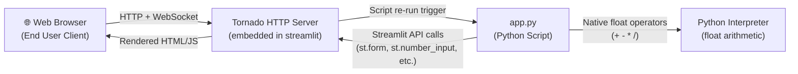

---

## 4. Solution Strategy

### 4.1 Technology Decisions

| Decision | Technology | Rationale |
|---|---|---|
| Backend Language | Python 3.x | General-purpose, widely known, native float arithmetic |
| Web Framework | Streamlit ≥ 1.40.0 | Zero-boilerplate Python-only web apps; no HTML/CSS/JS required |
| HTTP Server | Tornado (embedded) | Bundled with Streamlit; no separate server configuration needed |
| Data Storage | None (stateless) | Arithmetic computation requires no persistence |
| Packaging | pip + `requirements.txt` | Standard Python dependency management |

### 4.2 Top-Level Decomposition

The system follows a **single-script procedural monolith** architecture — the simplest viable structure for a self-contained, single-user tool with no persistence requirements.

The script is logically divided into three sequential functional blocks that execute top-to-bottom on every Streamlit re-run:

| Block | Responsibility |
|---|---|
| **Page Configuration Block** | Sets page title, icon, layout, heading, and caption |
| **Calculator Form Block** | Renders the input form; captures `num1`, `num2`, `operation`, `submitted` |
| **Calculation & Output Block** | Guarded by `if submitted:`; dispatches arithmetic; handles errors; displays results |

### 4.3 Quality Approach

| Quality Goal | Approach |
|---|---|
| Correctness | Python native float operators; explicit division-by-zero guard (BR-001) |
| Usability | Streamlit form batching (BR-009) prevents partial recalculation; `st.success`/`st.error` give clear feedback |
| Maintainability | All logic in one ~50-line file; clear if/elif/else dispatch; no hidden state |
| Safety | `st.error()` + `st.stop()` prevent any result display after an error |

---

## 5. Building Block View

### 5.1 Level 1: System Context

At the highest level, the system is a single Streamlit application process that serves one HTML page to one or more browser clients.

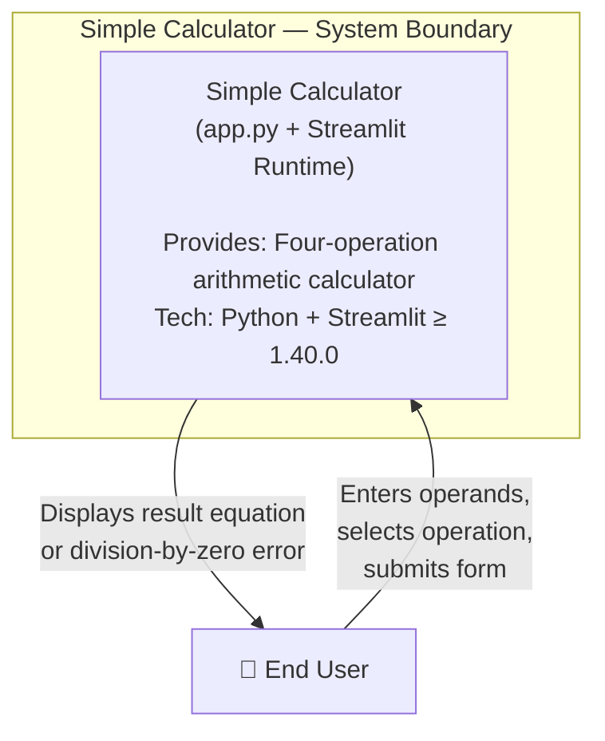

### 5.2 Level 2: Application Internals

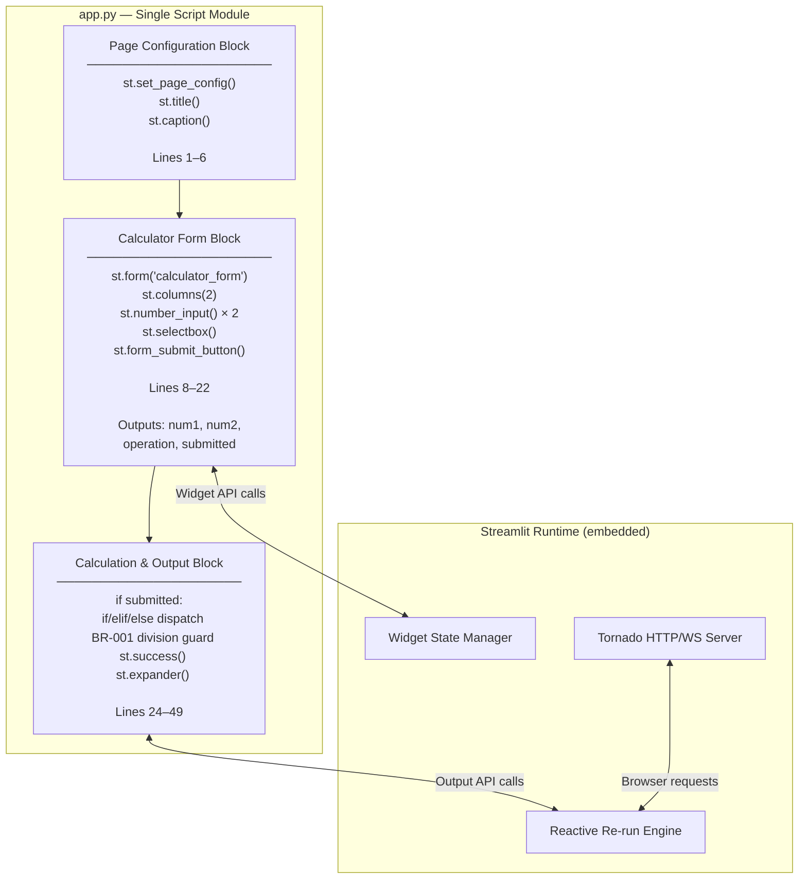

### 5.3 Level 3: Component Detail

#### 5.3.1 Page Configuration Block (Lines 1–6)

**Purpose:** Establishes the visual identity and layout before any user interaction. Runs unconditionally on every script execution.

| Streamlit Call | Effect |
|---|---|
| `st.set_page_config(page_title="Calculator", page_icon="🧮", layout="centered")` | Sets browser tab title, favicon, and page width |
| `st.title("Simple Calculator")` | Renders H1 heading |
| `st.caption("Perform quick arithmetic with a clean Streamlit UI.")` | Renders descriptive subtitle |

#### 5.3.2 Calculator Form Block (Lines 8–22)

**Purpose:** Captures all three user inputs atomically via `st.form`. The form context prevents Streamlit's default reactive re-run on individual widget change — calculation only fires on explicit submission (BR-009).

**Outputs:** `num1: float`, `num2: float`, `operation: str`, `submitted: bool`

| Widget | Variable | Type | Constraint |
|---|---|---|---|
| `st.number_input("First number", value=0.0, format="%.6f")` | `num1` | `float` | Any finite IEEE 754 double |
| `st.number_input("Second number", value=0.0, format="%.6f")` | `num2` | `float` | Any finite IEEE 754 double; must ≠ 0 for Divide |
| `st.selectbox("Operation", ("Add","Subtract","Multiply","Divide"), index=0)` | `operation` | `str` | Enum: exactly 4 values (BR-003) |
| `st.form_submit_button("Calculate")` | `submitted` | `bool` | `True` only when button clicked |

#### 5.3.3 Calculation & Output Block (Lines 24–49)

**Purpose:** Contains all business logic. Gated by `if submitted:`. Dispatches to one of four arithmetic branches, enforces the division-by-zero guard, and renders either a success result or an error halt.

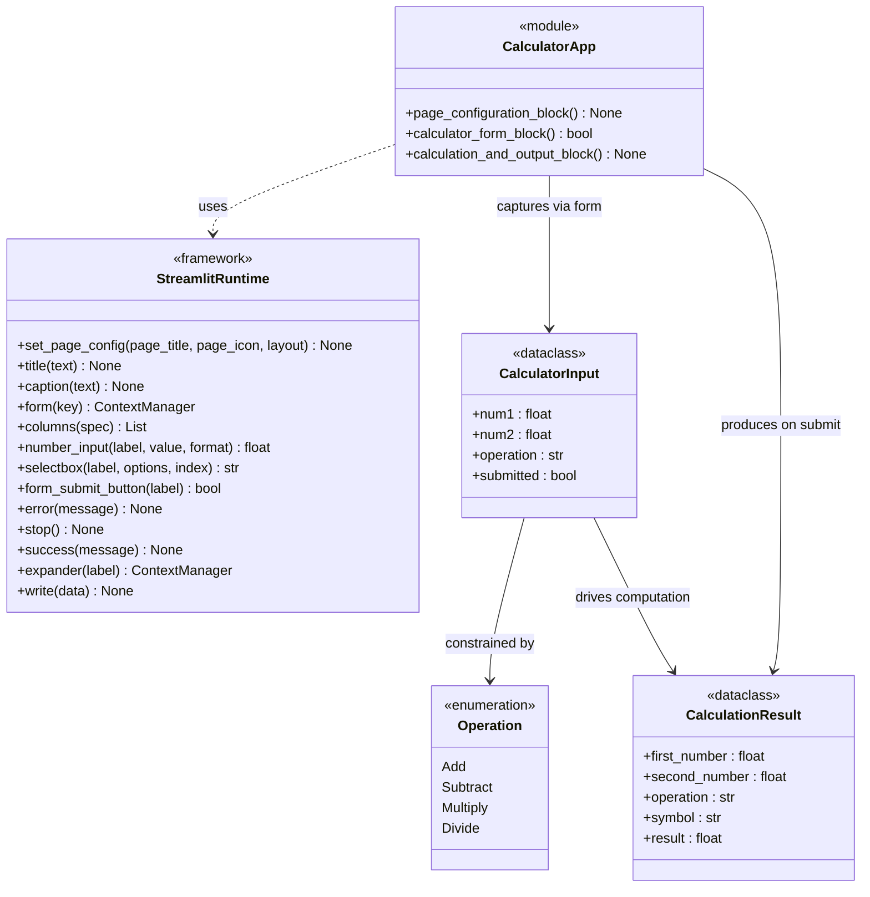

> **Modelling note:** `CalculatorApp`, `CalculatorInput`, and `CalculationResult` are logical constructs for diagrammatic clarity. The actual source code uses bare Python primitive variables (`num1`, `num2`, `operation`, `submitted`, `result`, `symbol`), not formal class definitions.

---

## 6. Runtime View

### 6.1 Scenario 1: Successful Calculation (Happy Path)

**Description:** User enters two numbers, selects an operation (e.g., Multiply: 10.0 × 5.0), and clicks Calculate. The system computes and displays the result.

Streamlit's **reactive re-run model** means the full script executes twice: once on page load (`submitted = False`) and once on form submission (`submitted = True`).

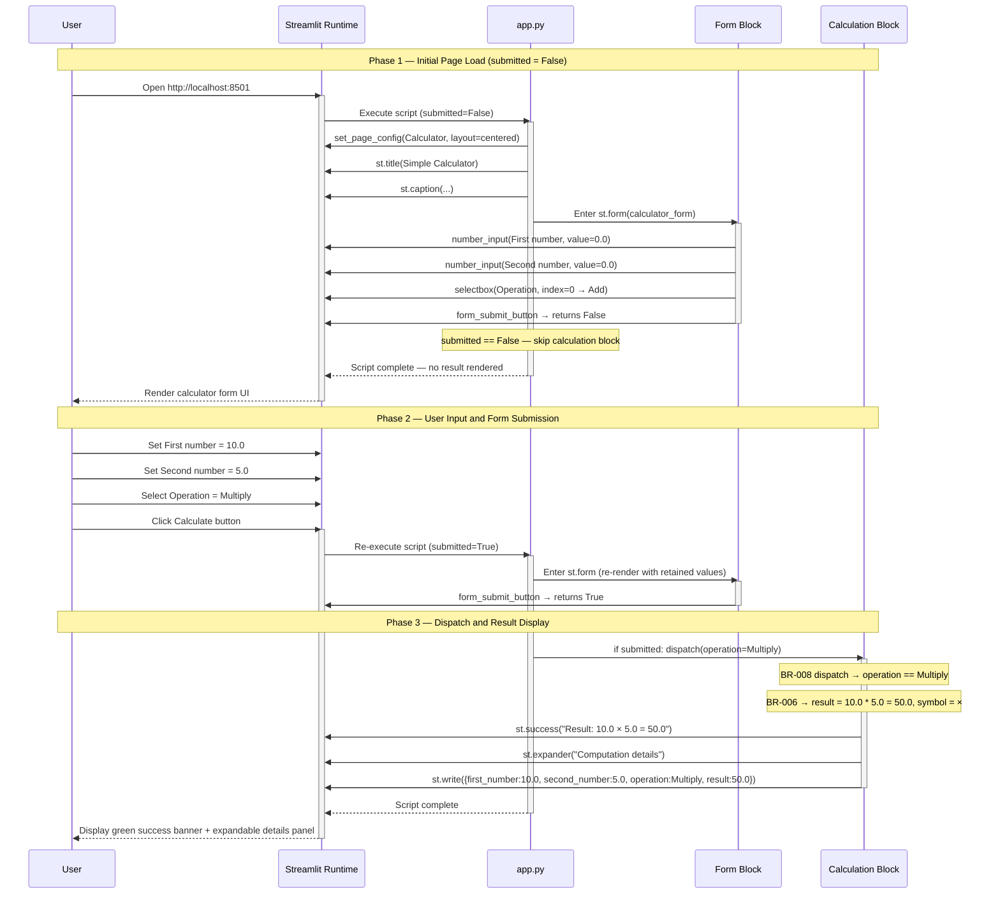

### 6.2 Scenario 2: Division-by-Zero Error Path

**Description:** User selects Divide with `num2 = 0`. BR-001 fires, rendering an error banner and halting script execution. No result is ever produced.

```mermaid
sequenceDiagram
    participant U as User
    participant ST as Streamlit Runtime
    participant APP as app.py
    participant CALC as Calculation Block
    participant GUARD as BR-001 Division Guard

    U->>ST: Set First number = 7.0
    U->>ST: Set Second number = 0.0
    U->>ST: Select Operation = Divide
    U->>ST: Click Calculate button

    activate ST
    ST->>APP: Re-execute script (submitted=True)
    activate APP
    Note over APP: submitted == True — enter calculation block
    APP->>CALC: if submitted: dispatch(operation=Divide)
    activate CALC
    Note over CALC: BR-008 — else branch (implicitly Divide), symbol = ÷
    CALC->>GUARD: Evaluate: num2 == 0?
    activate GUARD
    Note over GUARD: BR-001 TRIGGERED — num2 is 0.0
    GUARD->>ST: st.error("Division by zero is not allowed.")
    GUARD->>ST: st.stop()
    Note over ST: Streamlit halts all further script execution
    Note over CALC: result never computed — lines after st.stop() unreachable
    deactivate GUARD
    deactivate CALC
    APP-->>ST: Script halted by st.stop()
    deactivate APP
    ST-->>U: Render red error banner only — no result, no expander
    deactivate ST
    Note over U: User sees error; form remains visible; may correct num2 and resubmit
```

### 6.3 Business Workflow: Calculator Computation Workflow (WF-001)

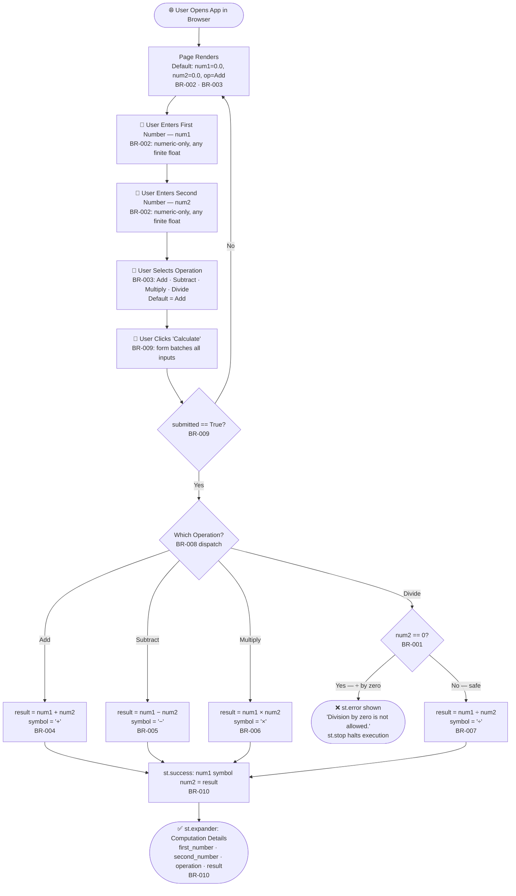

### 6.4 Operation Dispatch Detail (PROC-002)

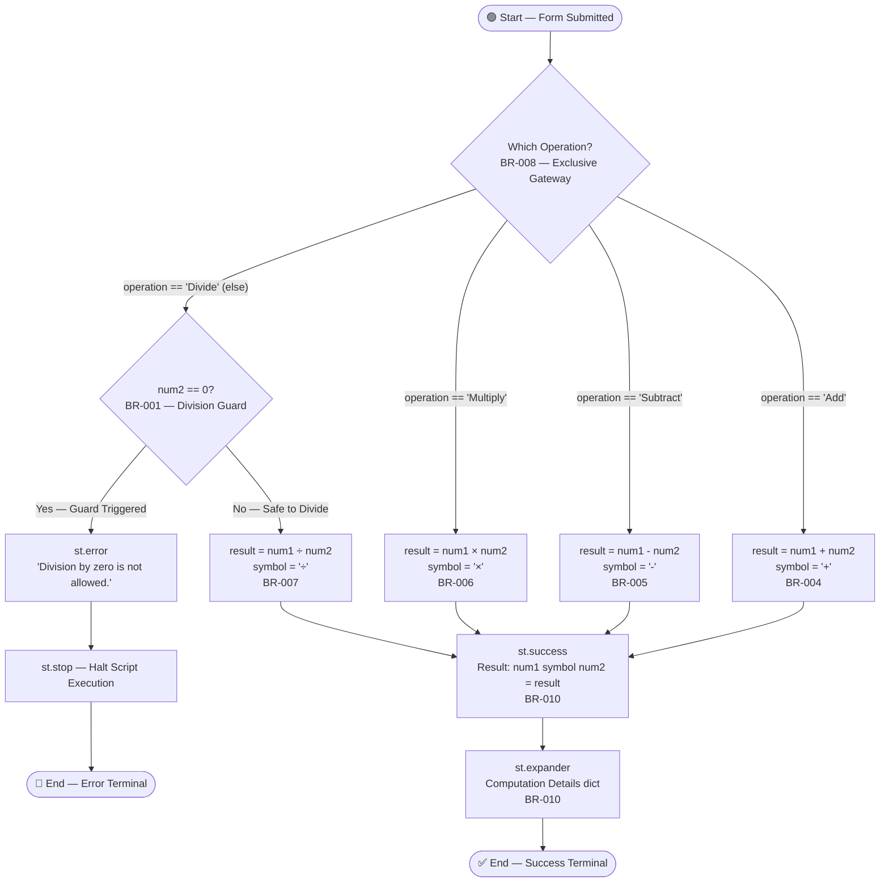

---

## 7. Deployment View

### 7.1 Local Development Deployment (Current)

The only documented deployment mode is local developer execution via `streamlit run app.py`.

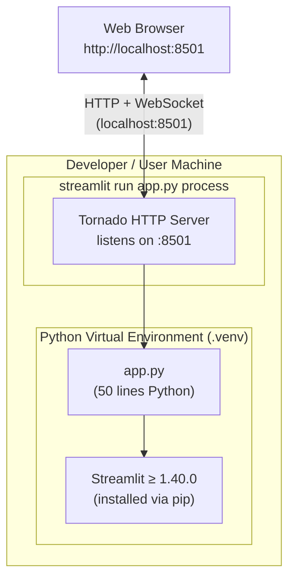

**Startup command:** `streamlit run app.py`  
**Default URL:** `http://localhost:8501`

### 7.2 Deployment Steps

| Step | Command | Description |
|---|---|---|
| 1 | `python3 -m venv .venv` | Create isolated Python environment |
| 2 | `source .venv/bin/activate` | Activate virtual environment |
| 3 | `pip install -r requirements.txt` | Install `streamlit>=1.40.0` from PyPI |
| 4 | `streamlit run app.py` | Start Tornado HTTP server + serve application |

### 7.3 Deployment Considerations

| Consideration | Current State | Recommendation |
|---|---|---|
| Cloud Deployment | Not configured | Can be deployed to Streamlit Community Cloud, Heroku, or Docker with minimal changes |
| Port Configuration | Hardcoded to `:8501` (Streamlit default) | Configurable via `--server.port` CLI flag |
| Multi-user Sessions | Each browser tab gets an isolated Streamlit session | Stateless by design; no shared state issues |
| HTTPS/TLS | Not configured for local dev | Required if deploying publicly; handled by reverse proxy (nginx/Caddy) |

---

## 8. Crosscutting Concepts

### 8.1 Domain Model

The application operates on a minimal set of primitives — no ORM, no schema, no persistence. The logical data model:

```mermaid
classDiagram
    class CalculatorInput {
        <<Form Inputs>>
        +num1 : float
        +num2 : float
        +operation : str
        +submitted : bool
    }

    class Operation {
        <<Enumeration>>
        Add
        Subtract
        Multiply
        Divide
    }

    class CalculationResult {
        <<Output Record>>
        +first_number : float
        +second_number : float
        +operation : str
        +symbol : str
        +result : float
    }

    CalculatorInput --> Operation : constrained by (BR-003)
    CalculatorInput --> CalculationResult : transforms into (BR-004 to BR-007)
```

**Data constraints:**

| Field | Type | Default | Precision | Constraints |
|---|---|---|---|---|
| `num1` | `float` | `0.0` | 6 decimal places (display) | Any finite IEEE 754 double |
| `num2` | `float` | `0.0` | 6 decimal places (display) | Any finite IEEE 754 double; must ≠ 0 for Divide |
| `operation` | `str` | `"Add"` | — | Enum: `"Add"`, `"Subtract"`, `"Multiply"`, `"Divide"` |
| `result` | `float` | computed | Python float precision | Output only |
| `symbol` | `str` | computed | — | One of: `+`, `-`, `×`, `÷` |

### 8.2 Error Handling

The application uses a **Streamlit-native error handling pattern** — no Python exceptions are raised or caught:

| Scenario | Mechanism | User Experience |
|---|---|---|
| Division by zero | `st.error(msg)` + `st.stop()` | Red error banner; no result rendered; form stays visible for retry |
| Non-numeric input | Streamlit `number_input` widget enforces numeric-only at browser level | Non-numeric characters cannot be entered |
| Invalid operation | Streamlit `selectbox` enforces enum at widget level | Impossible to submit an invalid operation |

**No `try/except` blocks exist in the codebase.** All error prevention is structural (widget constraints) or Streamlit-native (`st.stop()`).

### 8.3 Logging and Monitoring

**Current state:** Zero logging. No `print()`, no `logging` module, no `st.write()` for debug output in the production code path.

The `st.expander("Computation details")` panel serves as a lightweight transparency mechanism for the user — showing `first_number`, `second_number`, `operation`, and `result` after every successful calculation.

### 8.4 Security Concepts

| Concern | Current Approach | Risk Level |
|---|---|---|
| Input injection | Streamlit widgets only accept typed Python values (float/str); no raw HTML/SQL input | Low |
| Authentication | None — the app is open to anyone who can reach port 8501 | Medium (for public deployment) |
| Data privacy | No data is stored or transmitted beyond the current browser session | Low |
| Dependency security | Single dependency (`streamlit>=1.40.0`); no upper bound pinning | Low-Medium |

### 8.5 Persistence

**None.** The application is entirely stateless. Each Streamlit script re-run starts with fresh Python variable bindings. No `st.session_state` is used. Prior calculation results are discarded when the user changes inputs and resubmits.

### 8.6 Validation

Validation is implemented at two levels:

| Level | Mechanism | Rules Enforced |
|---|---|---|
| Widget-level (structural) | `st.number_input` enforces numeric type; `st.selectbox` enforces enumeration | BR-002, BR-003 |
| Business logic (runtime) | `if num2 == 0:` check inside the Divide branch | BR-001 |
| Form gate | `if submitted:` wraps all calculation logic | BR-009 |

No third-party validation library (e.g., Pydantic, Marshmallow) is used.

### 8.7 Reactive Execution Model

Streamlit re-executes the **entire `app.py` script from top to bottom** on every user interaction. The `st.form` context manager (BR-009) is critical: it **batches all widget changes** inside the form and only triggers a re-run when the "Calculate" submit button is explicitly clicked, preventing partial recalculation on every keystroke.

---

## 9. Architectural Decisions

### ADR-001: Single-File Procedural Architecture

**Status:** Implemented (observed in code)

**Context:** A simple four-operation calculator has minimal complexity. Splitting into modules, packages, or classes would add structure without meaningful benefit at this scale.

**Decision:** All application logic lives in a single `app.py` file (~50 lines). No classes, no modules, no packages.

**Consequences:**
- ✅ Extremely easy to read, understand, and run
- ✅ Zero import/dependency overhead beyond Streamlit
- ❌ Will not scale gracefully if significant features are added (history, scientific ops, etc.)
- ❌ No separation of concerns — UI and business logic are co-located

---

### ADR-002: Streamlit as the Sole Web Framework

**Status:** Implemented (observed in code)

**Context:** The developer chose Streamlit to avoid writing HTML, CSS, JavaScript, or a REST API layer. Streamlit converts Python scripts into interactive web apps automatically.

**Decision:** Use `streamlit>=1.40.0` as the only dependency. Rely on its embedded Tornado server, widget system, and reactive execution model.

**Consequences:**
- ✅ No frontend code required; Python-only development
- ✅ Fast prototyping; form-based UI with one `st.form` call
- ❌ Tightly coupled to Streamlit's execution model (full script re-run on every interaction)
- ❌ Limited control over page rendering, routing, and state management

---

### ADR-003: st.form for Input Batching (BR-009)

**Status:** Implemented (observed in code)

**Context:** Without `st.form`, Streamlit re-runs the script on every individual widget change. For a calculator, this would cause premature calculation as the user types, producing confusing intermediate results.

**Decision:** Wrap all inputs in `st.form("calculator_form")` so that the calculation only fires when the user explicitly clicks the "Calculate" submit button.

**Consequences:**
- ✅ Calculation only triggers on deliberate user action
- ✅ Prevents intermediate/partial result display
- ❌ `Enter` key in a number field does not submit the form by default in Streamlit

---

### ADR-004: st.error + st.stop for Division-by-Zero Handling (BR-001)

**Status:** Implemented (observed in code)

**Context:** Division by zero must be blocked before Python evaluates `num1 / num2` (which would raise `ZeroDivisionError`). The application must show a friendly message rather than a stack trace.

**Decision:** Use `st.error("Division by zero is not allowed.")` followed immediately by `st.stop()` — Streamlit's native script halt mechanism.

**Consequences:**
- ✅ User sees a clear, friendly error banner
- ✅ No Python exception propagates; no stack trace exposed
- ✅ Form remains visible so the user can correct their input
- ❌ The `else` branch assigns `symbol = '÷'` before the guard check — symbol is set but never used in the error path (minor code smell)

---

### ADR-005: Implicit else = Divide Pattern (BR-008)

**Status:** Implemented (observed in code)

**Context:** The operation dispatch uses `if/elif/elif/else`. Because the operation is constrained to exactly four values by the `selectbox` widget (BR-003), the `else` branch implicitly and exclusively handles `"Divide"`.

**Decision:** Use `else:` as the Divide branch rather than `elif operation == "Divide":`.

**Consequences:**
- ✅ Slightly more concise code
- ❌ The implicit mapping is a subtle trap: if a new operation were added to the selectbox without a corresponding `elif`, it would silently route to the Divide branch — a latent bug risk (see TD-002)

---

## 10. Quality Requirements

### 10.1 Quality Tree

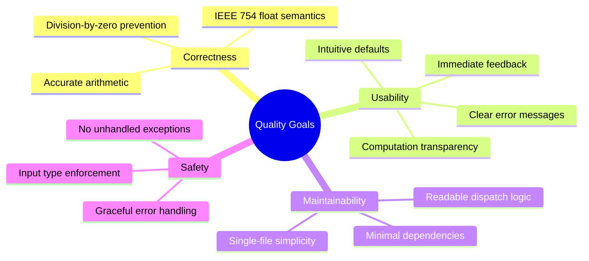

### 10.2 Quality Scenarios

| ID | Quality Attribute | Scenario | Stimulus | Expected Response | Measure |
|---|---|---|---|---|---|
| QS-1 | Correctness | User divides any number by zero | `operation="Divide"`, `num2=0.0` | Error banner shown; no result produced; `st.stop()` called | 100% of cases caught by BR-001 |
| QS-2 | Correctness | User performs a valid multiplication | `10.0 × 5.0` submitted | Result `50.0` displayed in success banner | Mathematically exact for IEEE 754 floats |
| QS-3 | Usability | User changes inputs without clicking Calculate | Widget values change | No recalculation occurs | 0 premature re-calculations (BR-009 enforced) |
| QS-4 | Usability | User wants to inspect raw computation values | Clicks "Computation details" expander | Structured dict with `first_number`, `second_number`, `operation`, `result` shown | Always available after successful calculation |
| QS-5 | Safety | User enters non-numeric characters | Types letters into number field | Input rejected by browser/Streamlit widget | 0 non-float values reach Python code |
| QS-6 | Maintainability | Developer adds a fifth operation | Modifies `app.py` | New operation works without breaking existing four | Change confined to ≤ 5 lines in one file |

---

## 11. Risks and Technical Debt

### 11.1 Technical Risks

| Risk ID | Risk | Probability | Impact | Mitigation |
|---|---|---|---|---|
| R-001 | **Float overflow / NaN results** — Very large operands (e.g. `1e308 * 1e308`) produce Python `inf`; `0.0 * float('inf')` produces `nan`. Neither is caught or shown as an error. | Medium | Medium | Add post-calculation guard: `if not math.isfinite(result): st.error(...)` |
| R-002 | **Implicit else = Divide trap** — Adding a fifth operation to the selectbox without a corresponding `elif` would silently route to the Divide branch. | Low | High | Replace `else:` with `elif operation == "Divide":` and add an explicit `else: st.error("Unknown operation")` |
| R-003 | **Zero test coverage** — Any refactoring could introduce regressions with no automated safety net. | High | Medium | Add `pytest` + Streamlit `AppTest` unit tests for all four operations and the division-by-zero path |
| R-004 | **Unpinned upper version bound** — `streamlit>=1.40.0` allows any future major version; a breaking Streamlit API change could silently break the app. | Low | High | Pin to `streamlit>=1.40.0,<2.0.0` in `requirements.txt` |
| R-005 | **No multi-user session isolation testing** — Multiple concurrent users share the same Streamlit process; state isolation relies entirely on Streamlit's session model, which has not been tested. | Low | Low | Stateless design minimises risk; document reliance on Streamlit session isolation |

### 11.2 Technical Debt

| ID | Type | Description | Priority | Estimated Effort |
|---|---|---|---|---|
| TD-001 | **Test Debt** | Zero automated test coverage. No unit tests for any of the 10 business rules, no integration tests for the Streamlit UI, no regression safety net. | High | 4–8 hours |
| TD-002 | **Design Debt** | Implicit `else` = Divide pattern (ADR-005). Adding a fifth operation without an `elif` would silently misroute to Divide. | Medium | 30 minutes |
| TD-003 | **Code Debt** | Subtract symbol uses ASCII hyphen-minus `-` (U+002D), inconsistent with Multiply `×` (U+00D7) and Divide `÷` (U+00F7), which use proper Unicode math symbols. | Low | 5 minutes |
| TD-004 | **Code Debt** | No floating-point result precision formatting. `0.1 + 0.2` displays as `0.30000000000000004` rather than `0.300000`. | Medium | 1 hour |
| TD-005 | **Feature Debt** | No calculation history. Each result is ephemeral; there is no `st.session_state`-backed log of past calculations. | Low | 2–4 hours |
| TD-006 | **Operational Debt** | No logging, no monitoring, no health check endpoint. Failures are silent unless a user reports them. | Medium | 2 hours |
| TD-007 | **Operational Debt** | No Dockerfile, no CI/CD pipeline, no cloud deployment configuration. | Low | 2–4 hours |

### 11.3 Improvement Recommendations

| Priority | Recommendation | Rationale |
|---|---|---|
| 🔴 High | Add automated tests (`pytest` + Streamlit `AppTest`) | Zero test coverage is the highest maintainability risk |
| 🔴 High | Add `math.isfinite(result)` guard after arithmetic | Prevents `inf`/`nan` results silently appearing as valid output |
| 🟡 Medium | Replace implicit `else` with explicit `elif operation == "Divide": ... else: st.error(...)` | Eliminates the silent misrouting risk for future operation additions |
| 🟡 Medium | Format result with `round(result, 10)` or `f"{result:.10g}"` | Eliminates confusing IEEE 754 rounding artifacts in display |
| 🟢 Low | Replace `symbol = "-"` with `symbol = "−"` (U+2212) | Unicode typographic consistency across all four symbols |
| 🟢 Low | Add `st.session_state` calculation history | Improves transparency and auditability for power users |
| 🟢 Low | Pin `streamlit<2.0.0` in `requirements.txt` | Guards against future breaking API changes |

---

## 12. Glossary

### 12.1 Domain Terms

| Term | Definition |
|---|---|
| **Operand** | A numeric value on which an arithmetic operation is performed. In this system: `num1` (first/left operand) and `num2` (second/right operand). |
| **Operation** | One of four arithmetic functions the user can select: Add, Subtract, Multiply, Divide. Constrained by BR-003. |
| **Result** | The computed floating-point output of applying the selected operation to the two operands. |
| **Division by Zero** | The mathematically undefined operation of dividing any number by zero. Blocked by BR-001 in this system. |
| **Symbol** | The Unicode character displayed between the two operands in the result equation: `+`, `-`, `×`, or `÷`. |
| **Computation Details** | The structured dictionary (`first_number`, `second_number`, `operation`, `result`) shown in the collapsible `st.expander` panel after a successful calculation. |
| **Form Gate** | The `if submitted:` guard (BR-009) that prevents any calculation from executing until the user explicitly clicks the "Calculate" button. |

### 12.2 Technical Terms

| Term | Definition |
|---|---|
| **Streamlit** | An open-source Python framework that converts Python scripts into interactive web applications. Version ≥ 1.40.0 is required. |
| **Tornado** | An asynchronous Python HTTP server embedded within Streamlit; serves the application on port 8501 by default. |
| **Reactive Re-run** | Streamlit's execution model: the full `app.py` script is re-executed top-to-bottom on every user interaction. |
| **`st.form`** | A Streamlit context manager that batches all widget changes inside a form boundary and only triggers a script re-run when the submit button is explicitly clicked. |
| **`st.stop()`** | A Streamlit API call that immediately halts all further execution of the current script run. Used in BR-001 to prevent result display after a division-by-zero error. |
| **`st.error()`** | A Streamlit API call that renders a red error banner in the browser UI. |
| **`st.success()`** | A Streamlit API call that renders a green success banner in the browser UI. |
| **`st.expander()`** | A Streamlit widget that renders a collapsible panel with a labelled toggle. Used to show computation details. |
| **IEEE 754** | The international standard for floating-point arithmetic. Python `float` is a 64-bit IEEE 754 double-precision number, subject to representation limits (e.g., `0.1 + 0.2 ≠ 0.3` exactly). |
| **`if/elif/else` dispatch** | The operation routing logic in the calculation block that maps the `operation` string to the correct arithmetic formula. |
| **BR-NNN** | Business Rule identifier (e.g., BR-001). References the 10 business rules extracted from `app.py` and documented in `geninsights-business-rules.json`. |
| **`st.session_state`** | A Streamlit mechanism for persisting data across script re-runs within a single browser session. Currently **not used** in this application. |

---

## Appendix

### A. Business Rules Quick Reference

| Rule ID | Name | Type | Priority |
|---|---|---|---|
| BR-001 | Division by Zero Guard | Validation | ⚠️ Critical |
| BR-002 | Numeric-Only Operand Input | Validation | High |
| BR-003 | Operation Enumeration Constraint | Validation | High |
| BR-004 | Addition Calculation | Calculation | ⚠️ Critical |
| BR-005 | Subtraction Calculation | Calculation | ⚠️ Critical |
| BR-006 | Multiplication Calculation | Calculation | ⚠️ Critical |
| BR-007 | Division Calculation | Calculation | ⚠️ Critical |
| BR-008 | Operation Dispatch Decision | Decision | ⚠️ Critical |
| BR-009 | Form-Gate: Calculate Only on Explicit Submission | Process | High |
| BR-010 | Result Display with Unicode Mathematical Symbols | Display/Formatting | Medium |

### B. Business Rule Dependency Graph

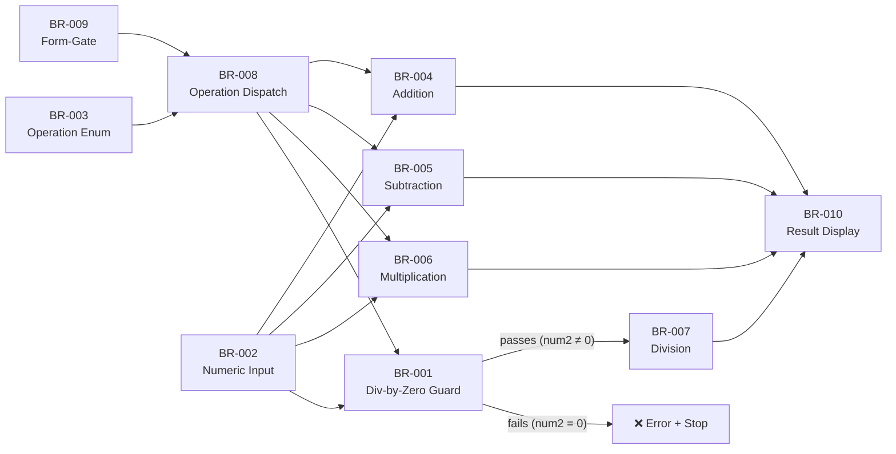

### C. Use Case Diagram

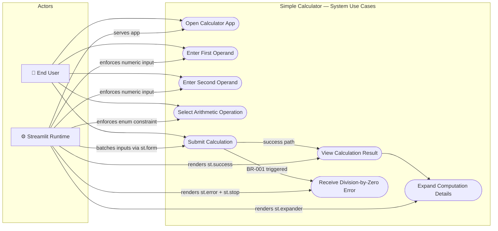

### D. File Inventory

| File | Classification | Language | Lines | Role |
|---|---|---|---|---|
| `app.py` | Business | Python | 50 | Sole application entry point; all business logic |
| `requirements.txt` | Technical | pip-requirements | 1 | Dependency manifest (`streamlit>=1.40.0`) |
| `README.md` | Documentation | Markdown | 17 | Developer onboarding; setup and run instructions |

### E. Analysis Metadata

| Attribute | Value |
|---|---|
| Analysis Timestamp | 2026-02-05T15:23:44Z – 2026-02-05T17:00:00Z |
| Repository | github-copilot-test |
| Total Files Analyzed | 3 |
| Languages Detected | Python |
| Primary Frameworks | Streamlit |
| Business Rules Extracted | 10 (BR-001 to BR-010) |
| Workflows Identified | 1 (WF-001) |
| UML Diagrams Generated | 4 (CD-001, SD-001, SD-002, UC-001) |
| BPMN Process Diagrams | 3 (PROC-001, PROC-002, PROC-003) |
| Code Quality Score | 62/100 |
| Test Coverage | 0% |

---

*This document was automatically generated from source code analysis of the `github-copilot-test` repository.*  
*Generated by **arc42-agent** · Sources: analysis_results, business_rules, code_assessment, architecture, uml, bpmn, capability_mapping*
