# Architecture Documentation (Arc42)

**Project**: Streamlit Calculator Application  
**Version**: 1.0.0  
**Date**: 2025-01-01  
**Generated by**: Arc42 Documentation Generator  
**Source analysed**: `app.py` · `requirements.txt` · `README.md`

---

## Table of Contents

1. [Introduction and Goals](#1-introduction-and-goals)
2. [Constraints](#2-constraints)
3. [Context and Scope](#3-context-and-scope)
4. [Solution Strategy](#4-solution-strategy)
5. [Building Block View](#5-building-block-view)
6. [Runtime View](#6-runtime-view)
7. [Deployment View](#7-deployment-view)
8. [Cross-cutting Concepts](#8-cross-cutting-concepts)
9. [Architecture Decisions](#9-architecture-decisions)
10. [Quality Requirements](#10-quality-requirements)
11. [Risks and Technical Debt](#11-risks-and-technical-debt)
12. [Glossary](#12-glossary)

---

## 1. Introduction and Goals

### 1.1 Purpose

The **Streamlit Calculator Application** is a lightweight, browser-based arithmetic tool that allows users to perform the four fundamental mathematical operations — Addition, Subtraction, Multiplication, and Division — through a clean, form-driven web interface. It is implemented as a single Python file using the [Streamlit](https://streamlit.io) framework and requires no database, no backend API, and no user authentication.

### 1.2 Business Goals and Functional Requirements

| ID   | Goal / Requirement                                                                 | Priority |
|------|------------------------------------------------------------------------------------|----------|
| G-01 | Users can enter two floating-point numbers and select an arithmetic operation      | Must     |
| G-02 | The application calculates and displays the result immediately after form submission | Must   |
| G-03 | Division by zero is detected and a meaningful error message is shown               | Must     |
| G-04 | Computation details (inputs, operation, result) are accessible in an expandable panel | Should |
| G-05 | The interface is accessible via a standard web browser without client-side installation | Must  |

### 1.3 Quality Goals

The top quality goals for this system, in priority order:

| Priority | Quality Goal        | Scenario                                                                                  |
|----------|---------------------|-------------------------------------------------------------------------------------------|
| 1        | **Correctness**     | Every arithmetic result must be numerically accurate to at least 6 decimal places         |
| 2        | **Usability**       | A first-time user can perform a calculation within 10 seconds of opening the page         |
| 3        | **Reliability**     | Division by zero never causes an unhandled exception; a clear error message is always shown |
| 4        | **Simplicity**      | The entire application can be understood by reading a single 50-line source file          |
| 5        | **Portability**     | The app runs on any OS where Python ≥ 3.8 and pip are available                          |

### 1.4 Stakeholders

| Role                  | Interest / Expectation                                                              |
|-----------------------|-------------------------------------------------------------------------------------|
| **End User**          | Fast, accurate arithmetic calculations with an intuitive interface                  |
| **Developer**         | Minimal codebase, easy to extend with new operations                                |
| **System Operator**   | Zero-infrastructure deployment; `streamlit run app.py` is sufficient               |
| **Code Reviewer**     | Readable, idiomatic Python; straightforward test surface                            |

---

## 2. Constraints

### 2.1 Technical Constraints

| ID    | Constraint                                                                                  | Rationale / Source                              |
|-------|---------------------------------------------------------------------------------------------|-------------------------------------------------|
| TC-01 | Application runtime language is **Python** (≥ 3.8 implied by Streamlit 1.40.0 requirements) | `app.py`, `requirements.txt`                  |
| TC-02 | UI framework is exclusively **Streamlit ≥ 1.40.0**; no additional web framework is used    | `requirements.txt`: `streamlit>=1.40.0`        |
| TC-03 | No persistent storage — the application is fully stateless; no database is used             | `app.py` (no storage APIs referenced)          |
| TC-04 | No external network calls — all computation is local to the Python process                  | `app.py` (no HTTP clients or external imports) |
| TC-05 | Numeric precision is determined by Python's IEEE 754 64-bit floating-point (`float`)        | `app.py`: `value=0.0, format="%.6f"`           |
| TC-06 | The application is a **single-file** deployment artefact (`app.py`)                         | Repository structure                           |

### 2.2 Organisational Constraints

| ID    | Constraint                                                             | Rationale / Source                    |
|-------|------------------------------------------------------------------------|---------------------------------------|
| OC-01 | Dependencies are managed via `pip` and declared in `requirements.txt`  | `README.md` setup instructions        |
| OC-02 | The application is launched with `streamlit run app.py`                | `README.md`                           |
| OC-03 | A Python virtual environment is recommended but not enforced           | `README.md`                           |

### 2.3 Conventions

| ID    | Convention                                                                    |
|-------|-------------------------------------------------------------------------------|
| CV-01 | All UI text labels and messages are in English                                |
| CV-02 | Numbers are displayed with up to 6 decimal places (`"%.6f"`)                  |
| CV-03 | The division symbol is rendered as `÷`, multiply as `×` in result strings     |
| CV-04 | Errors use `st.error()` followed by `st.stop()` to halt further rendering    |

---

## 3. Context and Scope

### 3.1 Business Context

The Streamlit Calculator is a self-contained tool. Its only external actor is the **User** operating a web browser. There are no upstream data providers, no downstream consumers, and no third-party service integrations.

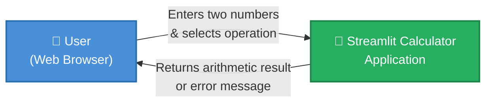

**External interfaces:**

| Interface             | Direction     | Protocol            | Description                                                            |
|-----------------------|---------------|---------------------|------------------------------------------------------------------------|
| Browser ↔ Application | Bidirectional | HTTP (localhost:8501) | User submits the form; application renders the result page           |

### 3.2 Technical Context

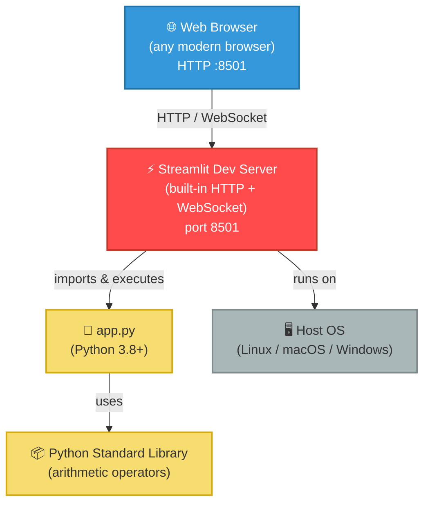

| Channel                         | Technology                     | Notes                                              |
|---------------------------------|--------------------------------|----------------------------------------------------|
| User → Server                   | HTTP GET/POST + WebSocket      | Managed entirely by Streamlit's built-in server    |
| Server → Browser (UI rendering) | Streamlit component protocol   | React-based frontend bundled with Streamlit        |
| Python arithmetic               | CPython built-in operators     | `+`, `-`, `*`, `/` on `float` values               |

---

## 4. Solution Strategy

### 4.1 Core Strategic Decisions

| Decision                         | Choice                          | Rationale                                                                                          |
|----------------------------------|---------------------------------|----------------------------------------------------------------------------------------------------|
| **UI Framework**                 | Streamlit                       | Eliminates the need for HTML/CSS/JS; Python-only development; ideal for rapid utility apps        |
| **Architecture style**           | Single-page, stateless script   | Fits the trivial domain; no session management needed; every interaction reruns the script         |
| **Data persistence**             | None (stateless)                | Calculator results are transient; no history feature required                                      |
| **Input collection pattern**     | `st.form()`                     | Batches all inputs into one submission event; prevents partial recalculation on each keystroke    |
| **Error handling strategy**      | Inline guard + `st.stop()`      | Immediately halts rendering after a division-by-zero error; prevents display of a stale result   |
| **Numeric type**                 | Python `float` (IEEE 754)       | Sufficient precision for a simple calculator; no external math library required                   |
| **Deployment model**             | Local execution via CLI         | Matches the developer/demo use case; no containerisation or hosting required                      |

### 4.2 Achieving Quality Goals

| Quality Goal     | Strategy Applied                                                                                   |
|------------------|----------------------------------------------------------------------------------------------------|
| Correctness      | Delegate arithmetic to Python's native operators; validate division-by-zero before computation    |
| Usability        | Streamlit's declarative API produces a clean, responsive UI with minimal code                      |
| Reliability      | `st.error()` + `st.stop()` ensures the error path never reaches result rendering code             |
| Simplicity       | Single file; linear top-to-bottom control flow; no classes or modules                             |
| Portability      | Pure Python + one PyPI package; works on Linux, macOS, and Windows                               |

---

## 5. Building Block View

### 5.1 Level 1 — System Overview

At the highest level the system is a single deployable unit: the **Calculator Application**, composed of one runtime component.

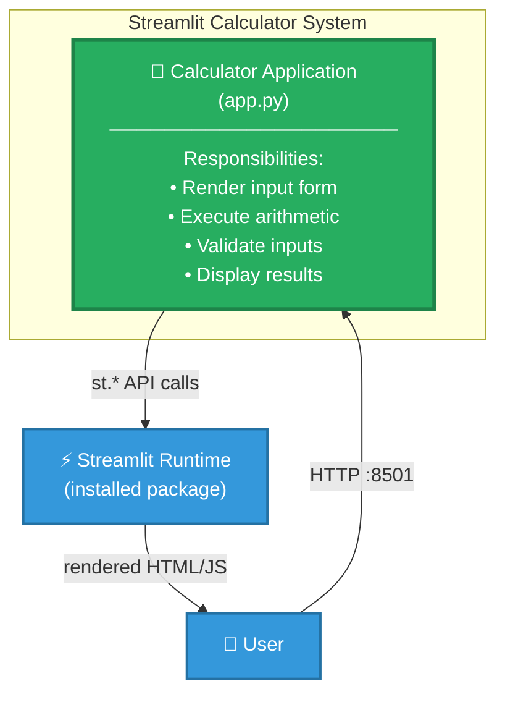

### 5.2 Level 2 — Internal Logical Decomposition of `app.py`

Although `app.py` is a single file, it is logically decomposed into four sequential **responsibilities**:

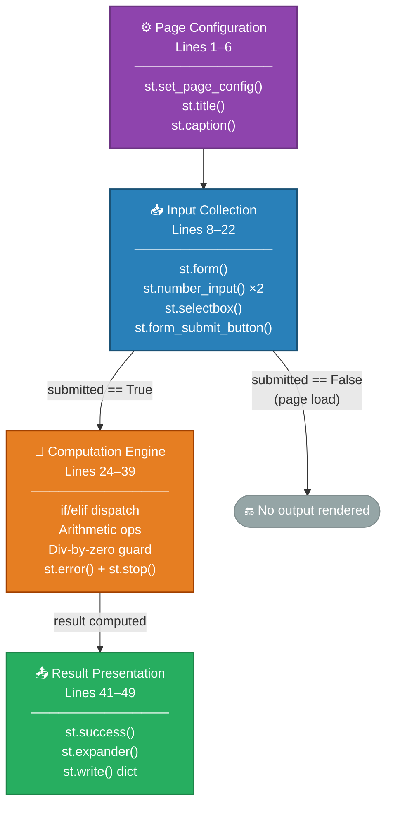

### 5.3 Level 3 — Computation Engine Detail

The computation engine uses a conditional dispatch (if/elif chain) pattern:

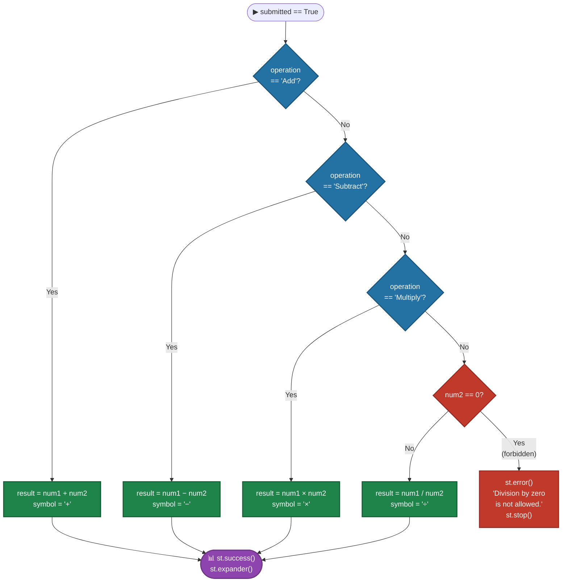

### 5.4 Module / File Inventory

| File               | Role                                    | LOC | Key Dependencies |
|--------------------|-----------------------------------------|-----|------------------|
| `app.py`           | Entire application logic and UI         | 50  | `streamlit`      |
| `requirements.txt` | Pip dependency manifest                 | 1   | —                |
| `README.md`        | Setup and run instructions              | 18  | —                |

---

## 6. Runtime View

### 6.1 Scenario 1 — Successful Calculation (e.g., Addition)

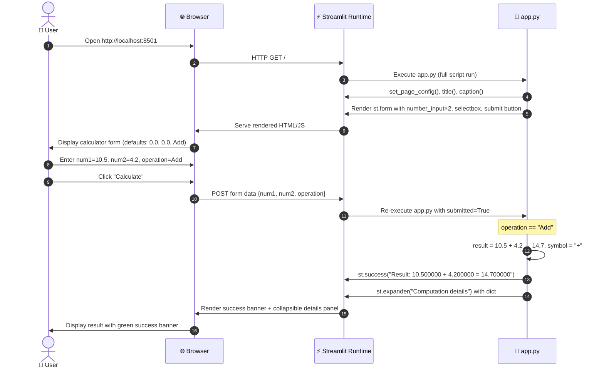

### 6.2 Scenario 2 — Division by Zero Error

```mermaid
sequenceDiagram
    autonumber
    actor User as 👤 User
    participant Browser as 🌐 Browser
    participant Streamlit as ⚡ Streamlit Runtime
    participant App as 🐍 app.py

    User->>Browser: Enter num1=8.0, num2=0.0, operation=Divide
    User->>Browser: Click "Calculate"
    Browser->>Streamlit: POST form data {num1=8.0, num2=0.0, operation="Divide"}
    Streamlit->>App: Re-execute app.py with submitted=True

    Note over App: operation == "Divide" AND num2 == 0
    App->>Streamlit: st.error("Division by zero is not allowed.")
    App->>App: st.stop() — halt script execution immediately
    Streamlit->>Browser: Render red error banner only (no result section)
    Browser->>User: Display error message; no result shown
```

### 6.3 Scenario 3 — Page Load / No Submission

```mermaid
sequenceDiagram
    autonumber
    actor User as 👤 User
    participant Browser as 🌐 Browser
    participant Streamlit as ⚡ Streamlit Runtime
    participant App as 🐍 app.py

    User->>Browser: Navigate to http://localhost:8501
    Browser->>Streamlit: HTTP GET /
    Streamlit->>App: Execute app.py
    Note over App: submitted == False — skip computation block
    App->>Streamlit: Render form only (defaults: num1=0.0, num2=0.0, op=Add)
    Streamlit->>Browser: Serve blank calculator form
    Browser->>User: Display form; no result section rendered
```

### 6.4 Streamlit Script Re-execution State Machine

A critical runtime concept: **Streamlit reruns the entire `app.py` script from top to bottom on every user interaction**. No persistent state is retained between runs (no `st.session_state` is used).

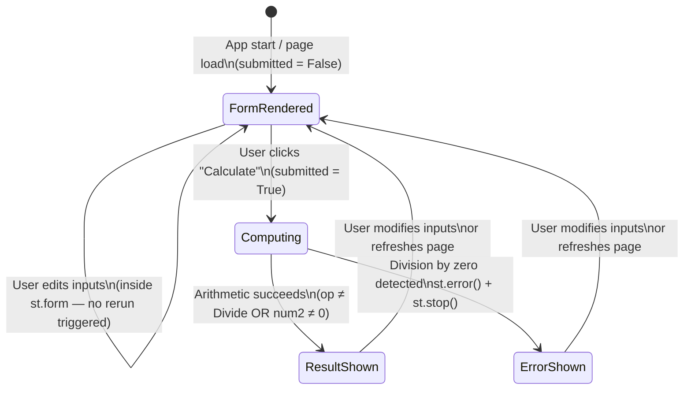

---

## 7. Deployment View

### 7.1 Deployment Topology

The application is designed for **local single-machine deployment**. The Streamlit development server, Python runtime, and the user's browser all reside on the same host.

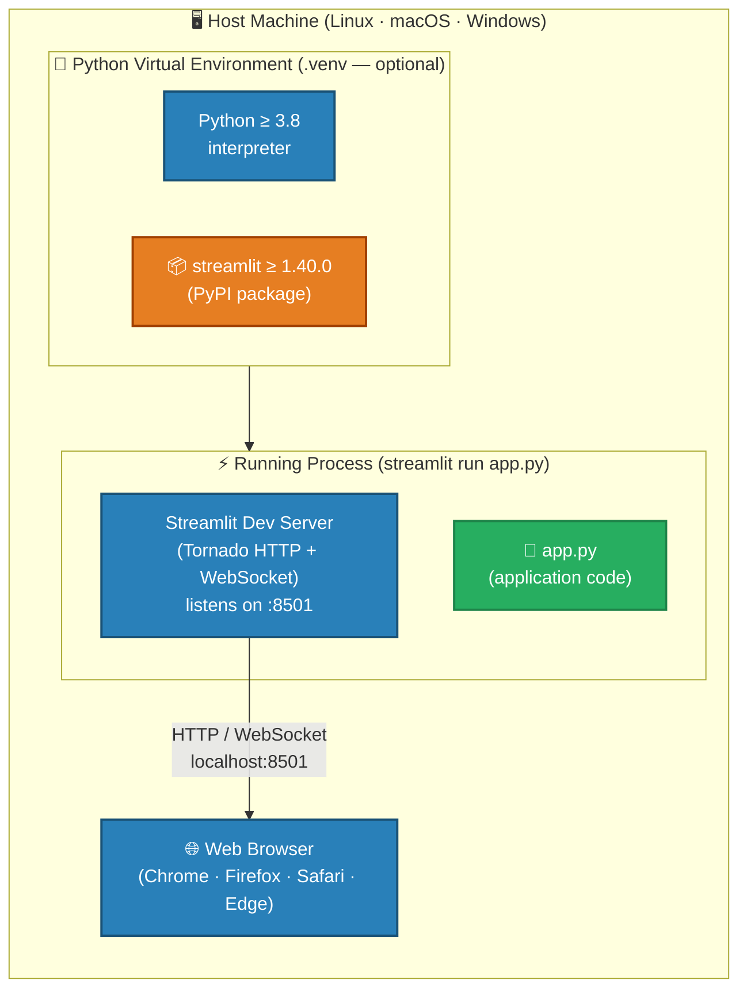

### 7.2 Deployment Steps

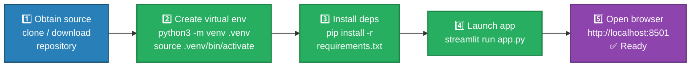

### 7.3 Infrastructure Requirements

| Requirement              | Minimum / Recommended                                         |
|--------------------------|---------------------------------------------------------------|
| **Operating System**     | Linux, macOS, or Windows (any modern version)                 |
| **Python version**       | ≥ 3.8 (required by Streamlit 1.40.0)                         |
| **RAM**                  | ~200 MB (Streamlit process + browser tab)                     |
| **Disk space**           | ~100 MB (Python + Streamlit + transitive dependencies)        |
| **Network port**         | TCP 8501 must be free on localhost                            |
| **Browser**              | Any modern browser with JavaScript enabled                    |
| **External network**     | Not required at runtime; only needed during `pip install`     |

### 7.4 Streamlit Runtime Configuration (Defaults)

No custom `config.toml` is present in the repository. All Streamlit defaults apply:

| Config Key                    | Default   | Notes                                  |
|-------------------------------|-----------|----------------------------------------|
| `server.port`                 | `8501`    | Override with `--server.port=XXXX`     |
| `server.headless`             | `false`   | Set `true` to suppress auto browser-open |
| `browser.gatherUsageStats`    | `true`    | Streamlit telemetry; can be disabled   |
| `server.runOnSave`            | `false`   | Hot-reload on `app.py` save            |

---

## 8. Cross-cutting Concepts

### 8.1 Domain Model

The domain is minimal. A **Calculation** is the central and only domain concept.

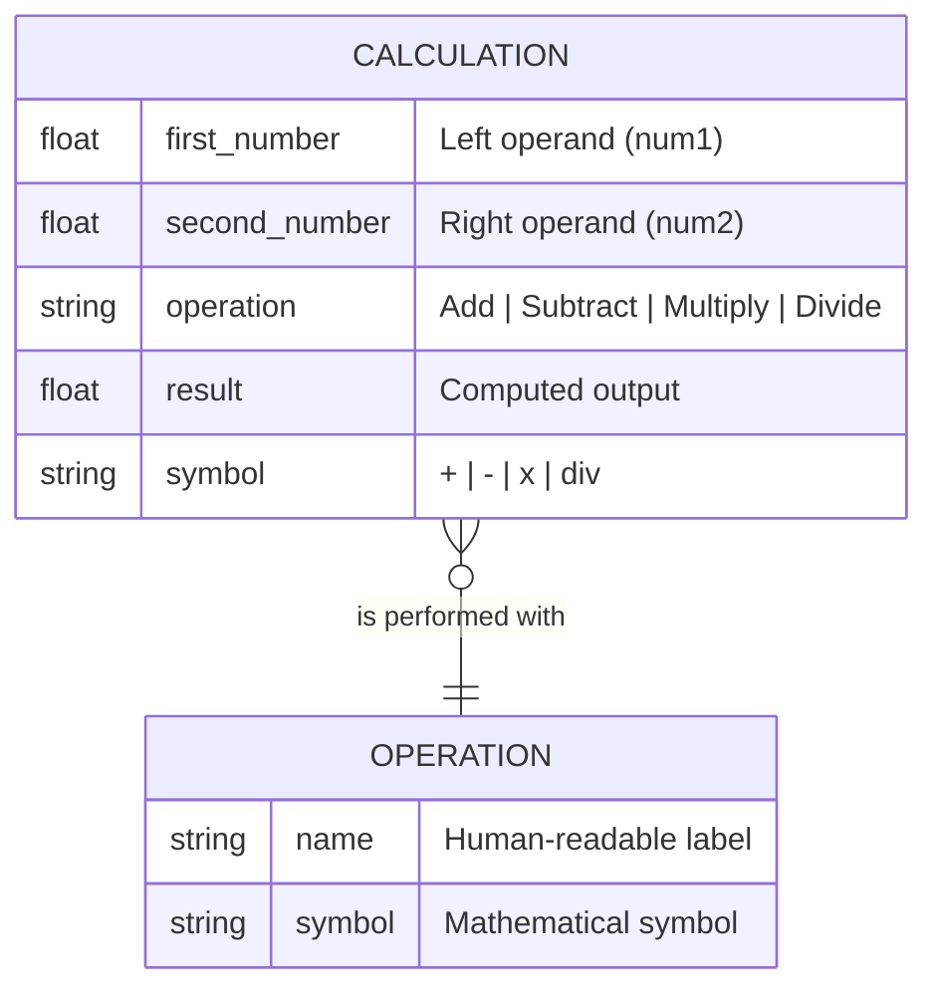

**Domain Business Rules:**

| Rule ID | Description                                                                         | Enforced At           |
|---------|-------------------------------------------------------------------------------------|-----------------------|
| DR-01   | `operation` must be one of: `Add`, `Subtract`, `Multiply`, `Divide`                | `st.selectbox()` (constrained choice list) |
| DR-02   | When `operation == "Divide"` and `num2 == 0`, the operation is **forbidden**        | `app.py` lines 36–38  |
| DR-03   | Both operands are floating-point; display precision is 6 decimal places             | `format="%.6f"` lines 12–14 |

### 8.2 Error Handling Strategy

The application uses a **guard clause + early exit** pattern, which is the Streamlit-idiomatic approach:

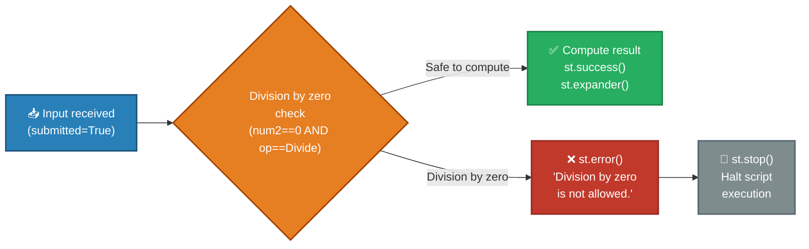

**Coverage of error conditions:**

| Error Condition              | Handling                    | User Experience                              |
|------------------------------|-----------------------------|----------------------------------------------|
| `num2 == 0` with Divide      | `st.error()` + `st.stop()` | Red banner; no result displayed              |
| Invalid operation string     | Not possible (selectbox)    | Prevented by UI; no code path exists         |
| Non-numeric input            | Not possible (number_input) | Streamlit rejects non-numeric input natively |
| Python float overflow        | Not handled                 | Would display `inf` silently                 |

### 8.3 UI/UX Patterns

| Pattern                    | Implementation                                          | Purpose                                                      |
|----------------------------|---------------------------------------------------------|--------------------------------------------------------------|
| **Form batching**          | `st.form("calculator_form")`                            | Prevents partial recalculations during input                 |
| **Two-column layout**      | `st.columns(2)` for the two number inputs               | Visual grouping of parallel operands                         |
| **Progressive disclosure** | `st.expander("Computation details")`                    | Keeps result view minimal; raw data available on demand      |
| **Semantic colour coding** | `st.success()` for results, `st.error()` for failures   | Green = good, red = problem — standard UX convention         |
| **Emoji in page config**   | `page_icon="🧮"`                                         | Identifies the tab in the browser; improves discoverability  |

### 8.4 Numeric Precision (Cross-cutting Concern)

Python's `float` type uses IEEE 754 double-precision (64-bit). Displayed with `"%.6f"` (6 decimal places). Known limitations:

- `0.1 + 0.2` evaluates to `0.30000000000000004` (not exactly `0.3`)
- No protection against very large exponent overflow → silently produces `inf`
- No `decimal.Decimal` or `fractions.Fraction` support

### 8.5 Streamlit Re-execution Model (Cross-cutting Runtime Concern)

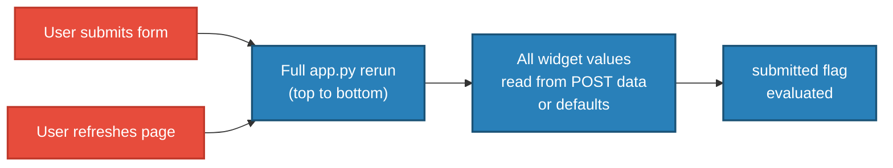

This means: **no module-level mutable state** can safely persist between interactions. The `st.form()` wrapper is the only reason intermediate keystrokes do not each trigger a rerun.

---

## 9. Architecture Decisions

### ADR-001 · Use Streamlit as the Sole UI Framework

| Field         | Detail                                                                                                     |
|---------------|------------------------------------------------------------------------------------------------------------|
| **Status**    | ✅ Accepted                                                                                                 |
| **Context**   | A simple calculator prototype needs a browser UI without requiring frontend (HTML/CSS/JS) expertise        |
| **Decision**  | Use Streamlit exclusively; no Flask/FastAPI backend, no React/Vue frontend                                 |
| **Rationale** | Python-only development; complete UI in ~50 lines; rich built-in widget library                            |
| **Trade-offs**| Full script rerun on each interaction is non-standard; cannot double as a REST API                        |
| **Consequences** | Single PyPI dependency; Streamlit upgrade may change widget behaviour; rapid future extensions possible |

---

### ADR-002 · Single-File Architecture

| Field         | Detail                                                                                                     |
|---------------|------------------------------------------------------------------------------------------------------------|
| **Status**    | ✅ Accepted                                                                                                 |
| **Context**   | Four arithmetic operations; no anticipated growth beyond basic calculations                                |
| **Decision**  | All application code in `app.py`; no separate modules, services, or packages                              |
| **Rationale** | Maximises simplicity and onboarding speed for a 50-line codebase                                          |
| **Trade-offs**| Business logic (arithmetic) is tightly coupled to UI rendering; cannot unit-test in isolation             |
| **Consequences** | Any addition of ≥ 4 new features should trigger a refactor into a `calculator.py` module               |

---

### ADR-003 · Stateless Design — No `st.session_state`

| Field         | Detail                                                                                                     |
|---------------|------------------------------------------------------------------------------------------------------------|
| **Status**    | ✅ Accepted                                                                                                 |
| **Context**   | Single-expression calculator; no history or chaining requirements                                         |
| **Decision**  | No `st.session_state` is used; every page render is independent                                           |
| **Rationale** | Simplest possible implementation; state management adds complexity without value here                     |
| **Trade-offs**| Cannot add calculation history, memory, or chained operations without architectural change                |
| **Consequences** | Every page reload resets inputs to `0.0`; this is the intended behaviour                               |

---

### ADR-004 · Use `st.form()` for Input Batching

| Field         | Detail                                                                                                     |
|---------------|------------------------------------------------------------------------------------------------------------|
| **Status**    | ✅ Accepted                                                                                                 |
| **Context**   | Without `st.form()`, Streamlit reruns the script on every widget change, causing premature calculations   |
| **Decision**  | Wrap all inputs in `st.form("calculator_form")`; compute only on explicit submit click                    |
| **Rationale** | Prevents `0 + 0` from flashing while the user is still typing; clean UX                                   |
| **Trade-offs**| Requires explicit user action to submit; slightly more verbose code                                       |
| **Consequences** | No spurious result displays; clean separation between input phase and result phase                      |

---

### ADR-005 · Inline Guard Clause for Division by Zero

| Field         | Detail                                                                                                     |
|---------------|------------------------------------------------------------------------------------------------------------|
| **Status**    | ✅ Accepted                                                                                                 |
| **Context**   | `num1 / 0` in Python raises `ZeroDivisionError`; unhandled exceptions surface as tracebacks in Streamlit  |
| **Decision**  | Explicitly check `num2 == 0` before division; call `st.error()` then `st.stop()`                         |
| **Rationale** | User-friendly message; follows Streamlit guard clause idiom; prevents traceback exposure                   |
| **Trade-offs**| Strict float equality `num2 == 0`; extremely small non-zero denominators (e.g., `1e-308`) are not caught |
| **Consequences** | Clean error UX; `st.stop()` guarantees no result widget is rendered after the error                    |

---

## 10. Quality Requirements

### 10.1 Quality Tree

```mermaid
graph TD
    classDef root fill:#2C3E50,color:#fff,stroke:#1a252f,stroke-width:3px
    classDef cat fill:#2980B9,color:#fff,stroke:#1a5276,stroke-width:2px
    classDef leaf fill:#27AE60,color:#fff,stroke:#1e8449,stroke-width:2px
    classDef warn fill:#E67E22,color:#fff,stroke:#a04000,stroke-width:2px
    classDef risk fill:#E74C3C,color:#fff,stroke:#c0392b,stroke-width:2px

    ROOT["🏆 Quality Goals\nStreamlit Calculator"]:::root

    ROOT --> CORRECTNESS["✅ Correctness"]:::cat
    ROOT --> USABILITY["🎨 Usability"]:::cat
    ROOT --> RELIABILITY["🛡️ Reliability"]:::cat
    ROOT --> SIMPLICITY["📐 Simplicity"]:::cat
    ROOT --> PORTABILITY["🌍 Portability"]:::cat
    ROOT --> MAINTAINABILITY["🔧 Maintainability"]:::cat

    CORRECTNESS --> C1["Arithmetic accurate\nto float precision"]:::leaf
    CORRECTNESS --> C2["Div-by-zero → error\nnot wrong result"]:::leaf
    CORRECTNESS --> C3["⚠️ IEEE 754 rounding\nnot addressed"]:::warn

    USABILITY --> U1["Form renders in all\nmodern browsers"]:::leaf
    USABILITY --> U2["Green banner for\nsuccess result"]:::leaf
    USABILITY --> U3["Red banner for\nerror condition"]:::leaf

    RELIABILITY --> R1["No unhandled\nexceptions reach user"]:::leaf
    RELIABILITY --> R2["st.stop() cleanly\nhalts after error"]:::leaf
    RELIABILITY --> R3["⚠️ Float overflow\nnot guarded"]:::warn

    SIMPLICITY --> S1["Single 50-line file"]:::leaf
    SIMPLICITY --> S2["Linear control flow\nno classes/callbacks"]:::leaf

    PORTABILITY --> P1["Linux · macOS\n· Windows"]:::leaf
    PORTABILITY --> P2["Only 1 external\ndependency"]:::leaf

    MAINTAINABILITY --> M1["New op = 1 elif\nbranch only"]:::leaf
    MAINTAINABILITY --> M2["❌ No unit tests\npresent"]:::risk
```

### 10.2 Quality Scenarios

| ID    | Quality Attribute | Stimulus                                    | Response                                                                 | Measurable Criterion                         |
|-------|-------------------|---------------------------------------------|--------------------------------------------------------------------------|----------------------------------------------|
| QS-01 | Correctness       | User calculates `3.141593 × 2.0`            | Result displayed as `6.283186`                                           | Accurate to 6 decimal places                 |
| QS-02 | Reliability       | User attempts `100 ÷ 0`                    | Red error banner; no traceback; page remains usable                      | Error shown; no crash; form still interactive |
| QS-03 | Usability         | First-time user opens the app               | User completes a calculation without reading instructions                | Task time ≤ 10 seconds                       |
| QS-04 | Portability       | Developer sets up on a clean Ubuntu 22.04   | App runs after `pip install` + `streamlit run`                           | Setup time < 2 minutes                       |
| QS-05 | Simplicity        | New developer reads the source code         | Understands the entire logic by reading `app.py` once                   | Comprehension time < 5 minutes               |
| QS-06 | Maintainability   | Developer adds a "Modulo" operation         | Requires adding one `elif` and one entry to the selectbox tuple          | Code change < 5 lines                        |

### 10.3 Code Metrics Summary

| Metric                           | Value     | Assessment                                  |
|----------------------------------|-----------|---------------------------------------------|
| Total LOC (`app.py`)             | 50        | ✅ Minimal                                   |
| Cyclomatic complexity            | 6         | ✅ Low (4 ops + 2 conditional branches)      |
| External dependencies            | 1         | ✅ Minimal surface area                      |
| Classes defined                  | 0         | ⚠️ Logic not encapsulated or reusable       |
| Functions defined                | 0         | ⚠️ No independently testable units          |
| Automated test files             | 0         | ❌ No test coverage at all                  |
| Documentation files              | 1         | ⚠️ README only; no API or design docs       |
| `requirements.txt` entries       | 1         | ✅ Minimal; no version lock (risk)           |

---

## 11. Risks and Technical Debt

### 11.1 Risk Matrix

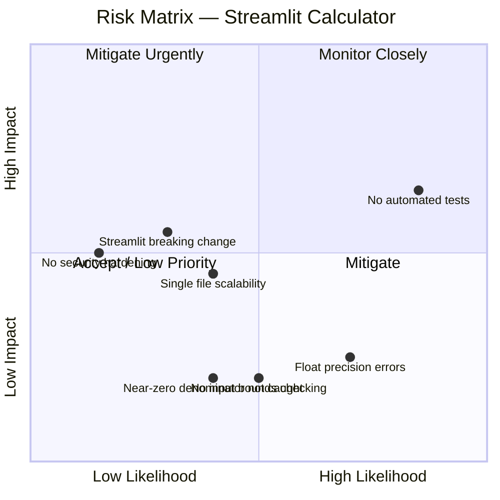

### 11.2 Risk Register

| ID   | Risk                                            | Likelihood | Impact | Priority    | Mitigation Strategy                                                                  |
|------|-------------------------------------------------|------------|--------|-------------|--------------------------------------------------------------------------------------|
| R-01 | **No automated tests**                          | High       | Medium | 🔴 High     | Extract arithmetic to pure functions; add `pytest` unit test suite                   |
| R-02 | **IEEE 754 float precision surprises**          | High       | Low    | 🟡 Medium   | Document limitation; consider `decimal.Decimal` if precision matters                 |
| R-03 | **Single-file scalability ceiling**             | Medium     | Medium | 🟡 Medium   | Introduce `calculator.py` module if operation count grows beyond ~8                  |
| R-04 | **Streamlit API breaking change**               | Low        | Medium | 🟡 Medium   | Pin exact Streamlit version in `requirements.txt`; monitor release notes             |
| R-05 | **Float overflow not guarded**                  | Low        | Medium | 🟡 Medium   | Add overflow check or document that `inf` results are expected edge cases            |
| R-06 | **No input bounds checking**                    | Medium     | Low    | 🟢 Low      | Add `min_value`/`max_value` to `st.number_input()` if overflow is a concern         |
| R-07 | **Near-zero denominator not caught**            | Medium     | Low    | 🟢 Low      | Replace `num2 == 0` with `abs(num2) < epsilon` if domain requires it                |
| R-08 | **No security hardening for network deployment**| Low        | Medium | 🟢 Low      | Add `streamlit-authenticator` if deployed publicly; never expose on `0.0.0.0` without auth |

### 11.3 Technical Debt Backlog

| ID    | Debt Item                                                                 | Type              | Effort  | Priority |
|-------|---------------------------------------------------------------------------|-------------------|---------|----------|
| TD-01 | Business logic (arithmetic) mixed with UI rendering code in `app.py`     | Architectural     | 1–2 h   | 🟡 Medium |
| TD-02 | Zero automated test coverage                                              | Testing           | 1–2 h   | 🔴 High   |
| TD-03 | Dependency pinned to minimum only (`>=`); no lock file                    | Dependency Mgmt   | < 1 h   | 🟡 Medium |
| TD-04 | `else` branch implicitly handles Divide — fragile if options change       | Code Quality      | < 30 min | 🟢 Low   |
| TD-05 | No `pyproject.toml`; no project metadata or version declaration           | Project Structure | < 1 h   | 🟢 Low   |
| TD-06 | No `.streamlit/config.toml`; server port and telemetry undocumented       | Configuration     | < 30 min | 🟢 Low  |

### 11.4 Recommended Refactoring (TD-01 + TD-02)

Extracting arithmetic logic into a separate, testable module resolves the top two debt items simultaneously:

```python
# calculator.py  (proposed new file)
from __future__ import annotations

def add(a: float, b: float) -> float:
    return a + b

def subtract(a: float, b: float) -> float:
    return a - b

def multiply(a: float, b: float) -> float:
    return a * b

def divide(a: float, b: float) -> float:
    if b == 0:
        raise ValueError("Division by zero is not allowed.")
    return a / b

OPERATIONS: dict[str, tuple[callable, str]] = {
    "Add":      (add,      "+"),
    "Subtract": (subtract, "−"),
    "Multiply": (multiply, "×"),
    "Divide":   (divide,   "÷"),
}
```

```python
# test_calculator.py  (proposed new file)
import pytest
from calculator import add, subtract, multiply, divide

def test_add():        assert add(1.0, 2.0) == 3.0
def test_subtract():   assert subtract(5.0, 3.0) == 2.0
def test_multiply():   assert multiply(4.0, 2.5) == 10.0
def test_divide():     assert divide(10.0, 4.0) == 2.5
def test_divide_zero():
    with pytest.raises(ValueError, match="Division by zero"):
        divide(1.0, 0.0)
```

---

## 12. Glossary

| Term                       | Definition                                                                                                    |
|----------------------------|---------------------------------------------------------------------------------------------------------------|
| **ADR**                    | Architecture Decision Record — a document capturing a significant architectural decision and its rationale    |
| **Arc42**                  | A template for software architecture documentation comprising 12 standardised sections                        |
| **Arithmetic Operation**   | One of the four fundamental mathematical functions: Addition, Subtraction, Multiplication, Division           |
| **Cyclomatic Complexity**  | A software metric counting the number of linearly independent paths through a program's source code           |
| **Division by Zero**       | The mathematically undefined operation of dividing any number by zero; explicitly guarded in this application |
| **`float`**                | Python's built-in 64-bit IEEE 754 double-precision floating-point numeric type                                |
| **Form (Streamlit)**       | A `st.form()` container batching widget inputs; triggers a script rerun only on submit button click          |
| **Guard Clause**           | A conditional check that immediately exits or halts execution when a precondition is not satisfied            |
| **IEEE 754**               | The international standard for floating-point arithmetic governing precision, rounding, and special values    |
| **LOC**                    | Lines of Code — a basic measure of program size                                                               |
| **Operand**                | A number on which an arithmetic operation is performed; `num1` (first) or `num2` (second) in this app       |
| **Operation**              | The arithmetic function selected by the user: Add, Subtract, Multiply, or Divide                             |
| **`pip`**                  | The standard Python package installer; used to install Streamlit from PyPI                                    |
| **PyPI**                   | The Python Package Index — the official repository for Python packages                                        |
| **Result**                 | The computed numeric output of applying the selected operation to the two operands                            |
| **Script Rerun**           | Streamlit's execution model: `app.py` is re-executed in full from top to bottom on each user interaction     |
| **`st.error()`**           | Streamlit function that renders a red error alert banner in the browser                                       |
| **`st.expander()`**        | Streamlit widget that renders a collapsible/expandable UI section                                             |
| **`st.form()`**            | Streamlit container that batches all enclosed widget changes until the form submit button is pressed          |
| **`st.stop()`**            | Streamlit function that immediately terminates the current script execution run                               |
| **`st.success()`**         | Streamlit function that renders a green success alert banner in the browser                                   |
| **Stateless**              | A design property where no information is retained between user interactions; every request is independent    |
| **Streamlit**              | An open-source Python framework for building interactive data and utility web applications without HTML/CSS/JS |
| **Symbol**                 | Mathematical notation displayed in the result string: `+`, `−`, `×`, or `÷`                                  |
| **`venv`**                 | Python's built-in module for creating isolated virtual environments                                           |
| **Virtual Environment**    | An isolated Python environment that prevents dependency conflicts between different projects                   |
| **WebSocket**              | A communication protocol providing full-duplex channels over a single TCP connection; used by Streamlit       |

---

*This document was generated by the **Arc42 Documentation Generator** based on static analysis of the Streamlit Calculator source files (`app.py`, `requirements.txt`, `README.md`). All diagrams are embedded as Mermaid code blocks for maximum portability and renderer compatibility.*
