# Architecture Documentation (Arc42)

**Project**: Streamlit Calculator Web Application
**Version**: 1.0.0
**Date**: 2025-01-01
**Generated by**: Arc42 Documentation Generator

---

## Table of Contents

1. [Introduction and Goals](#1-introduction-and-goals)
2. [Constraints](#2-constraints)
3. [Context and Scope](#3-context-and-scope)
4. [Solution Strategy](#4-solution-strategy)
5. [Building Block View](#5-building-block-view)
6. [Runtime View](#6-runtime-view)
7. [Deployment View](#7-deployment-view)
8. [Crosscutting Concepts](#8-crosscutting-concepts)
9. [Architecture Decisions](#9-architecture-decisions)
10. [Quality Requirements](#10-quality-requirements)
11. [Risks and Technical Debt](#11-risks-and-technical-debt)
12. [Glossary](#12-glossary)

---

## 1. Introduction and Goals

### 1.1 Purpose and Overview

The **Streamlit Calculator** is a lightweight, browser-based arithmetic calculator built as a single-page web application using the [Streamlit](https://streamlit.io) Python framework. It allows users to perform the four fundamental arithmetic operations — **addition, subtraction, multiplication, and division** — through an intuitive, form-driven user interface accessible from any modern web browser.

The application exemplifies the *rapid prototype* architectural pattern: maximum user-facing functionality with minimal infrastructure, zero backend persistence, and no authentication layer. It is intended as a standalone utility tool deployable on a developer workstation or any Python-capable server with a single command.

> **Source files analysed**: `app.py` (50 LOC), `requirements.txt`, `README.md`

### 1.2 Business Goals and Objectives

| ID   | Goal                                                                  | Priority |
|------|-----------------------------------------------------------------------|----------|
| BG-1 | Provide instant, accurate arithmetic calculations in a browser UI     | High     |
| BG-2 | Eliminate the need for spreadsheets or OS calculator apps             | Medium   |
| BG-3 | Demonstrate Streamlit as a rapid application development framework    | Medium   |
| BG-4 | Maintain zero-dependency complexity for end users (browser only)      | High     |

### 1.3 Quality Goals

The top quality requirements driving architectural decisions are:

| Priority | Quality Attribute | Scenario                                                                  |
|----------|-------------------|---------------------------------------------------------------------------|
| 1        | **Correctness**   | All arithmetic operations must return IEEE 754 double-precision results   |
| 2        | **Usability**     | A user can perform a calculation within 5 seconds of opening the app      |
| 3        | **Simplicity**    | The entire system can be understood by reading one ~50-line source file   |
| 4        | **Safety**        | Division by zero must be caught and communicated clearly — never crash    |
| 5        | **Deployability** | The app can be started from any Python 3.x environment in one command     |

### 1.4 Stakeholders

| Role                        | Expectation                                                          |
|-----------------------------|----------------------------------------------------------------------|
| **End User**                | Accurate calculations, clear error messages, fast response           |
| **Developer / Maintainer**  | Simple, readable code; easy local setup; minimal dependencies        |
| **Technical Evaluator**     | Clear demonstration of Streamlit capabilities and Python idioms      |

---

## 2. Constraints

### 2.1 Technical Constraints

| ID    | Constraint                                                                     | Source               |
|-------|--------------------------------------------------------------------------------|----------------------|
| TC-1  | **Language**: Python 3.x is the sole implementation language                   | `app.py`, ecosystem  |
| TC-2  | **UI Framework**: Streamlit ≥ 1.40.0 is the only permitted UI library          | `requirements.txt`   |
| TC-3  | **No Database**: The application is entirely stateless; no persistence layer   | Design decision      |
| TC-4  | **No Authentication**: All users accessing the URL have full access            | Design decision      |
| TC-5  | **Single-file architecture**: All logic resides in `app.py`                    | Codebase structure   |
| TC-6  | **Client is a Web Browser**: No desktop GUI, mobile app, or API endpoint       | Streamlit constraint |
| TC-7  | **Port 8501**: Streamlit binds to TCP port 8501 by default                     | Streamlit default    |
| TC-8  | **Floating-point arithmetic**: Numbers use Python `float` (IEEE 754 double)    | `app.py` lines 12–13 |

### 2.2 Organisational Constraints

| ID    | Constraint                                                                     |
|-------|--------------------------------------------------------------------------------|
| OC-1  | No CI/CD pipeline or automated test suite exists at time of writing            |
| OC-2  | No versioned release process; application is run directly from source          |
| OC-3  | Dependency management relies on `pip` and a plain `requirements.txt` file      |

### 2.3 Conventions

| ID    | Convention                                                                  |
|-------|-----------------------------------------------------------------------------|
| CV-1  | PEP 8 Python style guide                                                    |
| CV-2  | Streamlit idiomatic patterns: `st.form`, `st.columns`, `st.expander`        |
| CV-3  | Numeric display precision: 6 decimal places (`format="%.6f"`)               |

---

## 3. Context and Scope

### 3.1 Business Context

The Streamlit Calculator operates as a **self-contained web utility**. Its only external actors are human users interacting through a web browser. There are no external system integrations, APIs, databases, or third-party services.

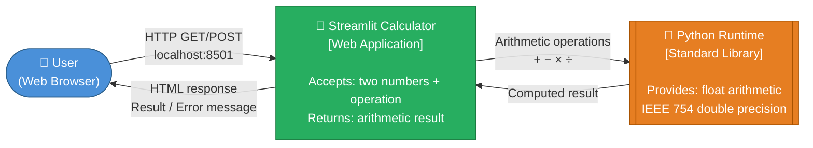

### 3.2 Technical Context

The system runs as a **single-process Python application** managed by Streamlit's built-in HTTP server (Tornado). The browser communicates with the server via HTTP and WebSocket (Streamlit's reactive protocol). No reverse proxy, load balancer, or container runtime is required for local deployment.

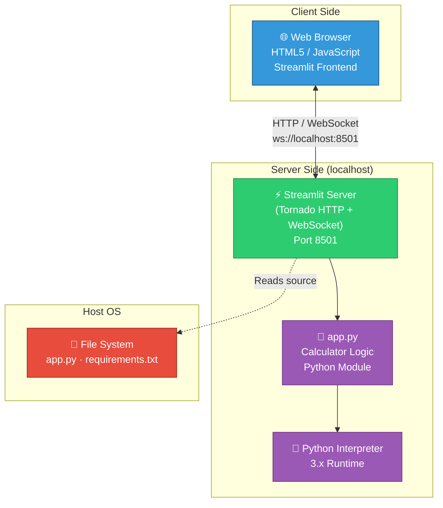

### 3.3 System Boundary Summary

| Element                     | Inside Boundary | Outside Boundary |
|-----------------------------|:---------------:|:----------------:|
| Calculator UI (Streamlit)   | ✅              |                  |
| Arithmetic logic            | ✅              |                  |
| Input validation            | ✅              |                  |
| Web Browser                 |                 | ✅               |
| Python Standard Library     |                 | ✅               |
| Operating System            |                 | ✅               |
| Network infrastructure      |                 | ✅               |

---

## 4. Solution Strategy

### 4.1 Technology Decisions

| Decision                        | Choice                          | Rationale                                                            |
|---------------------------------|---------------------------------|----------------------------------------------------------------------|
| **UI Framework**                | Streamlit ≥ 1.40.0              | Eliminates HTML/CSS/JS; Python-native reactive UI in ~50 lines       |
| **Language**                    | Python 3.x                      | Ubiquitous, readable, native floating-point; Streamlit requires it   |
| **Arithmetic Engine**           | Python built-in `float` ops     | IEEE 754 double precision; no external math library needed           |
| **State Management**            | Stateless (no session store)    | Simplicity; each form submission is an independent computation       |
| **Persistence**                 | None                            | Calculator results need not be stored; reduces attack surface        |
| **Packaging**                   | `pip` + `requirements.txt`      | Standard Python ecosystem; zero toolchain complexity                 |
| **Deployment**                  | `streamlit run app.py`          | Single command; no containerisation, WSGI server, or config needed   |

### 4.2 Top-Level Decomposition Strategy

The application follows a **linear reactive pipeline** pattern native to Streamlit:

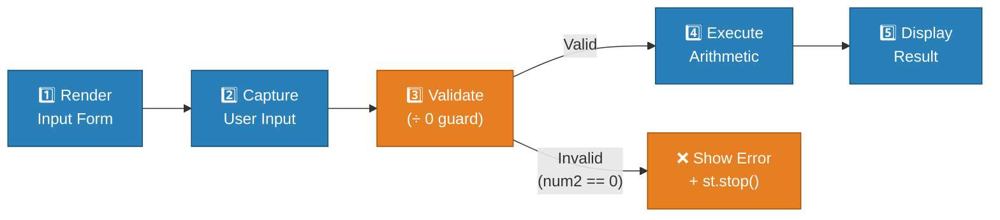

### 4.3 Approaches to Quality Goals

| Quality Goal   | Architectural Approach                                                         |
|----------------|--------------------------------------------------------------------------------|
| Correctness    | Delegate directly to Python native operators; no intermediate transformation   |
| Usability      | Streamlit form layout: two columns, selectbox, single submit button            |
| Simplicity     | Single-file, ~50 LOC, no classes, no configuration files                       |
| Safety         | Explicit `num2 == 0` guard before division; `st.error()` + `st.stop()`        |
| Deployability  | One-line install + one-line run; no environment variables required             |

---

## 5. Building Block View

### 5.1 Level 1 — System Overview

At the highest level the system is a **single deployable unit**: `app.py` executed by the Streamlit runtime.

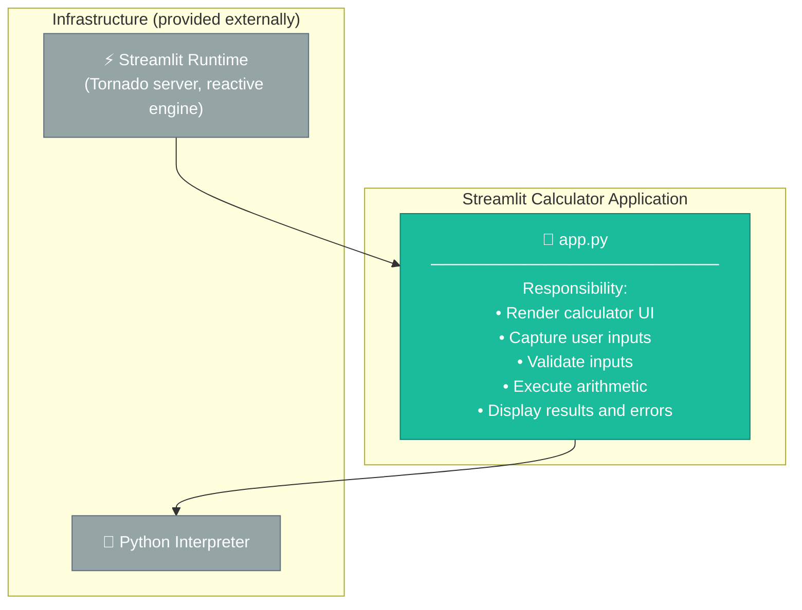

### 5.2 Level 2 — Logical Blocks within `app.py`

Although `app.py` is a single file, its code is logically partitioned into four cohesive blocks:

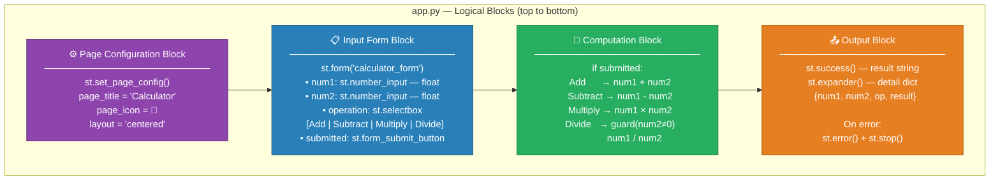

### 5.3 Level 3 — Component Responsibilities

| Component              | Lines | Responsibility                                                     |
|------------------------|-------|--------------------------------------------------------------------|
| **Page Config**        | 3     | Sets browser tab title, favicon emoji, and centred layout mode     |
| **Page Header**        | 5–6   | Renders application title and caption subtitle                     |
| **Input Form**         | 8–22  | Collects num1, num2, operation; controls submission lifecycle      |
| **Computation Engine** | 24–39 | Dispatches to the correct arithmetic operator; guards ÷ 0          |
| **Result Renderer**    | 41–49 | Formats and displays the result or error in the Streamlit UI       |

### 5.4 Module / Dependency Structure

The application is entirely procedural — no classes are defined. The module-level dependency graph is:

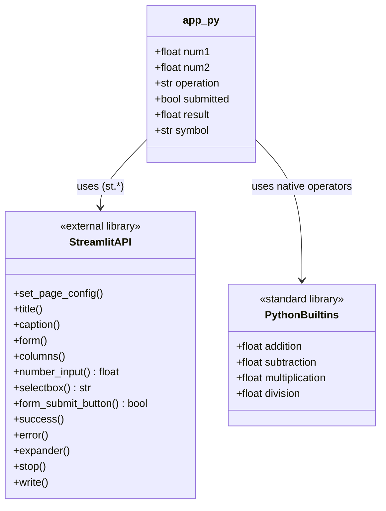

---

## 6. Runtime View

### 6.1 Scenario 1 — Successful Arithmetic Calculation

The following sequence shows a user performing a successful multiplication (`6.0 × 7.0`):

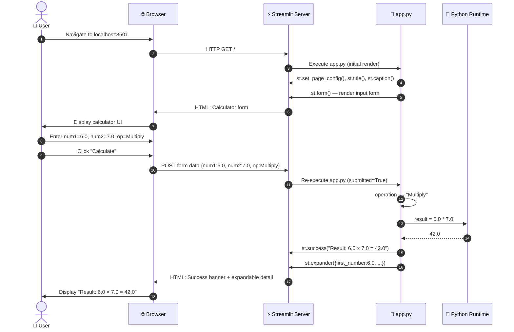

### 6.2 Scenario 2 — Division by Zero Error Handling

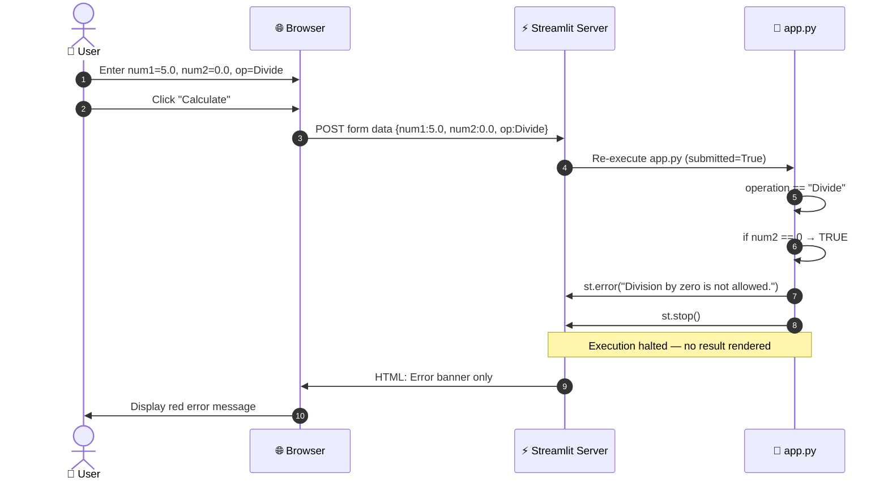

### 6.3 Scenario 3 — Operation State Machine

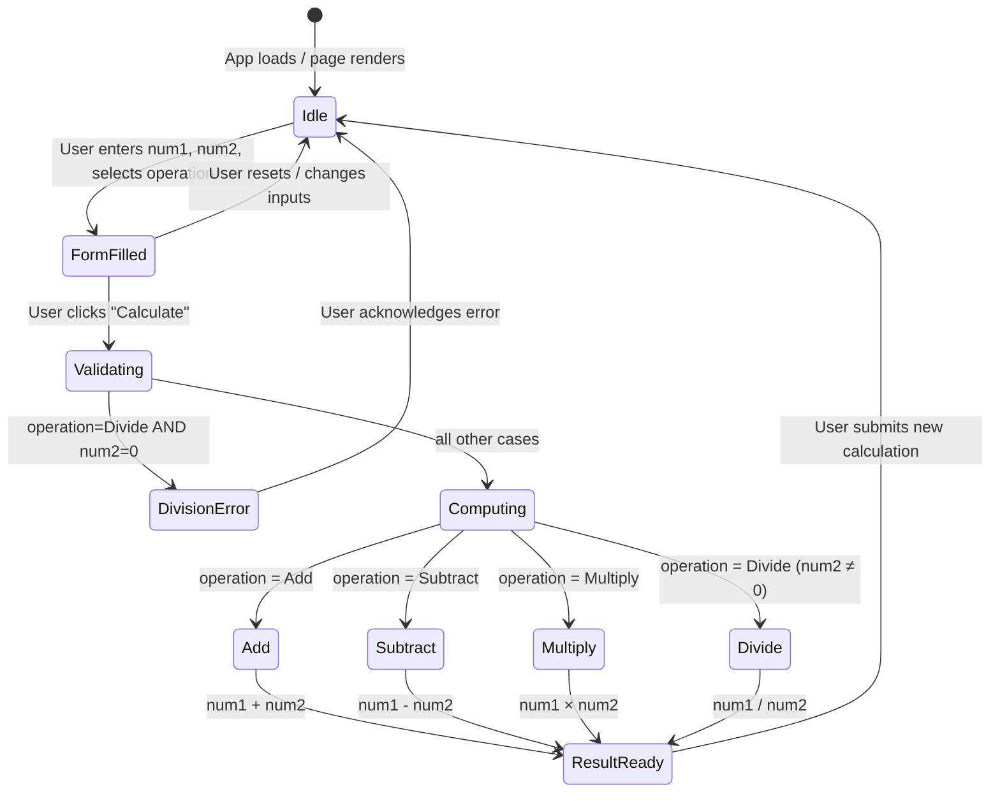

---

## 7. Deployment View

### 7.1 Deployment Topology

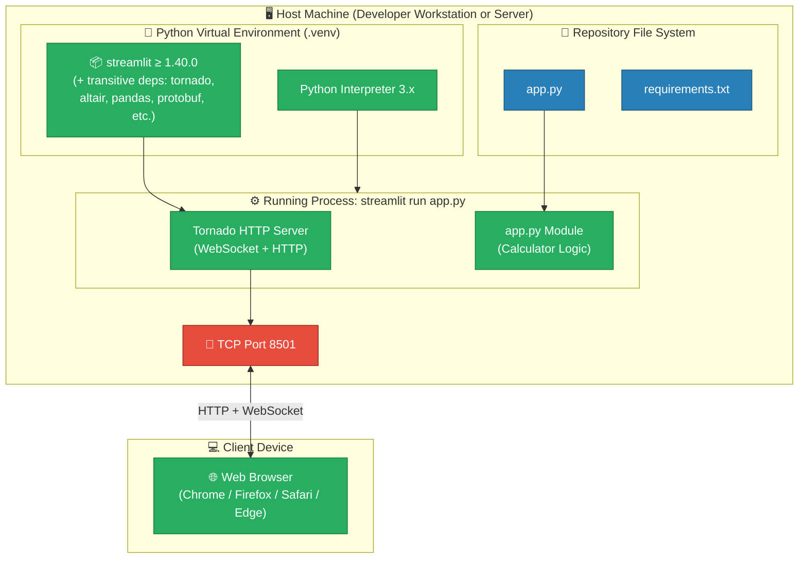

### 7.2 Deployment Steps

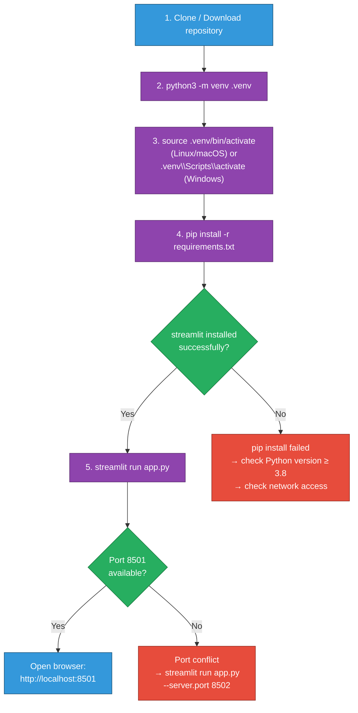

### 7.3 Runtime Infrastructure Requirements

| Requirement       | Minimum              | Recommended            |
|-------------------|----------------------|------------------------|
| **Python**        | 3.8+                 | 3.11+                  |
| **Streamlit**     | 1.40.0               | Latest stable          |
| **RAM**           | 256 MB               | 512 MB                 |
| **CPU**           | Any single core      | Any                    |
| **Network**       | Localhost loopback   | Localhost loopback     |
| **Browser**       | Any modern HTML5     | Chrome / Firefox       |
| **OS**            | Linux / macOS / Windows | Any                 |

---

## 8. Crosscutting Concepts

### 8.1 Domain Model

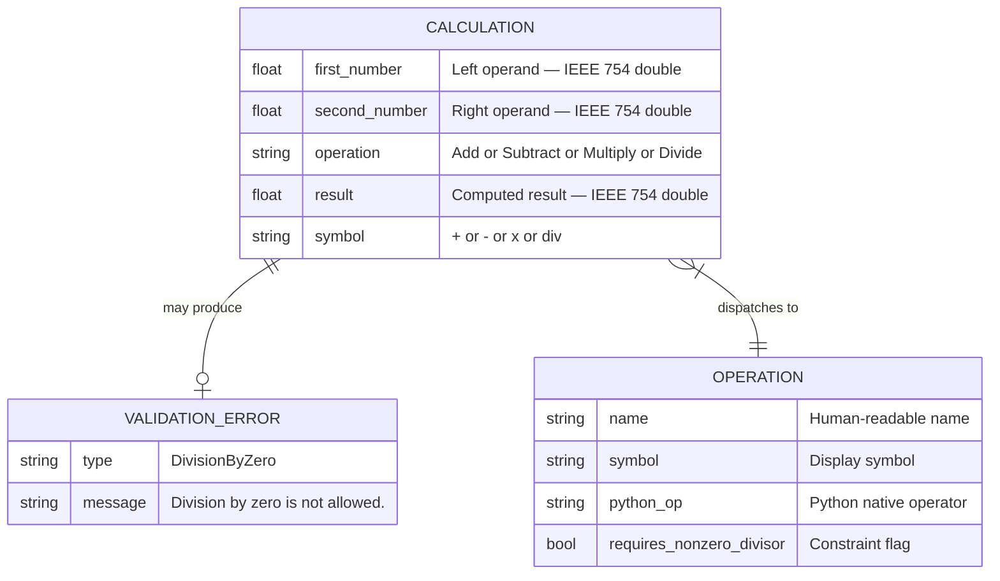

### 8.2 Input Validation Strategy

The application implements a **pre-computation guard** pattern — conditions are checked before performing the operation rather than catching exceptions after:

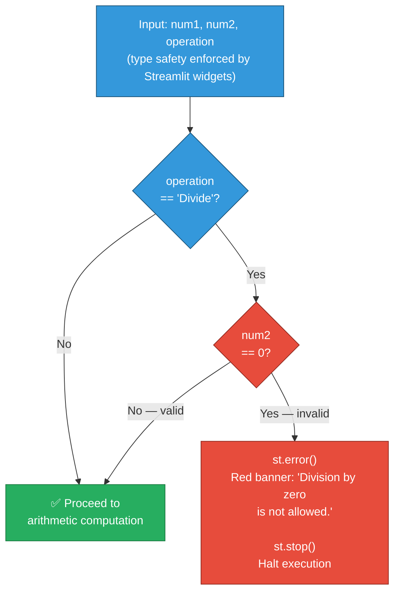

**Validation rules in force:**

| Rule ID | Field       | Condition Checked                        | Enforcement                          |
|---------|-------------|------------------------------------------|--------------------------------------|
| VR-1    | `num2`      | `num2 == 0` when operation is Divide     | `st.error()` + `st.stop()`           |
| VR-2    | `num1`      | Type: float                              | `st.number_input()` widget           |
| VR-3    | `num2`      | Type: float                              | `st.number_input()` widget           |
| VR-4    | `operation` | Must be one of 4 defined values          | `st.selectbox()` enum constraint     |

### 8.3 Design Patterns Applied

| Pattern                 | Where Applied                         | Purpose                                              |
|-------------------------|---------------------------------------|------------------------------------------------------|
| **Guard Clause**        | Division pre-check (`if num2 == 0`)   | Early return / halt on invalid input                 |
| **Reactive UI**         | Streamlit execution model             | Re-runs entire script on each interaction            |
| **Form Submission**     | `st.form` + `st.form_submit_button`   | Batch inputs; prevent partial re-renders             |
| **Command Dispatch**    | Operation selectbox → if/elif chain   | Maps string command to arithmetic operator           |
| **Execution Halt**      | `st.stop()` after error               | Prevents any downstream code from executing          |

### 8.4 Streamlit Reactive Execution Model

Streamlit re-executes the **entire `app.py` script from top to bottom** on every user interaction. This is the core architectural concept replacing traditional callback/event-handler patterns:


Key implications:
- **No persistent in-memory state** between re-runs (unless `st.session_state` is used — it is not used here)
- **`st.form`** batches multiple widget changes into one re-run trigger (avoiding partial submissions)
- **`st.stop()`** short-circuits the re-execution mid-script

---

## 9. Architecture Decisions

### ADR-001: Use Streamlit as the UI Framework

| Attribute            | Value                                                                          |
|----------------------|--------------------------------------------------------------------------------|
| **Status**           | Accepted                                                                       |
| **Context**          | A simple calculator needs a browser-based UI without requiring web development expertise |
| **Decision**         | Use Streamlit ≥ 1.40.0 as the sole UI and server framework                    |
| **Rationale**        | Streamlit provides a complete HTTP server, reactive UI engine, and widget library in a single `pip install`. No HTML, CSS, JS, or separate server configuration needed. The entire UI is expressed in ~40 lines of Python. |
| **Consequences**     | ✅ Extremely fast development · ✅ Zero frontend complexity · ⚠️ Limited UI customisation · ⚠️ Full re-run model is non-obvious · ⚠️ Cannot easily expose a REST API alongside the UI |
| **Alternatives**     | Flask+Jinja2 (requires HTML templates), Gradio (heavier ML focus), Tkinter (desktop only), Django (far too heavy) |

---

### ADR-002: Stateless, Single-Request Architecture

| Attribute            | Value                                                                          |
|----------------------|--------------------------------------------------------------------------------|
| **Status**           | Accepted                                                                       |
| **Context**          | A calculator does not need to retain history across sessions                   |
| **Decision**         | No session store, no database, no calculation history                          |
| **Rationale**        | Eliminates infrastructure dependencies, reduces attack surface, and keeps the codebase trivially simple. Each form submission is a completely independent computation. |
| **Consequences**     | ✅ Zero infrastructure · ✅ No data privacy concerns · ⚠️ Users cannot review past calculations · ⚠️ No audit trail |
| **Alternatives**     | SQLite history store, browser `localStorage` (requires JS), `st.session_state` history list |

---

### ADR-003: Use Python Native Float Arithmetic

| Attribute            | Value                                                                          |
|----------------------|--------------------------------------------------------------------------------|
| **Status**           | Accepted                                                                       |
| **Context**          | Arithmetic must be accurate and require no additional dependencies             |
| **Decision**         | Use Python's built-in `float` type and operators (`+`, `-`, `*`, `/`)         |
| **Rationale**        | Python `float` is IEEE 754 double-precision — the standard for general-purpose numeric computation. No external math library is needed for basic arithmetic. |
| **Consequences**     | ✅ No additional dependencies · ✅ Well-understood precision behaviour · ⚠️ IEEE 754 edge cases (e.g. `0.1 + 0.2 ≠ 0.3` exactly) are inherited |
| **Alternatives**     | `decimal.Decimal` (arbitrary precision, more complex), `fractions.Fraction` (exact rationals, limited use case), `numpy` (overkill) |

---

### ADR-004: Single-File Architecture

| Attribute            | Value                                                                          |
|----------------------|--------------------------------------------------------------------------------|
| **Status**           | Accepted                                                                       |
| **Context**          | The application logic is ~50 lines; decomposing it further would add overhead  |
| **Decision**         | Maintain all application code in a single `app.py` file                        |
| **Rationale**        | Below a threshold of complexity (~200–300 LOC), splitting code across multiple files increases cognitive overhead more than it reduces it. A single file is navigable in under 10 seconds. |
| **Consequences**     | ✅ Zero import overhead · ✅ Maximum readability · ⚠️ Will require refactoring if operations grow · ⚠️ Unit testing requires importing `app.py` which triggers Streamlit side effects |
| **Alternatives**     | Separate `calculator.py` business logic module + `app.py` UI layer (appropriate if logic grows past ~150 LOC) |

---

### ADR-005: Explicit Division-by-Zero Guard over Exception Catching

| Attribute            | Value                                                                          |
|----------------------|--------------------------------------------------------------------------------|
| **Status**           | Accepted                                                                       |
| **Context**          | Division by zero must be caught and presented to the user cleanly             |
| **Decision**         | Use an explicit `if num2 == 0` pre-check rather than `try/except ZeroDivisionError` |
| **Rationale**        | The pre-check communicates intent more clearly and avoids exception-as-control-flow. The condition is always knowable before performing the division. |
| **Consequences**     | ✅ Clear intent · ✅ No exception overhead · ⚠️ Does not catch other potential numeric edge cases (e.g. `inf`, `nan`) |
| **Alternatives**     | `try: result = num1/num2  except ZeroDivisionError: st.error(...)` |

---

## 10. Quality Requirements

### 10.1 Quality Tree

```mermaid
graph TD
    classDef root fill:#2C3E50,stroke:#1A252F,color:#fff
    classDef category fill:#2980B9,stroke:#1A5276,color:#fff
    classDef good fill:#27AE60,stroke:#1A7A40,color:#fff
    classDef warn fill:#E67E22,stroke:#A85200,color:#fff
    classDef bad fill:#E74C3C,stroke:#922B21,color:#fff

    ROOT["🏆 Quality\n(Streamlit Calculator)"]:::root

    F["⚙️ Functional\nSuitability"]:::category
    R["🔒 Reliability"]:::category
    U["👤 Usability"]:::category
    P["⚡ Performance"]:::category
    M["🔧 Maintainability"]:::category
    SE["🛡️ Security"]:::category

    ROOT --> F
    ROOT --> R
    ROOT --> U
    ROOT --> P
    ROOT --> M
    ROOT --> SE

    F --> F1["✅ All 4 arithmetic ops\ncorrectly implemented"]:::good
    F --> F2["✅ Division by zero\nproduces user-friendly error"]:::good
    F --> F3["✅ Results show\n6 decimal place precision"]:::good

    R --> R1["✅ No unhandled exceptions\nfor valid numeric input"]:::good
    R --> R2["⚠️ No automated tests\nverify correctness"]:::warn

    U --> U1["✅ Form layout intuitive;\ncalculation in under 5 steps"]:::good
    U --> U2["✅ Error message clear\nand non-technical"]:::good

    P --> P1["✅ Sub-100ms computation\nfor any valid input"]:::good
    P --> P2["⚠️ Streamlit cold-start\n2–5 seconds on first load"]:::warn

    M --> M1["✅ Single file, ~50 LOC;\nfully readable in under 2 min"]:::good
    M --> M2["❌ No unit tests;\nregression risk on changes"]:::bad
    M --> M3["⚠️ No type annotations;\nreduces IDE support"]:::warn

    SE --> SE1["✅ No sensitive data;\nno persistence layer"]:::good
    SE --> SE2["⚠️ No input range validation\nbeyond numeric type enforcement"]:::warn
```

### 10.2 Quality Scenarios

| ID   | Quality Attribute | Stimulus                                | Response                                                   | Met? |
|------|-------------------|-----------------------------------------|------------------------------------------------------------|------|
| QS-1 | Correctness       | User computes `3.0 × 7.0`              | Result is `21.0` exactly                                   | ✅   |
| QS-2 | Safety            | User attempts `5.0 ÷ 0.0`             | Red error banner; no crash; no stack trace shown           | ✅   |
| QS-3 | Usability         | First-time user opens the app           | Calculator UI visible immediately; no login, no config     | ✅   |
| QS-4 | Performance       | Arithmetic on any valid float pair      | Result rendered in < 100 ms after form submit              | ✅   |
| QS-5 | Deployability     | Developer on a fresh machine            | App running after `pip install` + `streamlit run app.py`   | ✅   |
| QS-6 | Testability       | Developer writes unit tests for ops    | Must import `app.py` — triggers Streamlit side effects     | ⚠️   |
| QS-7 | Extensibility     | Add a 5th operation (e.g. Modulo)      | Requires editing selectbox list + if/elif chain in `app.py`| ⚠️   |

### 10.3 Code Metrics

| Metric                       | Value  | Assessment            |
|------------------------------|--------|-----------------------|
| Total lines of code (LOC)    | 50     | ✅ Very low           |
| Cyclomatic complexity        | 6      | ✅ Very low           |
| Number of functions defined  | 0      | ⚠️ Procedural only   |
| Number of classes defined    | 0      | ⚠️ Procedural only   |
| External dependencies        | 1      | ✅ Minimal            |
| Test coverage                | 0%     | ❌ No tests present   |
| Type annotations             | 0      | ⚠️ None present      |
| Docstrings                   | 0      | ⚠️ None present      |

---

## 11. Risks and Technical Debt

### 11.1 Risk Register

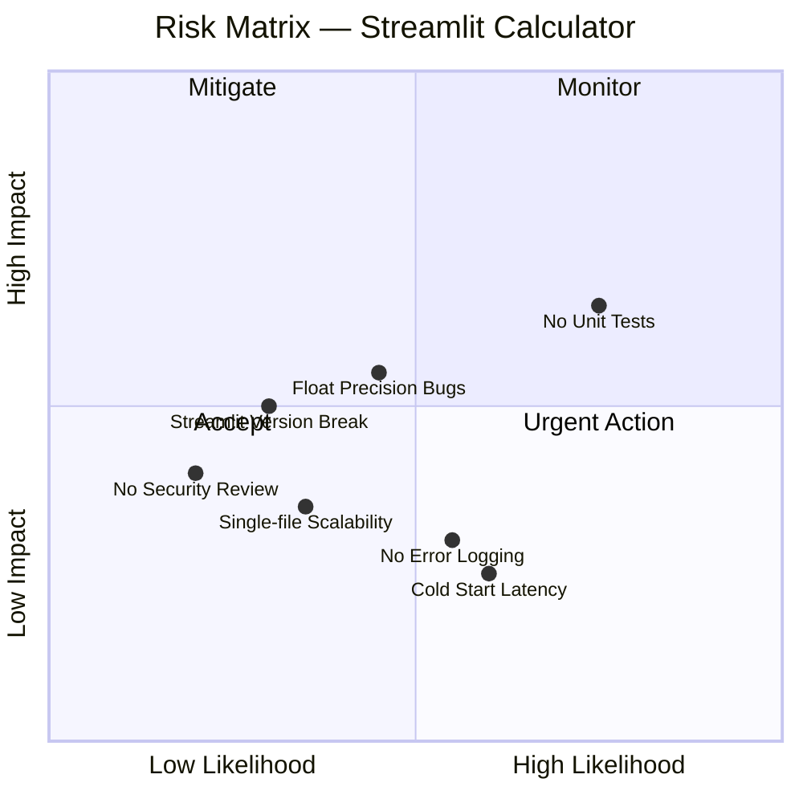

### 11.2 Detailed Risk Items

| ID   | Risk                                  | Likelihood | Impact  | Description                                                               | Mitigation Strategy                                               |
|------|---------------------------------------|------------|---------|---------------------------------------------------------------------------|-------------------------------------------------------------------|
| R-1  | **No unit tests**                     | High       | High    | Any change to arithmetic logic or dispatch can silently break results     | Add `pytest` tests for all four operations and edge cases         |
| R-2  | **Float precision edge cases**        | Medium     | Medium  | IEEE 754 produces unexpected results (e.g. `0.1 + 0.2 = 0.30000000000000004`) | Document known limitations; optionally add `decimal.Decimal`  |
| R-3  | **Streamlit version breaking changes**| Low        | Medium  | Streamlit API changes on upgrade may break widget calls                   | Pin exact version in `requirements.txt`; add changelog review     |
| R-4  | **No output range validation**        | Low        | Medium  | Extreme values (e.g. `1e308 * 1e308`) produce `inf` without user warning  | Add `math.isinf` / `math.isnan` check before displaying result   |
| R-5  | **No error/audit logging**            | Medium     | Low     | Errors are invisible server-side; debugging production issues is hard     | Add Python `logging` module calls alongside `st.error()`         |
| R-6  | **Cold start latency**                | High       | Low     | Streamlit's first load takes 2–5 s; users may think the app is broken    | Acceptable for dev tool; add loading indicator if deployed public |
| R-7  | **Single-file scalability limit**     | Low        | Low     | Adding more operations will make the if/elif chain unwieldy               | Refactor to dict-dispatch `{op: lambda a,b: a+b}` pattern        |

### 11.3 Technical Debt Items

| ID   | Debt Item                             | Severity | Effort   | Description                                                          |
|------|---------------------------------------|----------|----------|----------------------------------------------------------------------|
| TD-1 | **Zero test coverage**                | High     | Low      | No `pytest` tests exist; add `tests/test_calculator.py`              |
| TD-2 | **No type annotations**               | Medium   | Low      | Variables lack type hints; reduces IDE autocompletion and safety     |
| TD-3 | **No docstrings**                     | Low      | Very Low | No inline documentation for logic blocks                             |
| TD-4 | **Hardcoded default input values**    | Low      | Very Low | `value=0.0` hardcoded; could be URL-param configurable              |
| TD-5 | **No `inf`/`nan` output guard**       | Medium   | Low      | `1e308 * 1e308` produces `inf` with no user-facing warning           |
| TD-6 | **Operation logic not extracted**     | Low      | Low      | Arithmetic dispatch mixed with UI code; impedes unit testing         |

### 11.4 Recommended Improvement Roadmap

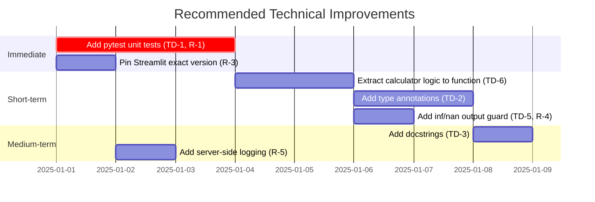

---

## 12. Glossary

| Term                        | Definition                                                                                                    |
|-----------------------------|---------------------------------------------------------------------------------------------------------------|
| **Arithmetic Operation**    | One of the four basic mathematical operations: addition (+), subtraction (−), multiplication (×), division (÷) |
| **Streamlit**               | An open-source Python framework for building interactive web applications, primarily for data science and utilities |
| **Reactive UI**             | A UI model where the entire application script re-renders in response to any user input change                 |
| **st.form**                 | A Streamlit widget container that batches inputs and triggers a single re-run only on form submit             |
| **st.stop()**               | A Streamlit function that immediately halts script execution at the point it is called                        |
| **number_input**            | A Streamlit widget that renders a numeric input field constrained to floating-point values                    |
| **selectbox**               | A Streamlit widget that renders a dropdown selection control                                                  |
| **st.expander**             | A Streamlit collapsible container widget used here to show computation detail                                 |
| **IEEE 754**                | The international standard for floating-point arithmetic; Python `float` uses 64-bit double-precision format  |
| **Guard Clause**            | A pattern that checks for an invalid condition at the start of a code block and returns / stops early         |
| **Division by Zero**        | An undefined arithmetic operation; caught by `if num2 == 0` before executing division                        |
| **Cyclomatic Complexity**   | A software metric measuring the number of linearly independent paths through source code                      |
| **Procedural Code**         | Code structured as a sequence of statements rather than using classes and objects                             |
| **Stateless**               | A system that does not retain information between requests; each interaction is self-contained                 |
| **Tornado**                 | The Python async HTTP server used internally by Streamlit to serve the web interface                          |
| **Virtual Environment**     | An isolated Python environment (`.venv`) that separates project dependencies from system packages             |
| **LOC**                     | Lines of Code — a basic measure of program size                                                               |
| **ADR**                     | Architecture Decision Record — a document capturing a significant architectural choice and its rationale      |
| **Arc42**                   | A template for software architecture documentation providing 12 standardised sections                         |
| **Reactive Pipeline**       | A sequential data-flow pattern where each stage transforms inputs and passes results to the next stage        |

---

*Documentation generated by the Arc42 Documentation Generator.*  
*Source analysed: `app.py` (50 LOC), `requirements.txt`, `README.md`.*  
*All diagrams are rendered using [Mermaid](https://mermaid.js.org/).*  
*To move this file to the canonical path run:*  
```bash
mkdir -p docs/arc42
mv arc42-architecture.md docs/arc42/arc42-architecture.md
```

