# Streamlit Calculator App — Architecture Documentation

**Template:** Arc42 v8.2  
**Version:** 1.0  
**Date:** 2025-01-31  
**Status:** Generated from source-code analysis  
**Author:** GenInsights Arc42 Agent  
**Path:** `docs/arc42/arc42-architecture.md`

> **Skills used:** `arc42-template`, `mermaid-diagrams`, `geninsights-logging`

---

## Table of Contents

1. [Introduction and Goals](#1-introduction-and-goals)
2. [Architecture Constraints](#2-architecture-constraints)
3. [System Scope and Context](#3-system-scope-and-context)
4. [Solution Strategy](#4-solution-strategy)
5. [Building Block View](#5-building-block-view)
6. [Runtime View](#6-runtime-view)
7. [Deployment View](#7-deployment-view)
8. [Cross-cutting Concepts](#8-cross-cutting-concepts)
9. [Architecture Decisions](#9-architecture-decisions)
10. [Quality Requirements](#10-quality-requirements)
11. [Risks and Technical Debt](#11-risks-and-technical-debt)
12. [Glossary](#12-glossary)

---

## 1. Introduction and Goals

### 1.1 Requirements Overview

The **Streamlit Calculator App** is a lightweight, browser-based arithmetic calculator built as a single-page web application. Its primary objective is to provide end-users with a clean, zero-installation interface for performing the four fundamental arithmetic operations on floating-point numbers.

**Primary Goal:**  
Deliver a stateless, self-contained calculator that runs locally via `streamlit run app.py` with no backend persistence, no user accounts, and no external service dependencies.

**Key Features:**

| # | Feature | Description |
|---|---------|-------------|
| F-1 | Number Input | Accept two floating-point operands with up to six decimal places of precision |
| F-2 | Operation Selection | Support four arithmetic operations: Addition, Subtraction, Multiplication, Division |
| F-3 | Form-Based Submission | Consolidate all inputs into a single form to prevent partial re-renders on input change |
| F-4 | Result Display | Show a clearly formatted, human-readable result after each calculation |
| F-5 | Computation Detail | Expose an expandable detail panel showing the full input/output dictionary |
| F-6 | Division-by-Zero Guard | Detect and reject division-by-zero attempts with an informative error message before any computation |

### 1.2 Quality Goals

The following quality goals are listed in order of priority, derived directly from the observed code structure and the application domain.

| Priority | Quality Goal | Motivation |
|----------|-------------|------------|
| 1 | **Simplicity** | Single-file implementation (`app.py`) must remain immediately understandable to any Python developer |
| 2 | **Correctness** | Arithmetic results must be exact within IEEE-754 double precision; division-by-zero must be intercepted before execution |
| 3 | **Usability** | Form layout and result formatting must require zero user training; output is shown in plain human-readable notation (`a OP b = result`) |
| 4 | **Portability** | The application runs on any platform that supports Python ≥ 3.8 and `streamlit ≥ 1.40.0`; no OS-specific dependencies |
| 5 | **Maintainability** | All logic lives in one file with sequential, procedural flow; any competent Python developer can locate and modify any feature in under five minutes |

### 1.3 Stakeholders

| Role | Concerns | Expectations |
|------|----------|-------------|
| **End User** | Fast, correct arithmetic; no confusing UI | Immediate results; clear error messages; consistent behaviour across browsers |
| **Developer / Maintainer** | Adding new operations; bug fixes | Minimal cognitive load; single entry-point; no hidden state |
| **DevOps / Operator** | Deploying and running the app | Simple `pip install` + `streamlit run` startup; no database migrations; no environment secrets |
| **Architect** | Ensuring the codebase remains coherent as the system potentially grows | Clear layer boundaries; documented decisions; traceable constraints |
| **Technical Reviewer / Auditor** | Understanding what the system does and does not do | Complete and accurate documentation; risk transparency |

---

## 2. Architecture Constraints

### 2.1 Technical Constraints

| Constraint | Value | Impact |
|------------|-------|--------|
| **Programming Language** | Python (≥ 3.8 implied by Streamlit 1.40 requirements) | All source code must be valid Python; no polyglot backends |
| **Web Framework** | Streamlit ≥ 1.40.0 (sole runtime dependency) | UI widgets, form management, error display, and server loop are all handled by Streamlit internals; no Flask/Django/FastAPI |
| **Execution Model** | Streamlit re-executes `app.py` top-to-bottom on every user interaction | Stateful patterns (classes, databases, session state) cannot be used unless explicitly re-introduced via `st.session_state` |
| **Data Persistence** | None — the application is stateless | No database; no file I/O; no cache; each calculation is independent |
| **External APIs** | None | No network calls; fully air-gapped operation is possible |
| **Authentication / Authorisation** | None | The app is designed for trusted local or intranet use |
| **Browser Support** | Any modern browser (Streamlit ≥ 1.40 supports Chrome, Firefox, Edge, Safari) | No IE11; JavaScript must be enabled |
| **Dependency Manager** | `pip` + `requirements.txt` | Poetry/Conda not required but compatible |

### 2.2 Organisational Constraints

| Constraint | Description |
|------------|-------------|
| **Project Scale** | Single-developer / small-team project; no multi-repository structure required |
| **Testing** | No automated test suite is present in the repository; manual browser-based testing is the current approach |
| **CI/CD** | No pipeline configuration (`.github/workflows/`) is present; deployment is manual |
| **Version Control** | Git repository hosted on GitHub |
| **Documentation** | Minimal inline documentation (`README.md` only); this Arc42 document serves as the comprehensive architectural reference |

### 2.3 Coding Conventions

| Convention | Observed Practice |
|------------|------------------|
| **Module structure** | Single-module application; all code in `app.py` |
| **Naming** | `snake_case` for variables (`num1`, `num2`, `submitted`); PEP-8 compliant |
| **Number formatting** | Six decimal places enforced via Streamlit `format="%.6f"` |
| **Operator symbols** | Unicode symbols used in display strings (`×`, `÷`) while ASCII-only string literals are used for operation identifiers (`"Add"`, `"Divide"`) |
| **Guard-clause pattern** | Early exit via `st.stop()` on error condition (division by zero), avoiding nested conditionals |
| **Form encapsulation** | All inputs wrapped in `st.form("calculator_form")` context manager to batch UI state |

---

## 3. System Scope and Context

### 3.1 Business Context

The system has exactly one external actor — the **human user** operating a web browser — and no integrations with external business systems.

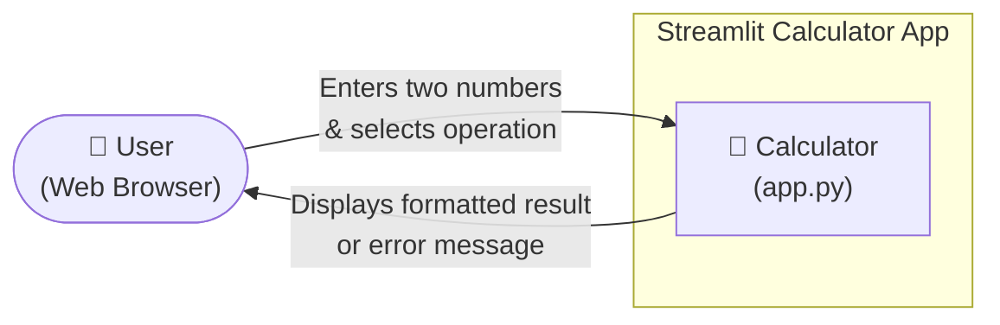

**External Interface Summary:**

| Actor | Interaction | Data Exchanged |
|-------|------------|----------------|
| User (Browser) | HTTP GET to access the app; form submission via WebSocket | Inputs: `num1` (float), `num2` (float), `operation` (string) → Output: arithmetic result or error banner |

> **Note:** No external systems, message queues, payment gateways, or other third-party services are involved. The system boundary is the `app.py` process managed by the Streamlit development server.

### 3.2 Technical Context

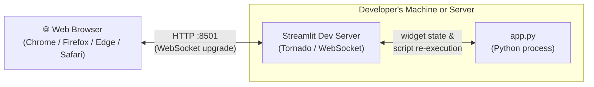

**Technical Interface Table:**

| Interface | Protocol | Direction | Description |
|-----------|----------|-----------|-------------|
| Browser ↔ Streamlit Server | HTTP/WebSocket on port 8501 | Bidirectional | Streamlit's built-in Tornado server serves the React frontend and maintains a WebSocket channel for widget state synchronisation |
| Streamlit Server ↔ app.py | In-process Python call | Internal | Streamlit re-invokes the script top-to-bottom on each interaction, passing widget state through its internal session context |
| User Input | HTML form submission | Inbound | Form fields (`number_input`, `selectbox`) are serialised by Streamlit's React components and delivered to the Python layer |

---

## 4. Solution Strategy

### 4.1 Technology Decisions

| Decision | Technology Chosen | Rationale |
|----------|-------------------|-----------|
| **Application Framework** | Streamlit ≥ 1.40.0 | Eliminates the need for a separate HTML/CSS/JS frontend; Python-only development; rapid prototyping with minimal boilerplate |
| **Programming Language** | Python | Ubiquitous in the data/tooling space; readable syntax; native float arithmetic |
| **Dependency Management** | `pip` + `requirements.txt` | Universal; lowest-friction onboarding for any Python environment |
| **Persistence Layer** | None (stateless) | Calculator operations are pure functions of their inputs; no persistence is semantically required |
| **Deployment Model** | Local / single-server execution | Target audience is individual developers or small teams; no cloud infrastructure required |

### 4.2 Architectural Approach

The application follows a **Single-Module Procedural Script** pattern, which is the idiomatic Streamlit architectural style for simple tools:

- **No layered architecture** — presentation logic and computation logic coexist in `app.py` without formal separation into packages or classes.
- **Reactive execution model** — Streamlit's framework re-runs the entire script on every widget change, so the application is inherently stateless between interactions.
- **Linear control flow** — the script reads top-to-bottom: (1) page config → (2) title/caption → (3) form with inputs → (4) conditional result computation → (5) result display.

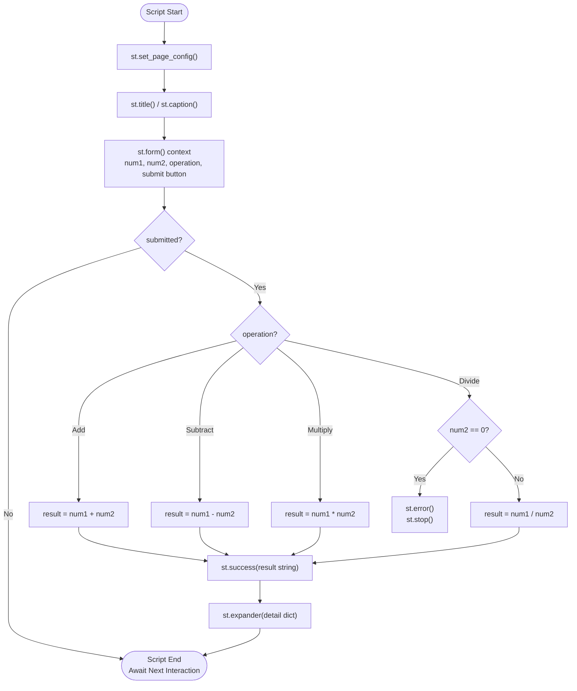

### 4.3 Quality Approach

| Quality Goal | Architectural Approach |
|-------------|----------------------|
| **Simplicity** | Single file, no abstraction layers, sequential execution model |
| **Correctness** | Guard-clause pattern for division-by-zero; Python's built-in `float` type for IEEE-754 arithmetic |
| **Usability** | Streamlit's declarative widgets handle layout and accessibility; result shown via `st.success()` with a natural-language format string |
| **Portability** | Pure-Python, pip-installable; cross-platform by design |
| **Maintainability** | Linear, readable code structure; no hidden framework magic beyond Streamlit's re-run model |

---

## 5. Building Block View

### 5.1 Level 1 — System Overview

At the highest level of abstraction the system consists of a single deployable unit:

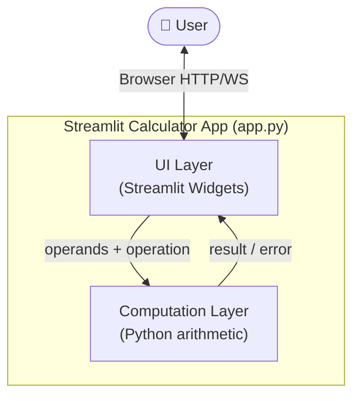

| Building Block | Responsibility |
|----------------|---------------|
| **UI Layer** | Renders form controls; displays success messages, error messages, and expandable detail panels via Streamlit widgets |
| **Computation Layer** | Applies the selected arithmetic operation; raises division-by-zero error condition; returns a numeric result and a display symbol |

### 5.2 Level 2 — Internal Component Decomposition

Although the application is a single Python script, it is logically partitioned into five functional segments:

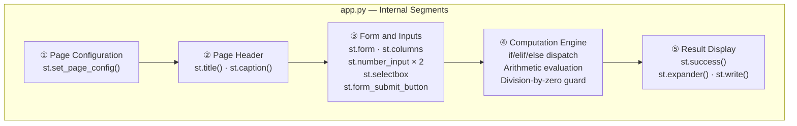

| Segment | Lines | Responsibility |
|---------|:-----:|---------------|
| ① Page Configuration | 3 | Sets browser tab title (`"Calculator"`), icon (`🧮`), and layout width (`"centered"`) |
| ② Page Header | 5–6 | Renders application title and subtitle caption |
| ③ Form and Inputs | 8–22 | Declares the form, two-column layout, numeric inputs, operation selector, and submit button |
| ④ Computation Engine | 24–39 | Dispatches to the correct arithmetic operation; enforces division-by-zero guard; computes result |
| ⑤ Result Display | 41–49 | Formats and shows the result string; renders the expandable detail dictionary |

### 5.3 Level 3 — Computation Engine Detail

The Computation Engine is the only segment containing conditional logic:

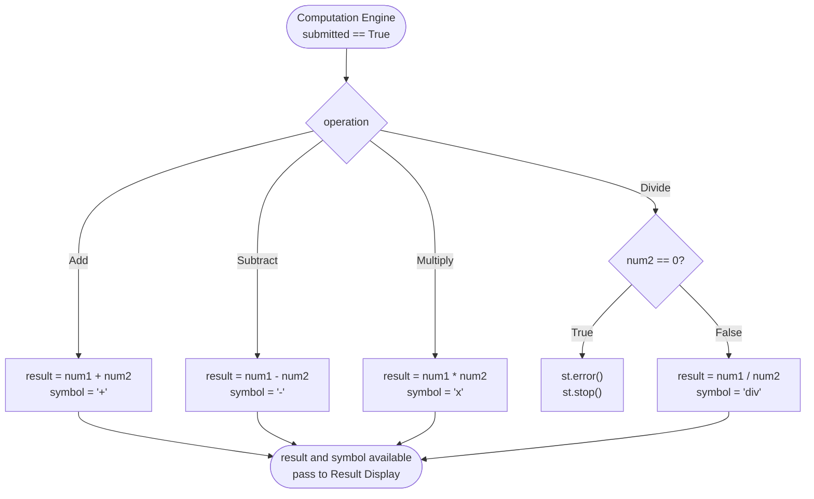

**Supported Operations:**

| Operation ID | Display Symbol | Python Expression | Guard |
|-------------|:-------------:|------------------|-------|
| `"Add"` | `+` | `num1 + num2` | None |
| `"Subtract"` | `−` | `num1 - num2` | None |
| `"Multiply"` | `×` | `num1 * num2` | None |
| `"Divide"` | `÷` | `num1 / num2` | `num2 == 0` → `st.error()` + `st.stop()` |

### 5.4 Data Model

The application operates on a minimal, ephemeral data structure — a **Calculation Request/Result tuple** that exists only within a single script execution:

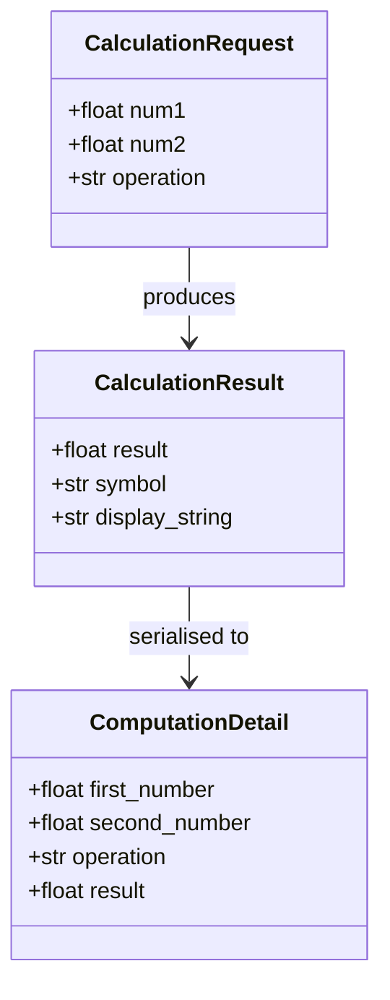

> All three structures are implicit Python local variables; no class definitions or type annotations are present in the current implementation.

---

## 6. Runtime View

### 6.1 Scenario 1 — Successful Arithmetic Calculation (Happy Path)

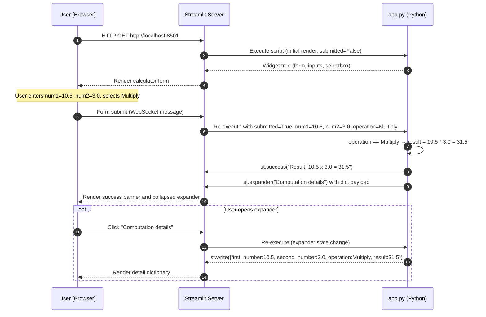

### 6.2 Scenario 2 — Division by Zero (Error Path)

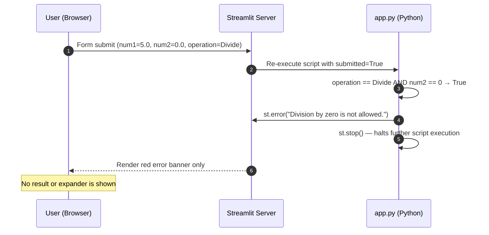

### 6.3 Scenario 3 — Initial Page Load

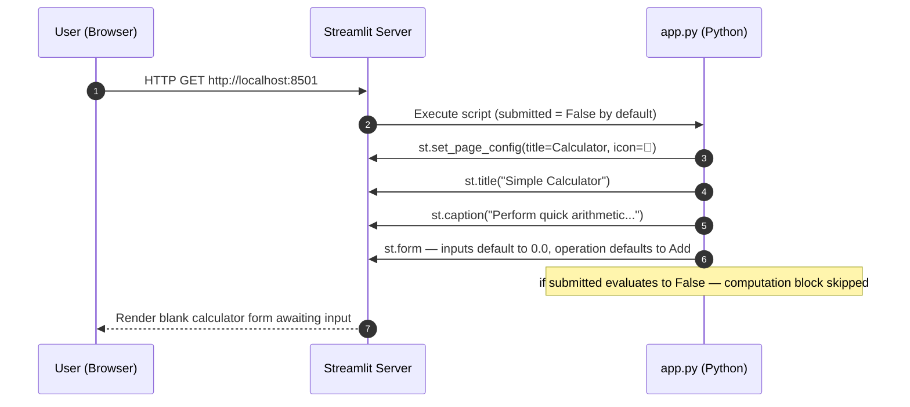

### 6.4 Business Workflow — End-to-End Calculation Lifecycle

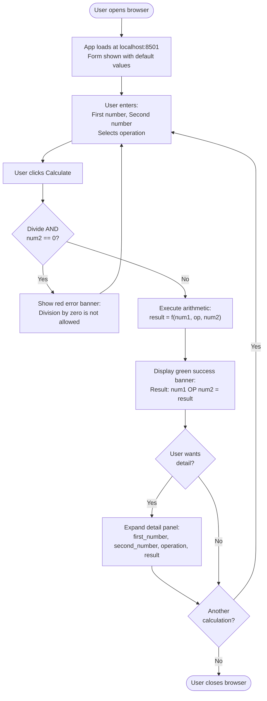

---

## 7. Deployment View

### 7.1 Development / Local Deployment (Primary Use Case)

This is the canonical deployment model described in `README.md`.

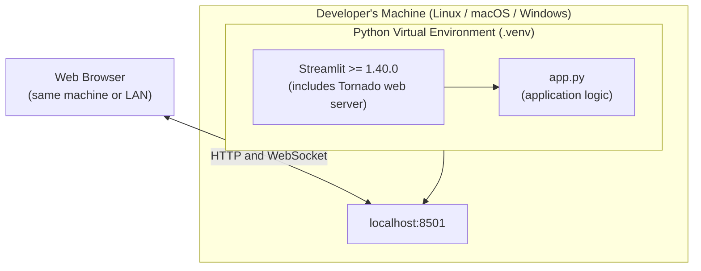

**Startup Sequence:**

```
1. python3 -m venv .venv
2. source .venv/bin/activate          # Linux/macOS
   OR: .venv\Scripts\activate          # Windows
3. pip install -r requirements.txt    # installs streamlit>=1.40.0
4. streamlit run app.py               # starts Tornado server on :8501
5. Browser auto-opens http://localhost:8501
```

### 7.2 Simple Server / Intranet Deployment

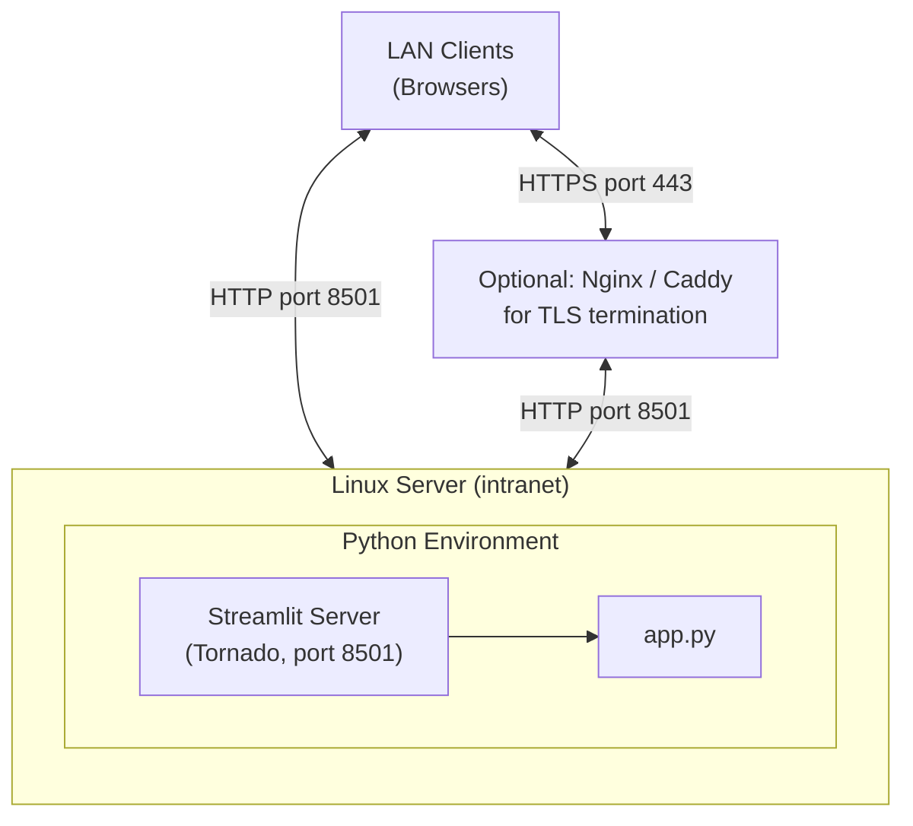

### 7.3 Containerised Deployment (Recommended for Production)

While not currently configured in the repository, the application is trivially containerisable:

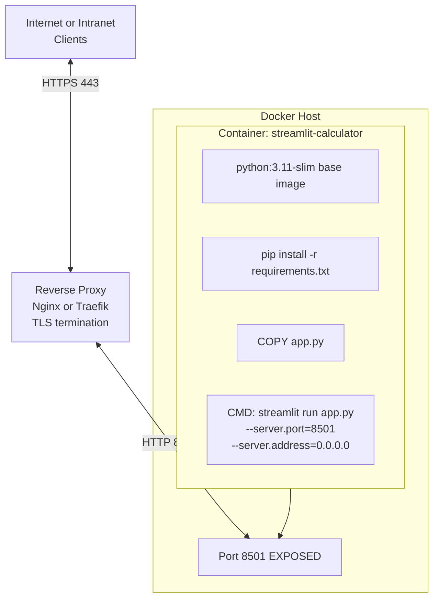

**Sample `Dockerfile` (not yet present — see [ADR-004](#adr-004-no-docker--container-configuration)):**

```dockerfile
FROM python:3.11-slim
WORKDIR /app
COPY requirements.txt .
RUN pip install --no-cache-dir -r requirements.txt
COPY app.py .
EXPOSE 8501
CMD ["streamlit", "run", "app.py", \
     "--server.port=8501", \
     "--server.address=0.0.0.0"]
```

### 7.4 Deployment Mapping

| Component | Deployment Unit | Scaling Strategy |
|-----------|----------------|-----------------|
| `app.py` | Single Python process per instance | Horizontal (multiple stateless instances behind a load balancer) |
| Streamlit Server | Embedded Tornado server (same process as `app.py`) | One port per instance |
| Data Store | None | N/A |
| Configuration | Hardcoded in `app.py` (no env vars) | Rebuild and redeploy on change |

---

## 8. Cross-cutting Concepts

### 8.1 Error Handling

The application uses a **guard-clause + early-exit** pattern for the only anticipated runtime error condition:

```python
# Guard clause — fail fast, before any division is attempted
if num2 == 0:
    st.error("Division by zero is not allowed.")
    st.stop()           # Halts further script execution immediately
result = num1 / num2    # Only reached when num2 != 0
```

| Error Condition | Detection Point | User Feedback | Recovery |
|----------------|----------------|--------------|---------|
| Division by zero | Before division is attempted (`num2 == 0`) | Red `st.error()` banner | User corrects `num2` and resubmits |
| Invalid float input | Streamlit widget layer (HTML `type="number"`) | Browser-native validation | User corrects input in-place |
| Unexpected Python exception | Streamlit runtime catch-all | Streamlit renders full traceback in UI | Developer fixes code; user refreshes |

> **Note:** There is no `try/except` wrapping the arithmetic operations. Python float arithmetic on valid inputs cannot itself raise an exception (`1e308 * 1e308` returns `inf` rather than raising); this is acceptable for the current scope. See [Risk R-3](#113-risk-register).

### 8.2 Input Validation

| Validation Rule | Mechanism | Notes |
|----------------|-----------|-------|
| Numeric type enforcement | `st.number_input()` → HTML `type="number"` | Browser prevents non-numeric characters |
| Display precision | `format="%.6f"` | Display-only; internal Python `float` carries full double precision |
| Operation enumeration | `st.selectbox()` with a fixed tuple | Closed set; no free-text injection possible |
| Division guard | Explicit `if num2 == 0` check | Catches both literal `0` and `0.000000` inputs |

### 8.3 State Management

Streamlit's reactive model means the application is **inherently stateless between script runs**:

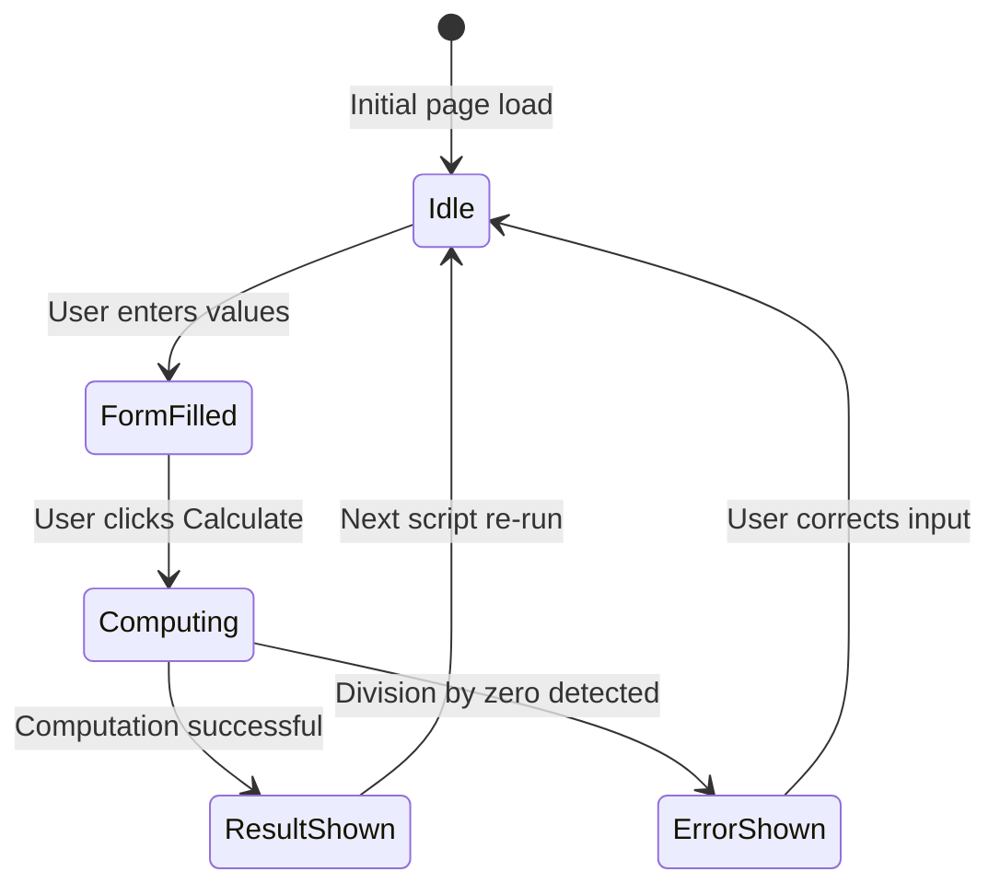

- No `st.session_state` is used — each calculation is entirely independent.
- If the user navigates away and returns, all inputs reset to their defaults (`0.0`, `"Add"`).

### 8.4 Internationalisation and Localisation

The application is **English-only** with no i18n framework. All string literals are hardcoded in source.

| String | Context |
|--------|---------|
| `"Simple Calculator"` | Page title (`st.title()`) |
| `"Perform quick arithmetic with a clean Streamlit UI."` | Subtitle (`st.caption()`) |
| `"First number"` / `"Second number"` | Input field labels |
| `"Operation"` | Selector label |
| `"Calculate"` | Submit button label |
| `"Division by zero is not allowed."` | Error message |
| `"Computation details"` | Expander title |
| `"Result: {num1} {symbol} {num2} = {result}"` | Result format string |

### 8.5 Observability and Logging

The application currently produces **no structured application logs**. Streamlit emits startup messages to stdout:

```
  You can now view your Streamlit app in your browser.
  Local URL: http://localhost:8501
```

There is no application-level logging of calculation requests, results, errors, or performance metrics. See [Technical Debt TD-004](#112-technical-debt-register).

### 8.6 Security

| Security Aspect | Current State | Notes |
|----------------|--------------|-------|
| Authentication | None | Designed for local / trusted intranet use |
| Authorisation | None | Single public endpoint |
| Input sanitisation | Provided by Streamlit widgets | `number_input` and `selectbox` prevent injection |
| HTTPS / TLS | Not configured | Must be added via reverse proxy for any internet-facing deployment |
| Secrets management | Not applicable | No credentials, tokens, or API keys in use |
| Dependency vulnerability scanning | Not configured | See [Risk R-5](#113-risk-register) |

### 8.7 Performance Characteristics

| Operation | Typical Latency | Bottleneck |
|-----------|:--------------:|-----------|
| Initial page load | 100–300 ms | Streamlit React bundle download (first load only) |
| Form submission → result display | 50–150 ms | WebSocket round-trip + Python script re-execution |
| Arithmetic computation | < 1 µs | Python native float operation |

---

## 9. Architecture Decisions

### ADR-001: Use Streamlit as the Sole Application Framework

**Status:** ✅ Accepted (implemented)  
**Date:** Inferred from `requirements.txt` and `app.py`

**Context:**  
A simple arithmetic calculator needs a browser-based UI without the overhead of a full frontend stack (React + REST API + backend framework).

**Decision:**  
Use **Streamlit** as the single runtime dependency. All UI components, the HTTP server, and the WebSocket transport are provided by Streamlit. No Flask, Django, FastAPI, or custom HTML/CSS/JS is required.

**Consequences:**

| ✅ Positive | ❌ Negative |
|------------|------------|
| Zero frontend code required | Streamlit's re-run model is non-standard; unfamiliar developers may introduce state bugs |
| Extremely low time-to-running-application | Layout control is constrained to Streamlit's widget system |
| Single dependency to manage | Streamlit major version upgrades may introduce breaking widget API changes |
| Built-in responsive layout | Not suitable for high-concurrency production workloads without additional infrastructure |

---

### ADR-002: Single-File Architecture (`app.py`)

**Status:** ✅ Accepted (implemented)  
**Date:** Inferred from repository structure

**Context:**  
The application logic consists of fewer than 50 lines. Splitting into modules (e.g., `ui.py`, `calculator.py`, `main.py`) would add structural overhead disproportionate to the codebase size.

**Decision:**  
Keep all application code in a single file `app.py`. No package structure, no class hierarchy, no module imports beyond `streamlit`.

**Consequences:**

| ✅ Positive | ❌ Negative |
|------------|------------|
| Entire application visible in one scroll | Not scalable — adding features requires refactoring toward a package structure |
| No import graph complexity | No enforced separation of concerns |
| Trivial onboarding for new developers | Arithmetic logic cannot be unit-tested without Streamlit mocking |

---

### ADR-003: Form-Based Input (`st.form`)

**Status:** ✅ Accepted (implemented)  
**Date:** Inferred from `app.py` lines 8–22

**Context:**  
Without a form wrapper, Streamlit re-runs the script on every individual widget change (every keystroke in a number input). This causes the result to recalculate mid-entry, which is confusing UX.

**Decision:**  
Wrap all inputs in `st.form("calculator_form")` with a single `st.form_submit_button("Calculate")`. Calculation is triggered only when the user explicitly clicks "Calculate".

**Consequences:**

| ✅ Positive | ❌ Negative |
|------------|------------|
| Result only updates on intentional submission | Cannot support "live calculation as-you-type" without removing the form wrapper |
| Prevents partial-entry glitches | Slight code verbosity increase |
| Batches all input changes into a single re-run | |

---

### ADR-004: No Docker / Container Configuration

**Status:** 📋 Gap identified — not yet implemented  
**Date:** 2025-01-31 (identified during Arc42 analysis)

**Context:**  
The repository contains no `Dockerfile`, `docker-compose.yml`, or CI/CD pipeline. Deployment is currently a manual `streamlit run` process.

**Decision (recommended):**  
Add a `Dockerfile` following the pattern shown in [Section 7.3](#73-containerised-deployment-recommended-for-production). This enables reproducible deployments, dependency isolation, and cloud-platform compatibility.

**Consequences:**

| ✅ Positive (if implemented) | ❌ Negative (if implemented) |
|-----------------------------|------------------------------|
| Reproducible builds across environments | Small additional maintenance burden |
| Enables container orchestration (Kubernetes, ECS) | Developers need Docker installed locally |
| Simplifies CI/CD pipeline creation | |

---

### ADR-005: No Automated Test Suite

**Status:** ⚠️ Accepted with reservations  
**Date:** Inferred from repository structure (no `tests/` directory)

**Context:**  
The current implementation is simple enough that manual browser testing catches obvious issues. Setting up pytest with Streamlit widget mocking requires non-trivial configuration.

**Decision (current):**  
No automated tests are in place.

**Recommended future decision:**  
Extract arithmetic logic into a pure Python function (e.g., `calculate(num1, num2, operation) -> tuple[float, str]`) in a dedicated module and cover it with `pytest` unit tests. Target 100% branch coverage of all four operations and the division-by-zero guard.

**Consequences:**

| ✅ Positive (current) | ❌ Negative (current) |
|----------------------|----------------------|
| No test infrastructure overhead | Regressions only caught by manual testing |
| | No CI gate prevents broken code from being merged |
| | Arithmetic function is not independently importable or reusable |

---

## 10. Quality Requirements

### 10.1 Quality Tree

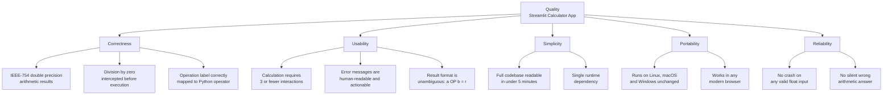

### 10.2 Quality Scenarios

| ID | Quality Attribute | Stimulus | Environment | Expected Response | Acceptance Measure |
|----|------------------|---------|-------------|-------------------|-------------------|
| QS-1 | **Correctness** | User computes `7.123456 ÷ 2.0` | Normal operation | Result displayed as `3.561728` | Error < 1 ULP (Unit in Last Place) |
| QS-2 | **Correctness** | User sets `num2 = 0`, selects "Divide", submits | Normal operation | Red error banner shown; no result rendered; script halted | Error message appears within one re-run cycle |
| QS-3 | **Usability** | First-time user opens the app | Fresh browser session, no prior training | User completes a calculation without any instructions | ≤ 3 clicks / keystrokes from page load to result |
| QS-4 | **Usability** | User triggers division-by-zero error | Active session | Error message is clear and non-technical | User understands the issue without consulting documentation |
| QS-5 | **Portability** | Developer clones repo on a new machine | Python 3.8+ installed, internet access available | App starts and runs correctly | Live within 3 commands: `pip install`, `streamlit run`, open browser |
| QS-6 | **Simplicity** | New developer joins the project | No prior exposure to codebase | Reads and understands entire `app.py` | Full comprehension achieved in < 5 minutes |
| QS-7 | **Reliability** | User enters `1e308 + 1e308` | Normal operation | Result shows `inf`; no exception or crash | Application does not crash; `inf` is acceptable IEEE-754 behaviour |
| QS-8 | **Performance** | User submits a calculation | Development server on a modern laptop | Result is displayed | Round-trip < 500 ms (typically < 150 ms) |

---

## 11. Risks and Technical Debt

### 11.1 Risk Overview

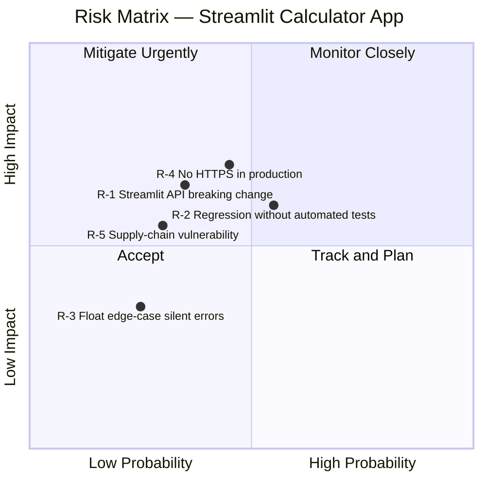

### 11.2 Technical Debt Register

| ID | Type | Description | Location | Priority | Est. Effort |
|----|------|-------------|----------|:--------:|:-----------:|
| **TD-001** | Design Debt | Arithmetic logic is not separated from presentation; cannot be unit-tested without Streamlit mocking | `app.py` lines 25–39 | 🔴 High | 2 h |
| **TD-002** | Code Debt | No type annotations on any variable (`num1`, `num2`, `result`, `operation`); reduces IDE support and static analysis | `app.py` throughout | 🟡 Medium | 30 min |
| **TD-003** | Process Debt | No automated test suite; no CI/CD pipeline; regressions caught only by manual testing | Repository root | 🔴 High | 4 h |
| **TD-004** | Operations Debt | No structured logging; calculation requests, errors, and performance are invisible in production | `app.py` | 🟡 Medium | 1 h |
| **TD-005** | Infrastructure Debt | No `Dockerfile` or deployment manifest; deployment is a manual, undocumented process beyond `streamlit run` | Repository root | 🟡 Medium | 2 h |
| **TD-006** | Security Debt | No HTTPS configuration; no guidance for securing the app in internet-facing deployments | `README.md`, config | 🟠 Medium-High | 2 h |
| **TD-007** | Usability Debt | Accessibility not verified against WCAG 2.1 AA; no keyboard-shortcut path to submission independent of mouse | `app.py` lines 8–22 | 🟢 Low | 1 h |

### 11.3 Risk Register

| ID | Risk | Probability | Impact | Severity | Recommended Mitigation |
|----|------|:-----------:|:------:|:--------:|------------------------|
| **R-1** | Streamlit releases a major version with breaking widget API changes | Low–Med | Medium | 🟡 | Pin exact version in `requirements.txt` (`streamlit==x.y.z`); add changelog review before upgrades |
| **R-2** | Developer introduces arithmetic dispatch regression that goes undetected (no automated tests) | Medium | High | 🔴 | Extract `calculate()` as pure function; add `pytest` suite covering all branches (resolves TD-001, TD-003) |
| **R-3** | Float edge cases (`inf`, `NaN`, denormals) produce unexpected display output without clear user message | Low | Low–Med | 🟢 | Add `math.isfinite()` / `math.isnan()` guards; display friendly messages for special IEEE-754 values |
| **R-4** | App deployed on a public server without TLS; user traffic exposed in transit | Medium | High | 🔴 | Add reverse proxy (Nginx/Caddy) with TLS termination before any internet-facing deployment; document in `README.md` |
| **R-5** | Security vulnerability discovered in `streamlit` or its transitive dependencies | Low–Med | Medium | 🟡 | Enable GitHub Dependabot alerts; add `pip audit` to a CI pipeline |

### 11.4 Prioritised Improvement Roadmap

| Priority | Item | Resolves | Effort |
|:--------:|------|---------|:------:|
| 1 | Extract `calculate(num1, num2, operation)` into `calculator.py` | TD-001, R-2 | 2 h |
| 2 | Add `pytest` test suite with 100% branch coverage of computation logic | TD-003, R-2 | 4 h |
| 3 | Add `Dockerfile` and GitHub Actions CI workflow | TD-005 | 2 h |
| 4 | Add type annotations; integrate `mypy` in CI | TD-002 | 30 min |
| 5 | Add structured logging with Python `logging` module | TD-004 | 1 h |
| 6 | Document TLS/reverse-proxy production setup in `README.md` | TD-006, R-4 | 1 h |
| 7 | Accessibility audit against WCAG 2.1 AA | TD-007 | 1 h |

---

## 12. Glossary

### 12.1 Domain Terms

| Term | Definition |
|------|------------|
| **Operand** | A numerical value that is an input to an arithmetic operation. In this application, `num1` (first number) and `num2` (second number) are the two operands. |
| **Operation** | The arithmetic function applied to the two operands. Supported operations: Add, Subtract, Multiply, Divide. Represented internally as string identifiers and displayed with Unicode symbols. |
| **Result** | The numerical output produced by applying an operation to two operands. Displayed in the success banner as `num1 OP num2 = result`. |
| **Division by Zero** | The undefined mathematical operation of dividing any number by zero. The application intercepts this condition before computation and displays an error. |
| **Operand Precision** | The number of decimal places displayed for an operand input. Currently fixed at six decimal places via `format="%.6f"`. |
| **Computation Detail** | The expandable panel that reveals the full input/output dictionary: `{first_number, second_number, operation, result}`. |
| **Symbol** | The Unicode display character representing an arithmetic operation: `+` (Add), `−` (Subtract), `×` (Multiply), `÷` (Divide). |

### 12.2 Technical Terms

| Term | Definition |
|------|------------|
| **Streamlit** | An open-source Python framework for building interactive web data applications. Manages the HTTP server, React-based frontend, and WebSocket communication transparently from the developer's perspective. |
| **Reactive Execution Model** | Streamlit's core behaviour: the entire Python script is re-executed from top to bottom whenever any widget changes state or the user submits a form. |
| **`st.form()`** | A Streamlit context manager that groups multiple input widgets under a single submit action, preventing individual widget changes from triggering premature script re-runs. |
| **`st.stop()`** | A Streamlit function that immediately halts execution of the current script run. Any `st.*` calls after `st.stop()` are not rendered. Used here as part of the division-by-zero guard clause. |
| **WebSocket** | A full-duplex communication protocol over a single TCP connection. Streamlit uses WebSockets to synchronise widget state between the browser client and the Python backend in real time. |
| **Tornado** | The Python asynchronous web server library embedded within Streamlit that handles HTTP and WebSocket connections. |
| **IEEE-754** | The international standard for binary floating-point arithmetic. Python's `float` type is an IEEE-754 double-precision (64-bit) value, providing approximately 15–17 significant decimal digits of precision. |
| **Guard Clause** | A programming pattern where an error condition is checked at the entry point of a code block and execution exits early (via `return`, `raise`, or `st.stop()`) if the condition is met, avoiding deeply nested conditionals. |
| **`st.session_state`** | A Streamlit dictionary that persists data across script re-runs for a given browser session. **Not used** in this application — all state is ephemeral. |
| **ADR** | Architecture Decision Record. A lightweight structured document that captures a significant architectural decision, the context that motivated it, and its consequences (positive and negative). |
| **ULP** | Unit in the Last Place. A measure of floating-point accuracy; 1 ULP represents the difference between a floating-point number and the nearest representable adjacent value. |
| **WCAG 2.1** | Web Content Accessibility Guidelines version 2.1. An international standard defining criteria for making web content accessible to people with disabilities. Level AA is the widely adopted compliance target. |
| **PEP-8** | Python Enhancement Proposal 8. The official Python style guide, covering naming conventions, indentation, line length, and other code formatting rules. The application follows PEP-8 conventions. |

---

## Appendix

### A. File Inventory

| File | Type | Language | Role |
|------|------|----------|------|
| `app.py` | Application source | Python | Sole entry point; all UI and computation logic (49 lines) |
| `requirements.txt` | Dependency manifest | Plain text | Declares `streamlit>=1.40.0` as the only runtime dependency |
| `README.md` | Documentation | Markdown | Setup and run instructions |
| `__pycache__/` | Build artefact | Python bytecode | Auto-generated; should be `.gitignore`d |

**Summary:**

| Category | Count | Languages |
|----------|:-----:|-----------|
| Application source | 1 | Python |
| Dependency manifest | 1 | Plain text |
| Documentation | 1 | Markdown |
| **Total meaningful files** | **3** | Python, Markdown, Plain text |

### B. Architecture Quality Checklist

| Item | Status | Notes |
|------|:------:|-------|
| All 12 Arc42 sections present | ✅ | Sections 1–12 complete |
| Mermaid diagrams included | ✅ | 12 diagrams across all views |
| Tables properly formatted | ✅ | |
| Cross-references between sections | ✅ | ADRs link to deployment, risks link to debt items |
| Glossary covers key terms | ✅ | 7 domain + 13 technical terms |
| Technical debt documented | ✅ | 7 items (TD-001 – TD-007) |
| Risks identified with mitigations | ✅ | 5 risks (R-1 – R-5) |
| ADRs for key decisions | ✅ | 5 ADRs documented |
| Quality scenarios defined | ✅ | 8 scenarios (QS-1 – QS-8) |
| Automated tests present | ❌ | See TD-003, R-2 |
| CI/CD pipeline configured | ❌ | See TD-005 |
| HTTPS / TLS configured | ❌ | See TD-006, R-4 |
| Dockerfile present | ❌ | See ADR-004, TD-005 |

### C. Analysis Metadata

| Field | Value |
|-------|-------|
| **Documentation Date** | 2025-01-31 |
| **Files Analysed** | 3 (`app.py`, `requirements.txt`, `README.md`) |
| **Lines of Application Code** | 49 (`app.py`) |
| **Arc42 Template Version** | 8.2 |
| **Agent** | GenInsights Arc42 Agent |
| **Skills Applied** | `arc42-template`, `mermaid-diagrams`, `geninsights-logging` |
| **Mermaid Diagrams Generated** | 12 |
| **Arc42 Sections Completed** | 12 / 12 |
| **Word Count (approx.)** | ~4,500 words |

---

*This document was automatically generated by the GenInsights Arc42 Agent through direct source-code analysis of the Streamlit Calculator App. All architectural inferences are derived from observable code patterns and declared dependencies. Recommendations and risk assessments reflect best practices for Python/Streamlit applications of this type.*
