# Arc42 Architecture Documentation — Streamlit Calculator App

**Version:** 1.0  
**Date:** 2026-03-27  
**Status:** Draft  

---

## Table of Contents

1. [Introduction and Goals](#1-introduction-and-goals)
2. [Architecture Constraints](#2-architecture-constraints)
3. [System Scope and Context](#3-system-scope-and-context)
4. [Solution Strategy](#4-solution-strategy)
5. [Building Block View](#5-building-block-view)
6. [Runtime View](#6-runtime-view)
7. [Deployment View](#7-deployment-view)
8. [Cross-cutting Concepts](#8-cross-cutting-concepts)
9. [Architecture Decisions](#9-architecture-decisions)
10. [Quality Requirements](#10-quality-requirements)
11. [Risks and Technical Debt](#11-risks-and-technical-debt)
12. [Glossary](#12-glossary)

---

## 1. Introduction and Goals

### 1.1 Requirements Overview

The **Streamlit Calculator App** is a lightweight, browser-based arithmetic tool that allows users to perform basic mathematical operations through a clean, interactive web interface.

| Feature | Description |
|---|---|
| Addition | Sum two floating-point numbers |
| Subtraction | Subtract second number from first |
| Multiplication | Multiply two floating-point numbers |
| Division | Divide first by second (with zero-guard) |
| Result Display | Shows equation and result in a styled success banner |
| Computation Details | Expandable section with input/output breakdown |

### 1.2 Quality Goals

| Priority | Quality Goal | Motivation |
|---|---|---|
| 1 | **Correctness** | Arithmetic results must be mathematically accurate |
| 2 | **Usability** | Minimal friction: one form, one button, instant feedback |
| 3 | **Reliability** | Graceful error handling (e.g., division by zero) |
| 4 | **Maintainability** | Single-file codebase, easy to extend or modify |
| 5 | **Deployability** | One-command startup, minimal dependencies |

### 1.3 Stakeholders

| Stakeholder | Role | Expectations |
|---|---|---|
| End User | Performs arithmetic calculations | Fast, accurate, and intuitive UI |
| Developer | Maintains and extends the app | Simple, readable code with clear structure |
| Operator | Deploys and runs the app | Minimal setup, single dependency |
| Tester | Validates functionality | Predictable behavior, clear error messages |

---

## 2. Architecture Constraints

### 2.1 Technical Constraints

| ID | Constraint | Rationale |
|---|---|---|
| TC-01 | Python 3.8+ required | Streamlit minimum runtime requirement |
| TC-02 | Streamlit >= 1.40.0 | Only declared dependency |
| TC-03 | Browser-based UI only | Streamlit renders in a web browser |
| TC-04 | Single-page application | No routing or multi-page structure |
| TC-05 | Stateless computation | No persistent storage or session state beyond form |
| TC-06 | Float arithmetic | Python native float (IEEE 754 double precision) |
| TC-07 | Local execution default | Designed to run on localhost:8501 |
| TC-08 | No authentication | Public access, no login required |

### 2.2 Organisational Constraints

| ID | Constraint | Rationale |
|---|---|---|
| OC-01 | Open-source stack | All components are freely available |
| OC-02 | Minimal dependencies | Only streamlit in requirements.txt |
| OC-03 | Single-file architecture | All logic in app.py |
| OC-04 | README-driven setup | Documentation via README.md |

### 2.3 Conventions

| Convention | Scope |
|---|---|
| PEP 8 | Python code style |
| Streamlit API | UI component conventions |
| Semantic versioning | Dependency pinning |
| Arc42 | Architecture documentation template |

---

## 3. System Scope and Context

### 3.1 Business Context

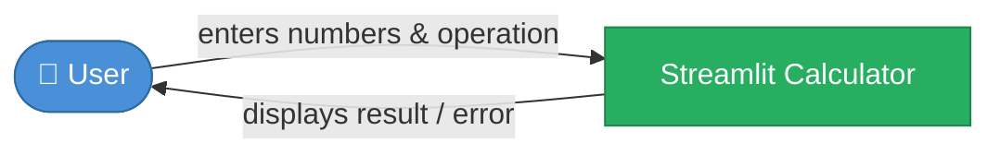

The user interacts exclusively through a web browser. No external systems, APIs, or databases are involved.

### 3.2 Technical Context

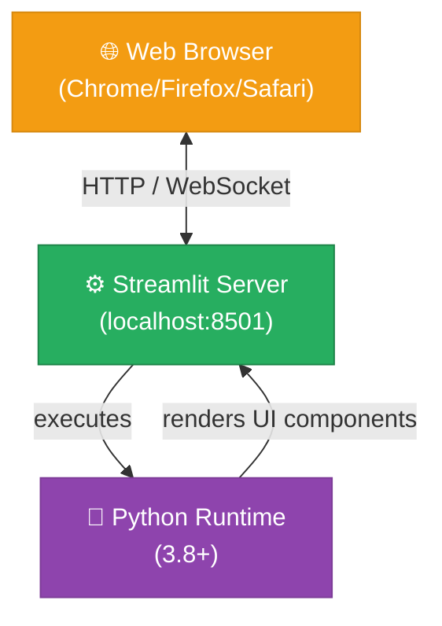

### 3.3 Communication Channels

| Channel | Protocol | Direction | Description |
|---|---|---|---|
| User ↔ Browser | Physical/visual | Bidirectional | User inputs data, reads results |
| Browser ↔ Streamlit | HTTP + WebSocket | Bidirectional | UI rendering and event streaming |
| Streamlit ↔ Python | In-process | Internal | Script execution per interaction |

---

## 4. Solution Strategy

### 4.1 Technology Decisions

| Decision | Choice | Alternative Considered | Rationale |
|---|---|---|---|
| UI Framework | Streamlit | Flask + HTML, Tkinter | Fastest path to interactive Python UI |
| Language | Python | JavaScript, Java | Universal data/ML language, matches Streamlit |
| State Management | st.form | Individual widgets | Atomic submission, prevents partial-state bugs |
| Number Type | Python float | Decimal, int | Sufficient precision for calculator use case |
| Deployment | CLI (streamlit run) | Docker, cloud | Minimal setup friction |

### 4.2 Top-Level Decomposition

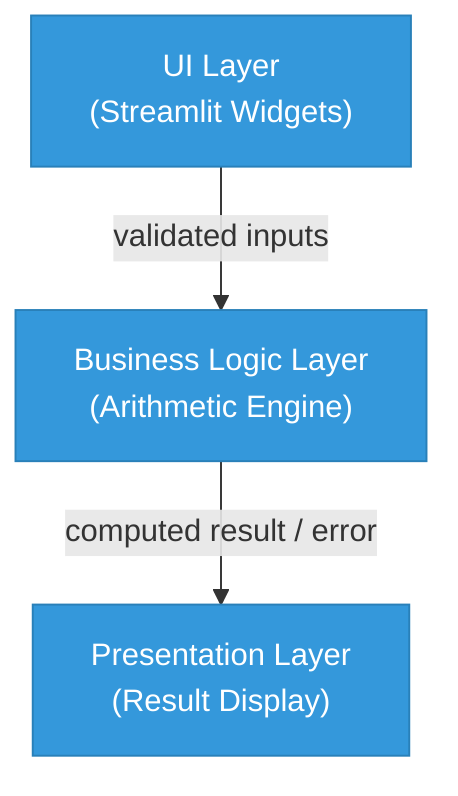

### 4.3 Quality Approach

| Quality Goal | Approach |
|---|---|
| Correctness | Python native arithmetic + explicit division-by-zero guard |
| Usability | st.form for atomic input, st.columns for layout |
| Reliability | st.error + st.stop() for error states |
| Maintainability | Single file, linear control flow, no external state |
| Deployability | Single pip install, single CLI command |

---

## 5. Building Block View

### 5.1 Level 1 — System Whitebox

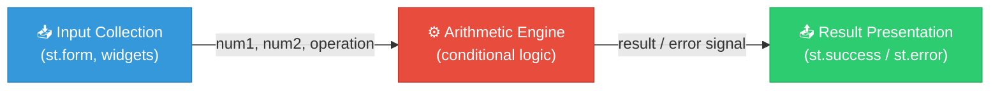

**Contained Building Blocks:**

| Block | Responsibility |
|---|---|
| Input Collection | Renders form widgets, captures user inputs |
| Arithmetic Engine | Performs selected arithmetic operation |
| Result Presentation | Displays result or error to the user |

### 5.2 Level 2 — Input Collection Whitebox

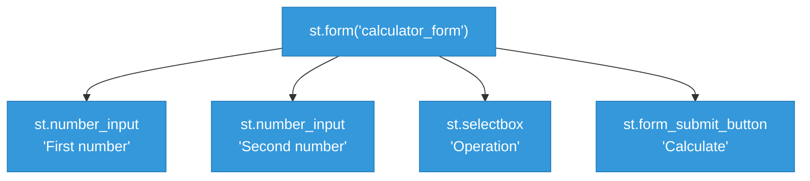

### 5.3 Level 2 — Arithmetic Engine Whitebox

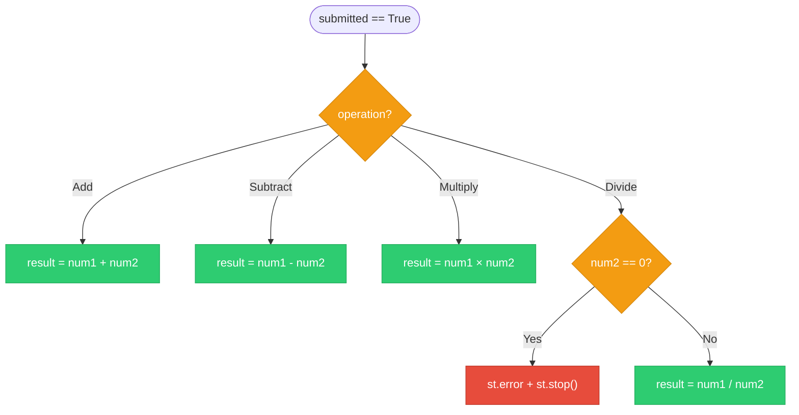

### 5.4 Level 2 — Result Presentation Whitebox

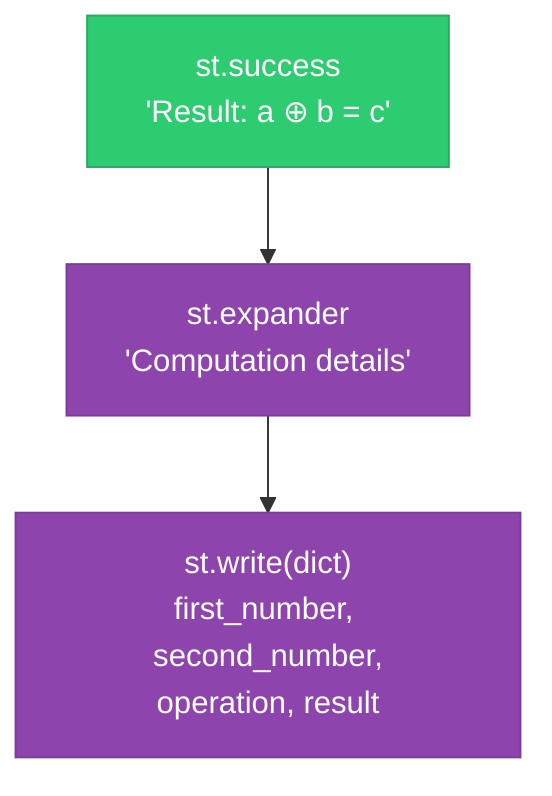

---

## 6. Runtime View

### 6.1 Scenario: Successful Calculation

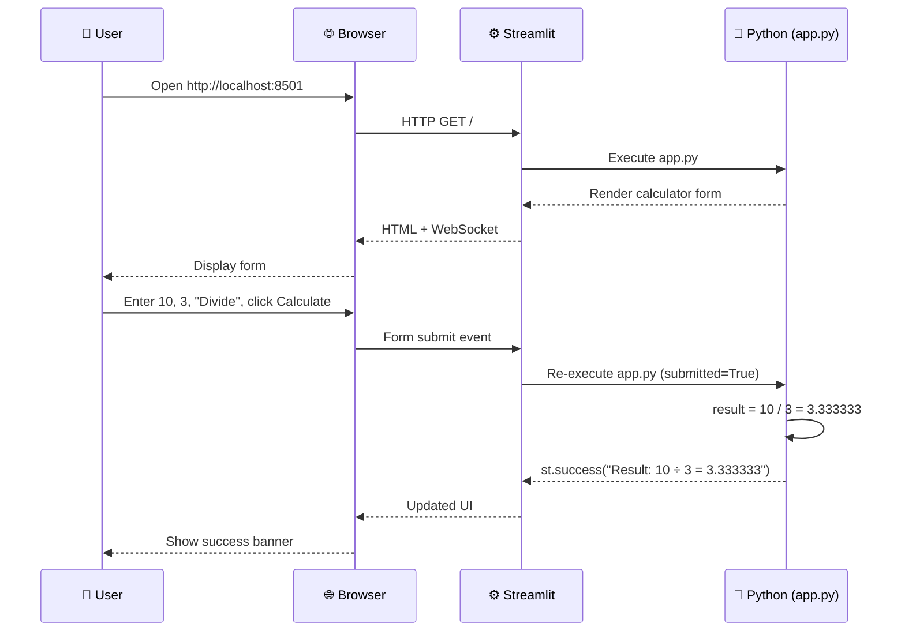

### 6.2 Scenario: Division by Zero Error

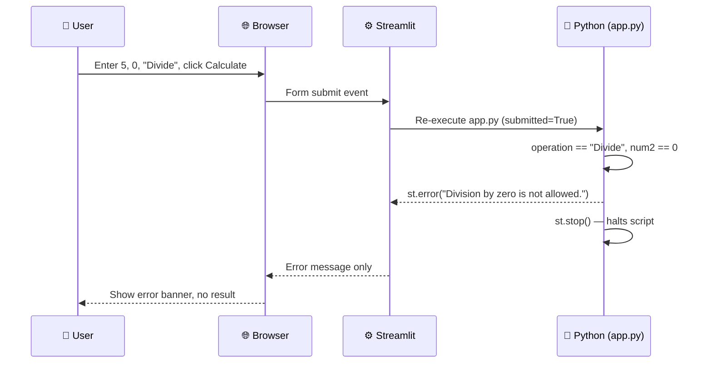

### 6.3 Scenario: Page Load (No Submission)

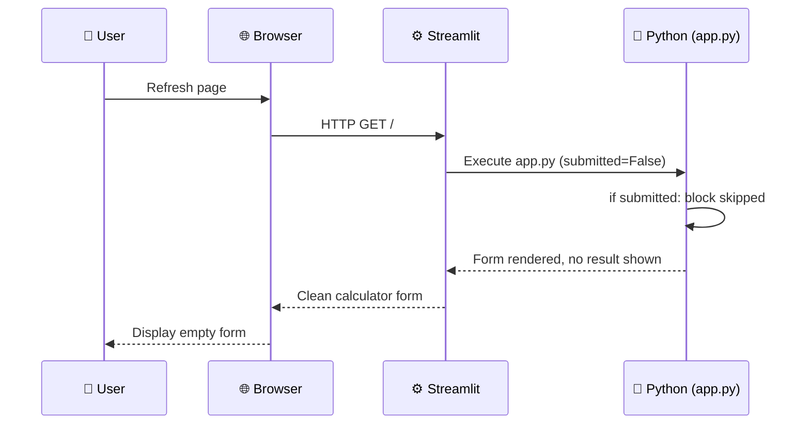

### 6.4 Operation State Machine

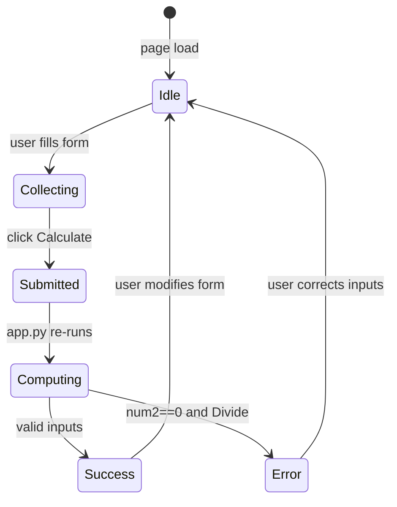

---

## 7. Deployment View

### 7.1 Infrastructure

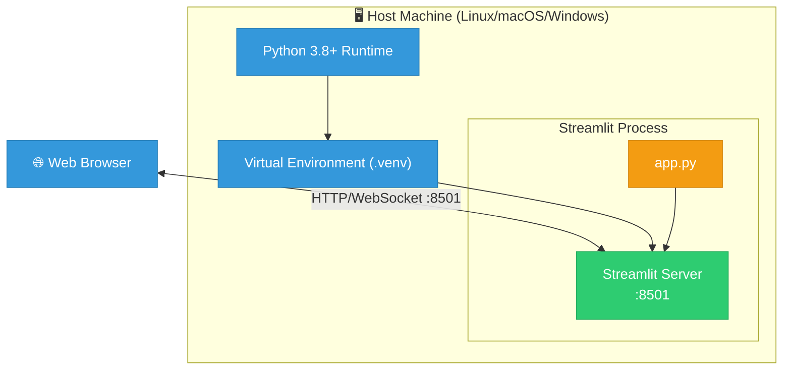

### 7.2 Deployment Steps

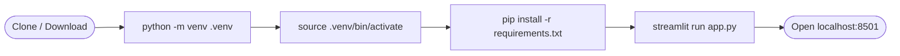

### 7.3 Runtime Requirements

| Component | Minimum Version | Notes |
|---|---|---|
| Python | 3.8 | Type hint and f-string support |
| Streamlit | 1.40.0 | st.form, st.columns API |
| pip | 21.0+ | Modern dependency resolution |
| OS | Linux / macOS / Windows | Any platform supporting Python |
| RAM | ~200 MB | Streamlit server baseline |
| Network | localhost only | No external network required |

---

## 8. Cross-cutting Concepts

### 8.1 Domain Model

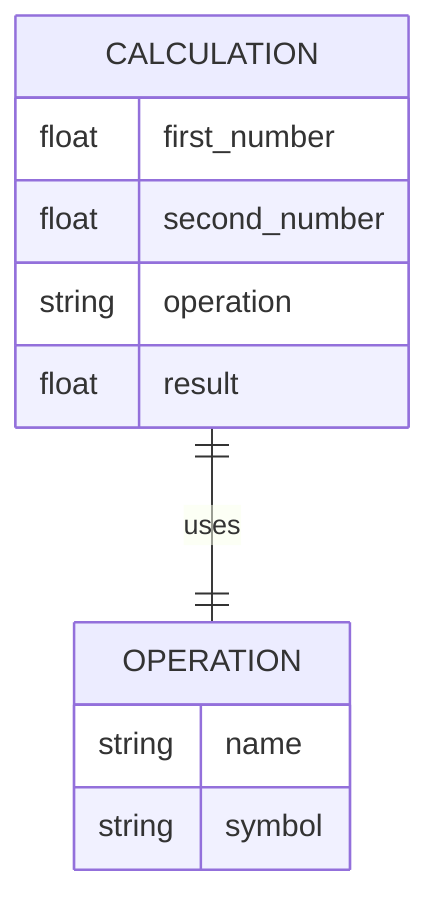

### 8.2 Business Rules

| ID | Rule | Implementation |
|---|---|---|
| BR-01 | Division by zero is not allowed | `if num2 == 0: st.error(); st.stop()` |
| BR-02 | Both inputs default to 0.0 | `st.number_input(value=0.0)` |
| BR-03 | Default operation is Addition | `st.selectbox(index=0)` |
| BR-04 | Input numbers are displayed with 6 decimal places | `st.number_input(format="%.6f")` controls the widget display format |
| BR-05 | All four operations are supported | Add, Subtract, Multiply, Divide |
| BR-06 | Calculation only runs on explicit submission | `if submitted:` guard |

### 8.3 Error Handling

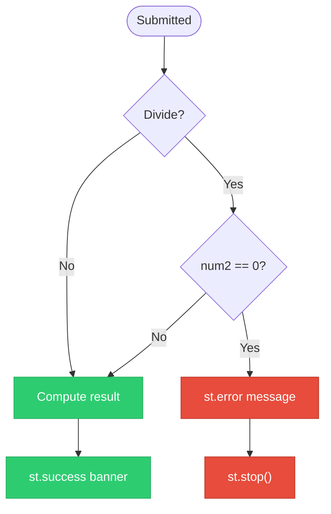

### 8.4 UI/UX Concepts

| Concept | Implementation | Benefit |
|---|---|---|
| Atomic form submission | `st.form` | Prevents partial/incremental re-runs |
| Two-column layout | `st.columns(2)` | Side-by-side number inputs |
| Inline error feedback | `st.error` | Immediate visibility |
| Collapsible details | `st.expander` | Optional verbosity |
| Emoji icons | Page icon 🧮, operation symbols | Friendly, recognizable UI |

### 8.5 Statefulness Model

The application is **effectively stateless**: Streamlit re-executes `app.py` from top to bottom on every user interaction. The only transient state is the form submission flag (`submitted`) within a single script execution cycle. No session persistence, database, or caching is used.

---

## 9. Architecture Decisions

### ADR-001: Use Streamlit as UI Framework

**Status:** Accepted  
**Context:** Need a browser-based UI for a Python calculator with minimal setup.  
**Decision:** Use Streamlit instead of Flask+HTML or Tkinter.  
**Consequences:** (+) Zero HTML/CSS required, rapid development. (-) Limited UI customization, Streamlit-specific paradigm.

### ADR-002: Single-File Architecture

**Status:** Accepted  
**Context:** The application has minimal complexity.  
**Decision:** Keep all logic in `app.py`.  
**Consequences:** (+) Easy to read and modify. (-) Does not scale to complex features without refactoring.

### ADR-003: Use st.form for Input Collection

**Status:** Accepted  
**Context:** Streamlit re-runs the script on every widget change by default.  
**Decision:** Wrap all inputs in `st.form` with a submit button.  
**Consequences:** (+) Calculation only triggers on explicit submit, avoiding partial states. (-) Slightly more verbose code.

### ADR-004: Use Python float for Arithmetic

**Status:** Accepted  
**Context:** Need to choose a numeric type for calculations.  
**Decision:** Use Python's native `float` (IEEE 754 double precision).  
**Consequences:** (+) No additional imports, natural Python arithmetic. (-) Subject to float precision limitations (e.g., 0.1 + 0.2 ≠ 0.3 exactly).

### ADR-005: Use st.stop() for Error Termination

**Status:** Accepted  
**Context:** On division by zero, the result block must not execute.  
**Decision:** Call `st.stop()` after `st.error()` to halt script execution.  
**Consequences:** (+) Clean separation between error and success paths. (-) Any code after `st.stop()` is unreachable in the error branch.

---

## 10. Quality Requirements

### 10.1 Quality Tree

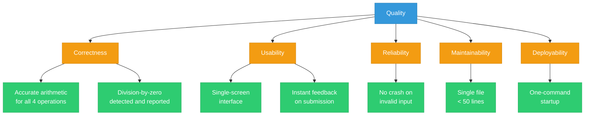

### 10.2 Quality Scenarios

| ID | Quality | Scenario | Stimulus | Response | Metric |
|---|---|---|---|---|---|
| QS-01 | Correctness | Add 0.1 + 0.2 | User submits | Result displayed | IEEE 754 float result |
| QS-02 | Correctness | Divide 10 / 3 | User submits | 3.333333 shown | 6 decimal places |
| QS-03 | Reliability | Divide by zero | num2=0, Divide | Error message, no crash | st.error shown |
| QS-04 | Usability | First visit | Page load | Form displayed immediately | < 2s load time |
| QS-05 | Usability | Submit calculation | Click Calculate | Result visible | Immediate re-render |
| QS-06 | Maintainability | Add new operation | Developer edits | Add elif block | < 5 lines of change |
| QS-07 | Deployability | Fresh environment | pip install + run | App accessible | < 2 minutes setup |

---

## 11. Risks and Technical Debt

### 11.1 Risk Register

| ID | Risk | Probability | Impact | Mitigation |
|---|---|---|---|---|
| R-01 | Float precision errors confuse users | Medium | Low | Display note about float precision; consider `decimal` module |
| R-02 | Streamlit API breaking changes | Low | Medium | Pin exact version; add integration tests |
| R-03 | No input validation beyond zero-check | Medium | Low | Add range checks if extended |
| R-04 | Single-file grows unmaintainable | Low | Medium | Refactor into modules if features added |
| R-05 | No automated tests | High | Medium | Add pytest + streamlit testing utilities |

### 11.2 Technical Debt Backlog

| ID | Item | Effort | Priority |
|---|---|---|---|
| TD-01 | Add unit tests for arithmetic logic | Small | High |
| TD-02 | Extract arithmetic functions to separate module | Small | Medium |
| TD-03 | Add input validation (range, type) | Small | Medium |
| TD-04 | Consider `decimal.Decimal` for precision | Medium | Low |
| TD-05 | Add CI/CD pipeline | Medium | Medium |
| TD-06 | Containerize with Docker | Small | Low |

---

## 12. Glossary

| Term | Definition |
|---|---|
| **Arc42** | Architecture documentation template with 12 standardized sections |
| **ADR** | Architecture Decision Record — documents a key architectural choice |
| **Arithmetic Engine** | The conditional logic block performing the selected operation |
| **Browser** | Client-side web application (Chrome, Firefox, Safari, Edge) |
| **Float** | IEEE 754 double-precision floating-point number (Python `float`) |
| **Form Submission** | User action of clicking "Calculate" to trigger re-execution |
| **IEEE 754** | International standard for floating-point arithmetic |
| **Input Collection** | Streamlit widgets gathering num1, num2, and operation from the user |
| **Mermaid** | Markdown-based diagram syntax for flowcharts, sequence diagrams, etc. |
| **num1 / num2** | Variable names for the first and second operands |
| **Operation** | One of: Add, Subtract, Multiply, Divide |
| **Python** | Programming language (3.8+) used to implement the application |
| **Re-execution** | Streamlit's model of re-running the full script on each interaction |
| **Result Presentation** | The st.success/st.expander block showing calculation output |
| **st.columns** | Streamlit widget for side-by-side layout |
| **st.error** | Streamlit widget displaying a red error banner |
| **st.expander** | Streamlit widget for collapsible content sections |
| **st.form** | Streamlit widget grouping inputs for atomic submission |
| **st.form_submit_button** | Button inside st.form that triggers script re-run |
| **st.number_input** | Streamlit numeric input widget |
| **st.selectbox** | Streamlit dropdown selection widget |
| **st.set_page_config** | Streamlit function to configure page title, icon, layout |
| **st.stop** | Streamlit function halting further script execution |
| **st.success** | Streamlit widget displaying a green success banner |
| **st.write** | Streamlit function for rendering arbitrary data |
| **Stateless** | No persistent state between page loads or interactions |
| **Streamlit** | Open-source Python framework for building data web apps |
| **submitted** | Boolean flag indicating whether the form has been submitted |
| **Virtual Environment** | Isolated Python environment (.venv) for dependency management |
| **WebSocket** | Protocol used by Streamlit for real-time browser-server communication |

---

*Generated with Arc42 template — https://arc42.org*
