# Architecture Documentation (Arc42)

**Project**: Streamlit Calculator App  
**Version**: 1.0.0  
**Date**: 2025-01-01  
**Generated by**: Arc42 Documentation Generator  
**Source analysed**: `app.py`, `requirements.txt`, `README.md`  
**Intended path**: `docs/arc42/arc42-architecture.md`
> ℹ️ **Note for maintainers**: Move this file to `docs/arc42/arc42-architecture.md` after creating the `docs/arc42/` directory (`mkdir -p docs/arc42`).

---

## Table of Contents

1. [Introduction and Goals](#1-introduction-and-goals)
2. [Constraints](#2-constraints)
3. [Context and Scope](#3-context-and-scope)
4. [Solution Strategy](#4-solution-strategy)
5. [Building Block View](#5-building-block-view)
6. [Runtime View](#6-runtime-view)
7. [Deployment View](#7-deployment-view)
8. [Crosscutting Concepts](#8-crosscutting-concepts)
9. [Architecture Decisions](#9-architecture-decisions)
10. [Quality Requirements](#10-quality-requirements)
11. [Risks and Technical Debt](#11-risks-and-technical-debt)
12. [Glossary](#12-glossary)

---

## 1. Introduction and Goals

### 1.1 Purpose and Business Context

The **Streamlit Calculator App** is a lightweight, browser-based arithmetic calculator delivered as a single-page web application. Its purpose is to allow end-users to perform the four fundamental arithmetic operations — addition, subtraction, multiplication, and division — through a clean, form-driven interface without installing any local software beyond a web browser.

The application is intentionally minimal: it solves one well-defined problem (interactive arithmetic) with zero operational complexity, making it an ideal reference implementation for Streamlit-based tooling, internal utilities, or educational demonstrations.

### 1.2 Goals

| # | Goal | Priority |
|---|------|----------|
| G-1 | Provide instant arithmetic results for Add, Subtract, Multiply, Divide | Must |
| G-2 | Present a clean, self-explanatory UI that requires no user documentation | Must |
| G-3 | Guard against invalid input (division by zero) with a clear error message | Must |
| G-4 | Expose computation details on demand (expandable detail panel) | Should |
| G-5 | Run locally with a single command (`streamlit run app.py`) | Must |
| G-6 | Remain dependency-minimal — only Streamlit required | Should |

### 1.3 Quality Goals

| Priority | Quality Attribute | Motivation |
|----------|-------------------|------------|
| 1 | **Correctness** | Arithmetic results must be exact for all valid inputs |
| 2 | **Usability** | Zero-learning-curve UI; result visible without page navigation |
| 3 | **Simplicity / Maintainability** | Single-file codebase — any developer can read and modify in minutes |
| 4 | **Availability** | Runs entirely on localhost; no network dependency for core logic |
| 5 | **Robustness** | Graceful handling of divide-by-zero; no unhandled exceptions surfaced to the user |

### 1.4 Stakeholders

| Role | Expectation |
|------|-------------|
| **End User** | Fast, correct arithmetic results with intuitive UI |
| **Developer / Maintainer** | Simple, readable codebase; easy to extend with new operations |
| **DevOps / Operator** | One-command startup; no database, no external services |
| **Educator / Demonstrator** | Canonical example of a Streamlit form-based application |

---

## 2. Constraints

### 2.1 Technical Constraints

| ID | Constraint | Source |
|----|-----------|--------|
| TC-1 | **Python runtime required** — the application is written in Python 3 and cannot run on non-Python runtimes | `app.py` |
| TC-2 | **Streamlit ≥ 1.40.0** is the sole declared dependency; no other packages are pinned | `requirements.txt` |
| TC-3 | **Single-file architecture** — all logic lives in `app.py`; there is no package structure, no database, and no configuration files | `app.py` |
| TC-4 | **Browser required** — Streamlit renders the UI in a web browser; a headless server-side execution mode is not supported | Streamlit framework |
| TC-5 | **Stateless session** — Streamlit re-runs the entire script on every user interaction; no persistent state between sessions | Streamlit execution model |
| TC-6 | **Floating-point arithmetic** — numbers are handled as Python `float` (IEEE 754 double precision); very large or very small numbers may exhibit standard floating-point rounding behaviour | `app.py` lines 12–14 |

### 2.2 Organisational Constraints

| ID | Constraint | Source |
|----|-----------|--------|
| OC-1 | No CI/CD pipeline is defined; deployment is manual via `streamlit run` | `README.md` |
| OC-2 | No containerisation (Docker/Kubernetes) configuration is present in the repository | Repository root |
| OC-3 | No automated test suite is present | Repository root |
| OC-4 | No authentication or authorisation is implemented; the app is publicly accessible on its bound address/port | `app.py` |

### 2.3 Conventions

| Convention | Detail |
|-----------|--------|
| Language | Python 3 (idiomatic Streamlit scripting style) |
| Formatting | PEP 8 implied; no linter configuration file present |
| Number display | Six decimal places (`format="%.6f"`) for input fields |
| Page layout | `layout="centered"` — single centred column |

---

## 3. Context and Scope

### 3.1 Business Context

The calculator app exists as a **self-contained tool**. It has no upstream data sources, no downstream consumers, and no external service integrations. The only external actor is the human end-user interacting through a browser.

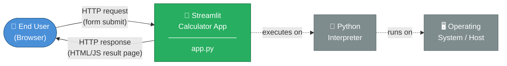

**External interfaces:** None. The application neither reads from nor writes to any external system (no database, no API, no file I/O beyond Streamlit's own asset serving).

### 3.2 Technical Context

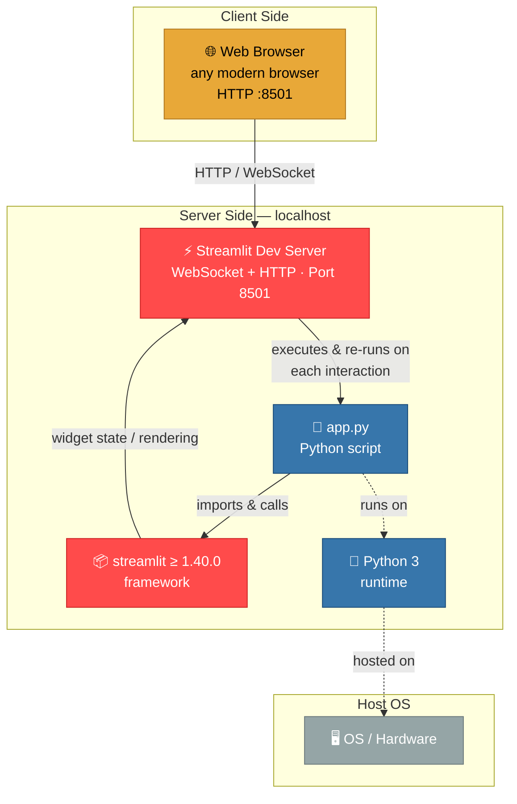

**Channel descriptions:**

| Channel | Protocol | Direction | Description |
|---------|----------|-----------|-------------|
| Browser ↔ Streamlit Server | HTTP + WebSocket | Bidirectional | Initial page load (HTTP), live UI updates (WebSocket) |
| Streamlit Server → `app.py` | In-process function call | Server → Script | Streamlit re-executes the script on every widget event |
| `app.py` → Streamlit lib | Python API calls | Script → Library | `st.number_input`, `st.selectbox`, `st.form_submit_button`, `st.success`, `st.error` |

---

## 4. Solution Strategy

### 4.1 Technology Decisions

| Decision | Choice | Rationale |
|----------|--------|-----------|
| **UI Framework** | Streamlit | Eliminates the need for a separate frontend (HTML/CSS/JS); Python-native; ships a dev server; ideal for data/utility apps |
| **Language** | Python 3 | Streamlit is Python-only; Python's built-in `float` arithmetic is sufficient for a four-function calculator |
| **Architecture style** | Single-file script | Keeps complexity at zero; entire application logic is readable in one sitting; matches Streamlit's scripting mental model |
| **State management** | Streamlit form (`st.form`) | Batches all widget reads into a single submit event, preventing partial-result re-renders on every keystroke |
| **Error handling** | Inline guard + `st.stop()` | Immediately halts script execution after displaying the error; no exceptions propagate to the user |
| **Dependency management** | `requirements.txt` with a minimum-version pin | Simple, universally understood; avoids over-constraining the Streamlit version |

### 4.2 Top-Level Decomposition

The solution is decomposed into three logical concerns, all implemented inline in `app.py`:

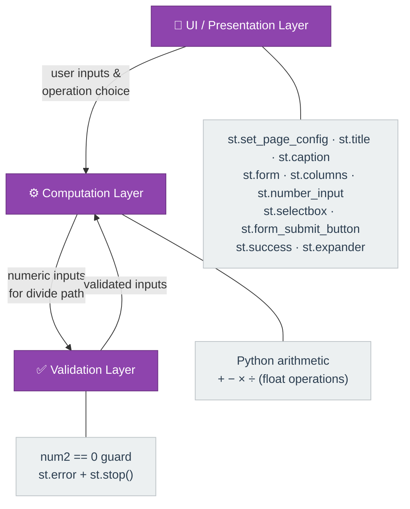

### 4.3 Approach to Quality Goals

| Quality Goal | Approach |
|-------------|----------|
| **Correctness** | Delegate all arithmetic to Python's native `float` operators; no custom maths library |
| **Usability** | Two-column layout for side-by-side inputs; operation dropdown; single "Calculate" button; inline result banner |
| **Simplicity** | No classes, no modules, no configuration — linear procedural script ~50 lines |
| **Robustness** | Explicit divide-by-zero check before division; `st.stop()` prevents result rendering on error |
| **Maintainability** | Adding a new operation requires adding one `elif` branch and one entry in the `selectbox` tuple |

---

## 5. Building Block View

### 5.1 Level 1 — System as a Black Box

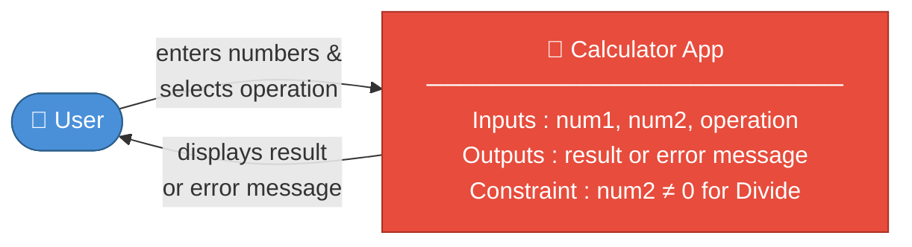

### 5.2 Level 2 — White Box: Internal Building Blocks

All building blocks are collocated in `app.py`. There is no package hierarchy.

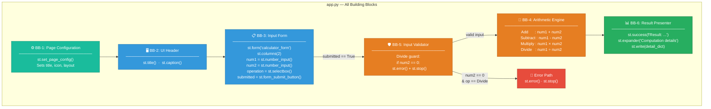

### 5.3 Level 3 — Component Responsibilities

| Building Block | Responsibility | Key Streamlit APIs |
|---------------|---------------|-------------------|
| **BB-1 Page Config** | Sets browser tab title (`Calculator`), favicon (🧮), and centred layout once per session | `st.set_page_config()` |
| **BB-2 UI Header** | Renders the application title and descriptive caption | `st.title()`, `st.caption()` |
| **BB-3 Input Form** | Collects `num1`, `num2` (float, 6 d.p.), and `operation` (one of 4 choices); batches submission | `st.form`, `st.columns`, `st.number_input`, `st.selectbox`, `st.form_submit_button` |
| **BB-4 Arithmetic Engine** | Executes the selected operation using Python native operators; assigns `result` and display `symbol` | Python `+`, `-`, `*`, `/` operators |
| **BB-5 Input Validator** | Guards the Divide path against `num2 == 0`; aborts rendering via `st.stop()` | `st.error()`, `st.stop()` |
| **BB-6 Result Presenter** | Shows a success banner with the full equation and result; provides an expandable detail view | `st.success()`, `st.expander()`, `st.write()` |

### 5.4 Class / Module Diagram

Because the application is a single procedural script (no classes), the diagram shows the logical grouping of code segments within `app.py`:

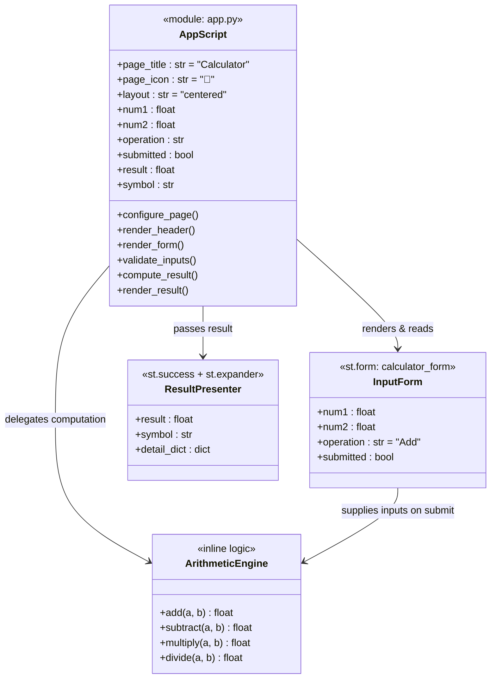

---

## 6. Runtime View

### 6.1 Scenario 1 — Successful Calculation (e.g., Addition)

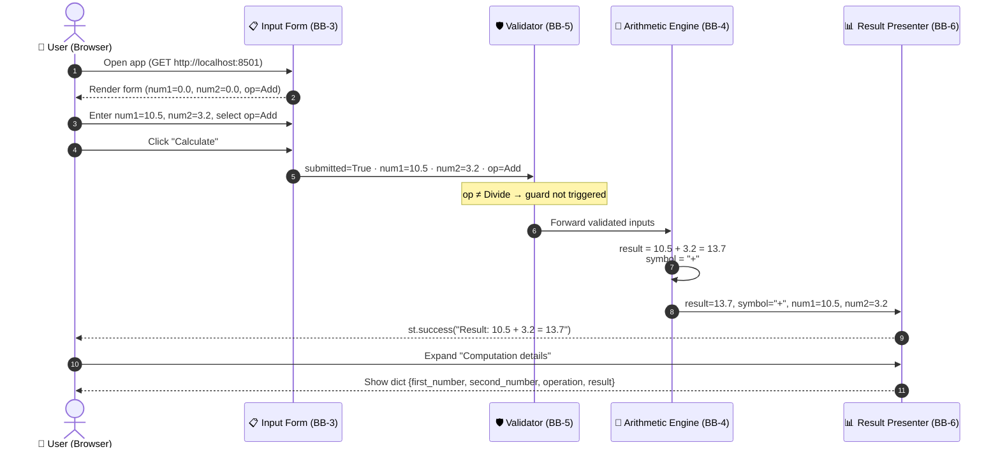

### 6.2 Scenario 2 — Division by Zero (Error Path)

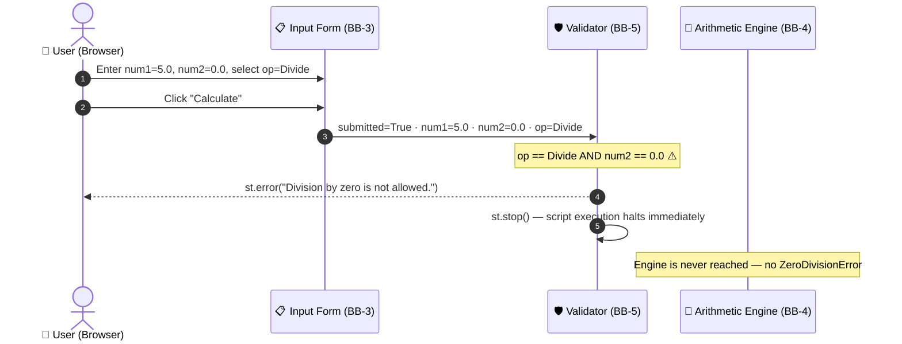

### 6.3 Scenario 3 — Full Streamlit Script Re-Execution Lifecycle

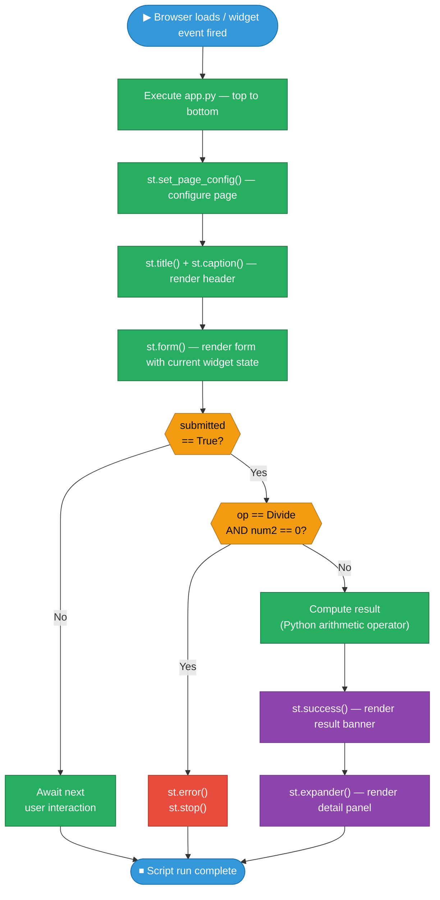

### 6.4 Supported Operations Summary

| Operation | Symbol | Formula | Edge Case Handled |
|-----------|--------|---------|------------------|
| Add | `+` | `result = num1 + num2` | — |
| Subtract | `−` | `result = num1 - num2` | — |
| Multiply | `×` | `result = num1 * num2` | — |
| Divide | `÷` | `result = num1 / num2` | `num2 == 0` → error + stop |

---

## 7. Deployment View

### 7.1 Deployment Topology

The application is a **single-tier, localhost deployment**. All components (Streamlit server, Python runtime, application script) run on the same machine. No containerisation, reverse proxy, or cloud infrastructure is currently defined.

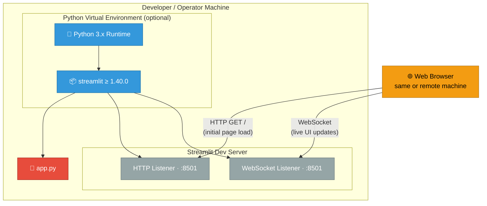

### 7.2 Deployment Steps

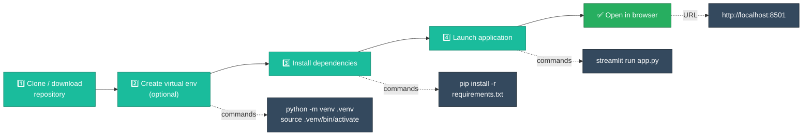

### 7.3 Infrastructure Requirements

| Requirement | Minimum | Notes |
|------------|---------|-------|
| Python | 3.8+ | Streamlit 1.40.0 minimum requirement |
| Streamlit | ≥ 1.40.0 | Only declared dependency |
| RAM | ~100 MB | Streamlit server idle footprint |
| Disk | ~50 MB | Python + Streamlit package install |
| Network port | TCP 8501 | Streamlit default; configurable via `--server.port` |
| Internet | Not required at runtime | All assets served locally after `pip install` |

### 7.4 Configuration Options

Streamlit can be configured without code changes via CLI flags or a `~/.streamlit/config.toml` file:

| Parameter | Default | Override |
|----------|---------|----------|
| Port | `8501` | `streamlit run app.py --server.port 8080` |
| Browser auto-open | `true` | `--server.headless true` |
| Address binding | `localhost` | `--server.address 0.0.0.0` |
| Theme | Light | `~/.streamlit/config.toml` `[theme]` section |

---

## 8. Crosscutting Concepts

### 8.1 Domain Model

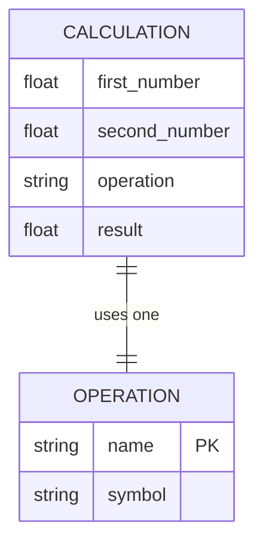

**Supported OPERATION values:**

| name | symbol | formula |
|------|--------|---------|
| Add | `+` | `a + b` |
| Subtract | `−` | `a - b` |
| Multiply | `×` | `a * b` |
| Divide | `÷` | `a / b` (b ≠ 0) |

### 8.2 State Management Concept

Streamlit uses a **reactive, stateless scripting model**: the entire `app.py` script is re-executed from top to bottom on every user interaction. State is not persisted between executions unless `st.session_state` is explicitly used (it is **not** used in this application).

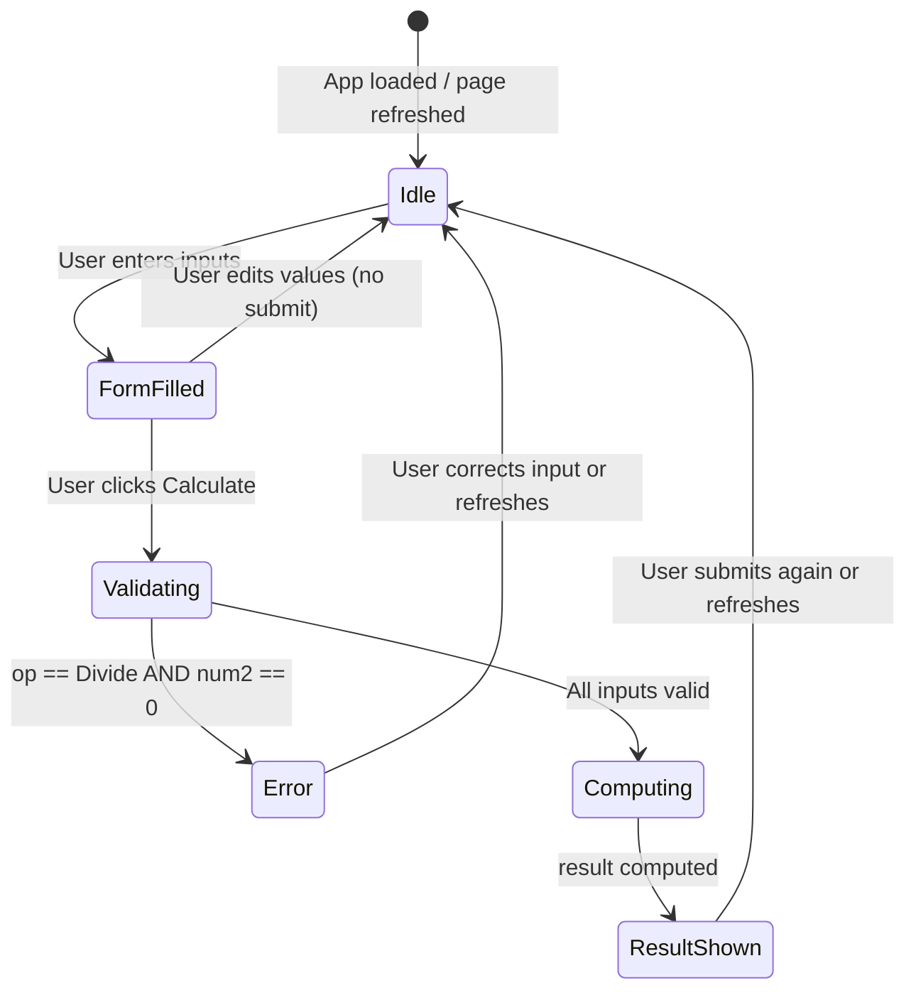

**Key implication:** Every "Calculate" click is a completely independent, stateless computation. There is no history, undo, or accumulated state within the application itself.

### 8.3 Error Handling Strategy

| Error Condition | Detection Point | Handling Mechanism | User Feedback |
|----------------|----------------|-------------------|---------------|
| Division by zero | BB-5 Validator, before arithmetic | `st.error()` + `st.stop()` | Red error banner: *"Division by zero is not allowed."* |
| Invalid number format | `st.number_input` widget | Built-in widget validation (rejects non-numeric input) | Browser-native input constraint |
| Unexpected Python exceptions | Not explicitly caught | Streamlit catches unhandled exceptions and renders a red traceback panel | Streamlit default error UI |

### 8.4 Number Representation

All numeric values are represented as IEEE 754 double-precision floating-point (`float64`). Input fields use `format="%.6f"` for display (6 decimal places). This is sufficient for everyday arithmetic but introduces standard floating-point precision limitations for very large/small numbers or repeating decimals.

### 8.5 UI/UX Patterns

| Pattern | Implementation |
|---------|---------------|
| **Form batching** | `st.form` prevents partial re-renders during input; result only updates on explicit submit |
| **Two-column layout** | `st.columns(2)` places `num1` and `num2` side by side for natural left-to-right reading |
| **Progressive disclosure** | Raw computation details hidden in `st.expander`; advanced users can inspect; novices are not overwhelmed |
| **Inline feedback** | `st.success` / `st.error` banners appear directly below the form; no page navigation required |

### 8.6 Business Rules

| Rule ID | Rule | Implementation |
|---------|------|---------------|
| BR-1 | Division by zero is undefined and must be rejected | `if num2 == 0: st.error(...); st.stop()` |
| BR-2 | Exactly one operation is performed per form submission | Single `if/elif/elif/else` block; mutually exclusive branches |
| BR-3 | Both input numbers default to `0.0` | `st.number_input(..., value=0.0)` |
| BR-4 | The default operation is Add | `st.selectbox(..., index=0)` where `"Add"` is first in the tuple |
| BR-5 | Results are displayed with full float precision (Python default) | `f"Result: {num1} {symbol} {num2} = {result}"` — no explicit rounding applied |

---

## 9. Architecture Decisions

### ADR-001: Use Streamlit as the Sole UI and Server Framework

| Field | Detail |
|-------|--------|
| **Status** | Accepted |
| **Date** | Project inception |
| **Context** | A simple arithmetic calculator needs a UI. Options: (a) pure Python CLI, (b) Flask/FastAPI + HTML frontend, (c) Streamlit |
| **Decision** | Use Streamlit exclusively |
| **Rationale** | Streamlit eliminates frontend code entirely; ships its own dev server; provides form, input, and feedback widgets out-of-the-box; a calculator is exactly the kind of utility app Streamlit is designed for |
| **Consequences — Positive** | Zero HTML/CSS/JS; one dependency; Python-only codebase |
| **Consequences — Negative** | Stateless re-run model requires `st.form` to avoid partial updates; not suitable for high-concurrency production workloads without additional deployment infrastructure |

---

### ADR-002: Single-File Architecture (`app.py`)

| Field | Detail |
|-------|--------|
| **Status** | Accepted |
| **Date** | Project inception |
| **Context** | The application logic is ~50 lines. Separating it into modules, packages, or layers would add structural overhead with no tangible benefit |
| **Decision** | All logic in a single `app.py` file |
| **Rationale** | Maximises readability and minimises onboarding friction; consistent with Streamlit's own tutorials and examples |
| **Consequences — Positive** | Trivial to read, copy, and run; no import graph complexity |
| **Consequences — Negative** | Will need refactoring if the application grows beyond ~5 operations or adds persistence, authentication, or multi-page routing |

---

### ADR-003: Use `st.form` to Batch Widget State

| Field | Detail |
|-------|--------|
| **Status** | Accepted |
| **Date** | Project inception |
| **Context** | Without `st.form`, Streamlit re-runs the script on every individual widget change (e.g., each keystroke), causing premature or flickering result displays |
| **Decision** | Wrap all inputs and the submit button in `st.form("calculator_form")` |
| **Rationale** | Ensures the arithmetic engine only runs when the user explicitly submits; provides a predictable, form-like UX identical to a traditional HTML form |
| **Consequences — Positive** | Clean UX — result only updates on deliberate submit; eliminates intermediate result flicker |
| **Consequences — Negative** | None for this use case |

---

### ADR-004: Inline Division-by-Zero Guard with `st.stop()`

| Field | Detail |
|-------|--------|
| **Status** | Accepted |
| **Date** | Project inception |
| **Context** | Python raises `ZeroDivisionError` for `x / 0`. This must not propagate as an unhandled exception visible to the user |
| **Decision** | Check `num2 == 0` before division; call `st.error()` then `st.stop()` |
| **Rationale** | `st.stop()` immediately halts further script execution, preventing the result block from rendering; `st.error()` provides a clear, user-friendly message |
| **Consequences — Positive** | Clean error UX; no exception traceback visible to the user |
| **Consequences — Negative** | `num2 == 0.0` is an exact float comparison, which is safe here because the value comes directly from `st.number_input` with no intermediate computation |

---

### ADR-005: Minimum-Version Pin for Streamlit (`>=1.40.0`)

| Field | Detail |
|-------|--------|
| **Status** | Accepted |
| **Date** | Project inception |
| **Context** | The dependency must be constrained to ensure API compatibility, but over-constraining blocks security patches and minor updates |
| **Decision** | Pin `streamlit>=1.40.0` with no upper bound |
| **Rationale** | Streamlit 1.40.0 introduced stable versions of all APIs used. A minimum-only pin allows automatic minor/patch upgrades |
| **Consequences — Positive** | Easy to keep up to date; no manual version bumps for patch releases |
| **Consequences — Negative** | A future Streamlit major version could theoretically break APIs (mitigated by Streamlit's strong backwards-compatibility policy) |

---

## 10. Quality Requirements

### 10.1 Quality Tree

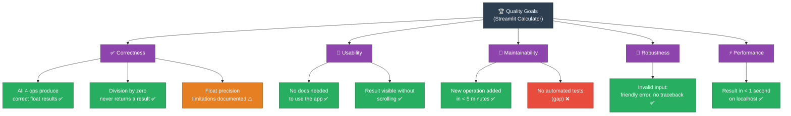

### 10.2 Quality Scenarios

| ID | Quality Attribute | Stimulus | Response | Metric | Status |
|----|-----------------|----------|----------|--------|--------|
| QS-1 | Correctness | User adds 10.5 + 3.2 | Displays 13.7 | Matches Python `float` addition | ✅ Met |
| QS-2 | Robustness | User divides by zero | Displays error banner; no result rendered | No `ZeroDivisionError` traceback | ✅ Met |
| QS-3 | Usability | First-time user opens the app | Completes a calculation without help | 0 support interactions needed | ✅ Met |
| QS-4 | Performance | User clicks Calculate | Result appears | < 500 ms on localhost | ✅ Met |
| QS-5 | Maintainability | Developer adds "Modulo" operation | Code change | ≤ 2 lines changed | ✅ Achievable |
| QS-6 | Correctness | User multiplies 0.1 × 0.1 | Displays `0.010000000000000002` | Standard IEEE 754 behaviour — no rounding applied | ⚠️ Known limitation |

### 10.3 Code Metrics

| Metric | Value | Assessment |
|--------|-------|-----------|
| Lines of code (`app.py`) | 49 | ✅ Minimal |
| Cyclomatic complexity | 5 (4 operation branches + 1 divide guard) | ✅ Low |
| Number of dependencies | 1 (`streamlit`) | ✅ Excellent |
| Number of external API calls | 0 | ✅ No external coupling |
| Test coverage | 0% (no test suite) | ⚠️ Gap |
| Documentation coverage | README + Arc42 document | ✅ Adequate for scope |

---

## 11. Risks and Technical Debt

### 11.1 Risk Register

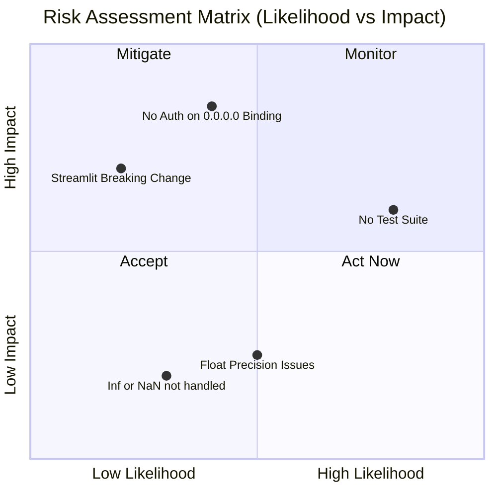

### 11.2 Identified Risks

| ID | Risk | Likelihood | Impact | Mitigation |
|----|------|-----------|--------|-----------|
| R-1 | **No automated test suite** — regressions in arithmetic logic or error handling cannot be automatically detected | High | Medium | Add `pytest` unit tests covering all four operations and the divide-by-zero guard |
| R-2 | **Floating-point precision surprises** — IEEE 754 double precision may produce unexpected results (e.g., `0.1 + 0.2 ≠ 0.3`) | Medium | Low | Add optional rounding or display note; consider `decimal.Decimal` for exact arithmetic |
| R-3 | **Streamlit breaking API change** — a future major version could deprecate used APIs | Low | High | Monitor release notes; add upper bound (`<2.0.0`) once Streamlit v2 is released |
| R-4 | **Public exposure on `0.0.0.0`** — running with `--server.address 0.0.0.0` exposes the app on all interfaces without authentication | Medium | High | Document that production deployments beyond localhost must use a reverse proxy with authentication |
| R-5 | **`float('inf')` / `float('nan')` inputs** — not explicitly guarded; could produce confusing results | Medium | Low | Add `math.isinf()` / `math.isnan()` guards around the result |

### 11.3 Technical Debt Items

| ID | Debt Item | Effort | Priority |
|----|-----------|--------|----------|
| TD-1 | **No unit tests** — arithmetic logic, error paths, and UI interactions are untested | Small (2–4 h) | **High** |
| TD-2 | **No CI/CD pipeline** — no automated build, test, or deployment workflow | Small (2–4 h) | **Medium** |
| TD-3 | **No containerisation** — no `Dockerfile`; deployment is entirely manual | Small (1–2 h) | **Medium** |
| TD-4 | **No type annotations** — variables lack Python type hints, reducing IDE support | Trivial (< 1 h) | Low |
| TD-5 | **No linter / formatter config** (`ruff.toml`, `.flake8`, `pyproject.toml`) | Trivial (< 30 min) | Low |
| TD-6 | **Hardcoded operation list** — adding a new operation requires modifying two code locations; a data-driven approach would scale better | Medium (2–3 h) | Low |

### 11.4 Recommended Improvements (Prioritised)

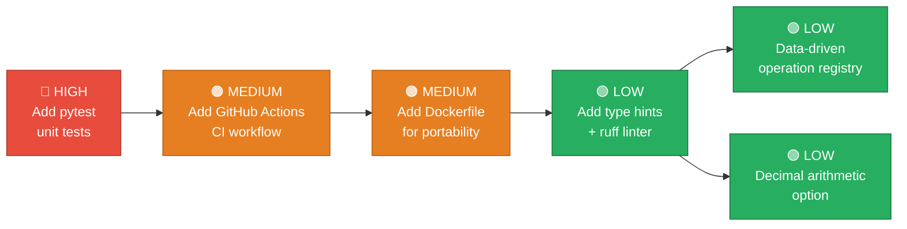

| Priority | Improvement | Benefit |
|----------|------------|---------|
| 🔴 High | Add `tests/test_calculator.py` with `pytest` | Prevents regressions; enables safe refactoring |
| 🟠 Medium | Add GitHub Actions workflow (lint + test on push/PR) | Automated quality gate |
| 🟠 Medium | Add `Dockerfile` and `docker-compose.yml` | Reproducible, portable deployment |
| 🟢 Low | Add Python type hints + `ruff` linter configuration | Better IDE support; enforces style |
| 🟢 Low | Refactor operations into a `{name: (symbol, fn)}` dict | Reduces duplication; easier to extend |
| 🟢 Low | Add `decimal.Decimal` mode for exact arithmetic | Eliminates float precision surprises |

---

## 12. Glossary

| Term | Definition |
|------|-----------|
| **Arc42** | A template for documenting and communicating software architectures, consisting of 12 standardised sections |
| **Arithmetic Engine** | The section of `app.py` (lines 25–39) that applies the selected mathematical operator to the two input numbers |
| **BB-n** | Building Block n — a logical grouping of code within `app.py` identified in Section 5 of this document |
| **Divide-by-Zero Guard** | The explicit `if num2 == 0` check in the Divide branch that prevents a Python `ZeroDivisionError` and displays a user-friendly error |
| **`float`** | Python's double-precision floating-point number type (IEEE 754); the data type used for all numeric inputs and results |
| **Form batching** | Streamlit's `st.form` mechanism that collects all widget values and submits them together on a single button click, preventing premature script re-execution |
| **IEEE 754** | The international standard for floating-point arithmetic; defines the precision and rounding behaviour of `float` values |
| **`num1` / `num2`** | The two operands of the arithmetic calculation, both of type `float`, collected from `st.number_input` widgets |
| **Operation** | One of the four supported arithmetic functions: Add (`+`), Subtract (`−`), Multiply (`×`), Divide (`÷`) |
| **`result`** | The computed float value of the arithmetic operation; only assigned and displayed when both inputs are valid and the form is submitted |
| **Streamlit** | An open-source Python framework for building interactive web applications as pure Python scripts; handles UI rendering, state, and serving |
| **Streamlit Dev Server** | The built-in HTTP + WebSocket server started by `streamlit run`; listens on port 8501 by default |
| **`st.error()`** | Streamlit API that renders a red error banner in the browser |
| **`st.expander()`** | Streamlit API that creates a collapsible section; used here to show computation details on demand |
| **`st.form()`** | Streamlit API that groups widgets and a submit button; defers script re-execution until the button is clicked |
| **`st.stop()`** | Streamlit API that immediately halts the current script execution; used after `st.error()` to prevent further rendering |
| **`st.success()`** | Streamlit API that renders a green success banner; used to display the arithmetic result |
| **`submitted`** | Boolean flag returned by `st.form_submit_button()`; `True` only when the user clicks "Calculate" |
| **Symbol** | The display character representing the chosen operation in the result string: `+`, `-`, `×`, or `÷` |
| **Virtual Environment (venv)** | An isolated Python environment (created with `python -m venv`) used to install project dependencies without affecting the system Python installation |
| **WebSocket** | A full-duplex communication protocol over a single TCP connection; used by Streamlit to push UI state updates from server to browser |

---

*This document was generated by the **Arc42 Documentation Generator** based on direct source-code analysis of `app.py`, `requirements.txt`, and `README.md`.*  
*Arc42 template version: v8 | Diagram format: Mermaid | Encoding: UTF-8*

> **To place at the intended path**, run:
> ```bash
> mkdir -p docs/arc42
> mv arc42-architecture.md docs/arc42/arc42-architecture.md
> ```
