# Architecture Documentation (Arc42)

**Project**: Streamlit Calculator App  
**Version**: 1.0.0  
**Date**: 2025-01-01  
**Generated by**: Arc42 Documentation Generator  
**Source Repository**: `github-copilot-test`  
**Canonical path**: `docs/arc42/arc42-documentation.md`

---

## Table of Contents

1. [Introduction and Goals](#1-introduction-and-goals)
2. [Architecture Constraints](#2-architecture-constraints)
3. [System Scope and Context](#3-system-scope-and-context)
4. [Solution Strategy](#4-solution-strategy)
5. [Building Block View](#5-building-block-view)
6. [Runtime View](#6-runtime-view)
7. [Deployment View](#7-deployment-view)
8. [Crosscutting Concepts](#8-crosscutting-concepts)
9. [Architecture Decisions](#9-architecture-decisions)
10. [Quality Requirements](#10-quality-requirements)
11. [Risks and Technical Debt](#11-risks-and-technical-debt)
12. [Glossary](#12-glossary)

---

## 1. Introduction and Goals

### 1.1 Purpose and Background

The **Streamlit Calculator App** is a lightweight, browser-based arithmetic calculator built with Python and the [Streamlit](https://streamlit.io) framework. It provides end users with a clean, minimal web interface to perform the four fundamental arithmetic operations — addition, subtraction, multiplication, and division — without requiring any installation, login, or persistent storage.

The application is designed with primary goals of **simplicity**, **immediate usability**, and **zero infrastructure overhead**. It is suited as a reference implementation, a teaching tool, or a quick-access utility for everyday arithmetic tasks.

### 1.2 Functional Requirements

| ID | Requirement | Description |
|----|-------------|-------------|
| FR-01 | Addition | Add two floating-point numbers |
| FR-02 | Subtraction | Subtract the second number from the first |
| FR-03 | Multiplication | Multiply two floating-point numbers |
| FR-04 | Division | Divide the first number by the second; guard against division by zero |
| FR-05 | Result Display | Show the full arithmetic expression and computed result on form submission |
| FR-06 | Computation Details | Expand a detail panel showing all operands, operation, and result as a structured dict |

### 1.3 Quality Goals

The following top-level quality goals drive architectural decisions (ordered by priority):

| Priority | Quality Goal | Motivation |
|----------|-------------|------------|
| 1 | **Simplicity** | Entire application lives in a single Python file; onboarding takes minutes |
| 2 | **Usability** | Centered layout, clear labels, and inline error messages provide an intuitive UX |
| 3 | **Correctness** | Guard clauses prevent invalid operations from producing silent errors |
| 4 | **Maintainability** | Minimal dependencies (`streamlit>=1.40.0`) reduce upgrade friction |
| 5 | **Portability** | Runs on any OS with Python 3.8+; deployable to Streamlit Community Cloud with zero code changes |

### 1.4 Stakeholders

| Stakeholder | Role | Expectations |
|-------------|------|-------------|
| **End User** | Operates the calculator via the browser | Fast, error-free arithmetic; clear feedback on invalid inputs |
| **Developer / Maintainer** | Extends or adapts the application | Clean, readable code; minimal dependency surface; easy local setup |
| **DevOps / Deployer** | Runs the application on a server or cloud platform | Simple startup command; no database or secrets required |
| **Educator / Demonstrator** | Uses the app as a Streamlit tutorial or live demo | Well-structured, easy-to-follow source code that illustrates Streamlit patterns |

---

## 2. Architecture Constraints

### 2.1 Technical Constraints

| ID | Constraint | Rationale |
|----|-----------|-----------|
| TC-01 | **Python ≥ 3.8** | Required by Streamlit 1.40.x; standard in all modern environments |
| TC-02 | **Streamlit ≥ 1.40.0** | Only external runtime dependency; provides all UI primitives used in the app |
| TC-03 | **Single-file application** | All logic resides in `app.py`; no package structure is required or present |
| TC-04 | **No persistent storage** | Computation results are not saved; every page load starts fresh |
| TC-05 | **No authentication layer** | Application is designed to be publicly accessible without login |
| TC-06 | **Browser-based UI only** | No CLI, REST API, or mobile native interface is provided |
| TC-07 | **Stateless server** | Streamlit re-runs the entire script on each interaction; no global mutable state is used |

### 2.2 Organizational Constraints

| ID | Constraint | Rationale |
|----|-----------|-----------|
| OC-01 | **Minimal dependency footprint** | Only one package in `requirements.txt`; reduces supply-chain and maintenance risk |
| OC-02 | **No build or CI pipeline required** | Application is interpreted Python; `streamlit run app.py` is the complete deployment procedure |
| OC-03 | **Virtual environment recommended** | `README.md` recommends `.venv` for isolation but does not mandate it |

### 2.3 Conventions

| Convention | Details |
|-----------|---------|
| Code style | PEP 8 (implicit Python standard) |
| Number precision | Inputs formatted to 6 decimal places (`%.6f`) |
| Error messaging | `st.error()` for user-facing errors; `st.stop()` to halt execution and prevent partial result display |
| Operation naming | Plain English labels: `"Add"`, `"Subtract"`, `"Multiply"`, `"Divide"` |
| Result symbol | Unicode math symbols in output string: `+`, `−`, `×`, `÷` |

---

## 3. System Scope and Context

### 3.1 Business Context

The Streamlit Calculator App is a **self-contained, single-tier web application**. It has no integration points with external systems, databases, APIs, or message queues. The system boundary encompasses only the Streamlit server process and the end user's web browser.

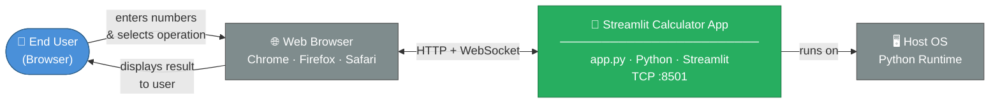

**External actors and interfaces:**

| Actor / System | Type | Interaction |
|---------------|------|-------------|
| **End User** | Human | Provides numeric inputs and operation selection via browser form; receives formatted result |
| **Web Browser** | Client runtime | Renders Streamlit's React-based frontend; communicates with server via HTTP and WebSocket |
| **Host OS / Python Runtime** | Execution environment | Executes `app.py`; no OS-level services (DB, message broker, filesystem) are consumed |

> **Note**: There are no external APIs, third-party services, file-system reads/writes, or outbound network calls made by the application.

### 3.2 Technical Context

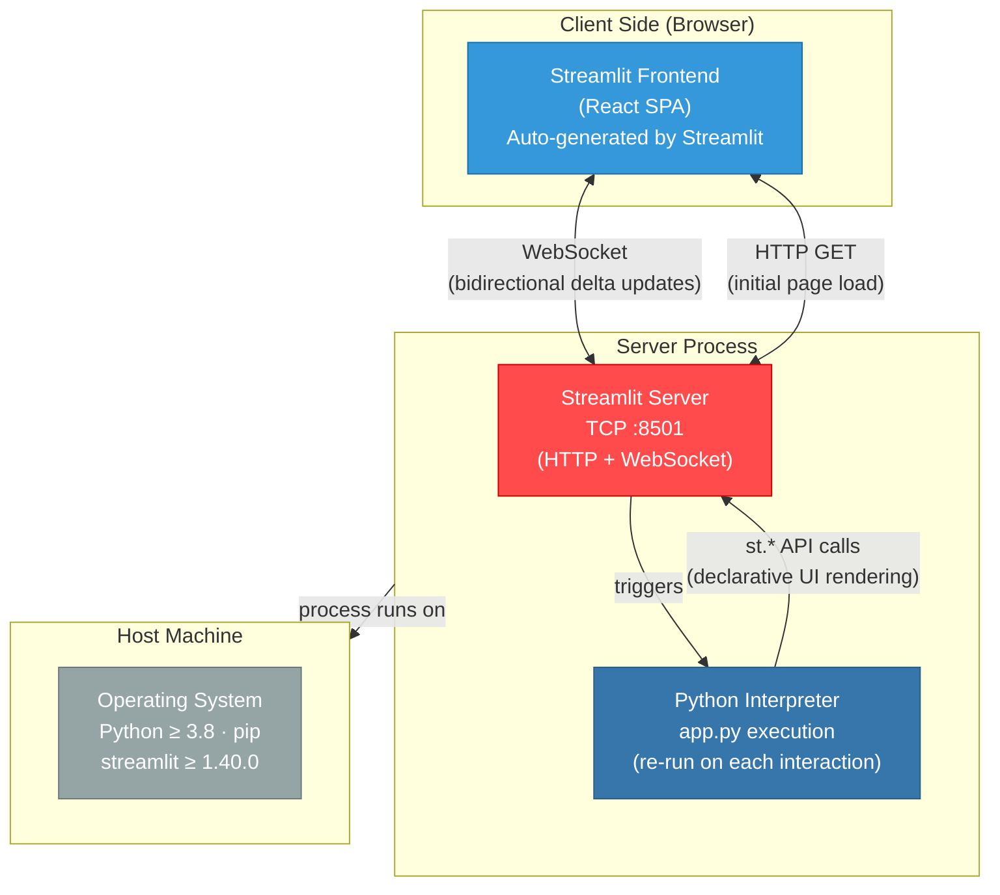

**Technical interfaces:**

| Interface | Protocol | Direction | Description |
|-----------|----------|-----------|-------------|
| Browser ↔ Streamlit Server | HTTP | Client → Server | Initial page load and asset delivery |
| Browser ↔ Streamlit Server | WebSocket | Bidirectional | Subsequent UI interactions and server-pushed render updates |
| `app.py` → Streamlit API | Python function calls | One-way (declarative) | `st.*` calls define the UI on each full script re-run |

---

## 4. Solution Strategy

### 4.1 Technology Decisions

| Decision | Choice | Rationale |
|----------|--------|-----------|
| **UI Framework** | Streamlit ≥ 1.40.0 | Eliminates all HTML/CSS/JS; Python-native reactive UI; built-in form, column, and widget primitives |
| **Language** | Python 3 | Ubiquitous for tooling/data apps; native IEEE 754 float arithmetic; zero additional libraries needed for math |
| **Deployment model** | Single process, no container | App complexity does not justify containerization; `streamlit run app.py` is fully sufficient |
| **State management** | Stateless (Streamlit re-run model) | Each interaction triggers a full script re-run; no session persistence is required for a calculator |
| **Dependency management** | `pip` + `requirements.txt` | Standard, zero-config approach for a one-dependency project |
| **Error strategy** | Fail-fast with `st.stop()` | Surfaces errors immediately and prevents any partial results from being rendered |

### 4.2 Top-Level Decomposition Strategy

The application follows a **single-module, linear-flow** architecture — the simplest structure satisfying all requirements:

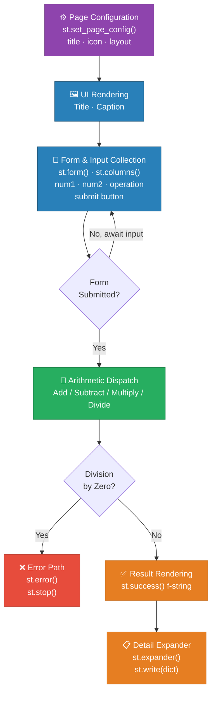

### 4.3 Approaches to Quality Goals

| Quality Goal | Architectural Approach |
|-------------|----------------------|
| **Simplicity** | All logic in ~50 lines of `app.py`; no classes, no sub-modules, no config files beyond `requirements.txt` |
| **Usability** | Two-column input layout separates operands visually; form-based submission batches inputs; color-coded feedback |
| **Correctness** | Explicit pre-condition guard (`num2 == 0`) before division; `st.stop()` prevents result rendering on error |
| **Maintainability** | Single dependency pin; script is self-documenting via meaningful variable names and clear conditionals |
| **Portability** | Compatible with Streamlit Community Cloud, Docker, or any Python-capable server without any code changes |

---

## 5. Building Block View

### 5.1 Level 1 — System Overview

At the highest level, the system is a single deployable unit with three logical zones: **configuration**, **user interface**, and **computation logic**.

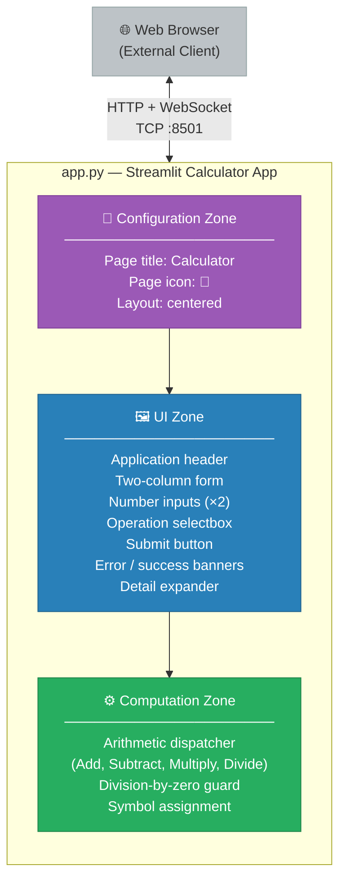

### 5.2 Level 2 — Component Breakdown

`app.py` is decomposed into five logical components, each mapping to a distinct code region within the file:

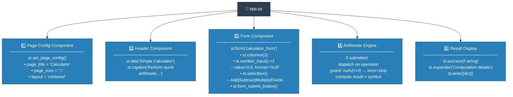

**Component responsibilities:**

| # | Component | Responsibility | Key Streamlit API Used |
|---|-----------|---------------|----------------------|
| 1 | **Page Config** | Sets browser tab title, favicon emoji, and page layout mode | `st.set_page_config()` |
| 2 | **Header** | Renders application title and descriptive subtitle | `st.title()`, `st.caption()` |
| 3 | **Form** | Collects user inputs atomically; prevents premature re-runs on partial edits | `st.form()`, `st.columns()`, `st.number_input()`, `st.selectbox()`, `st.form_submit_button()` |
| 4 | **Arithmetic Engine** | Dispatches selected calculation; guards against division by zero | Pure Python operators + `st.error()`, `st.stop()` |
| 5 | **Result Display** | Renders formatted result string and expandable computation detail dict | `st.success()`, `st.expander()`, `st.write()` |

### 5.3 Level 3 — Data Flow and Variable Lifecycle

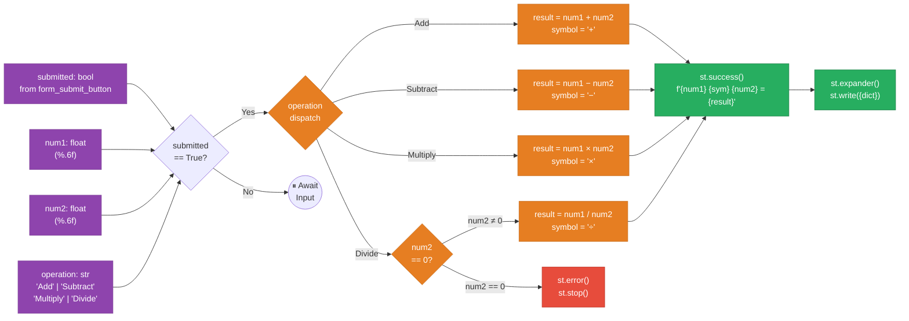

---

## 6. Runtime View

### 6.1 Scenario 1 — Successful Arithmetic Calculation (Happy Path)

This scenario covers the normal flow: the user fills in two numbers, selects an operation, and submits the form to receive a result.

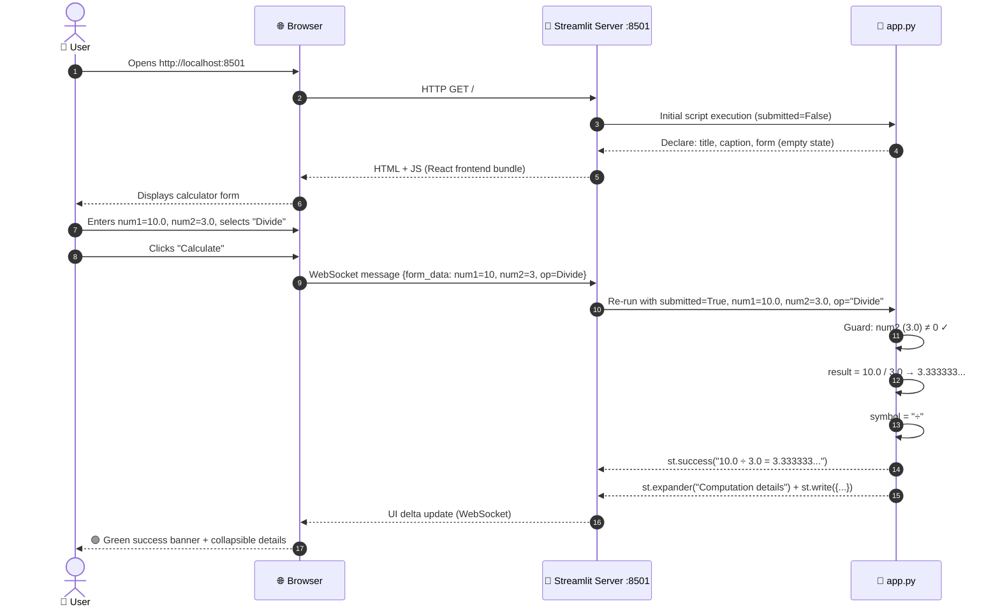

### 6.2 Scenario 2 — Division by Zero (Error Path)

This scenario covers the guard clause that prevents undefined mathematical operations.

```mermaid
sequenceDiagram
    autonumber
    actor User as 👤 User
    participant Browser as 🌐 Browser
    participant ST as 🔴 Streamlit Server :8501
    participant Script as 🐍 app.py

    User->>Browser: Enters num1=5.0, num2=0.0, selects "Divide"
    User->>Browser: Clicks "Calculate"
    Browser->>ST: WebSocket message {num1=5, num2=0, op=Divide}
    ST->>Script: Re-run with submitted=True, num1=5.0, num2=0.0, op="Divide"
    Script->>Script: Guard: num2 == 0 → ERROR condition detected
    Script-->>ST: st.error("Division by zero is not allowed.")
    Script-->>ST: st.stop() — halt all further rendering
    Note over Script: No result, no expander rendered
    ST-->>Browser: UI delta: error banner only
    Browser-->>User: 🔴 Red error message; no result shown
```

### 6.3 Streamlit Script Re-Run Lifecycle

Streamlit's reactive execution model is a key architectural concept. The entire `app.py` script re-runs from top to bottom on every user interaction:

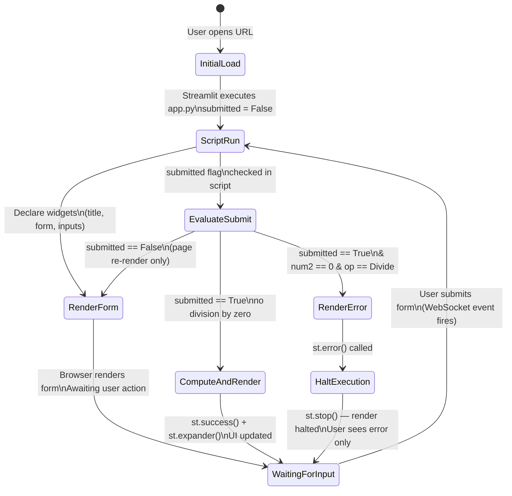

### 6.4 All-Operations Computation Flowchart

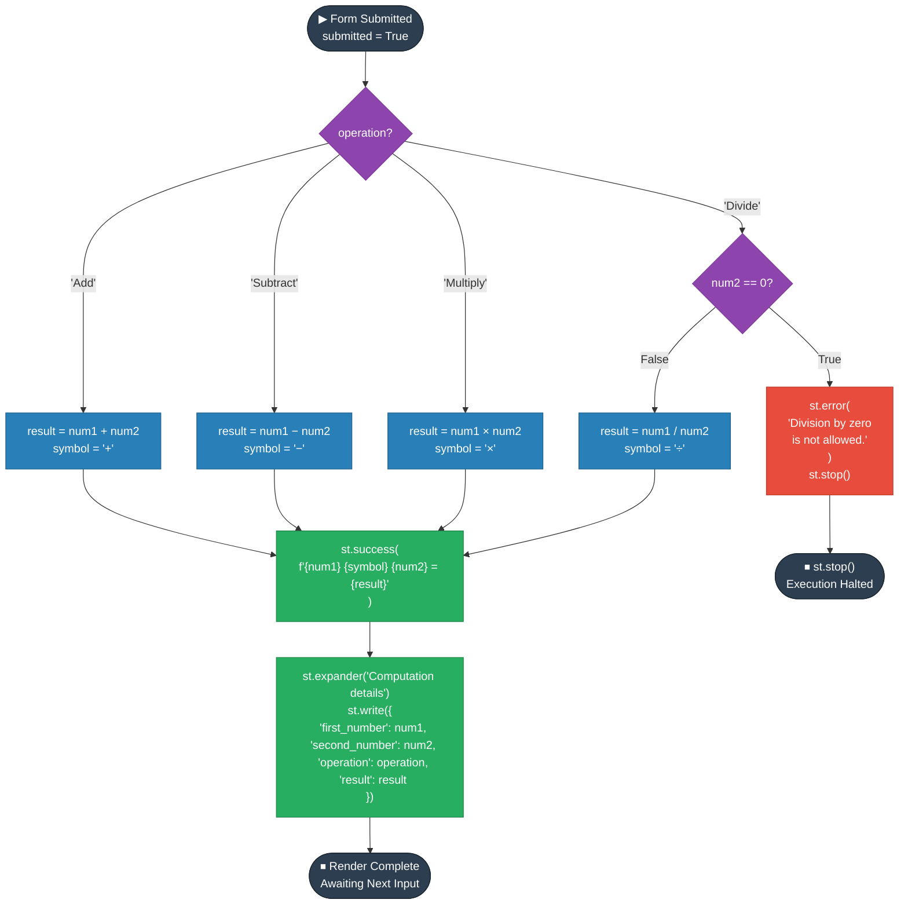

---

## 7. Deployment View

### 7.1 Infrastructure Overview

The application requires no infrastructure beyond a host with Python installed. The topology is minimal by design.

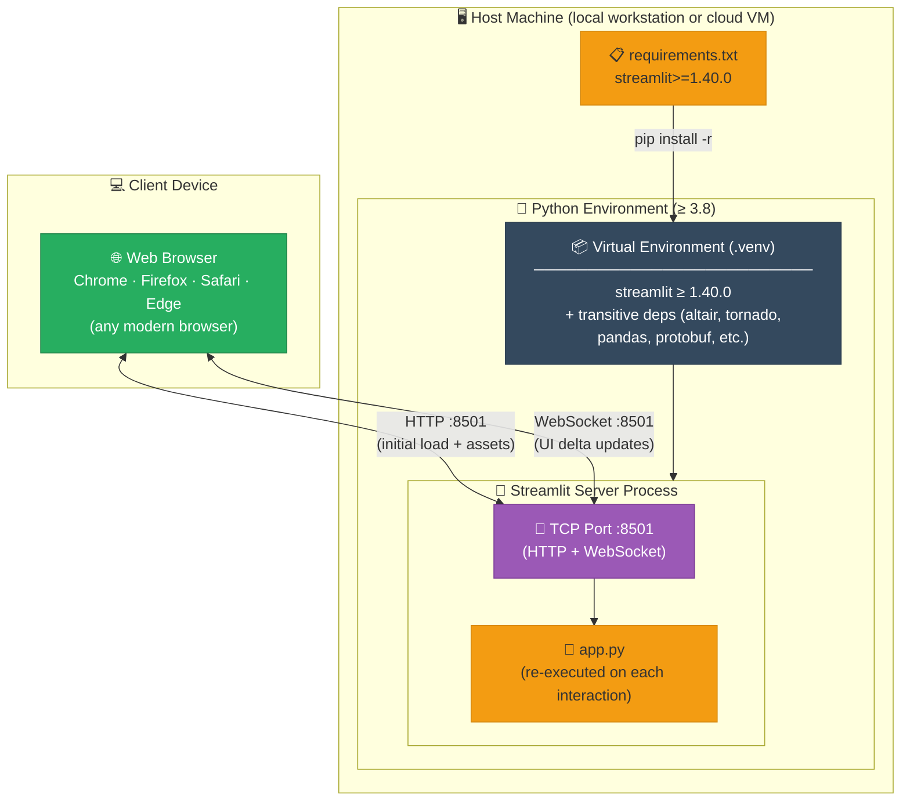

### 7.2 Deployment Scenarios

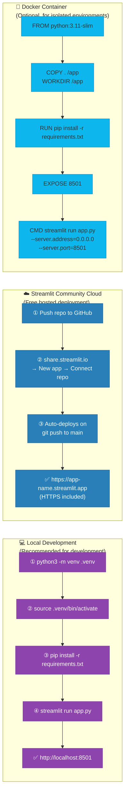

### 7.3 Deployment Requirements

| Requirement | Value | Notes |
|-------------|-------|-------|
| **Python version** | ≥ 3.8 (3.11 or 3.12 recommended) | All Streamlit 1.40+ features supported |
| **Streamlit version** | ≥ 1.40.0 | Specified in `requirements.txt` |
| **Network port** | 8501 (default) | Configurable via `--server.port` flag |
| **Memory** | ~100–250 MB | Streamlit server + Python runtime overhead |
| **CPU** | Minimal | Arithmetic is negligible; Streamlit WebSocket overhead dominates |
| **Disk storage** | ~50–100 MB | Python installation + Streamlit and its transitive dependencies |
| **Inbound network** | TCP :8501 reachable by browser | Firewall rule required on cloud/VM deployments |
| **Authentication** | None required | No secrets, tokens, or credentials needed |
| **Database / cache** | None | Fully stateless; zero persistence infrastructure |
| **HTTPS** | Optional (recommended for public deployments) | Streamlit Community Cloud: automatic; self-hosted: use nginx/Caddy reverse proxy |

---

## 8. Crosscutting Concepts

### 8.1 Error Handling Strategy

The application applies a **fail-fast, user-visible** error handling pattern. Errors are surfaced immediately in the UI with no silent failures or partial state rendering.

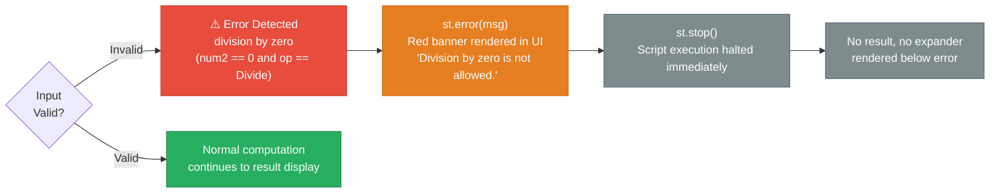

**Error handling coverage:**

| Error Condition | Detection Mechanism | Handling | User Feedback |
|----------------|--------------------|---------|--------------:|
| Division by zero | `if num2 == 0` (pre-condition guard) | `st.error()` + `st.stop()` | Red error banner; no result rendered |
| Non-numeric input | Prevented by `st.number_input()` | Widget-level type enforcement | Browser native invalid-input styling |
| Empty / blank input | Default value `0.0` in `st.number_input()` | Not an error; treated as zero | No feedback needed |

### 8.2 UI/UX Patterns

| Pattern | Implementation | Benefit |
|---------|---------------|---------|
| **Form-based submission** | `st.form()` + `st.form_submit_button()` | Batches all inputs atomically; prevents re-calculation on every keystroke |
| **Two-column layout** | `st.columns(2)` | Visual separation of the two operands; reduces cognitive load |
| **Progressive disclosure** | `st.expander("Computation details")` | Keeps result view clean; raw dict available on demand |
| **Centered page layout** | `layout="centered"` in `set_page_config` | Optimizes readability on wide displays; avoids full-width input stretching |
| **Inline contextual feedback** | `st.success()` / `st.error()` | Color-coded, inline feedback without page navigation or modal dialogs |
| **Descriptive page metadata** | `page_title="Calculator"`, `page_icon="🧮"` | Improves browser tab identification and bookmarking UX |

### 8.3 Streamlit Re-Run Programming Model

Streamlit's **reactive script-re-run model** is the most important crosscutting concern affecting every component:

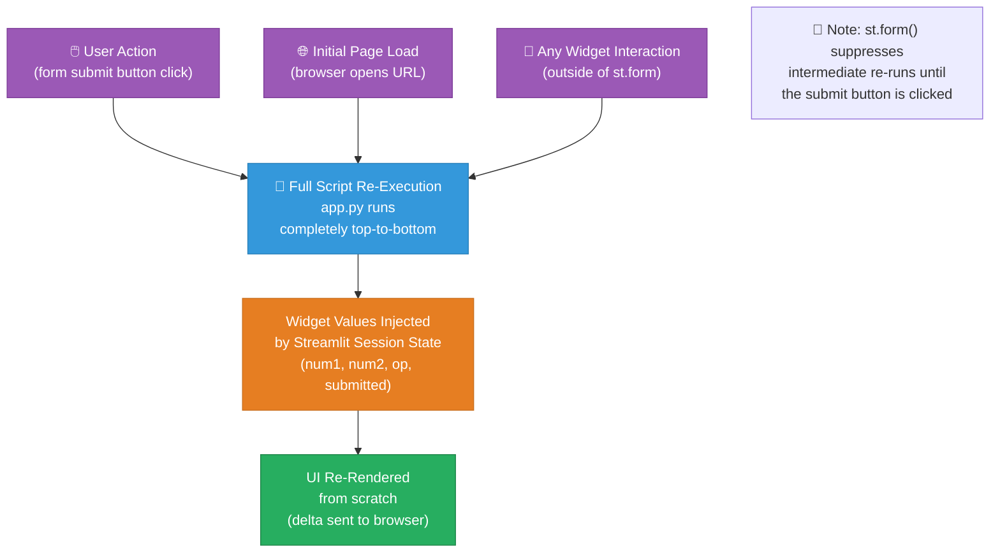

> **Architectural implication**: Because `app.py` re-runs completely on every interaction, **no global mutable state, class instances, or in-memory caches are needed or used**. The `submitted` flag and all widget values are freshly injected by Streamlit on each re-run. `st.form()` is used specifically to suppress re-runs until the user explicitly clicks "Calculate", which is the correct pattern for this use case.

### 8.4 Number Representation and Precision

| Aspect | Detail |
|--------|--------|
| **Input type** | Python `float` (IEEE 754 double precision, 64-bit) |
| **Input display format** | `%.6f` — 6 decimal places shown in the number input widget |
| **Computation precision** | Full Python `float` (64-bit); no rounding applied during calculation |
| **Result display** | Python default `str(float)` formatting within the f-string |
| **Edge cases** | Very large numbers may exhibit floating-point imprecision inherent to IEEE 754; not guarded against |

### 8.5 Security Posture

| Concern | Status | Notes |
|---------|--------|-------|
| **Input injection / XSS** | ✅ Not applicable | `st.number_input()` enforces numeric types at the widget level; no raw HTML rendered |
| **Authentication** | ℹ️ None implemented | Acceptable for a public utility; for restricted use, add Streamlit's built-in auth or a reverse-proxy auth layer |
| **HTTPS / TLS** | ℹ️ Not configured by default | Streamlit Community Cloud provides HTTPS automatically; self-hosted deployments should use nginx or Caddy with TLS termination |
| **Secrets / credentials** | ✅ None used | No API keys, database passwords, or sensitive configuration in the application |
| **Data privacy** | ✅ No data stored | All inputs and results are ephemeral; nothing is logged, stored, or transmitted to third parties |

---

## 9. Architecture Decisions

### ADR-001 — Use Streamlit as the UI Framework

| Field | Value |
|-------|-------|
| **Status** | ✅ Accepted |
| **Deciders** | Project author |

**Context**: A simple arithmetic calculator needs a browser-accessible UI. Alternatives considered: plain HTML + Flask/FastAPI, CLI (argparse), Tkinter/PyQt desktop UI, Gradio.

**Decision**: Use [Streamlit](https://streamlit.io) (`≥ 1.40.0`) as the sole UI framework.

**Rationale**:
- Eliminates all front-end code (HTML, CSS, JavaScript)
- All UI is expressed as declarative Python function calls
- Hot-reload during development speeds iteration
- Built-in form, column, selectbox, and number input widgets exactly match the calculator's needs
- One-command deployment; native support for Streamlit Community Cloud (free hosting)
- Active community and extensive documentation

**Consequences**:
- ✅ Extremely low code volume (~50 lines for complete UI + logic)
- ✅ No build toolchain, bundler, or front-end pipeline required
- ✅ Full Python — no context-switching between languages
- ⚠️ Tied to Streamlit's re-run execution model; complex stateful UIs require `st.session_state`
- ⚠️ Not suitable for high-concurrency public APIs; acceptable for this single-user utility use case

---

### ADR-002 — Single-File Architecture (`app.py`)

| Field | Value |
|-------|-------|
| **Status** | ✅ Accepted |

**Context**: The application has minimal complexity (4 operations, 1 form, 1 result view). A package structure with separate modules (e.g., `ui.py`, `logic.py`, `config.py`) was considered.

**Decision**: All application code resides in a single file, `app.py`.

**Rationale**:
- The entire application logic fits in ~50 lines
- Single-file apps are idiomatic for Streamlit demos, tools, and tutorials
- A package structure would add cognitive overhead with no architectural benefit at this scale

**Consequences**:
- ✅ Zero navigation overhead; entire codebase visible in one scroll
- ✅ Matches Streamlit community conventions for small apps
- ⚠️ Does not scale beyond ~200 lines; if operations grow significantly, arithmetic logic should be extracted to a pure function or separate module for testability

---

### ADR-003 — No Persistent Storage

| Field | Value |
|-------|-------|
| **Status** | ✅ Accepted |

**Context**: Persisting calculation history (e.g., in `st.session_state`, SQLite, or a file) was considered. Each page load currently starts fresh.

**Decision**: No database, file, or session-state persistence mechanism is used. Each calculation is ephemeral.

**Rationale**:
- Eliminates all database setup, migration, backup, and query concerns
- Reduces attack surface (no stored user data)
- Matches the mental model of a physical desktop calculator
- `st.session_state` history could be added later as a non-breaking enhancement

**Consequences**:
- ✅ Zero infrastructure dependencies; runs on any Python host without configuration
- ✅ No data privacy or GDPR concerns (nothing is stored)
- ⚠️ Calculation history is lost on page refresh; if history tracking is a future requirement, `st.session_state` list or SQLite would be the recommended approach

---

### ADR-004 — Fail-Fast Error Handling via `st.stop()`

| Field | Value |
|-------|-------|
| **Status** | ✅ Accepted |

**Context**: Division by zero must be handled. Options: return `float('inf')` / `NaN`, raise a Python exception, use a try/except block, or display a user-visible error and stop rendering.

**Decision**: Use `st.error()` to display a red error banner, followed immediately by `st.stop()` to halt all further script execution for that run.

**Rationale**:
- `st.stop()` guarantees no result is ever rendered after an error — no confusing partial states
- `st.error()` is consistent with Streamlit's design system (red banner, warning icon)
- Explicit guard (`if num2 == 0`) is more readable than a try/except for this specific precondition
- Silent `float('inf')` or `NaN` results would be misleading and technically incorrect from a user perspective

**Consequences**:
- ✅ Clear, unambiguous, visually distinct user feedback on invalid operations
- ✅ Mathematically correct behavior (no IEEE 754 infinity results presented as valid answers)
- ⚠️ `st.stop()` halts all rendering in the script; for more complex multi-section pages, a scoped error approach may be preferable

---

### ADR-005 — Use `st.form()` to Batch Input Collection

| Field | Value |
|-------|-------|
| **Status** | ✅ Accepted |

**Context**: Streamlit re-runs the script on every widget interaction by default. Without a form, changing `num1` would trigger a re-run before `num2` is entered, potentially flashing intermediate results.

**Decision**: Wrap all inputs in `st.form("calculator_form")` with a single `st.form_submit_button("Calculate")`.

**Rationale**:
- Suppresses all re-runs until the user explicitly clicks "Calculate"
- Ensures `num1`, `num2`, and `operation` are always read as a consistent, user-confirmed set
- Provides a clear affordance: the "Calculate" button is the single action trigger

**Consequences**:
- ✅ No intermediate/partial calculation results flash during input
- ✅ Explicit submit action matches user mental model of "I've entered my values, now compute"
- ⚠️ Users cannot see a live-updating result as they type (by design; this is intentional)

---

## 10. Quality Requirements

### 10.1 Quality Tree

```mermaid
graph TD
    classDef root fill:#2C3E50,stroke:#1A252F,color:#fff
    classDef cat fill:#2980B9,stroke:#1F618D,color:#fff
    classDef leaf fill:#27AE60,stroke:#1E8449,color:#fff
    classDef risk fill:#E74C3C,stroke:#C0392B,color:#fff
    classDef warn fill:#E67E22,stroke:#CA6F1E,color:#fff

    ROOT["🏆 Quality Goals\nStreamlit Calculator App"]:::root

    ROOT --> FUNC["✅ Functional Suitability"]:::cat
    ROOT --> USAB["🎨 Usability"]:::cat
    ROOT --> RELY["🔒 Reliability"]:::cat
    ROOT --> MAIN["🔧 Maintainability"]:::cat
    ROOT --> PORT["📦 Portability"]:::cat
    ROOT --> PERF["⚡ Performance Efficiency"]:::cat

    FUNC --> F1["All 4 arithmetic operations\ncorrectly implemented"]:::leaf
    FUNC --> F2["Division-by-zero guard\nprevents undefined results"]:::leaf
    FUNC --> F3["6-decimal precision\nin input display"]:::leaf

    USAB --> U1["Centered, single-column\nclean page layout"]:::leaf
    USAB --> U2["Color-coded feedback\n(green success / red error)"]:::leaf
    USAB --> U3["Progressive disclosure\n(expandable detail panel)"]:::leaf
    USAB --> U4["Meaningful page title\nand emoji favicon"]:::leaf

    RELY --> R1["No crashes on\nvalid numeric inputs"]:::leaf
    RELY --> R2["Graceful error handling\non division by zero"]:::leaf
    RELY --> R3["⚠️ No automated\ntest coverage"]:::risk

    MAIN --> M1["Single file, ~50 lines\nself-documenting code"]:::leaf
    MAIN --> M2["One pinned dependency\n(streamlit ≥ 1.40.0)"]:::leaf
    MAIN --> M3["⚠️ No linting, formatting\nor CI pipeline"]:::warn

    PORT --> P1["Runs on Linux / macOS / Windows\nwith Python ≥ 3.8"]:::leaf
    PORT --> P2["Streamlit Community Cloud\ncompatible (zero config)"]:::leaf
    PORT --> P3["Docker-deployable\nwithout code changes"]:::leaf

    PERF --> PE1["Sub-second response\nfor all operations"]:::leaf
    PERF --> PE2["~100-250 MB memory\n(Streamlit overhead)"]:::leaf
```

### 10.2 Quality Scenarios

| ID | Quality Attribute | Scenario | Expected Response | Current Status |
|----|------------------|----------|-------------------|----------------|
| QS-01 | **Correctness** | User divides 5.0 by 0.0 | Red error banner; `st.stop()` prevents result | ✅ Implemented |
| QS-02 | **Correctness** | User multiplies 12.5 × 4.0 | Green banner: `12.5 × 4.0 = 50.0` | ✅ Implemented |
| QS-03 | **Usability** | User wants to see computation breakdown | Clicks expander; sees full input/output dict | ✅ Implemented |
| QS-04 | **Performance** | Submit form on local machine | Result displayed < 500 ms | ✅ Arithmetic is negligible |
| QS-05 | **Portability** | Deploy on fresh machine | Clone + install + run in < 2 minutes | ✅ Verified in README |
| QS-06 | **Maintainability** | Add Modulo operation | ≤ 5 lines changed in `app.py` only | ✅ Architecture supports this |
| QS-07 | **Reliability** | 100 sequential calculations | All results mathematically correct; no crashes | ⚠️ No automated test coverage |
| QS-08 | **Maintainability** | Future Streamlit upgrade | No breaking changes if API is stable | ⚠️ No exact version pin; uses `>=` |

### 10.3 Metrics Summary

| Metric | Value |
|--------|-------|
| **Lines of code** (`app.py`) | ~50 |
| **Number of external dependencies** | 1 (`streamlit`) |
| **Number of Python files** | 1 |
| **Number of supported operations** | 4 |
| **Error conditions handled** | 1 (division by zero) |
| **Unit test coverage** | 0% (no tests exist) |
| **Cyclomatic complexity** | Low (max nesting depth: 3) |
| **Setup time (new machine)** | < 2 minutes |

---

## 11. Risks and Technical Debt

### 11.1 Risk Matrix

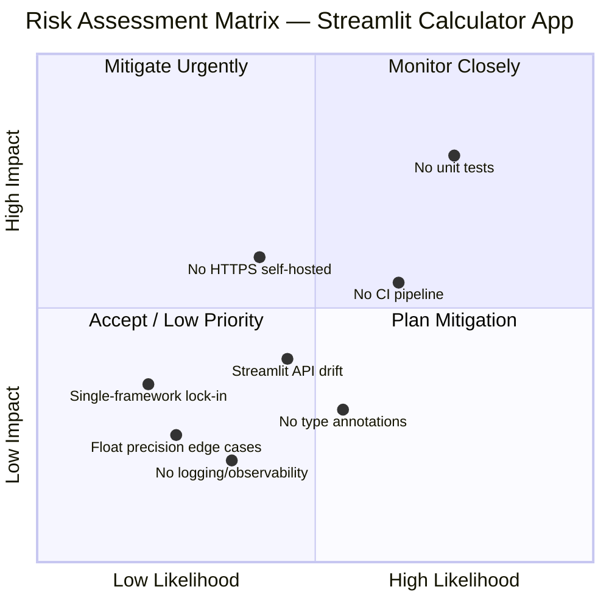

### 11.2 Risk Register

| ID | Risk | Likelihood | Impact | Mitigation Strategy |
|----|------|:----------:|:------:|---------------------|
| R-01 | **No automated tests** — Regressions introduced by future changes go undetected | 🔴 High | 🔴 High | Add `pytest` suite covering all 4 operations + division-by-zero guard; integrate with CI |
| R-02 | **No CI/CD pipeline** — Quality checks rely entirely on manual review | 🟡 Medium | 🟡 Medium | Add GitHub Actions workflow: install deps, run `pytest`, optional `ruff`/`black` lint |
| R-03 | **No HTTPS on self-hosted deployments** — Data in transit is unencrypted | 🟡 Medium | 🟡 Medium | Document nginx/Caddy reverse-proxy TLS setup; Streamlit Cloud handles this automatically |
| R-04 | **Streamlit API drift** — Future Streamlit releases may deprecate widget APIs | 🟡 Medium | 🟡 Medium | Pin exact version (`streamlit==1.x.y`); monitor Streamlit changelog; enable Dependabot |
| R-05 | **No type annotations** — Static analysis and IDE support limited | 🟡 Medium | 🟢 Low | Add type annotations; run `mypy` in CI |
| R-06 | **Floating-point precision** — IEEE 754 edge cases may surprise users | 🟢 Low | 🟢 Low | Document known precision limits; consider `decimal.Decimal` for high-precision requirements |
| R-07 | **Single-framework lock-in** — Full UI rewrite required if migrating away from Streamlit | 🟢 Low | 🟡 Medium | Extract arithmetic logic to a pure function; this decouples business logic from the UI layer |
| R-08 | **No observability / logging** — Production errors are invisible | 🟡 Medium | 🟢 Low | Add Python `logging` module calls for error conditions and app startup |

### 11.3 Technical Debt Backlog

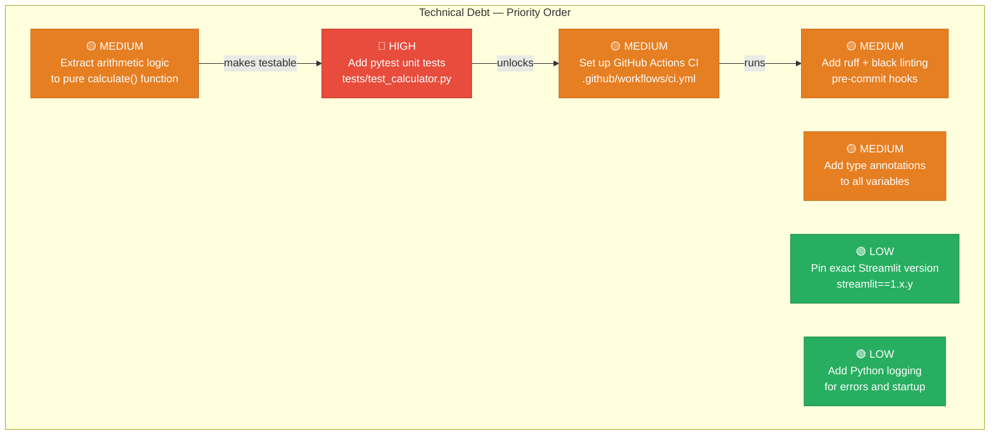

### 11.4 Recommended Improvements (Prioritized)

**1. Extract arithmetic logic to a pure function** (enables testability):
```python
# Proposed: calculator_logic.py or top of app.py
def calculate(num1: float, num2: float, operation: str) -> tuple[float, str]:
    """Perform arithmetic. Raises ValueError on division by zero."""
    if operation == "Add":
        return num1 + num2, "+"
    elif operation == "Subtract":
        return num1 - num2, "−"
    elif operation == "Multiply":
        return num1 * num2, "×"
    elif operation == "Divide":
        if num2 == 0:
            raise ValueError("Division by zero is not allowed.")
        return num1 / num2, "÷"
    raise ValueError(f"Unknown operation: {operation}")
```

**2. Add unit tests** (`tests/test_calculator.py`):
```python
import pytest
from app import calculate  # after extracting the function

def test_addition():         assert calculate(1.0, 2.0, "Add") == (3.0, "+")
def test_subtraction():      assert calculate(5.0, 3.0, "Subtract") == (2.0, "−")
def test_multiplication():   assert calculate(4.0, 2.5, "Multiply") == (10.0, "×")
def test_division():         assert calculate(10.0, 4.0, "Divide") == (2.5, "÷")
def test_division_by_zero(): 
    with pytest.raises(ValueError, match="Division by zero"):
        calculate(5.0, 0.0, "Divide")
```

**3. Add GitHub Actions CI** (`.github/workflows/ci.yml`):
```yaml
name: CI
on: [push, pull_request]
jobs:
  test:
    runs-on: ubuntu-latest
    steps:
      - uses: actions/checkout@v4
      - uses: actions/setup-python@v5
        with: { python-version: "3.11" }
      - run: pip install -r requirements.txt pytest
      - run: pytest tests/ -v
```

---

## 12. Glossary

### 12.1 Domain Terms

| Term | Definition |
|------|-----------|
| **Operand** | A numeric value on which an arithmetic operation is performed. In this app: `num1` (the "First number") and `num2` (the "Second number"). |
| **Operation** | The arithmetic function applied to the two operands. The four supported operations are: Add, Subtract, Multiply, and Divide. |
| **Result** | The output value produced by applying the selected operation to the two operands. |
| **Division by Zero** | The mathematically undefined operation of dividing any number by zero. The application guards against this with an explicit pre-condition check. |
| **Symbol** | The single Unicode character representing an operation in the result display string: `+` (add), `−` (subtract), `×` (multiply), `÷` (divide). |
| **Computation Details** | The expandable panel displaying the full input/output structure as a Python dict: `{first_number, second_number, operation, result}`. |
| **Form Submission** | The event triggered when the user clicks the "Calculate" button, causing Streamlit to re-run `app.py` with all form values populated and `submitted=True`. |

### 12.2 Streamlit Framework Terms

| Term | Definition |
|------|-----------|
| **Streamlit** | An open-source Python framework for building interactive web applications without writing HTML, CSS, or JavaScript. See [streamlit.io](https://streamlit.io). |
| **`st.form()`** | A Streamlit context manager that groups widget interactions and suppresses script re-runs until the form's submit button is clicked. Ensures atomic input collection. |
| **`st.form_submit_button()`** | The submit button widget within an `st.form()` block. Returns `True` on the re-run immediately following a click; `False` otherwise. |
| **`st.number_input()`** | A Streamlit widget that renders a numeric text input with increment/decrement controls, type enforcement, and display format control (`format="%.6f"`). |
| **`st.selectbox()`** | A Streamlit widget rendering a dropdown select control. Returns the currently selected string value on each re-run. |
| **`st.columns()`** | A Streamlit layout function that creates N side-by-side columns. Used here with `st.columns(2)` to place `num1` and `num2` inputs side by side. |
| **`st.success()`** | Renders a green-highlighted informational banner with a checkmark icon. Used to display valid calculation results. |
| **`st.error()`** | Renders a red-highlighted error banner with an X icon. Used to display the division-by-zero error message. |
| **`st.stop()`** | Immediately halts execution of the current Streamlit script re-run. Any `st.*` calls after `st.stop()` are not executed, preventing partial UI rendering. |
| **`st.expander()`** | A Streamlit context manager rendering a collapsible UI section. Content inside is hidden until the user clicks to expand it. |
| **`st.write()`** | A Streamlit function that intelligently renders Python objects. When passed a `dict`, it renders it as a formatted table/JSON view. |
| **`st.set_page_config()`** | Configures global page properties: browser tab title, favicon, layout mode, and sidebar state. Must be called as the first Streamlit command. |
| **Script re-run** | Streamlit's core execution model: the entire `app.py` script is re-executed from top to bottom on every user interaction. This replaces traditional event handlers. |
| **Session state** | `st.session_state` — Streamlit's key-value store that persists values across script re-runs within a single browser session. Not used in this application. |
| **Widget state** | The current value of each Streamlit widget (e.g., the current number in `st.number_input`), automatically preserved and injected by Streamlit on each re-run. |

### 12.3 Technical and Architecture Terms

| Term | Definition |
|------|-----------|
| **Arc42** | A pragmatic, open software architecture documentation template with 12 standardized sections. Widely used in the German-speaking software engineering community and beyond. See [arc42.org](https://arc42.org). |
| **ADR (Architecture Decision Record)** | A short, structured document capturing the context, decision, options considered, rationale, and consequences of a key architectural choice. |
| **Stateless** | A system property where no user-specific or request-specific state is retained on the server between interactions. This application is stateless by design. |
| **Single-tier architecture** | An architectural style where all application layers (presentation, logic, data) reside within a single process or file, without separation into distinct services or tiers. |
| **Fail-fast** | A design principle where a system immediately surfaces errors rather than continuing execution in a potentially invalid state or silently ignoring problems. |
| **IEEE 754** | The international standard governing floating-point arithmetic. Python's `float` type is a 64-bit IEEE 754 double-precision value. Relevant for understanding numeric precision behavior. |
| **WebSocket** | A bidirectional, full-duplex communication protocol over a single TCP connection. Used by Streamlit to push UI delta updates from the server to the browser without full page reloads. |
| **Virtual environment (`.venv`)** | An isolated Python environment created with `python -m venv` that scopes installed packages to the project directory, preventing conflicts with system Python packages. |
| **`requirements.txt`** | A plain-text file listing Python package dependencies and version constraints, installable via `pip install -r requirements.txt`. The project's sole dependency specification. |
| **Reactive UI** | A UI programming model where the interface automatically re-renders when underlying data or state changes. Streamlit implements this via full script re-execution. |
| **Guard clause** | A conditional check placed at the beginning of a code block to handle invalid preconditions and return/stop early, preventing the main logic from executing with invalid inputs. |
| **Pure function** | A function that always produces the same output for the same inputs and has no side effects. Extracting the arithmetic logic to a pure function would improve testability. |

---

*Documentation generated by the **Arc42 Documentation Generator**.*  
*Sources analysed: `app.py` (50 lines), `requirements.txt` (1 dependency), `README.md`.*  
*Project: Streamlit Calculator App v1.0.0*  
*Canonical location: `docs/arc42/arc42-documentation.md`*
