# Simple Calculator — Arc42 Architecture Documentation

**Version:** 1.0  
**Date:** 2025-01-15  
**Status:** Generated from source code analysis  
**Author:** GenInsights Arc42 Agent  
**Target Path:** `docs/arc42/arc42-documentation.md`

---

## Table of Contents

1. [Introduction and Goals](#1-introduction-and-goals)
2. [Architecture Constraints](#2-architecture-constraints)
3. [System Scope and Context](#3-system-scope-and-context)
4. [Solution Strategy](#4-solution-strategy)
5. [Building Block View](#5-building-block-view)
6. [Runtime View](#6-runtime-view)
7. [Deployment View](#7-deployment-view)
8. [Crosscutting Concepts](#8-crosscutting-concepts)
9. [Architecture Decisions](#9-architecture-decisions)
10. [Quality Requirements](#10-quality-requirements)
11. [Risks and Technical Debt](#11-risks-and-technical-debt)
12. [Glossary](#12-glossary)

---

## 1. Introduction and Goals

### 1.1 Requirements Overview

The **Simple Calculator** is a lightweight, browser-based arithmetic web application built with Python and Streamlit. It enables end-users to perform the four fundamental arithmetic operations — addition, subtraction, multiplication, and division — through a clean, responsive web interface without requiring any installation or local setup beyond a Python runtime.

**Primary Goal:** Provide immediate, accurate arithmetic computation via a stateless web UI with clear result presentation and transparent error handling.

**Key Features:**

| # | Feature | Description |
|---|---------|-------------|
| 1 | Dual numeric input | Accept two floating-point operands with six decimal places of precision |
| 2 | Operation selection | Choose from Add, Subtract, Multiply, or Divide via a dropdown |
| 3 | Form-based submission | Batch capture inputs and trigger computation in a single user action |
| 4 | Result display | Present the full expression and result in a success banner |
| 5 | Computation details | Expandable panel showing a structured breakdown of all operands and the result |
| 6 | Division-by-zero guard | Detect and reject division-by-zero with a user-friendly error message |
| 7 | Execution halting | Stop further rendering after a fatal input error using `st.stop()` |

### 1.2 Quality Goals

The following quality goals are ranked in order of architectural importance:

| Priority | Quality Goal | Rationale |
|----------|--------------|-----------|
| 1 | **Correctness** | Arithmetic results must be numerically accurate; incorrect output is the primary failure mode |
| 2 | **Usability** | The UI must be instantly understandable with zero learning curve for any user familiar with a calculator |
| 3 | **Reliability** | All inputs — including edge cases such as zero denominators or negative numbers — must be handled gracefully without crashes |
| 4 | **Maintainability** | The single-file codebase must remain easy to extend (e.g., adding modulo, exponentiation) without structural rework |
| 5 | **Deployability** | The application must be launchable with a single shell command on any machine with Python and Streamlit installed |

### 1.3 Stakeholders

| Role | Name / Group | Expectations |
|------|-------------|--------------|
| **End User** | Anyone needing quick arithmetic | Instant, correct results; clear error messages; no registration or setup |
| **Developer / Maintainer** | Python developer | Simple, readable single-file source; easy to extend with new operations |
| **DevOps / Operator** | Person running the app | One-command startup (`streamlit run app.py`); minimal dependency footprint |
| **Architect** | Software architect reviewing the project | Clear structure, sound patterns, documented decisions |

---

## 2. Architecture Constraints

### 2.1 Technical Constraints

| Constraint | Value | Impact |
|------------|-------|--------|
| **Programming Language** | Python (≥ 3.8 implied by Streamlit 1.40.0) | All logic must be written in Python |
| **Web Framework** | Streamlit ≥ 1.40.0 | UI rendering, state management, and HTTP serving are entirely delegated to Streamlit |
| **External Dependencies** | Single dependency (`streamlit`) | No database, message broker, cache layer, or authentication middleware permitted in current scope |
| **Deployment Model** | Process-based single server (`streamlit run`) | No containerisation or orchestration defined in current scope |
| **Browser** | Any modern browser (Streamlit handles compatibility) | No custom JS, CSS, or browser-compatibility code required |
| **Floating-Point Precision** | Python native `float` (IEEE 754 double) | Six decimal digits displayed; precision limited to native float |

### 2.2 Organizational Constraints

| Constraint | Description |
|------------|-------------|
| **Simplicity mandate** | Application must remain comprehensible to a junior Python developer; no over-engineering |
| **No persistent storage** | No database, file system writes, or session history required by current scope |
| **Single-file architecture** | All application logic resides in `app.py` as a documented design choice |
| **Open-source stack** | All dependencies must be freely available and open-source |

### 2.3 Conventions

| Convention | Description |
|------------|-------------|
| **Python style** | PEP 8 formatting; no classes or modules required at this scale |
| **Streamlit idioms** | Use `st.form` for grouped input submission; `st.success`/`st.error` for result/error feedback |
| **Precision format** | All numeric inputs formatted to `%.6f` (six decimal places) for consistency |
| **Error termination** | Fatal input errors call `st.stop()` immediately after displaying the error |

---

## 3. System Scope and Context

### 3.1 Business Context

The diagram below illustrates the application's position in its business environment. The Simple Calculator is a **standalone, self-contained tool** with no upstream or downstream system dependencies.

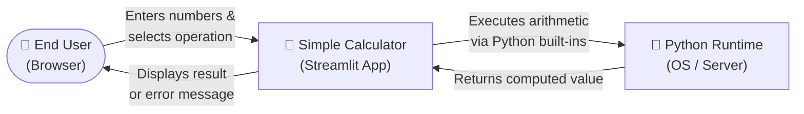

**External Partners & Interfaces:**

| Partner | Direction | Interface Type | Data Exchanged |
|---------|-----------|----------------|----------------|
| End User | Bidirectional | Browser / HTTP + WebSocket | Numeric inputs, operation choice → computed result, formatted expression |
| Python Runtime | Internal dependency | Native function call | Arithmetic operands → `float` result |
| OS File System | Read-only at startup | File I/O | `app.py` source file loaded by Streamlit at process start |

> **Note:** There are no external API calls, database connections, authentication providers, or third-party service integrations in the current application scope.

### 3.2 Technical Context

The following diagram shows the technical communication channels between all system participants:

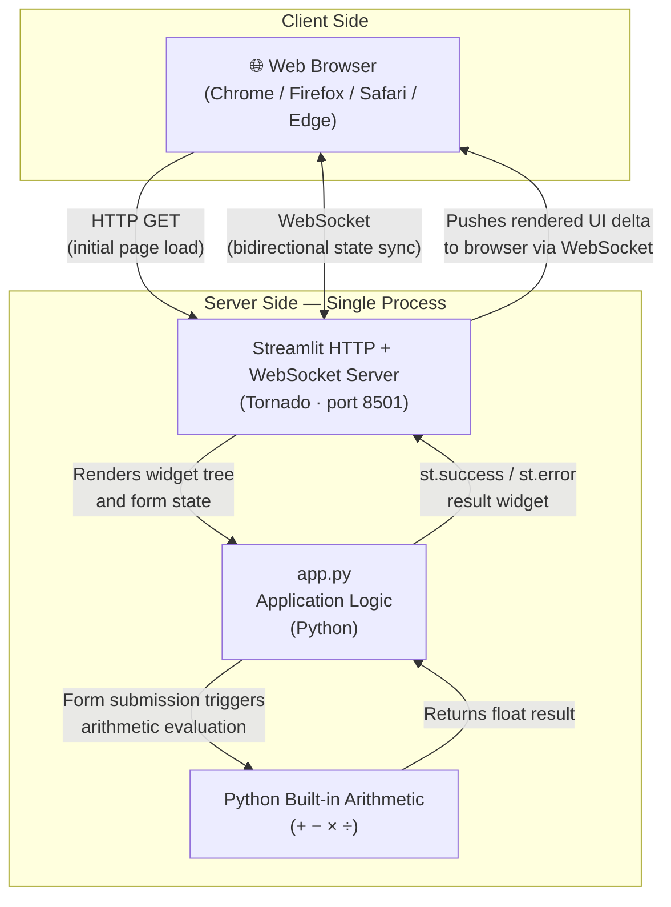

**Technical Interface Summary:**

| Interface | Protocol | Port | Description |
|-----------|----------|------|-------------|
| Browser ↔ Streamlit server | HTTP / WebSocket | 8501 (default) | All UI interactions, widget state sync, and rendered output |
| app.py ↔ Python runtime | Native CPython call | N/A (in-process) | Arithmetic operations on `float` operands |
| Streamlit server ↔ app.py | Streamlit Python API | N/A (in-process) | Widget declarations, form handling, output rendering calls |

---

## 4. Solution Strategy

### 4.1 Technology Decisions

| Decision | Technology Chosen | Rationale |
|----------|-----------------|-----------|
| **UI framework** | Streamlit 1.40.0+ | Eliminates separate frontend; Python-only development; instant web UI from script |
| **Language** | Python 3 | Universal scripting language; native float arithmetic; minimal boilerplate |
| **Architecture style** | Single-file procedural script | Matches trivial scope; maximum readability; zero abstraction overhead |
| **State model** | Streamlit form-based submission | Form widget batches inputs before submission; avoids premature re-renders on every keystroke |
| **Error handling** | Inline guards + `st.stop()` | Immediate user feedback without exceptions propagating to Streamlit error page |
| **No persistence** | Stateless, ephemeral | Each calculation is independent; no history, no login, no data retention risk |

### 4.2 Architecture Approach

The application follows a **reactive, single-page script** pattern enabled by Streamlit's execution model:

1. **Top-down execution:** Streamlit re-executes the entire `app.py` script from top to bottom on every user interaction.
2. **Form isolation:** `st.form("calculator_form")` groups all inputs so arithmetic is only triggered when the **Calculate** button is pressed, not on individual widget changes.
3. **Conditional rendering:** Post-submission output (`st.success`, `st.expander`) is rendered inside an `if submitted:` block, keeping the page clean on first load.
4. **Fail-fast error handling:** Division-by-zero is detected before computation; `st.stop()` prevents any further script execution, avoiding partial state.

This approach prioritises **simplicity and immediacy** over architectural formalism, which is appropriate for a single-purpose utility of this scope.

### 4.3 Key Design Decisions

| Decision | Context | Consequences |
|----------|---------|--------------|
| Single `app.py` file | Minimal scope, single developer | ✅ Easy to read and modify; ❌ Needs refactoring for many operations |
| `st.form` for input grouping | Prevent premature submission on number input change | ✅ Clean UX; ❌ Adds slight indirection vs direct widget reads |
| `st.stop()` on division by zero | Prevent partial result rendering | ✅ Clean error boundary; ❌ Non-standard control flow |
| Python native `float` | No external math library needed | ✅ Zero dependencies; ❌ IEEE 754 rounding on edge cases |
| `if/elif/else` operation dispatch | Four operations, explicit branching | ✅ Immediately readable; ❌ Does not scale beyond ~6 operations |

---

## 5. Building Block View

### 5.1 Level 1: System Overview

At the highest level of abstraction, the Simple Calculator consists of three logical blocks:

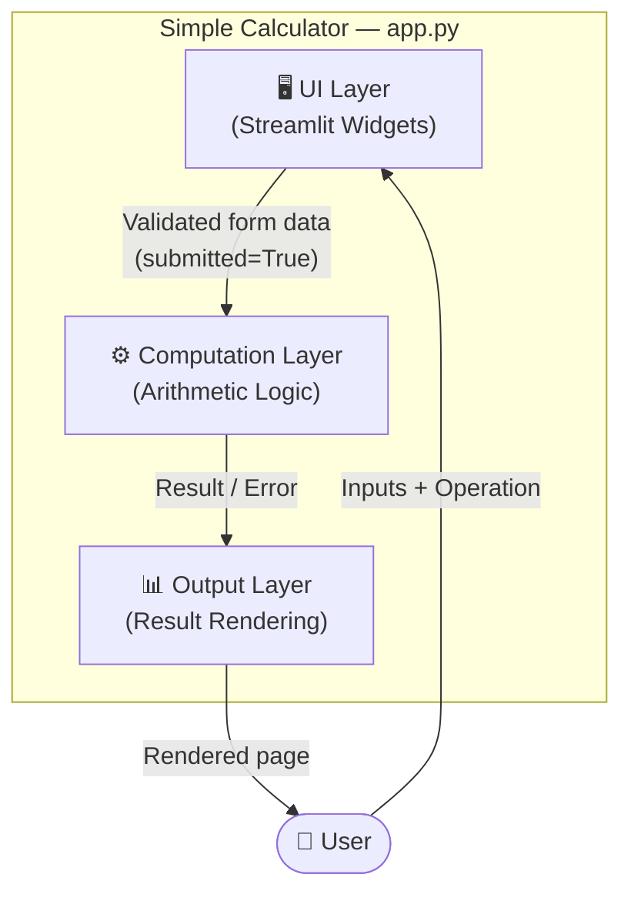

| Building Block | Responsibility | Location in `app.py` |
|----------------|---------------|----------------------|
| **UI Layer** | Page configuration, title, form with number inputs and operation dropdown | Lines 1–22 |
| **Computation Layer** | Operation dispatch, arithmetic evaluation, division-by-zero check | Lines 24–39 |
| **Output Layer** | Success banner with full expression, expandable computation detail panel | Lines 41–49 |

### 5.2 Level 2: Component Detail

#### 5.2.1 UI Layer — Streamlit Widget Declarations

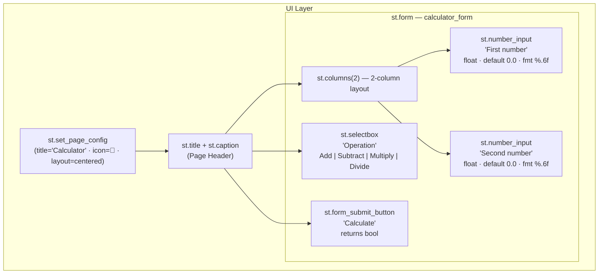

| Sub-component | Widget | Default | Return Type |
|---------------|--------|---------|-------------|
| First operand | `st.number_input` | `0.0` | `float` |
| Second operand | `st.number_input` | `0.0` | `float` |
| Operation | `st.selectbox` | `"Add"` (index 0) | `str` |
| Submit trigger | `st.form_submit_button` | `False` | `bool` |

#### 5.2.2 Computation Layer — Operation Dispatch

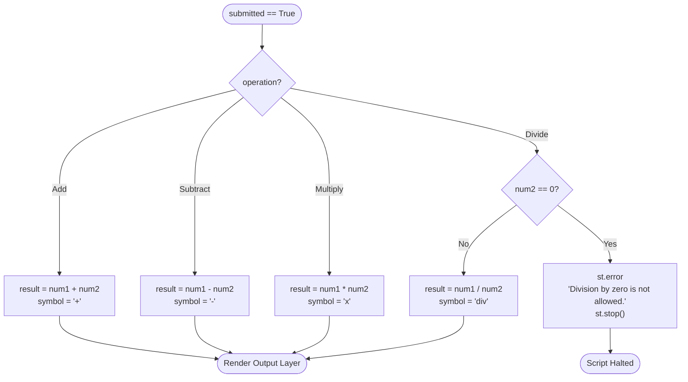

#### 5.2.3 Output Layer — Result Presentation

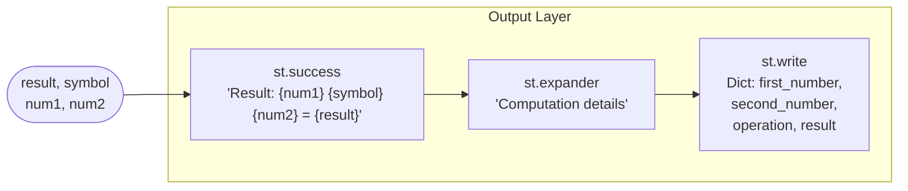

### 5.3 Level 3: Module View

Because the application is a single procedural script with no classes, the module-level view shows the logical units and their dependency on the Streamlit API:

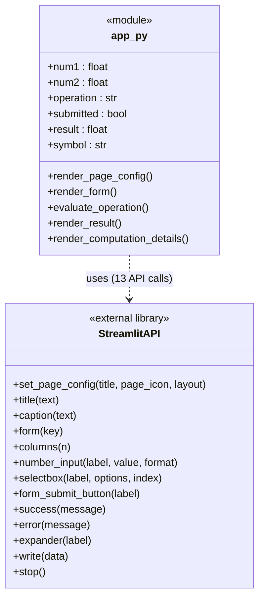

---

## 6. Runtime View

### 6.1 Scenario 1 — Successful Arithmetic Calculation (Happy Path)

This scenario traces a full user interaction for a valid division: `10.5 ÷ 3.0 = 3.5`.

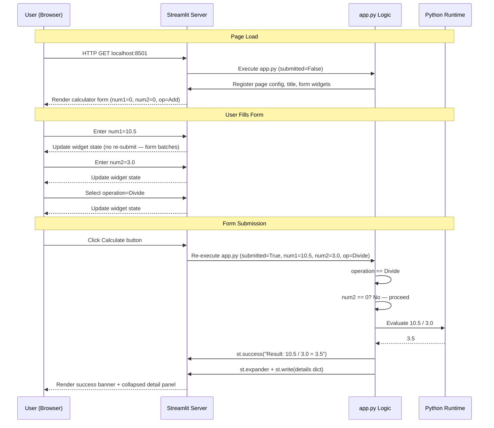

### 6.2 Scenario 2 — Division by Zero (Error Path)

This scenario traces the error handling flow when a user attempts `5.0 ÷ 0.0`:

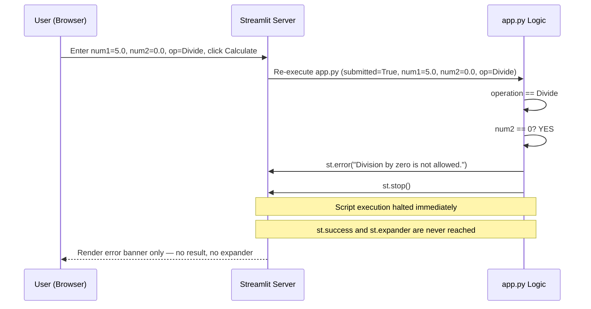

### 6.3 Scenario 3 — Initial Page Load (No Submission)

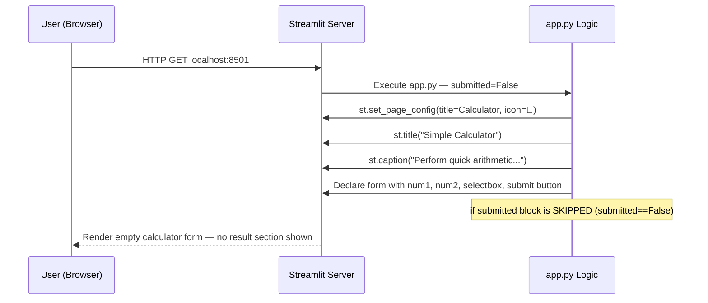

### 6.4 Streamlit Re-execution Model

Understanding Streamlit's reactive re-run model is essential for comprehending all runtime behaviour:

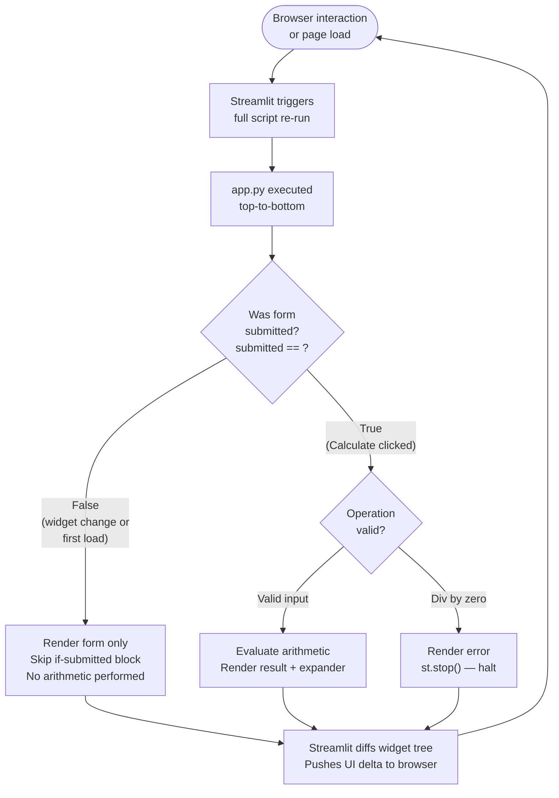

---

## 7. Deployment View

### 7.1 Development / Local Deployment

The canonical deployment model is a local developer workstation:

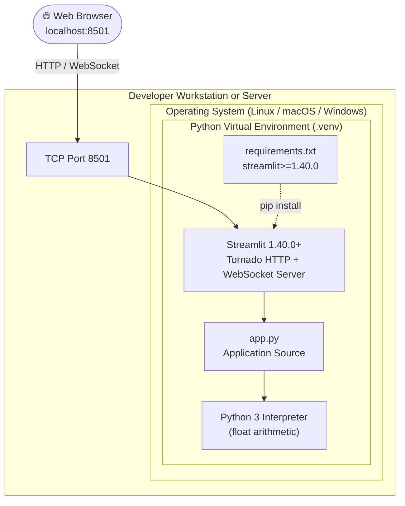

**Deployment steps from `README.md`:**

```bash
# Step 1 — Create virtual environment (optional but recommended)
python3 -m venv .venv
source .venv/bin/activate        # Linux / macOS
# .venv\Scripts\activate         # Windows

# Step 2 — Install dependencies
pip install -r requirements.txt  # installs streamlit>=1.40.0

# Step 3 — Launch application
streamlit run app.py
# App available at http://localhost:8501
```

### 7.2 Cloud / Remote Deployment (Recommended Architecture)

While no cloud configuration is present in the repository, the application is naturally deployable to any platform supporting Python processes:

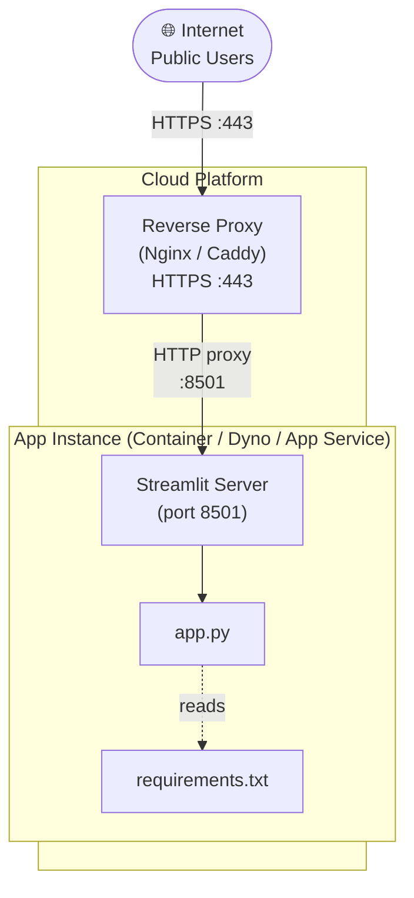

### 7.3 Deployment Mapping

| Component | Deployment Target | Configuration Required |
|-----------|-----------------|----------------------|
| `app.py` | Any Python host (VM, container, PaaS) | None |
| `requirements.txt` | pip package installer | None |
| Streamlit server | Bundled in `streamlit` package | Port configurable via `--server.port` |
| Database | **None** | Not applicable — stateless app |
| TLS / HTTPS | Reverse proxy (Nginx, Caddy) | Certificate + proxy config needed for production |

### 7.4 Scaling Considerations

| Concern | Current Behaviour | Production Recommendation |
|---------|-----------------|--------------------------|
| Concurrent users | Streamlit handles sessions independently per WebSocket connection | Add reverse proxy (Nginx) for traffic management |
| High availability | Single process — no automatic failover | Containerise + use process manager (`systemd`, `supervisord`) or Kubernetes |
| HTTPS | HTTP only on port 8501 | Terminate TLS at reverse proxy; use Let's Encrypt |
| Authentication | None | Add Streamlit secrets or auth proxy (e.g., Authelia) if access restriction needed |
| Horizontal scaling | Not applicable at current scope | Stateless design makes horizontal scaling trivial if needed |

---

## 8. Crosscutting Concepts

### 8.1 Error Handling Strategy

The application uses a **fail-fast, inline error rendering** pattern — errors are caught at the input validation stage and rendered immediately, with script execution halted to prevent partial output:

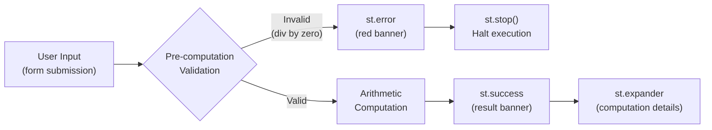

| Aspect | Implementation | Notes |
|--------|---------------|-------|
| Error detection | `if num2 == 0` before division | Pre-condition check, not exception handling |
| Error display | `st.error("Division by zero is not allowed.")` | Red UI banner, clear message |
| Execution halt | `st.stop()` | Streamlit-idiomatic; raises `StopException` internally |
| No exceptions thrown | All paths use control flow, not `raise` | Appropriate for UI input validation layer |

### 8.2 Input Validation

| Validation Rule | Enforcement Layer | Mechanism |
|----------------|------------------|-----------|
| Numeric type enforcement | UI (Streamlit widget) | `st.number_input` renders a numeric HTML input; non-numeric input rejected by browser |
| Divisor zero check | Computation layer | Explicit `if num2 == 0:` guard before division branch |
| Operation validity | UI (Streamlit widget) | `st.selectbox` with fixed four-item tuple — no free-text operation entry possible |
| Input range | Not currently enforced | `float` values including `±inf` and `nan` are accepted — see Technical Debt TD-003 |

### 8.3 State Management

| State Element | How Managed | Persistence |
|--------------|-------------|-------------|
| Widget values (`num1`, `num2`, `operation`) | Streamlit internal widget state | Preserved across re-runs within same session |
| Form submission flag (`submitted`) | `st.form_submit_button` return value | `True` only in the single re-run immediately after submit click |
| Computation results (`result`, `symbol`) | Local Python variables in `if submitted:` block | Not persisted — recalculated on each submission |
| Session history | Not implemented | No `st.session_state` keys used (see improvement TD-005) |

### 8.4 User Interface Conventions

| Convention | Implementation | Streamlit API |
|------------|---------------|--------------|
| Page metadata | Browser tab title, favicon, centred layout | `st.set_page_config(page_title="Calculator", page_icon="🧮", layout="centered")` |
| Two-column input | Side-by-side number inputs | `st.columns(2)` |
| Positive feedback | Green success banner | `st.success(f"Result: ...")` |
| Negative feedback | Red error banner | `st.error("Division by zero is not allowed.")` |
| Progressive disclosure | Collapsible detail panel | `st.expander("Computation details")` |

### 8.5 Numeric Precision

- All inputs use Python's native `float` type (IEEE 754 double-precision, 64-bit floating point).
- Display format is `"%.6f"` — six decimal places shown in input widgets.
- Results are displayed via Python f-string interpolation (default `float.__repr__`, up to ~15 significant digits).
- No rounding, truncation, or arbitrary-precision arithmetic is applied.
- Irrational or repeating decimals will exhibit standard floating-point rounding (e.g., `1/3 = 0.3333333333333333`).

### 8.6 Logging and Monitoring

The application currently has **no explicit logging or monitoring** implementation:

| Concern | Current State | Recommended Addition |
|---------|--------------|---------------------|
| Application-level logging | None | Python `logging` module → stdout or rotating file handler |
| Request / session tracking | Streamlit stdout server logs only | Structured logging with session ID |
| Error alerting | None | Sentry SDK (`sentry-sdk[streamlit]`) |
| Usage metrics | None | Streamlit Community Cloud analytics or custom Prometheus |

### 8.7 Security Concepts

| Security Concern | Current State | Recommendation |
|-----------------|---------------|----------------|
| Input injection | ✅ Not applicable — `st.number_input` enforces numeric type | No change needed |
| Code injection | ✅ Not applicable — no `eval()` or `exec()` used | No change needed |
| Authentication | ⚠️ None | Add auth proxy or Streamlit authentication if deploying publicly |
| HTTPS / TLS | ⚠️ HTTP only (localhost) | Configure TLS termination at reverse proxy for production |
| Data persistence / PII | ✅ None — stateless | No change needed |
| Dependency vulnerabilities | ⚠️ Monitor `streamlit` releases | Periodically run `pip audit`; update to latest patch releases |

---

## 9. Architecture Decisions

### ADR-001: Use Streamlit as the Sole Web Framework

**Status:** Accepted — implemented in `app.py`  
**Date:** 2025-01-15

**Context:**  
A simple arithmetic calculator needs a web interface. Available options include: raw HTML/JS, Flask + Jinja2, FastAPI + separate frontend, Dash, or Streamlit.

**Decision:**  
Use Streamlit as the only web framework — handling UI rendering, HTTP serving, and widget state management.

**Rationale:**
- Eliminates the need for separate frontend code (HTML, CSS, JavaScript)
- Pure-Python developer can build and maintain the entire application
- Streamlit 1.40.0 provides all required widgets out of the box
- Startup time is seconds; no build pipeline, transpiler, or bundler needed

**Consequences:**
- ✅ Minimal codebase (one Python file, one dependency)
- ✅ Instant deployability on any Python environment
- ❌ Streamlit's reactive re-run model is unfamiliar to developers used to request/response frameworks
- ❌ Limited UI customisation without injecting custom CSS or components
- ❌ Not designed for high-traffic production scenarios without additional infrastructure

---

### ADR-002: Single-File Architecture (`app.py`)

**Status:** Accepted — implemented  
**Date:** 2025-01-15

**Context:**  
The application has one screen, four operations, and no data persistence. Decomposing into modules, packages, or classes adds structural overhead disproportionate to the problem size (~50 lines of code).

**Decision:**  
Keep all application logic in a single `app.py` file with no classes, modules, or packages.

**Rationale:**
- Complete application is ~50 lines of code
- Any experienced Python developer can read and understand it in under 5 minutes
- Refactoring to modules is trivial if scope grows

**Consequences:**
- ✅ Maximum simplicity and readability for the current scope
- ✅ Single file to copy, version, and deploy
- ❌ Would become unwieldy beyond ~150–200 lines; refactoring trigger point should be defined

---

### ADR-003: Use `st.form` for Input Grouping

**Status:** Accepted — implemented  
**Date:** 2025-01-15

**Context:**  
Streamlit re-executes the entire script on every widget interaction. Without a form, changing `num1` would trigger an immediate re-run and potentially display a result with the old `num2` value.

**Decision:**  
Wrap all input widgets in `st.form("calculator_form")` with an explicit submit button.

**Rationale:**
- A form batches all widget changes into a single submission event
- Arithmetic is only evaluated once all three inputs are confirmed
- Produces a calculator-like UX with a deliberate "Calculate" action

**Consequences:**
- ✅ Stable, intentional computation trigger
- ✅ Consistent with standard form UX mental model
- ❌ Adds one level of nesting/indentation to the code
- ❌ Users must click "Calculate" explicitly — no live preview of results

---

### ADR-004: Use `st.stop()` for Error Flow Control

**Status:** Accepted — implemented  
**Date:** 2025-01-15

**Context:**  
When division by zero is detected, the application must display an error and not render any result. Streamlit continues executing the script after `st.error()` unless explicitly stopped.

**Decision:**  
Call `st.stop()` immediately after `st.error()` in the division-by-zero branch.

**Rationale:**
- Prevents `st.success` and `st.expander` from being rendered in the same script run
- `st.stop()` is the idiomatic Streamlit way to halt execution
- Clean, unambiguous error state with no partial UI artefacts

**Consequences:**
- ✅ Clean error-only UI state; no partial results shown
- ❌ `st.stop()` raises a `StopException` internally — may be confusing in automated test environments
- ❌ Any Streamlit widgets declared after `st.stop()` in the script will never render

---

### ADR-005: Python Native `float` for Arithmetic

**Status:** Accepted — implemented  
**Date:** 2025-01-15

**Context:**  
The calculator performs basic arithmetic. Numeric type options include: Python `int`, `float`, `decimal.Decimal`, or `fractions.Fraction`.

**Decision:**  
Use Python's native `float` type (IEEE 754 double-precision) for all arithmetic.

**Rationale:**
- Default type returned by `st.number_input` with `value=0.0`
- Adequate precision for general-purpose calculator use
- No additional imports or dependencies required
- Consistent with user expectations for a basic calculator

**Consequences:**
- ✅ No extra dependencies; hardware-accelerated arithmetic
- ✅ Consistent with Streamlit's default numeric widget type
- ❌ IEEE 754 floating-point imprecision (e.g., `0.1 + 0.2 ≠ 0.3` exactly)
- ❌ Not suitable for financial or high-precision scientific calculations

---

## 10. Quality Requirements

### 10.1 Quality Tree

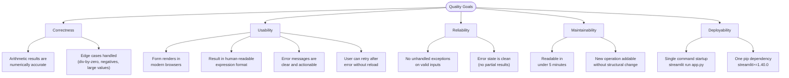

### 10.2 Quality Scenarios

| ID | Quality Attribute | Stimulus | Expected Response | Measure |
|----|-------------------|----------|-------------------|---------|
| QS-1 | **Correctness** | User enters `7.5` and `2.5`, selects Multiply | Result: `7.5 × 2.5 = 18.75` | Zero tolerance for incorrect output |
| QS-2 | **Correctness** | User enters any value divided by `0.0` | Error banner shown; no result rendered | `st.error` visible, `st.success` absent |
| QS-3 | **Usability** | New user opens the app for the first time | User successfully performs a calculation | Within 30 seconds with no instructions |
| QS-4 | **Usability** | User makes a div-by-zero error | Error message shown; user can correct and resubmit | No page reload required |
| QS-5 | **Reliability** | User enters very large floats (e.g., `1e308`) | No Python exception; result renders (or `inf` displayed) | No unhandled `OverflowError` crash |
| QS-6 | **Maintainability** | Developer adds a "Modulo" operation | Change touches one `selectbox` tuple + one `elif` branch | ≤ 5 lines changed |
| QS-7 | **Deployability** | Fresh Python 3.10 environment | App running and accessible | `pip install` + `streamlit run` ≤ 60 seconds |
| QS-8 | **Performance** | User clicks "Calculate" on localhost | Result appears in browser | ≤ 500 ms round-trip |

---

## 11. Risks and Technical Debt

### 11.1 Technical Risks

| ID | Risk | Probability | Impact | Mitigation |
|----|------|-------------|--------|------------|
| R-001 | **Floating-point precision** gives unexpected results for certain inputs (e.g., `0.1 + 0.2 = 0.30000000000000004`) | High (inherent to IEEE 754) | Low (cosmetic inaccuracy) | Document behaviour; use `decimal.Decimal` if precision is business-critical |
| R-002 | **`st.stop()` halts all code** — future widgets added after the error block will silently not render | Medium | Medium | Add clear code comment; consider early-return pattern in refactor |
| R-003 | **Streamlit breaking API changes** in a future major version could require migration | Low | Medium | Pin to tested version range; monitor Streamlit changelog |
| R-004 | **`float` overflow / `inf` result** when user enters `1e309` — Python returns `inf` silently | Medium | Low | Add input range validation or display informative `inf` message |
| R-005 | **No test coverage** — arithmetic dispatch bugs could go undetected | High (no tests exist) | Medium | Add `pytest` unit tests for all four operations and div-by-zero path |

### 11.2 Technical Debt

| ID | Type | Description | Priority | Estimated Effort |
|----|------|-------------|----------|-----------------|
| TD-001 | **Test Debt** | No unit or integration tests exist. Arithmetic logic and error handling are untested outside manual browser interaction | 🔴 High | 2–3 hours |
| TD-002 | **Scalability Debt** | `if/elif/else` dispatch is not extensible beyond 5–6 operations; a dictionary dispatch table (`{op: (func, symbol)}`) would be more maintainable | 🟡 Medium | 1 hour |
| TD-003 | **Validation Debt** | Input range is unbounded; `inf`, `-inf`, and `nan` inputs are not handled explicitly and produce confusing output | 🟡 Medium | 1–2 hours |
| TD-004 | **Documentation Debt** | No inline code comments; newcomers must infer the Streamlit re-run model without in-code explanation | 🟢 Low | 30 minutes |
| TD-005 | **Feature Debt** | No calculation history; each session starts fresh with no ability to review previous results | 🟢 Low | 2–3 hours (using `st.session_state`) |
| TD-006 | **Security Debt** | No HTTPS, no authentication, no rate limiting — acceptable for localhost but must be addressed before public deployment | 🔴 High (if deploying publicly) | Depends on deployment target |
| TD-007 | **Observability Debt** | No application-level logging, no usage metrics — difficult to diagnose issues in production | 🟡 Medium | 2–4 hours |

### 11.3 Improvement Recommendations

| Priority | Recommendation | Benefit | Estimated Effort |
|----------|---------------|---------|-----------------|
| 1 | **Add `pytest` test suite** covering all four operations and div-by-zero | Regression safety; documents expected behaviour | 2–3 hours |
| 2 | **Add HTTPS / reverse proxy config** if deploying publicly | Encrypted traffic; domain binding | Variable |
| 3 | **Refactor dispatch to dictionary map** `{op: (func, symbol)}` | New operation = 1 dict entry; eliminates `elif` chain | 1 hour |
| 4 | **Add input range validation** with messages for `inf`/`nan`/overflow | Improved edge-case UX | 1–2 hours |
| 5 | **Add `st.session_state` calculation history** showing last N results | Significant UX improvement at minimal code cost | 2–3 hours |
| 6 | **Containerise with Docker** (`Dockerfile` + `docker-compose.yml`) | Reproducible deployments; environment isolation | 1–2 hours |

---

## 12. Glossary

### 12.1 Domain Terms

| Term | Definition |
|------|------------|
| **Operand** | A numeric value on which an arithmetic operation is performed (`num1`, `num2`) |
| **Operation** | An arithmetic action applied to two operands: Add (`+`), Subtract (`−`), Multiply (`×`), or Divide (`÷`) |
| **Result** | The numeric value produced by applying the selected operation to the two operands |
| **Division by zero** | An undefined mathematical operation where the divisor (second operand) equals zero; treated as an input error |
| **Expression** | The human-readable representation of a calculation, e.g., `10.5 ÷ 3.0 = 3.5` |
| **Computation details** | The structured breakdown of a calculation (all inputs, operation name, result) shown in the expandable panel |
| **Symbol** | The operator character used in the displayed expression: `+`, `-`, `×`, or `÷` |

### 12.2 Technical Terms

| Term | Definition |
|------|------------|
| **Streamlit** | An open-source Python library for building web applications purely in Python, without HTML, CSS, or JavaScript |
| **`st.form`** | A Streamlit context manager that groups widgets and defers submission until the user clicks the submit button |
| **`st.form_submit_button`** | A submit button inside `st.form` that triggers script re-execution with the committed form values |
| **`st.number_input`** | A Streamlit widget that renders a numeric browser input and returns the value as a Python `float` |
| **`st.selectbox`** | A Streamlit widget that renders a dropdown menu and returns the selected option as a Python `str` |
| **`st.success`** | A Streamlit function that renders a green success-styled message banner |
| **`st.error`** | A Streamlit function that renders a red error-styled message banner |
| **`st.expander`** | A Streamlit context manager that renders a collapsible/expandable UI section |
| **`st.stop`** | A Streamlit function that immediately halts further script execution and rendering for the current run |
| **Re-run** | Streamlit's execution model: the entire `app.py` script is re-executed top-to-bottom on every user interaction |
| **Session state** | Streamlit's mechanism for persisting Python values across re-runs within a single browser session |
| **WebSocket** | The bidirectional communication protocol between the browser and Streamlit server for real-time UI updates |
| **Tornado** | The Python async web framework used internally by Streamlit to serve HTTP requests and WebSocket connections |
| **IEEE 754** | The international floating-point arithmetic standard; defines Python's native `float` type behaviour including rounding |
| **`float`** | Python's 64-bit double-precision IEEE 754 floating-point numeric type; used for all arithmetic in this application |
| **ADR** | Architecture Decision Record — a document capturing a significant architectural decision, its context, rationale, and trade-offs |
| **`st.set_page_config`** | A Streamlit function that configures browser-level page properties (tab title, favicon, layout mode) |

---

## Appendix

### A. File Inventory

| File | Type | Language | Purpose |
|------|------|----------|---------|
| `app.py` | Application source | Python 3 | Complete application — UI, computation logic, and output rendering (~50 lines) |
| `requirements.txt` | Dependency manifest | Plain text | Declares `streamlit>=1.40.0` as the sole Python dependency |
| `README.md` | Project documentation | Markdown | Setup instructions and run command |

### B. Dependency Details

| Package | Version Constraint | Role | Transitive Dependencies Include |
|---------|-------------------|------|--------------------------------|
| `streamlit` | `>=1.40.0` | Web framework + HTTP server + widget library | Tornado, Altair, Pandas, Pillow, Protobuf, Click, TOML |

### C. API Call Inventory

The following Streamlit API calls are made in `app.py`:

| API Call | Location | Purpose |
|----------|----------|---------|
| `st.set_page_config(...)` | Line 3 | Browser tab title, favicon, centred layout |
| `st.title(...)` | Line 5 | Page heading |
| `st.caption(...)` | Line 6 | Subheading description |
| `st.form(...)` | Line 8 | Input grouping context manager |
| `st.columns(2)` | Line 9 | Two-column layout |
| `st.number_input(...)` × 2 | Lines 12, 13 | First and second operand inputs |
| `st.selectbox(...)` | Lines 16–20 | Operation selector dropdown |
| `st.form_submit_button(...)` | Line 22 | Form submission trigger |
| `st.error(...)` | Line 37 | Division-by-zero error banner |
| `st.stop()` | Line 38 | Halt execution after error |
| `st.success(...)` | Line 41 | Result success banner |
| `st.expander(...)` | Line 43 | Collapsible details panel |
| `st.write(...)` | Lines 44–49 | Structured computation details output |

### D. Analysis Metadata

| Property | Value |
|----------|-------|
| **Documentation Date** | 2025-01-15 |
| **Source Files Analyzed** | 3 (`app.py`, `requirements.txt`, `README.md`) |
| **Lines of Application Code** | 50 |
| **Arc42 Sections Completed** | 12 / 12 |
| **Mermaid Diagrams Included** | 14 |
| **ADRs Documented** | 5 (ADR-001 through ADR-005) |
| **Quality Scenarios** | 8 (QS-1 through QS-8) |
| **Risks Identified** | 5 (R-001 through R-005) |
| **Technical Debt Items** | 7 (TD-001 through TD-007) |
| **Skills Applied** | `arc42-template`, `mermaid-diagrams`, `geninsights-logging` |
| **Generator** | GenInsights Arc42 Agent v1.0 |

---

*This document was automatically generated from source code analysis by the GenInsights Arc42 Agent.*  
*Based on the arc42 architecture documentation template — © arc42.org (Creative Commons)*
