# Architecture Documentation (Arc42)

**Project**: Streamlit Calculator Web Application  
**Version**: 1.0.0  
**Date**: 2025-01-01  
**Generated by**: Arc42 Documentation Generator  
**Source**: `app.py`, `requirements.txt`

---

## Table of Contents

1. [Introduction and Goals](#1-introduction-and-goals)
2. [Architecture Constraints](#2-architecture-constraints)
3. [Context and Scope](#3-context-and-scope)
4. [Solution Strategy](#4-solution-strategy)
5. [Building Block View](#5-building-block-view)
6. [Runtime View](#6-runtime-view)
7. [Deployment View](#7-deployment-view)
8. [Crosscutting Concepts](#8-crosscutting-concepts)
9. [Architectural Decisions](#9-architectural-decisions)
10. [Quality Requirements](#10-quality-requirements)
11. [Risks and Technical Debt](#11-risks-and-technical-debt)
12. [Glossary](#12-glossary)

---

## 1. Introduction and Goals

### 1.1 Purpose and Overview

The **Streamlit Calculator Web Application** is a lightweight, browser-based arithmetic tool that enables users to perform the four fundamental arithmetic operations — Addition, Subtraction, Multiplication, and Division — on two floating-point numbers through a clean, interactive web interface.

The application is intentionally minimal: a single Python source file (`app.py`) leverages the [Streamlit](https://streamlit.io) framework to serve both the web UI and the computation logic with no separate backend, no database, and no external API dependencies.

### 1.2 Goals

| ID   | Goal                         | Description                                                                                       |
|------|------------------------------|---------------------------------------------------------------------------------------------------|
| G-01 | Arithmetic Correctness       | Produce accurate floating-point results for Add, Subtract, Multiply, and Divide operations.       |
| G-02 | Usability                    | Provide a self-explanatory UI that requires no training or documentation to operate.              |
| G-03 | Safety / Input Validation    | Prevent undefined behaviour (e.g. division by zero) and communicate errors clearly to the user.  |
| G-04 | Simplicity & Maintainability | Keep the codebase as small as possible so it is easy to read, extend, and deploy.                |
| G-05 | Fast Startup                 | Be runnable with a single `streamlit run app.py` command after installing one dependency.         |

### 1.3 Quality Goals

The top quality requirements, in priority order:

| Priority | Quality Attribute | Motivation                                                                  |
|----------|-------------------|-----------------------------------------------------------------------------|
| 1        | Correctness        | Arithmetic errors directly undermine the system's only purpose.             |
| 2        | Usability          | The target audience is general users; no technical knowledge assumed.        |
| 3        | Reliability        | Division-by-zero and other edge cases must never crash the application.     |
| 4        | Maintainability    | Single-developer project; code should remain comprehensible over time.       |
| 5        | Deployability      | Must be runnable locally and on common Python-capable cloud platforms.      |

### 1.4 Stakeholders

| Role              | Expectation                                                                      |
|-------------------|----------------------------------------------------------------------------------|
| End User          | Quickly compute arithmetic results in a browser without installing any software. |
| Developer         | Extend or modify calculations, add new operations, or deploy the app to cloud.   |
| DevOps / Platform | Run the app on a Python-capable host with a single command.                      |

---

## 2. Architecture Constraints

### 2.1 Technical Constraints

| ID    | Constraint                       | Rationale / Source                                                                  |
|-------|----------------------------------|-------------------------------------------------------------------------------------|
| TC-01 | Python ≥ 3.8 runtime             | Required by Streamlit ≥ 1.40.0 (`requirements.txt`).                               |
| TC-02 | Streamlit ≥ 1.40.0               | Sole declared dependency (`requirements.txt`). All UI primitives are Streamlit.    |
| TC-03 | Single-file architecture         | All logic resides in `app.py`; no package structure or sub-modules.                 |
| TC-04 | No persistent data store         | The application is stateless between sessions; no database or file I/O.             |
| TC-05 | No external API calls            | All computation is performed in-process using Python built-in arithmetic.           |
| TC-06 | Browser-based delivery           | Streamlit renders the UI in the user's web browser via its built-in HTTP server.   |
| TC-07 | Float64 numeric precision        | Numbers are represented as Python `float` (IEEE 754 double precision).              |

### 2.2 Organisational Constraints

| ID    | Constraint                           | Rationale                                                        |
|-------|--------------------------------------|------------------------------------------------------------------|
| OC-01 | Minimal dependency footprint         | Only one third-party package to reduce supply-chain risk.        |
| OC-02 | No authentication or multi-tenancy   | Single-user, local-first usage model assumed.                    |
| OC-03 | Open source / self-hosted            | No SaaS subscription required; runs on any Python environment.  |

### 2.3 Conventions

| ID    | Convention                           | Details                                                          |
|-------|--------------------------------------|------------------------------------------------------------------|
| CV-01 | PEP 8 style                          | Standard Python naming and formatting conventions.               |
| CV-02 | Streamlit form pattern               | All inputs grouped inside `st.form` to batch submissions.        |
| CV-03 | Inline error handling                | `st.error()` + `st.stop()` used to surface validation failures.  |

---

## 3. Context and Scope

### 3.1 Business Context

The calculator operates in a single-actor, browser-server model. The only external actor is the **End User** who interacts with the application through a web browser. There are no integrations with external systems, APIs, or data stores.

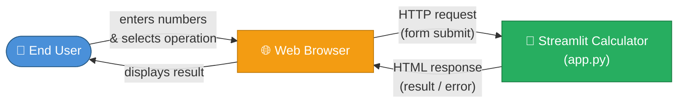

**External Interfaces:**

| Interface       | Direction  | Protocol   | Description                                                                          |
|-----------------|------------|------------|--------------------------------------------------------------------------------------|
| Browser ↔ App  | Bidirect.  | HTTP / WS  | Streamlit serves the UI over HTTP; WebSocket is used for reactive state sync.        |

### 3.2 Technical Context

From an infrastructure perspective the system is a single process. Streamlit's built-in server handles HTTP and WebSocket connections; there is no reverse proxy, load balancer, or external service involved in the minimal local-run scenario.

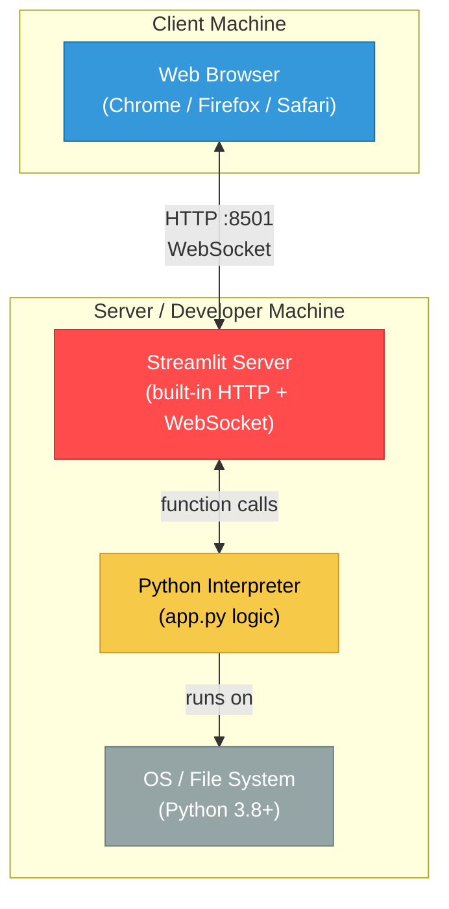

---

## 4. Solution Strategy

### 4.1 Technology Decisions

| Decision                  | Choice                           | Rationale                                                                                         |
|---------------------------|----------------------------------|---------------------------------------------------------------------------------------------------|
| Web framework             | **Streamlit**                    | Zero-boilerplate UI for Python data apps; no HTML/CSS/JS required; built-in reactive state.       |
| Programming language      | **Python 3**                     | Ubiquitous in data/tooling space; native float arithmetic; vast ecosystem.                        |
| Architecture style        | **Single-file script**           | Complexity does not warrant modules/packages; promotes readability and portability.               |
| State management          | **Streamlit session (implicit)** | Form submission handled natively by Streamlit; no manual state wiring needed.                    |
| Persistence               | **None**                         | Calculator results are ephemeral; no storage requirement identified.                              |
| Dependency management     | **pip + requirements.txt**       | Simplest possible approach; no build tool overhead.                                               |

### 4.2 Top-Level Decomposition Strategy

The system follows a **linear scripted execution** model characteristic of Streamlit apps:

1. **Page configuration** — sets browser tab title, icon, and layout.
2. **Input collection** — a Streamlit `form` captures two numbers and an operation selector.
3. **Computation** — Python arithmetic is applied when the form is submitted.
4. **Output rendering** — results or error messages are displayed via Streamlit widgets.

This is a deliberate non-layered, non-OOP design that prioritises brevity over extensibility.

### 4.3 Achieving Quality Goals

| Quality Goal    | Strategy                                                                                     |
|-----------------|----------------------------------------------------------------------------------------------|
| Correctness     | Delegate arithmetic to Python's native float operators; validate edge cases explicitly.      |
| Usability       | Use Streamlit's opinionated, accessible widget set; two-column layout keeps UI scannable.    |
| Reliability     | Guard division-by-zero with an explicit check before any division; halt rendering with `st.stop()`. |
| Maintainability | Keep all logic in one file (~50 lines); no hidden framework magic.                           |
| Deployability   | Single `streamlit run app.py` command; compatible with Streamlit Community Cloud and Docker. |

---

## 5. Building Block View

### 5.1 Level 1 — System as a Black Box

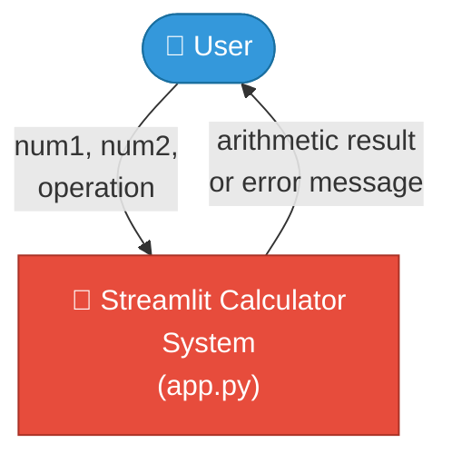

**Responsibility**: Accept two numbers and an arithmetic operation from a user, compute the result, and display it (or a descriptive error).

### 5.2 Level 2 — Internal White Box

Although the application resides in a single file, it has four clearly identifiable logical blocks:

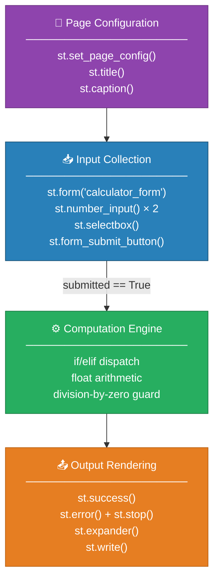

| Block               | `app.py` Lines | Responsibility                                                                    |
|---------------------|----------------|-----------------------------------------------------------------------------------|
| Page Configuration  | 1–6            | Initialise Streamlit page metadata and render the app header and caption.         |
| Input Collection    | 8–22           | Render a form, collect `num1`, `num2`, and `operation`; return `submitted` flag.  |
| Computation Engine  | 24–39          | Branch on `operation`, compute `result`, set `symbol`; guard division by zero.    |
| Output Rendering    | 41–49          | Display success message and a collapsible computation detail panel.               |

### 5.3 Level 3 — Computation Engine Detail

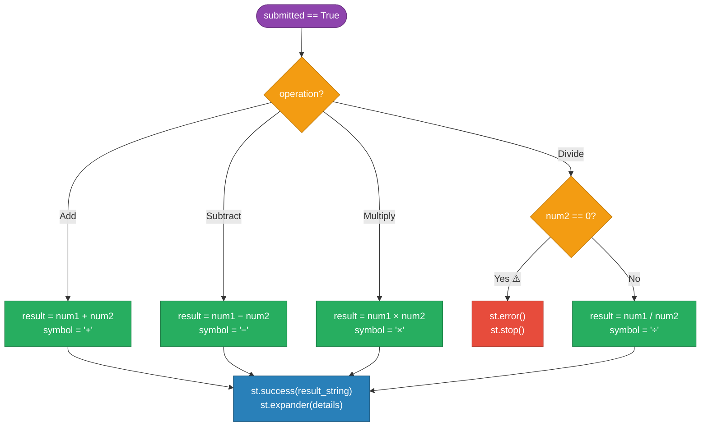

---

## 6. Runtime View

### 6.1 Scenario 1 — Successful Arithmetic Calculation

This is the happy-path scenario: a user enters two numbers, selects an operation, and receives a result.

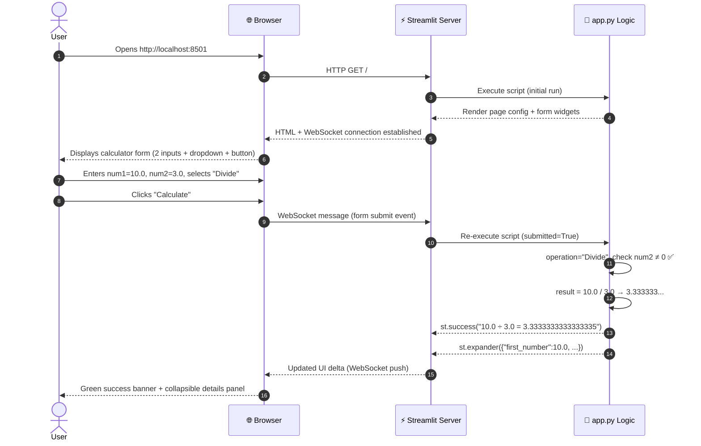

### 6.2 Scenario 2 — Division by Zero Error

```mermaid
sequenceDiagram
    autonumber
    actor User
    participant Browser as 🌐 Browser
    participant Streamlit as ⚡ Streamlit Server
    participant App as 🐍 app.py Logic

    User->>Browser: Enters num1=5.0, num2=0.0, selects "Divide"
    User->>Browser: Clicks "Calculate"
    Browser->>Streamlit: WebSocket message (form submit event)
    Streamlit->>App: Re-execute script (submitted=True)
    App->>App: operation="Divide", check num2 == 0 ⚠️
    App-->>Streamlit: st.error("Division by zero is not allowed.")
    App->>App: st.stop() — halts further execution
    Note over App: No result is computed or displayed
    Streamlit-->>Browser: Updated UI delta (error widget only)
    Browser-->>User: Red error banner; no result shown; form remains usable
```

### 6.3 Streamlit Execution Model

Streamlit re-runs the entire script top-to-bottom on every user interaction. The `st.form` wrapper batches input changes and only triggers a re-run on submit button click.

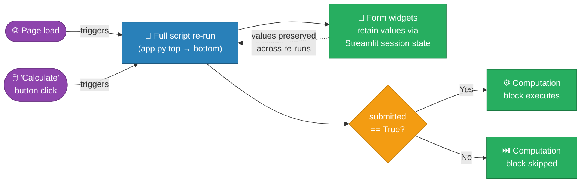

---

## 7. Deployment View

### 7.1 Local Development Deployment (Primary)

The standard and documented deployment model is a single developer/user machine running the Streamlit process directly.

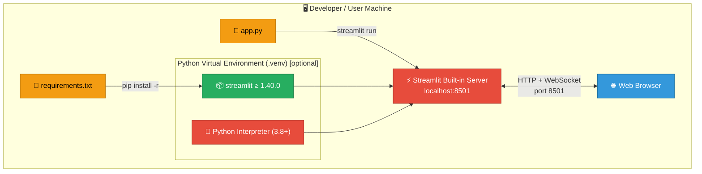

**Run Instructions** (from `README.md`):

```bash
# 1. Create and activate a virtual environment (recommended)
python3 -m venv .venv
source .venv/bin/activate   # Windows: .venv\Scripts\activate

# 2. Install the single dependency
pip install -r requirements.txt

# 3. Launch the app
streamlit run app.py
# → Open http://localhost:8501 in your browser
```

### 7.2 Cloud Deployment — Streamlit Community Cloud

The app is fully compatible with **Streamlit Community Cloud** without any code modifications.

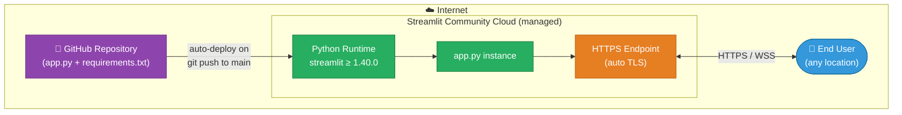

### 7.3 Container Deployment (Docker)

The app can be containerised for consistent deployment. Example `Dockerfile`:

```dockerfile
FROM python:3.11-slim
WORKDIR /app
COPY requirements.txt .
RUN pip install --no-cache-dir -r requirements.txt
COPY app.py .
EXPOSE 8501
CMD ["streamlit", "run", "app.py", "--server.address=0.0.0.0"]
```

### 7.4 Deployment Requirements Summary

| Requirement           | Minimum              | Notes                                              |
|-----------------------|----------------------|----------------------------------------------------|
| Python version        | 3.8                  | 3.10+ recommended for best Streamlit compatibility |
| RAM                   | ~100 MB              | Streamlit baseline; no data loaded into memory     |
| Disk                  | ~50 MB               | Python runtime + Streamlit package install         |
| Network port          | 8501/tcp             | Configurable via `--server.port` flag              |
| External dependencies | None                 | No database, no external APIs                      |
| OS                    | Windows / macOS / Linux | Python cross-platform compatibility             |

---

## 8. Crosscutting Concepts

### 8.1 UI / Interaction Pattern

The application exclusively uses the **Streamlit form pattern**:

- All inputs are wrapped in `st.form("calculator_form")`, which prevents Streamlit from re-running the script on each individual widget change (e.g. each keystroke in a number field).
- Only one interaction event triggers computation: clicking the **"Calculate"** submit button (`st.form_submit_button`).
- This pattern ensures the user experience is deterministic and avoids partial-state computation.
- The two-column layout (`st.columns(2)`) keeps both number inputs visually parallel and scannable.

### 8.2 Error Handling Strategy

| Error Condition      | Detection Method             | User-Facing Response                                                          |
|----------------------|------------------------------|-------------------------------------------------------------------------------|
| Division by zero     | `if num2 == 0` explicit check | `st.error("Division by zero is not allowed.")` red banner + `st.stop()`      |
| Non-numeric input    | Streamlit widget validation  | `st.number_input` rejects non-numeric characters at browser level            |
| Unhandled exception  | Python runtime               | Streamlit renders a traceback in the app (development mode)                  |

**Design choice**: No `try/except` blocks are used. The design relies on Streamlit's widget-level input validation and one explicit guard for the only arithmetic error case (division by zero). `st.stop()` ensures the result display block is never reached when an error occurs.

### 8.3 State Management

Streamlit apps are **stateless** at the application code level between interactions:

| Aspect                     | Behaviour                                                                      |
|----------------------------|--------------------------------------------------------------------------------|
| Script execution           | Entire `app.py` re-executes top-to-bottom on every user interaction            |
| Widget value persistence   | Streamlit preserves form input values internally across re-runs automatically  |
| Explicit `st.session_state` | Not used — not needed for this use case                                       |
| Result persistence         | Computation results are **not** stored; only shown for the current re-run      |
| Cross-session state        | None — each browser session is independent                                     |

### 8.4 Numeric Precision

All numbers use Python's native `float` type (IEEE 754 double precision, 64-bit):

- `st.number_input` is configured with `format="%.6f"` — displaying 6 decimal places in the input fields.
- Arithmetic is performed with Python's native `+`, `-`, `*`, `/` operators.
- No rounding is applied to the result; the full Python float representation is shown in the success message.
- Users should be aware of standard floating-point representation constraints (e.g. `0.1 + 0.2` does not equal `0.3` exactly in IEEE 754).

### 8.5 Security Model

| Concern              | Status      | Details                                                              |
|----------------------|-------------|----------------------------------------------------------------------|
| Input injection      | Not applicable | No string evaluation (`eval`/`exec`); all computation via typed float operators |
| Authentication       | None         | Intended for trusted local or single-team use; no user accounts     |
| Authorisation        | None         | Single-operation app with no privileged actions                     |
| Transport security   | None (local) | TLS available when deployed behind reverse proxy or on Community Cloud |
| Data privacy         | No data stored | No input is persisted to disk or transmitted to external services  |
| Dependency security  | Low risk      | Single dependency (`streamlit`); regularly audited open-source project |

### 8.6 Observability

| Capability    | Status     | Notes                                                                         |
|---------------|------------|-------------------------------------------------------------------------------|
| Logging       | None       | No application-level logging; Streamlit prints startup info to stdout         |
| Metrics       | None       | No performance or usage metrics collected                                     |
| Tracing       | None       | No distributed tracing (not applicable for single-process app)                |
| Error surfacing | Built-in | Streamlit renders Python tracebacks in the browser in development mode        |

---

## 9. Architectural Decisions

### ADR-001 — Use Streamlit as the Web Framework

| Attribute  | Value                |
|------------|----------------------|
| **Status** | Accepted             |
| **Date**   | Project inception    |

**Context**: A simple arithmetic web app is needed. Considered alternatives:
- Full-stack approach (Flask/FastAPI + HTML/CSS/JS frontend)
- Jupyter Notebook
- Desktop GUI (tkinter / PyQt)
- Python-first web framework (Streamlit, Gradio, Panel)

**Decision**: Use **Streamlit ≥ 1.40.0** as the sole UI and server framework.

**Consequences**:
- ✅ Zero frontend code required — no HTML, CSS, or JavaScript.
- ✅ Entire app in one ~50-line Python file.
- ✅ Built-in reactive state management with native form support.
- ✅ One-command deployment to Streamlit Community Cloud.
- ✅ Familiar to Python/data practitioners.
- ⚠️ Limited UI customisation compared to a full frontend framework.
- ⚠️ Streamlit's full-script re-run model can be unintuitive for developers unfamiliar with it.
- ⚠️ Not suitable for high-concurrency production use without additional infrastructure (e.g. multiple workers).

---

### ADR-002 — Single-File Architecture

| Attribute  | Value                |
|------------|----------------------|
| **Status** | Accepted             |
| **Date**   | Project inception    |

**Context**: The application's computation logic is ~25 lines of branching arithmetic. Creating a package structure (e.g. `src/calculator/operations.py`, `src/calculator/ui.py`) would introduce organisational overhead disproportionate to the complexity.

**Decision**: All code resides in a single file, `app.py`.

**Consequences**:
- ✅ Maximum readability — the entire system is understood by reading one file.
- ✅ Zero import graph complexity; no circular dependency risk.
- ✅ Simple to share, copy, and deploy.
- ⚠️ Will not scale gracefully if operations or UI elements grow significantly (see TD-02).

---

### ADR-003 — Use `st.form` to Batch Input Submission

| Attribute  | Value                |
|------------|----------------------|
| **Status** | Accepted             |
| **Date**   | Project inception    |

**Context**: Without a form wrapper, Streamlit re-runs the script on every widget interaction (each keypress in `st.number_input`). This triggers premature computation with partially entered inputs, producing confusing intermediate results.

**Decision**: Wrap all inputs in `st.form("calculator_form")` and compute only when `submitted == True`.

**Consequences**:
- ✅ Computation only happens on intentional user action (clicking "Calculate").
- ✅ Prevents display of intermediate/invalid results during typing.
- ✅ UX behaves like a familiar, traditional HTML form submission.

---

### ADR-004 — Explicit Division-by-Zero Guard

| Attribute  | Value                |
|------------|----------------------|
| **Status** | Accepted             |
| **Date**   | Project inception    |

**Context**: Python raises `ZeroDivisionError` if division by zero is attempted. Without handling, this would surface as a Streamlit error screen (traceback) rather than a friendly user message.

**Decision**: Check `if num2 == 0` before performing division and surface a user-friendly error using `st.error()` followed by `st.stop()`.

**Consequences**:
- ✅ Users see a clear, actionable error message in the UI.
- ✅ Application remains fully responsive after the error; no crash or page reload required.
- ✅ `st.stop()` prevents the result block from rendering with stale or undefined values.
- ⚠️ Only division-by-zero is guarded; extremely large numbers producing `inf` or `nan` are not currently handled.

---

## 10. Quality Requirements

### 10.1 Quality Tree

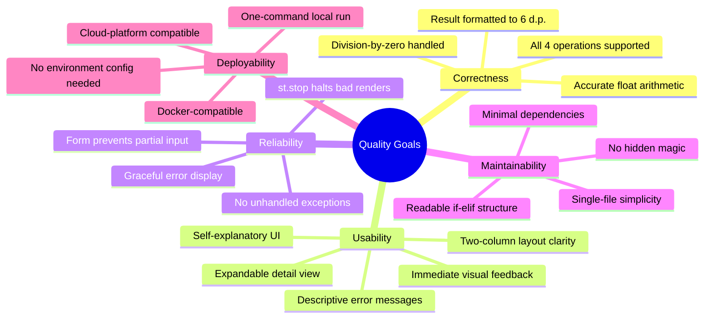

### 10.2 Quality Scenarios

| ID    | Quality Attribute | Stimulus                              | Response                                                         | Measurable Outcome                       |
|-------|-------------------|---------------------------------------|------------------------------------------------------------------|------------------------------------------|
| QS-01 | Correctness       | User computes 10 ÷ 3                  | Result displays `3.3333333333333335`                             | Matches Python `10.0 / 3.0`              |
| QS-02 | Correctness       | User computes 0.1 + 0.2               | Result displays Python's float result                            | No application error; result is numeric  |
| QS-03 | Reliability       | User attempts division by zero        | Red error banner shown; app remains usable                       | `st.stop()` called; no traceback visible |
| QS-04 | Usability         | First-time user opens the app         | User submits a calculation without reading any documentation     | Task completion in < 30 seconds          |
| QS-05 | Deployability     | Developer clones repo & starts app    | App running in browser after `pip install` + `streamlit run`     | Operational in < 2 minutes               |
| QS-06 | Maintainability   | Developer adds a "Modulo" operation   | Change requires ≤ 5 lines of code in one file                   | No structural refactoring needed         |

### 10.3 Code Quality Assessment

| Metric                    | Value / Status | Notes                                                            |
|---------------------------|----------------|------------------------------------------------------------------|
| Lines of code (app.py)    | ~50            | Highly concise; single responsibility.                           |
| Cyclomatic complexity     | ~5             | One if/elif chain with 4 branches + 1 nested condition.          |
| Number of functions       | 0              | Procedural script; no named functions or classes.                |
| Dependency count          | 1 (streamlit)  | Minimal; greatly reduces supply-chain and maintenance burden.    |
| Automated test coverage   | 0%             | No test suite present (see TD-01).                               |
| Inline documentation      | Minimal        | `st.caption()` provides brief UI description; no docstrings needed. |
| Error handling coverage   | Partial        | Division-by-zero covered; overflow/NaN not guarded.             |

---

## 11. Risks and Technical Debt

### 11.1 Risk Register

| ID   | Risk                               | Likelihood | Impact | Severity    | Mitigation Strategy                                                                      |
|------|------------------------------------|------------|--------|-------------|------------------------------------------------------------------------------------------|
| R-01 | No automated tests                 | High       | Medium | 🟡 Medium   | Add `pytest` unit tests for computation logic; use `streamlit.testing.v1` for UI tests. |
| R-02 | Single-file scalability ceiling    | Medium     | Low    | 🟢 Low      | Acceptable now; refactor into a package structure if operations exceed ~10.              |
| R-03 | Float precision surprises          | Medium     | Low    | 🟢 Low      | Add a UI tooltip/note about IEEE 754 limits; optionally offer `decimal.Decimal` mode.   |
| R-04 | Streamlit API breaking changes     | Low        | Medium | 🟢 Low      | `>=1.40.0` pin is flexible; add CI to test against new Streamlit releases on PyPI.       |
| R-05 | No HTTPS in local deployment       | Low        | Low    | 🟢 Low      | Deploy behind an nginx/Caddy TLS-terminating reverse proxy for shared/team use.         |
| R-06 | Silent overflow to `inf` / `nan`   | Low        | Low    | 🟢 Low      | Python float silently produces `inf` for large multiplications; add guard if needed.    |
| R-07 | Single-point-of-failure deployment | Low        | Low    | 🟢 Low      | No redundancy; acceptable for local/dev use. Add load balancer for production.          |

### 11.2 Technical Debt Items

| ID    | Item                          | Effort  | Priority | Description                                                                                  |
|-------|-------------------------------|---------|----------|----------------------------------------------------------------------------------------------|
| TD-01 | No unit tests                 | Small   | High     | The computation block (lines 24–39) is pure, side-effect-free logic — trivially testable with `pytest`. A `tests/test_operations.py` file would take < 30 minutes to write. |
| TD-02 | Hardcoded operation strings   | Trivial | Low      | `"Add"`, `"Subtract"`, `"Multiply"`, `"Divide"` appear in both the `selectbox` list and `if/elif` branches. An `Enum` or dict-dispatch approach would eliminate potential drift. |
| TD-03 | No type annotations           | Trivial | Low      | Adding `float` type hints (e.g. `num1: float`) would improve IDE support and serve as inline documentation. |
| TD-04 | No CI/CD pipeline             | Medium  | Medium   | A GitHub Actions workflow (`.github/workflows/ci.yml`) for linting (`ruff`) and unit testing would prevent regressions on every push. |
| TD-05 | No `pyproject.toml`           | Trivial | Low      | Modern Python projects benefit from `pyproject.toml` for tooling configuration (ruff, pytest, mypy). |

### 11.3 Recommended Improvement Roadmap

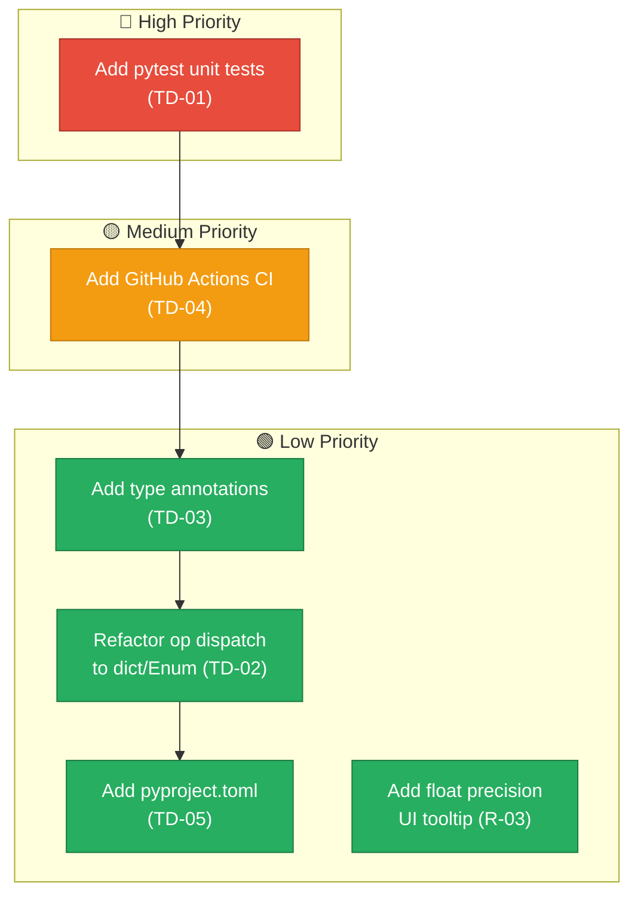

---

## 12. Glossary

| Term                         | Definition                                                                                              |
|------------------------------|---------------------------------------------------------------------------------------------------------|
| **app.py**                   | The single Python source file containing the entire Streamlit Calculator application (~50 lines).       |
| **Streamlit**                | An open-source Python framework for building interactive web applications using only Python code. No HTML/CSS/JS required. |
| **Widget**                   | A Streamlit UI element (e.g. `st.number_input`, `st.selectbox`, `st.button`) rendered in the browser and interacted with by the user. |
| **Form (`st.form`)**         | A Streamlit construct that groups input widgets and defers script re-runs until a submit button is clicked, preventing partial-input execution. |
| **Script re-run**            | Streamlit's core execution model: the entire Python script (`app.py`) is re-executed from top to bottom on every user interaction. |
| **Session State**            | Streamlit's built-in mechanism for persisting data across script re-runs within the same browser session. Not explicitly used in this app. |
| **`st.stop()`**              | A Streamlit function that immediately halts execution of the current script re-run, preventing any further widget rendering below the call site. |
| **`submitted`**              | Boolean return value of `st.form_submit_button()`; evaluates to `True` only during the re-run triggered by clicking "Calculate". |
| **`num1` / `num2`**          | Variable names holding the first and second numeric inputs captured from `st.number_input` widgets.     |
| **`result`**                 | Variable holding the computed arithmetic result, assigned inside the if/elif dispatch block.            |
| **`symbol`**                 | Unicode operator character (`+`, `−`, `×`, `÷`) used in the formatted success result string.           |
| **Operation**                | One of four arithmetic functions available: Add (+), Subtract (−), Multiply (×), Divide (÷). Selected via the `st.selectbox` dropdown. |
| **Division by Zero**         | The undefined arithmetic operation of dividing any number by zero; guarded explicitly before `num1 / num2`. |
| **Float (IEEE 754)**         | Python's built-in `float` type — a 64-bit double-precision floating-point number conforming to IEEE 754. Subject to known representation limits. |
| **Expander (`st.expander`)** | A Streamlit widget that renders a collapsible panel. Used to show computation detail (inputs, operation, result as a dict) without cluttering the main UI. |
| **`format="%.6f"`**          | The `st.number_input` format string specifying that numbers are displayed with 6 decimal places in the input fields. |
| **Streamlit Community Cloud** | Streamlit's free managed hosting platform that automatically deploys apps directly from a GitHub repository. |
| **`requirements.txt`**       | Standard Python dependency file listing `streamlit>=1.40.0` as the only required package.              |
| **ADR**                      | Architecture Decision Record — a concise document capturing a significant architectural choice, its context, alternatives considered, and consequences. |
| **Arc42**                    | A pragmatic, open-source template for documenting software and system architectures, structured in 12 standardised sections. |
| **PEP 8**                    | Python Enhancement Proposal 8 — the official Python style guide covering naming conventions, formatting, and code layout. |
| **IEEE 754**                 | The international standard for floating-point arithmetic, defining how decimal fractions are stored and computed in binary. |

---

*End of Arc42 Architecture Documentation*  
*Streamlit Calculator Web Application — v1.0.0*
