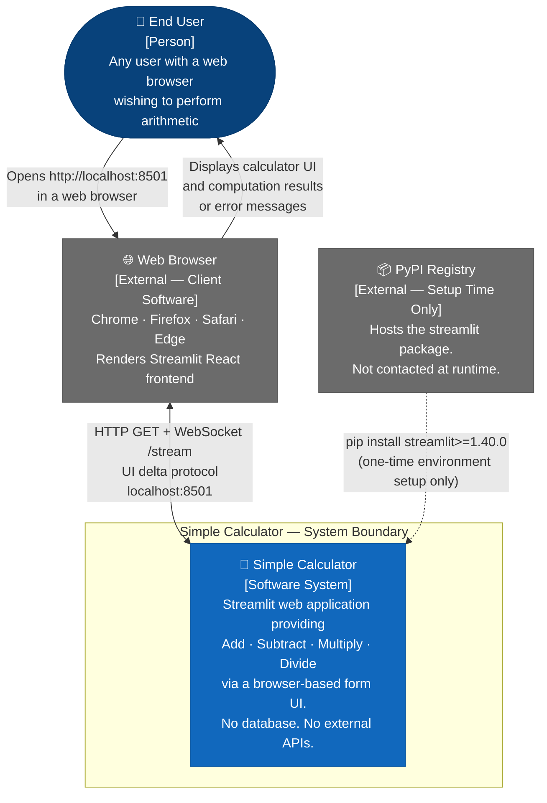
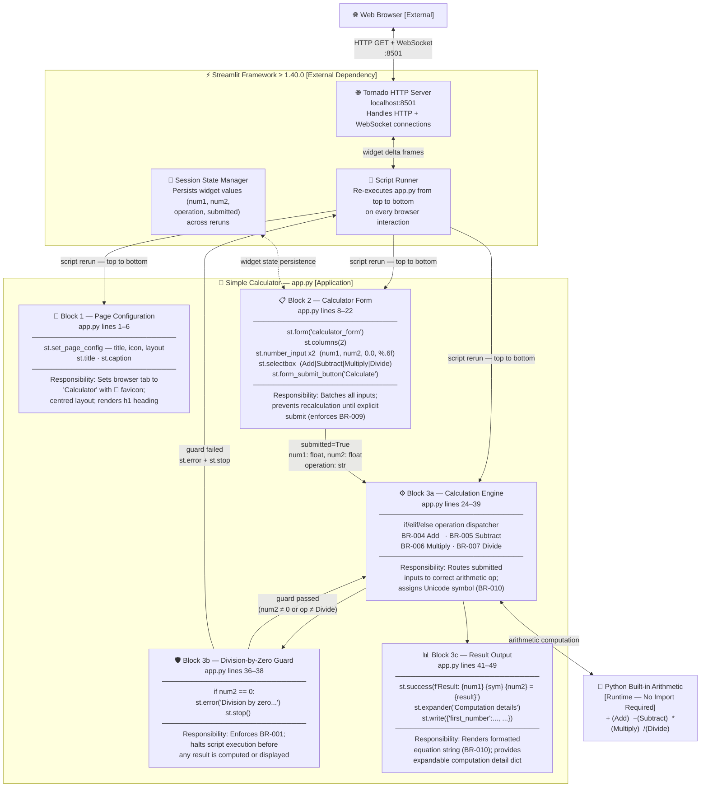
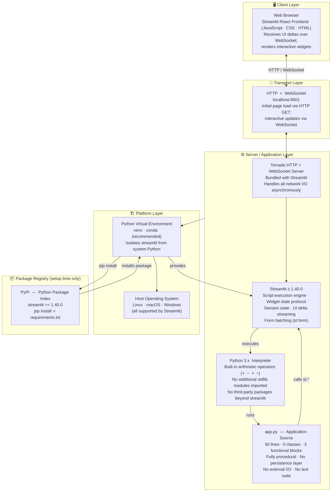
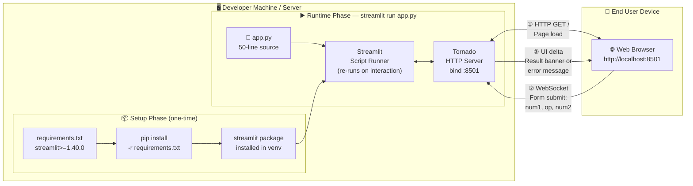
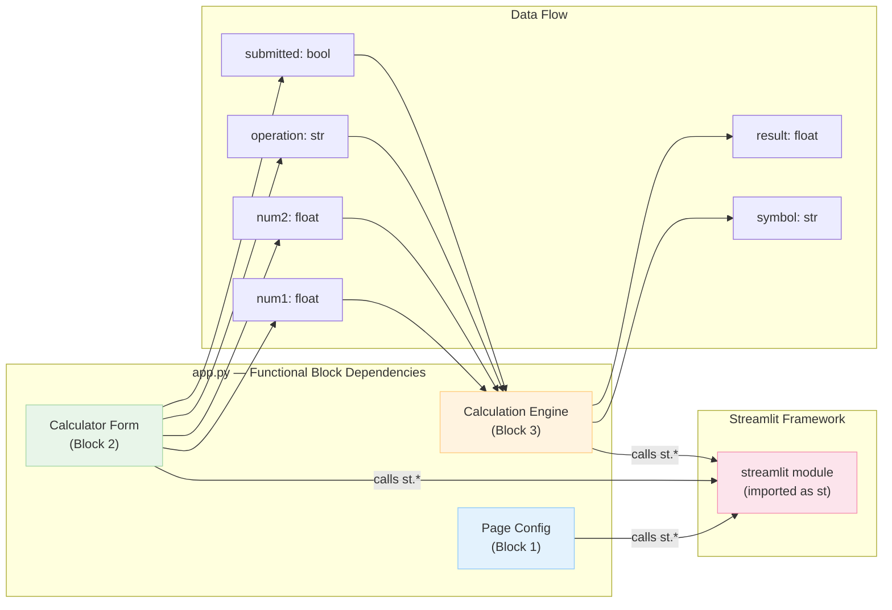

# Architecture Documentation — Simple Calculator

> **Intended path:** `.geninsights/docs/architecture-diagrams.md`
> **Actual path:** `geninsights-architecture-diagrams.md` (repository root)
> Written here because the `.geninsights/` directory cannot be auto-created by the agent runtime.

**Generated by:** architecture-agent  
**Generated at:** 2026-02-05T18:00:00Z  
**Source file:** `app.py` (50 lines, Python, Streamlit ≥ 1.40.0)  
**Prior analysis consumed:** documentor-agent · business-rules-agent · code-assessment-agent  
**Skills used:** mermaid-diagrams · geninsights-logging · json-output-schemas

---

## System at a Glance

| Aspect | Value |
|--------|-------|
| **Architecture Style** | Single-File Procedural Monolith |
| **Primary Language** | Python 3.x |
| **Key Framework** | Streamlit ≥ 1.40.0 |
| **Execution Model** | Reactive script re-run (Streamlit's stateless model) |
| **Data Storage** | None — all computation is in-memory, ephemeral |
| **External APIs** | None — fully self-contained at runtime |
| **Authentication** | None |
| **Deployment** | `streamlit run app.py` → Tornado HTTP server → localhost:8501 |
| **Health Score** | 62 / 100 (primary risk: zero test coverage) |
| **Lines of Code** | 50 (1 source file, 0 classes, 3 functional blocks) |

---

## Diagram 1 — System Context (C4 Level 1)

> **What this shows:** The Simple Calculator placed in its operating environment. Who uses it, how they access it, and what external systems it touches (at setup time vs. runtime).



### Context Notes

| Element | Type | Role | Runtime? |
|---------|------|------|----------|
| **End User** | Person | Enters operands and operation; reads result | ✅ Yes |
| **Simple Calculator** | Software System | Executes arithmetic; enforces business rules (BR-001–BR-010) | ✅ Yes |
| **Web Browser** | External Client | Renders the Streamlit React frontend; proxies user interactions | ✅ Yes |
| **PyPI Registry** | External System | Provides `streamlit` package via `pip install` | ❌ Setup only |

> **Key insight:** At runtime, the Simple Calculator has **zero external system dependencies** — no database, no authentication service, no third-party API. All computation is in-process Python arithmetic.

---

## Diagram 2 — Component Architecture (C4 Level 2)

> **What this shows:** The internal structure of `app.py`. Three functional blocks are identified (matching the procedural top-to-bottom script layout) plus the Streamlit framework components they rely on.



### Component Summary

| Component | Block | Lines | Key Streamlit APIs | Responsibility |
|-----------|-------|-------|--------------------|----------------|
| **Page Configuration** | Block 1 | 1–6 | `st.set_page_config`, `st.title`, `st.caption` | Page identity, layout, heading |
| **Calculator Form** | Block 2 | 8–22 | `st.form`, `st.columns`, `st.number_input`, `st.selectbox`, `st.form_submit_button` | Input collection, submission gate |
| **Calculation Engine** | Block 3a | 24–39 | Python `if/elif/else` | Operation dispatch, symbol assignment |
| **Division-by-Zero Guard** | Block 3b | 36–38 | `st.error`, `st.stop` | BR-001 enforcement, early exit |
| **Result Output** | Block 3c | 41–49 | `st.success`, `st.expander`, `st.write` | Result display, detail expansion |
| **Streamlit Script Runner** | Framework | — | Internal | Re-runs script on every interaction |
| **Tornado HTTP Server** | Framework | — | Internal | HTTP/WebSocket transport on :8501 |
| **Session State Manager** | Framework | — | Internal | Preserves widget state across reruns |
| **Python Arithmetic** | Runtime | — | Built-in operators | Actual computation (+, -, *, /) |

---

## Diagram 3 — Technology Stack

> **What this shows:** The full technology stack from browser to Python runtime, layered top-to-bottom from client to execution environment.



### Technology Stack Reference

| Layer | Technology | Version | Role |
|-------|-----------|---------|------|
| **Client** | Web Browser (any modern) | — | Renders Streamlit React UI |
| **Client UI** | Streamlit React Frontend | Bundled with Streamlit | Widget rendering, WebSocket client |
| **Transport** | HTTP + WebSocket | — | Initial load + live updates |
| **Web Server** | Tornado (async HTTP) | Bundled with Streamlit | Network I/O layer |
| **App Framework** | Streamlit | ≥ 1.40.0 | Script runner, state, UI delta protocol |
| **Language** | Python | 3.x | Application runtime |
| **App Source** | app.py | — | 50-line procedural script |
| **Dependency Manifest** | requirements.txt | — | `streamlit>=1.40.0` (single dep) |
| **Package Registry** | PyPI | — | Hosts streamlit (setup time only) |
| **Isolation** | Python venv | — | Dependency isolation (recommended) |
| **Host OS** | Linux / macOS / Windows | — | Platform |

---

## Diagram 4 — Deployment Architecture

> **What this shows:** How the application is deployed from developer machine to browser. The setup phase (pip install) and the runtime phase (streamlit run) are shown separately.



### Deployment Notes

| Aspect | Detail |
|--------|--------|
| **Launch command** | `streamlit run app.py` |
| **Default URL** | `http://localhost:8501` |
| **Network binding** | `0.0.0.0:8501` (all interfaces) or `127.0.0.1:8501` (loopback) |
| **Processes** | 1 Python process (Streamlit + Tornado in same process) |
| **Concurrency** | Tornado handles multiple browser tabs via async I/O |
| **Persistence** | None — each script rerun is stateless (no DB, no file writes) |
| **Session isolation** | Each browser tab gets its own Streamlit session |
| **Scalability** | Single-process; no horizontal scaling mechanism present |
| **Production readiness** | Development/demo grade — no WSGI, no reverse proxy, no TLS configured |

---

## Architectural Patterns Identified

### 1. Reactive Script Re-run Model (Streamlit Native)

| Attribute | Value |
|-----------|-------|
| **Pattern** | Reactive Script Re-run |
| **Framework** | Streamlit |
| **Location** | Entire `app.py` |
| **Description** | On every user interaction (widget change, button click), Streamlit re-executes `app.py` from top to bottom. Widget values from the previous run are read from Session State and injected back. This stateless-script model eliminates explicit event handlers. |
| **Implication** | The execution order of code in `app.py` is the data flow. Block 1 → Block 2 → Block 3 is both the code order and the user-visible rendering order. |

### 2. Form Submission Gate (Streamlit `st.form`)

| Attribute | Value |
|-----------|-------|
| **Pattern** | Submission Gate / Input Batching |
| **Location** | `app.py` lines 8–22 |
| **Description** | `st.form` wraps all input widgets so that no script rerun (and therefore no calculation) occurs until the user explicitly clicks the "Calculate" submit button. Individual widget changes (typing a number, changing the operation dropdown) do not trigger recalculation. |
| **Business Rule** | Enforces BR-009 (Form Gate). |
| **Benefit** | Prevents partial-input calculations and race conditions in the reactive model. |

### 3. Guard Clause / Early Exit (BR-001)

| Attribute | Value |
|-----------|-------|
| **Pattern** | Guard Clause |
| **Location** | `app.py` lines 36–38 |
| **Description** | Before performing the Divide operation, the code checks `if num2 == 0` and calls `st.error()` + `st.stop()`. `st.stop()` is a Streamlit-specific mechanism that immediately halts the remainder of script execution — analogous to a guard clause / early return but at the framework level. |
| **Business Rule** | Enforces BR-001 (Division-by-Zero guard). |
| **Risk** | Implicit `else` branch for the Divide case (ISS-001): if the selectbox options ever expand, the final `else` would silently match the new operation and attempt division. |

### 4. Operation Dispatch via if/elif/else

| Attribute | Value |
|-----------|-------|
| **Pattern** | Conditional Dispatch |
| **Location** | `app.py` lines 25–39 |
| **Description** | A flat `if/elif/else` chain dispatches execution to the appropriate arithmetic branch based on the `operation` string. Each branch sets `result` and `symbol`. No polymorphism, no strategy objects, no dictionary dispatch — pure procedural. |
| **Implication** | Adding a 5th operation requires adding a new `elif` branch and updating the selectbox tuple. Low complexity now; would benefit from refactoring if operations grow (TD-002). |

---

## Internal Dependencies



---

## Architecture Strengths & Recommendations

### ✅ Strengths

| Strength | Detail |
|----------|--------|
| **Simplicity** | 50 lines, single file, zero configuration — trivially understandable |
| **Zero attack surface** | No database, no authentication, no external APIs — no security vulnerabilities found |
| **Correct Streamlit idiom** | `st.form` is the right pattern for preventing partial-input recalculation |
| **Correct guard clause** | BR-001 (division-by-zero) is correctly placed before the computation, with clean `st.stop()` exit |
| **No dependencies beyond framework** | `requirements.txt` with a single entry is easy to reproduce and audit |

### ⚠️ Architectural Risks

| Risk | Severity | Detail |
|------|----------|--------|
| **Zero test coverage** | 🔴 High | No unit tests for arithmetic logic. Streamlit's `AppTest` harness is available and unused. Business logic is fully entangled with UI, making it untestable without refactoring. |
| **Business logic / UI entanglement** | 🟡 Medium | All computation lives inside `if submitted:` alongside `st.success()` / `st.error()` calls. Extracting arithmetic into pure functions (e.g., `calculate(num1, op, num2) → float`) would enable unit testing without rendering a UI. |
| **Implicit else for Divide** | 🟡 Medium | The final `else` branch silently handles Divide. If the selectbox ever gains a 5th option, the new operation would silently fall into the Divide branch, causing a runtime error or wrong result. Use explicit `elif operation == "Divide":` instead. |
| **No IEEE 754 overflow handling** | 🟡 Medium | Multiplying two very large floats returns `inf`; `st.success()` will display `inf` without any user-friendly message. Consider adding a `math.isfinite(result)` check. |
| **Loose version pin** | 🟢 Low | `streamlit>=1.40.0` allows future breaking-change upgrades. Pin to a specific minor version (e.g., `streamlit>=1.40.0,<2.0.0`) for reproducibility in production. |

### 💡 Recommended Refactoring

```
app.py (current)           →    Recommended Structure
─────────────────               ────────────────────────────────────────
Block 1: Page Config            calculator.py (pure logic, testable):
Block 2: Form                     def calculate(num1, op, num2) → float
Block 3: Engine + Output          def validate_inputs(num1, op, num2) → None

                                app.py (UI only, calls calculator.py):
                                  Block 1: Page Config  (unchanged)
                                  Block 2: Form          (unchanged)
                                  Block 3: calls calculate(); renders result

                                tests/test_calculator.py:
                                  test_add, test_subtract, test_multiply
                                  test_divide, test_divide_by_zero
                                  test_overflow_handling
```

---

## Diagrams Index

| Diagram ID | Title | Type | Purpose |
|-----------|-------|------|---------|
| **ARCH-001** | System Context | C4 Level 1 | System in its environment — users and external systems |
| **ARCH-002** | Component Architecture | C4 Level 2 | Internal structure — 3 functional blocks + framework |
| **ARCH-003** | Technology Stack | Layered | Full stack from browser to OS |
| **ARCH-004** | Deployment Architecture | Infrastructure | How to launch and access the application |
| **ARCH-005** | Internal Dependencies | Dependency Graph | Data flow between functional blocks |

---

*Generated by architecture-agent — 2026-02-05T18:00:00Z*  
*Skills used: mermaid-diagrams · geninsights-logging · json-output-schemas*
