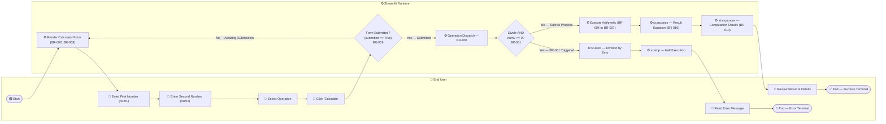
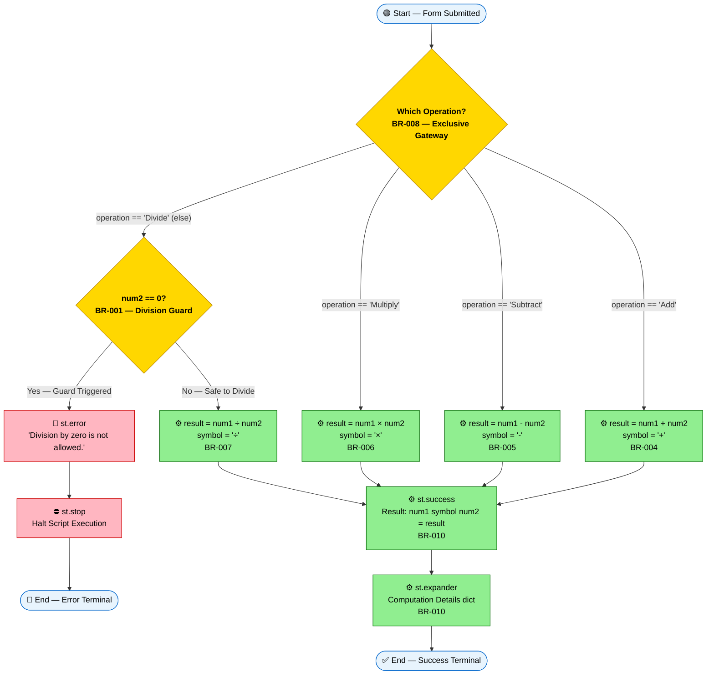
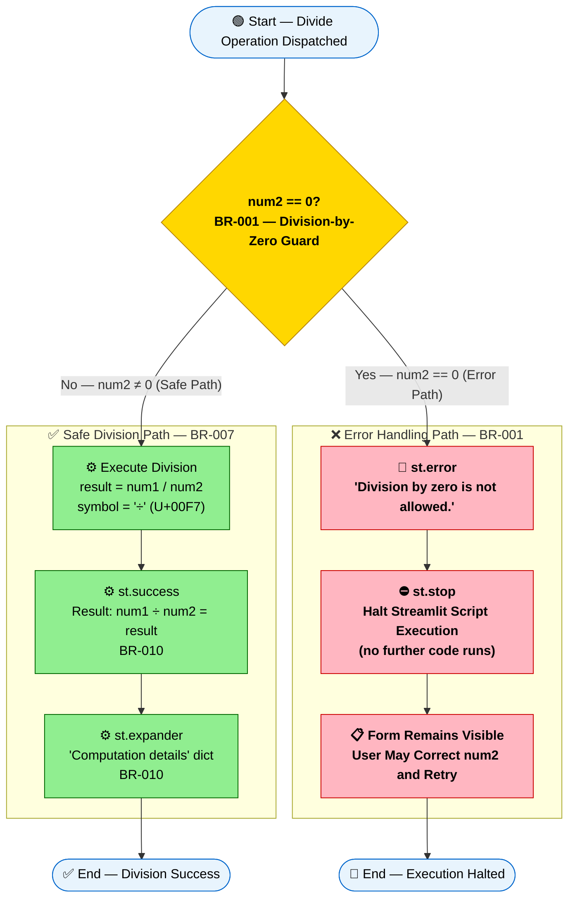

# Business Process Workflows — Simple Calculator

> **Intended path:** `.geninsights/docs/bpmn-workflows.md`
> **Actual path:** `geninsights-bpmn-workflows.md` (repository root)
> **Reason:** The `.geninsights/` directory structure is managed as a flat file at the repo root by the agent runtime.
> **Generated by:** bpmn-agent — 2026-02-05T17:00:00Z
> **Skills Used:** `mermaid-diagrams`, `geninsights-logging`, `json-output-schemas`
> **Source files read:** `.github/agents/skills/mermaid-diagrams/SKILL.md`, `.github/agents/skills/geninsights-logging/SKILL.md`, `.github/agents/skills/json-output-schemas/SKILL.md`, `geninsights-analysis-results.json`, `geninsights-business-rules.json`, `app.py`, `.geninsights`

---

## Overview

This document contains BPMN-style business process flow diagrams for the **Simple Calculator** Streamlit application. All diagrams are rendered using Mermaid `flowchart` syntax and represent BPMN concepts (start/end events, tasks, exclusive gateways, and swimlane pools) using standard Mermaid node shapes.

| Process ID | Process Name | Trigger | Participants | Decision Points | Terminal States |
|------------|-------------|---------|--------------|-----------------|-----------------|
| [PROC-001](#proc-001-main-calculator-user-journey) | Main Calculator User Journey | User opens app URL in browser | End User, Streamlit Runtime | 2 | 2 (Success / Error) |
| [PROC-002](#proc-002-operation-dispatch-workflow) | Operation Dispatch Workflow | Form submitted (`submitted == True`) | Streamlit Runtime | 2 | 2 (Success / Error) |
| [PROC-003](#proc-003-division-by-zero-error-handling) | Division-by-Zero Error Handling | Divide operation with `num2 == 0` | Streamlit Runtime | 1 | 2 (Success / Error) |

**Source File:** `app.py` (50 lines, Streamlit single-page application)
**Business Rules Applied Across All Diagrams:** BR-001, BR-002, BR-003, BR-004, BR-005, BR-006, BR-007, BR-008, BR-009, BR-010

---

## Diagram Notation Reference

| Mermaid Shape | BPMN Concept | Usage in These Diagrams |
|---------------|-------------|------------------------|
| `([Text])` Stadium | Start / End Event | Process entry and terminal states |
| `[Text]` Rectangle | Task / Service Task | System actions (Streamlit rendering, arithmetic) |
| `[Text]` Rectangle + 👤 | User Task | User-performed actions (input, click) |
| `[Text]` Rectangle + ⚙️ | Service Task | Streamlit runtime automated actions |
| `{Text}` Diamond | Exclusive Gateway | Decision points (form submitted?, divide-by-zero?) |
| `subgraph Name` | Pool / Swimlane | Participant boundary (End User, Streamlit Runtime) |
| `-->` | Sequence Flow | Normal process flow |
| `-->|Label|` | Conditional Sequence Flow | Gateway branch with condition label |

---

## PROC-001: Main Calculator User Journey

**Description:** End-to-end process a user follows to perform an arithmetic calculation — from opening the application in a browser, entering operands, selecting an operation, submitting the form, through to viewing either a computed result or a division-by-zero error message.

**Trigger:** User opens `http://localhost:8501` (or deployed app URL) in a web browser

**Participants:**
- **👤 End User** — Initiates the process, provides inputs, reads outputs
- **⚙️ Streamlit Runtime** — Renders UI, batches form state, executes business logic, displays results

**Business Rules Applied:** BR-002 (Numeric Input), BR-003 (Operation Enumeration), BR-008 (Operation Dispatch), BR-009 (Form Gate), BR-001 (Division Guard), BR-004–BR-007 (Arithmetic), BR-010 (Result Display)

**Terminal States:**
- ✅ **Success** — `st.success()` result equation banner and `st.expander()` computation detail panel displayed
- 🔴 **Error** — `st.error()` division-by-zero banner shown; `st.stop()` halts execution; form remains visible for retry

### Process Diagram

### Process Steps

| Step | Step Name | Performer | BPMN Type | Business Rules | Description |
|------|-----------|-----------|-----------|----------------|-------------|
| 1 | Open App URL | End User | Start Event | — | User navigates to the Streamlit app in a browser |
| 2 | Render Calculator Form | Streamlit Runtime | Service Task | BR-002, BR-003 | Page config, title, two `number_input` widgets, `selectbox` (4 ops, default Add), and `Calculate` submit button rendered |
| 3 | Enter First Number | End User | User Task | BR-002 | User enters `num1`; widget enforces numeric-only input; any finite float accepted; displays to 6 decimal places |
| 4 | Enter Second Number | End User | User Task | BR-002 | User enters `num2`; same numeric constraints apply |
| 5 | Select Operation | End User | User Task | BR-003 | User picks one of exactly 4 operations from dropdown (Add / Subtract / Multiply / Divide); default is Add |
| 6 | Click 'Calculate' | End User | User Task | BR-009 | User clicks the `st.form_submit_button`; Streamlit batches all widget values and re-runs the script with `submitted = True` |
| 7 | Form Submitted? | Streamlit Runtime | Exclusive Gateway | BR-009 | **Decision Point 1** — If `submitted == False`, re-render form (loop); if `True`, proceed to dispatch |
| 8 | Operation Dispatch | Streamlit Runtime | Service Task | BR-008 | Evaluate `operation` string; route to appropriate arithmetic branch |
| 9 | Divide AND num2 == 0? | Streamlit Runtime | Exclusive Gateway | BR-001 | **Decision Point 2** — Only reached if operation is Divide; checks denominator for zero |
| 10a | st.error + st.stop | Streamlit Runtime | Service Task | BR-001 | **Error Path** — Red error banner shown; `st.stop()` halts all further script execution |
| 10b | Execute Arithmetic | Streamlit Runtime | Service Task | BR-004 to BR-007 | **Happy Path** — Correct arithmetic operation computed; `result` and `symbol` assigned |
| 11 | Read Error Message | End User | User Task | — | User sees the error banner; form remains visible; user may correct input and resubmit |
| 12a | st.success + st.expander | Streamlit Runtime | Service Task | BR-010 | Result equation rendered in green banner; computation detail dict shown in collapsible expander |
| 12b | Review Result & Details | End User | User Task | — | User reads the formatted result equation and optionally expands computation details |
| 13a | End — Error Terminal | End User | End Event | — | Process terminates at error state; user may initiate a new calculation cycle |
| 13b | End — Success Terminal | End User | End Event | — | Process terminates at success state |

---

## PROC-002: Operation Dispatch Workflow

**Description:** Detailed view of the operation selection gateway and arithmetic branch execution that occurs after the `Calculate` form is submitted. Shows how the `if/elif/else` dispatch chain (BR-008) routes to each of the four arithmetic operations, and how the division branch embeds the division-by-zero guard (BR-001) before computing the result.

**Trigger:** `submitted == True` (the form's Calculate button was clicked)

**Participants:**
- **⚙️ Streamlit Runtime** — Sole actor in this subprocess; all logic is server-side Python

**Business Rules Applied:** BR-008 (Dispatch Decision), BR-001 (Division Guard), BR-004 (Add), BR-005 (Subtract), BR-006 (Multiply), BR-007 (Divide), BR-010 (Result Display)

**Terminal States:**
- ✅ **Success** — Any of the four operations computed and result displayed
- 🔴 **Error** — Division by zero detected; `st.error` + `st.stop` halt execution

### Process Diagram

### Process Steps

| Step | Step Name | BPMN Type | Business Rule | Description |
|------|-----------|-----------|---------------|-------------|
| 1 | Form Submitted | Start Event | BR-009 | Entry point: `submitted == True`; all widget values batched |
| 2 | Which Operation? | Exclusive Gateway | BR-008 | Four-way dispatch on `operation` string value using `if/elif/else` |
| 3a | Compute Addition | Service Task | BR-004 | `result = num1 + num2`; `symbol = '+'` |
| 3b | Compute Subtraction | Service Task | BR-005 | `result = num1 - num2`; `symbol = '-'` |
| 3c | Compute Multiplication | Service Task | BR-006 | `result = num1 * num2`; `symbol = '×'` (U+00D7) |
| 4 | num2 == 0? | Exclusive Gateway | BR-001 | Division guard — only reached when operation is Divide (`else` branch) |
| 5a | st.error | Service Task | BR-001 | Error path: render `st.error('Division by zero is not allowed.')` |
| 5b | st.stop | Service Task | BR-001 | Immediately halt Streamlit script execution — no further rendering occurs |
| 6 | Compute Division | Service Task | BR-007 | Safe path: `result = num1 / num2`; `symbol = '÷'` (U+00F7); only executed if `num2 != 0` |
| 7 | st.success — Result Equation | Service Task | BR-010 | Convergence point for all four operations; renders green success banner with formatted equation |
| 8 | st.expander — Details | Service Task | BR-010 | Collapsible panel with structured dict: `first_number`, `second_number`, `operation`, `result` |
| 9a | End — Error Terminal | End Event | — | Process terminates after `st.stop()`; form remains visible |
| 9b | End — Success Terminal | End Event | — | Process terminates after result displayed |

### Operation Symbol Map (BR-010)

| Operation | Python Expression | Display Symbol | Unicode |
|-----------|------------------|----------------|---------|
| Add | `num1 + num2` | `+` | U+002B |
| Subtract | `num1 - num2` | `-` | U+002D |
| Multiply | `num1 * num2` | `×` | U+00D7 |
| Divide | `num1 / num2` | `÷` | U+00F7 |

---

## PROC-003: Division-by-Zero Error Handling

**Description:** Focused subprocess diagram isolating the division-by-zero guard (BR-001) within the Divide operation branch. Shows the binary split between the safe division path (num2 ≠ 0) and the error path (num2 == 0), including how Streamlit's `st.stop()` creates a hard execution halt with no result output.

**Trigger:** `operation == 'Divide'` is dispatched (the `else` branch of the BR-008 gateway)

**Participants:**
- **⚙️ Streamlit Runtime** — Evaluates the guard, renders error or result

**Business Rules Applied:** BR-001 (Division Guard), BR-007 (Division Calculation), BR-010 (Result Display)

**Terminal States:**
- ✅ **Division Success** — Division computed; result and computation details displayed
- 🔴 **Execution Halted** — Division by zero; `st.error` + `st.stop`; form visible for user retry

### Process Diagram

### Process Steps

| Step | Step Name | BPMN Type | Business Rule | Path | Description |
|------|-----------|-----------|---------------|------|-------------|
| 1 | Divide Dispatched | Start Event | BR-008 | Both | Entry: `else` branch reached after BR-008 gateway selects Divide |
| 2 | num2 == 0? | Exclusive Gateway | BR-001 | Both | Critical guard check: is the denominator exactly zero? |
| 3a | Execute Division | Service Task | BR-007 | Safe | `result = num1 / num2`; `symbol = '÷'` — only executes when `num2 != 0` |
| 4a | st.success | Service Task | BR-010 | Safe | Green banner: `Result: {num1} ÷ {num2} = {result}` |
| 5a | st.expander | Service Task | BR-010 | Safe | Collapsible `Computation details` panel with structured dict |
| 6a | End — Division Success | End Event | — | Safe | Process completes normally |
| 3b | st.error | Service Task | BR-001 | Error | Renders red error banner: `'Division by zero is not allowed.'` |
| 4b | st.stop | Service Task | BR-001 | Error | **Hard stop** — Streamlit halts script execution immediately; `result` and `symbol` are never assigned; `st.success` and `st.expander` never execute |
| 5b | Form Remains Visible | User Task | — | Error | The calculator form stays rendered; user sees error and can correct `num2` |
| 6b | End — Execution Halted | End Event | — | Error | Process terminates in error state; user may initiate a new calculation cycle |

### Key Behavioural Notes — BR-001

| Scenario | num1 | num2 | Result |
|----------|------|------|--------|
| Normal division | `10.0` | `2.0` | ✅ `result = 5.0` — Success |
| Division of zero | `0.0` | `5.0` | ✅ `result = 0.0` — Success |
| Division by zero | `10.0` | `0.0` | 🔴 Error — `st.stop()` |
| Zero divided by zero | `0.0` | `0.0` | 🔴 Error — `st.stop()` (BR-001 applies regardless of numerator) |
| Large number ÷ zero | `1e308` | `0.0` | 🔴 Error — `st.stop()` |

> **Note:** The guard checks `num2 == 0` exactly. Because `num2` is a Python `float`, this uses IEEE 754 equality (`0.0 == 0`). Any non-zero value for `num2`, however small (e.g. `0.000001`), passes the guard and proceeds to division.

---

## Cross-Reference: Business Rules × Process Diagrams

| Rule ID | Rule Name | PROC-001 | PROC-002 | PROC-003 |
|---------|-----------|----------|----------|----------|
| BR-001 | Division by Zero Guard | ✅ Step 9 | ✅ Step 4 | ✅ Steps 2–4b |
| BR-002 | Numeric-Only Operand Input | ✅ Step 2 | — | — |
| BR-003 | Operation Enumeration Constraint | ✅ Step 2 | — | — |
| BR-004 | Addition Calculation | ✅ Step 10b | ✅ Step 3a | — |
| BR-005 | Subtraction Calculation | ✅ Step 10b | ✅ Step 3b | — |
| BR-006 | Multiplication Calculation | ✅ Step 10b | ✅ Step 3c | — |
| BR-007 | Division Calculation | ✅ Step 10b | ✅ Step 6 | ✅ Step 3a |
| BR-008 | Operation Dispatch Decision | ✅ Step 8 | ✅ Step 2 | — (pre-entry) |
| BR-009 | Form-Gate: Explicit Submission | ✅ Step 7 | — (pre-entry) | — (pre-entry) |
| BR-010 | Result Display with Unicode Symbols | ✅ Step 12a | ✅ Steps 7–8 | ✅ Steps 4a–5a |

---

## Source Files

| File | Role | Relevance |
|------|------|-----------|
| `app.py` | Application source (50 lines) | Contains all business logic modelled in these three diagrams |
| `requirements.txt` | Dependency manifest | `streamlit>=1.40.0` — the Streamlit Runtime participant |
| `geninsights-business-rules.json` | Business rules analysis | Source for BR-001 to BR-010 definitions and WF-001 workflow steps |
| `geninsights-analysis-results.json` | Code analysis | Source for functional block descriptions and data model primitives |
