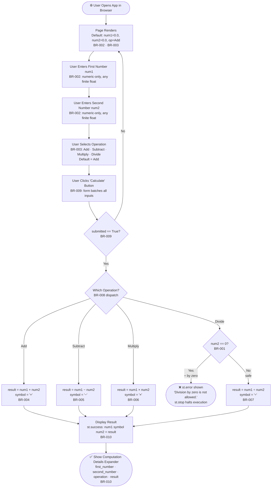
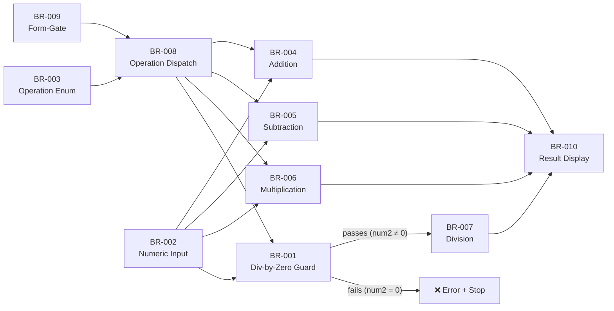

# Business Rules Documentation

> **Intended path:** `.geninsights/docs/business-rules.md`
> **Actual path:** `geninsights-business-rules.md` (repository root)
> Written here because `.geninsights/` does not exist as a filesystem directory.
> See also: `geninsights-business-rules.json` for the machine-readable version.

---

## Executive Summary

The **Simple Calculator** (`app.py`) is a self-contained, single-page Streamlit web application that exposes four arithmetic operations — Add, Subtract, Multiply, and Divide — through a clean form-based UI. Despite its small footprint (50 lines of Python), it contains **10 distinct, well-defined business rules** governing input validation, arithmetic computation, workflow gating, and result presentation. There is **one end-to-end user workflow** (WF-001) that drives the entire user experience.

All business logic lives exclusively in `app.py`. There are no databases, external APIs, authentication layers, or background processes.

| Metric | Value |
|---|---|
| Total Business Rules | 10 |
| Business Domains | 1 — Arithmetic Computation |
| Workflows | 1 — Calculator Computation Workflow |
| Critical-Priority Rules | 5 (BR-001, BR-004, BR-005, BR-006, BR-007, BR-008) |
| Source Files | 1 (`app.py`) |
| Lines of Code | 50 |

---

## Business Domains

| Domain | Description | Rules |
|---|---|---|
| **Arithmetic Computation** | All rules governing input capture, operation selection, calculation execution, error handling, and result display for the four-operation calculator | BR-001 through BR-010 |

---

## Rules by Domain

### Arithmetic Computation

---

#### BR-001: Division by Zero Guard ⚠️ CRITICAL

- **Type:** Validation
- **Priority:** Critical
- **Related Rules:** BR-007 (Division Calculation)

**Description:**
Division by zero is strictly prohibited. When the user selects the Divide operation and the second operand is exactly `0`, the application halts immediately — rendering an error and terminating script execution before any result can be produced.

**Trigger Condition:**
```
operation == "Divide"  AND  num2 == 0
```

**Action:**
1. Display a red error banner: _"Division by zero is not allowed."_
2. Call `st.stop()` — Streamlit immediately ceases all further script execution.
3. No result, no expander, no success banner is rendered.

**Exceptions:** None. The rule applies universally, including the mathematically indeterminate case of `0 ÷ 0`.

**Implementation:** `app.py`, lines 36–38

```python
if num2 == 0:
    st.error("Division by zero is not allowed.")
    st.stop()
```

---

#### BR-002: Numeric-Only Operand Input

- **Type:** Validation
- **Priority:** High
- **Related Rules:** BR-003

**Description:**
Both the "First number" and "Second number" fields accept only floating-point numeric values. Non-numeric characters cannot be entered. No minimum or maximum bounds are enforced — any finite IEEE 754 double-precision float is accepted, including negative numbers and high-precision decimals.

**Trigger Condition:** Always — applied to both inputs on every page render.

**Action:** Streamlit's `number_input` widget enforces numeric-only entry natively. The captured Python values are `float` type, defaulting to `0.0`.

**Exceptions:** No explicit range constraints exist. Values such as `-999999999.999999` or `0.000001` are equally valid.

**Implementation:** `app.py`, lines 12–14

```python
num1 = st.number_input("First number", value=0.0, format="%.6f")
num2 = st.number_input("Second number", value=0.0, format="%.6f")
```

---

#### BR-003: Operation Enumeration Constraint

- **Type:** Validation
- **Priority:** High
- **Related Rules:** BR-008 (Operation Dispatch Decision)

**Description:**
The operation field is strictly constrained to exactly four permitted string values: `"Add"`, `"Subtract"`, `"Multiply"`, `"Divide"`. Free-text entry is structurally impossible. The Streamlit `selectbox` widget renders a dropdown with only these four choices.

**Trigger Condition:** Always — applied on every page render.

**Action:** User selects one of the four enumerated operations. The resulting Python string is guaranteed to be one of the four valid values.

**Exceptions:** None. The widget enforces this structurally — no custom validation code is required.

**Implementation:** `app.py`, lines 16–20

```python
operation = st.selectbox(
    "Operation",
    ("Add", "Subtract", "Multiply", "Divide"),
    index=0,
)
```

> **Default:** `"Add"` is pre-selected (index 0) on every fresh page load or script re-run.

---

#### BR-004: Addition Calculation ⚠️ CRITICAL

- **Type:** Calculation
- **Priority:** Critical
- **Formula:** `result = num1 + num2`
- **Symbol:** `+`
- **Related Rules:** BR-008, BR-009, BR-010

**Description:**
When the selected operation is `"Add"`, the result is computed as the arithmetic sum of the two operands using Python's native float addition.

**Trigger Condition:** `submitted == True AND operation == "Add"`

**Implementation:** `app.py`, lines 25–27

```python
if operation == "Add":
    result = num1 + num2
    symbol = "+"
```

---

#### BR-005: Subtraction Calculation ⚠️ CRITICAL

- **Type:** Calculation
- **Priority:** Critical
- **Formula:** `result = num1 - num2`
- **Symbol:** `-`
- **Related Rules:** BR-008, BR-009, BR-010

**Description:**
When the selected operation is `"Subtract"`, the result is computed as num1 minus num2. Negative results are valid and display normally.

**Trigger Condition:** `submitted == True AND operation == "Subtract"`

**Implementation:** `app.py`, lines 28–30

```python
elif operation == "Subtract":
    result = num1 - num2
    symbol = "-"
```

---

#### BR-006: Multiplication Calculation ⚠️ CRITICAL

- **Type:** Calculation
- **Priority:** Critical
- **Formula:** `result = num1 * num2`
- **Symbol:** `×` (Unicode U+00D7)
- **Related Rules:** BR-008, BR-009, BR-010

**Description:**
When the selected operation is `"Multiply"`, the result is computed as the product of the two operands. Multiplying by zero (`num2 == 0`) legitimately yields `0.0` and is not treated as an error (unlike division).

**Trigger Condition:** `submitted == True AND operation == "Multiply"`

**Implementation:** `app.py`, lines 31–33

```python
elif operation == "Multiply":
    result = num1 * num2
    symbol = "×"
```

---

#### BR-007: Division Calculation ⚠️ CRITICAL

- **Type:** Calculation
- **Priority:** Critical
- **Formula:** `result = num1 / num2`  _(only when num2 ≠ 0)_
- **Symbol:** `÷` (Unicode U+00F7)
- **Related Rules:** BR-001 (guard), BR-008, BR-009, BR-010

**Description:**
When the selected operation is `"Divide"` and the denominator is non-zero (confirmed by BR-001), the result is computed using Python float true-division. The symbol `÷` is assigned before the zero-check, and the division only executes after the guard passes.

**Trigger Condition:** `submitted == True AND operation == "Divide" AND num2 != 0`

**Implementation:** `app.py`, lines 34–39

```python
else:  # Divide
    symbol = "÷"
    if num2 == 0:
        st.error("Division by zero is not allowed.")
        st.stop()
    result = num1 / num2
```

---

#### BR-008: Operation Dispatch Decision ⚠️ CRITICAL

- **Type:** Decision
- **Priority:** Critical
- **Related Rules:** BR-003, BR-004, BR-005, BR-006, BR-007

**Description:**
After form submission, the application evaluates the operation string and routes execution to exactly one of four arithmetic branches. The dispatch uses an `if / elif / elif / else` chain. Because the operation is already constrained to four values (BR-003), the `else` branch implicitly and exclusively handles `"Divide"` — no fourth explicit string comparison is needed.

**Trigger Condition:** `submitted == True`

**Decision Logic:**

| Condition | Branch Taken |
|---|---|
| `operation == "Add"` | BR-004 (Addition) |
| `operation == "Subtract"` | BR-005 (Subtraction) |
| `operation == "Multiply"` | BR-006 (Multiplication) |
| _(else — implicitly "Divide")_ | BR-001 check → BR-007 |

**Implementation:** `app.py`, lines 25–39

```python
if operation == "Add":
    ...
elif operation == "Subtract":
    ...
elif operation == "Multiply":
    ...
else:           # implicitly "Divide"
    ...
```

---

#### BR-009: Form-Gate — Calculate Only on Explicit Submission

- **Type:** Process
- **Priority:** High
- **Related Rules:** BR-004, BR-005, BR-006, BR-007, BR-008

**Description:**
All calculation and result-display logic is gated behind an explicit user action — clicking the "Calculate" button. Streamlit's `st.form` mechanism batches all widget changes inside the form, preventing the automatic script re-run that normally fires on every individual widget interaction. As a result, changing operand values or switching the operation dropdown alone has **no computational effect** — only deliberate form submission triggers arithmetic.

**Trigger Condition:** Always — the `if submitted:` guard wraps 100% of business logic.

**Effect Before Submission:** The UI renders with inputs and a dropdown; no result is shown.

**Effect After Submission:** The full pipeline executes: BR-008 → BR-004/005/006/007 → BR-010 (or BR-001 error path).

**Implementation:** `app.py`, lines 8–24 (form definition) and line 24 (gate)

```python
with st.form("calculator_form"):
    # ... inputs and dropdown ...
    submitted = st.form_submit_button("Calculate")

if submitted:
    # All business logic executes here
```

---

#### BR-010: Result Display with Unicode Mathematical Symbols

- **Type:** Display / Formatting
- **Priority:** Medium
- **Related Rules:** BR-001, BR-004, BR-005, BR-006, BR-007

**Description:**
After a successful calculation (all guards passed), results are rendered in two areas:

1. **Success banner** (`st.success`): A green banner displaying the equation as:
   `Result: {num1} {symbol} {num2} = {result}`

2. **Computation details expander** (`st.expander`): A collapsible section labelled "Computation details" that shows a structured Python dict with keys `first_number`, `second_number`, `operation`, and `result` — providing full transparency into the raw computed values.

**Symbol Mapping:**

| Operation | Display Symbol | Unicode |
|---|---|---|
| Add | `+` | U+002B (standard plus) |
| Subtract | `-` | U+002D (ASCII hyphen-minus) |
| Multiply | `×` | U+00D7 (multiplication sign) |
| Divide | `÷` | U+00F7 (division sign) |

**Trigger Condition:** `submitted == True AND` division-by-zero guard passed (if applicable)

**Exceptions:** On division-by-zero, `st.stop()` is called before this rule executes — no success banner or expander is rendered.

**Implementation:** `app.py`, lines 41–49

```python
st.success(f"Result: {num1} {symbol} {num2} = {result}")

with st.expander("Computation details"):
    st.write({
        "first_number": num1,
        "second_number": num2,
        "operation": operation,
        "result": result,
    })
```

---

## Rule Summary Table

| Rule ID | Name | Type | Priority |
|---|---|---|---|
| BR-001 | Division by Zero Guard | Validation | ⚠️ Critical |
| BR-002 | Numeric-Only Operand Input | Validation | High |
| BR-003 | Operation Enumeration Constraint | Validation | High |
| BR-004 | Addition Calculation | Calculation | ⚠️ Critical |
| BR-005 | Subtraction Calculation | Calculation | ⚠️ Critical |
| BR-006 | Multiplication Calculation | Calculation | ⚠️ Critical |
| BR-007 | Division Calculation | Calculation | ⚠️ Critical |
| BR-008 | Operation Dispatch Decision | Decision | ⚠️ Critical |
| BR-009 | Form-Gate: Calculate Only on Explicit Submission | Process | High |
| BR-010 | Result Display with Unicode Mathematical Symbols | Display/Formatting | Medium |

---

## Business Workflows

### WF-001: Calculator Computation Workflow

**Description:** The complete end-to-end journey a user takes from opening the calculator to receiving either a computed result or a division-by-zero error.

**Trigger:** User opens the Streamlit application in a browser (`streamlit run app.py`, default URL: `http://localhost:8501`)

**Actors:** End User, Streamlit Runtime

**End States:**
- ✅ **Success** — Green `st.success` banner displays the equation and result; expandable computation details are shown.
- ❌ **Error** — Red `st.error` banner displays "Division by zero is not allowed."; `st.stop()` halts execution.



**Step-by-Step Description:**

| Step | Name | Rules Applied | Decision Point |
|---|---|---|---|
| 1 | Page Load & UI Render | BR-002, BR-003 | No |
| 2 | User Enters num1 | BR-002 | No |
| 3 | User Enters num2 | BR-002 | No |
| 4 | User Selects Operation | BR-003 | No |
| 5 | User Submits Form | BR-009 | No |
| 6 | Operation Dispatch | BR-008 | ✅ Yes — routes to Add/Subtract/Multiply/Divide branch |
| 7a | Division-by-Zero Check _(Divide only)_ | BR-001 | ✅ Yes — error path or continue |
| 7b | Arithmetic Calculation | BR-004 / BR-005 / BR-006 / BR-007 | No |
| 8 | Result Display | BR-010 | No |

---

## Rule Dependencies

The diagram below shows how business rules depend on and relate to one another:



---

## Data Constraints & Defaults

| Field | Type | Default | Precision | Bounds | Rule |
|---|---|---|---|---|---|
| `num1` (First number) | `float` | `0.0` | 6 decimal places (display) | No min/max enforced | BR-002 |
| `num2` (Second number) | `float` | `0.0` | 6 decimal places (display) | No min/max; must ≠ 0 for Divide | BR-002, BR-001 |
| `operation` | `str` | `"Add"` | N/A | Enum: Add/Subtract/Multiply/Divide | BR-003 |
| `result` | `float` | _(computed)_ | Python float precision | N/A | BR-004 through BR-007 |
| `symbol` | `str` | _(computed)_ | N/A | One of: `+`, `-`, `×`, `÷` | BR-010 |

---

## Recommendations

### Gaps & Improvement Opportunities

| # | Observation | Recommendation | Affected Rules |
|---|---|---|---|
| 1 | **No input range bounds** — any finite float is accepted, including values that may cause Python `inf` or `nan` on multiplication/exponentiation of very large numbers. | Add `min_value` / `max_value` parameters to `st.number_input`, or add a post-input guard that validates operands are within a safe range. | BR-002 |
| 2 | **Exact equality check for zero** (`num2 == 0`) — this is technically correct for the integer value 0 but is the standard `==` float comparison. For values like `0.0000000000000001` the division proceeds normally, which is mathematically correct. Nonetheless, documenting this behaviour explicitly aids maintainability. | Add an inline comment explaining that the guard targets exact zero, not near-zero values. | BR-001 |
| 3 | **Subtract symbol is ASCII `-`, not the Unicode minus sign `−` (U+2212)** — inconsistent with the multiplication `×` and division `÷` which use proper Unicode math symbols. | Replace `symbol = "-"` with `symbol = "−"` (U+2212) for typographic consistency. | BR-010 |
| 4 | **No floating-point precision handling in result display** — the `result` is rendered as Python's default `str(float)`, which may produce long decimals (e.g., `0.30000000000000004` for `0.1 + 0.2`). | Format `result` with `round(result, 6)` or `f"{result:.6f}"` in the success message to match the 6-decimal input precision. | BR-010 |
| 5 | **No session history** — each calculation is ephemeral; results are lost when the user changes inputs and re-submits. | Consider adding a `st.session_state`-backed calculation history table below the result area for auditability. | WF-001 |
| 6 | **No keyboard shortcut for submit** — the form can only be submitted by clicking the button; pressing Enter in a number field does not submit the form by default in Streamlit. | Document this as a known UX limitation or investigate `st.form` keyboard submission support. | BR-009 |

---

## Appendix: Source File Reference

| File | Role | Classification | Business Rules |
|---|---|---|---|
| `app.py` | Sole application entry point; all business logic | Business | BR-001 through BR-010, WF-001 |
| `requirements.txt` | Dependency manifest (`streamlit>=1.40.0`) | Technical | None |
| `README.md` | Developer onboarding documentation | Documentation | None |

---

_Generated by **business-rules-agent** · 2026-02-05T15:31:30Z_
_Skills used: `discover-files`, `geninsights-logging`, `json-output-schemas`_
