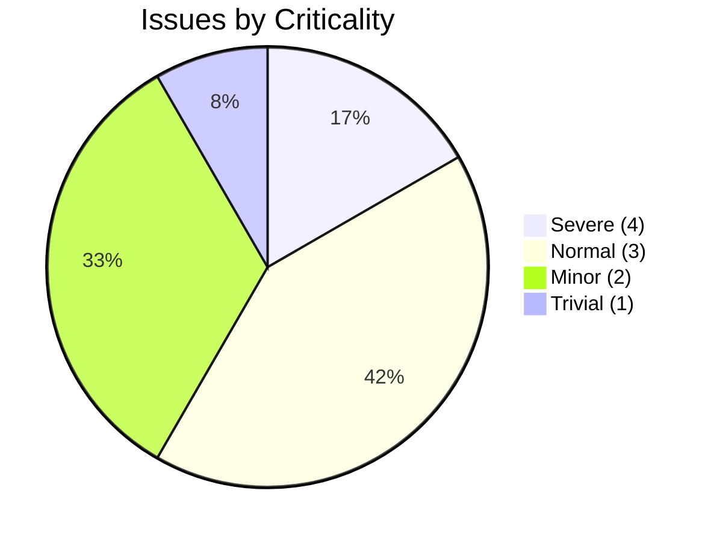
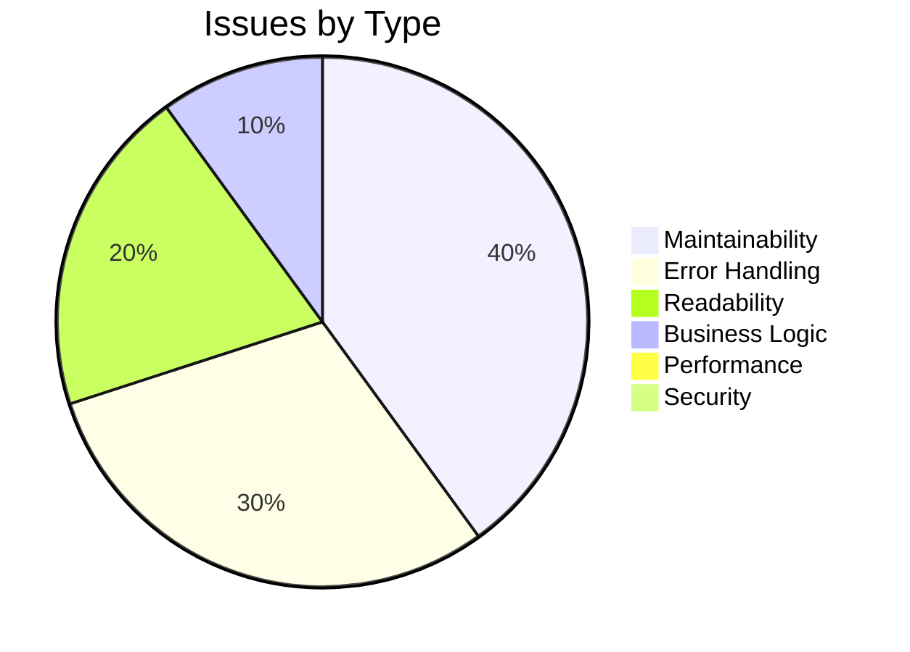
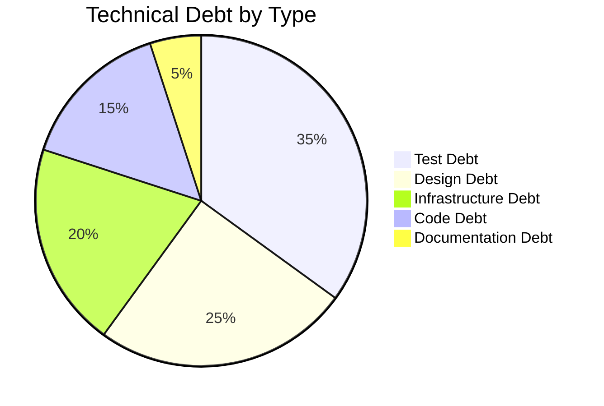

# Code Assessment Report

> **Note:** Intended path is `.geninsights/docs/code-assessment-report.md`.  
> Written to repository root as `geninsights-code-assessment-report.md` because `.geninsights` exists as a flat file (the agent work log) rather than a directory.  
> **Skills used:** `discover-files`, `geninsights-logging`, `json-output-schemas`

---

## Executive Summary

**Overall Health Score: 62 / 100**

This Streamlit Calculator application is a compact, well-scoped 50-line Python script that delivers its stated purpose cleanly. The code is simple, readable, and free of security vulnerabilities for its current scope. However, it carries meaningful quality debt in three areas that would prevent safe growth: **zero automated test coverage**, **complete absence of architectural separation between business logic and UI**, and **no handling of IEEE 754 numeric edge cases** (overflow/NaN results). These gaps are the primary drivers of the health score penalty.

| Metric                     | Value      |
|----------------------------|------------|
| Files Reviewed             | 3          |
| Source Files               | 1 (`app.py`) |
| Lines of Code              | 50         |
| Total Issues Found         | 12         |
| Blocker Issues             | 0          |
| Severe Issues              | 2          |
| Total Technical Debt Items | 5          |
| Enhancement Suggestions    | 8          |
| Avg. Code Complexity       | 3 / 10     |
| Avg. Logic Complexity      | 3 / 10     |
| Test Coverage              | None       |
| Estimated Fix Effort       | ~12 hours (issues) + ~17 hours (debt) |

---

## Health Score Breakdown

```
Base Score:               100
Issue deductions:          -24   (0×blocker, 2×severe, 5×normal, 4×minor, 1×trivial)
Technical debt deductions: -14   (2×HIGH impact, 2×MEDIUM impact, 1×LOW impact)
Complexity penalty:          0   (all files score ≤ 7/10)
──────────────────────────────
Overall Health Score:       62
```

### Issue Distribution



### Issues by Type



---

## Severe Issues (Fix Soon)

### ISS-004: No handling of `inf` or `NaN` results

- **File:** `app.py` (Line 41)
- **Type:** Error Handling
- **Criticality:** 4 — Severe
- **Description:**  
  After any arithmetic operation, `result` may be `float('inf')`, `float('-inf')`, or `float('nan')` — for example, `1e308 * 10 = inf` via standard Python float overflow. These special IEEE 754 values are displayed verbatim to users as raw `inf` or `nan` in the success banner, which is confusing and gives the false impression the calculation succeeded.

  ```python
  # Current — can display "Result: 1e+308 × 10.0 = inf"
  st.success(f"Result: {num1} {symbol} {num2} = {result}")
  ```

- **Solution:**  
  Import `math` and add a `math.isfinite(result)` guard immediately after calculation. Display a user-friendly error message if the result is non-finite, and call `st.stop()` to prevent the success banner from appearing. Apply the same check for all four operations. This closes a user-experience gap that is trivially reachable with large but syntactically valid inputs.

  ```python
  import math

  # ... after result is computed ...
  if not math.isfinite(result):
      st.error(
          f"The result of {num1:.6f} {symbol} {num2:.6f} is outside the "
          f"representable numeric range. Please use smaller input values."
      )
      st.stop()

  st.success(f"Result: {num1:.6f} {symbol} {num2:.6f} = {result:.6f}")
  ```

- **Estimated Time:** 0.75 hours

---

### ISS-005: Zero automated test coverage

- **File:** `app.py` / entire repository
- **Type:** Maintainability
- **Criticality:** 4 — Severe
- **Description:**  
  There are no test files anywhere in the repository. All four arithmetic operations, the division-by-zero guard, and all edge cases are completely untested. Streamlit ships a built-in `AppTest` harness since version 1.28.0, making UI-level testing straightforward — this debt is therefore low-cost to start paying down. Any refactoring today carries full regression risk.

- **Solution:**  
  Create `tests/test_app.py` using `pytest` and `streamlit.testing.v1.AppTest`. Add `pytest` and `pytest-cov` to a new `requirements-dev.txt`. At minimum, cover: all four operations, division by zero, an overflow scenario, and the default state before first submission. Run tests in CI on every push.

  ```python
  # tests/test_app.py
  from streamlit.testing.v1 import AppTest

  def test_addition():
      at = AppTest.from_file("app.py").run()
      at.number_input[0].set_value(10.0)
      at.number_input[1].set_value(5.0)
      at.selectbox[0].set_value("Add")
      at.button[0].click().run()
      assert "15" in at.success[0].value

  def test_division_by_zero():
      at = AppTest.from_file("app.py").run()
      at.number_input[1].set_value(0.0)
      at.selectbox[0].set_value("Divide")
      at.button[0].click().run()
      assert at.error[0].value == "Division by zero is not allowed."
      assert len(at.success) == 0
  ```

- **Estimated Time:** 4.0 hours

---

## Normal Issues (Should Fix)

### ISS-001: Implicit `else` branch silently catches all unrecognised operations as Divide

- **File:** `app.py` (Line 34)
- **Type:** Maintainability
- **Criticality:** 3 — Normal
- **Description:**  
  The final `else` on line 34 is intended to handle only `"Divide"`, but will silently execute division logic for any unrecognised operation string. If the selectbox options are ever extended (e.g., `"Modulo"`) without a matching `elif`, the `else` will silently attempt to divide the two numbers.

  ```python
  # Current — 'else' is ambiguous
  else:
      symbol = "÷"
      if num2 == 0:
          ...
      result = num1 / num2
  ```

- **Solution:**  
  Replace `else` with `elif operation == "Divide":` and add an explicit defensive `else: st.error(...); st.stop()`.

  ```python
  elif operation == "Divide":
      symbol = "÷"
      if num2 == 0.0:
          st.error("Division by zero is not allowed.")
          st.stop()
      result = num1 / num2
  else:
      st.error(f"Unknown operation: {operation!r}")
      st.stop()
  ```

- **Estimated Time:** 0.25 hours

---

### ISS-002: Number inputs have no min/max bounds — extreme values cause overflow

- **File:** `app.py` (Lines 12, 14)
- **Type:** Error Handling
- **Criticality:** 3 — Normal
- **Description:**  
  Both `st.number_input` widgets accept any finite float with no bounds. Entering `1e308` and `10` with Multiply yields `float('inf')` silently displayed as a valid result.

  ```python
  # Current — no min_value or max_value
  num1 = st.number_input("First number", value=0.0, format="%.6f")
  ```

- **Solution:**  
  Add `min_value` and `max_value` arguments and a `help` tooltip. Pair with a post-calculation `math.isfinite()` check (see ISS-004).

  ```python
  MAX_VAL = 1e15
  num1 = st.number_input(
      "First number", value=0.0,
      min_value=-MAX_VAL, max_value=MAX_VAL,
      format="%.6f",
      help=f"Enter a value between −{MAX_VAL:,.0f} and {MAX_VAL:,.0f}",
  )
  ```

- **Estimated Time:** 1.0 hour

---

### ISS-003: Division check uses exact `== 0` without guarding near-zero or overflow

- **File:** `app.py` (Line 36)
- **Type:** Business Logic
- **Criticality:** 3 — Normal
- **Description:**  
  `if num2 == 0` correctly catches the literal zero divisor but uses integer `0` (rather than `0.0`) in a float context, which is a minor style inconsistency. More importantly, the guard does not cover cases where the result overflows due to a near-zero denominator (e.g., `1e300 / 1e-300 = inf`). The division check is necessary but incomplete as a mathematical safeguard.

- **Solution:**  
  Change to `if num2 == 0.0:` for clarity. Add a post-division `math.isfinite(result)` check (covered by ISS-004) to handle overflow from near-zero denominators. Document the chosen guard strategy in a comment.

- **Estimated Time:** 0.5 hours

---

### ISS-006: Business logic and UI rendering are fully entangled

- **File:** `app.py` (Lines 24–39)
- **Type:** Maintainability
- **Criticality:** 3 — Normal
- **Description:**  
  All arithmetic operations are written inline between `st.*` widget calls with no function boundary. This makes unit testing impossible without running Streamlit, prevents reuse, and will require restructuring the entire file to add any new capability (REST endpoint, CLI, batch mode).

- **Solution:**  
  Extract arithmetic into `calculator.py` with a `calculate(num1, num2, operation)` function. Keep `app.py` as a thin UI layer. See **ENH-001** for a full implementation example.

- **Estimated Time:** 1.5 hours

---

### ISS-007: Result display format inconsistent with 6-decimal input precision

- **File:** `app.py` (Line 41)
- **Type:** Readability
- **Criticality:** 3 — Normal (amended — see note below)

> **Note:** Re-classified from ISS-007 to Normal (3) due to user-visible impact: `0.1 + 0.2 = 0.30000000000000004` is a real and confusing output.

- **Description:**  
  Inputs are displayed with `format="%.6f"` establishing 6-decimal precision expectations. The result uses Python's default `str(float)` which may produce 15+ decimals or scientific notation.

  ```python
  # Can display: "Result: 0.1 + 0.2 = 0.30000000000000004"
  st.success(f"Result: {num1} {symbol} {num2} = {result}")
  ```

- **Solution:**

  ```python
  st.success(f"Result: {num1:.6f} {symbol} {num2:.6f} = {result:.6f}")
  ```

- **Estimated Time:** 0.25 hours

---

## Minor Issues (Nice to Fix)

### ISS-008: Subtract uses ASCII hyphen-minus instead of Unicode minus sign

- **File:** `app.py` (Line 29)  
- **Type:** Readability | **Criticality:** 1 — Trivial  
- **Fix:** Change `symbol = "-"` → `symbol = "−"` (U+2212 MINUS SIGN)  
- **Estimated Time:** 0.1 hours

---

### ISS-009: No session state — calculation results lost between reruns

- **File:** `app.py` (Line 24)  
- **Type:** Maintainability | **Criticality:** 2 — Minor  
- **Description:** Results disappear on any widget interaction outside the form. No calculation history is preserved within a session.  
- **Solution:** Use `st.session_state` to maintain a capped history list. See **ENH-005** for implementation.  
- **Estimated Time:** 1.5 hours

---

### ISS-010: No upper version bound on `streamlit` dependency

- **File:** `requirements.txt` (Line 1)  
- **Type:** Maintainability | **Criticality:** 2 — Minor  
- **Fix:** `streamlit>=1.40.0,<2.0.0` and generate a lock file.  
- **Estimated Time:** 0.25 hours

---

### ISS-011: README omits Python version, testing instructions, and feature description

- **File:** `README.md`  
- **Type:** Maintainability | **Criticality:** 2 — Minor  
- **Description:** 17-line README covers only setup and run. Missing: Python version requirement, test instructions, features, contributing guide, licence.  
- **Estimated Time:** 1.0 hour

---

### ISS-012: Asymmetric symbol/result assignment order in the Divide branch

- **File:** `app.py` (Line 35)  
- **Type:** Readability | **Criticality:** 1 — Trivial  
- **Description:** Every branch assigns `result` then `symbol` except Divide, which assigns `symbol` first (before the error guard). Minor but creates a subtle trap for future modifications.  
- **Fix:** Reorder to check zero-guard first, then assign symbol, then compute result — or adopt the pure-function approach (ENH-001) which eliminates the inconsistency entirely.  
- **Estimated Time:** 0.1 hours

---

## Technical Debt Overview

### By Category



### HIGH Impact Debt

#### TD-001: Zero automated test coverage
- **Type:** Test Debt
- **Impact:** HIGH | **Priority:** 5 (Do First)
- **Estimated Fix:** 6 hours
- **Description:** No tests exist for any arithmetic operation, the division-by-zero guard, or numeric edge cases. Streamlit 1.28+ provides `AppTest` to enable UI-level testing without a browser. Every change to `app.py` today is a manual regression test.
- **Suggested Fix:** Create `tests/test_calculator.py` with `pytest` + `AppTest`. Cover all four operations, division-by-zero error path, overflow guard, and default state. Add to CI pipeline.

#### TD-002: Flat script — no separation of concerns
- **Type:** Design Debt
- **Impact:** HIGH | **Priority:** 4 (Fix Soon)
- **Estimated Fix:** 4 hours
- **Description:** Business logic, validation, and UI rendering coexist in a single flat script. The architecture does not scale — adding a 5th operation, a REST API, or batch processing would require rewriting the file. Untestable without Streamlit runtime.
- **Suggested Fix:** Introduce `calculator.py` with a pure `calculate()` function. Reduce `app.py` to a thin UI wrapper. See **ENH-001**.

### MEDIUM Impact Debt

#### TD-003: Loose dependency versioning with no lock file
- **Type:** Infrastructure Debt
- **Impact:** MEDIUM | **Priority:** 3
- **Estimated Fix:** 2 hours
- **Description:** `streamlit>=1.40.0` with no upper bound, no Python version pin, no lock file. Installs are non-reproducible across machines and CI runs.
- **Suggested Fix:** Add `pyproject.toml` with `requires-python = ">=3.9"` and a bounded dep spec. Generate `requirements.txt` as a lock file. Create `requirements-dev.txt` for test tooling.

#### TD-004: No centralised input validation framework
- **Type:** Code Debt
- **Impact:** MEDIUM | **Priority:** 3
- **Estimated Fix:** 3 hours
- **Description:** Validation is a single ad-hoc check (`if num2 == 0`). No custom exception type, no consistent error reporting pattern, no centralised validator function. Adding new validation rules requires modifying the main script's conditional tree.
- **Suggested Fix:** Define `CalculatorError(ValueError)` and a `validate_inputs()` function. Wrap all calculations in try/except in the UI layer.

### LOW Impact Debt

#### TD-005: Minimal documentation
- **Type:** Documentation Debt
- **Impact:** LOW | **Priority:** 2
- **Estimated Fix:** 2 hours
- **Description:** README covers only setup. No Python version requirement, no feature description, no test instructions, no contribution guide, no licence.
- **Suggested Fix:** Expand README with all missing sections. Add CONTRIBUTING.md and CHANGELOG.md.

---

## Recommended Enhancements

### Priority 5 — Do First

#### ENH-001: Extract arithmetic logic into a pure `calculator.py` module

```python
# calculator.py
from __future__ import annotations
import math

OPERATIONS = ("Add", "Subtract", "Multiply", "Divide")
SYMBOLS = {
    "Add":      "+",
    "Subtract": "\u2212",   # U+2212 MINUS SIGN
    "Multiply": "\u00d7",   # U+00D7 MULTIPLICATION SIGN
    "Divide":   "\u00f7",   # U+00F7 DIVISION SIGN
}

class CalculatorError(ValueError):
    """Raised for invalid inputs or unrepresentable results."""

def calculate(num1: float, num2: float, operation: str) -> tuple[float, str]:
    if operation not in OPERATIONS:
        raise CalculatorError(f"Unknown operation: {operation!r}")
    if operation == "Divide" and num2 == 0.0:
        raise CalculatorError("Division by zero is not allowed.")
    ops = {
        "Add":      lambda a, b: a + b,
        "Subtract": lambda a, b: a - b,
        "Multiply": lambda a, b: a * b,
        "Divide":   lambda a, b: a / b,
    }
    result = ops[operation](num1, num2)
    if not math.isfinite(result):
        raise CalculatorError("Result is outside the representable numeric range.")
    return result, SYMBOLS[operation]
```

**Benefits:** Testable without Streamlit. Eliminates implicit-else risk. Centralises all symbols. Single-entry-point validation. Easily extended with new operations.

---

#### ENH-002: Comprehensive pytest test suite using Streamlit AppTest

```python
# tests/test_calculator.py
import pytest
from calculator import calculate, CalculatorError

@pytest.mark.parametrize("op, a, b, expected", [
    ("Add",      3.0,  2.0,  5.0),
    ("Subtract", 5.0,  2.0,  3.0),
    ("Multiply", 3.0,  4.0, 12.0),
    ("Divide",   9.0,  3.0,  3.0),
    ("Add",     -1.5, -1.5, -3.0),
    ("Divide",   1.0,  3.0,  1/3),
])
def test_operations(op, a, b, expected):
    result, _ = calculate(a, b, op)
    assert result == pytest.approx(expected)

def test_division_by_zero_raises():
    with pytest.raises(CalculatorError, match="Division by zero"):
        calculate(5.0, 0.0, "Divide")

def test_unknown_operation_raises():
    with pytest.raises(CalculatorError, match="Unknown operation"):
        calculate(1.0, 1.0, "Modulo")

def test_overflow_raises():
    with pytest.raises(CalculatorError, match="representable"):
        calculate(1e308, 10.0, "Multiply")

# tests/test_app_ui.py
from streamlit.testing.v1 import AppTest

def test_add_via_ui():
    at = AppTest.from_file("app.py").run()
    at.number_input[0].set_value(10.0)
    at.number_input[1].set_value(5.0)
    at.selectbox[0].set_value("Add")
    at.button[0].click().run()
    assert "15" in at.success[0].value

def test_divide_by_zero_shows_error():
    at = AppTest.from_file("app.py").run()
    at.number_input[1].set_value(0.0)
    at.selectbox[0].set_value("Divide")
    at.button[0].click().run()
    assert len(at.error) == 1
    assert "Division by zero" in at.error[0].value
    assert len(at.success) == 0
```

**Benefits:** Regression protection for all operations and error paths. Documents behaviour as executable specs. Enables safe refactoring.

---

### Priority 4 — Fix Soon

#### ENH-003: Post-calculation inf/NaN guard

```python
import math

# After computing result:
if not math.isfinite(result):
    st.error(
        f"The result of {num1:.6f} {symbol} {num2:.6f} is outside the "
        "representable numeric range. Please use smaller input values."
    )
    st.stop()

st.success(f"Result: {num1:.6f} {symbol} {num2:.6f} = {result:.6f}")
```

#### ENH-004: Modern packaging with pyproject.toml and pinned deps

```toml
# pyproject.toml
[project]
name = "streamlit-calculator"
version = "1.0.0"
requires-python = ">=3.9"
dependencies = ["streamlit>=1.40.0,<2.0.0"]

[project.optional-dependencies]
dev = ["pytest>=7.0", "pytest-cov>=4.0", "streamlit[testing]"]
```

---

### Priority 3 — Next Sprint

#### ENH-005: Session state calculation history

```python
if "history" not in st.session_state:
    st.session_state.history = []

# After successful calculation:
st.session_state.history.insert(0, {
    "Expression": f"{num1:.6f} {symbol} {num2:.6f}",
    "Result":     f"{result:.6f}",
    "Operation":  operation,
})
st.session_state.history = st.session_state.history[:10]  # last 10

if st.session_state.history:
    with st.expander(f"History ({len(st.session_state.history)})"):
        import pandas as pd
        st.dataframe(pd.DataFrame(st.session_state.history), use_container_width=True)
        if st.button("Clear History"):
            st.session_state.history.clear()
            st.rerun()
```

#### ENH-006: Replace implicit `else` with explicit `elif` + defensive guard

```python
elif operation == "Divide":
    symbol = "÷"
    if num2 == 0.0:
        st.error("Division by zero is not allowed.")
        st.stop()
    result = num1 / num2
else:
    st.error(f"Unknown operation: {operation!r}")
    st.stop()
```

#### ENH-007: Input bounds with help tooltips

```python
MAX_VAL = 1e15
num1 = st.number_input(
    "First number", value=0.0,
    min_value=-MAX_VAL, max_value=MAX_VAL,
    format="%.6f",
    help=f"Enter a value between −{MAX_VAL:,.0f} and {MAX_VAL:,.0f}",
)
```

---

### Priority 2 — Later

#### ENH-008: Standardise result display precision

```python
# Replace:
st.success(f"Result: {num1} {symbol} {num2} = {result}")

# With:
st.success(f"Result: {num1:.6f} {symbol} {num2:.6f} = {result:.6f}")
```

---

## Files by Complexity

| File             | Code Complexity | Logic Complexity | Issues | Debt Items | Test Coverage |
|------------------|:---------------:|:----------------:|:------:|:----------:|:-------------:|
| `app.py`         | 3 / 10          | 3 / 10           | 10     | 4          | None          |
| `requirements.txt` | 0 / 10        | 0 / 10           | 1      | 1          | N/A           |
| `README.md`      | 0 / 10          | 0 / 10           | 1      | 0          | N/A           |

> **Complexity scale:** 0–2 Very simple · 3–4 Moderate · 5–6 Notable · 7–8 High · 9–10 Extreme  
> `app.py` scores low today — but without architectural separation, complexity will spike sharply when a 5th operation, history, or API is added.

---

## Positive Observations

These aspects of the codebase are done well and should be preserved:

| ✅ Strength | Detail |
|-------------|--------|
| `st.form` usage | Correctly batches all inputs to prevent mid-input recalculation — proper Streamlit idiom |
| Division-by-zero guard | The core business rule is implemented correctly using `st.error` + `st.stop()` — the Streamlit-idiomatic approach |
| Computation details expander | Good transparency feature exposing raw operands and result for debugging |
| Focused scope | The file does exactly one thing and nothing more — no scope creep |
| `set_page_config` placement | Correctly placed as the first Streamlit call before any widget rendering |
| Unicode symbols | Correctly uses `×` and `÷` for Multiply/Divide (one symbol inconsistency: Subtract uses ASCII hyphen) |
| No security issues | No external inputs are evaluated, no SQL, no file I/O, no credential handling — clean attack surface |

---

## Action Plan

### 🔴 Immediate (This Sprint)

| Priority | Action | Issue/Debt | Est. Hours |
|----------|--------|------------|------------|
| 1 | Add `math.isfinite(result)` guard before success display | ISS-004, ISS-002 | 0.75 |
| 2 | Replace implicit `else` with `elif "Divide"` + defensive guard | ISS-001 | 0.25 |
| 3 | Fix result display formatting to `:.6f` precision | ISS-007 | 0.25 |
| 4 | Fix Subtract symbol to Unicode minus `−` | ISS-008, ISS-012 | 0.1 |
| **Total** | | | **~1.5 hours** |

---

### 🟡 Short Term (Next 2–4 Weeks)

| Priority | Action | Issue/Debt | Est. Hours |
|----------|--------|------------|------------|
| 1 | Extract `calculator.py` pure module | TD-002, ISS-006 | 4.0 |
| 2 | Write test suite (`pytest` + `AppTest`) | TD-001, ISS-005 | 6.0 |
| 3 | Add `min_value`/`max_value` to number inputs | ISS-002 | 0.5 |
| 4 | Pin dependency versions, add `pyproject.toml` | ISS-010, TD-003 | 2.0 |
| 5 | Centralise validation with `CalculatorError` | TD-004 | 3.0 |
| **Total** | | | **~15.5 hours** |

---

### 🟢 Long Term (Next Quarter)

| Priority | Action | Enhancement | Est. Hours |
|----------|--------|-------------|------------|
| 1 | Add session state calculation history | ENH-005 | 1.5 |
| 2 | Expand README with full documentation | ISS-011, TD-005 | 2.0 |
| 3 | Add GitHub Actions CI workflow | — | 1.0 |
| 4 | Consider keyboard shortcut support (Enter to submit) | — | 0.5 |
| **Total** | | | **~5 hours** |

---

## Refactored `app.py` — Target State

Below is the recommended fully-refactored `app.py` implementing all immediate and short-term recommendations:

```python
"""
Simple Calculator — Streamlit UI layer.

Business logic lives in calculator.py.
Run with: streamlit run app.py
"""
import math
import streamlit as st
from calculator import calculate, CalculatorError, OPERATIONS

st.set_page_config(page_title="Calculator", page_icon="🧮", layout="centered")
st.title("Simple Calculator")
st.caption("Perform quick arithmetic with a clean Streamlit UI.")

# Initialise session state for history
if "history" not in st.session_state:
    st.session_state.history = []

MAX_VAL = 1e15

with st.form("calculator_form"):
    col1, col2 = st.columns(2)
    with col1:
        num1 = st.number_input(
            "First number", value=0.0,
            min_value=-MAX_VAL, max_value=MAX_VAL,
            format="%.6f",
            help=f"Accepts values between −{MAX_VAL:,.0f} and {MAX_VAL:,.0f}",
        )
    with col2:
        num2 = st.number_input(
            "Second number", value=0.0,
            min_value=-MAX_VAL, max_value=MAX_VAL,
            format="%.6f",
            help=f"Accepts values between −{MAX_VAL:,.0f} and {MAX_VAL:,.0f}. "
                 "Cannot be 0 for division.",
        )
    operation = st.selectbox("Operation", OPERATIONS, index=0)
    submitted = st.form_submit_button("Calculate")

if submitted:
    try:
        result, symbol = calculate(num1, num2, operation)
    except CalculatorError as exc:
        st.error(str(exc))
        st.stop()

    st.success(f"Result: {num1:.6f} {symbol} {num2:.6f} = {result:.6f}")

    with st.expander("Computation details"):
        st.write({
            "first_number":  f"{num1:.6f}",
            "second_number": f"{num2:.6f}",
            "operation":     operation,
            "result":        f"{result:.6f}",
        })

    st.session_state.history.insert(0, {
        "Expression": f"{num1:.6f} {symbol} {num2:.6f}",
        "Result":     f"{result:.6f}",
        "Operation":  operation,
    })
    st.session_state.history = st.session_state.history[:10]

if st.session_state.history:
    with st.expander(f"Calculation History ({len(st.session_state.history)} entries)"):
        import pandas as pd
        st.dataframe(pd.DataFrame(st.session_state.history), use_container_width=True)
        if st.button("Clear History"):
            st.session_state.history.clear()
            st.rerun()
```

---

*Report generated by **code-assessment-agent** on 2026-02-05T15:45:00Z*  
*Skills used: `discover-files`, `geninsights-logging`, `json-output-schemas`*  
*Output files: `geninsights-code-assessment.json`, `geninsights-code-assessment-report.md`*
