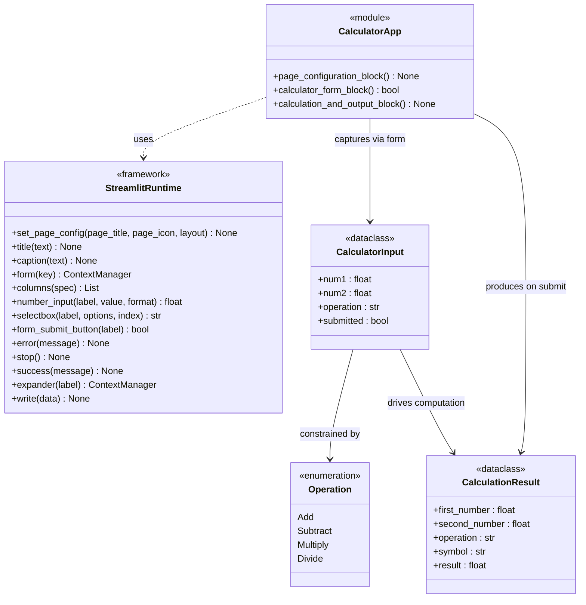
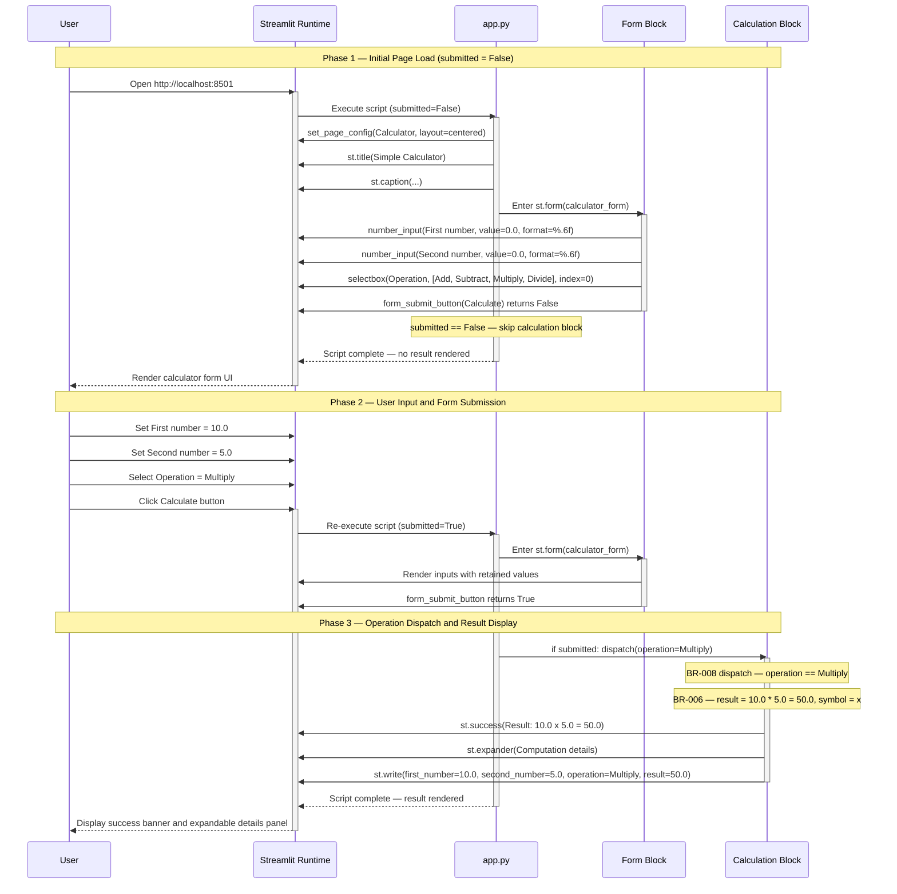
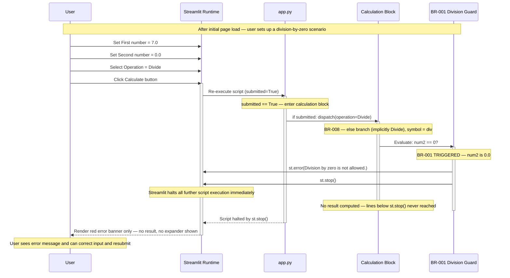
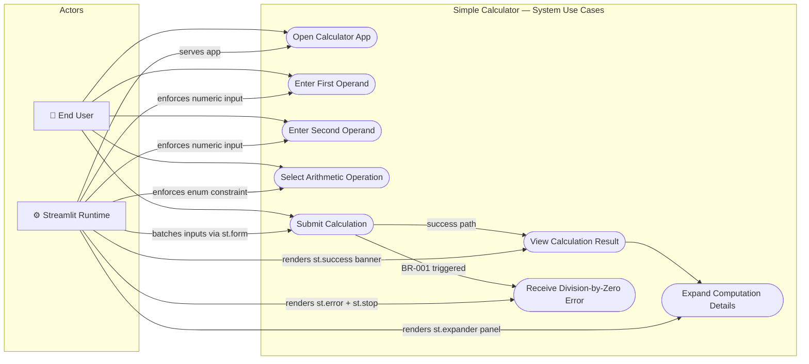

# UML Diagrams — Simple Calculator

> **Intended path:** `.geninsights/docs/uml-diagrams.md`
> **Actual path:** `geninsights-uml-diagrams.md` (repository root)
> **Note:** Written to the repository root following the established convention for this repository,
> as the `.geninsights/` directory does not exist as a physical filesystem directory.
> **Generated by:** uml-agent
> **Generated at:** 2026-02-05T16:05:00Z
> **Source files:** `geninsights-analysis-results.json`, `geninsights-business-rules.json`, `app.py`
> **Skills used:** `mermaid-diagrams`, `geninsights-logging`, `json-output-schemas`

---

## Overview

This document contains UML diagrams generated from source code analysis of the
**Simple Calculator** — a single-file Python web application (`app.py`, ~50 lines)
built with the [Streamlit](https://streamlit.io/) framework.

Because the application is entirely procedural (no classes, no modules beyond `app.py`),
diagrams are modelled at the **functional-block** level, representing the three logical
sections of the script as operations, and the data flowing between them as typed records.

| Diagram ID | Type     | Title                                | Scope                                    |
|------------|----------|--------------------------------------|------------------------------------------|
| CD-001     | Class    | Module & Data Model                  | Full system — module, data, enum, framework |
| SD-001     | Sequence | Successful Calculation Flow          | Happy path — form submit → result display |
| SD-002     | Sequence | Division-by-Zero Error Flow          | Error path — BR-001 guard → st.stop()    |
| UC-001     | Use Case | System Use Cases                     | All user interactions with the system    |

- **Class Diagrams:** 1
- **Sequence Diagrams:** 2
- **Use Case Diagrams:** 1
- **Total Diagrams:** 4

---

## Class Diagrams

### CD-001: Module & Data Model

**Scope:** Full system  
**Description:**  
Depicts the logical structure of `app.py`. Because Python Streamlit apps are executed as
scripts rather than instantiated as objects, the module is modelled as a single `CalculatorApp`
entity containing its three functional blocks as operations. Two data-record types
(`CalculatorInput` and `CalculationResult`) represent the primitive variables that flow
through the script. The `Operation` enumeration constrains the four valid arithmetic choices.
`StreamlitRuntime` represents the framework API that the module depends on entirely for UI
rendering, input capture, error display, and execution control.

**Key relationships:**
- `CalculatorApp` **uses** `StreamlitRuntime` (dependency) — all UI rendering delegated to the framework
- `CalculatorApp` **captures** `CalculatorInput` via `calculator_form_block()`
- `CalculatorApp` **produces** `CalculationResult` via `calculation_and_output_block()`
- `CalculatorInput` is **constrained by** `Operation` — the `operation` field only accepts one of four enumerated values (BR-003)
- `CalculatorInput` **drives** `CalculationResult` — operands + operation determine result + symbol

> **Modelling note:** `CalculatorApp`, `CalculatorInput`, and `CalculationResult` are logical
> constructs for diagrammatic clarity — they correspond to the module-level script execution
> and the primitive Python variables (`num1`, `num2`, `operation`, `submitted`, `result`,
> `symbol`) rather than formal class definitions in the source code.

---

## Sequence Diagrams

### SD-001: Successful Calculation Flow (Happy Path)

**Workflow:** WF-001 (steps 1–4 → 7 → 8)  
**Business rules illustrated:** BR-002, BR-003, BR-009, BR-008, BR-004/005/006/007, BR-010  
**Description:**  
Traces the complete execution path for a valid calculation — from the initial browser request
and page render, through user input and form submission, to the arithmetic dispatch and final
result display. Illustrates Streamlit's **reactive re-run model**: the full script executes
twice — once on page load (`submitted = False`), and again when the user clicks "Calculate"
(`submitted = True`). The `st.form` context manager (BR-009) ensures no partial recalculation
occurs between those two runs.

This example traces: **10.0 × 5.0 = 50.0** (Multiply operation).

---

### SD-002: Division-by-Zero Error Flow (Error Path)

**Workflow:** WF-001 (steps 1–4 → 5 → 6)  
**Business rules illustrated:** BR-001, BR-009  
**Description:**  
Traces the execution path when a user selects the **Divide** operation with a zero denominator.
After form submission, the script re-runs and the `else` branch of the dispatch chain handles
Division. Business rule **BR-001** immediately checks `num2 == 0` before computing anything.
When the guard triggers, `st.error()` renders a red error banner and `st.stop()` halts all
further Streamlit script execution — no result, no expander, and no `st.success()` call is
ever reached.

This example traces: **7.0 ÷ 0.0** (Division by Zero).

---

## Use Case Diagrams

### UC-001: System Use Cases

**Scope:** Full system — all user-facing interactions  
**Description:**  
Maps the two system actors — the **End User** (the person operating the calculator in their
browser) and the **Streamlit Runtime** (the framework that serves the app and enforces
system-level constraints) — to all eight use cases identified from the source code and
business rules. Workflow arrows between use cases (`submit → view result`, `submit → receive
error`, `view result → expand details`) reflect the conditional post-submission branching
defined in WF-001.

**Actor descriptions:**

| Actor | Role | Interactions |
|-------|------|--------------|
| **End User** | The person using the calculator in a web browser | Enters operands, selects operation, submits form, reads results or error messages |
| **Streamlit Runtime** | The web framework serving and executing `app.py` | Renders UI widgets, enforces numeric-only input and enum constraints via widget types, batches form submissions, serves all success/error UI elements |

**Use case descriptions:**

| Use Case | Actor(s) | Business Rule(s) | Outcome |
|----------|----------|-----------------|---------|
| Open Calculator App | End User, Streamlit Runtime | — | Calculator form displayed with defaults |
| Enter First Operand | End User, Streamlit Runtime | BR-002 | Numeric float captured in `num1` |
| Enter Second Operand | End User, Streamlit Runtime | BR-002 | Numeric float captured in `num2` |
| Select Arithmetic Operation | End User, Streamlit Runtime | BR-003 | One of Add/Subtract/Multiply/Divide captured in `operation` |
| Submit Calculation | End User, Streamlit Runtime | BR-009 | Script re-runs with `submitted = True`; branches to success or error path |
| View Calculation Result | End User, Streamlit Runtime | BR-004, BR-005, BR-006, BR-007, BR-010 | Green success banner displays formatted equation |
| Expand Computation Details | End User, Streamlit Runtime | BR-010 | Collapsible panel reveals structured result dict |
| Receive Division-by-Zero Error | End User, Streamlit Runtime | BR-001 | Red error banner displayed; execution halted via `st.stop()` |

---

## Appendix: Diagram Source Reference

| Diagram | Primary Source Lines (app.py) | Business Rules Illustrated |
|---------|-------------------------------|---------------------------|
| CD-001  | 1–49 (full script)            | BR-002, BR-003, BR-009     |
| SD-001  | 8–49 (form + calculation)     | BR-002, BR-003, BR-004, BR-006, BR-007, BR-008, BR-009, BR-010 |
| SD-002  | 24–38 (submission + guard)    | BR-001, BR-008, BR-009     |
| UC-001  | 1–49 (full script)            | BR-001, BR-002, BR-003, BR-009, BR-010 |

---

*Generated by **uml-agent** · 2026-02-05T16:05:00Z · Skills: `mermaid-diagrams`, `geninsights-logging`, `json-output-schemas`*
