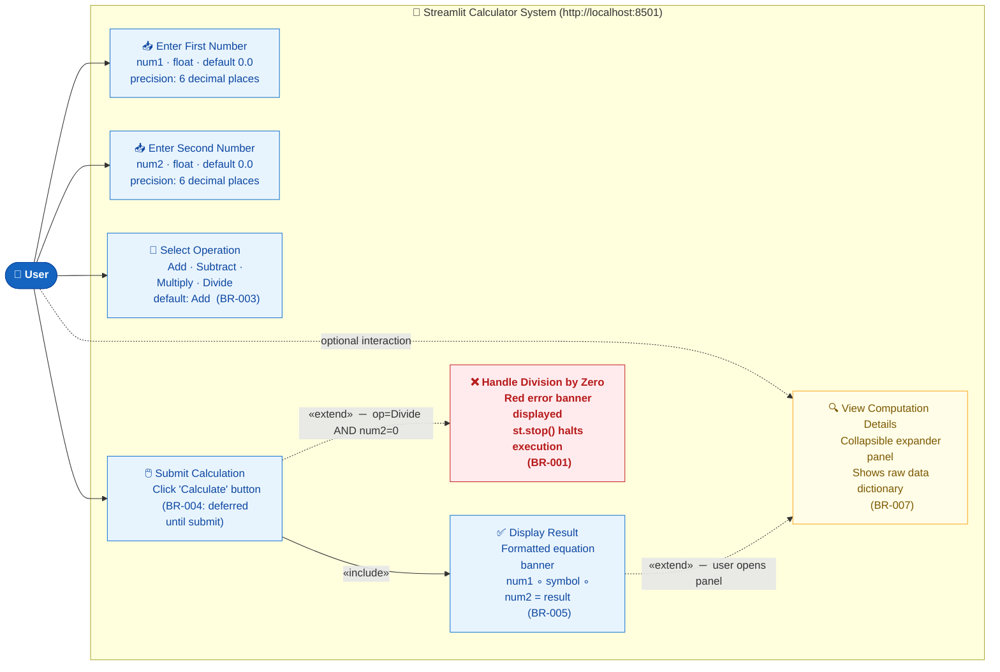
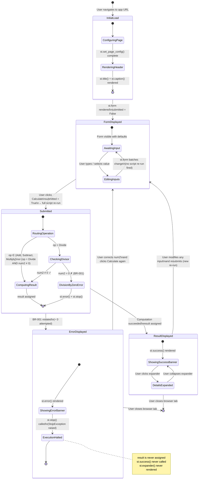

# UML Diagrams — Streamlit Calculator Application

> **Source file**: `app.py` · **Framework**: Streamlit ≥ 1.40.0 · **Language**: Python 3.x  
> **Execution model**: Reactive top-to-bottom re-run on every user interaction  
> All diagrams are rendered in **Mermaid** format (GitHub, GitLab, and compatible Markdown viewers render these natively).

---

## Table of Contents

1. [Use Case Diagram](#1-use-case-diagram) — User interactions & system boundary
2. [Sequence Diagram](#2-sequence-diagram) — Request/response interaction flow
3. [State Diagram](#3-state-diagram) — Application lifecycle states
4. [Activity Diagram](#4-activity-diagram) — Full calculation workflow

---

## 1. Use Case Diagram

**Purpose**: Shows the calculator system boundary, the single external actor (User), all supported use cases, and the `«include»` / `«extend»` relationships between them.

**Key design decisions captured**:
- *Calculate Result* **«includes»** *Display Result* — every successful submission unconditionally produces a result banner (BR-005).
- *Display Computation Details* **«extends»** *Display Result* — the expander panel is optional and only visible after a successful result (BR-007).
- *Handle Division by Zero* **«extends»** *Submit Calculation* — this path fires only when `operation = Divide` AND `num2 = 0` (BR-001).
- The operation selector is constrained to exactly four values by the UI widget itself (BR-005, VR-002).



### Actors

| Actor | Type | Description |
|-------|------|-------------|
| **User** | Primary actor | Human interacting with the calculator via browser |

### Use Cases

| ID | Use Case | Type | Business Rule |
|----|----------|------|---------------|
| UC1 | Enter First Number | Core | BR-002, BR-006 |
| UC2 | Enter Second Number | Core | BR-002, BR-006 |
| UC3 | Select Operation | Core | BR-003, BR-005 |
| UC4 | Submit Calculation | Core | BR-004 |
| UC5 | Display Result | Core (included) | BR-005 |
| UC6 | View Computation Details | Optional (extends UC5) | BR-007 |
| UC7 | Handle Division by Zero | Error (extends UC4) | BR-001 |

---

## 2. Sequence Diagram

**Purpose**: Traces the full request/response lifecycle across four participants — from the user opening the app through to the final result display and optional detail expansion.

**Participants**:
- **User** — the human interacting via a web browser
- **Browser** — the HTTP client rendering the Streamlit-generated HTML/JS
- **Streamlit Server** — the reactive script execution engine (`streamlit run app.py`)
- **Calculator Logic** — the computation block inside `app.py` (`if submitted:` section)

**Critical flows captured**:
- Streamlit's **reactive re-run** model: the entire `app.py` script re-executes on every form submission.
- The `st.form` context **batches** all keystrokes/selections — the server is only called when the Calculate button is clicked.
- The **division-by-zero guard** (`st.error` + `st.stop()`) short-circuits execution before `result` is ever assigned, preventing a `NameError`.
- The computation details expander is shown collapsed and only opens on explicit user interaction.

```mermaid
sequenceDiagram
    actor User as 👤 User
    participant Browser  as 🌐 Browser
    participant Streamlit as ⚡ Streamlit Server
    participant Logic     as 🔢 Calculator Logic

    %% ── Initial Page Load ──────────────────────────────────────────────────
    User->>Browser: Opens http://localhost:8501
    Browser->>Streamlit: GET /

    activate Streamlit
    Note over Streamlit: Full script re-run (1st run)
    Streamlit->>Streamlit: st.set_page_config() — tab title, icon, layout
    Streamlit->>Streamlit: st.title() + st.caption()
    Streamlit->>Streamlit: Render st.form("calculator_form")
    Note over Streamlit: submitted = False — computation block skipped
    Streamlit-->>Browser: HTML page with input form
    deactivate Streamlit

    Browser-->>User: Displays form with num1, num2,<br/>operation selector, Calculate button

    %% ── User Fills the Form ────────────────────────────────────────────────
    Note over User,Browser: Form batches all input changes — no server calls yet
    User->>Browser: Types num1 value (e.g. 10.0)
    User->>Browser: Types num2 value (e.g. 2.0)
    User->>Browser: Selects operation from dropdown (e.g. "Divide")

    %% ── Form Submission ────────────────────────────────────────────────────
    User->>Browser: Clicks "Calculate" button
    Browser->>Streamlit: POST form data (submitted = True)

    activate Streamlit
    Note over Streamlit: Full script re-run triggered
    Streamlit->>Streamlit: st.set_page_config(), st.title(), st.caption()
    Streamlit->>Streamlit: Re-render st.form (with submitted values)
    Streamlit->>Logic: submitted == True → enter computation block

    activate Logic

    %% ── Operation Routing & Guard ──────────────────────────────────────────
    Logic->>Logic: Evaluate operation branch (if/elif/else)

    alt BR-001: operation == "Divide" AND num2 == 0
        Logic->>Streamlit: st.error("Division by zero is not allowed.")
        Logic->>Streamlit: st.stop() — raises StopException
        Note over Logic: result is NEVER assigned
        deactivate Logic
        Streamlit-->>Browser: Page with red error banner only
        deactivate Streamlit
        Browser-->>User: ❌ Red error banner — no result shown

    else Successful computation (all other cases)
        Note over Logic: Routes to correct arithmetic branch
        Logic->>Logic: Compute result & assign symbol
        Note right of Logic: Add:      result = num1 + num2,  symbol = "+"<br/>Subtract: result = num1 - num2,  symbol = "−"<br/>Multiply: result = num1 × num2,  symbol = "×"<br/>Divide:   result = num1 / num2,  symbol = "÷"
        Logic-->>Streamlit: result (float), symbol (string)
        deactivate Logic

        Streamlit->>Streamlit: st.success("Result: {num1} {symbol} {num2} = {result}")
        Streamlit->>Streamlit: Render st.expander("Computation details") — collapsed
        Streamlit-->>Browser: Updated page — success banner + collapsed expander
        deactivate Streamlit
        Browser-->>User: ✅ Green success banner with formatted equation
    end

    %% ── Optional: Expand Computation Details ───────────────────────────────
    opt User wants raw computation data
        User->>Browser: Clicks "Computation details" expander
        Browser-->>User: Panel expands showing dict:<br/>{first_number, second_number, operation, result}
    end

    %% ── Optional: Recalculate ───────────────────────────────────────────────
    opt User modifies inputs and recalculates
        User->>Browser: Changes num1, num2, or operation
        User->>Browser: Clicks "Calculate" again
        Browser->>Streamlit: POST new form data
        Note over Streamlit: Entire sequence repeats from re-run
    end
```

### Key Interaction Notes

| Step | Behaviour | Implementation |
|------|-----------|----------------|
| Initial load | `submitted = False` → computation block is entirely skipped | `if submitted:` gate |
| Form batching | Input changes do **not** trigger server re-runs | `st.form` context |
| Error halt | `st.stop()` raises `StopException` — nothing after it executes | BR-001 enforcement |
| Re-run model | **Every** form submit re-executes `app.py` top-to-bottom | Streamlit reactive model |

---

## 3. State Diagram

**Purpose**: Models all discrete states the application can occupy during its lifecycle, the events that drive state transitions, and the nested sub-states within each major state.

**States summary**:
- **InitialLoad** — one-time startup configuration (page config, header)
- **FormDisplayed** — idle state waiting for user input; all keystrokes are batched internally
- **Submitted** — transient processing state after Calculate is clicked; forks to success or error
- **ResultDisplayed** — stable success state showing the equation banner; supports expander toggle
- **ErrorDisplayed** — error state after a division-by-zero attempt; `st.stop()` prevents any further rendering



### State Reference

| State | Description | Entry Event | Exit Event |
|-------|-------------|-------------|------------|
| **InitialLoad** | One-time page configuration and header rendering | App URL opened | Form rendered |
| **FormDisplayed** | Idle — waiting for user to fill and submit form | Script re-run with `submitted=False` | Calculate clicked |
| **Submitted** | Transient — routing operation, executing arithmetic | Calculate clicked | Computation succeeds or fails |
| **ResultDisplayed** | Success — showing formatted equation + expander | Computation succeeded | User modifies & resubmits |
| **ErrorDisplayed** | Error — div-by-zero banner, execution halted by `st.stop()` | BR-001 triggered | User corrects input & resubmits |

---

## 4. Activity Diagram

**Purpose**: Provides a complete end-to-end flowchart of the calculation workflow — from application startup through every branch of the arithmetic routing logic, the division-by-zero guard, result display, and the optional detail expansion panel.

**All seven business rules are traced through this diagram**:
- **BR-001** — Division-by-zero guard with `st.stop()` early-exit path
- **BR-002** — Float inputs with 6 d.p. precision captured in form rendering step
- **BR-003** — Default operation "Add" set during form render
- **BR-004** — Calculation deferred until submit (the `submitted` decision gate)
- **BR-005** — Exactly four operation branches (Add/Subtract/Multiply/Divide)
- **BR-006** — Result shown as formatted equation in `st.success()`
- **BR-007** — Computation details available in collapsible `st.expander()`

```mermaid
flowchart TD
    Start(["🚀 START
    User opens browser at
    http://localhost:8501"])

    %% ── Section 1: Page Setup ─────────────────────────────────────────────
    Start --> PageSetup

    PageSetup["⚙️ PAGE SETUP
    st.set_page_config(
      page_title='Calculator'
      page_icon='🧮'
      layout='centered'
    )
    st.title('Simple Calculator')
    st.caption('Perform quick arithmetic...')"]

    %% ── Section 2: Form Rendering ─────────────────────────────────────────
    PageSetup --> RenderForm

    RenderForm["📋 RENDER INPUT FORM
    st.form('calculator_form')
    ├─ col1: st.number_input('First number')
    │         value=0.0  format='%.6f'  ← BR-002, BR-006
    ├─ col2: st.number_input('Second number')
    │         value=0.0  format='%.6f'  ← BR-002, BR-006
    ├─ st.selectbox('Operation')
    │         options=(Add, Subtract, Multiply, Divide)
    │         index=0 → default='Add'   ← BR-003, BR-005
    └─ st.form_submit_button('Calculate')  ← BR-004"]

    %% ── Section 3: Submission Gate ────────────────────────────────────────
    RenderForm --> SubmitGate

    SubmitGate{"Was 'Calculate'
    clicked?
    submitted == True?
    (BR-004)"}

    SubmitGate -- "❌ No
    (initial load or
    input editing)" --> WaitLoop

    WaitLoop["⏳ AWAIT USER INTERACTION
    Form batches all
    keystrokes / selections
    (no script re-run fired)"]

    WaitLoop --> RenderForm

    %% ── Section 4: Operation Routing ──────────────────────────────────────
    SubmitGate -- "✅ Yes
    (submitted = True)" --> OperationRouter

    OperationRouter{"Which operation
    was selected?
    (BR-005)"}

    %% Add Branch
    OperationRouter -- "Add" --> AddBranch
    AddBranch["➕ ADDITION
    result = num1 + num2
    symbol = '+'"]

    %% Subtract Branch
    OperationRouter -- "Subtract" --> SubtractBranch
    SubtractBranch["➖ SUBTRACTION
    result = num1 − num2
    symbol = '−'"]

    %% Multiply Branch
    OperationRouter -- "Multiply" --> MultiplyBranch
    MultiplyBranch["✖️ MULTIPLICATION
    result = num1 × num2
    symbol = '×'"]

    %% Divide Branch (with guard)
    OperationRouter -- "Divide" --> DivideGuard

    DivideGuard{"num2 == 0 ?
    BR-001 Guard
    (divisor check)"}

    %% Division-by-Zero Error Path
    DivideGuard -- "⚠️ Yes
    (num2 = 0)" --> ShowError

    ShowError["❌ DISPLAY ERROR
    st.error(
      'Division by zero
       is not allowed.'
    )"]

    ShowError --> HaltExecution

    HaltExecution["🛑 HALT EXECUTION
    st.stop()
    Raises StopException
    ─────────────────────
    • result  → NEVER assigned
    • st.success()  → NOT called
    • st.expander() → NOT reached"]

    HaltExecution --> ErrorEnd(["⛔ END — Error State
    User must correct num2
    and resubmit"])

    %% Division Success Path
    DivideGuard -- "✅ No
    (num2 ≠ 0)" --> DivideBranch

    DivideBranch["➗ DIVISION
    symbol = '÷'
    result = num1 / num2"]

    %% ── Section 5: Merge & Display Result ─────────────────────────────────
    AddBranch      --> ShowResult
    SubtractBranch --> ShowResult
    MultiplyBranch --> ShowResult
    DivideBranch   --> ShowResult

    ShowResult["✅ DISPLAY RESULT  (BR-005, BR-006)
    st.success(
      f'Result: {num1} {symbol} {num2} = {result}'
    )
    ─────────────────────────────────────────
    Example: 'Result: 10.0 ÷ 2.0 = 5.0'"]

    %% ── Section 6: Computation Details Expander ───────────────────────────
    ShowResult --> RenderExpander

    RenderExpander["📦 RENDER EXPANDER  (BR-007)
    st.expander('Computation details')
    Panel is COLLAPSED by default"]

    RenderExpander --> ExpanderGate

    ExpanderGate{"Does the user
    click to expand
    the details panel?
    (optional — BR-007)"}

    ExpanderGate -- "❌ No
    (stays collapsed)" --> SkipDetails

    SkipDetails["⏩ Skip details panel
    (clean UI maintained)"]

    ExpanderGate -- "✅ Yes
    (user clicks expander)" --> ShowDetails

    ShowDetails["🔍 SHOW COMPUTATION DETAILS
    st.write({
      'first_number' : num1,
      'second_number': num2,
      'operation'    : operation,
      'result'       : result
    })"]

    ShowDetails --> NormalEnd
    SkipDetails  --> NormalEnd

    NormalEnd(["🏁 END — Result Displayed
    Form remains active;
    user may recalculate"])

    %% ── Styling ───────────────────────────────────────────────────────────
    classDef startEndStyle  fill:#1565C0,stroke:#0D47A1,color:#FFFFFF,font-weight:bold
    classDef processStyle   fill:#E3F2FD,stroke:#1976D2,color:#0D47A1
    classDef decisionStyle  fill:#FFF8E1,stroke:#F9A825,color:#6D4C00,font-weight:bold
    classDef errorStyle     fill:#FFCDD2,stroke:#C62828,color:#B71C1C,font-weight:bold
    classDef haltStyle      fill:#EF9A9A,stroke:#D32F2F,color:#7F0000,font-weight:bold
    classDef successStyle   fill:#C8E6C9,stroke:#388E3C,color:#1B5E20,font-weight:bold
    classDef optionalStyle  fill:#FFF9C4,stroke:#F9A825,color:#6D4C00
    classDef errorEndStyle  fill:#D32F2F,stroke:#B71C1C,color:#FFFFFF,font-weight:bold
    classDef normalEndStyle fill:#1B5E20,stroke:#0A3D0A,color:#FFFFFF,font-weight:bold

    class Start startEndStyle
    class PageSetup,RenderForm,WaitLoop,AddBranch,SubtractBranch,MultiplyBranch,DivideBranch processStyle
    class SubmitGate,OperationRouter,DivideGuard,ExpanderGate decisionStyle
    class ShowError errorStyle
    class HaltExecution haltStyle
    class ShowResult successStyle
    class RenderExpander,ShowDetails,SkipDetails optionalStyle
    class ErrorEnd errorEndStyle
    class NormalEnd normalEndStyle
```



### Business Rules Traced in Activity Diagram

| Business Rule | Where Applied in Diagram |
|---------------|--------------------------|
| **BR-001** — Division by zero prohibited | `DivideGuard` decision → `ShowError` + `HaltExecution` error path |
| **BR-002** — Float inputs, 6 d.p. precision | `RenderForm` — `format='%.6f'` on both `st.number_input` widgets |
| **BR-003** — Default operation is "Add" | `RenderForm` — `index=0` on `st.selectbox` |
| **BR-004** — Calculation deferred until submit | `SubmitGate` decision — guards the entire computation block |
| **BR-005** — Exactly four operations supported | `OperationRouter` — four discrete branches only |
| **BR-006** — Result as formatted equation | `ShowResult` — `st.success(f"Result: {num1} {symbol} {num2} = {result}")` |
| **BR-007** — Computation details on demand | `RenderExpander` + `ShowDetails` — collapsible panel, hidden by default |

---

## Diagram Summary

| Diagram | Type | Primary Question Answered |
|---------|------|---------------------------|
| [Use Case](#1-use-case-diagram) | `flowchart LR` | *Who* uses the system and *what* can they do? |
| [Sequence](#2-sequence-diagram) | `sequenceDiagram` | *How* do components interact across time? |
| [State](#3-state-diagram) | `stateDiagram-v2` | *What states* does the app move through? |
| [Activity](#4-activity-diagram) | `flowchart TD` | *What steps* execute during a calculation? |

---

*Generated by uml-generator agent from `app.py` · `analysis_results.json` · `business_rules_extractor_analysis.json`*
